cola Report for Consensus Partitioning
==================

**Date**: 2019-12-05 00:07:11 CET, **cola version**: 1.3.2

----------------------------------------------------------------

<style type='text/css'>

body, td, th {
   font-family: Arial,Helvetica,sans-serif;
   background-color: white;
   font-size: 13px;
  max-width: 800px;
  margin: auto;
  margin-left:210px;
  padding: 0px 10px 0px 10px;
  border-left: 1px solid #EEEEEE;
  line-height: 150%;
}

tt, code, pre {
   font-family: 'DejaVu Sans Mono', 'Droid Sans Mono', 'Lucida Console', Consolas, Monaco, 

monospace;
}

h1 {
   font-size:2.2em;
}

h2 {
   font-size:1.8em;
}

h3 {
   font-size:1.4em;
}

h4 {
   font-size:1.0em;
}

h5 {
   font-size:0.9em;
}

h6 {
   font-size:0.8em;
}

a {
  text-decoration: none;
  color: #0366d6;
}

a:hover {
  text-decoration: underline;
}

a:visited {
   color: #0366d6;
}

pre, img {
  max-width: 100%;
}
pre {
  overflow-x: auto;
}
pre code {
   display: block; padding: 0.5em;
}

code {
  font-size: 92%;
  border: 1px solid #ccc;
}

code[class] {
  background-color: #F8F8F8;
}

table, td, th {
  border: 1px solid #ccc;
}

blockquote {
   color:#666666;
   margin:0;
   padding-left: 1em;
   border-left: 0.5em #EEE solid;
}

hr {
   height: 0px;
   border-bottom: none;
   border-top-width: thin;
   border-top-style: dotted;
   border-top-color: #999999;
}

@media print {
   * {
      background: transparent !important;
      color: black !important;
      filter:none !important;
      -ms-filter: none !important;
   }

   body {
      font-size:12pt;
      max-width:100%;
   }

   a, a:visited {
      text-decoration: underline;
   }

   hr {
      visibility: hidden;
      page-break-before: always;
   }

   pre, blockquote {
      padding-right: 1em;
      page-break-inside: avoid;
   }

   tr, img {
      page-break-inside: avoid;
   }

   img {
      max-width: 100% !important;
   }

   @page :left {
      margin: 15mm 20mm 15mm 10mm;
   }

   @page :right {
      margin: 15mm 10mm 15mm 20mm;
   }

   p, h2, h3 {
      orphans: 3; widows: 3;
   }

   h2, h3 {
      page-break-after: avoid;
   }
}
</style>


## Summary


All available functions which can be applied to this `res_list` object:


```r
res_list
```

```
#> A 'ConsensusPartitionList' object with 24 methods.
#>   On a matrix with 9427 rows and 77 columns.
#>   Top rows are extracted by 'SD, CV, MAD, ATC' methods.
#>   Subgroups are detected by 'hclust, kmeans, skmeans, pam, mclust, NMF' method.
#>   Number of partitions are tried for k = 2, 3, 4, 5, 6.
#>   Performed in total 30000 partitions by row resampling.
#> 
#> Following methods can be applied to this 'ConsensusPartitionList' object:
#>  [1] "cola_report"           "collect_classes"       "collect_plots"         "collect_stats"        
#>  [5] "colnames"              "functional_enrichment" "get_anno_col"          "get_anno"             
#>  [9] "get_classes"           "get_matrix"            "get_membership"        "get_stats"            
#> [13] "is_best_k"             "is_stable_k"           "ncol"                  "nrow"                 
#> [17] "rownames"              "show"                  "suggest_best_k"        "test_to_known_factors"
#> [21] "top_rows_heatmap"      "top_rows_overlap"     
#> 
#> You can get result for a single method by, e.g. object["SD", "hclust"] or object["SD:hclust"]
#> or a subset of methods by object[c("SD", "CV")], c("hclust", "kmeans")]
```

The call of `run_all_consensus_partition_methods()` was:


```
#> run_all_consensus_partition_methods(data = mat, mc.cores = 4)
```

Dimension of the input matrix:


```r
mat = get_matrix(res_list)
dim(mat)
```

```
#> [1] 9427   77
```

### Density distribution

The density distribution for each sample is visualized as in one column in the
following heatmap. The clustering is based on the distance which is the
Kolmogorov-Smirnov statistic between two distributions.


```r
library(ComplexHeatmap)
densityHeatmap(mat, ylab = "value", cluster_columns = TRUE, show_column_names = FALSE,
    mc.cores = 4)
```

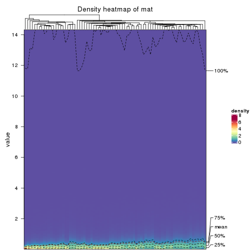


### Suggest the best k


Folowing table shows the best `k` (number of partitions) for each combination
of top-value methods and partition methods. Clicking on the method name in
the table goes to the section for a single combination of methods.

[The cola vignette](http://bioconductor.org/packages/devel/bioc/vignettes/cola/inst/doc/cola.html#toc_13)
explains the definition of the metrics used for determining the best
number of partitions.


```r
suggest_best_k(res_list)
```


|                            | The best k| 1-PAC| Mean silhouette| Concordance|   |Optional k |
|:---------------------------|----------:|-----:|---------------:|-----------:|:--|:----------|
|[SD:mclust](#SD-mclust)     |          2| 1.000|           0.963|       0.984|** |           |
|[CV:kmeans](#CV-kmeans)     |          2| 1.000|           0.996|       0.998|** |           |
|[MAD:mclust](#MAD-mclust)   |          2| 1.000|           0.981|       0.991|** |           |
|[ATC:pam](#ATC-pam)         |          2| 1.000|           0.985|       0.993|** |           |
|[SD:skmeans](#SD-skmeans)   |          3| 0.985|           0.951|       0.977|** |2          |
|[MAD:skmeans](#MAD-skmeans) |          3| 0.984|           0.946|       0.976|** |2          |
|[CV:NMF](#CV-NMF)           |          3| 0.950|           0.898|       0.963|** |2          |
|[CV:pam](#CV-pam)           |          2| 0.946|           0.954|       0.980|*  |           |
|[CV:skmeans](#CV-skmeans)   |          3| 0.943|           0.934|       0.969|*  |2          |
|[SD:NMF](#SD-NMF)           |          3| 0.924|           0.910|       0.963|*  |2          |
|[MAD:NMF](#MAD-NMF)         |          3| 0.904|           0.907|       0.959|*  |2          |
|[ATC:skmeans](#ATC-skmeans) |          3| 0.903|           0.876|       0.949|*  |2          |
|[ATC:kmeans](#ATC-kmeans)   |          4| 0.902|           0.915|       0.951|*  |           |
|[MAD:kmeans](#MAD-kmeans)   |          4| 0.901|           0.932|       0.943|*  |           |
|[ATC:NMF](#ATC-NMF)         |          2| 0.890|           0.928|       0.969|   |           |
|[SD:kmeans](#SD-kmeans)     |          2| 0.808|           0.964|       0.981|   |           |
|[MAD:pam](#MAD-pam)         |          2| 0.793|           0.882|       0.951|   |           |
|[SD:pam](#SD-pam)           |          2| 0.791|           0.899|       0.956|   |           |
|[CV:mclust](#CV-mclust)     |          2| 0.785|           0.930|       0.959|   |           |
|[ATC:mclust](#ATC-mclust)   |          2| 0.653|           0.933|       0.952|   |           |
|[ATC:hclust](#ATC-hclust)   |          4| 0.592|           0.733|       0.810|   |           |
|[CV:hclust](#CV-hclust)     |          3| 0.568|           0.742|       0.795|   |           |
|[MAD:hclust](#MAD-hclust)   |          2| 0.430|           0.838|       0.903|   |           |
|[SD:hclust](#SD-hclust)     |          2| 0.430|           0.837|       0.907|   |           |

\*\*: 1-PAC > 0.95, \*: 1-PAC > 0.9


### CDF of consensus matrices

Cumulative distribution function curves of consensus matrix for all methods.


```r
collect_plots(res_list, fun = plot_ecdf)
```


### Consensus heatmap

Consensus heatmaps for all methods. ([What is a consensus heatmap?](http://bioconductor.org/packages/devel/bioc/vignettes/cola/inst/doc/cola.html#toc_9))


<style type='text/css'>


.ui-helper-hidden {
	display: none;
}
.ui-helper-hidden-accessible {
	border: 0;
	clip: rect(0 0 0 0);
	height: 1px;
	margin: -1px;
	overflow: hidden;
	padding: 0;
	position: absolute;
	width: 1px;
}
.ui-helper-reset {
	margin: 0;
	padding: 0;
	border: 0;
	outline: 0;
	line-height: 1.3;
	text-decoration: none;
	font-size: 100%;
	list-style: none;
}
.ui-helper-clearfix:before,
.ui-helper-clearfix:after {
	content: "";
	display: table;
	border-collapse: collapse;
}
.ui-helper-clearfix:after {
	clear: both;
}
.ui-helper-zfix {
	width: 100%;
	height: 100%;
	top: 0;
	left: 0;
	position: absolute;
	opacity: 0;
	filter:Alpha(Opacity=0); 
}

.ui-front {
	z-index: 100;
}


.ui-state-disabled {
	cursor: default !important;
	pointer-events: none;
}


.ui-icon {
	display: inline-block;
	vertical-align: middle;
	margin-top: -.25em;
	position: relative;
	text-indent: -99999px;
	overflow: hidden;
	background-repeat: no-repeat;
}

.ui-widget-icon-block {
	left: 50%;
	margin-left: -8px;
	display: block;
}


.ui-widget-overlay {
	position: fixed;
	top: 0;
	left: 0;
	width: 100%;
	height: 100%;
}
.ui-accordion .ui-accordion-header {
	display: block;
	cursor: pointer;
	position: relative;
	margin: 2px 0 0 0;
	padding: .5em .5em .5em .7em;
	font-size: 100%;
}
.ui-accordion .ui-accordion-content {
	padding: 1em 2.2em;
	border-top: 0;
	overflow: auto;
}
.ui-autocomplete {
	position: absolute;
	top: 0;
	left: 0;
	cursor: default;
}
.ui-menu {
	list-style: none;
	padding: 0;
	margin: 0;
	display: block;
	outline: 0;
}
.ui-menu .ui-menu {
	position: absolute;
}
.ui-menu .ui-menu-item {
	margin: 0;
	cursor: pointer;
	
	list-style-image: url("data:image/gif;base64,R0lGODlhAQABAIAAAAAAAP///yH5BAEAAAAALAAAAAABAAEAAAIBRAA7");
}
.ui-menu .ui-menu-item-wrapper {
	position: relative;
	padding: 3px 1em 3px .4em;
}
.ui-menu .ui-menu-divider {
	margin: 5px 0;
	height: 0;
	font-size: 0;
	line-height: 0;
	border-width: 1px 0 0 0;
}
.ui-menu .ui-state-focus,
.ui-menu .ui-state-active {
	margin: -1px;
}


.ui-menu-icons {
	position: relative;
}
.ui-menu-icons .ui-menu-item-wrapper {
	padding-left: 2em;
}


.ui-menu .ui-icon {
	position: absolute;
	top: 0;
	bottom: 0;
	left: .2em;
	margin: auto 0;
}


.ui-menu .ui-menu-icon {
	left: auto;
	right: 0;
}
.ui-button {
	padding: .4em 1em;
	display: inline-block;
	position: relative;
	line-height: normal;
	margin-right: .1em;
	cursor: pointer;
	vertical-align: middle;
	text-align: center;
	-webkit-user-select: none;
	-moz-user-select: none;
	-ms-user-select: none;
	user-select: none;

	
	overflow: visible;
}

.ui-button,
.ui-button:link,
.ui-button:visited,
.ui-button:hover,
.ui-button:active {
	text-decoration: none;
}


.ui-button-icon-only {
	width: 2em;
	box-sizing: border-box;
	text-indent: -9999px;
	white-space: nowrap;
}


input.ui-button.ui-button-icon-only {
	text-indent: 0;
}


.ui-button-icon-only .ui-icon {
	position: absolute;
	top: 50%;
	left: 50%;
	margin-top: -8px;
	margin-left: -8px;
}

.ui-button.ui-icon-notext .ui-icon {
	padding: 0;
	width: 2.1em;
	height: 2.1em;
	text-indent: -9999px;
	white-space: nowrap;

}

input.ui-button.ui-icon-notext .ui-icon {
	width: auto;
	height: auto;
	text-indent: 0;
	white-space: normal;
	padding: .4em 1em;
}


input.ui-button::-moz-focus-inner,
button.ui-button::-moz-focus-inner {
	border: 0;
	padding: 0;
}
.ui-controlgroup {
	vertical-align: middle;
	display: inline-block;
}
.ui-controlgroup > .ui-controlgroup-item {
	float: left;
	margin-left: 0;
	margin-right: 0;
}
.ui-controlgroup > .ui-controlgroup-item:focus,
.ui-controlgroup > .ui-controlgroup-item.ui-visual-focus {
	z-index: 9999;
}
.ui-controlgroup-vertical > .ui-controlgroup-item {
	display: block;
	float: none;
	width: 100%;
	margin-top: 0;
	margin-bottom: 0;
	text-align: left;
}
.ui-controlgroup-vertical .ui-controlgroup-item {
	box-sizing: border-box;
}
.ui-controlgroup .ui-controlgroup-label {
	padding: .4em 1em;
}
.ui-controlgroup .ui-controlgroup-label span {
	font-size: 80%;
}
.ui-controlgroup-horizontal .ui-controlgroup-label + .ui-controlgroup-item {
	border-left: none;
}
.ui-controlgroup-vertical .ui-controlgroup-label + .ui-controlgroup-item {
	border-top: none;
}
.ui-controlgroup-horizontal .ui-controlgroup-label.ui-widget-content {
	border-right: none;
}
.ui-controlgroup-vertical .ui-controlgroup-label.ui-widget-content {
	border-bottom: none;
}


.ui-controlgroup-vertical .ui-spinner-input {

	
	width: 75%;
	width: calc( 100% - 2.4em );
}
.ui-controlgroup-vertical .ui-spinner .ui-spinner-up {
	border-top-style: solid;
}

.ui-checkboxradio-label .ui-icon-background {
	box-shadow: inset 1px 1px 1px #ccc;
	border-radius: .12em;
	border: none;
}
.ui-checkboxradio-radio-label .ui-icon-background {
	width: 16px;
	height: 16px;
	border-radius: 1em;
	overflow: visible;
	border: none;
}
.ui-checkboxradio-radio-label.ui-checkboxradio-checked .ui-icon,
.ui-checkboxradio-radio-label.ui-checkboxradio-checked:hover .ui-icon {
	background-image: none;
	width: 8px;
	height: 8px;
	border-width: 4px;
	border-style: solid;
}
.ui-checkboxradio-disabled {
	pointer-events: none;
}
.ui-datepicker {
	width: 17em;
	padding: .2em .2em 0;
	display: none;
}
.ui-datepicker .ui-datepicker-header {
	position: relative;
	padding: .2em 0;
}
.ui-datepicker .ui-datepicker-prev,
.ui-datepicker .ui-datepicker-next {
	position: absolute;
	top: 2px;
	width: 1.8em;
	height: 1.8em;
}
.ui-datepicker .ui-datepicker-prev-hover,
.ui-datepicker .ui-datepicker-next-hover {
	top: 1px;
}
.ui-datepicker .ui-datepicker-prev {
	left: 2px;
}
.ui-datepicker .ui-datepicker-next {
	right: 2px;
}
.ui-datepicker .ui-datepicker-prev-hover {
	left: 1px;
}
.ui-datepicker .ui-datepicker-next-hover {
	right: 1px;
}
.ui-datepicker .ui-datepicker-prev span,
.ui-datepicker .ui-datepicker-next span {
	display: block;
	position: absolute;
	left: 50%;
	margin-left: -8px;
	top: 50%;
	margin-top: -8px;
}
.ui-datepicker .ui-datepicker-title {
	margin: 0 2.3em;
	line-height: 1.8em;
	text-align: center;
}
.ui-datepicker .ui-datepicker-title select {
	font-size: 1em;
	margin: 1px 0;
}
.ui-datepicker select.ui-datepicker-month,
.ui-datepicker select.ui-datepicker-year {
	width: 45%;
}
.ui-datepicker table {
	width: 100%;
	font-size: .9em;
	border-collapse: collapse;
	margin: 0 0 .4em;
}
.ui-datepicker th {
	padding: .7em .3em;
	text-align: center;
	font-weight: bold;
	border: 0;
}
.ui-datepicker td {
	border: 0;
	padding: 1px;
}
.ui-datepicker td span,
.ui-datepicker td a {
	display: block;
	padding: .2em;
	text-align: right;
	text-decoration: none;
}
.ui-datepicker .ui-datepicker-buttonpane {
	background-image: none;
	margin: .7em 0 0 0;
	padding: 0 .2em;
	border-left: 0;
	border-right: 0;
	border-bottom: 0;
}
.ui-datepicker .ui-datepicker-buttonpane button {
	float: right;
	margin: .5em .2em .4em;
	cursor: pointer;
	padding: .2em .6em .3em .6em;
	width: auto;
	overflow: visible;
}
.ui-datepicker .ui-datepicker-buttonpane button.ui-datepicker-current {
	float: left;
}


.ui-datepicker.ui-datepicker-multi {
	width: auto;
}
.ui-datepicker-multi .ui-datepicker-group {
	float: left;
}
.ui-datepicker-multi .ui-datepicker-group table {
	width: 95%;
	margin: 0 auto .4em;
}
.ui-datepicker-multi-2 .ui-datepicker-group {
	width: 50%;
}
.ui-datepicker-multi-3 .ui-datepicker-group {
	width: 33.3%;
}
.ui-datepicker-multi-4 .ui-datepicker-group {
	width: 25%;
}
.ui-datepicker-multi .ui-datepicker-group-last .ui-datepicker-header,
.ui-datepicker-multi .ui-datepicker-group-middle .ui-datepicker-header {
	border-left-width: 0;
}
.ui-datepicker-multi .ui-datepicker-buttonpane {
	clear: left;
}
.ui-datepicker-row-break {
	clear: both;
	width: 100%;
	font-size: 0;
}


.ui-datepicker-rtl {
	direction: rtl;
}
.ui-datepicker-rtl .ui-datepicker-prev {
	right: 2px;
	left: auto;
}
.ui-datepicker-rtl .ui-datepicker-next {
	left: 2px;
	right: auto;
}
.ui-datepicker-rtl .ui-datepicker-prev:hover {
	right: 1px;
	left: auto;
}
.ui-datepicker-rtl .ui-datepicker-next:hover {
	left: 1px;
	right: auto;
}
.ui-datepicker-rtl .ui-datepicker-buttonpane {
	clear: right;
}
.ui-datepicker-rtl .ui-datepicker-buttonpane button {
	float: left;
}
.ui-datepicker-rtl .ui-datepicker-buttonpane button.ui-datepicker-current,
.ui-datepicker-rtl .ui-datepicker-group {
	float: right;
}
.ui-datepicker-rtl .ui-datepicker-group-last .ui-datepicker-header,
.ui-datepicker-rtl .ui-datepicker-group-middle .ui-datepicker-header {
	border-right-width: 0;
	border-left-width: 1px;
}


.ui-datepicker .ui-icon {
	display: block;
	text-indent: -99999px;
	overflow: hidden;
	background-repeat: no-repeat;
	left: .5em;
	top: .3em;
}
.ui-dialog {
	position: absolute;
	top: 0;
	left: 0;
	padding: .2em;
	outline: 0;
}
.ui-dialog .ui-dialog-titlebar {
	padding: .4em 1em;
	position: relative;
}
.ui-dialog .ui-dialog-title {
	float: left;
	margin: .1em 0;
	white-space: nowrap;
	width: 90%;
	overflow: hidden;
	text-overflow: ellipsis;
}
.ui-dialog .ui-dialog-titlebar-close {
	position: absolute;
	right: .3em;
	top: 50%;
	width: 20px;
	margin: -10px 0 0 0;
	padding: 1px;
	height: 20px;
}
.ui-dialog .ui-dialog-content {
	position: relative;
	border: 0;
	padding: .5em 1em;
	background: none;
	overflow: auto;
}
.ui-dialog .ui-dialog-buttonpane {
	text-align: left;
	border-width: 1px 0 0 0;
	background-image: none;
	margin-top: .5em;
	padding: .3em 1em .5em .4em;
}
.ui-dialog .ui-dialog-buttonpane .ui-dialog-buttonset {
	float: right;
}
.ui-dialog .ui-dialog-buttonpane button {
	margin: .5em .4em .5em 0;
	cursor: pointer;
}
.ui-dialog .ui-resizable-n {
	height: 2px;
	top: 0;
}
.ui-dialog .ui-resizable-e {
	width: 2px;
	right: 0;
}
.ui-dialog .ui-resizable-s {
	height: 2px;
	bottom: 0;
}
.ui-dialog .ui-resizable-w {
	width: 2px;
	left: 0;
}
.ui-dialog .ui-resizable-se,
.ui-dialog .ui-resizable-sw,
.ui-dialog .ui-resizable-ne,
.ui-dialog .ui-resizable-nw {
	width: 7px;
	height: 7px;
}
.ui-dialog .ui-resizable-se {
	right: 0;
	bottom: 0;
}
.ui-dialog .ui-resizable-sw {
	left: 0;
	bottom: 0;
}
.ui-dialog .ui-resizable-ne {
	right: 0;
	top: 0;
}
.ui-dialog .ui-resizable-nw {
	left: 0;
	top: 0;
}
.ui-draggable .ui-dialog-titlebar {
	cursor: move;
}
.ui-draggable-handle {
	-ms-touch-action: none;
	touch-action: none;
}
.ui-resizable {
	position: relative;
}
.ui-resizable-handle {
	position: absolute;
	font-size: 0.1px;
	display: block;
	-ms-touch-action: none;
	touch-action: none;
}
.ui-resizable-disabled .ui-resizable-handle,
.ui-resizable-autohide .ui-resizable-handle {
	display: none;
}
.ui-resizable-n {
	cursor: n-resize;
	height: 7px;
	width: 100%;
	top: -5px;
	left: 0;
}
.ui-resizable-s {
	cursor: s-resize;
	height: 7px;
	width: 100%;
	bottom: -5px;
	left: 0;
}
.ui-resizable-e {
	cursor: e-resize;
	width: 7px;
	right: -5px;
	top: 0;
	height: 100%;
}
.ui-resizable-w {
	cursor: w-resize;
	width: 7px;
	left: -5px;
	top: 0;
	height: 100%;
}
.ui-resizable-se {
	cursor: se-resize;
	width: 12px;
	height: 12px;
	right: 1px;
	bottom: 1px;
}
.ui-resizable-sw {
	cursor: sw-resize;
	width: 9px;
	height: 9px;
	left: -5px;
	bottom: -5px;
}
.ui-resizable-nw {
	cursor: nw-resize;
	width: 9px;
	height: 9px;
	left: -5px;
	top: -5px;
}
.ui-resizable-ne {
	cursor: ne-resize;
	width: 9px;
	height: 9px;
	right: -5px;
	top: -5px;
}
.ui-progressbar {
	height: 2em;
	text-align: left;
	overflow: hidden;
}
.ui-progressbar .ui-progressbar-value {
	margin: -1px;
	height: 100%;
}
.ui-progressbar .ui-progressbar-overlay {
	background: url("data:image/gif;base64,R0lGODlhKAAoAIABAAAAAP///yH/C05FVFNDQVBFMi4wAwEAAAAh+QQJAQABACwAAAAAKAAoAAACkYwNqXrdC52DS06a7MFZI+4FHBCKoDeWKXqymPqGqxvJrXZbMx7Ttc+w9XgU2FB3lOyQRWET2IFGiU9m1frDVpxZZc6bfHwv4c1YXP6k1Vdy292Fb6UkuvFtXpvWSzA+HycXJHUXiGYIiMg2R6W459gnWGfHNdjIqDWVqemH2ekpObkpOlppWUqZiqr6edqqWQAAIfkECQEAAQAsAAAAACgAKAAAApSMgZnGfaqcg1E2uuzDmmHUBR8Qil95hiPKqWn3aqtLsS18y7G1SzNeowWBENtQd+T1JktP05nzPTdJZlR6vUxNWWjV+vUWhWNkWFwxl9VpZRedYcflIOLafaa28XdsH/ynlcc1uPVDZxQIR0K25+cICCmoqCe5mGhZOfeYSUh5yJcJyrkZWWpaR8doJ2o4NYq62lAAACH5BAkBAAEALAAAAAAoACgAAAKVDI4Yy22ZnINRNqosw0Bv7i1gyHUkFj7oSaWlu3ovC8GxNso5fluz3qLVhBVeT/Lz7ZTHyxL5dDalQWPVOsQWtRnuwXaFTj9jVVh8pma9JjZ4zYSj5ZOyma7uuolffh+IR5aW97cHuBUXKGKXlKjn+DiHWMcYJah4N0lYCMlJOXipGRr5qdgoSTrqWSq6WFl2ypoaUAAAIfkECQEAAQAsAAAAACgAKAAAApaEb6HLgd/iO7FNWtcFWe+ufODGjRfoiJ2akShbueb0wtI50zm02pbvwfWEMWBQ1zKGlLIhskiEPm9R6vRXxV4ZzWT2yHOGpWMyorblKlNp8HmHEb/lCXjcW7bmtXP8Xt229OVWR1fod2eWqNfHuMjXCPkIGNileOiImVmCOEmoSfn3yXlJWmoHGhqp6ilYuWYpmTqKUgAAIfkECQEAAQAsAAAAACgAKAAAApiEH6kb58biQ3FNWtMFWW3eNVcojuFGfqnZqSebuS06w5V80/X02pKe8zFwP6EFWOT1lDFk8rGERh1TTNOocQ61Hm4Xm2VexUHpzjymViHrFbiELsefVrn6XKfnt2Q9G/+Xdie499XHd2g4h7ioOGhXGJboGAnXSBnoBwKYyfioubZJ2Hn0RuRZaflZOil56Zp6iioKSXpUAAAh+QQJAQABACwAAAAAKAAoAAACkoQRqRvnxuI7kU1a1UU5bd5tnSeOZXhmn5lWK3qNTWvRdQxP8qvaC+/yaYQzXO7BMvaUEmJRd3TsiMAgswmNYrSgZdYrTX6tSHGZO73ezuAw2uxuQ+BbeZfMxsexY35+/Qe4J1inV0g4x3WHuMhIl2jXOKT2Q+VU5fgoSUI52VfZyfkJGkha6jmY+aaYdirq+lQAACH5BAkBAAEALAAAAAAoACgAAAKWBIKpYe0L3YNKToqswUlvznigd4wiR4KhZrKt9Upqip61i9E3vMvxRdHlbEFiEXfk9YARYxOZZD6VQ2pUunBmtRXo1Lf8hMVVcNl8JafV38aM2/Fu5V16Bn63r6xt97j09+MXSFi4BniGFae3hzbH9+hYBzkpuUh5aZmHuanZOZgIuvbGiNeomCnaxxap2upaCZsq+1kAACH5BAkBAAEALAAAAAAoACgAAAKXjI8By5zf4kOxTVrXNVlv1X0d8IGZGKLnNpYtm8Lr9cqVeuOSvfOW79D9aDHizNhDJidFZhNydEahOaDH6nomtJjp1tutKoNWkvA6JqfRVLHU/QUfau9l2x7G54d1fl995xcIGAdXqMfBNadoYrhH+Mg2KBlpVpbluCiXmMnZ2Sh4GBqJ+ckIOqqJ6LmKSllZmsoq6wpQAAAh+QQJAQABACwAAAAAKAAoAAAClYx/oLvoxuJDkU1a1YUZbJ59nSd2ZXhWqbRa2/gF8Gu2DY3iqs7yrq+xBYEkYvFSM8aSSObE+ZgRl1BHFZNr7pRCavZ5BW2142hY3AN/zWtsmf12p9XxxFl2lpLn1rseztfXZjdIWIf2s5dItwjYKBgo9yg5pHgzJXTEeGlZuenpyPmpGQoKOWkYmSpaSnqKileI2FAAACH5BAkBAAEALAAAAAAoACgAAAKVjB+gu+jG4kORTVrVhRlsnn2dJ3ZleFaptFrb+CXmO9OozeL5VfP99HvAWhpiUdcwkpBH3825AwYdU8xTqlLGhtCosArKMpvfa1mMRae9VvWZfeB2XfPkeLmm18lUcBj+p5dnN8jXZ3YIGEhYuOUn45aoCDkp16hl5IjYJvjWKcnoGQpqyPlpOhr3aElaqrq56Bq7VAAAOw==");
	height: 100%;
	filter: alpha(opacity=25); 
	opacity: 0.25;
}
.ui-progressbar-indeterminate .ui-progressbar-value {
	background-image: none;
}
.ui-selectable {
	-ms-touch-action: none;
	touch-action: none;
}
.ui-selectable-helper {
	position: absolute;
	z-index: 100;
	border: 1px dotted black;
}
.ui-selectmenu-menu {
	padding: 0;
	margin: 0;
	position: absolute;
	top: 0;
	left: 0;
	display: none;
}
.ui-selectmenu-menu .ui-menu {
	overflow: auto;
	overflow-x: hidden;
	padding-bottom: 1px;
}
.ui-selectmenu-menu .ui-menu .ui-selectmenu-optgroup {
	font-size: 1em;
	font-weight: bold;
	line-height: 1.5;
	padding: 2px 0.4em;
	margin: 0.5em 0 0 0;
	height: auto;
	border: 0;
}
.ui-selectmenu-open {
	display: block;
}
.ui-selectmenu-text {
	display: block;
	margin-right: 20px;
	overflow: hidden;
	text-overflow: ellipsis;
}
.ui-selectmenu-button.ui-button {
	text-align: left;
	white-space: nowrap;
	width: 14em;
}
.ui-selectmenu-icon.ui-icon {
	float: right;
	margin-top: 0;
}
.ui-slider {
	position: relative;
	text-align: left;
}
.ui-slider .ui-slider-handle {
	position: absolute;
	z-index: 2;
	width: 1.2em;
	height: 1.2em;
	cursor: default;
	-ms-touch-action: none;
	touch-action: none;
}
.ui-slider .ui-slider-range {
	position: absolute;
	z-index: 1;
	font-size: .7em;
	display: block;
	border: 0;
	background-position: 0 0;
}


.ui-slider.ui-state-disabled .ui-slider-handle,
.ui-slider.ui-state-disabled .ui-slider-range {
	filter: inherit;
}

.ui-slider-horizontal {
	height: .8em;
}
.ui-slider-horizontal .ui-slider-handle {
	top: -.3em;
	margin-left: -.6em;
}
.ui-slider-horizontal .ui-slider-range {
	top: 0;
	height: 100%;
}
.ui-slider-horizontal .ui-slider-range-min {
	left: 0;
}
.ui-slider-horizontal .ui-slider-range-max {
	right: 0;
}

.ui-slider-vertical {
	width: .8em;
	height: 100px;
}
.ui-slider-vertical .ui-slider-handle {
	left: -.3em;
	margin-left: 0;
	margin-bottom: -.6em;
}
.ui-slider-vertical .ui-slider-range {
	left: 0;
	width: 100%;
}
.ui-slider-vertical .ui-slider-range-min {
	bottom: 0;
}
.ui-slider-vertical .ui-slider-range-max {
	top: 0;
}
.ui-sortable-handle {
	-ms-touch-action: none;
	touch-action: none;
}
.ui-spinner {
	position: relative;
	display: inline-block;
	overflow: hidden;
	padding: 0;
	vertical-align: middle;
}
.ui-spinner-input {
	border: none;
	background: none;
	color: inherit;
	padding: .222em 0;
	margin: .2em 0;
	vertical-align: middle;
	margin-left: .4em;
	margin-right: 2em;
}
.ui-spinner-button {
	width: 1.6em;
	height: 50%;
	font-size: .5em;
	padding: 0;
	margin: 0;
	text-align: center;
	position: absolute;
	cursor: default;
	display: block;
	overflow: hidden;
	right: 0;
}

.ui-spinner a.ui-spinner-button {
	border-top-style: none;
	border-bottom-style: none;
	border-right-style: none;
}
.ui-spinner-up {
	top: 0;
}
.ui-spinner-down {
	bottom: 0;
}
.ui-tabs {
	position: relative;
	padding: .2em;
}
.ui-tabs .ui-tabs-nav {
	margin: 0;
	padding: .2em .2em 0;
}
.ui-tabs .ui-tabs-nav li {
	list-style: none;
	float: left;
	position: relative;
	top: 0;
	margin: 1px .2em 0 0;
	border-bottom-width: 0;
	padding: 0;
	white-space: nowrap;
}
.ui-tabs .ui-tabs-nav .ui-tabs-anchor {
	float: left;
	padding: .5em 1em;
	text-decoration: none;
}
.ui-tabs .ui-tabs-nav li.ui-tabs-active {
	margin-bottom: -1px;
	padding-bottom: 1px;
}
.ui-tabs .ui-tabs-nav li.ui-tabs-active .ui-tabs-anchor,
.ui-tabs .ui-tabs-nav li.ui-state-disabled .ui-tabs-anchor,
.ui-tabs .ui-tabs-nav li.ui-tabs-loading .ui-tabs-anchor {
	cursor: text;
}
.ui-tabs-collapsible .ui-tabs-nav li.ui-tabs-active .ui-tabs-anchor {
	cursor: pointer;
}
.ui-tabs .ui-tabs-panel {
	display: block;
	border-width: 0;
	padding: 1em 1.4em;
	background: none;
}
.ui-tooltip {
	padding: 8px;
	position: absolute;
	z-index: 9999;
	max-width: 300px;
}
body .ui-tooltip {
	border-width: 2px;
}

.ui-widget {
	font-family: Arial,Helvetica,sans-serif;
	font-size: 1em;
}
.ui-widget .ui-widget {
	font-size: 1em;
}
.ui-widget input,
.ui-widget select,
.ui-widget textarea,
.ui-widget button {
	font-family: Arial,Helvetica,sans-serif;
	font-size: 1em;
}
.ui-widget.ui-widget-content {
	border: 1px solid #c5c5c5;
}
.ui-widget-content {
	border: 1px solid #dddddd;
	background: #ffffff;
	color: #333333;
}
.ui-widget-content a {
	color: #333333;
}
.ui-widget-header {
	border: 1px solid #dddddd;
	background: #e9e9e9;
	color: #333333;
	font-weight: bold;
}
.ui-widget-header a {
	color: #333333;
}


.ui-state-default,
.ui-widget-content .ui-state-default,
.ui-widget-header .ui-state-default,
.ui-button,


html .ui-button.ui-state-disabled:hover,
html .ui-button.ui-state-disabled:active {
	border: 1px solid #c5c5c5;
	background: #f6f6f6;
	font-weight: normal;
	color: #454545;
}
.ui-state-default a,
.ui-state-default a:link,
.ui-state-default a:visited,
a.ui-button,
a:link.ui-button,
a:visited.ui-button,
.ui-button {
	color: #454545;
	text-decoration: none;
}
.ui-state-hover,
.ui-widget-content .ui-state-hover,
.ui-widget-header .ui-state-hover,
.ui-state-focus,
.ui-widget-content .ui-state-focus,
.ui-widget-header .ui-state-focus,
.ui-button:hover,
.ui-button:focus {
	border: 1px solid #cccccc;
	background: #ededed;
	font-weight: normal;
	color: #2b2b2b;
}
.ui-state-hover a,
.ui-state-hover a:hover,
.ui-state-hover a:link,
.ui-state-hover a:visited,
.ui-state-focus a,
.ui-state-focus a:hover,
.ui-state-focus a:link,
.ui-state-focus a:visited,
a.ui-button:hover,
a.ui-button:focus {
	color: #2b2b2b;
	text-decoration: none;
}

.ui-visual-focus {
	box-shadow: 0 0 3px 1px rgb(94, 158, 214);
}
.ui-state-active,
.ui-widget-content .ui-state-active,
.ui-widget-header .ui-state-active,
a.ui-button:active,
.ui-button:active,
.ui-button.ui-state-active:hover {
	border: 1px solid #003eff;
	background: #007fff;
	font-weight: normal;
	color: #ffffff;
}
.ui-icon-background,
.ui-state-active .ui-icon-background {
	border: #003eff;
	background-color: #ffffff;
}
.ui-state-active a,
.ui-state-active a:link,
.ui-state-active a:visited {
	color: #ffffff;
	text-decoration: none;
}


.ui-state-highlight,
.ui-widget-content .ui-state-highlight,
.ui-widget-header .ui-state-highlight {
	border: 1px solid #dad55e;
	background: #fffa90;
	color: #777620;
}
.ui-state-checked {
	border: 1px solid #dad55e;
	background: #fffa90;
}
.ui-state-highlight a,
.ui-widget-content .ui-state-highlight a,
.ui-widget-header .ui-state-highlight a {
	color: #777620;
}
.ui-state-error,
.ui-widget-content .ui-state-error,
.ui-widget-header .ui-state-error {
	border: 1px solid #f1a899;
	background: #fddfdf;
	color: #5f3f3f;
}
.ui-state-error a,
.ui-widget-content .ui-state-error a,
.ui-widget-header .ui-state-error a {
	color: #5f3f3f;
}
.ui-state-error-text,
.ui-widget-content .ui-state-error-text,
.ui-widget-header .ui-state-error-text {
	color: #5f3f3f;
}
.ui-priority-primary,
.ui-widget-content .ui-priority-primary,
.ui-widget-header .ui-priority-primary {
	font-weight: bold;
}
.ui-priority-secondary,
.ui-widget-content .ui-priority-secondary,
.ui-widget-header .ui-priority-secondary {
	opacity: .7;
	filter:Alpha(Opacity=70); 
	font-weight: normal;
}
.ui-state-disabled,
.ui-widget-content .ui-state-disabled,
.ui-widget-header .ui-state-disabled {
	opacity: .35;
	filter:Alpha(Opacity=35); 
	background-image: none;
}
.ui-state-disabled .ui-icon {
	filter:Alpha(Opacity=35); 
}


.ui-icon {
	width: 16px;
	height: 16px;
}
.ui-icon,
.ui-widget-content .ui-icon {
	background-image: url("images/ui-icons_444444_256x240.png");
}
.ui-widget-header .ui-icon {
	background-image: url("images/ui-icons_444444_256x240.png");
}
.ui-state-hover .ui-icon,
.ui-state-focus .ui-icon,
.ui-button:hover .ui-icon,
.ui-button:focus .ui-icon {
	background-image: url("images/ui-icons_555555_256x240.png");
}
.ui-state-active .ui-icon,
.ui-button:active .ui-icon {
	background-image: url("images/ui-icons_ffffff_256x240.png");
}
.ui-state-highlight .ui-icon,
.ui-button .ui-state-highlight.ui-icon {
	background-image: url("images/ui-icons_777620_256x240.png");
}
.ui-state-error .ui-icon,
.ui-state-error-text .ui-icon {
	background-image: url("images/ui-icons_cc0000_256x240.png");
}
.ui-button .ui-icon {
	background-image: url("images/ui-icons_777777_256x240.png");
}


.ui-icon-blank { background-position: 16px 16px; }
.ui-icon-caret-1-n { background-position: 0 0; }
.ui-icon-caret-1-ne { background-position: -16px 0; }
.ui-icon-caret-1-e { background-position: -32px 0; }
.ui-icon-caret-1-se { background-position: -48px 0; }
.ui-icon-caret-1-s { background-position: -65px 0; }
.ui-icon-caret-1-sw { background-position: -80px 0; }
.ui-icon-caret-1-w { background-position: -96px 0; }
.ui-icon-caret-1-nw { background-position: -112px 0; }
.ui-icon-caret-2-n-s { background-position: -128px 0; }
.ui-icon-caret-2-e-w { background-position: -144px 0; }
.ui-icon-triangle-1-n { background-position: 0 -16px; }
.ui-icon-triangle-1-ne { background-position: -16px -16px; }
.ui-icon-triangle-1-e { background-position: -32px -16px; }
.ui-icon-triangle-1-se { background-position: -48px -16px; }
.ui-icon-triangle-1-s { background-position: -65px -16px; }
.ui-icon-triangle-1-sw { background-position: -80px -16px; }
.ui-icon-triangle-1-w { background-position: -96px -16px; }
.ui-icon-triangle-1-nw { background-position: -112px -16px; }
.ui-icon-triangle-2-n-s { background-position: -128px -16px; }
.ui-icon-triangle-2-e-w { background-position: -144px -16px; }
.ui-icon-arrow-1-n { background-position: 0 -32px; }
.ui-icon-arrow-1-ne { background-position: -16px -32px; }
.ui-icon-arrow-1-e { background-position: -32px -32px; }
.ui-icon-arrow-1-se { background-position: -48px -32px; }
.ui-icon-arrow-1-s { background-position: -65px -32px; }
.ui-icon-arrow-1-sw { background-position: -80px -32px; }
.ui-icon-arrow-1-w { background-position: -96px -32px; }
.ui-icon-arrow-1-nw { background-position: -112px -32px; }
.ui-icon-arrow-2-n-s { background-position: -128px -32px; }
.ui-icon-arrow-2-ne-sw { background-position: -144px -32px; }
.ui-icon-arrow-2-e-w { background-position: -160px -32px; }
.ui-icon-arrow-2-se-nw { background-position: -176px -32px; }
.ui-icon-arrowstop-1-n { background-position: -192px -32px; }
.ui-icon-arrowstop-1-e { background-position: -208px -32px; }
.ui-icon-arrowstop-1-s { background-position: -224px -32px; }
.ui-icon-arrowstop-1-w { background-position: -240px -32px; }
.ui-icon-arrowthick-1-n { background-position: 1px -48px; }
.ui-icon-arrowthick-1-ne { background-position: -16px -48px; }
.ui-icon-arrowthick-1-e { background-position: -32px -48px; }
.ui-icon-arrowthick-1-se { background-position: -48px -48px; }
.ui-icon-arrowthick-1-s { background-position: -64px -48px; }
.ui-icon-arrowthick-1-sw { background-position: -80px -48px; }
.ui-icon-arrowthick-1-w { background-position: -96px -48px; }
.ui-icon-arrowthick-1-nw { background-position: -112px -48px; }
.ui-icon-arrowthick-2-n-s { background-position: -128px -48px; }
.ui-icon-arrowthick-2-ne-sw { background-position: -144px -48px; }
.ui-icon-arrowthick-2-e-w { background-position: -160px -48px; }
.ui-icon-arrowthick-2-se-nw { background-position: -176px -48px; }
.ui-icon-arrowthickstop-1-n { background-position: -192px -48px; }
.ui-icon-arrowthickstop-1-e { background-position: -208px -48px; }
.ui-icon-arrowthickstop-1-s { background-position: -224px -48px; }
.ui-icon-arrowthickstop-1-w { background-position: -240px -48px; }
.ui-icon-arrowreturnthick-1-w { background-position: 0 -64px; }
.ui-icon-arrowreturnthick-1-n { background-position: -16px -64px; }
.ui-icon-arrowreturnthick-1-e { background-position: -32px -64px; }
.ui-icon-arrowreturnthick-1-s { background-position: -48px -64px; }
.ui-icon-arrowreturn-1-w { background-position: -64px -64px; }
.ui-icon-arrowreturn-1-n { background-position: -80px -64px; }
.ui-icon-arrowreturn-1-e { background-position: -96px -64px; }
.ui-icon-arrowreturn-1-s { background-position: -112px -64px; }
.ui-icon-arrowrefresh-1-w { background-position: -128px -64px; }
.ui-icon-arrowrefresh-1-n { background-position: -144px -64px; }
.ui-icon-arrowrefresh-1-e { background-position: -160px -64px; }
.ui-icon-arrowrefresh-1-s { background-position: -176px -64px; }
.ui-icon-arrow-4 { background-position: 0 -80px; }
.ui-icon-arrow-4-diag { background-position: -16px -80px; }
.ui-icon-extlink { background-position: -32px -80px; }
.ui-icon-newwin { background-position: -48px -80px; }
.ui-icon-refresh { background-position: -64px -80px; }
.ui-icon-shuffle { background-position: -80px -80px; }
.ui-icon-transfer-e-w { background-position: -96px -80px; }
.ui-icon-transferthick-e-w { background-position: -112px -80px; }
.ui-icon-folder-collapsed { background-position: 0 -96px; }
.ui-icon-folder-open { background-position: -16px -96px; }
.ui-icon-document { background-position: -32px -96px; }
.ui-icon-document-b { background-position: -48px -96px; }
.ui-icon-note { background-position: -64px -96px; }
.ui-icon-mail-closed { background-position: -80px -96px; }
.ui-icon-mail-open { background-position: -96px -96px; }
.ui-icon-suitcase { background-position: -112px -96px; }
.ui-icon-comment { background-position: -128px -96px; }
.ui-icon-person { background-position: -144px -96px; }
.ui-icon-print { background-position: -160px -96px; }
.ui-icon-trash { background-position: -176px -96px; }
.ui-icon-locked { background-position: -192px -96px; }
.ui-icon-unlocked { background-position: -208px -96px; }
.ui-icon-bookmark { background-position: -224px -96px; }
.ui-icon-tag { background-position: -240px -96px; }
.ui-icon-home { background-position: 0 -112px; }
.ui-icon-flag { background-position: -16px -112px; }
.ui-icon-calendar { background-position: -32px -112px; }
.ui-icon-cart { background-position: -48px -112px; }
.ui-icon-pencil { background-position: -64px -112px; }
.ui-icon-clock { background-position: -80px -112px; }
.ui-icon-disk { background-position: -96px -112px; }
.ui-icon-calculator { background-position: -112px -112px; }
.ui-icon-zoomin { background-position: -128px -112px; }
.ui-icon-zoomout { background-position: -144px -112px; }
.ui-icon-search { background-position: -160px -112px; }
.ui-icon-wrench { background-position: -176px -112px; }
.ui-icon-gear { background-position: -192px -112px; }
.ui-icon-heart { background-position: -208px -112px; }
.ui-icon-star { background-position: -224px -112px; }
.ui-icon-link { background-position: -240px -112px; }
.ui-icon-cancel { background-position: 0 -128px; }
.ui-icon-plus { background-position: -16px -128px; }
.ui-icon-plusthick { background-position: -32px -128px; }
.ui-icon-minus { background-position: -48px -128px; }
.ui-icon-minusthick { background-position: -64px -128px; }
.ui-icon-close { background-position: -80px -128px; }
.ui-icon-closethick { background-position: -96px -128px; }
.ui-icon-key { background-position: -112px -128px; }
.ui-icon-lightbulb { background-position: -128px -128px; }
.ui-icon-scissors { background-position: -144px -128px; }
.ui-icon-clipboard { background-position: -160px -128px; }
.ui-icon-copy { background-position: -176px -128px; }
.ui-icon-contact { background-position: -192px -128px; }
.ui-icon-image { background-position: -208px -128px; }
.ui-icon-video { background-position: -224px -128px; }
.ui-icon-script { background-position: -240px -128px; }
.ui-icon-alert { background-position: 0 -144px; }
.ui-icon-info { background-position: -16px -144px; }
.ui-icon-notice { background-position: -32px -144px; }
.ui-icon-help { background-position: -48px -144px; }
.ui-icon-check { background-position: -64px -144px; }
.ui-icon-bullet { background-position: -80px -144px; }
.ui-icon-radio-on { background-position: -96px -144px; }
.ui-icon-radio-off { background-position: -112px -144px; }
.ui-icon-pin-w { background-position: -128px -144px; }
.ui-icon-pin-s { background-position: -144px -144px; }
.ui-icon-play { background-position: 0 -160px; }
.ui-icon-pause { background-position: -16px -160px; }
.ui-icon-seek-next { background-position: -32px -160px; }
.ui-icon-seek-prev { background-position: -48px -160px; }
.ui-icon-seek-end { background-position: -64px -160px; }
.ui-icon-seek-start { background-position: -80px -160px; }

.ui-icon-seek-first { background-position: -80px -160px; }
.ui-icon-stop { background-position: -96px -160px; }
.ui-icon-eject { background-position: -112px -160px; }
.ui-icon-volume-off { background-position: -128px -160px; }
.ui-icon-volume-on { background-position: -144px -160px; }
.ui-icon-power { background-position: 0 -176px; }
.ui-icon-signal-diag { background-position: -16px -176px; }
.ui-icon-signal { background-position: -32px -176px; }
.ui-icon-battery-0 { background-position: -48px -176px; }
.ui-icon-battery-1 { background-position: -64px -176px; }
.ui-icon-battery-2 { background-position: -80px -176px; }
.ui-icon-battery-3 { background-position: -96px -176px; }
.ui-icon-circle-plus { background-position: 0 -192px; }
.ui-icon-circle-minus { background-position: -16px -192px; }
.ui-icon-circle-close { background-position: -32px -192px; }
.ui-icon-circle-triangle-e { background-position: -48px -192px; }
.ui-icon-circle-triangle-s { background-position: -64px -192px; }
.ui-icon-circle-triangle-w { background-position: -80px -192px; }
.ui-icon-circle-triangle-n { background-position: -96px -192px; }
.ui-icon-circle-arrow-e { background-position: -112px -192px; }
.ui-icon-circle-arrow-s { background-position: -128px -192px; }
.ui-icon-circle-arrow-w { background-position: -144px -192px; }
.ui-icon-circle-arrow-n { background-position: -160px -192px; }
.ui-icon-circle-zoomin { background-position: -176px -192px; }
.ui-icon-circle-zoomout { background-position: -192px -192px; }
.ui-icon-circle-check { background-position: -208px -192px; }
.ui-icon-circlesmall-plus { background-position: 0 -208px; }
.ui-icon-circlesmall-minus { background-position: -16px -208px; }
.ui-icon-circlesmall-close { background-position: -32px -208px; }
.ui-icon-squaresmall-plus { background-position: -48px -208px; }
.ui-icon-squaresmall-minus { background-position: -64px -208px; }
.ui-icon-squaresmall-close { background-position: -80px -208px; }
.ui-icon-grip-dotted-vertical { background-position: 0 -224px; }
.ui-icon-grip-dotted-horizontal { background-position: -16px -224px; }
.ui-icon-grip-solid-vertical { background-position: -32px -224px; }
.ui-icon-grip-solid-horizontal { background-position: -48px -224px; }
.ui-icon-gripsmall-diagonal-se { background-position: -64px -224px; }
.ui-icon-grip-diagonal-se { background-position: -80px -224px; }


.ui-corner-all,
.ui-corner-top,
.ui-corner-left,
.ui-corner-tl {
	border-top-left-radius: 3px;
}
.ui-corner-all,
.ui-corner-top,
.ui-corner-right,
.ui-corner-tr {
	border-top-right-radius: 3px;
}
.ui-corner-all,
.ui-corner-bottom,
.ui-corner-left,
.ui-corner-bl {
	border-bottom-left-radius: 3px;
}
.ui-corner-all,
.ui-corner-bottom,
.ui-corner-right,
.ui-corner-br {
	border-bottom-right-radius: 3px;
}


.ui-widget-overlay {
	background: #aaaaaa;
	opacity: .3;
	filter: Alpha(Opacity=30); 
}
.ui-widget-shadow {
	-webkit-box-shadow: 0px 0px 5px #666666;
	box-shadow: 0px 0px 5px #666666;
} 
</style>
<script src='js/jquery-1.12.4.js'></script>
<script src='js/jquery-ui.js'></script>

<script>
$( function() {
	$( '#tabs-collect-consensus-heatmap' ).tabs();
} );
</script>
<div id='tabs-collect-consensus-heatmap'>
<ul>
<li><a href='#tab-collect-consensus-heatmap-1'>k = 2</a></li>
<li><a href='#tab-collect-consensus-heatmap-2'>k = 3</a></li>
<li><a href='#tab-collect-consensus-heatmap-3'>k = 4</a></li>
<li><a href='#tab-collect-consensus-heatmap-4'>k = 5</a></li>
<li><a href='#tab-collect-consensus-heatmap-5'>k = 6</a></li>
</ul>
<div id='tab-collect-consensus-heatmap-1'>
<pre><code class="r">collect_plots(res_list, k = 2, fun = consensus_heatmap, mc.cores = 4)
</code></pre>

<p></p>

</div>
<div id='tab-collect-consensus-heatmap-2'>
<pre><code class="r">collect_plots(res_list, k = 3, fun = consensus_heatmap, mc.cores = 4)
</code></pre>

<p></p>

</div>
<div id='tab-collect-consensus-heatmap-3'>
<pre><code class="r">collect_plots(res_list, k = 4, fun = consensus_heatmap, mc.cores = 4)
</code></pre>

<p></p>

</div>
<div id='tab-collect-consensus-heatmap-4'>
<pre><code class="r">collect_plots(res_list, k = 5, fun = consensus_heatmap, mc.cores = 4)
</code></pre>

<p></p>

</div>
<div id='tab-collect-consensus-heatmap-5'>
<pre><code class="r">collect_plots(res_list, k = 6, fun = consensus_heatmap, mc.cores = 4)
</code></pre>

<p></p>

</div>
</div>


### Membership heatmap

Membership heatmaps for all methods. ([What is a membership heatmap?](http://bioconductor.org/packages/devel/bioc/vignettes/cola/inst/doc/cola.html#toc_12))


<script>
$( function() {
	$( '#tabs-collect-membership-heatmap' ).tabs();
} );
</script>
<div id='tabs-collect-membership-heatmap'>
<ul>
<li><a href='#tab-collect-membership-heatmap-1'>k = 2</a></li>
<li><a href='#tab-collect-membership-heatmap-2'>k = 3</a></li>
<li><a href='#tab-collect-membership-heatmap-3'>k = 4</a></li>
<li><a href='#tab-collect-membership-heatmap-4'>k = 5</a></li>
<li><a href='#tab-collect-membership-heatmap-5'>k = 6</a></li>
</ul>
<div id='tab-collect-membership-heatmap-1'>
<pre><code class="r">collect_plots(res_list, k = 2, fun = membership_heatmap, mc.cores = 4)
</code></pre>

<p></p>

</div>
<div id='tab-collect-membership-heatmap-2'>
<pre><code class="r">collect_plots(res_list, k = 3, fun = membership_heatmap, mc.cores = 4)
</code></pre>

<p></p>

</div>
<div id='tab-collect-membership-heatmap-3'>
<pre><code class="r">collect_plots(res_list, k = 4, fun = membership_heatmap, mc.cores = 4)
</code></pre>

<p></p>

</div>
<div id='tab-collect-membership-heatmap-4'>
<pre><code class="r">collect_plots(res_list, k = 5, fun = membership_heatmap, mc.cores = 4)
</code></pre>

<p></p>

</div>
<div id='tab-collect-membership-heatmap-5'>
<pre><code class="r">collect_plots(res_list, k = 6, fun = membership_heatmap, mc.cores = 4)
</code></pre>

<p></p>

</div>
</div>


### Signature heatmap

Signature heatmaps for all methods. ([What is a signature heatmap?](http://bioconductor.org/packages/devel/bioc/vignettes/cola/inst/doc/cola.html#toc_22))


Note in following heatmaps, rows are scaled.


<script>
$( function() {
	$( '#tabs-collect-get-signatures' ).tabs();
} );
</script>
<div id='tabs-collect-get-signatures'>
<ul>
<li><a href='#tab-collect-get-signatures-1'>k = 2</a></li>
<li><a href='#tab-collect-get-signatures-2'>k = 3</a></li>
<li><a href='#tab-collect-get-signatures-3'>k = 4</a></li>
<li><a href='#tab-collect-get-signatures-4'>k = 5</a></li>
<li><a href='#tab-collect-get-signatures-5'>k = 6</a></li>
</ul>
<div id='tab-collect-get-signatures-1'>
<pre><code class="r">collect_plots(res_list, k = 2, fun = get_signatures, mc.cores = 4)
</code></pre>

<p></p>

</div>
<div id='tab-collect-get-signatures-2'>
<pre><code class="r">collect_plots(res_list, k = 3, fun = get_signatures, mc.cores = 4)
</code></pre>

<p></p>

</div>
<div id='tab-collect-get-signatures-3'>
<pre><code class="r">collect_plots(res_list, k = 4, fun = get_signatures, mc.cores = 4)
</code></pre>

<p></p>

</div>
<div id='tab-collect-get-signatures-4'>
<pre><code class="r">collect_plots(res_list, k = 5, fun = get_signatures, mc.cores = 4)
</code></pre>

<p></p>

</div>
<div id='tab-collect-get-signatures-5'>
<pre><code class="r">collect_plots(res_list, k = 6, fun = get_signatures, mc.cores = 4)
</code></pre>

<p></p>

</div>
</div>


### Statistics table

The statistics used for measuring the stability of consensus partitioning.
([How are they
defined?](http://bioconductor.org/packages/devel/bioc/vignettes/cola/inst/doc/cola.html#toc_13))


<script>
$( function() {
	$( '#tabs-get-stats-from-consensus-partition-list' ).tabs();
} );
</script>
<div id='tabs-get-stats-from-consensus-partition-list'>
<ul>
<li><a href='#tab-get-stats-from-consensus-partition-list-1'>k = 2</a></li>
<li><a href='#tab-get-stats-from-consensus-partition-list-2'>k = 3</a></li>
<li><a href='#tab-get-stats-from-consensus-partition-list-3'>k = 4</a></li>
<li><a href='#tab-get-stats-from-consensus-partition-list-4'>k = 5</a></li>
<li><a href='#tab-get-stats-from-consensus-partition-list-5'>k = 6</a></li>
</ul>
<div id='tab-get-stats-from-consensus-partition-list-1'>
<pre><code class="r">get_stats(res_list, k = 2)
</code></pre>

<pre><code>#&gt;             k 1-PAC mean_silhouette concordance area_increased  Rand Jaccard
#&gt; SD:NMF      2 1.000           0.976       0.989          0.503 0.496   0.496
#&gt; CV:NMF      2 1.000           0.981       0.991          0.505 0.496   0.496
#&gt; MAD:NMF     2 1.000           0.978       0.991          0.503 0.496   0.496
#&gt; ATC:NMF     2 0.890           0.928       0.969          0.485 0.518   0.518
#&gt; SD:skmeans  2 1.000           0.994       0.997          0.507 0.494   0.494
#&gt; CV:skmeans  2 0.920           0.937       0.974          0.501 0.500   0.500
#&gt; MAD:skmeans 2 1.000           0.972       0.989          0.506 0.494   0.494
#&gt; ATC:skmeans 2 1.000           0.969       0.986          0.507 0.494   0.494
#&gt; SD:mclust   2 1.000           0.963       0.984          0.478 0.518   0.518
#&gt; CV:mclust   2 0.785           0.930       0.959          0.467 0.518   0.518
#&gt; MAD:mclust  2 1.000           0.981       0.991          0.479 0.518   0.518
#&gt; ATC:mclust  2 0.653           0.933       0.952          0.466 0.504   0.504
#&gt; SD:kmeans   2 0.808           0.964       0.981          0.504 0.494   0.494
#&gt; CV:kmeans   2 1.000           0.996       0.998          0.476 0.524   0.524
#&gt; MAD:kmeans  2 0.802           0.934       0.970          0.502 0.494   0.494
#&gt; ATC:kmeans  2 0.781           0.905       0.953          0.476 0.539   0.539
#&gt; SD:pam      2 0.791           0.899       0.956          0.503 0.494   0.494
#&gt; CV:pam      2 0.946           0.954       0.980          0.374 0.623   0.623
#&gt; MAD:pam     2 0.793           0.882       0.951          0.502 0.494   0.494
#&gt; ATC:pam     2 1.000           0.985       0.993          0.506 0.494   0.494
#&gt; SD:hclust   2 0.430           0.837       0.907          0.449 0.531   0.531
#&gt; CV:hclust   2 0.566           0.795       0.908          0.283 0.771   0.771
#&gt; MAD:hclust  2 0.430           0.838       0.903          0.445 0.531   0.531
#&gt; ATC:hclust  2 0.701           0.804       0.917          0.394 0.576   0.576
</code></pre>

</div>
<div id='tab-get-stats-from-consensus-partition-list-2'>
<pre><code class="r">get_stats(res_list, k = 3)
</code></pre>

<pre><code>#&gt;             k 1-PAC mean_silhouette concordance area_increased  Rand Jaccard
#&gt; SD:NMF      3 0.924           0.910       0.963         0.3127 0.806   0.624
#&gt; CV:NMF      3 0.950           0.898       0.963         0.3149 0.767   0.563
#&gt; MAD:NMF     3 0.904           0.907       0.959         0.3140 0.794   0.603
#&gt; ATC:NMF     3 0.715           0.816       0.912         0.3263 0.778   0.596
#&gt; SD:skmeans  3 0.985           0.951       0.977         0.2889 0.807   0.625
#&gt; CV:skmeans  3 0.943           0.934       0.969         0.3078 0.791   0.602
#&gt; MAD:skmeans 3 0.984           0.946       0.976         0.2890 0.786   0.594
#&gt; ATC:skmeans 3 0.903           0.876       0.949         0.2064 0.889   0.777
#&gt; SD:mclust   3 0.528           0.573       0.773         0.2324 0.981   0.963
#&gt; CV:mclust   3 0.607           0.848       0.863         0.1624 0.843   0.730
#&gt; MAD:mclust  3 0.564           0.580       0.773         0.2212 0.972   0.947
#&gt; ATC:mclust  3 0.752           0.853       0.931         0.2010 0.907   0.815
#&gt; SD:kmeans   3 0.744           0.773       0.888         0.2774 0.800   0.620
#&gt; CV:kmeans   3 0.639           0.798       0.883         0.1969 0.935   0.876
#&gt; MAD:kmeans  3 0.750           0.742       0.897         0.2927 0.756   0.549
#&gt; ATC:kmeans  3 0.793           0.625       0.866         0.3814 0.687   0.487
#&gt; SD:pam      3 0.630           0.810       0.904         0.1883 0.900   0.801
#&gt; CV:pam      3 0.944           0.934       0.976         0.0728 0.976   0.962
#&gt; MAD:pam     3 0.612           0.713       0.851         0.2041 0.885   0.771
#&gt; ATC:pam     3 0.675           0.672       0.869         0.2374 0.882   0.766
#&gt; SD:hclust   3 0.588           0.726       0.873         0.2462 0.896   0.810
#&gt; CV:hclust   3 0.568           0.742       0.795         0.3762 0.606   0.533
#&gt; MAD:hclust  3 0.629           0.750       0.867         0.2875 0.933   0.875
#&gt; ATC:hclust  3 0.522           0.506       0.800         0.4522 0.756   0.603
</code></pre>

</div>
<div id='tab-get-stats-from-consensus-partition-list-3'>
<pre><code class="r">get_stats(res_list, k = 4)
</code></pre>

<pre><code>#&gt;             k 1-PAC mean_silhouette concordance area_increased  Rand Jaccard
#&gt; SD:NMF      4 0.814           0.775       0.896         0.0975 0.880   0.670
#&gt; CV:NMF      4 0.827           0.750       0.879         0.0674 0.960   0.884
#&gt; MAD:NMF     4 0.837           0.791       0.896         0.1017 0.914   0.752
#&gt; ATC:NMF     4 0.599           0.619       0.799         0.1266 0.897   0.730
#&gt; SD:skmeans  4 0.839           0.862       0.924         0.1023 0.916   0.763
#&gt; CV:skmeans  4 0.699           0.674       0.829         0.1063 0.913   0.751
#&gt; MAD:skmeans 4 0.790           0.833       0.903         0.1007 0.923   0.781
#&gt; ATC:skmeans 4 0.853           0.842       0.926         0.0736 0.955   0.887
#&gt; SD:mclust   4 0.645           0.798       0.861         0.1847 0.773   0.564
#&gt; CV:mclust   4 0.503           0.758       0.803         0.2935 0.767   0.532
#&gt; MAD:mclust  4 0.728           0.769       0.878         0.2037 0.766   0.539
#&gt; ATC:mclust  4 0.639           0.603       0.754         0.2342 0.798   0.546
#&gt; SD:kmeans   4 0.887           0.900       0.934         0.1247 0.838   0.594
#&gt; CV:kmeans   4 0.669           0.720       0.826         0.1845 0.792   0.567
#&gt; MAD:kmeans  4 0.901           0.932       0.943         0.1169 0.855   0.621
#&gt; ATC:kmeans  4 0.902           0.915       0.951         0.1125 0.791   0.506
#&gt; SD:pam      4 0.811           0.799       0.914         0.1472 0.874   0.704
#&gt; CV:pam      4 0.860           0.900       0.958         0.0501 0.999   0.998
#&gt; MAD:pam     4 0.770           0.783       0.909         0.1368 0.876   0.702
#&gt; ATC:pam     4 0.799           0.775       0.910         0.1254 0.824   0.591
#&gt; SD:hclust   4 0.597           0.707       0.827         0.0985 0.961   0.916
#&gt; CV:hclust   4 0.883           0.916       0.943         0.3425 0.911   0.835
#&gt; MAD:hclust  4 0.586           0.604       0.770         0.1197 0.942   0.878
#&gt; ATC:hclust  4 0.592           0.733       0.810         0.1904 0.758   0.474
</code></pre>

</div>
<div id='tab-get-stats-from-consensus-partition-list-4'>
<pre><code class="r">get_stats(res_list, k = 5)
</code></pre>

<pre><code>#&gt;             k 1-PAC mean_silhouette concordance area_increased  Rand Jaccard
#&gt; SD:NMF      5 0.744           0.656       0.793         0.0531 0.936   0.775
#&gt; CV:NMF      5 0.777           0.713       0.840         0.0428 0.949   0.844
#&gt; MAD:NMF     5 0.761           0.664       0.811         0.0465 0.952   0.834
#&gt; ATC:NMF     5 0.584           0.543       0.757         0.0530 0.896   0.677
#&gt; SD:skmeans  5 0.722           0.682       0.838         0.0670 0.911   0.700
#&gt; CV:skmeans  5 0.649           0.606       0.796         0.0649 0.916   0.712
#&gt; MAD:skmeans 5 0.702           0.634       0.828         0.0625 0.955   0.841
#&gt; ATC:skmeans 5 0.797           0.740       0.889         0.0479 0.990   0.974
#&gt; SD:mclust   5 0.713           0.715       0.827         0.1001 0.857   0.572
#&gt; CV:mclust   5 0.812           0.870       0.906         0.1252 0.838   0.486
#&gt; MAD:mclust  5 0.721           0.776       0.853         0.0928 0.895   0.655
#&gt; ATC:mclust  5 0.702           0.646       0.826         0.1256 0.827   0.480
#&gt; SD:kmeans   5 0.820           0.777       0.872         0.0675 0.899   0.661
#&gt; CV:kmeans   5 0.669           0.717       0.828         0.0955 0.912   0.715
#&gt; MAD:kmeans  5 0.836           0.795       0.870         0.0677 0.934   0.764
#&gt; ATC:kmeans  5 0.812           0.677       0.792         0.0513 0.943   0.790
#&gt; SD:pam      5 0.705           0.660       0.809         0.0521 0.940   0.816
#&gt; CV:pam      5 0.827           0.870       0.949         0.0230 0.999   0.998
#&gt; MAD:pam     5 0.737           0.653       0.830         0.0517 0.947   0.837
#&gt; ATC:pam     5 0.747           0.721       0.876         0.0208 0.932   0.787
#&gt; SD:hclust   5 0.652           0.610       0.789         0.0691 0.981   0.955
#&gt; CV:hclust   5 0.906           0.910       0.941         0.0457 0.998   0.996
#&gt; MAD:hclust  5 0.648           0.732       0.818         0.0765 0.808   0.563
#&gt; ATC:hclust  5 0.758           0.766       0.866         0.0777 0.967   0.881
</code></pre>

</div>
<div id='tab-get-stats-from-consensus-partition-list-5'>
<pre><code class="r">get_stats(res_list, k = 6)
</code></pre>

<pre><code>#&gt;             k 1-PAC mean_silhouette concordance area_increased  Rand Jaccard
#&gt; SD:NMF      6 0.716           0.606       0.769         0.0357 0.961   0.842
#&gt; CV:NMF      6 0.761           0.651       0.793         0.0309 0.976   0.916
#&gt; MAD:NMF     6 0.711           0.613       0.756         0.0340 0.962   0.858
#&gt; ATC:NMF     6 0.595           0.468       0.688         0.0364 0.947   0.796
#&gt; SD:skmeans  6 0.693           0.587       0.782         0.0335 0.984   0.931
#&gt; CV:skmeans  6 0.653           0.549       0.748         0.0334 0.944   0.780
#&gt; MAD:skmeans 6 0.697           0.636       0.780         0.0373 0.933   0.746
#&gt; ATC:skmeans 6 0.796           0.679       0.850         0.0335 0.976   0.933
#&gt; SD:mclust   6 0.814           0.845       0.893         0.0466 0.993   0.966
#&gt; CV:mclust   6 0.853           0.849       0.863         0.0217 0.928   0.689
#&gt; MAD:mclust  6 0.813           0.841       0.902         0.0464 0.981   0.911
#&gt; ATC:mclust  6 0.736           0.712       0.830         0.0465 0.873   0.518
#&gt; SD:kmeans   6 0.806           0.750       0.855         0.0423 0.965   0.845
#&gt; CV:kmeans   6 0.679           0.682       0.812         0.0405 0.957   0.826
#&gt; MAD:kmeans  6 0.791           0.716       0.818         0.0391 0.964   0.844
#&gt; ATC:kmeans  6 0.813           0.670       0.796         0.0373 0.949   0.780
#&gt; SD:pam      6 0.718           0.745       0.842         0.0346 0.957   0.854
#&gt; CV:pam      6 0.820           0.804       0.929         0.0667 0.957   0.927
#&gt; MAD:pam     6 0.753           0.687       0.818         0.0370 0.964   0.881
#&gt; ATC:pam     6 0.760           0.701       0.867         0.0204 0.974   0.909
#&gt; SD:hclust   6 0.654           0.632       0.793         0.0892 0.824   0.590
#&gt; CV:hclust   6 0.929           0.872       0.921         0.0376 1.000   1.000
#&gt; MAD:hclust  6 0.649           0.723       0.820         0.0489 0.963   0.866
#&gt; ATC:hclust  6 0.743           0.723       0.860         0.0282 0.993   0.973
</code></pre>

</div>
</div>

Following heatmap plots the partition for each combination of methods and the
lightness correspond to the silhouette scores for samples in each method. On
top the consensus subgroup is inferred from all methods by taking the mean
silhouette scores as weight.


<script>
$( function() {
	$( '#tabs-collect-stats-from-consensus-partition-list' ).tabs();
} );
</script>
<div id='tabs-collect-stats-from-consensus-partition-list'>
<ul>
<li><a href='#tab-collect-stats-from-consensus-partition-list-1'>k = 2</a></li>
<li><a href='#tab-collect-stats-from-consensus-partition-list-2'>k = 3</a></li>
<li><a href='#tab-collect-stats-from-consensus-partition-list-3'>k = 4</a></li>
<li><a href='#tab-collect-stats-from-consensus-partition-list-4'>k = 5</a></li>
<li><a href='#tab-collect-stats-from-consensus-partition-list-5'>k = 6</a></li>
</ul>
<div id='tab-collect-stats-from-consensus-partition-list-1'>
<pre><code class="r">collect_stats(res_list, k = 2)
</code></pre>

<p></p>

</div>
<div id='tab-collect-stats-from-consensus-partition-list-2'>
<pre><code class="r">collect_stats(res_list, k = 3)
</code></pre>

<p></p>

</div>
<div id='tab-collect-stats-from-consensus-partition-list-3'>
<pre><code class="r">collect_stats(res_list, k = 4)
</code></pre>

<p></p>

</div>
<div id='tab-collect-stats-from-consensus-partition-list-4'>
<pre><code class="r">collect_stats(res_list, k = 5)
</code></pre>

<p></p>

</div>
<div id='tab-collect-stats-from-consensus-partition-list-5'>
<pre><code class="r">collect_stats(res_list, k = 6)
</code></pre>

<p></p>

</div>
</div>

### Partition from all methods


Collect partitions from all methods:


<script>
$( function() {
	$( '#tabs-collect-classes-from-consensus-partition-list' ).tabs();
} );
</script>
<div id='tabs-collect-classes-from-consensus-partition-list'>
<ul>
<li><a href='#tab-collect-classes-from-consensus-partition-list-1'>k = 2</a></li>
<li><a href='#tab-collect-classes-from-consensus-partition-list-2'>k = 3</a></li>
<li><a href='#tab-collect-classes-from-consensus-partition-list-3'>k = 4</a></li>
<li><a href='#tab-collect-classes-from-consensus-partition-list-4'>k = 5</a></li>
<li><a href='#tab-collect-classes-from-consensus-partition-list-5'>k = 6</a></li>
</ul>
<div id='tab-collect-classes-from-consensus-partition-list-1'>
<pre><code class="r">collect_classes(res_list, k = 2)
</code></pre>

<p></p>

</div>
<div id='tab-collect-classes-from-consensus-partition-list-2'>
<pre><code class="r">collect_classes(res_list, k = 3)
</code></pre>

<p></p>

</div>
<div id='tab-collect-classes-from-consensus-partition-list-3'>
<pre><code class="r">collect_classes(res_list, k = 4)
</code></pre>

<p></p>

</div>
<div id='tab-collect-classes-from-consensus-partition-list-4'>
<pre><code class="r">collect_classes(res_list, k = 5)
</code></pre>

<p></p>

</div>
<div id='tab-collect-classes-from-consensus-partition-list-5'>
<pre><code class="r">collect_classes(res_list, k = 6)
</code></pre>

<p></p>

</div>
</div>


### Top rows overlap


Overlap of top rows from different top-row methods:


<script>
$( function() {
	$( '#tabs-top-rows-overlap-by-euler' ).tabs();
} );
</script>
<div id='tabs-top-rows-overlap-by-euler'>
<ul>
<li><a href='#tab-top-rows-overlap-by-euler-1'>top_n = 943</a></li>
<li><a href='#tab-top-rows-overlap-by-euler-2'>top_n = 1886</a></li>
<li><a href='#tab-top-rows-overlap-by-euler-3'>top_n = 2828</a></li>
<li><a href='#tab-top-rows-overlap-by-euler-4'>top_n = 3771</a></li>
<li><a href='#tab-top-rows-overlap-by-euler-5'>top_n = 4714</a></li>
</ul>
<div id='tab-top-rows-overlap-by-euler-1'>
<pre><code class="r">top_rows_overlap(res_list, top_n = 943, method = &quot;euler&quot;)
</code></pre>

<p></p>

</div>
<div id='tab-top-rows-overlap-by-euler-2'>
<pre><code class="r">top_rows_overlap(res_list, top_n = 1886, method = &quot;euler&quot;)
</code></pre>

<p></p>

</div>
<div id='tab-top-rows-overlap-by-euler-3'>
<pre><code class="r">top_rows_overlap(res_list, top_n = 2828, method = &quot;euler&quot;)
</code></pre>

<p></p>

</div>
<div id='tab-top-rows-overlap-by-euler-4'>
<pre><code class="r">top_rows_overlap(res_list, top_n = 3771, method = &quot;euler&quot;)
</code></pre>

<p></p>

</div>
<div id='tab-top-rows-overlap-by-euler-5'>
<pre><code class="r">top_rows_overlap(res_list, top_n = 4714, method = &quot;euler&quot;)
</code></pre>

<p></p>

</div>
</div>

Also visualize the correspondance of rankings between different top-row methods:


<script>
$( function() {
	$( '#tabs-top-rows-overlap-by-correspondance' ).tabs();
} );
</script>
<div id='tabs-top-rows-overlap-by-correspondance'>
<ul>
<li><a href='#tab-top-rows-overlap-by-correspondance-1'>top_n = 943</a></li>
<li><a href='#tab-top-rows-overlap-by-correspondance-2'>top_n = 1886</a></li>
<li><a href='#tab-top-rows-overlap-by-correspondance-3'>top_n = 2828</a></li>
<li><a href='#tab-top-rows-overlap-by-correspondance-4'>top_n = 3771</a></li>
<li><a href='#tab-top-rows-overlap-by-correspondance-5'>top_n = 4714</a></li>
</ul>
<div id='tab-top-rows-overlap-by-correspondance-1'>
<pre><code class="r">top_rows_overlap(res_list, top_n = 943, method = &quot;correspondance&quot;)
</code></pre>

<p></p>

</div>
<div id='tab-top-rows-overlap-by-correspondance-2'>
<pre><code class="r">top_rows_overlap(res_list, top_n = 1886, method = &quot;correspondance&quot;)
</code></pre>

<p></p>

</div>
<div id='tab-top-rows-overlap-by-correspondance-3'>
<pre><code class="r">top_rows_overlap(res_list, top_n = 2828, method = &quot;correspondance&quot;)
</code></pre>

<p></p>

</div>
<div id='tab-top-rows-overlap-by-correspondance-4'>
<pre><code class="r">top_rows_overlap(res_list, top_n = 3771, method = &quot;correspondance&quot;)
</code></pre>

<p></p>

</div>
<div id='tab-top-rows-overlap-by-correspondance-5'>
<pre><code class="r">top_rows_overlap(res_list, top_n = 4714, method = &quot;correspondance&quot;)
</code></pre>

<p>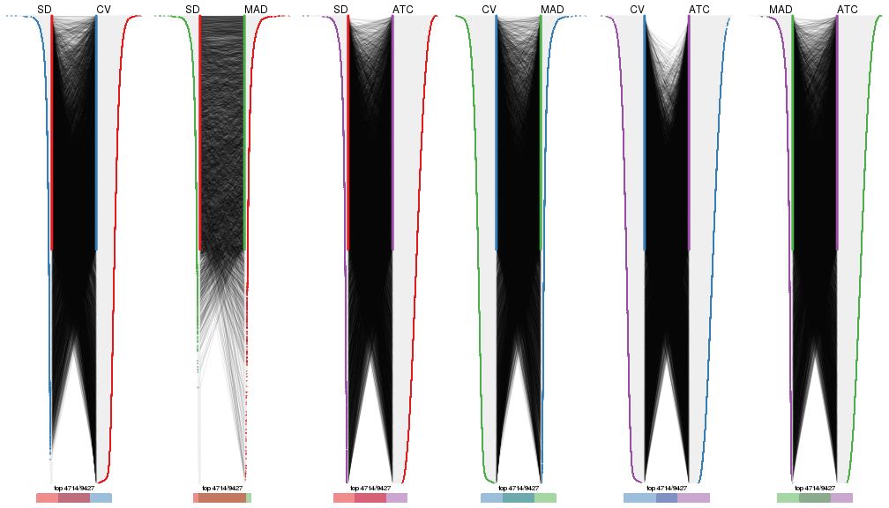</p>

</div>
</div>


Heatmaps of the top rows:


<script>
$( function() {
	$( '#tabs-top-rows-heatmap' ).tabs();
} );
</script>
<div id='tabs-top-rows-heatmap'>
<ul>
<li><a href='#tab-top-rows-heatmap-1'>top_n = 943</a></li>
<li><a href='#tab-top-rows-heatmap-2'>top_n = 1886</a></li>
<li><a href='#tab-top-rows-heatmap-3'>top_n = 2828</a></li>
<li><a href='#tab-top-rows-heatmap-4'>top_n = 3771</a></li>
<li><a href='#tab-top-rows-heatmap-5'>top_n = 4714</a></li>
</ul>
<div id='tab-top-rows-heatmap-1'>
<pre><code class="r">top_rows_heatmap(res_list, top_n = 943)
</code></pre>

<p></p>

</div>
<div id='tab-top-rows-heatmap-2'>
<pre><code class="r">top_rows_heatmap(res_list, top_n = 1886)
</code></pre>

<p></p>

</div>
<div id='tab-top-rows-heatmap-3'>
<pre><code class="r">top_rows_heatmap(res_list, top_n = 2828)
</code></pre>

<p></p>

</div>
<div id='tab-top-rows-heatmap-4'>
<pre><code class="r">top_rows_heatmap(res_list, top_n = 3771)
</code></pre>

<p></p>

</div>
<div id='tab-top-rows-heatmap-5'>
<pre><code class="r">top_rows_heatmap(res_list, top_n = 4714)
</code></pre>

<p></p>

</div>
</div>


 
## Results for each method


---------------------------------------------------


### SD:hclust


The object with results only for a single top-value method and a single partition method 
can be extracted as:

```r
res = res_list["SD", "hclust"]
# you can also extract it by
# res = res_list["SD:hclust"]
```

A summary of `res` and all the functions that can be applied to it:

```r
res
```

```
#> A 'ConsensusPartition' object with k = 2, 3, 4, 5, 6.
#>   On a matrix with 9427 rows and 77 columns.
#>   Top rows (943, 1886, 2828, 3771, 4714) are extracted by 'SD' method.
#>   Subgroups are detected by 'hclust' method.
#>   Performed in total 1250 partitions by row resampling.
#>   Best k for subgroups seems to be 2.
#> 
#> Following methods can be applied to this 'ConsensusPartition' object:
#>  [1] "cola_report"             "collect_classes"         "collect_plots"          
#>  [4] "collect_stats"           "colnames"                "compare_signatures"     
#>  [7] "consensus_heatmap"       "dimension_reduction"     "functional_enrichment"  
#> [10] "get_anno_col"            "get_anno"                "get_classes"            
#> [13] "get_consensus"           "get_matrix"              "get_membership"         
#> [16] "get_param"               "get_signatures"          "get_stats"              
#> [19] "is_best_k"               "is_stable_k"             "membership_heatmap"     
#> [22] "ncol"                    "nrow"                    "plot_ecdf"              
#> [25] "rownames"                "select_partition_number" "show"                   
#> [28] "suggest_best_k"          "test_to_known_factors"
```

`collect_plots()` function collects all the plots made from `res` for all `k` (number of partitions)
into one single page to provide an easy and fast comparison between different `k`.

```r
collect_plots(res)
```


The plots are:

- The first row: a plot of the ECDF (Empirical cumulative distribution
  function) curves of the consensus matrix for each `k` and the heatmap of
  predicted classes for each `k`.
- The second row: heatmaps of the consensus matrix for each `k`.
- The third row: heatmaps of the membership matrix for each `k`.
- The fouth row: heatmaps of the signatures for each `k`.

All the plots in panels can be made by individual functions and they are
plotted later in this section.

`select_partition_number()` produces several plots showing different
statistics for choosing "optimized" `k`. There are following statistics:

- ECDF curves of the consensus matrix for each `k`;
- 1-PAC. [The PAC
  score](https://en.wikipedia.org/wiki/Consensus_clustering#Over-interpretation_potential_of_consensus_clustering)
  measures the proportion of the ambiguous subgrouping.
- Mean silhouette score.
- Concordance. The mean probability of fiting the consensus class ids in all
  partitions.
- Area increased. Denote $A_k$ as the area under the ECDF curve for current
  `k`, the area increased is defined as $A_k - A_{k-1}$.
- Rand index. The percent of pairs of samples that are both in a same cluster
  or both are not in a same cluster in the partition of k and k-1.
- Jaccard index. The ratio of pairs of samples are both in a same cluster in
  the partition of k and k-1 and the pairs of samples are both in a same
  cluster in the partition k or k-1.

The detailed explanations of these statistics can be found in [the cola
vignette](http://bioconductor.org/packages/devel/bioc/vignettes/cola/inst/doc/cola.html#toc_13).

Generally speaking, lower PAC score, higher mean silhouette score or higher
concordance corresponds to better partition. Rand index and Jaccard index
measure how similar the current partition is compared to partition with `k-1`.
If they are too similar, we won't accept `k` is better than `k-1`.

```r
select_partition_number(res)
```


The numeric values for all these statistics can be obtained by `get_stats()`.

```r
get_stats(res)
```

```
#>   k 1-PAC mean_silhouette concordance area_increased  Rand Jaccard
#> 2 2 0.430           0.837       0.907         0.4488 0.531   0.531
#> 3 3 0.588           0.726       0.873         0.2462 0.896   0.810
#> 4 4 0.597           0.707       0.827         0.0985 0.961   0.916
#> 5 5 0.652           0.610       0.789         0.0691 0.981   0.955
#> 6 6 0.654           0.632       0.793         0.0892 0.824   0.590
```

`suggest_best_k()` suggests the best $k$ based on these statistics. The rules are as follows:

- All $k$ with Jaccard index larger than 0.95 are removed because the increase of
  the partition number does not provides enough extra information. If all $k$ are removed,
  the best $k$ is assigned by `NA`.
- For $k$ with 1-PAC larger than 0.9, the maximal $k$ is taken as the "best k". Other $k$ is called "optional k".
- If it does not fit the second rule. The $k$ with the highest vote of highest
  1-PAC, mean silhouette and concordance is taken as the "best k".

```r
suggest_best_k(res)
```

```
#> [1] 2
```


Following shows the table of the partitions (You need to click the **show/hide
code output** link to see it). The membership matrix (columns with name `p*`)
is inferred by
[`clue::cl_consensus()`](https://www.rdocumentation.org/link/cl_consensus?package=clue)
function with the `SE` method. Basically the value in the membership matrix
represents the probability to belong to a certain group. The finall class
label for an item is determined with the group with highest probability it
belongs to.

In `get_classes()` function, the entropy is calculated from the membership
matrix and the silhouette score is calculated from the consensus matrix.


<script>
$( function() {
	$( '#tabs-SD-hclust-get-classes' ).tabs();
} );
</script>
<div id='tabs-SD-hclust-get-classes'>
<ul>
<li><a href='#tab-SD-hclust-get-classes-1'>k = 2</a></li>
<li><a href='#tab-SD-hclust-get-classes-2'>k = 3</a></li>
<li><a href='#tab-SD-hclust-get-classes-3'>k = 4</a></li>
<li><a href='#tab-SD-hclust-get-classes-4'>k = 5</a></li>
<li><a href='#tab-SD-hclust-get-classes-5'>k = 6</a></li>
</ul>

<div id='tab-SD-hclust-get-classes-1'>
<p><a id='tab-SD-hclust-get-classes-1-a' style='color:#0366d6' href='#'>show/hide code output</a></p>
<pre><code class="r">cbind(get_classes(res, k = 2), get_membership(res, k = 2))
</code></pre>

<pre><code>#&gt;           class entropy silhouette    p1    p2
#&gt; SRR944011     2  0.7528     0.7679 0.216 0.784
#&gt; SRR944012     1  0.7883     0.7976 0.764 0.236
#&gt; SRR944014     2  0.0000     0.8950 0.000 1.000
#&gt; SRR944013     2  0.1633     0.8900 0.024 0.976
#&gt; SRR944015     1  0.0000     0.8777 1.000 0.000
#&gt; SRR944016     1  0.6887     0.8566 0.816 0.184
#&gt; SRR944017     2  0.1633     0.8900 0.024 0.976
#&gt; SRR944018     1  0.4022     0.8846 0.920 0.080
#&gt; SRR944019     1  0.6887     0.8564 0.816 0.184
#&gt; SRR944020     1  0.0000     0.8777 1.000 0.000
#&gt; SRR944021     2  0.0000     0.8950 0.000 1.000
#&gt; SRR944022     1  0.0000     0.8777 1.000 0.000
#&gt; SRR944023     2  1.0000     0.0384 0.500 0.500
#&gt; SRR944024     1  0.7883     0.8011 0.764 0.236
#&gt; SRR944026     2  0.0000     0.8950 0.000 1.000
#&gt; SRR944025     2  0.0000     0.8950 0.000 1.000
#&gt; SRR944028     2  0.0000     0.8950 0.000 1.000
#&gt; SRR944029     2  0.6247     0.8204 0.156 0.844
#&gt; SRR944030     2  0.0000     0.8950 0.000 1.000
#&gt; SRR944031     2  0.9944     0.2003 0.456 0.544
#&gt; SRR944032     2  0.0672     0.8939 0.008 0.992
#&gt; SRR944033     2  0.0000     0.8950 0.000 1.000
#&gt; SRR944034     2  0.0000     0.8950 0.000 1.000
#&gt; SRR944036     2  0.6623     0.8080 0.172 0.828
#&gt; SRR944035     2  0.0000     0.8950 0.000 1.000
#&gt; SRR944038     1  0.0000     0.8777 1.000 0.000
#&gt; SRR944037     1  0.2236     0.8877 0.964 0.036
#&gt; SRR944039     1  0.6887     0.8564 0.816 0.184
#&gt; SRR944040     2  0.2778     0.8803 0.048 0.952
#&gt; SRR944041     1  0.6438     0.8656 0.836 0.164
#&gt; SRR944042     2  0.7528     0.7679 0.216 0.784
#&gt; SRR944043     1  0.1414     0.8843 0.980 0.020
#&gt; SRR944044     2  0.0000     0.8950 0.000 1.000
#&gt; SRR944046     2  0.7815     0.7498 0.232 0.768
#&gt; SRR944045     2  0.0000     0.8950 0.000 1.000
#&gt; SRR944047     2  0.0000     0.8950 0.000 1.000
#&gt; SRR944048     1  0.7950     0.7972 0.760 0.240
#&gt; SRR944049     2  0.0000     0.8950 0.000 1.000
#&gt; SRR944050     1  0.6887     0.8566 0.816 0.184
#&gt; SRR944051     2  0.0672     0.8939 0.008 0.992
#&gt; SRR944052     2  0.0000     0.8950 0.000 1.000
#&gt; SRR944053     1  0.0000     0.8777 1.000 0.000
#&gt; SRR944054     2  0.0938     0.8930 0.012 0.988
#&gt; SRR944055     2  0.4815     0.8557 0.104 0.896
#&gt; SRR944056     2  0.0000     0.8950 0.000 1.000
#&gt; SRR944057     1  0.6801     0.8599 0.820 0.180
#&gt; SRR944058     1  0.6801     0.8599 0.820 0.180
#&gt; SRR944059     2  0.7299     0.7813 0.204 0.796
#&gt; SRR944060     1  0.0000     0.8777 1.000 0.000
#&gt; SRR944061     2  0.0000     0.8950 0.000 1.000
#&gt; SRR944062     1  0.3114     0.8874 0.944 0.056
#&gt; SRR944063     1  0.0672     0.8808 0.992 0.008
#&gt; SRR944064     2  0.0000     0.8950 0.000 1.000
#&gt; SRR944065     1  0.2043     0.8872 0.968 0.032
#&gt; SRR944066     1  0.6801     0.8599 0.820 0.180
#&gt; SRR944067     2  0.0000     0.8950 0.000 1.000
#&gt; SRR944068     1  0.0000     0.8777 1.000 0.000
#&gt; SRR944069     2  0.0000     0.8950 0.000 1.000
#&gt; SRR944070     1  0.0000     0.8777 1.000 0.000
#&gt; SRR944071     2  0.7299     0.7810 0.204 0.796
#&gt; SRR944072     1  0.6801     0.8599 0.820 0.180
#&gt; SRR944073     2  0.0000     0.8950 0.000 1.000
#&gt; SRR944075     2  0.4939     0.8535 0.108 0.892
#&gt; SRR944074     2  0.0000     0.8950 0.000 1.000
#&gt; SRR944076     2  0.8016     0.7332 0.244 0.756
#&gt; SRR944077     2  0.0000     0.8950 0.000 1.000
#&gt; SRR944078     2  0.4939     0.8535 0.108 0.892
#&gt; SRR944079     2  0.0000     0.8950 0.000 1.000
#&gt; SRR944080     2  0.0000     0.8950 0.000 1.000
#&gt; SRR944081     2  0.9170     0.5278 0.332 0.668
#&gt; SRR944082     1  0.2236     0.8876 0.964 0.036
#&gt; SRR944083     1  0.6801     0.8599 0.820 0.180
#&gt; SRR944084     2  0.7453     0.7750 0.212 0.788
#&gt; SRR944085     2  0.8207     0.7147 0.256 0.744
#&gt; SRR944086     2  0.6623     0.8087 0.172 0.828
#&gt; SRR944088     2  0.6247     0.8204 0.156 0.844
#&gt; SRR944087     2  0.7376     0.7771 0.208 0.792
</code></pre>

<script>
$('#tab-SD-hclust-get-classes-1-a').parent().next().next().hide();
$('#tab-SD-hclust-get-classes-1-a').click(function(){
  $('#tab-SD-hclust-get-classes-1-a').parent().next().next().toggle();
  return(false);
});
</script>
</div>

<div id='tab-SD-hclust-get-classes-2'>
<p><a id='tab-SD-hclust-get-classes-2-a' style='color:#0366d6' href='#'>show/hide code output</a></p>
<pre><code class="r">cbind(get_classes(res, k = 3), get_membership(res, k = 3))
</code></pre>

<pre><code>#&gt;           class entropy silhouette    p1    p2    p3
#&gt; SRR944011     2  0.6075     0.6665 0.316 0.676 0.008
#&gt; SRR944012     1  0.3572     0.7291 0.900 0.060 0.040
#&gt; SRR944014     2  0.0000     0.8732 0.000 1.000 0.000
#&gt; SRR944013     2  0.2066     0.8629 0.060 0.940 0.000
#&gt; SRR944015     3  0.0000     0.8134 0.000 0.000 1.000
#&gt; SRR944016     1  0.0237     0.7669 0.996 0.004 0.000
#&gt; SRR944017     2  0.2066     0.8629 0.060 0.940 0.000
#&gt; SRR944018     1  0.5158     0.5617 0.764 0.004 0.232
#&gt; SRR944019     1  0.1170     0.7658 0.976 0.008 0.016
#&gt; SRR944020     3  0.0237     0.8130 0.004 0.000 0.996
#&gt; SRR944021     2  0.0000     0.8732 0.000 1.000 0.000
#&gt; SRR944022     3  0.0000     0.8134 0.000 0.000 1.000
#&gt; SRR944023     1  0.7591     0.0872 0.544 0.412 0.044
#&gt; SRR944024     1  0.1964     0.7365 0.944 0.056 0.000
#&gt; SRR944026     2  0.0747     0.8723 0.016 0.984 0.000
#&gt; SRR944025     2  0.0000     0.8732 0.000 1.000 0.000
#&gt; SRR944028     2  0.0000     0.8732 0.000 1.000 0.000
#&gt; SRR944029     2  0.5178     0.7372 0.256 0.744 0.000
#&gt; SRR944030     2  0.0000     0.8732 0.000 1.000 0.000
#&gt; SRR944031     1  0.6912    -0.0452 0.540 0.444 0.016
#&gt; SRR944032     2  0.1860     0.8655 0.052 0.948 0.000
#&gt; SRR944033     2  0.0000     0.8732 0.000 1.000 0.000
#&gt; SRR944034     2  0.0000     0.8732 0.000 1.000 0.000
#&gt; SRR944036     2  0.5397     0.7150 0.280 0.720 0.000
#&gt; SRR944035     2  0.0000     0.8732 0.000 1.000 0.000
#&gt; SRR944038     3  0.5905     0.4834 0.352 0.000 0.648
#&gt; SRR944037     1  0.6204     0.1704 0.576 0.000 0.424
#&gt; SRR944039     1  0.1170     0.7658 0.976 0.008 0.016
#&gt; SRR944040     2  0.2261     0.8572 0.068 0.932 0.000
#&gt; SRR944041     1  0.2096     0.7516 0.944 0.004 0.052
#&gt; SRR944042     2  0.6075     0.6665 0.316 0.676 0.008
#&gt; SRR944043     1  0.6299    -0.0344 0.524 0.000 0.476
#&gt; SRR944044     2  0.0000     0.8732 0.000 1.000 0.000
#&gt; SRR944046     2  0.6282     0.6479 0.324 0.664 0.012
#&gt; SRR944045     2  0.0000     0.8732 0.000 1.000 0.000
#&gt; SRR944047     2  0.0000     0.8732 0.000 1.000 0.000
#&gt; SRR944048     1  0.2066     0.7341 0.940 0.060 0.000
#&gt; SRR944049     2  0.0000     0.8732 0.000 1.000 0.000
#&gt; SRR944050     1  0.0237     0.7669 0.996 0.004 0.000
#&gt; SRR944051     2  0.1163     0.8706 0.028 0.972 0.000
#&gt; SRR944052     2  0.0000     0.8732 0.000 1.000 0.000
#&gt; SRR944053     3  0.0000     0.8134 0.000 0.000 1.000
#&gt; SRR944054     2  0.1529     0.8684 0.040 0.960 0.000
#&gt; SRR944055     2  0.3879     0.8159 0.152 0.848 0.000
#&gt; SRR944056     2  0.0000     0.8732 0.000 1.000 0.000
#&gt; SRR944057     1  0.0000     0.7660 1.000 0.000 0.000
#&gt; SRR944058     1  0.0424     0.7666 0.992 0.000 0.008
#&gt; SRR944059     2  0.5815     0.6861 0.304 0.692 0.004
#&gt; SRR944060     3  0.5882     0.4929 0.348 0.000 0.652
#&gt; SRR944061     2  0.0000     0.8732 0.000 1.000 0.000
#&gt; SRR944062     1  0.4504     0.6157 0.804 0.000 0.196
#&gt; SRR944063     3  0.2878     0.7694 0.096 0.000 0.904
#&gt; SRR944064     2  0.1411     0.8687 0.036 0.964 0.000
#&gt; SRR944065     1  0.6215     0.1561 0.572 0.000 0.428
#&gt; SRR944066     1  0.0000     0.7660 1.000 0.000 0.000
#&gt; SRR944067     2  0.0000     0.8732 0.000 1.000 0.000
#&gt; SRR944068     3  0.0000     0.8134 0.000 0.000 1.000
#&gt; SRR944069     2  0.0000     0.8732 0.000 1.000 0.000
#&gt; SRR944070     3  0.5905     0.4834 0.352 0.000 0.648
#&gt; SRR944071     2  0.5845     0.6809 0.308 0.688 0.004
#&gt; SRR944072     1  0.0424     0.7666 0.992 0.000 0.008
#&gt; SRR944073     2  0.0000     0.8732 0.000 1.000 0.000
#&gt; SRR944075     2  0.3941     0.8133 0.156 0.844 0.000
#&gt; SRR944074     2  0.0747     0.8723 0.016 0.984 0.000
#&gt; SRR944076     2  0.6229     0.6260 0.340 0.652 0.008
#&gt; SRR944077     2  0.0000     0.8732 0.000 1.000 0.000
#&gt; SRR944078     2  0.3941     0.8133 0.156 0.844 0.000
#&gt; SRR944079     2  0.0000     0.8732 0.000 1.000 0.000
#&gt; SRR944080     2  0.0000     0.8732 0.000 1.000 0.000
#&gt; SRR944081     2  0.6483     0.3094 0.452 0.544 0.004
#&gt; SRR944082     1  0.5291     0.5190 0.732 0.000 0.268
#&gt; SRR944083     1  0.0000     0.7660 1.000 0.000 0.000
#&gt; SRR944084     2  0.5873     0.6801 0.312 0.684 0.004
#&gt; SRR944085     2  0.6297     0.6035 0.352 0.640 0.008
#&gt; SRR944086     2  0.5397     0.7158 0.280 0.720 0.000
#&gt; SRR944088     2  0.5178     0.7372 0.256 0.744 0.000
#&gt; SRR944087     2  0.6018     0.6777 0.308 0.684 0.008
</code></pre>

<script>
$('#tab-SD-hclust-get-classes-2-a').parent().next().next().hide();
$('#tab-SD-hclust-get-classes-2-a').click(function(){
  $('#tab-SD-hclust-get-classes-2-a').parent().next().next().toggle();
  return(false);
});
</script>
</div>

<div id='tab-SD-hclust-get-classes-3'>
<p><a id='tab-SD-hclust-get-classes-3-a' style='color:#0366d6' href='#'>show/hide code output</a></p>
<pre><code class="r">cbind(get_classes(res, k = 4), get_membership(res, k = 4))
</code></pre>

<pre><code>#&gt;           class entropy silhouette    p1    p2    p3    p4
#&gt; SRR944011     2  0.6703     0.6383 0.156 0.612 0.232 0.000
#&gt; SRR944012     1  0.5198     0.6438 0.708 0.000 0.252 0.040
#&gt; SRR944014     2  0.0000     0.8428 0.000 1.000 0.000 0.000
#&gt; SRR944013     2  0.3128     0.8272 0.040 0.884 0.076 0.000
#&gt; SRR944015     4  0.2647     0.8897 0.000 0.000 0.120 0.880
#&gt; SRR944016     1  0.0188     0.8129 0.996 0.004 0.000 0.000
#&gt; SRR944017     2  0.3128     0.8272 0.040 0.884 0.076 0.000
#&gt; SRR944018     1  0.7043     0.1431 0.500 0.004 0.388 0.108
#&gt; SRR944019     1  0.3519     0.7672 0.852 0.004 0.128 0.016
#&gt; SRR944020     4  0.0188     0.9267 0.000 0.000 0.004 0.996
#&gt; SRR944021     2  0.0000     0.8428 0.000 1.000 0.000 0.000
#&gt; SRR944022     4  0.0000     0.9274 0.000 0.000 0.000 1.000
#&gt; SRR944023     3  0.8009     0.0129 0.184 0.388 0.412 0.016
#&gt; SRR944024     1  0.2489     0.7697 0.912 0.020 0.068 0.000
#&gt; SRR944026     2  0.1792     0.8374 0.000 0.932 0.068 0.000
#&gt; SRR944025     2  0.0000     0.8428 0.000 1.000 0.000 0.000
#&gt; SRR944028     2  0.0336     0.8426 0.000 0.992 0.008 0.000
#&gt; SRR944029     2  0.6147     0.6985 0.128 0.672 0.200 0.000
#&gt; SRR944030     2  0.0000     0.8428 0.000 1.000 0.000 0.000
#&gt; SRR944031     3  0.7335    -0.1161 0.156 0.400 0.444 0.000
#&gt; SRR944032     2  0.2861     0.8292 0.016 0.888 0.096 0.000
#&gt; SRR944033     2  0.0000     0.8428 0.000 1.000 0.000 0.000
#&gt; SRR944034     2  0.0000     0.8428 0.000 1.000 0.000 0.000
#&gt; SRR944036     2  0.6473     0.6766 0.168 0.644 0.188 0.000
#&gt; SRR944035     2  0.0000     0.8428 0.000 1.000 0.000 0.000
#&gt; SRR944038     3  0.5716     0.3467 0.068 0.000 0.680 0.252
#&gt; SRR944037     3  0.7039     0.2831 0.316 0.000 0.540 0.144
#&gt; SRR944039     1  0.3519     0.7672 0.852 0.004 0.128 0.016
#&gt; SRR944040     2  0.2578     0.8330 0.036 0.912 0.052 0.000
#&gt; SRR944041     1  0.4638     0.7259 0.776 0.000 0.180 0.044
#&gt; SRR944042     2  0.6703     0.6383 0.156 0.612 0.232 0.000
#&gt; SRR944043     3  0.6514     0.4468 0.212 0.000 0.636 0.152
#&gt; SRR944044     2  0.0000     0.8428 0.000 1.000 0.000 0.000
#&gt; SRR944046     2  0.6758     0.6243 0.156 0.604 0.240 0.000
#&gt; SRR944045     2  0.0188     0.8427 0.000 0.996 0.004 0.000
#&gt; SRR944047     2  0.0000     0.8428 0.000 1.000 0.000 0.000
#&gt; SRR944048     1  0.2596     0.7682 0.908 0.024 0.068 0.000
#&gt; SRR944049     2  0.0000     0.8428 0.000 1.000 0.000 0.000
#&gt; SRR944050     1  0.0188     0.8129 0.996 0.004 0.000 0.000
#&gt; SRR944051     2  0.2222     0.8368 0.016 0.924 0.060 0.000
#&gt; SRR944052     2  0.0000     0.8428 0.000 1.000 0.000 0.000
#&gt; SRR944053     4  0.0000     0.9274 0.000 0.000 0.000 1.000
#&gt; SRR944054     2  0.2662     0.8319 0.016 0.900 0.084 0.000
#&gt; SRR944055     2  0.4458     0.7902 0.076 0.808 0.116 0.000
#&gt; SRR944056     2  0.0000     0.8428 0.000 1.000 0.000 0.000
#&gt; SRR944057     1  0.0000     0.8131 1.000 0.000 0.000 0.000
#&gt; SRR944058     1  0.0524     0.8126 0.988 0.000 0.004 0.008
#&gt; SRR944059     2  0.6531     0.6629 0.160 0.636 0.204 0.000
#&gt; SRR944060     3  0.5662     0.3520 0.072 0.000 0.692 0.236
#&gt; SRR944061     2  0.0000     0.8428 0.000 1.000 0.000 0.000
#&gt; SRR944062     1  0.5161     0.2751 0.592 0.000 0.400 0.008
#&gt; SRR944063     4  0.2739     0.8426 0.060 0.000 0.036 0.904
#&gt; SRR944064     2  0.1902     0.8376 0.004 0.932 0.064 0.000
#&gt; SRR944065     3  0.6750     0.3475 0.288 0.000 0.584 0.128
#&gt; SRR944066     1  0.0000     0.8131 1.000 0.000 0.000 0.000
#&gt; SRR944067     2  0.0000     0.8428 0.000 1.000 0.000 0.000
#&gt; SRR944068     4  0.2647     0.8897 0.000 0.000 0.120 0.880
#&gt; SRR944069     2  0.0000     0.8428 0.000 1.000 0.000 0.000
#&gt; SRR944070     3  0.5716     0.3467 0.068 0.000 0.680 0.252
#&gt; SRR944071     2  0.6626     0.6518 0.160 0.624 0.216 0.000
#&gt; SRR944072     1  0.0524     0.8126 0.988 0.000 0.004 0.008
#&gt; SRR944073     2  0.0000     0.8428 0.000 1.000 0.000 0.000
#&gt; SRR944075     2  0.4513     0.7880 0.076 0.804 0.120 0.000
#&gt; SRR944074     2  0.1792     0.8374 0.000 0.932 0.068 0.000
#&gt; SRR944076     2  0.6823     0.6094 0.160 0.596 0.244 0.000
#&gt; SRR944077     2  0.0000     0.8428 0.000 1.000 0.000 0.000
#&gt; SRR944078     2  0.4513     0.7880 0.076 0.804 0.120 0.000
#&gt; SRR944079     2  0.0000     0.8428 0.000 1.000 0.000 0.000
#&gt; SRR944080     2  0.0000     0.8428 0.000 1.000 0.000 0.000
#&gt; SRR944081     2  0.7472     0.3126 0.344 0.488 0.164 0.004
#&gt; SRR944082     1  0.6197     0.0853 0.508 0.000 0.440 0.052
#&gt; SRR944083     1  0.0000     0.8131 1.000 0.000 0.000 0.000
#&gt; SRR944084     2  0.6594     0.6542 0.140 0.620 0.240 0.000
#&gt; SRR944085     2  0.6885     0.5936 0.164 0.588 0.248 0.000
#&gt; SRR944086     2  0.6473     0.6772 0.168 0.644 0.188 0.000
#&gt; SRR944088     2  0.6147     0.6985 0.128 0.672 0.200 0.000
#&gt; SRR944087     2  0.6656     0.6481 0.160 0.620 0.220 0.000
</code></pre>

<script>
$('#tab-SD-hclust-get-classes-3-a').parent().next().next().hide();
$('#tab-SD-hclust-get-classes-3-a').click(function(){
  $('#tab-SD-hclust-get-classes-3-a').parent().next().next().toggle();
  return(false);
});
</script>
</div>

<div id='tab-SD-hclust-get-classes-4'>
<p><a id='tab-SD-hclust-get-classes-4-a' style='color:#0366d6' href='#'>show/hide code output</a></p>
<pre><code class="r">cbind(get_classes(res, k = 5), get_membership(res, k = 5))
</code></pre>

<pre><code>#&gt;           class entropy silhouette    p1    p2    p3    p4    p5
#&gt; SRR944011     2  0.6581     0.5132 0.060 0.500 0.064 0.000 0.376
#&gt; SRR944012     5  0.4937     0.0000 0.292 0.000 0.012 0.032 0.664
#&gt; SRR944014     2  0.0000     0.8001 0.000 1.000 0.000 0.000 0.000
#&gt; SRR944013     2  0.2969     0.7741 0.020 0.852 0.000 0.000 0.128
#&gt; SRR944015     4  0.4298     0.8080 0.000 0.000 0.184 0.756 0.060
#&gt; SRR944016     1  0.0162     0.7185 0.996 0.004 0.000 0.000 0.000
#&gt; SRR944017     2  0.2969     0.7741 0.020 0.852 0.000 0.000 0.128
#&gt; SRR944018     3  0.6691     0.0492 0.352 0.000 0.476 0.016 0.156
#&gt; SRR944019     1  0.4539     0.2567 0.660 0.000 0.008 0.012 0.320
#&gt; SRR944020     4  0.0290     0.8813 0.000 0.000 0.000 0.992 0.008
#&gt; SRR944021     2  0.0000     0.8001 0.000 1.000 0.000 0.000 0.000
#&gt; SRR944022     4  0.0162     0.8819 0.000 0.000 0.000 0.996 0.004
#&gt; SRR944023     3  0.7753     0.0117 0.080 0.344 0.392 0.000 0.184
#&gt; SRR944024     1  0.2237     0.6187 0.904 0.008 0.004 0.000 0.084
#&gt; SRR944026     2  0.1851     0.7909 0.000 0.912 0.000 0.000 0.088
#&gt; SRR944025     2  0.0000     0.8001 0.000 1.000 0.000 0.000 0.000
#&gt; SRR944028     2  0.0290     0.7999 0.000 0.992 0.000 0.000 0.008
#&gt; SRR944029     2  0.4866     0.5880 0.028 0.580 0.000 0.000 0.392
#&gt; SRR944030     2  0.0000     0.8001 0.000 1.000 0.000 0.000 0.000
#&gt; SRR944031     3  0.7786    -0.0904 0.064 0.348 0.348 0.000 0.240
#&gt; SRR944032     2  0.2424     0.7815 0.000 0.868 0.000 0.000 0.132
#&gt; SRR944033     2  0.0000     0.8001 0.000 1.000 0.000 0.000 0.000
#&gt; SRR944034     2  0.0000     0.8001 0.000 1.000 0.000 0.000 0.000
#&gt; SRR944036     2  0.5751     0.5376 0.076 0.516 0.004 0.000 0.404
#&gt; SRR944035     2  0.0000     0.8001 0.000 1.000 0.000 0.000 0.000
#&gt; SRR944038     3  0.1907     0.4523 0.000 0.000 0.928 0.028 0.044
#&gt; SRR944037     3  0.6271     0.3375 0.144 0.000 0.632 0.040 0.184
#&gt; SRR944039     1  0.4539     0.2567 0.660 0.000 0.008 0.012 0.320
#&gt; SRR944040     2  0.2891     0.7560 0.000 0.824 0.000 0.000 0.176
#&gt; SRR944041     1  0.6170    -0.3650 0.460 0.000 0.064 0.028 0.448
#&gt; SRR944042     2  0.6581     0.5132 0.060 0.500 0.064 0.000 0.376
#&gt; SRR944043     3  0.4248     0.4475 0.092 0.000 0.800 0.016 0.092
#&gt; SRR944044     2  0.0000     0.8001 0.000 1.000 0.000 0.000 0.000
#&gt; SRR944046     2  0.6743     0.5078 0.060 0.500 0.080 0.000 0.360
#&gt; SRR944045     2  0.0404     0.7996 0.000 0.988 0.000 0.000 0.012
#&gt; SRR944047     2  0.0000     0.8001 0.000 1.000 0.000 0.000 0.000
#&gt; SRR944048     1  0.2349     0.6147 0.900 0.012 0.004 0.000 0.084
#&gt; SRR944049     2  0.0000     0.8001 0.000 1.000 0.000 0.000 0.000
#&gt; SRR944050     1  0.0162     0.7185 0.996 0.004 0.000 0.000 0.000
#&gt; SRR944051     2  0.1965     0.7897 0.000 0.904 0.000 0.000 0.096
#&gt; SRR944052     2  0.0000     0.8001 0.000 1.000 0.000 0.000 0.000
#&gt; SRR944053     4  0.0000     0.8821 0.000 0.000 0.000 1.000 0.000
#&gt; SRR944054     2  0.2329     0.7824 0.000 0.876 0.000 0.000 0.124
#&gt; SRR944055     2  0.4229     0.6954 0.000 0.704 0.020 0.000 0.276
#&gt; SRR944056     2  0.0000     0.8001 0.000 1.000 0.000 0.000 0.000
#&gt; SRR944057     1  0.0000     0.7186 1.000 0.000 0.000 0.000 0.000
#&gt; SRR944058     1  0.2068     0.6770 0.904 0.000 0.004 0.000 0.092
#&gt; SRR944059     2  0.6403     0.5380 0.060 0.520 0.052 0.000 0.368
#&gt; SRR944060     3  0.1285     0.4558 0.004 0.000 0.956 0.036 0.004
#&gt; SRR944061     2  0.0000     0.8001 0.000 1.000 0.000 0.000 0.000
#&gt; SRR944062     1  0.5939     0.1189 0.536 0.000 0.344 0.000 0.120
#&gt; SRR944063     4  0.2888     0.8186 0.020 0.000 0.036 0.888 0.056
#&gt; SRR944064     2  0.1732     0.7919 0.000 0.920 0.000 0.000 0.080
#&gt; SRR944065     3  0.5489     0.3889 0.156 0.000 0.696 0.020 0.128
#&gt; SRR944066     1  0.0162     0.7184 0.996 0.000 0.004 0.000 0.000
#&gt; SRR944067     2  0.0162     0.7994 0.000 0.996 0.000 0.000 0.004
#&gt; SRR944068     4  0.4298     0.8080 0.000 0.000 0.184 0.756 0.060
#&gt; SRR944069     2  0.0000     0.8001 0.000 1.000 0.000 0.000 0.000
#&gt; SRR944070     3  0.1907     0.4523 0.000 0.000 0.928 0.028 0.044
#&gt; SRR944071     2  0.6383     0.5206 0.060 0.504 0.048 0.000 0.388
#&gt; SRR944072     1  0.2124     0.6748 0.900 0.000 0.004 0.000 0.096
#&gt; SRR944073     2  0.0000     0.8001 0.000 1.000 0.000 0.000 0.000
#&gt; SRR944075     2  0.4252     0.6928 0.000 0.700 0.020 0.000 0.280
#&gt; SRR944074     2  0.1851     0.7909 0.000 0.912 0.000 0.000 0.088
#&gt; SRR944076     2  0.6857     0.4992 0.060 0.496 0.092 0.000 0.352
#&gt; SRR944077     2  0.0000     0.8001 0.000 1.000 0.000 0.000 0.000
#&gt; SRR944078     2  0.4252     0.6928 0.000 0.700 0.020 0.000 0.280
#&gt; SRR944079     2  0.0000     0.8001 0.000 1.000 0.000 0.000 0.000
#&gt; SRR944080     2  0.0000     0.8001 0.000 1.000 0.000 0.000 0.000
#&gt; SRR944081     2  0.6911     0.1000 0.252 0.444 0.004 0.004 0.296
#&gt; SRR944082     3  0.6315     0.0418 0.420 0.000 0.452 0.008 0.120
#&gt; SRR944083     1  0.0162     0.7184 0.996 0.000 0.004 0.000 0.000
#&gt; SRR944084     2  0.5895     0.5128 0.032 0.500 0.040 0.000 0.428
#&gt; SRR944085     2  0.6951     0.4936 0.060 0.496 0.104 0.000 0.340
#&gt; SRR944086     2  0.5478     0.5343 0.064 0.516 0.000 0.000 0.420
#&gt; SRR944088     2  0.4866     0.5880 0.028 0.580 0.000 0.000 0.392
#&gt; SRR944087     2  0.6440     0.5158 0.060 0.500 0.052 0.000 0.388
</code></pre>

<script>
$('#tab-SD-hclust-get-classes-4-a').parent().next().next().hide();
$('#tab-SD-hclust-get-classes-4-a').click(function(){
  $('#tab-SD-hclust-get-classes-4-a').parent().next().next().toggle();
  return(false);
});
</script>
</div>

<div id='tab-SD-hclust-get-classes-5'>
<p><a id='tab-SD-hclust-get-classes-5-a' style='color:#0366d6' href='#'>show/hide code output</a></p>
<pre><code class="r">cbind(get_classes(res, k = 6), get_membership(res, k = 6))
</code></pre>

<pre><code>#&gt;           class entropy silhouette    p1    p2    p3    p4    p5    p6
#&gt; SRR944011     3  0.4378     0.8658 0.016 0.240 0.704 0.000 0.000 0.040
#&gt; SRR944012     5  0.5438     0.5625 0.120 0.000 0.200 0.016 0.652 0.012
#&gt; SRR944014     2  0.0000     0.8363 0.000 1.000 0.000 0.000 0.000 0.000
#&gt; SRR944013     2  0.3543     0.6201 0.000 0.768 0.200 0.000 0.032 0.000
#&gt; SRR944015     4  0.5163     0.7169 0.000 0.000 0.136 0.652 0.012 0.200
#&gt; SRR944016     1  0.0862     0.6681 0.972 0.004 0.016 0.000 0.008 0.000
#&gt; SRR944017     2  0.3543     0.6201 0.000 0.768 0.200 0.000 0.032 0.000
#&gt; SRR944018     6  0.6709     0.2442 0.264 0.000 0.048 0.000 0.244 0.444
#&gt; SRR944019     1  0.4640    -0.1196 0.528 0.000 0.032 0.004 0.436 0.000
#&gt; SRR944020     4  0.0603     0.8324 0.000 0.000 0.016 0.980 0.004 0.000
#&gt; SRR944021     2  0.0146     0.8352 0.000 0.996 0.004 0.000 0.000 0.000
#&gt; SRR944022     4  0.0458     0.8330 0.000 0.000 0.016 0.984 0.000 0.000
#&gt; SRR944023     3  0.6881     0.4284 0.028 0.196 0.388 0.000 0.020 0.368
#&gt; SRR944024     1  0.2373     0.6099 0.888 0.000 0.084 0.000 0.024 0.004
#&gt; SRR944026     2  0.2723     0.7321 0.000 0.852 0.128 0.000 0.016 0.004
#&gt; SRR944025     2  0.0000     0.8363 0.000 1.000 0.000 0.000 0.000 0.000
#&gt; SRR944028     2  0.0291     0.8333 0.000 0.992 0.004 0.000 0.004 0.000
#&gt; SRR944029     3  0.5148     0.6503 0.000 0.352 0.560 0.000 0.084 0.004
#&gt; SRR944030     2  0.0000     0.8363 0.000 1.000 0.000 0.000 0.000 0.000
#&gt; SRR944031     3  0.6251     0.5569 0.020 0.196 0.460 0.000 0.000 0.324
#&gt; SRR944032     2  0.3245     0.6756 0.000 0.800 0.172 0.000 0.028 0.000
#&gt; SRR944033     2  0.0000     0.8363 0.000 1.000 0.000 0.000 0.000 0.000
#&gt; SRR944034     2  0.0000     0.8363 0.000 1.000 0.000 0.000 0.000 0.000
#&gt; SRR944036     3  0.4589     0.8410 0.024 0.248 0.692 0.000 0.032 0.004
#&gt; SRR944035     2  0.0000     0.8363 0.000 1.000 0.000 0.000 0.000 0.000
#&gt; SRR944038     6  0.1327     0.6970 0.000 0.000 0.064 0.000 0.000 0.936
#&gt; SRR944037     6  0.4869     0.5646 0.016 0.000 0.008 0.024 0.360 0.592
#&gt; SRR944039     1  0.4640    -0.1196 0.528 0.000 0.032 0.004 0.436 0.000
#&gt; SRR944040     2  0.3634     0.1565 0.000 0.644 0.356 0.000 0.000 0.000
#&gt; SRR944041     5  0.5559     0.4597 0.284 0.000 0.068 0.012 0.608 0.028
#&gt; SRR944042     3  0.4378     0.8658 0.016 0.240 0.704 0.000 0.000 0.040
#&gt; SRR944043     6  0.3802     0.6896 0.036 0.000 0.012 0.000 0.180 0.772
#&gt; SRR944044     2  0.0000     0.8363 0.000 1.000 0.000 0.000 0.000 0.000
#&gt; SRR944046     3  0.4618     0.8620 0.016 0.240 0.688 0.000 0.000 0.056
#&gt; SRR944045     2  0.0632     0.8240 0.000 0.976 0.024 0.000 0.000 0.000
#&gt; SRR944047     2  0.0000     0.8363 0.000 1.000 0.000 0.000 0.000 0.000
#&gt; SRR944048     1  0.2516     0.6069 0.884 0.004 0.084 0.000 0.024 0.004
#&gt; SRR944049     2  0.0000     0.8363 0.000 1.000 0.000 0.000 0.000 0.000
#&gt; SRR944050     1  0.1534     0.6652 0.944 0.004 0.016 0.000 0.032 0.004
#&gt; SRR944051     2  0.2790     0.7199 0.000 0.840 0.140 0.000 0.020 0.000
#&gt; SRR944052     2  0.0146     0.8352 0.000 0.996 0.004 0.000 0.000 0.000
#&gt; SRR944053     4  0.0000     0.8337 0.000 0.000 0.000 1.000 0.000 0.000
#&gt; SRR944054     2  0.3309     0.6712 0.000 0.800 0.172 0.000 0.024 0.004
#&gt; SRR944055     2  0.4097    -0.3641 0.000 0.500 0.492 0.000 0.000 0.008
#&gt; SRR944056     2  0.0000     0.8363 0.000 1.000 0.000 0.000 0.000 0.000
#&gt; SRR944057     1  0.1390     0.6649 0.948 0.000 0.016 0.000 0.032 0.004
#&gt; SRR944058     1  0.2833     0.5845 0.836 0.000 0.012 0.000 0.148 0.004
#&gt; SRR944059     3  0.4268     0.8598 0.016 0.256 0.700 0.000 0.000 0.028
#&gt; SRR944060     6  0.1053     0.7006 0.000 0.000 0.020 0.012 0.004 0.964
#&gt; SRR944061     2  0.0000     0.8363 0.000 1.000 0.000 0.000 0.000 0.000
#&gt; SRR944062     1  0.6729     0.0519 0.468 0.000 0.060 0.000 0.232 0.240
#&gt; SRR944063     4  0.2311     0.7707 0.000 0.000 0.000 0.880 0.104 0.016
#&gt; SRR944064     2  0.2009     0.7812 0.000 0.908 0.068 0.000 0.024 0.000
#&gt; SRR944065     6  0.4834     0.6358 0.044 0.000 0.020 0.004 0.272 0.660
#&gt; SRR944066     1  0.0748     0.6660 0.976 0.000 0.016 0.000 0.004 0.004
#&gt; SRR944067     2  0.0146     0.8345 0.000 0.996 0.004 0.000 0.000 0.000
#&gt; SRR944068     4  0.5163     0.7169 0.000 0.000 0.136 0.652 0.012 0.200
#&gt; SRR944069     2  0.0146     0.8352 0.000 0.996 0.004 0.000 0.000 0.000
#&gt; SRR944070     6  0.1327     0.6970 0.000 0.000 0.064 0.000 0.000 0.936
#&gt; SRR944071     3  0.4100     0.8644 0.016 0.240 0.720 0.000 0.000 0.024
#&gt; SRR944072     1  0.2848     0.5786 0.828 0.000 0.008 0.000 0.160 0.004
#&gt; SRR944073     2  0.0000     0.8363 0.000 1.000 0.000 0.000 0.000 0.000
#&gt; SRR944075     2  0.4098    -0.3765 0.000 0.496 0.496 0.000 0.000 0.008
#&gt; SRR944074     2  0.2723     0.7321 0.000 0.852 0.128 0.000 0.016 0.004
#&gt; SRR944076     3  0.4863     0.8591 0.016 0.240 0.676 0.000 0.004 0.064
#&gt; SRR944077     2  0.0000     0.8363 0.000 1.000 0.000 0.000 0.000 0.000
#&gt; SRR944078     2  0.4098    -0.3765 0.000 0.496 0.496 0.000 0.000 0.008
#&gt; SRR944079     2  0.0000     0.8363 0.000 1.000 0.000 0.000 0.000 0.000
#&gt; SRR944080     2  0.0000     0.8363 0.000 1.000 0.000 0.000 0.000 0.000
#&gt; SRR944081     2  0.7601    -0.3543 0.200 0.336 0.264 0.000 0.200 0.000
#&gt; SRR944082     1  0.6963    -0.2725 0.352 0.000 0.060 0.000 0.244 0.344
#&gt; SRR944083     1  0.0748     0.6660 0.976 0.000 0.016 0.000 0.004 0.004
#&gt; SRR944084     3  0.4825     0.8356 0.004 0.248 0.676 0.000 0.052 0.020
#&gt; SRR944085     3  0.5015     0.8528 0.016 0.240 0.664 0.000 0.004 0.076
#&gt; SRR944086     3  0.5165     0.8183 0.036 0.248 0.656 0.000 0.056 0.004
#&gt; SRR944088     3  0.5148     0.6503 0.000 0.352 0.560 0.000 0.084 0.004
#&gt; SRR944087     3  0.4175     0.8650 0.016 0.240 0.716 0.000 0.000 0.028
</code></pre>

<script>
$('#tab-SD-hclust-get-classes-5-a').parent().next().next().hide();
$('#tab-SD-hclust-get-classes-5-a').click(function(){
  $('#tab-SD-hclust-get-classes-5-a').parent().next().next().toggle();
  return(false);
});
</script>
</div>
</div>

Heatmaps for the consensus matrix. It visualizes the probability of two
samples to be in a same group.


<script>
$( function() {
	$( '#tabs-SD-hclust-consensus-heatmap' ).tabs();
} );
</script>
<div id='tabs-SD-hclust-consensus-heatmap'>
<ul>
<li><a href='#tab-SD-hclust-consensus-heatmap-1'>k = 2</a></li>
<li><a href='#tab-SD-hclust-consensus-heatmap-2'>k = 3</a></li>
<li><a href='#tab-SD-hclust-consensus-heatmap-3'>k = 4</a></li>
<li><a href='#tab-SD-hclust-consensus-heatmap-4'>k = 5</a></li>
<li><a href='#tab-SD-hclust-consensus-heatmap-5'>k = 6</a></li>
</ul>
<div id='tab-SD-hclust-consensus-heatmap-1'>
<pre><code class="r">consensus_heatmap(res, k = 2)
</code></pre>

<p></p>

</div>
<div id='tab-SD-hclust-consensus-heatmap-2'>
<pre><code class="r">consensus_heatmap(res, k = 3)
</code></pre>

<p></p>

</div>
<div id='tab-SD-hclust-consensus-heatmap-3'>
<pre><code class="r">consensus_heatmap(res, k = 4)
</code></pre>

<p></p>

</div>
<div id='tab-SD-hclust-consensus-heatmap-4'>
<pre><code class="r">consensus_heatmap(res, k = 5)
</code></pre>

<p></p>

</div>
<div id='tab-SD-hclust-consensus-heatmap-5'>
<pre><code class="r">consensus_heatmap(res, k = 6)
</code></pre>

<p></p>

</div>
</div>

Heatmaps for the membership of samples in all partitions to see how consistent they are:


<script>
$( function() {
	$( '#tabs-SD-hclust-membership-heatmap' ).tabs();
} );
</script>
<div id='tabs-SD-hclust-membership-heatmap'>
<ul>
<li><a href='#tab-SD-hclust-membership-heatmap-1'>k = 2</a></li>
<li><a href='#tab-SD-hclust-membership-heatmap-2'>k = 3</a></li>
<li><a href='#tab-SD-hclust-membership-heatmap-3'>k = 4</a></li>
<li><a href='#tab-SD-hclust-membership-heatmap-4'>k = 5</a></li>
<li><a href='#tab-SD-hclust-membership-heatmap-5'>k = 6</a></li>
</ul>
<div id='tab-SD-hclust-membership-heatmap-1'>
<pre><code class="r">membership_heatmap(res, k = 2)
</code></pre>

<p></p>

</div>
<div id='tab-SD-hclust-membership-heatmap-2'>
<pre><code class="r">membership_heatmap(res, k = 3)
</code></pre>

<p></p>

</div>
<div id='tab-SD-hclust-membership-heatmap-3'>
<pre><code class="r">membership_heatmap(res, k = 4)
</code></pre>

<p></p>

</div>
<div id='tab-SD-hclust-membership-heatmap-4'>
<pre><code class="r">membership_heatmap(res, k = 5)
</code></pre>

<p></p>

</div>
<div id='tab-SD-hclust-membership-heatmap-5'>
<pre><code class="r">membership_heatmap(res, k = 6)
</code></pre>

<p></p>

</div>
</div>

As soon as we have had the classes for columns, we can look for signatures
which are significantly different between classes which can be candidate marks
for certain classes. Following are the heatmaps for signatures.


Signature heatmaps where rows are scaled:


<script>
$( function() {
	$( '#tabs-SD-hclust-get-signatures' ).tabs();
} );
</script>
<div id='tabs-SD-hclust-get-signatures'>
<ul>
<li><a href='#tab-SD-hclust-get-signatures-1'>k = 2</a></li>
<li><a href='#tab-SD-hclust-get-signatures-2'>k = 3</a></li>
<li><a href='#tab-SD-hclust-get-signatures-3'>k = 4</a></li>
<li><a href='#tab-SD-hclust-get-signatures-4'>k = 5</a></li>
<li><a href='#tab-SD-hclust-get-signatures-5'>k = 6</a></li>
</ul>
<div id='tab-SD-hclust-get-signatures-1'>
<pre><code class="r">get_signatures(res, k = 2)
</code></pre>

<p></p>

</div>
<div id='tab-SD-hclust-get-signatures-2'>
<pre><code class="r">get_signatures(res, k = 3)
</code></pre>

<p></p>

</div>
<div id='tab-SD-hclust-get-signatures-3'>
<pre><code class="r">get_signatures(res, k = 4)
</code></pre>

<p></p>

</div>
<div id='tab-SD-hclust-get-signatures-4'>
<pre><code class="r">get_signatures(res, k = 5)
</code></pre>

<p></p>

</div>
<div id='tab-SD-hclust-get-signatures-5'>
<pre><code class="r">get_signatures(res, k = 6)
</code></pre>

<p></p>

</div>
</div>


Signature heatmaps where rows are not scaled:


<script>
$( function() {
	$( '#tabs-SD-hclust-get-signatures-no-scale' ).tabs();
} );
</script>
<div id='tabs-SD-hclust-get-signatures-no-scale'>
<ul>
<li><a href='#tab-SD-hclust-get-signatures-no-scale-1'>k = 2</a></li>
<li><a href='#tab-SD-hclust-get-signatures-no-scale-2'>k = 3</a></li>
<li><a href='#tab-SD-hclust-get-signatures-no-scale-3'>k = 4</a></li>
<li><a href='#tab-SD-hclust-get-signatures-no-scale-4'>k = 5</a></li>
<li><a href='#tab-SD-hclust-get-signatures-no-scale-5'>k = 6</a></li>
</ul>
<div id='tab-SD-hclust-get-signatures-no-scale-1'>
<pre><code class="r">get_signatures(res, k = 2, scale_rows = FALSE)
</code></pre>

<p></p>

</div>
<div id='tab-SD-hclust-get-signatures-no-scale-2'>
<pre><code class="r">get_signatures(res, k = 3, scale_rows = FALSE)
</code></pre>

<p></p>

</div>
<div id='tab-SD-hclust-get-signatures-no-scale-3'>
<pre><code class="r">get_signatures(res, k = 4, scale_rows = FALSE)
</code></pre>

<pre><code>#&gt; Error in mat[ceiling(1:nr/h_ratio), ceiling(1:nc/w_ratio), drop = FALSE]: subscript out of bounds
</code></pre>

<p></p>

</div>
<div id='tab-SD-hclust-get-signatures-no-scale-4'>
<pre><code class="r">get_signatures(res, k = 5, scale_rows = FALSE)
</code></pre>

<p></p>

</div>
<div id='tab-SD-hclust-get-signatures-no-scale-5'>
<pre><code class="r">get_signatures(res, k = 6, scale_rows = FALSE)
</code></pre>

<pre><code>#&gt; Error in mat[ceiling(1:nr/h_ratio), ceiling(1:nc/w_ratio), drop = FALSE]: subscript out of bounds
</code></pre>

<p></p>

</div>
</div>


Compare the overlap of signatures from different k:

```r
compare_signatures(res)
```


`get_signature()` returns a data frame invisibly. TO get the list of signatures, the function
call should be assigned to a variable explicitly. In following code, if `plot` argument is set
to `FALSE`, no heatmap is plotted while only the differential analysis is performed.

```r
# code only for demonstration
tb = get_signature(res, k = ..., plot = FALSE)
```

An example of the output of `tb` is:

```
#>   which_row         fdr    mean_1    mean_2 scaled_mean_1 scaled_mean_2 km
#> 1        38 0.042760348  8.373488  9.131774    -0.5533452     0.5164555  1
#> 2        40 0.018707592  7.106213  8.469186    -0.6173731     0.5762149  1
#> 3        55 0.019134737 10.221463 11.207825    -0.6159697     0.5749050  1
#> 4        59 0.006059896  5.921854  7.869574    -0.6899429     0.6439467  1
#> 5        60 0.018055526  8.928898 10.211722    -0.6204761     0.5791110  1
#> 6        98 0.009384629 15.714769 14.887706     0.6635654    -0.6193277  2
...
```

The columns in `tb` are:

1. `which_row`: row indices corresponding to the input matrix.
2. `fdr`: FDR for the differential test. 
3. `mean_x`: The mean value in group x.
4. `scaled_mean_x`: The mean value in group x after rows are scaled.
5. `km`: Row groups if k-means clustering is applied to rows.


UMAP plot which shows how samples are separated.


<script>
$( function() {
	$( '#tabs-SD-hclust-dimension-reduction' ).tabs();
} );
</script>
<div id='tabs-SD-hclust-dimension-reduction'>
<ul>
<li><a href='#tab-SD-hclust-dimension-reduction-1'>k = 2</a></li>
<li><a href='#tab-SD-hclust-dimension-reduction-2'>k = 3</a></li>
<li><a href='#tab-SD-hclust-dimension-reduction-3'>k = 4</a></li>
<li><a href='#tab-SD-hclust-dimension-reduction-4'>k = 5</a></li>
<li><a href='#tab-SD-hclust-dimension-reduction-5'>k = 6</a></li>
</ul>
<div id='tab-SD-hclust-dimension-reduction-1'>
<pre><code class="r">dimension_reduction(res, k = 2, method = &quot;UMAP&quot;)
</code></pre>

<p></p>

</div>
<div id='tab-SD-hclust-dimension-reduction-2'>
<pre><code class="r">dimension_reduction(res, k = 3, method = &quot;UMAP&quot;)
</code></pre>

<p></p>

</div>
<div id='tab-SD-hclust-dimension-reduction-3'>
<pre><code class="r">dimension_reduction(res, k = 4, method = &quot;UMAP&quot;)
</code></pre>

<p></p>

</div>
<div id='tab-SD-hclust-dimension-reduction-4'>
<pre><code class="r">dimension_reduction(res, k = 5, method = &quot;UMAP&quot;)
</code></pre>

<p></p>

</div>
<div id='tab-SD-hclust-dimension-reduction-5'>
<pre><code class="r">dimension_reduction(res, k = 6, method = &quot;UMAP&quot;)
</code></pre>

<p></p>

</div>
</div>


Following heatmap shows how subgroups are split when increasing `k`:

```r
collect_classes(res)
```


If matrix rows can be associated to genes, consider to use `GO_Enrichment(res,
...)` to perform function enrichment for the signature genes.


 

---------------------------------------------------


### SD:kmeans


The object with results only for a single top-value method and a single partition method 
can be extracted as:

```r
res = res_list["SD", "kmeans"]
# you can also extract it by
# res = res_list["SD:kmeans"]
```

A summary of `res` and all the functions that can be applied to it:

```r
res
```

```
#> A 'ConsensusPartition' object with k = 2, 3, 4, 5, 6.
#>   On a matrix with 9427 rows and 77 columns.
#>   Top rows (943, 1886, 2828, 3771, 4714) are extracted by 'SD' method.
#>   Subgroups are detected by 'kmeans' method.
#>   Performed in total 1250 partitions by row resampling.
#>   Best k for subgroups seems to be 2.
#> 
#> Following methods can be applied to this 'ConsensusPartition' object:
#>  [1] "cola_report"             "collect_classes"         "collect_plots"          
#>  [4] "collect_stats"           "colnames"                "compare_signatures"     
#>  [7] "consensus_heatmap"       "dimension_reduction"     "functional_enrichment"  
#> [10] "get_anno_col"            "get_anno"                "get_classes"            
#> [13] "get_consensus"           "get_matrix"              "get_membership"         
#> [16] "get_param"               "get_signatures"          "get_stats"              
#> [19] "is_best_k"               "is_stable_k"             "membership_heatmap"     
#> [22] "ncol"                    "nrow"                    "plot_ecdf"              
#> [25] "rownames"                "select_partition_number" "show"                   
#> [28] "suggest_best_k"          "test_to_known_factors"
```

`collect_plots()` function collects all the plots made from `res` for all `k` (number of partitions)
into one single page to provide an easy and fast comparison between different `k`.

```r
collect_plots(res)
```


The plots are:

- The first row: a plot of the ECDF (Empirical cumulative distribution
  function) curves of the consensus matrix for each `k` and the heatmap of
  predicted classes for each `k`.
- The second row: heatmaps of the consensus matrix for each `k`.
- The third row: heatmaps of the membership matrix for each `k`.
- The fouth row: heatmaps of the signatures for each `k`.

All the plots in panels can be made by individual functions and they are
plotted later in this section.

`select_partition_number()` produces several plots showing different
statistics for choosing "optimized" `k`. There are following statistics:

- ECDF curves of the consensus matrix for each `k`;
- 1-PAC. [The PAC
  score](https://en.wikipedia.org/wiki/Consensus_clustering#Over-interpretation_potential_of_consensus_clustering)
  measures the proportion of the ambiguous subgrouping.
- Mean silhouette score.
- Concordance. The mean probability of fiting the consensus class ids in all
  partitions.
- Area increased. Denote $A_k$ as the area under the ECDF curve for current
  `k`, the area increased is defined as $A_k - A_{k-1}$.
- Rand index. The percent of pairs of samples that are both in a same cluster
  or both are not in a same cluster in the partition of k and k-1.
- Jaccard index. The ratio of pairs of samples are both in a same cluster in
  the partition of k and k-1 and the pairs of samples are both in a same
  cluster in the partition k or k-1.

The detailed explanations of these statistics can be found in [the cola
vignette](http://bioconductor.org/packages/devel/bioc/vignettes/cola/inst/doc/cola.html#toc_13).

Generally speaking, lower PAC score, higher mean silhouette score or higher
concordance corresponds to better partition. Rand index and Jaccard index
measure how similar the current partition is compared to partition with `k-1`.
If they are too similar, we won't accept `k` is better than `k-1`.

```r
select_partition_number(res)
```


The numeric values for all these statistics can be obtained by `get_stats()`.

```r
get_stats(res)
```

```
#>   k 1-PAC mean_silhouette concordance area_increased  Rand Jaccard
#> 2 2 0.808           0.964       0.981         0.5039 0.494   0.494
#> 3 3 0.744           0.773       0.888         0.2774 0.800   0.620
#> 4 4 0.887           0.900       0.934         0.1247 0.838   0.594
#> 5 5 0.820           0.777       0.872         0.0675 0.899   0.661
#> 6 6 0.806           0.750       0.855         0.0423 0.965   0.845
```

`suggest_best_k()` suggests the best $k$ based on these statistics. The rules are as follows:

- All $k$ with Jaccard index larger than 0.95 are removed because the increase of
  the partition number does not provides enough extra information. If all $k$ are removed,
  the best $k$ is assigned by `NA`.
- For $k$ with 1-PAC larger than 0.9, the maximal $k$ is taken as the "best k". Other $k$ is called "optional k".
- If it does not fit the second rule. The $k$ with the highest vote of highest
  1-PAC, mean silhouette and concordance is taken as the "best k".

```r
suggest_best_k(res)
```

```
#> [1] 2
```


Following shows the table of the partitions (You need to click the **show/hide
code output** link to see it). The membership matrix (columns with name `p*`)
is inferred by
[`clue::cl_consensus()`](https://www.rdocumentation.org/link/cl_consensus?package=clue)
function with the `SE` method. Basically the value in the membership matrix
represents the probability to belong to a certain group. The finall class
label for an item is determined with the group with highest probability it
belongs to.

In `get_classes()` function, the entropy is calculated from the membership
matrix and the silhouette score is calculated from the consensus matrix.


<script>
$( function() {
	$( '#tabs-SD-kmeans-get-classes' ).tabs();
} );
</script>
<div id='tabs-SD-kmeans-get-classes'>
<ul>
<li><a href='#tab-SD-kmeans-get-classes-1'>k = 2</a></li>
<li><a href='#tab-SD-kmeans-get-classes-2'>k = 3</a></li>
<li><a href='#tab-SD-kmeans-get-classes-3'>k = 4</a></li>
<li><a href='#tab-SD-kmeans-get-classes-4'>k = 5</a></li>
<li><a href='#tab-SD-kmeans-get-classes-5'>k = 6</a></li>
</ul>

<div id='tab-SD-kmeans-get-classes-1'>
<p><a id='tab-SD-kmeans-get-classes-1-a' style='color:#0366d6' href='#'>show/hide code output</a></p>
<pre><code class="r">cbind(get_classes(res, k = 2), get_membership(res, k = 2))
</code></pre>

<pre><code>#&gt;           class entropy silhouette    p1    p2
#&gt; SRR944011     2   0.469      0.886 0.100 0.900
#&gt; SRR944012     1   0.000      0.970 1.000 0.000
#&gt; SRR944014     2   0.000      0.990 0.000 1.000
#&gt; SRR944013     2   0.000      0.990 0.000 1.000
#&gt; SRR944015     1   0.000      0.970 1.000 0.000
#&gt; SRR944016     1   0.295      0.940 0.948 0.052
#&gt; SRR944017     2   0.000      0.990 0.000 1.000
#&gt; SRR944018     1   0.000      0.970 1.000 0.000
#&gt; SRR944019     1   0.000      0.970 1.000 0.000
#&gt; SRR944020     1   0.000      0.970 1.000 0.000
#&gt; SRR944021     2   0.000      0.990 0.000 1.000
#&gt; SRR944022     1   0.000      0.970 1.000 0.000
#&gt; SRR944023     1   0.000      0.970 1.000 0.000
#&gt; SRR944024     1   0.000      0.970 1.000 0.000
#&gt; SRR944026     2   0.000      0.990 0.000 1.000
#&gt; SRR944025     2   0.000      0.990 0.000 1.000
#&gt; SRR944028     2   0.000      0.990 0.000 1.000
#&gt; SRR944029     1   0.541      0.884 0.876 0.124
#&gt; SRR944030     2   0.000      0.990 0.000 1.000
#&gt; SRR944031     1   0.204      0.953 0.968 0.032
#&gt; SRR944032     2   0.000      0.990 0.000 1.000
#&gt; SRR944033     2   0.000      0.990 0.000 1.000
#&gt; SRR944034     2   0.000      0.990 0.000 1.000
#&gt; SRR944036     1   0.552      0.880 0.872 0.128
#&gt; SRR944035     2   0.000      0.990 0.000 1.000
#&gt; SRR944038     1   0.000      0.970 1.000 0.000
#&gt; SRR944037     1   0.000      0.970 1.000 0.000
#&gt; SRR944039     1   0.000      0.970 1.000 0.000
#&gt; SRR944040     2   0.000      0.990 0.000 1.000
#&gt; SRR944041     1   0.000      0.970 1.000 0.000
#&gt; SRR944042     1   0.000      0.970 1.000 0.000
#&gt; SRR944043     1   0.000      0.970 1.000 0.000
#&gt; SRR944044     2   0.000      0.990 0.000 1.000
#&gt; SRR944046     1   0.000      0.970 1.000 0.000
#&gt; SRR944045     2   0.000      0.990 0.000 1.000
#&gt; SRR944047     2   0.000      0.990 0.000 1.000
#&gt; SRR944048     2   0.541      0.854 0.124 0.876
#&gt; SRR944049     2   0.000      0.990 0.000 1.000
#&gt; SRR944050     1   0.671      0.822 0.824 0.176
#&gt; SRR944051     2   0.000      0.990 0.000 1.000
#&gt; SRR944052     2   0.000      0.990 0.000 1.000
#&gt; SRR944053     1   0.000      0.970 1.000 0.000
#&gt; SRR944054     2   0.000      0.990 0.000 1.000
#&gt; SRR944055     2   0.000      0.990 0.000 1.000
#&gt; SRR944056     2   0.000      0.990 0.000 1.000
#&gt; SRR944057     1   0.000      0.970 1.000 0.000
#&gt; SRR944058     1   0.000      0.970 1.000 0.000
#&gt; SRR944059     2   0.000      0.990 0.000 1.000
#&gt; SRR944060     1   0.000      0.970 1.000 0.000
#&gt; SRR944061     2   0.000      0.990 0.000 1.000
#&gt; SRR944062     1   0.000      0.970 1.000 0.000
#&gt; SRR944063     1   0.000      0.970 1.000 0.000
#&gt; SRR944064     2   0.000      0.990 0.000 1.000
#&gt; SRR944065     1   0.000      0.970 1.000 0.000
#&gt; SRR944066     1   0.000      0.970 1.000 0.000
#&gt; SRR944067     2   0.000      0.990 0.000 1.000
#&gt; SRR944068     1   0.000      0.970 1.000 0.000
#&gt; SRR944069     2   0.000      0.990 0.000 1.000
#&gt; SRR944070     1   0.000      0.970 1.000 0.000
#&gt; SRR944071     1   0.552      0.880 0.872 0.128
#&gt; SRR944072     1   0.000      0.970 1.000 0.000
#&gt; SRR944073     2   0.000      0.990 0.000 1.000
#&gt; SRR944075     2   0.000      0.990 0.000 1.000
#&gt; SRR944074     2   0.000      0.990 0.000 1.000
#&gt; SRR944076     1   0.552      0.880 0.872 0.128
#&gt; SRR944077     2   0.000      0.990 0.000 1.000
#&gt; SRR944078     2   0.000      0.990 0.000 1.000
#&gt; SRR944079     2   0.000      0.990 0.000 1.000
#&gt; SRR944080     2   0.000      0.990 0.000 1.000
#&gt; SRR944081     1   0.482      0.902 0.896 0.104
#&gt; SRR944082     1   0.000      0.970 1.000 0.000
#&gt; SRR944083     1   0.000      0.970 1.000 0.000
#&gt; SRR944084     1   0.518      0.892 0.884 0.116
#&gt; SRR944085     2   0.584      0.834 0.140 0.860
#&gt; SRR944086     1   0.494      0.899 0.892 0.108
#&gt; SRR944088     2   0.000      0.990 0.000 1.000
#&gt; SRR944087     1   0.141      0.960 0.980 0.020
</code></pre>

<script>
$('#tab-SD-kmeans-get-classes-1-a').parent().next().next().hide();
$('#tab-SD-kmeans-get-classes-1-a').click(function(){
  $('#tab-SD-kmeans-get-classes-1-a').parent().next().next().toggle();
  return(false);
});
</script>
</div>

<div id='tab-SD-kmeans-get-classes-2'>
<p><a id='tab-SD-kmeans-get-classes-2-a' style='color:#0366d6' href='#'>show/hide code output</a></p>
<pre><code class="r">cbind(get_classes(res, k = 3), get_membership(res, k = 3))
</code></pre>

<pre><code>#&gt;           class entropy silhouette    p1    p2    p3
#&gt; SRR944011     1  0.1636      0.817 0.964 0.020 0.016
#&gt; SRR944012     1  0.6140      0.382 0.596 0.000 0.404
#&gt; SRR944014     2  0.0000      0.925 0.000 1.000 0.000
#&gt; SRR944013     2  0.4733      0.761 0.196 0.800 0.004
#&gt; SRR944015     3  0.0237      0.877 0.004 0.000 0.996
#&gt; SRR944016     1  0.2537      0.806 0.920 0.000 0.080
#&gt; SRR944017     2  0.0983      0.921 0.016 0.980 0.004
#&gt; SRR944018     1  0.6079      0.444 0.612 0.000 0.388
#&gt; SRR944019     1  0.4452      0.721 0.808 0.000 0.192
#&gt; SRR944020     3  0.0237      0.877 0.004 0.000 0.996
#&gt; SRR944021     2  0.0000      0.925 0.000 1.000 0.000
#&gt; SRR944022     3  0.0237      0.877 0.004 0.000 0.996
#&gt; SRR944023     1  0.1289      0.820 0.968 0.000 0.032
#&gt; SRR944024     1  0.1289      0.820 0.968 0.000 0.032
#&gt; SRR944026     2  0.0983      0.921 0.016 0.980 0.004
#&gt; SRR944025     2  0.0983      0.921 0.016 0.980 0.004
#&gt; SRR944028     2  0.0983      0.921 0.016 0.980 0.004
#&gt; SRR944029     1  0.0424      0.819 0.992 0.000 0.008
#&gt; SRR944030     2  0.0000      0.925 0.000 1.000 0.000
#&gt; SRR944031     1  0.1453      0.821 0.968 0.008 0.024
#&gt; SRR944032     1  0.6386      0.121 0.584 0.412 0.004
#&gt; SRR944033     2  0.0000      0.925 0.000 1.000 0.000
#&gt; SRR944034     2  0.0000      0.925 0.000 1.000 0.000
#&gt; SRR944036     1  0.1015      0.820 0.980 0.012 0.008
#&gt; SRR944035     2  0.0475      0.923 0.004 0.992 0.004
#&gt; SRR944038     3  0.3267      0.809 0.116 0.000 0.884
#&gt; SRR944037     3  0.0237      0.877 0.004 0.000 0.996
#&gt; SRR944039     1  0.4887      0.682 0.772 0.000 0.228
#&gt; SRR944040     2  0.0000      0.925 0.000 1.000 0.000
#&gt; SRR944041     1  0.6168      0.368 0.588 0.000 0.412
#&gt; SRR944042     1  0.1482      0.821 0.968 0.012 0.020
#&gt; SRR944043     3  0.1163      0.869 0.028 0.000 0.972
#&gt; SRR944044     2  0.0983      0.921 0.016 0.980 0.004
#&gt; SRR944046     1  0.1482      0.821 0.968 0.012 0.020
#&gt; SRR944045     2  0.0000      0.925 0.000 1.000 0.000
#&gt; SRR944047     2  0.0000      0.925 0.000 1.000 0.000
#&gt; SRR944048     1  0.2590      0.776 0.924 0.072 0.004
#&gt; SRR944049     2  0.0475      0.923 0.004 0.992 0.004
#&gt; SRR944050     1  0.2590      0.806 0.924 0.004 0.072
#&gt; SRR944051     2  0.0983      0.921 0.016 0.980 0.004
#&gt; SRR944052     2  0.0000      0.925 0.000 1.000 0.000
#&gt; SRR944053     3  0.0237      0.877 0.004 0.000 0.996
#&gt; SRR944054     2  0.2400      0.891 0.064 0.932 0.004
#&gt; SRR944055     2  0.6095      0.468 0.392 0.608 0.000
#&gt; SRR944056     2  0.0000      0.925 0.000 1.000 0.000
#&gt; SRR944057     1  0.2537      0.806 0.920 0.000 0.080
#&gt; SRR944058     1  0.6140      0.375 0.596 0.000 0.404
#&gt; SRR944059     2  0.6307      0.217 0.488 0.512 0.000
#&gt; SRR944060     3  0.1163      0.869 0.028 0.000 0.972
#&gt; SRR944061     2  0.0000      0.925 0.000 1.000 0.000
#&gt; SRR944062     3  0.6235      0.118 0.436 0.000 0.564
#&gt; SRR944063     3  0.0237      0.877 0.004 0.000 0.996
#&gt; SRR944064     2  0.0983      0.921 0.016 0.980 0.004
#&gt; SRR944065     3  0.3941      0.735 0.156 0.000 0.844
#&gt; SRR944066     1  0.6140      0.384 0.596 0.000 0.404
#&gt; SRR944067     2  0.0983      0.921 0.016 0.980 0.004
#&gt; SRR944068     3  0.0237      0.877 0.004 0.000 0.996
#&gt; SRR944069     2  0.0000      0.925 0.000 1.000 0.000
#&gt; SRR944070     3  0.3267      0.809 0.116 0.000 0.884
#&gt; SRR944071     1  0.1482      0.821 0.968 0.012 0.020
#&gt; SRR944072     1  0.6154      0.374 0.592 0.000 0.408
#&gt; SRR944073     2  0.0000      0.925 0.000 1.000 0.000
#&gt; SRR944075     2  0.6154      0.433 0.408 0.592 0.000
#&gt; SRR944074     2  0.0983      0.921 0.016 0.980 0.004
#&gt; SRR944076     1  0.1482      0.821 0.968 0.012 0.020
#&gt; SRR944077     2  0.0000      0.925 0.000 1.000 0.000
#&gt; SRR944078     2  0.6079      0.476 0.388 0.612 0.000
#&gt; SRR944079     2  0.0000      0.925 0.000 1.000 0.000
#&gt; SRR944080     2  0.0000      0.925 0.000 1.000 0.000
#&gt; SRR944081     1  0.2625      0.805 0.916 0.000 0.084
#&gt; SRR944082     3  0.6225      0.125 0.432 0.000 0.568
#&gt; SRR944083     1  0.2625      0.805 0.916 0.000 0.084
#&gt; SRR944084     1  0.1453      0.821 0.968 0.008 0.024
#&gt; SRR944085     1  0.1491      0.819 0.968 0.016 0.016
#&gt; SRR944086     1  0.0237      0.818 0.996 0.000 0.004
#&gt; SRR944088     2  0.4931      0.750 0.212 0.784 0.004
#&gt; SRR944087     1  0.1482      0.821 0.968 0.012 0.020
</code></pre>

<script>
$('#tab-SD-kmeans-get-classes-2-a').parent().next().next().hide();
$('#tab-SD-kmeans-get-classes-2-a').click(function(){
  $('#tab-SD-kmeans-get-classes-2-a').parent().next().next().toggle();
  return(false);
});
</script>
</div>

<div id='tab-SD-kmeans-get-classes-3'>
<p><a id='tab-SD-kmeans-get-classes-3-a' style='color:#0366d6' href='#'>show/hide code output</a></p>
<pre><code class="r">cbind(get_classes(res, k = 4), get_membership(res, k = 4))
</code></pre>

<pre><code>#&gt;           class entropy silhouette    p1    p2    p3    p4
#&gt; SRR944011     3  0.1151      0.948 0.024 0.008 0.968 0.000
#&gt; SRR944012     1  0.0804      0.926 0.980 0.000 0.012 0.008
#&gt; SRR944014     2  0.0592      0.959 0.000 0.984 0.016 0.000
#&gt; SRR944013     2  0.4472      0.738 0.220 0.760 0.020 0.000
#&gt; SRR944015     4  0.0336      0.871 0.000 0.000 0.008 0.992
#&gt; SRR944016     1  0.2081      0.939 0.916 0.000 0.084 0.000
#&gt; SRR944017     2  0.0804      0.951 0.008 0.980 0.012 0.000
#&gt; SRR944018     1  0.3858      0.884 0.844 0.000 0.056 0.100
#&gt; SRR944019     1  0.0469      0.927 0.988 0.000 0.012 0.000
#&gt; SRR944020     4  0.0336      0.873 0.008 0.000 0.000 0.992
#&gt; SRR944021     2  0.0592      0.959 0.000 0.984 0.016 0.000
#&gt; SRR944022     4  0.0336      0.873 0.008 0.000 0.000 0.992
#&gt; SRR944023     3  0.1305      0.947 0.036 0.000 0.960 0.004
#&gt; SRR944024     1  0.1940      0.942 0.924 0.000 0.076 0.000
#&gt; SRR944026     2  0.0927      0.949 0.008 0.976 0.016 0.000
#&gt; SRR944025     2  0.0336      0.955 0.000 0.992 0.008 0.000
#&gt; SRR944028     2  0.0336      0.955 0.000 0.992 0.008 0.000
#&gt; SRR944029     3  0.2412      0.900 0.084 0.008 0.908 0.000
#&gt; SRR944030     2  0.0592      0.959 0.000 0.984 0.016 0.000
#&gt; SRR944031     3  0.1388      0.948 0.028 0.000 0.960 0.012
#&gt; SRR944032     2  0.5477      0.710 0.180 0.728 0.092 0.000
#&gt; SRR944033     2  0.0592      0.959 0.000 0.984 0.016 0.000
#&gt; SRR944034     2  0.0592      0.959 0.000 0.984 0.016 0.000
#&gt; SRR944036     3  0.1211      0.945 0.040 0.000 0.960 0.000
#&gt; SRR944035     2  0.0000      0.957 0.000 1.000 0.000 0.000
#&gt; SRR944038     4  0.5769      0.434 0.036 0.000 0.376 0.588
#&gt; SRR944037     4  0.0592      0.872 0.016 0.000 0.000 0.984
#&gt; SRR944039     1  0.1489      0.942 0.952 0.000 0.044 0.004
#&gt; SRR944040     2  0.1211      0.946 0.000 0.960 0.040 0.000
#&gt; SRR944041     1  0.0804      0.926 0.980 0.000 0.012 0.008
#&gt; SRR944042     3  0.1388      0.948 0.028 0.000 0.960 0.012
#&gt; SRR944043     4  0.2401      0.826 0.092 0.000 0.004 0.904
#&gt; SRR944044     2  0.0927      0.949 0.008 0.976 0.016 0.000
#&gt; SRR944046     3  0.1388      0.948 0.028 0.000 0.960 0.012
#&gt; SRR944045     2  0.1211      0.946 0.000 0.960 0.040 0.000
#&gt; SRR944047     2  0.0592      0.959 0.000 0.984 0.016 0.000
#&gt; SRR944048     1  0.2281      0.932 0.904 0.000 0.096 0.000
#&gt; SRR944049     2  0.0000      0.957 0.000 1.000 0.000 0.000
#&gt; SRR944050     1  0.2281      0.932 0.904 0.000 0.096 0.000
#&gt; SRR944051     2  0.2142      0.915 0.056 0.928 0.016 0.000
#&gt; SRR944052     2  0.0592      0.959 0.000 0.984 0.016 0.000
#&gt; SRR944053     4  0.0336      0.873 0.008 0.000 0.000 0.992
#&gt; SRR944054     2  0.3168      0.883 0.060 0.884 0.056 0.000
#&gt; SRR944055     3  0.1940      0.895 0.000 0.076 0.924 0.000
#&gt; SRR944056     2  0.0592      0.959 0.000 0.984 0.016 0.000
#&gt; SRR944057     1  0.1940      0.942 0.924 0.000 0.076 0.000
#&gt; SRR944058     1  0.2089      0.940 0.932 0.000 0.048 0.020
#&gt; SRR944059     3  0.1978      0.906 0.004 0.068 0.928 0.000
#&gt; SRR944060     4  0.2408      0.849 0.036 0.000 0.044 0.920
#&gt; SRR944061     2  0.0592      0.959 0.000 0.984 0.016 0.000
#&gt; SRR944062     1  0.3266      0.898 0.876 0.000 0.040 0.084
#&gt; SRR944063     4  0.0336      0.873 0.008 0.000 0.000 0.992
#&gt; SRR944064     2  0.0188      0.956 0.000 0.996 0.004 0.000
#&gt; SRR944065     4  0.5112      0.363 0.384 0.000 0.008 0.608
#&gt; SRR944066     1  0.2111      0.937 0.932 0.000 0.044 0.024
#&gt; SRR944067     2  0.0188      0.956 0.000 0.996 0.004 0.000
#&gt; SRR944068     4  0.0336      0.871 0.000 0.000 0.008 0.992
#&gt; SRR944069     2  0.0592      0.959 0.000 0.984 0.016 0.000
#&gt; SRR944070     4  0.5769      0.434 0.036 0.000 0.376 0.588
#&gt; SRR944071     3  0.1209      0.949 0.032 0.000 0.964 0.004
#&gt; SRR944072     1  0.2089      0.940 0.932 0.000 0.048 0.020
#&gt; SRR944073     2  0.0592      0.959 0.000 0.984 0.016 0.000
#&gt; SRR944075     3  0.1940      0.895 0.000 0.076 0.924 0.000
#&gt; SRR944074     2  0.0927      0.949 0.008 0.976 0.016 0.000
#&gt; SRR944076     3  0.1296      0.950 0.028 0.004 0.964 0.004
#&gt; SRR944077     2  0.0592      0.959 0.000 0.984 0.016 0.000
#&gt; SRR944078     3  0.1940      0.895 0.000 0.076 0.924 0.000
#&gt; SRR944079     2  0.0592      0.959 0.000 0.984 0.016 0.000
#&gt; SRR944080     2  0.0592      0.959 0.000 0.984 0.016 0.000
#&gt; SRR944081     1  0.2737      0.869 0.888 0.008 0.104 0.000
#&gt; SRR944082     1  0.3266      0.898 0.876 0.000 0.040 0.084
#&gt; SRR944083     1  0.1940      0.942 0.924 0.000 0.076 0.000
#&gt; SRR944084     3  0.2342      0.915 0.080 0.000 0.912 0.008
#&gt; SRR944085     3  0.1209      0.949 0.032 0.004 0.964 0.000
#&gt; SRR944086     1  0.2216      0.884 0.908 0.000 0.092 0.000
#&gt; SRR944088     2  0.4990      0.741 0.060 0.756 0.184 0.000
#&gt; SRR944087     3  0.1256      0.950 0.028 0.000 0.964 0.008
</code></pre>

<script>
$('#tab-SD-kmeans-get-classes-3-a').parent().next().next().hide();
$('#tab-SD-kmeans-get-classes-3-a').click(function(){
  $('#tab-SD-kmeans-get-classes-3-a').parent().next().next().toggle();
  return(false);
});
</script>
</div>

<div id='tab-SD-kmeans-get-classes-4'>
<p><a id='tab-SD-kmeans-get-classes-4-a' style='color:#0366d6' href='#'>show/hide code output</a></p>
<pre><code class="r">cbind(get_classes(res, k = 5), get_membership(res, k = 5))
</code></pre>

<pre><code>#&gt;           class entropy silhouette    p1    p2    p3    p4    p5
#&gt; SRR944011     3  0.0162     0.9021 0.004 0.000 0.996 0.000 0.000
#&gt; SRR944012     5  0.5245     0.3266 0.328 0.000 0.000 0.064 0.608
#&gt; SRR944014     2  0.0162     0.9504 0.000 0.996 0.000 0.000 0.004
#&gt; SRR944013     5  0.5371     0.4900 0.020 0.352 0.032 0.000 0.596
#&gt; SRR944015     4  0.2068     0.8283 0.000 0.000 0.004 0.904 0.092
#&gt; SRR944016     1  0.1942     0.8480 0.920 0.000 0.012 0.000 0.068
#&gt; SRR944017     2  0.2971     0.8089 0.000 0.836 0.008 0.000 0.156
#&gt; SRR944018     1  0.5847     0.5432 0.592 0.000 0.000 0.144 0.264
#&gt; SRR944019     5  0.4824    -0.0291 0.468 0.000 0.000 0.020 0.512
#&gt; SRR944020     4  0.0404     0.8520 0.012 0.000 0.000 0.988 0.000
#&gt; SRR944021     2  0.0324     0.9487 0.000 0.992 0.004 0.000 0.004
#&gt; SRR944022     4  0.0404     0.8520 0.012 0.000 0.000 0.988 0.000
#&gt; SRR944023     3  0.2426     0.8520 0.036 0.000 0.900 0.000 0.064
#&gt; SRR944024     1  0.0693     0.8739 0.980 0.000 0.008 0.000 0.012
#&gt; SRR944026     2  0.3109     0.7475 0.000 0.800 0.000 0.000 0.200
#&gt; SRR944025     2  0.0880     0.9366 0.000 0.968 0.000 0.000 0.032
#&gt; SRR944028     2  0.0963     0.9341 0.000 0.964 0.000 0.000 0.036
#&gt; SRR944029     5  0.3983     0.3678 0.000 0.000 0.340 0.000 0.660
#&gt; SRR944030     2  0.0000     0.9508 0.000 1.000 0.000 0.000 0.000
#&gt; SRR944031     3  0.1124     0.8949 0.004 0.000 0.960 0.000 0.036
#&gt; SRR944032     5  0.6645     0.5653 0.076 0.292 0.072 0.000 0.560
#&gt; SRR944033     2  0.0000     0.9508 0.000 1.000 0.000 0.000 0.000
#&gt; SRR944034     2  0.0000     0.9508 0.000 1.000 0.000 0.000 0.000
#&gt; SRR944036     3  0.0324     0.9016 0.004 0.000 0.992 0.000 0.004
#&gt; SRR944035     2  0.0000     0.9508 0.000 1.000 0.000 0.000 0.000
#&gt; SRR944038     3  0.7383    -0.0458 0.032 0.000 0.408 0.292 0.268
#&gt; SRR944037     4  0.3081     0.8141 0.012 0.000 0.000 0.832 0.156
#&gt; SRR944039     1  0.3690     0.7231 0.780 0.000 0.000 0.020 0.200
#&gt; SRR944040     2  0.1357     0.9085 0.000 0.948 0.048 0.000 0.004
#&gt; SRR944041     5  0.5364     0.2540 0.364 0.000 0.000 0.064 0.572
#&gt; SRR944042     3  0.1041     0.8963 0.004 0.000 0.964 0.000 0.032
#&gt; SRR944043     4  0.5625     0.6721 0.160 0.000 0.000 0.636 0.204
#&gt; SRR944044     2  0.2929     0.7775 0.000 0.820 0.000 0.000 0.180
#&gt; SRR944046     3  0.1041     0.8963 0.004 0.000 0.964 0.000 0.032
#&gt; SRR944045     2  0.1357     0.9085 0.000 0.948 0.048 0.000 0.004
#&gt; SRR944047     2  0.0000     0.9508 0.000 1.000 0.000 0.000 0.000
#&gt; SRR944048     1  0.1942     0.8480 0.920 0.000 0.012 0.000 0.068
#&gt; SRR944049     2  0.0000     0.9508 0.000 1.000 0.000 0.000 0.000
#&gt; SRR944050     1  0.1942     0.8480 0.920 0.000 0.012 0.000 0.068
#&gt; SRR944051     5  0.4948     0.3151 0.000 0.436 0.028 0.000 0.536
#&gt; SRR944052     2  0.0162     0.9504 0.000 0.996 0.000 0.000 0.004
#&gt; SRR944053     4  0.0404     0.8520 0.012 0.000 0.000 0.988 0.000
#&gt; SRR944054     5  0.5360     0.4285 0.000 0.384 0.060 0.000 0.556
#&gt; SRR944055     3  0.0324     0.9008 0.000 0.004 0.992 0.000 0.004
#&gt; SRR944056     2  0.0162     0.9504 0.000 0.996 0.000 0.000 0.004
#&gt; SRR944057     1  0.0898     0.8718 0.972 0.000 0.008 0.000 0.020
#&gt; SRR944058     1  0.0162     0.8743 0.996 0.000 0.000 0.000 0.004
#&gt; SRR944059     3  0.0324     0.9008 0.000 0.004 0.992 0.000 0.004
#&gt; SRR944060     4  0.5610     0.7331 0.036 0.000 0.048 0.644 0.272
#&gt; SRR944061     2  0.0162     0.9504 0.000 0.996 0.000 0.000 0.004
#&gt; SRR944062     1  0.3209     0.7651 0.812 0.000 0.000 0.008 0.180
#&gt; SRR944063     4  0.0404     0.8520 0.012 0.000 0.000 0.988 0.000
#&gt; SRR944064     2  0.0880     0.9366 0.000 0.968 0.000 0.000 0.032
#&gt; SRR944065     4  0.6237     0.5380 0.196 0.000 0.000 0.540 0.264
#&gt; SRR944066     1  0.0290     0.8731 0.992 0.000 0.000 0.000 0.008
#&gt; SRR944067     2  0.0963     0.9341 0.000 0.964 0.000 0.000 0.036
#&gt; SRR944068     4  0.2068     0.8283 0.000 0.000 0.004 0.904 0.092
#&gt; SRR944069     2  0.0324     0.9487 0.000 0.992 0.004 0.000 0.004
#&gt; SRR944070     3  0.7383    -0.0458 0.032 0.000 0.408 0.292 0.268
#&gt; SRR944071     3  0.0162     0.9021 0.004 0.000 0.996 0.000 0.000
#&gt; SRR944072     1  0.1043     0.8651 0.960 0.000 0.000 0.000 0.040
#&gt; SRR944073     2  0.0000     0.9508 0.000 1.000 0.000 0.000 0.000
#&gt; SRR944075     3  0.0324     0.9008 0.000 0.004 0.992 0.000 0.004
#&gt; SRR944074     2  0.3109     0.7475 0.000 0.800 0.000 0.000 0.200
#&gt; SRR944076     3  0.0324     0.9016 0.004 0.000 0.992 0.000 0.004
#&gt; SRR944077     2  0.0000     0.9508 0.000 1.000 0.000 0.000 0.000
#&gt; SRR944078     3  0.0324     0.9008 0.000 0.004 0.992 0.000 0.004
#&gt; SRR944079     2  0.0162     0.9504 0.000 0.996 0.000 0.000 0.004
#&gt; SRR944080     2  0.0000     0.9508 0.000 1.000 0.000 0.000 0.000
#&gt; SRR944081     5  0.5250     0.4995 0.188 0.000 0.084 0.020 0.708
#&gt; SRR944082     1  0.3724     0.7476 0.776 0.000 0.000 0.020 0.204
#&gt; SRR944083     1  0.0579     0.8743 0.984 0.000 0.008 0.000 0.008
#&gt; SRR944084     3  0.1410     0.8569 0.000 0.000 0.940 0.000 0.060
#&gt; SRR944085     3  0.0162     0.9021 0.004 0.000 0.996 0.000 0.000
#&gt; SRR944086     5  0.5289     0.4567 0.252 0.000 0.096 0.000 0.652
#&gt; SRR944088     5  0.5434     0.5914 0.000 0.208 0.136 0.000 0.656
#&gt; SRR944087     3  0.1041     0.8963 0.004 0.000 0.964 0.000 0.032
</code></pre>

<script>
$('#tab-SD-kmeans-get-classes-4-a').parent().next().next().hide();
$('#tab-SD-kmeans-get-classes-4-a').click(function(){
  $('#tab-SD-kmeans-get-classes-4-a').parent().next().next().toggle();
  return(false);
});
</script>
</div>

<div id='tab-SD-kmeans-get-classes-5'>
<p><a id='tab-SD-kmeans-get-classes-5-a' style='color:#0366d6' href='#'>show/hide code output</a></p>
<pre><code class="r">cbind(get_classes(res, k = 6), get_membership(res, k = 6))
</code></pre>

<pre><code>#&gt;           class entropy silhouette    p1    p2    p3    p4    p5    p6
#&gt; SRR944011     3  0.0632     0.9567 0.000 0.000 0.976 0.000 0.024 0.000
#&gt; SRR944012     5  0.5776     0.5353 0.100 0.000 0.000 0.056 0.608 0.236
#&gt; SRR944014     2  0.0146     0.8985 0.000 0.996 0.000 0.000 0.000 0.004
#&gt; SRR944013     5  0.3925     0.6823 0.012 0.116 0.012 0.000 0.800 0.060
#&gt; SRR944015     4  0.3046     0.7101 0.000 0.000 0.000 0.800 0.012 0.188
#&gt; SRR944016     1  0.0935     0.8954 0.964 0.000 0.000 0.000 0.032 0.004
#&gt; SRR944017     2  0.4314     0.7002 0.004 0.716 0.000 0.000 0.212 0.068
#&gt; SRR944018     6  0.5870     0.4202 0.244 0.000 0.000 0.100 0.060 0.596
#&gt; SRR944019     5  0.6189     0.3995 0.228 0.000 0.000 0.028 0.524 0.220
#&gt; SRR944020     4  0.0291     0.8151 0.000 0.000 0.000 0.992 0.004 0.004
#&gt; SRR944021     2  0.0363     0.8970 0.000 0.988 0.000 0.000 0.000 0.012
#&gt; SRR944022     4  0.0000     0.8164 0.000 0.000 0.000 1.000 0.000 0.000
#&gt; SRR944023     3  0.2494     0.8231 0.016 0.000 0.864 0.000 0.000 0.120
#&gt; SRR944024     1  0.1010     0.8930 0.960 0.000 0.000 0.000 0.004 0.036
#&gt; SRR944026     2  0.4885     0.4267 0.000 0.560 0.000 0.000 0.372 0.068
#&gt; SRR944025     2  0.2962     0.8318 0.000 0.848 0.000 0.000 0.084 0.068
#&gt; SRR944028     2  0.3013     0.8289 0.000 0.844 0.000 0.000 0.088 0.068
#&gt; SRR944029     5  0.3227     0.6562 0.000 0.000 0.116 0.000 0.824 0.060
#&gt; SRR944030     2  0.0000     0.8990 0.000 1.000 0.000 0.000 0.000 0.000
#&gt; SRR944031     3  0.0632     0.9370 0.000 0.000 0.976 0.000 0.000 0.024
#&gt; SRR944032     5  0.4587     0.6720 0.048 0.084 0.016 0.000 0.772 0.080
#&gt; SRR944033     2  0.0000     0.8990 0.000 1.000 0.000 0.000 0.000 0.000
#&gt; SRR944034     2  0.0000     0.8990 0.000 1.000 0.000 0.000 0.000 0.000
#&gt; SRR944036     3  0.1155     0.9543 0.004 0.000 0.956 0.000 0.036 0.004
#&gt; SRR944035     2  0.1908     0.8699 0.000 0.916 0.000 0.000 0.028 0.056
#&gt; SRR944038     6  0.5616     0.3143 0.000 0.000 0.284 0.128 0.016 0.572
#&gt; SRR944037     4  0.4178     0.0981 0.000 0.000 0.000 0.608 0.020 0.372
#&gt; SRR944039     1  0.5531     0.4651 0.616 0.000 0.000 0.028 0.116 0.240
#&gt; SRR944040     2  0.1461     0.8675 0.000 0.940 0.044 0.000 0.000 0.016
#&gt; SRR944041     5  0.6148     0.4817 0.108 0.000 0.000 0.072 0.564 0.256
#&gt; SRR944042     3  0.0632     0.9370 0.000 0.000 0.976 0.000 0.000 0.024
#&gt; SRR944043     6  0.5464     0.3456 0.072 0.000 0.000 0.336 0.028 0.564
#&gt; SRR944044     2  0.4655     0.5705 0.000 0.632 0.000 0.000 0.300 0.068
#&gt; SRR944046     3  0.0458     0.9406 0.000 0.000 0.984 0.000 0.000 0.016
#&gt; SRR944045     2  0.1297     0.8724 0.000 0.948 0.040 0.000 0.000 0.012
#&gt; SRR944047     2  0.0000     0.8990 0.000 1.000 0.000 0.000 0.000 0.000
#&gt; SRR944048     1  0.1151     0.8934 0.956 0.000 0.000 0.000 0.032 0.012
#&gt; SRR944049     2  0.1176     0.8867 0.000 0.956 0.000 0.000 0.020 0.024
#&gt; SRR944050     1  0.0935     0.8954 0.964 0.000 0.000 0.000 0.032 0.004
#&gt; SRR944051     5  0.4166     0.6364 0.000 0.148 0.012 0.000 0.760 0.080
#&gt; SRR944052     2  0.0363     0.8970 0.000 0.988 0.000 0.000 0.000 0.012
#&gt; SRR944053     4  0.0000     0.8164 0.000 0.000 0.000 1.000 0.000 0.000
#&gt; SRR944054     5  0.3809     0.6697 0.000 0.116 0.020 0.000 0.800 0.064
#&gt; SRR944055     3  0.1320     0.9535 0.000 0.000 0.948 0.000 0.036 0.016
#&gt; SRR944056     2  0.0146     0.8985 0.000 0.996 0.000 0.000 0.000 0.004
#&gt; SRR944057     1  0.0632     0.8987 0.976 0.000 0.000 0.000 0.024 0.000
#&gt; SRR944058     1  0.1049     0.8948 0.960 0.000 0.000 0.000 0.008 0.032
#&gt; SRR944059     3  0.1124     0.9556 0.000 0.000 0.956 0.000 0.036 0.008
#&gt; SRR944060     6  0.4985     0.1944 0.004 0.000 0.064 0.280 0.012 0.640
#&gt; SRR944061     2  0.0146     0.8985 0.000 0.996 0.000 0.000 0.000 0.004
#&gt; SRR944062     6  0.4393     0.0848 0.480 0.000 0.000 0.004 0.016 0.500
#&gt; SRR944063     4  0.0291     0.8151 0.000 0.000 0.000 0.992 0.004 0.004
#&gt; SRR944064     2  0.2910     0.8350 0.000 0.852 0.000 0.000 0.080 0.068
#&gt; SRR944065     6  0.5456     0.2724 0.056 0.000 0.000 0.388 0.032 0.524
#&gt; SRR944066     1  0.0713     0.8925 0.972 0.000 0.000 0.000 0.000 0.028
#&gt; SRR944067     2  0.2965     0.8324 0.000 0.848 0.000 0.000 0.080 0.072
#&gt; SRR944068     4  0.3046     0.7101 0.000 0.000 0.000 0.800 0.012 0.188
#&gt; SRR944069     2  0.0363     0.8970 0.000 0.988 0.000 0.000 0.000 0.012
#&gt; SRR944070     6  0.5632     0.3113 0.000 0.000 0.288 0.128 0.016 0.568
#&gt; SRR944071     3  0.0865     0.9565 0.000 0.000 0.964 0.000 0.036 0.000
#&gt; SRR944072     1  0.2748     0.7840 0.848 0.000 0.000 0.000 0.024 0.128
#&gt; SRR944073     2  0.0000     0.8990 0.000 1.000 0.000 0.000 0.000 0.000
#&gt; SRR944075     3  0.1320     0.9535 0.000 0.000 0.948 0.000 0.036 0.016
#&gt; SRR944074     2  0.4923     0.4294 0.000 0.560 0.000 0.000 0.368 0.072
#&gt; SRR944076     3  0.0632     0.9567 0.000 0.000 0.976 0.000 0.024 0.000
#&gt; SRR944077     2  0.0000     0.8990 0.000 1.000 0.000 0.000 0.000 0.000
#&gt; SRR944078     3  0.1320     0.9535 0.000 0.000 0.948 0.000 0.036 0.016
#&gt; SRR944079     2  0.0363     0.8970 0.000 0.988 0.000 0.000 0.000 0.012
#&gt; SRR944080     2  0.0000     0.8990 0.000 1.000 0.000 0.000 0.000 0.000
#&gt; SRR944081     5  0.3755     0.6651 0.048 0.000 0.008 0.008 0.800 0.136
#&gt; SRR944082     6  0.4817     0.2535 0.408 0.000 0.000 0.020 0.024 0.548
#&gt; SRR944083     1  0.0632     0.8962 0.976 0.000 0.000 0.000 0.000 0.024
#&gt; SRR944084     3  0.2020     0.9015 0.000 0.000 0.896 0.000 0.096 0.008
#&gt; SRR944085     3  0.0865     0.9565 0.000 0.000 0.964 0.000 0.036 0.000
#&gt; SRR944086     5  0.4192     0.6665 0.088 0.000 0.028 0.000 0.776 0.108
#&gt; SRR944088     5  0.2685     0.6999 0.000 0.052 0.040 0.000 0.884 0.024
#&gt; SRR944087     3  0.0363     0.9426 0.000 0.000 0.988 0.000 0.000 0.012
</code></pre>

<script>
$('#tab-SD-kmeans-get-classes-5-a').parent().next().next().hide();
$('#tab-SD-kmeans-get-classes-5-a').click(function(){
  $('#tab-SD-kmeans-get-classes-5-a').parent().next().next().toggle();
  return(false);
});
</script>
</div>
</div>

Heatmaps for the consensus matrix. It visualizes the probability of two
samples to be in a same group.


<script>
$( function() {
	$( '#tabs-SD-kmeans-consensus-heatmap' ).tabs();
} );
</script>
<div id='tabs-SD-kmeans-consensus-heatmap'>
<ul>
<li><a href='#tab-SD-kmeans-consensus-heatmap-1'>k = 2</a></li>
<li><a href='#tab-SD-kmeans-consensus-heatmap-2'>k = 3</a></li>
<li><a href='#tab-SD-kmeans-consensus-heatmap-3'>k = 4</a></li>
<li><a href='#tab-SD-kmeans-consensus-heatmap-4'>k = 5</a></li>
<li><a href='#tab-SD-kmeans-consensus-heatmap-5'>k = 6</a></li>
</ul>
<div id='tab-SD-kmeans-consensus-heatmap-1'>
<pre><code class="r">consensus_heatmap(res, k = 2)
</code></pre>

<p></p>

</div>
<div id='tab-SD-kmeans-consensus-heatmap-2'>
<pre><code class="r">consensus_heatmap(res, k = 3)
</code></pre>

<p></p>

</div>
<div id='tab-SD-kmeans-consensus-heatmap-3'>
<pre><code class="r">consensus_heatmap(res, k = 4)
</code></pre>

<p></p>

</div>
<div id='tab-SD-kmeans-consensus-heatmap-4'>
<pre><code class="r">consensus_heatmap(res, k = 5)
</code></pre>

<p></p>

</div>
<div id='tab-SD-kmeans-consensus-heatmap-5'>
<pre><code class="r">consensus_heatmap(res, k = 6)
</code></pre>

<p></p>

</div>
</div>

Heatmaps for the membership of samples in all partitions to see how consistent they are:


<script>
$( function() {
	$( '#tabs-SD-kmeans-membership-heatmap' ).tabs();
} );
</script>
<div id='tabs-SD-kmeans-membership-heatmap'>
<ul>
<li><a href='#tab-SD-kmeans-membership-heatmap-1'>k = 2</a></li>
<li><a href='#tab-SD-kmeans-membership-heatmap-2'>k = 3</a></li>
<li><a href='#tab-SD-kmeans-membership-heatmap-3'>k = 4</a></li>
<li><a href='#tab-SD-kmeans-membership-heatmap-4'>k = 5</a></li>
<li><a href='#tab-SD-kmeans-membership-heatmap-5'>k = 6</a></li>
</ul>
<div id='tab-SD-kmeans-membership-heatmap-1'>
<pre><code class="r">membership_heatmap(res, k = 2)
</code></pre>

<p></p>

</div>
<div id='tab-SD-kmeans-membership-heatmap-2'>
<pre><code class="r">membership_heatmap(res, k = 3)
</code></pre>

<p></p>

</div>
<div id='tab-SD-kmeans-membership-heatmap-3'>
<pre><code class="r">membership_heatmap(res, k = 4)
</code></pre>

<p></p>

</div>
<div id='tab-SD-kmeans-membership-heatmap-4'>
<pre><code class="r">membership_heatmap(res, k = 5)
</code></pre>

<p></p>

</div>
<div id='tab-SD-kmeans-membership-heatmap-5'>
<pre><code class="r">membership_heatmap(res, k = 6)
</code></pre>

<p></p>

</div>
</div>

As soon as we have had the classes for columns, we can look for signatures
which are significantly different between classes which can be candidate marks
for certain classes. Following are the heatmaps for signatures.


Signature heatmaps where rows are scaled:


<script>
$( function() {
	$( '#tabs-SD-kmeans-get-signatures' ).tabs();
} );
</script>
<div id='tabs-SD-kmeans-get-signatures'>
<ul>
<li><a href='#tab-SD-kmeans-get-signatures-1'>k = 2</a></li>
<li><a href='#tab-SD-kmeans-get-signatures-2'>k = 3</a></li>
<li><a href='#tab-SD-kmeans-get-signatures-3'>k = 4</a></li>
<li><a href='#tab-SD-kmeans-get-signatures-4'>k = 5</a></li>
<li><a href='#tab-SD-kmeans-get-signatures-5'>k = 6</a></li>
</ul>
<div id='tab-SD-kmeans-get-signatures-1'>
<pre><code class="r">get_signatures(res, k = 2)
</code></pre>

<p></p>

</div>
<div id='tab-SD-kmeans-get-signatures-2'>
<pre><code class="r">get_signatures(res, k = 3)
</code></pre>

<p></p>

</div>
<div id='tab-SD-kmeans-get-signatures-3'>
<pre><code class="r">get_signatures(res, k = 4)
</code></pre>

<p></p>

</div>
<div id='tab-SD-kmeans-get-signatures-4'>
<pre><code class="r">get_signatures(res, k = 5)
</code></pre>

<p></p>

</div>
<div id='tab-SD-kmeans-get-signatures-5'>
<pre><code class="r">get_signatures(res, k = 6)
</code></pre>

<p></p>

</div>
</div>


Signature heatmaps where rows are not scaled:


<script>
$( function() {
	$( '#tabs-SD-kmeans-get-signatures-no-scale' ).tabs();
} );
</script>
<div id='tabs-SD-kmeans-get-signatures-no-scale'>
<ul>
<li><a href='#tab-SD-kmeans-get-signatures-no-scale-1'>k = 2</a></li>
<li><a href='#tab-SD-kmeans-get-signatures-no-scale-2'>k = 3</a></li>
<li><a href='#tab-SD-kmeans-get-signatures-no-scale-3'>k = 4</a></li>
<li><a href='#tab-SD-kmeans-get-signatures-no-scale-4'>k = 5</a></li>
<li><a href='#tab-SD-kmeans-get-signatures-no-scale-5'>k = 6</a></li>
</ul>
<div id='tab-SD-kmeans-get-signatures-no-scale-1'>
<pre><code class="r">get_signatures(res, k = 2, scale_rows = FALSE)
</code></pre>

<p></p>

</div>
<div id='tab-SD-kmeans-get-signatures-no-scale-2'>
<pre><code class="r">get_signatures(res, k = 3, scale_rows = FALSE)
</code></pre>

<pre><code>#&gt; Error in mat[ceiling(1:nr/h_ratio), ceiling(1:nc/w_ratio), drop = FALSE]: subscript out of bounds
</code></pre>

<p></p>

</div>
<div id='tab-SD-kmeans-get-signatures-no-scale-3'>
<pre><code class="r">get_signatures(res, k = 4, scale_rows = FALSE)
</code></pre>

<p></p>

</div>
<div id='tab-SD-kmeans-get-signatures-no-scale-4'>
<pre><code class="r">get_signatures(res, k = 5, scale_rows = FALSE)
</code></pre>

<p></p>

</div>
<div id='tab-SD-kmeans-get-signatures-no-scale-5'>
<pre><code class="r">get_signatures(res, k = 6, scale_rows = FALSE)
</code></pre>

<p></p>

</div>
</div>


Compare the overlap of signatures from different k:

```r
compare_signatures(res)
```


`get_signature()` returns a data frame invisibly. TO get the list of signatures, the function
call should be assigned to a variable explicitly. In following code, if `plot` argument is set
to `FALSE`, no heatmap is plotted while only the differential analysis is performed.

```r
# code only for demonstration
tb = get_signature(res, k = ..., plot = FALSE)
```

An example of the output of `tb` is:

```
#>   which_row         fdr    mean_1    mean_2 scaled_mean_1 scaled_mean_2 km
#> 1        38 0.042760348  8.373488  9.131774    -0.5533452     0.5164555  1
#> 2        40 0.018707592  7.106213  8.469186    -0.6173731     0.5762149  1
#> 3        55 0.019134737 10.221463 11.207825    -0.6159697     0.5749050  1
#> 4        59 0.006059896  5.921854  7.869574    -0.6899429     0.6439467  1
#> 5        60 0.018055526  8.928898 10.211722    -0.6204761     0.5791110  1
#> 6        98 0.009384629 15.714769 14.887706     0.6635654    -0.6193277  2
...
```

The columns in `tb` are:

1. `which_row`: row indices corresponding to the input matrix.
2. `fdr`: FDR for the differential test. 
3. `mean_x`: The mean value in group x.
4. `scaled_mean_x`: The mean value in group x after rows are scaled.
5. `km`: Row groups if k-means clustering is applied to rows.


UMAP plot which shows how samples are separated.


<script>
$( function() {
	$( '#tabs-SD-kmeans-dimension-reduction' ).tabs();
} );
</script>
<div id='tabs-SD-kmeans-dimension-reduction'>
<ul>
<li><a href='#tab-SD-kmeans-dimension-reduction-1'>k = 2</a></li>
<li><a href='#tab-SD-kmeans-dimension-reduction-2'>k = 3</a></li>
<li><a href='#tab-SD-kmeans-dimension-reduction-3'>k = 4</a></li>
<li><a href='#tab-SD-kmeans-dimension-reduction-4'>k = 5</a></li>
<li><a href='#tab-SD-kmeans-dimension-reduction-5'>k = 6</a></li>
</ul>
<div id='tab-SD-kmeans-dimension-reduction-1'>
<pre><code class="r">dimension_reduction(res, k = 2, method = &quot;UMAP&quot;)
</code></pre>

<p></p>

</div>
<div id='tab-SD-kmeans-dimension-reduction-2'>
<pre><code class="r">dimension_reduction(res, k = 3, method = &quot;UMAP&quot;)
</code></pre>

<p></p>

</div>
<div id='tab-SD-kmeans-dimension-reduction-3'>
<pre><code class="r">dimension_reduction(res, k = 4, method = &quot;UMAP&quot;)
</code></pre>

<p></p>

</div>
<div id='tab-SD-kmeans-dimension-reduction-4'>
<pre><code class="r">dimension_reduction(res, k = 5, method = &quot;UMAP&quot;)
</code></pre>

<p></p>

</div>
<div id='tab-SD-kmeans-dimension-reduction-5'>
<pre><code class="r">dimension_reduction(res, k = 6, method = &quot;UMAP&quot;)
</code></pre>

<p></p>

</div>
</div>


Following heatmap shows how subgroups are split when increasing `k`:

```r
collect_classes(res)
```


If matrix rows can be associated to genes, consider to use `GO_Enrichment(res,
...)` to perform function enrichment for the signature genes.


 

---------------------------------------------------


### SD:skmeans**


The object with results only for a single top-value method and a single partition method 
can be extracted as:

```r
res = res_list["SD", "skmeans"]
# you can also extract it by
# res = res_list["SD:skmeans"]
```

A summary of `res` and all the functions that can be applied to it:

```r
res
```

```
#> A 'ConsensusPartition' object with k = 2, 3, 4, 5, 6.
#>   On a matrix with 9427 rows and 77 columns.
#>   Top rows (943, 1886, 2828, 3771, 4714) are extracted by 'SD' method.
#>   Subgroups are detected by 'skmeans' method.
#>   Performed in total 1250 partitions by row resampling.
#>   Best k for subgroups seems to be 3.
#> 
#> Following methods can be applied to this 'ConsensusPartition' object:
#>  [1] "cola_report"             "collect_classes"         "collect_plots"          
#>  [4] "collect_stats"           "colnames"                "compare_signatures"     
#>  [7] "consensus_heatmap"       "dimension_reduction"     "functional_enrichment"  
#> [10] "get_anno_col"            "get_anno"                "get_classes"            
#> [13] "get_consensus"           "get_matrix"              "get_membership"         
#> [16] "get_param"               "get_signatures"          "get_stats"              
#> [19] "is_best_k"               "is_stable_k"             "membership_heatmap"     
#> [22] "ncol"                    "nrow"                    "plot_ecdf"              
#> [25] "rownames"                "select_partition_number" "show"                   
#> [28] "suggest_best_k"          "test_to_known_factors"
```

`collect_plots()` function collects all the plots made from `res` for all `k` (number of partitions)
into one single page to provide an easy and fast comparison between different `k`.

```r
collect_plots(res)
```


The plots are:

- The first row: a plot of the ECDF (Empirical cumulative distribution
  function) curves of the consensus matrix for each `k` and the heatmap of
  predicted classes for each `k`.
- The second row: heatmaps of the consensus matrix for each `k`.
- The third row: heatmaps of the membership matrix for each `k`.
- The fouth row: heatmaps of the signatures for each `k`.

All the plots in panels can be made by individual functions and they are
plotted later in this section.

`select_partition_number()` produces several plots showing different
statistics for choosing "optimized" `k`. There are following statistics:

- ECDF curves of the consensus matrix for each `k`;
- 1-PAC. [The PAC
  score](https://en.wikipedia.org/wiki/Consensus_clustering#Over-interpretation_potential_of_consensus_clustering)
  measures the proportion of the ambiguous subgrouping.
- Mean silhouette score.
- Concordance. The mean probability of fiting the consensus class ids in all
  partitions.
- Area increased. Denote $A_k$ as the area under the ECDF curve for current
  `k`, the area increased is defined as $A_k - A_{k-1}$.
- Rand index. The percent of pairs of samples that are both in a same cluster
  or both are not in a same cluster in the partition of k and k-1.
- Jaccard index. The ratio of pairs of samples are both in a same cluster in
  the partition of k and k-1 and the pairs of samples are both in a same
  cluster in the partition k or k-1.

The detailed explanations of these statistics can be found in [the cola
vignette](http://bioconductor.org/packages/devel/bioc/vignettes/cola/inst/doc/cola.html#toc_13).

Generally speaking, lower PAC score, higher mean silhouette score or higher
concordance corresponds to better partition. Rand index and Jaccard index
measure how similar the current partition is compared to partition with `k-1`.
If they are too similar, we won't accept `k` is better than `k-1`.

```r
select_partition_number(res)
```


The numeric values for all these statistics can be obtained by `get_stats()`.

```r
get_stats(res)
```

```
#>   k 1-PAC mean_silhouette concordance area_increased  Rand Jaccard
#> 2 2 1.000           0.994       0.997         0.5068 0.494   0.494
#> 3 3 0.985           0.951       0.977         0.2889 0.807   0.625
#> 4 4 0.839           0.862       0.924         0.1023 0.916   0.763
#> 5 5 0.722           0.682       0.838         0.0670 0.911   0.700
#> 6 6 0.693           0.587       0.782         0.0335 0.984   0.931
```

`suggest_best_k()` suggests the best $k$ based on these statistics. The rules are as follows:

- All $k$ with Jaccard index larger than 0.95 are removed because the increase of
  the partition number does not provides enough extra information. If all $k$ are removed,
  the best $k$ is assigned by `NA`.
- For $k$ with 1-PAC larger than 0.9, the maximal $k$ is taken as the "best k". Other $k$ is called "optional k".
- If it does not fit the second rule. The $k$ with the highest vote of highest
  1-PAC, mean silhouette and concordance is taken as the "best k".

```r
suggest_best_k(res)
```

```
#> [1] 3
#> attr(,"optional")
#> [1] 2
```

There is also optional best $k$ = 2 that is worth to check.

Following shows the table of the partitions (You need to click the **show/hide
code output** link to see it). The membership matrix (columns with name `p*`)
is inferred by
[`clue::cl_consensus()`](https://www.rdocumentation.org/link/cl_consensus?package=clue)
function with the `SE` method. Basically the value in the membership matrix
represents the probability to belong to a certain group. The finall class
label for an item is determined with the group with highest probability it
belongs to.

In `get_classes()` function, the entropy is calculated from the membership
matrix and the silhouette score is calculated from the consensus matrix.


<script>
$( function() {
	$( '#tabs-SD-skmeans-get-classes' ).tabs();
} );
</script>
<div id='tabs-SD-skmeans-get-classes'>
<ul>
<li><a href='#tab-SD-skmeans-get-classes-1'>k = 2</a></li>
<li><a href='#tab-SD-skmeans-get-classes-2'>k = 3</a></li>
<li><a href='#tab-SD-skmeans-get-classes-3'>k = 4</a></li>
<li><a href='#tab-SD-skmeans-get-classes-4'>k = 5</a></li>
<li><a href='#tab-SD-skmeans-get-classes-5'>k = 6</a></li>
</ul>

<div id='tab-SD-skmeans-get-classes-1'>
<p><a id='tab-SD-skmeans-get-classes-1-a' style='color:#0366d6' href='#'>show/hide code output</a></p>
<pre><code class="r">cbind(get_classes(res, k = 2), get_membership(res, k = 2))
</code></pre>

<pre><code>#&gt;           class entropy silhouette    p1    p2
#&gt; SRR944011     2  0.0376      0.991 0.004 0.996
#&gt; SRR944012     1  0.0000      1.000 1.000 0.000
#&gt; SRR944014     2  0.0000      0.994 0.000 1.000
#&gt; SRR944013     2  0.0000      0.994 0.000 1.000
#&gt; SRR944015     1  0.0000      1.000 1.000 0.000
#&gt; SRR944016     1  0.0000      1.000 1.000 0.000
#&gt; SRR944017     2  0.0000      0.994 0.000 1.000
#&gt; SRR944018     1  0.0000      1.000 1.000 0.000
#&gt; SRR944019     1  0.0000      1.000 1.000 0.000
#&gt; SRR944020     1  0.0000      1.000 1.000 0.000
#&gt; SRR944021     2  0.0000      0.994 0.000 1.000
#&gt; SRR944022     1  0.0000      1.000 1.000 0.000
#&gt; SRR944023     1  0.0000      1.000 1.000 0.000
#&gt; SRR944024     1  0.0000      1.000 1.000 0.000
#&gt; SRR944026     2  0.0000      0.994 0.000 1.000
#&gt; SRR944025     2  0.0000      0.994 0.000 1.000
#&gt; SRR944028     2  0.0000      0.994 0.000 1.000
#&gt; SRR944029     1  0.0000      1.000 1.000 0.000
#&gt; SRR944030     2  0.0000      0.994 0.000 1.000
#&gt; SRR944031     1  0.0000      1.000 1.000 0.000
#&gt; SRR944032     2  0.0000      0.994 0.000 1.000
#&gt; SRR944033     2  0.0000      0.994 0.000 1.000
#&gt; SRR944034     2  0.0000      0.994 0.000 1.000
#&gt; SRR944036     1  0.0000      1.000 1.000 0.000
#&gt; SRR944035     2  0.0000      0.994 0.000 1.000
#&gt; SRR944038     1  0.0000      1.000 1.000 0.000
#&gt; SRR944037     1  0.0000      1.000 1.000 0.000
#&gt; SRR944039     1  0.0000      1.000 1.000 0.000
#&gt; SRR944040     2  0.0000      0.994 0.000 1.000
#&gt; SRR944041     1  0.0000      1.000 1.000 0.000
#&gt; SRR944042     1  0.0000      1.000 1.000 0.000
#&gt; SRR944043     1  0.0000      1.000 1.000 0.000
#&gt; SRR944044     2  0.0000      0.994 0.000 1.000
#&gt; SRR944046     1  0.0000      1.000 1.000 0.000
#&gt; SRR944045     2  0.0000      0.994 0.000 1.000
#&gt; SRR944047     2  0.0000      0.994 0.000 1.000
#&gt; SRR944048     2  0.6623      0.793 0.172 0.828
#&gt; SRR944049     2  0.0000      0.994 0.000 1.000
#&gt; SRR944050     1  0.0672      0.992 0.992 0.008
#&gt; SRR944051     2  0.0000      0.994 0.000 1.000
#&gt; SRR944052     2  0.0000      0.994 0.000 1.000
#&gt; SRR944053     1  0.0000      1.000 1.000 0.000
#&gt; SRR944054     2  0.0000      0.994 0.000 1.000
#&gt; SRR944055     2  0.0000      0.994 0.000 1.000
#&gt; SRR944056     2  0.0000      0.994 0.000 1.000
#&gt; SRR944057     1  0.0000      1.000 1.000 0.000
#&gt; SRR944058     1  0.0000      1.000 1.000 0.000
#&gt; SRR944059     2  0.0000      0.994 0.000 1.000
#&gt; SRR944060     1  0.0000      1.000 1.000 0.000
#&gt; SRR944061     2  0.0000      0.994 0.000 1.000
#&gt; SRR944062     1  0.0000      1.000 1.000 0.000
#&gt; SRR944063     1  0.0000      1.000 1.000 0.000
#&gt; SRR944064     2  0.0000      0.994 0.000 1.000
#&gt; SRR944065     1  0.0000      1.000 1.000 0.000
#&gt; SRR944066     1  0.0000      1.000 1.000 0.000
#&gt; SRR944067     2  0.0000      0.994 0.000 1.000
#&gt; SRR944068     1  0.0000      1.000 1.000 0.000
#&gt; SRR944069     2  0.0000      0.994 0.000 1.000
#&gt; SRR944070     1  0.0000      1.000 1.000 0.000
#&gt; SRR944071     1  0.0000      1.000 1.000 0.000
#&gt; SRR944072     1  0.0000      1.000 1.000 0.000
#&gt; SRR944073     2  0.0000      0.994 0.000 1.000
#&gt; SRR944075     2  0.0000      0.994 0.000 1.000
#&gt; SRR944074     2  0.0000      0.994 0.000 1.000
#&gt; SRR944076     1  0.0000      1.000 1.000 0.000
#&gt; SRR944077     2  0.0000      0.994 0.000 1.000
#&gt; SRR944078     2  0.0000      0.994 0.000 1.000
#&gt; SRR944079     2  0.0000      0.994 0.000 1.000
#&gt; SRR944080     2  0.0000      0.994 0.000 1.000
#&gt; SRR944081     1  0.0000      1.000 1.000 0.000
#&gt; SRR944082     1  0.0000      1.000 1.000 0.000
#&gt; SRR944083     1  0.0000      1.000 1.000 0.000
#&gt; SRR944084     1  0.0000      1.000 1.000 0.000
#&gt; SRR944085     2  0.2423      0.956 0.040 0.960
#&gt; SRR944086     1  0.0000      1.000 1.000 0.000
#&gt; SRR944088     2  0.0000      0.994 0.000 1.000
#&gt; SRR944087     1  0.0000      1.000 1.000 0.000
</code></pre>

<script>
$('#tab-SD-skmeans-get-classes-1-a').parent().next().next().hide();
$('#tab-SD-skmeans-get-classes-1-a').click(function(){
  $('#tab-SD-skmeans-get-classes-1-a').parent().next().next().toggle();
  return(false);
});
</script>
</div>

<div id='tab-SD-skmeans-get-classes-2'>
<p><a id='tab-SD-skmeans-get-classes-2-a' style='color:#0366d6' href='#'>show/hide code output</a></p>
<pre><code class="r">cbind(get_classes(res, k = 3), get_membership(res, k = 3))
</code></pre>

<pre><code>#&gt;           class entropy silhouette    p1    p2    p3
#&gt; SRR944011     3  0.0424      0.951 0.000 0.008 0.992
#&gt; SRR944012     1  0.0592      0.981 0.988 0.000 0.012
#&gt; SRR944014     2  0.0000      0.982 0.000 1.000 0.000
#&gt; SRR944013     2  0.0592      0.970 0.012 0.988 0.000
#&gt; SRR944015     1  0.0892      0.980 0.980 0.000 0.020
#&gt; SRR944016     1  0.0237      0.979 0.996 0.000 0.004
#&gt; SRR944017     2  0.0000      0.982 0.000 1.000 0.000
#&gt; SRR944018     1  0.0892      0.980 0.980 0.000 0.020
#&gt; SRR944019     1  0.0000      0.980 1.000 0.000 0.000
#&gt; SRR944020     1  0.0892      0.980 0.980 0.000 0.020
#&gt; SRR944021     2  0.0000      0.982 0.000 1.000 0.000
#&gt; SRR944022     1  0.0892      0.980 0.980 0.000 0.020
#&gt; SRR944023     3  0.3116      0.858 0.108 0.000 0.892
#&gt; SRR944024     1  0.0237      0.979 0.996 0.000 0.004
#&gt; SRR944026     2  0.0000      0.982 0.000 1.000 0.000
#&gt; SRR944025     2  0.0000      0.982 0.000 1.000 0.000
#&gt; SRR944028     2  0.0000      0.982 0.000 1.000 0.000
#&gt; SRR944029     1  0.2448      0.931 0.924 0.000 0.076
#&gt; SRR944030     2  0.0000      0.982 0.000 1.000 0.000
#&gt; SRR944031     3  0.0000      0.952 0.000 0.000 1.000
#&gt; SRR944032     2  0.0475      0.974 0.004 0.992 0.004
#&gt; SRR944033     2  0.0000      0.982 0.000 1.000 0.000
#&gt; SRR944034     2  0.0000      0.982 0.000 1.000 0.000
#&gt; SRR944036     3  0.0424      0.950 0.008 0.000 0.992
#&gt; SRR944035     2  0.0000      0.982 0.000 1.000 0.000
#&gt; SRR944038     3  0.1289      0.936 0.032 0.000 0.968
#&gt; SRR944037     1  0.0892      0.980 0.980 0.000 0.020
#&gt; SRR944039     1  0.0000      0.980 1.000 0.000 0.000
#&gt; SRR944040     2  0.0000      0.982 0.000 1.000 0.000
#&gt; SRR944041     1  0.0592      0.981 0.988 0.000 0.012
#&gt; SRR944042     3  0.0237      0.952 0.004 0.000 0.996
#&gt; SRR944043     1  0.0892      0.980 0.980 0.000 0.020
#&gt; SRR944044     2  0.0000      0.982 0.000 1.000 0.000
#&gt; SRR944046     3  0.0237      0.952 0.004 0.000 0.996
#&gt; SRR944045     2  0.0000      0.982 0.000 1.000 0.000
#&gt; SRR944047     2  0.0000      0.982 0.000 1.000 0.000
#&gt; SRR944048     2  0.6509      0.103 0.472 0.524 0.004
#&gt; SRR944049     2  0.0000      0.982 0.000 1.000 0.000
#&gt; SRR944050     1  0.0237      0.979 0.996 0.000 0.004
#&gt; SRR944051     2  0.0000      0.982 0.000 1.000 0.000
#&gt; SRR944052     2  0.0000      0.982 0.000 1.000 0.000
#&gt; SRR944053     1  0.0892      0.980 0.980 0.000 0.020
#&gt; SRR944054     2  0.0000      0.982 0.000 1.000 0.000
#&gt; SRR944055     3  0.1163      0.941 0.000 0.028 0.972
#&gt; SRR944056     2  0.0000      0.982 0.000 1.000 0.000
#&gt; SRR944057     1  0.0237      0.979 0.996 0.000 0.004
#&gt; SRR944058     1  0.0000      0.980 1.000 0.000 0.000
#&gt; SRR944059     3  0.4654      0.757 0.000 0.208 0.792
#&gt; SRR944060     1  0.4750      0.745 0.784 0.000 0.216
#&gt; SRR944061     2  0.0000      0.982 0.000 1.000 0.000
#&gt; SRR944062     1  0.0424      0.981 0.992 0.000 0.008
#&gt; SRR944063     1  0.0892      0.980 0.980 0.000 0.020
#&gt; SRR944064     2  0.0000      0.982 0.000 1.000 0.000
#&gt; SRR944065     1  0.0892      0.980 0.980 0.000 0.020
#&gt; SRR944066     1  0.0237      0.979 0.996 0.000 0.004
#&gt; SRR944067     2  0.0000      0.982 0.000 1.000 0.000
#&gt; SRR944068     1  0.0892      0.980 0.980 0.000 0.020
#&gt; SRR944069     2  0.0000      0.982 0.000 1.000 0.000
#&gt; SRR944070     3  0.0892      0.945 0.020 0.000 0.980
#&gt; SRR944071     3  0.0000      0.952 0.000 0.000 1.000
#&gt; SRR944072     1  0.0000      0.980 1.000 0.000 0.000
#&gt; SRR944073     2  0.0000      0.982 0.000 1.000 0.000
#&gt; SRR944075     3  0.1163      0.941 0.000 0.028 0.972
#&gt; SRR944074     2  0.0000      0.982 0.000 1.000 0.000
#&gt; SRR944076     3  0.0000      0.952 0.000 0.000 1.000
#&gt; SRR944077     2  0.0000      0.982 0.000 1.000 0.000
#&gt; SRR944078     3  0.5178      0.684 0.000 0.256 0.744
#&gt; SRR944079     2  0.0000      0.982 0.000 1.000 0.000
#&gt; SRR944080     2  0.0000      0.982 0.000 1.000 0.000
#&gt; SRR944081     1  0.0237      0.981 0.996 0.000 0.004
#&gt; SRR944082     1  0.0592      0.981 0.988 0.000 0.012
#&gt; SRR944083     1  0.0237      0.979 0.996 0.000 0.004
#&gt; SRR944084     3  0.0592      0.949 0.012 0.000 0.988
#&gt; SRR944085     3  0.0592      0.949 0.000 0.012 0.988
#&gt; SRR944086     1  0.0424      0.980 0.992 0.000 0.008
#&gt; SRR944088     2  0.0000      0.982 0.000 1.000 0.000
#&gt; SRR944087     3  0.0237      0.952 0.004 0.000 0.996
</code></pre>

<script>
$('#tab-SD-skmeans-get-classes-2-a').parent().next().next().hide();
$('#tab-SD-skmeans-get-classes-2-a').click(function(){
  $('#tab-SD-skmeans-get-classes-2-a').parent().next().next().toggle();
  return(false);
});
</script>
</div>

<div id='tab-SD-skmeans-get-classes-3'>
<p><a id='tab-SD-skmeans-get-classes-3-a' style='color:#0366d6' href='#'>show/hide code output</a></p>
<pre><code class="r">cbind(get_classes(res, k = 4), get_membership(res, k = 4))
</code></pre>

<pre><code>#&gt;           class entropy silhouette    p1    p2    p3    p4
#&gt; SRR944011     3  0.0000     0.8861 0.000 0.000 1.000 0.000
#&gt; SRR944012     4  0.0469     0.9022 0.012 0.000 0.000 0.988
#&gt; SRR944014     2  0.0000     0.9641 0.000 1.000 0.000 0.000
#&gt; SRR944013     2  0.2859     0.9075 0.112 0.880 0.000 0.008
#&gt; SRR944015     4  0.0000     0.9073 0.000 0.000 0.000 1.000
#&gt; SRR944016     1  0.2408     0.8835 0.896 0.000 0.000 0.104
#&gt; SRR944017     2  0.1118     0.9574 0.036 0.964 0.000 0.000
#&gt; SRR944018     4  0.0188     0.9053 0.004 0.000 0.000 0.996
#&gt; SRR944019     4  0.3356     0.7517 0.176 0.000 0.000 0.824
#&gt; SRR944020     4  0.0000     0.9073 0.000 0.000 0.000 1.000
#&gt; SRR944021     2  0.0000     0.9641 0.000 1.000 0.000 0.000
#&gt; SRR944022     4  0.0000     0.9073 0.000 0.000 0.000 1.000
#&gt; SRR944023     3  0.5585     0.6564 0.084 0.000 0.712 0.204
#&gt; SRR944024     1  0.2868     0.8877 0.864 0.000 0.000 0.136
#&gt; SRR944026     2  0.1867     0.9418 0.072 0.928 0.000 0.000
#&gt; SRR944025     2  0.1022     0.9583 0.032 0.968 0.000 0.000
#&gt; SRR944028     2  0.1022     0.9583 0.032 0.968 0.000 0.000
#&gt; SRR944029     4  0.2593     0.8428 0.080 0.000 0.016 0.904
#&gt; SRR944030     2  0.0000     0.9641 0.000 1.000 0.000 0.000
#&gt; SRR944031     3  0.0188     0.8860 0.000 0.000 0.996 0.004
#&gt; SRR944032     2  0.4941     0.3446 0.436 0.564 0.000 0.000
#&gt; SRR944033     2  0.0000     0.9641 0.000 1.000 0.000 0.000
#&gt; SRR944034     2  0.0000     0.9641 0.000 1.000 0.000 0.000
#&gt; SRR944036     3  0.2999     0.8020 0.132 0.000 0.864 0.004
#&gt; SRR944035     2  0.0817     0.9604 0.024 0.976 0.000 0.000
#&gt; SRR944038     3  0.4164     0.6617 0.000 0.000 0.736 0.264
#&gt; SRR944037     4  0.0000     0.9073 0.000 0.000 0.000 1.000
#&gt; SRR944039     4  0.3123     0.7617 0.156 0.000 0.000 0.844
#&gt; SRR944040     2  0.0188     0.9623 0.004 0.996 0.000 0.000
#&gt; SRR944041     4  0.0469     0.9025 0.012 0.000 0.000 0.988
#&gt; SRR944042     3  0.0188     0.8860 0.000 0.000 0.996 0.004
#&gt; SRR944043     4  0.0000     0.9073 0.000 0.000 0.000 1.000
#&gt; SRR944044     2  0.1716     0.9460 0.064 0.936 0.000 0.000
#&gt; SRR944046     3  0.0188     0.8860 0.000 0.000 0.996 0.004
#&gt; SRR944045     2  0.0000     0.9641 0.000 1.000 0.000 0.000
#&gt; SRR944047     2  0.0000     0.9641 0.000 1.000 0.000 0.000
#&gt; SRR944048     1  0.2089     0.8387 0.932 0.020 0.000 0.048
#&gt; SRR944049     2  0.0592     0.9620 0.016 0.984 0.000 0.000
#&gt; SRR944050     1  0.2081     0.8712 0.916 0.000 0.000 0.084
#&gt; SRR944051     2  0.2011     0.9378 0.080 0.920 0.000 0.000
#&gt; SRR944052     2  0.0000     0.9641 0.000 1.000 0.000 0.000
#&gt; SRR944053     4  0.0000     0.9073 0.000 0.000 0.000 1.000
#&gt; SRR944054     2  0.2216     0.9304 0.092 0.908 0.000 0.000
#&gt; SRR944055     3  0.2125     0.8413 0.004 0.076 0.920 0.000
#&gt; SRR944056     2  0.0000     0.9641 0.000 1.000 0.000 0.000
#&gt; SRR944057     1  0.2647     0.8888 0.880 0.000 0.000 0.120
#&gt; SRR944058     1  0.3528     0.8534 0.808 0.000 0.000 0.192
#&gt; SRR944059     3  0.3751     0.7219 0.004 0.196 0.800 0.000
#&gt; SRR944060     4  0.2589     0.8062 0.000 0.000 0.116 0.884
#&gt; SRR944061     2  0.0000     0.9641 0.000 1.000 0.000 0.000
#&gt; SRR944062     4  0.4907    -0.0151 0.420 0.000 0.000 0.580
#&gt; SRR944063     4  0.0000     0.9073 0.000 0.000 0.000 1.000
#&gt; SRR944064     2  0.0921     0.9593 0.028 0.972 0.000 0.000
#&gt; SRR944065     4  0.0000     0.9073 0.000 0.000 0.000 1.000
#&gt; SRR944066     1  0.3074     0.8820 0.848 0.000 0.000 0.152
#&gt; SRR944067     2  0.1022     0.9583 0.032 0.968 0.000 0.000
#&gt; SRR944068     4  0.0000     0.9073 0.000 0.000 0.000 1.000
#&gt; SRR944069     2  0.0000     0.9641 0.000 1.000 0.000 0.000
#&gt; SRR944070     3  0.3726     0.7281 0.000 0.000 0.788 0.212
#&gt; SRR944071     3  0.0000     0.8861 0.000 0.000 1.000 0.000
#&gt; SRR944072     1  0.4994     0.2914 0.520 0.000 0.000 0.480
#&gt; SRR944073     2  0.0000     0.9641 0.000 1.000 0.000 0.000
#&gt; SRR944075     3  0.0524     0.8829 0.004 0.008 0.988 0.000
#&gt; SRR944074     2  0.1867     0.9418 0.072 0.928 0.000 0.000
#&gt; SRR944076     3  0.0000     0.8861 0.000 0.000 1.000 0.000
#&gt; SRR944077     2  0.0000     0.9641 0.000 1.000 0.000 0.000
#&gt; SRR944078     3  0.4155     0.6632 0.004 0.240 0.756 0.000
#&gt; SRR944079     2  0.0000     0.9641 0.000 1.000 0.000 0.000
#&gt; SRR944080     2  0.0000     0.9641 0.000 1.000 0.000 0.000
#&gt; SRR944081     4  0.2149     0.8642 0.088 0.000 0.000 0.912
#&gt; SRR944082     4  0.1940     0.8477 0.076 0.000 0.000 0.924
#&gt; SRR944083     1  0.2704     0.8891 0.876 0.000 0.000 0.124
#&gt; SRR944084     4  0.4833     0.6432 0.032 0.000 0.228 0.740
#&gt; SRR944085     3  0.0188     0.8854 0.004 0.000 0.996 0.000
#&gt; SRR944086     1  0.4535     0.6884 0.704 0.000 0.004 0.292
#&gt; SRR944088     2  0.2345     0.9250 0.100 0.900 0.000 0.000
#&gt; SRR944087     3  0.0000     0.8861 0.000 0.000 1.000 0.000
</code></pre>

<script>
$('#tab-SD-skmeans-get-classes-3-a').parent().next().next().hide();
$('#tab-SD-skmeans-get-classes-3-a').click(function(){
  $('#tab-SD-skmeans-get-classes-3-a').parent().next().next().toggle();
  return(false);
});
</script>
</div>

<div id='tab-SD-skmeans-get-classes-4'>
<p><a id='tab-SD-skmeans-get-classes-4-a' style='color:#0366d6' href='#'>show/hide code output</a></p>
<pre><code class="r">cbind(get_classes(res, k = 5), get_membership(res, k = 5))
</code></pre>

<pre><code>#&gt;           class entropy silhouette    p1    p2    p3    p4    p5
#&gt; SRR944011     3  0.2179     0.8026 0.004 0.000 0.896 0.000 0.100
#&gt; SRR944012     4  0.2017     0.8183 0.008 0.000 0.000 0.912 0.080
#&gt; SRR944014     2  0.0000     0.8258 0.000 1.000 0.000 0.000 0.000
#&gt; SRR944013     5  0.4567     0.5642 0.004 0.448 0.000 0.004 0.544
#&gt; SRR944015     4  0.0671     0.8415 0.000 0.000 0.016 0.980 0.004
#&gt; SRR944016     1  0.0451     0.8854 0.988 0.000 0.000 0.008 0.004
#&gt; SRR944017     2  0.3274     0.5711 0.000 0.780 0.000 0.000 0.220
#&gt; SRR944018     4  0.0854     0.8419 0.012 0.000 0.004 0.976 0.008
#&gt; SRR944019     4  0.4364     0.7166 0.112 0.000 0.000 0.768 0.120
#&gt; SRR944020     4  0.0000     0.8452 0.000 0.000 0.000 1.000 0.000
#&gt; SRR944021     2  0.0000     0.8258 0.000 1.000 0.000 0.000 0.000
#&gt; SRR944022     4  0.0000     0.8452 0.000 0.000 0.000 1.000 0.000
#&gt; SRR944023     3  0.5948     0.5767 0.112 0.000 0.664 0.184 0.040
#&gt; SRR944024     1  0.2270     0.8682 0.904 0.000 0.000 0.076 0.020
#&gt; SRR944026     5  0.4304     0.5132 0.000 0.484 0.000 0.000 0.516
#&gt; SRR944025     2  0.3143     0.5937 0.000 0.796 0.000 0.000 0.204
#&gt; SRR944028     2  0.3274     0.5566 0.000 0.780 0.000 0.000 0.220
#&gt; SRR944029     5  0.4655    -0.3892 0.000 0.000 0.012 0.476 0.512
#&gt; SRR944030     2  0.0290     0.8244 0.000 0.992 0.000 0.000 0.008
#&gt; SRR944031     3  0.0955     0.8127 0.000 0.000 0.968 0.004 0.028
#&gt; SRR944032     5  0.6767     0.4410 0.272 0.348 0.000 0.000 0.380
#&gt; SRR944033     2  0.0000     0.8258 0.000 1.000 0.000 0.000 0.000
#&gt; SRR944034     2  0.0290     0.8244 0.000 0.992 0.000 0.000 0.008
#&gt; SRR944036     3  0.4837     0.6726 0.188 0.000 0.732 0.012 0.068
#&gt; SRR944035     2  0.2471     0.7015 0.000 0.864 0.000 0.000 0.136
#&gt; SRR944038     3  0.3779     0.6334 0.000 0.000 0.752 0.236 0.012
#&gt; SRR944037     4  0.0000     0.8452 0.000 0.000 0.000 1.000 0.000
#&gt; SRR944039     4  0.3400     0.7580 0.136 0.000 0.000 0.828 0.036
#&gt; SRR944040     2  0.1792     0.7147 0.000 0.916 0.000 0.000 0.084
#&gt; SRR944041     4  0.1430     0.8296 0.004 0.000 0.000 0.944 0.052
#&gt; SRR944042     3  0.0162     0.8103 0.000 0.000 0.996 0.000 0.004
#&gt; SRR944043     4  0.0613     0.8434 0.004 0.000 0.008 0.984 0.004
#&gt; SRR944044     2  0.4262    -0.3435 0.000 0.560 0.000 0.000 0.440
#&gt; SRR944046     3  0.0000     0.8110 0.000 0.000 1.000 0.000 0.000
#&gt; SRR944045     2  0.0290     0.8184 0.000 0.992 0.000 0.000 0.008
#&gt; SRR944047     2  0.0162     0.8257 0.000 0.996 0.000 0.000 0.004
#&gt; SRR944048     1  0.0451     0.8858 0.988 0.000 0.000 0.008 0.004
#&gt; SRR944049     2  0.2074     0.7409 0.000 0.896 0.000 0.000 0.104
#&gt; SRR944050     1  0.0290     0.8862 0.992 0.000 0.000 0.008 0.000
#&gt; SRR944051     5  0.4201     0.6189 0.000 0.408 0.000 0.000 0.592
#&gt; SRR944052     2  0.0000     0.8258 0.000 1.000 0.000 0.000 0.000
#&gt; SRR944053     4  0.0000     0.8452 0.000 0.000 0.000 1.000 0.000
#&gt; SRR944054     5  0.4088     0.6312 0.000 0.368 0.000 0.000 0.632
#&gt; SRR944055     3  0.6333     0.5485 0.008 0.252 0.560 0.000 0.180
#&gt; SRR944056     2  0.0000     0.8258 0.000 1.000 0.000 0.000 0.000
#&gt; SRR944057     1  0.0404     0.8875 0.988 0.000 0.000 0.012 0.000
#&gt; SRR944058     1  0.3421     0.7406 0.788 0.000 0.000 0.204 0.008
#&gt; SRR944059     3  0.6673     0.4022 0.008 0.324 0.476 0.000 0.192
#&gt; SRR944060     4  0.3890     0.6169 0.000 0.000 0.252 0.736 0.012
#&gt; SRR944061     2  0.0000     0.8258 0.000 1.000 0.000 0.000 0.000
#&gt; SRR944062     4  0.5014     0.1996 0.412 0.000 0.008 0.560 0.020
#&gt; SRR944063     4  0.0000     0.8452 0.000 0.000 0.000 1.000 0.000
#&gt; SRR944064     2  0.2929     0.6364 0.000 0.820 0.000 0.000 0.180
#&gt; SRR944065     4  0.0162     0.8448 0.000 0.000 0.004 0.996 0.000
#&gt; SRR944066     1  0.2179     0.8573 0.896 0.000 0.000 0.100 0.004
#&gt; SRR944067     2  0.3074     0.6083 0.000 0.804 0.000 0.000 0.196
#&gt; SRR944068     4  0.0566     0.8430 0.000 0.000 0.012 0.984 0.004
#&gt; SRR944069     2  0.0162     0.8256 0.000 0.996 0.000 0.000 0.004
#&gt; SRR944070     3  0.3462     0.6851 0.000 0.000 0.792 0.196 0.012
#&gt; SRR944071     3  0.2011     0.8075 0.004 0.000 0.908 0.000 0.088
#&gt; SRR944072     4  0.4655     0.0272 0.476 0.000 0.000 0.512 0.012
#&gt; SRR944073     2  0.0162     0.8257 0.000 0.996 0.000 0.000 0.004
#&gt; SRR944075     3  0.4869     0.7254 0.008 0.088 0.732 0.000 0.172
#&gt; SRR944074     5  0.4300     0.5314 0.000 0.476 0.000 0.000 0.524
#&gt; SRR944076     3  0.0794     0.8130 0.000 0.000 0.972 0.000 0.028
#&gt; SRR944077     2  0.0000     0.8258 0.000 1.000 0.000 0.000 0.000
#&gt; SRR944078     2  0.6703    -0.2980 0.008 0.420 0.392 0.000 0.180
#&gt; SRR944079     2  0.0000     0.8258 0.000 1.000 0.000 0.000 0.000
#&gt; SRR944080     2  0.0510     0.8196 0.000 0.984 0.000 0.000 0.016
#&gt; SRR944081     4  0.4679     0.5966 0.032 0.000 0.000 0.652 0.316
#&gt; SRR944082     4  0.3446     0.7360 0.144 0.000 0.016 0.828 0.012
#&gt; SRR944083     1  0.0794     0.8877 0.972 0.000 0.000 0.028 0.000
#&gt; SRR944084     4  0.5797     0.4465 0.000 0.000 0.276 0.592 0.132
#&gt; SRR944085     3  0.3394     0.7873 0.004 0.020 0.824 0.000 0.152
#&gt; SRR944086     1  0.6804     0.3911 0.488 0.000 0.012 0.268 0.232
#&gt; SRR944088     5  0.3741     0.5959 0.000 0.264 0.000 0.004 0.732
#&gt; SRR944087     3  0.0703     0.8131 0.000 0.000 0.976 0.000 0.024
</code></pre>

<script>
$('#tab-SD-skmeans-get-classes-4-a').parent().next().next().hide();
$('#tab-SD-skmeans-get-classes-4-a').click(function(){
  $('#tab-SD-skmeans-get-classes-4-a').parent().next().next().toggle();
  return(false);
});
</script>
</div>

<div id='tab-SD-skmeans-get-classes-5'>
<p><a id='tab-SD-skmeans-get-classes-5-a' style='color:#0366d6' href='#'>show/hide code output</a></p>
<pre><code class="r">cbind(get_classes(res, k = 6), get_membership(res, k = 6))
</code></pre>

<pre><code>#&gt;           class entropy silhouette    p1    p2    p3    p4    p5    p6
#&gt; SRR944011     3  0.3259     0.4970 0.000 0.000 0.772 0.000 0.012 0.216
#&gt; SRR944012     4  0.4099     0.7045 0.012 0.000 0.000 0.764 0.072 0.152
#&gt; SRR944014     2  0.0146     0.8220 0.000 0.996 0.000 0.000 0.000 0.004
#&gt; SRR944013     5  0.5036     0.6320 0.008 0.312 0.000 0.000 0.604 0.076
#&gt; SRR944015     4  0.0951     0.8004 0.000 0.000 0.020 0.968 0.004 0.008
#&gt; SRR944016     1  0.1176     0.8237 0.956 0.000 0.000 0.000 0.024 0.020
#&gt; SRR944017     2  0.3907     0.4658 0.000 0.704 0.000 0.000 0.268 0.028
#&gt; SRR944018     4  0.1957     0.7950 0.024 0.000 0.012 0.928 0.008 0.028
#&gt; SRR944019     4  0.5888     0.5814 0.112 0.000 0.000 0.636 0.124 0.128
#&gt; SRR944020     4  0.0146     0.8020 0.000 0.000 0.000 0.996 0.000 0.004
#&gt; SRR944021     2  0.0260     0.8206 0.000 0.992 0.000 0.000 0.000 0.008
#&gt; SRR944022     4  0.0146     0.8020 0.000 0.000 0.000 0.996 0.000 0.004
#&gt; SRR944023     3  0.6447     0.3877 0.064 0.000 0.576 0.180 0.012 0.168
#&gt; SRR944024     1  0.3189     0.8104 0.844 0.000 0.004 0.084 0.004 0.064
#&gt; SRR944026     5  0.4461     0.5533 0.000 0.404 0.000 0.000 0.564 0.032
#&gt; SRR944025     2  0.3512     0.4864 0.000 0.720 0.000 0.000 0.272 0.008
#&gt; SRR944028     2  0.3833     0.2766 0.000 0.648 0.000 0.000 0.344 0.008
#&gt; SRR944029     5  0.6095    -0.0134 0.000 0.000 0.012 0.268 0.492 0.228
#&gt; SRR944030     2  0.0547     0.8157 0.000 0.980 0.000 0.000 0.020 0.000
#&gt; SRR944031     3  0.1524     0.6106 0.000 0.000 0.932 0.008 0.000 0.060
#&gt; SRR944032     5  0.6677     0.5093 0.172 0.284 0.000 0.000 0.476 0.068
#&gt; SRR944033     2  0.0000     0.8224 0.000 1.000 0.000 0.000 0.000 0.000
#&gt; SRR944034     2  0.0458     0.8177 0.000 0.984 0.000 0.000 0.016 0.000
#&gt; SRR944036     3  0.5790     0.4016 0.140 0.000 0.612 0.000 0.044 0.204
#&gt; SRR944035     2  0.2948     0.6364 0.000 0.804 0.000 0.000 0.188 0.008
#&gt; SRR944038     3  0.3543     0.4802 0.000 0.000 0.756 0.224 0.004 0.016
#&gt; SRR944037     4  0.0291     0.8028 0.000 0.000 0.004 0.992 0.004 0.000
#&gt; SRR944039     4  0.4740     0.6484 0.160 0.000 0.000 0.720 0.028 0.092
#&gt; SRR944040     2  0.2431     0.6627 0.000 0.860 0.008 0.000 0.000 0.132
#&gt; SRR944041     4  0.2764     0.7645 0.008 0.000 0.000 0.864 0.028 0.100
#&gt; SRR944042     3  0.0858     0.6116 0.000 0.000 0.968 0.000 0.004 0.028
#&gt; SRR944043     4  0.1293     0.7993 0.004 0.000 0.016 0.956 0.004 0.020
#&gt; SRR944044     5  0.4473     0.3465 0.000 0.484 0.000 0.000 0.488 0.028
#&gt; SRR944046     3  0.0260     0.6117 0.000 0.000 0.992 0.000 0.000 0.008
#&gt; SRR944045     2  0.0458     0.8169 0.000 0.984 0.000 0.000 0.000 0.016
#&gt; SRR944047     2  0.0000     0.8224 0.000 1.000 0.000 0.000 0.000 0.000
#&gt; SRR944048     1  0.1480     0.8193 0.940 0.000 0.000 0.000 0.020 0.040
#&gt; SRR944049     2  0.2178     0.7146 0.000 0.868 0.000 0.000 0.132 0.000
#&gt; SRR944050     1  0.1421     0.8198 0.944 0.000 0.000 0.000 0.028 0.028
#&gt; SRR944051     5  0.4370     0.6532 0.004 0.280 0.000 0.000 0.672 0.044
#&gt; SRR944052     2  0.0458     0.8167 0.000 0.984 0.000 0.000 0.000 0.016
#&gt; SRR944053     4  0.0000     0.8025 0.000 0.000 0.000 1.000 0.000 0.000
#&gt; SRR944054     5  0.4093     0.6172 0.004 0.204 0.000 0.000 0.736 0.056
#&gt; SRR944055     3  0.6283    -0.7393 0.000 0.264 0.372 0.000 0.008 0.356
#&gt; SRR944056     2  0.0146     0.8220 0.000 0.996 0.000 0.000 0.000 0.004
#&gt; SRR944057     1  0.1364     0.8314 0.952 0.000 0.000 0.012 0.016 0.020
#&gt; SRR944058     1  0.3745     0.6491 0.732 0.000 0.000 0.240 0.000 0.028
#&gt; SRR944059     6  0.6281     0.0000 0.000 0.276 0.320 0.000 0.008 0.396
#&gt; SRR944060     4  0.4264     0.5128 0.000 0.000 0.284 0.676 0.004 0.036
#&gt; SRR944061     2  0.0146     0.8220 0.000 0.996 0.000 0.000 0.000 0.004
#&gt; SRR944062     4  0.5123     0.2399 0.388 0.000 0.012 0.548 0.004 0.048
#&gt; SRR944063     4  0.0000     0.8025 0.000 0.000 0.000 1.000 0.000 0.000
#&gt; SRR944064     2  0.3373     0.5378 0.000 0.744 0.000 0.000 0.248 0.008
#&gt; SRR944065     4  0.0798     0.8019 0.004 0.000 0.012 0.976 0.004 0.004
#&gt; SRR944066     1  0.2653     0.7797 0.844 0.000 0.000 0.144 0.000 0.012
#&gt; SRR944067     2  0.3575     0.4596 0.000 0.708 0.000 0.000 0.284 0.008
#&gt; SRR944068     4  0.0862     0.8009 0.000 0.000 0.016 0.972 0.004 0.008
#&gt; SRR944069     2  0.0508     0.8201 0.000 0.984 0.000 0.000 0.004 0.012
#&gt; SRR944070     3  0.3245     0.5164 0.000 0.000 0.796 0.184 0.004 0.016
#&gt; SRR944071     3  0.3679     0.4794 0.004 0.000 0.724 0.000 0.012 0.260
#&gt; SRR944072     4  0.5036     0.1580 0.416 0.000 0.000 0.524 0.012 0.048
#&gt; SRR944073     2  0.0000     0.8224 0.000 1.000 0.000 0.000 0.000 0.000
#&gt; SRR944075     3  0.5137    -0.0810 0.000 0.084 0.564 0.000 0.004 0.348
#&gt; SRR944074     5  0.4273     0.5857 0.000 0.380 0.000 0.000 0.596 0.024
#&gt; SRR944076     3  0.2489     0.5966 0.000 0.000 0.860 0.000 0.012 0.128
#&gt; SRR944077     2  0.0000     0.8224 0.000 1.000 0.000 0.000 0.000 0.000
#&gt; SRR944078     2  0.6199    -0.7660 0.000 0.392 0.228 0.000 0.008 0.372
#&gt; SRR944079     2  0.0458     0.8170 0.000 0.984 0.000 0.000 0.000 0.016
#&gt; SRR944080     2  0.0547     0.8152 0.000 0.980 0.000 0.000 0.020 0.000
#&gt; SRR944081     4  0.6254     0.4656 0.036 0.000 0.000 0.528 0.228 0.208
#&gt; SRR944082     4  0.3493     0.7311 0.112 0.000 0.016 0.828 0.008 0.036
#&gt; SRR944083     1  0.1562     0.8300 0.940 0.000 0.000 0.032 0.004 0.024
#&gt; SRR944084     4  0.7000     0.2676 0.000 0.000 0.192 0.464 0.108 0.236
#&gt; SRR944085     3  0.4170     0.4071 0.004 0.004 0.644 0.000 0.012 0.336
#&gt; SRR944086     1  0.7705     0.2859 0.348 0.000 0.004 0.216 0.196 0.236
#&gt; SRR944088     5  0.4613     0.4433 0.000 0.116 0.000 0.000 0.688 0.196
#&gt; SRR944087     3  0.2121     0.5988 0.000 0.000 0.892 0.000 0.012 0.096
</code></pre>

<script>
$('#tab-SD-skmeans-get-classes-5-a').parent().next().next().hide();
$('#tab-SD-skmeans-get-classes-5-a').click(function(){
  $('#tab-SD-skmeans-get-classes-5-a').parent().next().next().toggle();
  return(false);
});
</script>
</div>
</div>

Heatmaps for the consensus matrix. It visualizes the probability of two
samples to be in a same group.


<script>
$( function() {
	$( '#tabs-SD-skmeans-consensus-heatmap' ).tabs();
} );
</script>
<div id='tabs-SD-skmeans-consensus-heatmap'>
<ul>
<li><a href='#tab-SD-skmeans-consensus-heatmap-1'>k = 2</a></li>
<li><a href='#tab-SD-skmeans-consensus-heatmap-2'>k = 3</a></li>
<li><a href='#tab-SD-skmeans-consensus-heatmap-3'>k = 4</a></li>
<li><a href='#tab-SD-skmeans-consensus-heatmap-4'>k = 5</a></li>
<li><a href='#tab-SD-skmeans-consensus-heatmap-5'>k = 6</a></li>
</ul>
<div id='tab-SD-skmeans-consensus-heatmap-1'>
<pre><code class="r">consensus_heatmap(res, k = 2)
</code></pre>

<p></p>

</div>
<div id='tab-SD-skmeans-consensus-heatmap-2'>
<pre><code class="r">consensus_heatmap(res, k = 3)
</code></pre>

<p></p>

</div>
<div id='tab-SD-skmeans-consensus-heatmap-3'>
<pre><code class="r">consensus_heatmap(res, k = 4)
</code></pre>

<p></p>

</div>
<div id='tab-SD-skmeans-consensus-heatmap-4'>
<pre><code class="r">consensus_heatmap(res, k = 5)
</code></pre>

<p></p>

</div>
<div id='tab-SD-skmeans-consensus-heatmap-5'>
<pre><code class="r">consensus_heatmap(res, k = 6)
</code></pre>

<p></p>

</div>
</div>

Heatmaps for the membership of samples in all partitions to see how consistent they are:


<script>
$( function() {
	$( '#tabs-SD-skmeans-membership-heatmap' ).tabs();
} );
</script>
<div id='tabs-SD-skmeans-membership-heatmap'>
<ul>
<li><a href='#tab-SD-skmeans-membership-heatmap-1'>k = 2</a></li>
<li><a href='#tab-SD-skmeans-membership-heatmap-2'>k = 3</a></li>
<li><a href='#tab-SD-skmeans-membership-heatmap-3'>k = 4</a></li>
<li><a href='#tab-SD-skmeans-membership-heatmap-4'>k = 5</a></li>
<li><a href='#tab-SD-skmeans-membership-heatmap-5'>k = 6</a></li>
</ul>
<div id='tab-SD-skmeans-membership-heatmap-1'>
<pre><code class="r">membership_heatmap(res, k = 2)
</code></pre>

<p></p>

</div>
<div id='tab-SD-skmeans-membership-heatmap-2'>
<pre><code class="r">membership_heatmap(res, k = 3)
</code></pre>

<p></p>

</div>
<div id='tab-SD-skmeans-membership-heatmap-3'>
<pre><code class="r">membership_heatmap(res, k = 4)
</code></pre>

<p></p>

</div>
<div id='tab-SD-skmeans-membership-heatmap-4'>
<pre><code class="r">membership_heatmap(res, k = 5)
</code></pre>

<p></p>

</div>
<div id='tab-SD-skmeans-membership-heatmap-5'>
<pre><code class="r">membership_heatmap(res, k = 6)
</code></pre>

<p></p>

</div>
</div>

As soon as we have had the classes for columns, we can look for signatures
which are significantly different between classes which can be candidate marks
for certain classes. Following are the heatmaps for signatures.


Signature heatmaps where rows are scaled:


<script>
$( function() {
	$( '#tabs-SD-skmeans-get-signatures' ).tabs();
} );
</script>
<div id='tabs-SD-skmeans-get-signatures'>
<ul>
<li><a href='#tab-SD-skmeans-get-signatures-1'>k = 2</a></li>
<li><a href='#tab-SD-skmeans-get-signatures-2'>k = 3</a></li>
<li><a href='#tab-SD-skmeans-get-signatures-3'>k = 4</a></li>
<li><a href='#tab-SD-skmeans-get-signatures-4'>k = 5</a></li>
<li><a href='#tab-SD-skmeans-get-signatures-5'>k = 6</a></li>
</ul>
<div id='tab-SD-skmeans-get-signatures-1'>
<pre><code class="r">get_signatures(res, k = 2)
</code></pre>

<p></p>

</div>
<div id='tab-SD-skmeans-get-signatures-2'>
<pre><code class="r">get_signatures(res, k = 3)
</code></pre>

<p></p>

</div>
<div id='tab-SD-skmeans-get-signatures-3'>
<pre><code class="r">get_signatures(res, k = 4)
</code></pre>

<p></p>

</div>
<div id='tab-SD-skmeans-get-signatures-4'>
<pre><code class="r">get_signatures(res, k = 5)
</code></pre>

<p></p>

</div>
<div id='tab-SD-skmeans-get-signatures-5'>
<pre><code class="r">get_signatures(res, k = 6)
</code></pre>

<p>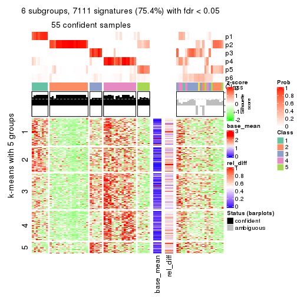</p>

</div>
</div>


Signature heatmaps where rows are not scaled:


<script>
$( function() {
	$( '#tabs-SD-skmeans-get-signatures-no-scale' ).tabs();
} );
</script>
<div id='tabs-SD-skmeans-get-signatures-no-scale'>
<ul>
<li><a href='#tab-SD-skmeans-get-signatures-no-scale-1'>k = 2</a></li>
<li><a href='#tab-SD-skmeans-get-signatures-no-scale-2'>k = 3</a></li>
<li><a href='#tab-SD-skmeans-get-signatures-no-scale-3'>k = 4</a></li>
<li><a href='#tab-SD-skmeans-get-signatures-no-scale-4'>k = 5</a></li>
<li><a href='#tab-SD-skmeans-get-signatures-no-scale-5'>k = 6</a></li>
</ul>
<div id='tab-SD-skmeans-get-signatures-no-scale-1'>
<pre><code class="r">get_signatures(res, k = 2, scale_rows = FALSE)
</code></pre>

<p></p>

</div>
<div id='tab-SD-skmeans-get-signatures-no-scale-2'>
<pre><code class="r">get_signatures(res, k = 3, scale_rows = FALSE)
</code></pre>

<p></p>

</div>
<div id='tab-SD-skmeans-get-signatures-no-scale-3'>
<pre><code class="r">get_signatures(res, k = 4, scale_rows = FALSE)
</code></pre>

<pre><code>#&gt; Error in mat[ceiling(1:nr/h_ratio), ceiling(1:nc/w_ratio), drop = FALSE]: subscript out of bounds
</code></pre>

<p></p>

</div>
<div id='tab-SD-skmeans-get-signatures-no-scale-4'>
<pre><code class="r">get_signatures(res, k = 5, scale_rows = FALSE)
</code></pre>

<pre><code>#&gt; Error in mat[ceiling(1:nr/h_ratio), ceiling(1:nc/w_ratio), drop = FALSE]: subscript out of bounds
</code></pre>

<p></p>

</div>
<div id='tab-SD-skmeans-get-signatures-no-scale-5'>
<pre><code class="r">get_signatures(res, k = 6, scale_rows = FALSE)
</code></pre>

<p></p>

</div>
</div>


Compare the overlap of signatures from different k:

```r
compare_signatures(res)
```


`get_signature()` returns a data frame invisibly. TO get the list of signatures, the function
call should be assigned to a variable explicitly. In following code, if `plot` argument is set
to `FALSE`, no heatmap is plotted while only the differential analysis is performed.

```r
# code only for demonstration
tb = get_signature(res, k = ..., plot = FALSE)
```

An example of the output of `tb` is:

```
#>   which_row         fdr    mean_1    mean_2 scaled_mean_1 scaled_mean_2 km
#> 1        38 0.042760348  8.373488  9.131774    -0.5533452     0.5164555  1
#> 2        40 0.018707592  7.106213  8.469186    -0.6173731     0.5762149  1
#> 3        55 0.019134737 10.221463 11.207825    -0.6159697     0.5749050  1
#> 4        59 0.006059896  5.921854  7.869574    -0.6899429     0.6439467  1
#> 5        60 0.018055526  8.928898 10.211722    -0.6204761     0.5791110  1
#> 6        98 0.009384629 15.714769 14.887706     0.6635654    -0.6193277  2
...
```

The columns in `tb` are:

1. `which_row`: row indices corresponding to the input matrix.
2. `fdr`: FDR for the differential test. 
3. `mean_x`: The mean value in group x.
4. `scaled_mean_x`: The mean value in group x after rows are scaled.
5. `km`: Row groups if k-means clustering is applied to rows.


UMAP plot which shows how samples are separated.


<script>
$( function() {
	$( '#tabs-SD-skmeans-dimension-reduction' ).tabs();
} );
</script>
<div id='tabs-SD-skmeans-dimension-reduction'>
<ul>
<li><a href='#tab-SD-skmeans-dimension-reduction-1'>k = 2</a></li>
<li><a href='#tab-SD-skmeans-dimension-reduction-2'>k = 3</a></li>
<li><a href='#tab-SD-skmeans-dimension-reduction-3'>k = 4</a></li>
<li><a href='#tab-SD-skmeans-dimension-reduction-4'>k = 5</a></li>
<li><a href='#tab-SD-skmeans-dimension-reduction-5'>k = 6</a></li>
</ul>
<div id='tab-SD-skmeans-dimension-reduction-1'>
<pre><code class="r">dimension_reduction(res, k = 2, method = &quot;UMAP&quot;)
</code></pre>

<p></p>

</div>
<div id='tab-SD-skmeans-dimension-reduction-2'>
<pre><code class="r">dimension_reduction(res, k = 3, method = &quot;UMAP&quot;)
</code></pre>

<p></p>

</div>
<div id='tab-SD-skmeans-dimension-reduction-3'>
<pre><code class="r">dimension_reduction(res, k = 4, method = &quot;UMAP&quot;)
</code></pre>

<p></p>

</div>
<div id='tab-SD-skmeans-dimension-reduction-4'>
<pre><code class="r">dimension_reduction(res, k = 5, method = &quot;UMAP&quot;)
</code></pre>

<p></p>

</div>
<div id='tab-SD-skmeans-dimension-reduction-5'>
<pre><code class="r">dimension_reduction(res, k = 6, method = &quot;UMAP&quot;)
</code></pre>

<p></p>

</div>
</div>


Following heatmap shows how subgroups are split when increasing `k`:

```r
collect_classes(res)
```


If matrix rows can be associated to genes, consider to use `GO_Enrichment(res,
...)` to perform function enrichment for the signature genes.


 

---------------------------------------------------


### SD:pam


The object with results only for a single top-value method and a single partition method 
can be extracted as:

```r
res = res_list["SD", "pam"]
# you can also extract it by
# res = res_list["SD:pam"]
```

A summary of `res` and all the functions that can be applied to it:

```r
res
```

```
#> A 'ConsensusPartition' object with k = 2, 3, 4, 5, 6.
#>   On a matrix with 9427 rows and 77 columns.
#>   Top rows (943, 1886, 2828, 3771, 4714) are extracted by 'SD' method.
#>   Subgroups are detected by 'pam' method.
#>   Performed in total 1250 partitions by row resampling.
#>   Best k for subgroups seems to be 2.
#> 
#> Following methods can be applied to this 'ConsensusPartition' object:
#>  [1] "cola_report"             "collect_classes"         "collect_plots"          
#>  [4] "collect_stats"           "colnames"                "compare_signatures"     
#>  [7] "consensus_heatmap"       "dimension_reduction"     "functional_enrichment"  
#> [10] "get_anno_col"            "get_anno"                "get_classes"            
#> [13] "get_consensus"           "get_matrix"              "get_membership"         
#> [16] "get_param"               "get_signatures"          "get_stats"              
#> [19] "is_best_k"               "is_stable_k"             "membership_heatmap"     
#> [22] "ncol"                    "nrow"                    "plot_ecdf"              
#> [25] "rownames"                "select_partition_number" "show"                   
#> [28] "suggest_best_k"          "test_to_known_factors"
```

`collect_plots()` function collects all the plots made from `res` for all `k` (number of partitions)
into one single page to provide an easy and fast comparison between different `k`.

```r
collect_plots(res)
```


The plots are:

- The first row: a plot of the ECDF (Empirical cumulative distribution
  function) curves of the consensus matrix for each `k` and the heatmap of
  predicted classes for each `k`.
- The second row: heatmaps of the consensus matrix for each `k`.
- The third row: heatmaps of the membership matrix for each `k`.
- The fouth row: heatmaps of the signatures for each `k`.

All the plots in panels can be made by individual functions and they are
plotted later in this section.

`select_partition_number()` produces several plots showing different
statistics for choosing "optimized" `k`. There are following statistics:

- ECDF curves of the consensus matrix for each `k`;
- 1-PAC. [The PAC
  score](https://en.wikipedia.org/wiki/Consensus_clustering#Over-interpretation_potential_of_consensus_clustering)
  measures the proportion of the ambiguous subgrouping.
- Mean silhouette score.
- Concordance. The mean probability of fiting the consensus class ids in all
  partitions.
- Area increased. Denote $A_k$ as the area under the ECDF curve for current
  `k`, the area increased is defined as $A_k - A_{k-1}$.
- Rand index. The percent of pairs of samples that are both in a same cluster
  or both are not in a same cluster in the partition of k and k-1.
- Jaccard index. The ratio of pairs of samples are both in a same cluster in
  the partition of k and k-1 and the pairs of samples are both in a same
  cluster in the partition k or k-1.

The detailed explanations of these statistics can be found in [the cola
vignette](http://bioconductor.org/packages/devel/bioc/vignettes/cola/inst/doc/cola.html#toc_13).

Generally speaking, lower PAC score, higher mean silhouette score or higher
concordance corresponds to better partition. Rand index and Jaccard index
measure how similar the current partition is compared to partition with `k-1`.
If they are too similar, we won't accept `k` is better than `k-1`.

```r
select_partition_number(res)
```


The numeric values for all these statistics can be obtained by `get_stats()`.

```r
get_stats(res)
```

```
#>   k 1-PAC mean_silhouette concordance area_increased  Rand Jaccard
#> 2 2 0.791           0.899       0.956         0.5028 0.494   0.494
#> 3 3 0.630           0.810       0.904         0.1883 0.900   0.801
#> 4 4 0.811           0.799       0.914         0.1472 0.874   0.704
#> 5 5 0.705           0.660       0.809         0.0521 0.940   0.816
#> 6 6 0.718           0.745       0.842         0.0346 0.957   0.854
```

`suggest_best_k()` suggests the best $k$ based on these statistics. The rules are as follows:

- All $k$ with Jaccard index larger than 0.95 are removed because the increase of
  the partition number does not provides enough extra information. If all $k$ are removed,
  the best $k$ is assigned by `NA`.
- For $k$ with 1-PAC larger than 0.9, the maximal $k$ is taken as the "best k". Other $k$ is called "optional k".
- If it does not fit the second rule. The $k$ with the highest vote of highest
  1-PAC, mean silhouette and concordance is taken as the "best k".

```r
suggest_best_k(res)
```

```
#> [1] 2
```


Following shows the table of the partitions (You need to click the **show/hide
code output** link to see it). The membership matrix (columns with name `p*`)
is inferred by
[`clue::cl_consensus()`](https://www.rdocumentation.org/link/cl_consensus?package=clue)
function with the `SE` method. Basically the value in the membership matrix
represents the probability to belong to a certain group. The finall class
label for an item is determined with the group with highest probability it
belongs to.

In `get_classes()` function, the entropy is calculated from the membership
matrix and the silhouette score is calculated from the consensus matrix.


<script>
$( function() {
	$( '#tabs-SD-pam-get-classes' ).tabs();
} );
</script>
<div id='tabs-SD-pam-get-classes'>
<ul>
<li><a href='#tab-SD-pam-get-classes-1'>k = 2</a></li>
<li><a href='#tab-SD-pam-get-classes-2'>k = 3</a></li>
<li><a href='#tab-SD-pam-get-classes-3'>k = 4</a></li>
<li><a href='#tab-SD-pam-get-classes-4'>k = 5</a></li>
<li><a href='#tab-SD-pam-get-classes-5'>k = 6</a></li>
</ul>

<div id='tab-SD-pam-get-classes-1'>
<p><a id='tab-SD-pam-get-classes-1-a' style='color:#0366d6' href='#'>show/hide code output</a></p>
<pre><code class="r">cbind(get_classes(res, k = 2), get_membership(res, k = 2))
</code></pre>

<pre><code>#&gt;           class entropy silhouette    p1    p2
#&gt; SRR944011     1  0.6048      0.826 0.852 0.148
#&gt; SRR944012     1  0.0000      0.942 1.000 0.000
#&gt; SRR944014     2  0.0000      0.962 0.000 1.000
#&gt; SRR944013     2  0.0672      0.956 0.008 0.992
#&gt; SRR944015     1  0.0000      0.942 1.000 0.000
#&gt; SRR944016     1  0.9580      0.406 0.620 0.380
#&gt; SRR944017     2  0.0000      0.962 0.000 1.000
#&gt; SRR944018     1  0.0000      0.942 1.000 0.000
#&gt; SRR944019     1  0.9209      0.524 0.664 0.336
#&gt; SRR944020     1  0.0000      0.942 1.000 0.000
#&gt; SRR944021     2  0.0000      0.962 0.000 1.000
#&gt; SRR944022     1  0.0000      0.942 1.000 0.000
#&gt; SRR944023     1  0.0000      0.942 1.000 0.000
#&gt; SRR944024     1  0.0000      0.942 1.000 0.000
#&gt; SRR944026     2  0.0000      0.962 0.000 1.000
#&gt; SRR944025     2  0.0000      0.962 0.000 1.000
#&gt; SRR944028     2  0.0000      0.962 0.000 1.000
#&gt; SRR944029     1  0.7056      0.778 0.808 0.192
#&gt; SRR944030     2  0.0000      0.962 0.000 1.000
#&gt; SRR944031     1  0.0000      0.942 1.000 0.000
#&gt; SRR944032     2  0.0000      0.962 0.000 1.000
#&gt; SRR944033     2  0.0000      0.962 0.000 1.000
#&gt; SRR944034     2  0.0000      0.962 0.000 1.000
#&gt; SRR944036     1  0.6148      0.817 0.848 0.152
#&gt; SRR944035     2  0.0000      0.962 0.000 1.000
#&gt; SRR944038     1  0.0000      0.942 1.000 0.000
#&gt; SRR944037     1  0.0000      0.942 1.000 0.000
#&gt; SRR944039     1  0.0000      0.942 1.000 0.000
#&gt; SRR944040     2  0.0000      0.962 0.000 1.000
#&gt; SRR944041     1  0.0000      0.942 1.000 0.000
#&gt; SRR944042     1  0.0000      0.942 1.000 0.000
#&gt; SRR944043     1  0.0000      0.942 1.000 0.000
#&gt; SRR944044     2  0.0000      0.962 0.000 1.000
#&gt; SRR944046     1  0.0000      0.942 1.000 0.000
#&gt; SRR944045     2  0.0000      0.962 0.000 1.000
#&gt; SRR944047     2  0.0000      0.962 0.000 1.000
#&gt; SRR944048     2  0.3584      0.900 0.068 0.932
#&gt; SRR944049     2  0.0000      0.962 0.000 1.000
#&gt; SRR944050     2  0.7376      0.722 0.208 0.792
#&gt; SRR944051     2  0.0000      0.962 0.000 1.000
#&gt; SRR944052     2  0.0000      0.962 0.000 1.000
#&gt; SRR944053     1  0.0000      0.942 1.000 0.000
#&gt; SRR944054     2  0.0376      0.959 0.004 0.996
#&gt; SRR944055     2  0.1414      0.947 0.020 0.980
#&gt; SRR944056     2  0.0000      0.962 0.000 1.000
#&gt; SRR944057     1  0.1633      0.927 0.976 0.024
#&gt; SRR944058     1  0.0000      0.942 1.000 0.000
#&gt; SRR944059     2  0.8555      0.602 0.280 0.720
#&gt; SRR944060     1  0.0000      0.942 1.000 0.000
#&gt; SRR944061     2  0.0000      0.962 0.000 1.000
#&gt; SRR944062     1  0.0000      0.942 1.000 0.000
#&gt; SRR944063     1  0.0000      0.942 1.000 0.000
#&gt; SRR944064     2  0.0000      0.962 0.000 1.000
#&gt; SRR944065     1  0.0000      0.942 1.000 0.000
#&gt; SRR944066     1  0.0000      0.942 1.000 0.000
#&gt; SRR944067     2  0.0000      0.962 0.000 1.000
#&gt; SRR944068     1  0.0000      0.942 1.000 0.000
#&gt; SRR944069     2  0.0000      0.962 0.000 1.000
#&gt; SRR944070     1  0.0000      0.942 1.000 0.000
#&gt; SRR944071     1  0.4431      0.875 0.908 0.092
#&gt; SRR944072     1  0.0000      0.942 1.000 0.000
#&gt; SRR944073     2  0.0000      0.962 0.000 1.000
#&gt; SRR944075     2  0.8499      0.601 0.276 0.724
#&gt; SRR944074     2  0.0000      0.962 0.000 1.000
#&gt; SRR944076     1  0.0000      0.942 1.000 0.000
#&gt; SRR944077     2  0.0000      0.962 0.000 1.000
#&gt; SRR944078     2  0.0938      0.953 0.012 0.988
#&gt; SRR944079     2  0.0000      0.962 0.000 1.000
#&gt; SRR944080     2  0.0000      0.962 0.000 1.000
#&gt; SRR944081     2  0.9815      0.232 0.420 0.580
#&gt; SRR944082     1  0.0000      0.942 1.000 0.000
#&gt; SRR944083     1  0.0672      0.938 0.992 0.008
#&gt; SRR944084     1  0.7056      0.778 0.808 0.192
#&gt; SRR944085     1  0.9522      0.441 0.628 0.372
#&gt; SRR944086     1  0.6623      0.801 0.828 0.172
#&gt; SRR944088     2  0.0000      0.962 0.000 1.000
#&gt; SRR944087     1  0.0000      0.942 1.000 0.000
</code></pre>

<script>
$('#tab-SD-pam-get-classes-1-a').parent().next().next().hide();
$('#tab-SD-pam-get-classes-1-a').click(function(){
  $('#tab-SD-pam-get-classes-1-a').parent().next().next().toggle();
  return(false);
});
</script>
</div>

<div id='tab-SD-pam-get-classes-2'>
<p><a id='tab-SD-pam-get-classes-2-a' style='color:#0366d6' href='#'>show/hide code output</a></p>
<pre><code class="r">cbind(get_classes(res, k = 3), get_membership(res, k = 3))
</code></pre>

<pre><code>#&gt;           class entropy silhouette    p1    p2    p3
#&gt; SRR944011     1  0.6827      0.685 0.728 0.192 0.080
#&gt; SRR944012     1  0.3686      0.736 0.860 0.000 0.140
#&gt; SRR944014     2  0.0000      0.940 0.000 1.000 0.000
#&gt; SRR944013     2  0.3412      0.835 0.124 0.876 0.000
#&gt; SRR944015     3  0.0747      0.950 0.016 0.000 0.984
#&gt; SRR944016     1  0.3769      0.749 0.880 0.104 0.016
#&gt; SRR944017     2  0.0424      0.936 0.008 0.992 0.000
#&gt; SRR944018     1  0.0000      0.803 1.000 0.000 0.000
#&gt; SRR944019     1  0.8122      0.421 0.608 0.100 0.292
#&gt; SRR944020     3  0.0892      0.950 0.020 0.000 0.980
#&gt; SRR944021     2  0.0000      0.940 0.000 1.000 0.000
#&gt; SRR944022     3  0.1031      0.938 0.024 0.000 0.976
#&gt; SRR944023     1  0.2537      0.801 0.920 0.000 0.080
#&gt; SRR944024     1  0.0747      0.800 0.984 0.000 0.016
#&gt; SRR944026     2  0.0000      0.940 0.000 1.000 0.000
#&gt; SRR944025     2  0.0000      0.940 0.000 1.000 0.000
#&gt; SRR944028     2  0.0000      0.940 0.000 1.000 0.000
#&gt; SRR944029     1  0.6758      0.679 0.728 0.200 0.072
#&gt; SRR944030     2  0.0000      0.940 0.000 1.000 0.000
#&gt; SRR944031     1  0.2537      0.801 0.920 0.000 0.080
#&gt; SRR944032     2  0.0000      0.940 0.000 1.000 0.000
#&gt; SRR944033     2  0.0000      0.940 0.000 1.000 0.000
#&gt; SRR944034     2  0.0000      0.940 0.000 1.000 0.000
#&gt; SRR944036     1  0.4423      0.784 0.864 0.088 0.048
#&gt; SRR944035     2  0.0000      0.940 0.000 1.000 0.000
#&gt; SRR944038     1  0.5706      0.595 0.680 0.000 0.320
#&gt; SRR944037     3  0.4178      0.765 0.172 0.000 0.828
#&gt; SRR944039     1  0.4178      0.696 0.828 0.000 0.172
#&gt; SRR944040     2  0.0000      0.940 0.000 1.000 0.000
#&gt; SRR944041     1  0.5905      0.448 0.648 0.000 0.352
#&gt; SRR944042     1  0.2537      0.801 0.920 0.000 0.080
#&gt; SRR944043     1  0.3038      0.777 0.896 0.000 0.104
#&gt; SRR944044     2  0.0000      0.940 0.000 1.000 0.000
#&gt; SRR944046     1  0.2537      0.801 0.920 0.000 0.080
#&gt; SRR944045     2  0.0592      0.933 0.012 0.988 0.000
#&gt; SRR944047     2  0.0000      0.940 0.000 1.000 0.000
#&gt; SRR944048     2  0.5992      0.637 0.268 0.716 0.016
#&gt; SRR944049     2  0.0000      0.940 0.000 1.000 0.000
#&gt; SRR944050     2  0.6879      0.174 0.428 0.556 0.016
#&gt; SRR944051     2  0.0000      0.940 0.000 1.000 0.000
#&gt; SRR944052     2  0.0000      0.940 0.000 1.000 0.000
#&gt; SRR944053     3  0.0592      0.950 0.012 0.000 0.988
#&gt; SRR944054     2  0.1031      0.925 0.024 0.976 0.000
#&gt; SRR944055     2  0.2959      0.859 0.100 0.900 0.000
#&gt; SRR944056     2  0.0000      0.940 0.000 1.000 0.000
#&gt; SRR944057     1  0.0747      0.800 0.984 0.000 0.016
#&gt; SRR944058     1  0.5706      0.449 0.680 0.000 0.320
#&gt; SRR944059     2  0.6140      0.295 0.404 0.596 0.000
#&gt; SRR944060     1  0.3340      0.785 0.880 0.000 0.120
#&gt; SRR944061     2  0.0000      0.940 0.000 1.000 0.000
#&gt; SRR944062     1  0.0237      0.803 0.996 0.000 0.004
#&gt; SRR944063     3  0.2066      0.927 0.060 0.000 0.940
#&gt; SRR944064     2  0.0000      0.940 0.000 1.000 0.000
#&gt; SRR944065     1  0.2448      0.794 0.924 0.000 0.076
#&gt; SRR944066     1  0.1031      0.800 0.976 0.000 0.024
#&gt; SRR944067     2  0.0000      0.940 0.000 1.000 0.000
#&gt; SRR944068     3  0.0747      0.950 0.016 0.000 0.984
#&gt; SRR944069     2  0.0000      0.940 0.000 1.000 0.000
#&gt; SRR944070     1  0.5138      0.677 0.748 0.000 0.252
#&gt; SRR944071     1  0.6728      0.691 0.736 0.184 0.080
#&gt; SRR944072     1  0.3619      0.733 0.864 0.000 0.136
#&gt; SRR944073     2  0.0000      0.940 0.000 1.000 0.000
#&gt; SRR944075     2  0.5291      0.600 0.268 0.732 0.000
#&gt; SRR944074     2  0.0000      0.940 0.000 1.000 0.000
#&gt; SRR944076     1  0.2537      0.801 0.920 0.000 0.080
#&gt; SRR944077     2  0.0000      0.940 0.000 1.000 0.000
#&gt; SRR944078     2  0.3551      0.826 0.132 0.868 0.000
#&gt; SRR944079     2  0.0000      0.940 0.000 1.000 0.000
#&gt; SRR944080     2  0.0000      0.940 0.000 1.000 0.000
#&gt; SRR944081     1  0.6758      0.472 0.620 0.360 0.020
#&gt; SRR944082     1  0.0424      0.802 0.992 0.000 0.008
#&gt; SRR944083     1  0.0747      0.800 0.984 0.000 0.016
#&gt; SRR944084     1  0.6854      0.664 0.716 0.216 0.068
#&gt; SRR944085     1  0.6451      0.583 0.684 0.292 0.024
#&gt; SRR944086     1  0.6208      0.688 0.752 0.200 0.048
#&gt; SRR944088     2  0.0892      0.928 0.020 0.980 0.000
#&gt; SRR944087     1  0.2537      0.801 0.920 0.000 0.080
</code></pre>

<script>
$('#tab-SD-pam-get-classes-2-a').parent().next().next().hide();
$('#tab-SD-pam-get-classes-2-a').click(function(){
  $('#tab-SD-pam-get-classes-2-a').parent().next().next().toggle();
  return(false);
});
</script>
</div>

<div id='tab-SD-pam-get-classes-3'>
<p><a id='tab-SD-pam-get-classes-3-a' style='color:#0366d6' href='#'>show/hide code output</a></p>
<pre><code class="r">cbind(get_classes(res, k = 4), get_membership(res, k = 4))
</code></pre>

<pre><code>#&gt;           class entropy silhouette    p1    p2    p3    p4
#&gt; SRR944011     3  0.0188     0.8504 0.000 0.004 0.996 0.000
#&gt; SRR944012     1  0.5184     0.5838 0.672 0.000 0.304 0.024
#&gt; SRR944014     2  0.0000     0.9616 0.000 1.000 0.000 0.000
#&gt; SRR944013     2  0.1474     0.9195 0.000 0.948 0.052 0.000
#&gt; SRR944015     4  0.0000     0.9421 0.000 0.000 0.000 1.000
#&gt; SRR944016     1  0.1118     0.7001 0.964 0.000 0.036 0.000
#&gt; SRR944017     2  0.0188     0.9591 0.000 0.996 0.004 0.000
#&gt; SRR944018     3  0.4103     0.5116 0.256 0.000 0.744 0.000
#&gt; SRR944019     1  0.5038     0.4786 0.652 0.000 0.336 0.012
#&gt; SRR944020     4  0.0000     0.9421 0.000 0.000 0.000 1.000
#&gt; SRR944021     2  0.0000     0.9616 0.000 1.000 0.000 0.000
#&gt; SRR944022     4  0.0000     0.9421 0.000 0.000 0.000 1.000
#&gt; SRR944023     3  0.0000     0.8506 0.000 0.000 1.000 0.000
#&gt; SRR944024     1  0.3172     0.6992 0.840 0.000 0.160 0.000
#&gt; SRR944026     2  0.0000     0.9616 0.000 1.000 0.000 0.000
#&gt; SRR944025     2  0.0000     0.9616 0.000 1.000 0.000 0.000
#&gt; SRR944028     2  0.0000     0.9616 0.000 1.000 0.000 0.000
#&gt; SRR944029     3  0.1302     0.8358 0.000 0.044 0.956 0.000
#&gt; SRR944030     2  0.0000     0.9616 0.000 1.000 0.000 0.000
#&gt; SRR944031     3  0.0000     0.8506 0.000 0.000 1.000 0.000
#&gt; SRR944032     2  0.0188     0.9592 0.004 0.996 0.000 0.000
#&gt; SRR944033     2  0.0000     0.9616 0.000 1.000 0.000 0.000
#&gt; SRR944034     2  0.0000     0.9616 0.000 1.000 0.000 0.000
#&gt; SRR944036     3  0.1211     0.8378 0.000 0.040 0.960 0.000
#&gt; SRR944035     2  0.0000     0.9616 0.000 1.000 0.000 0.000
#&gt; SRR944038     3  0.4454     0.5168 0.000 0.000 0.692 0.308
#&gt; SRR944037     4  0.4222     0.5923 0.000 0.000 0.272 0.728
#&gt; SRR944039     1  0.4817     0.3912 0.612 0.000 0.388 0.000
#&gt; SRR944040     2  0.0000     0.9616 0.000 1.000 0.000 0.000
#&gt; SRR944041     1  0.6011     0.2293 0.480 0.000 0.480 0.040
#&gt; SRR944042     3  0.0000     0.8506 0.000 0.000 1.000 0.000
#&gt; SRR944043     3  0.6219     0.1588 0.344 0.000 0.588 0.068
#&gt; SRR944044     2  0.0000     0.9616 0.000 1.000 0.000 0.000
#&gt; SRR944046     3  0.0000     0.8506 0.000 0.000 1.000 0.000
#&gt; SRR944045     2  0.0336     0.9564 0.000 0.992 0.008 0.000
#&gt; SRR944047     2  0.0000     0.9616 0.000 1.000 0.000 0.000
#&gt; SRR944048     1  0.1489     0.7002 0.952 0.004 0.044 0.000
#&gt; SRR944049     2  0.0000     0.9616 0.000 1.000 0.000 0.000
#&gt; SRR944050     2  0.7030     0.0689 0.408 0.472 0.120 0.000
#&gt; SRR944051     2  0.0000     0.9616 0.000 1.000 0.000 0.000
#&gt; SRR944052     2  0.0000     0.9616 0.000 1.000 0.000 0.000
#&gt; SRR944053     4  0.0000     0.9421 0.000 0.000 0.000 1.000
#&gt; SRR944054     2  0.0336     0.9564 0.000 0.992 0.008 0.000
#&gt; SRR944055     2  0.2760     0.8404 0.000 0.872 0.128 0.000
#&gt; SRR944056     2  0.0000     0.9616 0.000 1.000 0.000 0.000
#&gt; SRR944057     1  0.4830     0.3792 0.608 0.000 0.392 0.000
#&gt; SRR944058     1  0.0000     0.6964 1.000 0.000 0.000 0.000
#&gt; SRR944059     2  0.4522     0.5274 0.000 0.680 0.320 0.000
#&gt; SRR944060     3  0.1637     0.8170 0.000 0.000 0.940 0.060
#&gt; SRR944061     2  0.0000     0.9616 0.000 1.000 0.000 0.000
#&gt; SRR944062     1  0.4222     0.6222 0.728 0.000 0.272 0.000
#&gt; SRR944063     4  0.0000     0.9421 0.000 0.000 0.000 1.000
#&gt; SRR944064     2  0.0000     0.9616 0.000 1.000 0.000 0.000
#&gt; SRR944065     1  0.5143     0.3181 0.540 0.000 0.456 0.004
#&gt; SRR944066     1  0.0000     0.6964 1.000 0.000 0.000 0.000
#&gt; SRR944067     2  0.0000     0.9616 0.000 1.000 0.000 0.000
#&gt; SRR944068     4  0.0000     0.9421 0.000 0.000 0.000 1.000
#&gt; SRR944069     2  0.0000     0.9616 0.000 1.000 0.000 0.000
#&gt; SRR944070     3  0.1940     0.8068 0.000 0.000 0.924 0.076
#&gt; SRR944071     3  0.0000     0.8506 0.000 0.000 1.000 0.000
#&gt; SRR944072     1  0.0000     0.6964 1.000 0.000 0.000 0.000
#&gt; SRR944073     2  0.0000     0.9616 0.000 1.000 0.000 0.000
#&gt; SRR944075     3  0.4697     0.3817 0.000 0.356 0.644 0.000
#&gt; SRR944074     2  0.0000     0.9616 0.000 1.000 0.000 0.000
#&gt; SRR944076     3  0.0000     0.8506 0.000 0.000 1.000 0.000
#&gt; SRR944077     2  0.0000     0.9616 0.000 1.000 0.000 0.000
#&gt; SRR944078     2  0.2589     0.8553 0.000 0.884 0.116 0.000
#&gt; SRR944079     2  0.0000     0.9616 0.000 1.000 0.000 0.000
#&gt; SRR944080     2  0.0000     0.9616 0.000 1.000 0.000 0.000
#&gt; SRR944081     3  0.5332     0.5595 0.184 0.080 0.736 0.000
#&gt; SRR944082     1  0.4040     0.6462 0.752 0.000 0.248 0.000
#&gt; SRR944083     1  0.0000     0.6964 1.000 0.000 0.000 0.000
#&gt; SRR944084     3  0.1302     0.8361 0.000 0.044 0.956 0.000
#&gt; SRR944085     3  0.1637     0.8189 0.000 0.060 0.940 0.000
#&gt; SRR944086     3  0.1356     0.8413 0.008 0.032 0.960 0.000
#&gt; SRR944088     2  0.1557     0.9154 0.000 0.944 0.056 0.000
#&gt; SRR944087     3  0.0000     0.8506 0.000 0.000 1.000 0.000
</code></pre>

<script>
$('#tab-SD-pam-get-classes-3-a').parent().next().next().hide();
$('#tab-SD-pam-get-classes-3-a').click(function(){
  $('#tab-SD-pam-get-classes-3-a').parent().next().next().toggle();
  return(false);
});
</script>
</div>

<div id='tab-SD-pam-get-classes-4'>
<p><a id='tab-SD-pam-get-classes-4-a' style='color:#0366d6' href='#'>show/hide code output</a></p>
<pre><code class="r">cbind(get_classes(res, k = 5), get_membership(res, k = 5))
</code></pre>

<pre><code>#&gt;           class entropy silhouette    p1    p2    p3    p4    p5
#&gt; SRR944011     3  0.1018     0.6259 0.000 0.016 0.968 0.000 0.016
#&gt; SRR944012     5  0.6166     0.1363 0.256 0.000 0.124 0.020 0.600
#&gt; SRR944014     2  0.0000     0.9409 0.000 1.000 0.000 0.000 0.000
#&gt; SRR944013     2  0.3445     0.8675 0.000 0.824 0.036 0.000 0.140
#&gt; SRR944015     4  0.0703     0.9355 0.000 0.000 0.000 0.976 0.024
#&gt; SRR944016     1  0.1270     0.5657 0.948 0.000 0.052 0.000 0.000
#&gt; SRR944017     2  0.0324     0.9387 0.000 0.992 0.004 0.000 0.004
#&gt; SRR944018     5  0.5111     0.1903 0.036 0.000 0.464 0.000 0.500
#&gt; SRR944019     1  0.5203     0.4235 0.708 0.000 0.140 0.008 0.144
#&gt; SRR944020     4  0.2732     0.8690 0.000 0.000 0.000 0.840 0.160
#&gt; SRR944021     2  0.0000     0.9409 0.000 1.000 0.000 0.000 0.000
#&gt; SRR944022     4  0.1121     0.9369 0.000 0.000 0.000 0.956 0.044
#&gt; SRR944023     3  0.2648     0.5691 0.000 0.000 0.848 0.000 0.152
#&gt; SRR944024     1  0.5352     0.1296 0.480 0.000 0.052 0.000 0.468
#&gt; SRR944026     2  0.2561     0.8911 0.000 0.856 0.000 0.000 0.144
#&gt; SRR944025     2  0.2020     0.9098 0.000 0.900 0.000 0.000 0.100
#&gt; SRR944028     2  0.2605     0.8880 0.000 0.852 0.000 0.000 0.148
#&gt; SRR944029     3  0.4873     0.4374 0.000 0.068 0.688 0.000 0.244
#&gt; SRR944030     2  0.0000     0.9409 0.000 1.000 0.000 0.000 0.000
#&gt; SRR944031     3  0.0000     0.6223 0.000 0.000 1.000 0.000 0.000
#&gt; SRR944032     2  0.2488     0.8999 0.004 0.872 0.000 0.000 0.124
#&gt; SRR944033     2  0.0000     0.9409 0.000 1.000 0.000 0.000 0.000
#&gt; SRR944034     2  0.0000     0.9409 0.000 1.000 0.000 0.000 0.000
#&gt; SRR944036     3  0.4404     0.5160 0.000 0.088 0.760 0.000 0.152
#&gt; SRR944035     2  0.2020     0.9098 0.000 0.900 0.000 0.000 0.100
#&gt; SRR944038     3  0.4577     0.3514 0.000 0.000 0.740 0.176 0.084
#&gt; SRR944037     3  0.6766    -0.1894 0.000 0.000 0.396 0.320 0.284
#&gt; SRR944039     1  0.5301     0.3827 0.676 0.000 0.176 0.000 0.148
#&gt; SRR944040     2  0.0000     0.9409 0.000 1.000 0.000 0.000 0.000
#&gt; SRR944041     5  0.5698     0.3021 0.036 0.000 0.440 0.024 0.500
#&gt; SRR944042     3  0.1197     0.6149 0.000 0.000 0.952 0.000 0.048
#&gt; SRR944043     5  0.6204     0.2307 0.028 0.000 0.420 0.068 0.484
#&gt; SRR944044     2  0.1792     0.9199 0.000 0.916 0.000 0.000 0.084
#&gt; SRR944046     3  0.1270     0.6134 0.000 0.000 0.948 0.000 0.052
#&gt; SRR944045     2  0.0290     0.9381 0.000 0.992 0.008 0.000 0.000
#&gt; SRR944047     2  0.0000     0.9409 0.000 1.000 0.000 0.000 0.000
#&gt; SRR944048     1  0.4982     0.3998 0.556 0.000 0.032 0.000 0.412
#&gt; SRR944049     2  0.0162     0.9403 0.000 0.996 0.000 0.000 0.004
#&gt; SRR944050     1  0.4773     0.3308 0.716 0.216 0.064 0.000 0.004
#&gt; SRR944051     2  0.2648     0.8854 0.000 0.848 0.000 0.000 0.152
#&gt; SRR944052     2  0.0000     0.9409 0.000 1.000 0.000 0.000 0.000
#&gt; SRR944053     4  0.0000     0.9384 0.000 0.000 0.000 1.000 0.000
#&gt; SRR944054     2  0.1557     0.9232 0.000 0.940 0.008 0.000 0.052
#&gt; SRR944055     2  0.1965     0.8814 0.000 0.904 0.096 0.000 0.000
#&gt; SRR944056     2  0.0000     0.9409 0.000 1.000 0.000 0.000 0.000
#&gt; SRR944057     1  0.2561     0.4967 0.856 0.000 0.144 0.000 0.000
#&gt; SRR944058     1  0.3857     0.5004 0.688 0.000 0.000 0.000 0.312
#&gt; SRR944059     2  0.5635     0.4242 0.000 0.620 0.252 0.000 0.128
#&gt; SRR944060     3  0.2248     0.5807 0.000 0.000 0.900 0.012 0.088
#&gt; SRR944061     2  0.0000     0.9409 0.000 1.000 0.000 0.000 0.000
#&gt; SRR944062     1  0.6760    -0.0309 0.400 0.000 0.284 0.000 0.316
#&gt; SRR944063     4  0.1671     0.9255 0.000 0.000 0.000 0.924 0.076
#&gt; SRR944064     2  0.2020     0.9098 0.000 0.900 0.000 0.000 0.100
#&gt; SRR944065     5  0.5911     0.3546 0.104 0.000 0.408 0.000 0.488
#&gt; SRR944066     1  0.2929     0.5566 0.820 0.000 0.000 0.000 0.180
#&gt; SRR944067     2  0.2020     0.9098 0.000 0.900 0.000 0.000 0.100
#&gt; SRR944068     4  0.1043     0.9286 0.000 0.000 0.000 0.960 0.040
#&gt; SRR944069     2  0.0000     0.9409 0.000 1.000 0.000 0.000 0.000
#&gt; SRR944070     3  0.2189     0.5838 0.000 0.000 0.904 0.012 0.084
#&gt; SRR944071     3  0.1908     0.6058 0.000 0.000 0.908 0.000 0.092
#&gt; SRR944072     1  0.0880     0.5701 0.968 0.000 0.000 0.000 0.032
#&gt; SRR944073     2  0.0000     0.9409 0.000 1.000 0.000 0.000 0.000
#&gt; SRR944075     3  0.4833     0.1045 0.000 0.412 0.564 0.000 0.024
#&gt; SRR944074     2  0.1908     0.9174 0.000 0.908 0.000 0.000 0.092
#&gt; SRR944076     3  0.2648     0.5691 0.000 0.000 0.848 0.000 0.152
#&gt; SRR944077     2  0.0000     0.9409 0.000 1.000 0.000 0.000 0.000
#&gt; SRR944078     2  0.1851     0.8899 0.000 0.912 0.088 0.000 0.000
#&gt; SRR944079     2  0.0000     0.9409 0.000 1.000 0.000 0.000 0.000
#&gt; SRR944080     2  0.0000     0.9409 0.000 1.000 0.000 0.000 0.000
#&gt; SRR944081     5  0.6844    -0.0417 0.036 0.120 0.404 0.000 0.440
#&gt; SRR944082     5  0.5895    -0.1868 0.440 0.000 0.100 0.000 0.460
#&gt; SRR944083     1  0.3837     0.5030 0.692 0.000 0.000 0.000 0.308
#&gt; SRR944084     3  0.4119     0.5410 0.000 0.068 0.780 0.000 0.152
#&gt; SRR944085     3  0.4884     0.4534 0.000 0.128 0.720 0.000 0.152
#&gt; SRR944086     3  0.5751     0.3630 0.036 0.068 0.652 0.000 0.244
#&gt; SRR944088     2  0.2233     0.9080 0.000 0.904 0.016 0.000 0.080
#&gt; SRR944087     3  0.1121     0.6157 0.000 0.000 0.956 0.000 0.044
</code></pre>

<script>
$('#tab-SD-pam-get-classes-4-a').parent().next().next().hide();
$('#tab-SD-pam-get-classes-4-a').click(function(){
  $('#tab-SD-pam-get-classes-4-a').parent().next().next().toggle();
  return(false);
});
</script>
</div>

<div id='tab-SD-pam-get-classes-5'>
<p><a id='tab-SD-pam-get-classes-5-a' style='color:#0366d6' href='#'>show/hide code output</a></p>
<pre><code class="r">cbind(get_classes(res, k = 6), get_membership(res, k = 6))
</code></pre>

<pre><code>#&gt;           class entropy silhouette    p1    p2    p3    p4    p5    p6
#&gt; SRR944011     3  0.2679     0.7199 0.000 0.000 0.864 0.000 0.040 0.096
#&gt; SRR944012     1  0.6321     0.4872 0.564 0.000 0.180 0.000 0.184 0.072
#&gt; SRR944014     2  0.0000     0.9270 0.000 1.000 0.000 0.000 0.000 0.000
#&gt; SRR944013     2  0.3590     0.8610 0.000 0.808 0.044 0.000 0.016 0.132
#&gt; SRR944015     4  0.0000     0.8108 0.000 0.000 0.000 1.000 0.000 0.000
#&gt; SRR944016     6  0.3922     0.8719 0.320 0.000 0.016 0.000 0.000 0.664
#&gt; SRR944017     2  0.0520     0.9237 0.000 0.984 0.008 0.000 0.008 0.000
#&gt; SRR944018     3  0.5350     0.3184 0.216 0.000 0.632 0.000 0.136 0.016
#&gt; SRR944019     6  0.5628     0.7948 0.268 0.000 0.020 0.000 0.128 0.584
#&gt; SRR944020     5  0.3578     0.1137 0.000 0.000 0.000 0.340 0.660 0.000
#&gt; SRR944021     2  0.0000     0.9270 0.000 1.000 0.000 0.000 0.000 0.000
#&gt; SRR944022     4  0.2883     0.7237 0.000 0.000 0.000 0.788 0.212 0.000
#&gt; SRR944023     3  0.0000     0.7138 0.000 0.000 1.000 0.000 0.000 0.000
#&gt; SRR944024     1  0.2100     0.7069 0.884 0.000 0.112 0.000 0.000 0.004
#&gt; SRR944026     2  0.3172     0.8678 0.000 0.816 0.000 0.000 0.036 0.148
#&gt; SRR944025     2  0.2260     0.8840 0.000 0.860 0.000 0.000 0.000 0.140
#&gt; SRR944028     2  0.2871     0.8596 0.000 0.804 0.000 0.000 0.004 0.192
#&gt; SRR944029     3  0.3693     0.6253 0.000 0.036 0.816 0.000 0.100 0.048
#&gt; SRR944030     2  0.0000     0.9270 0.000 1.000 0.000 0.000 0.000 0.000
#&gt; SRR944031     3  0.3393     0.7117 0.000 0.000 0.820 0.004 0.068 0.108
#&gt; SRR944032     2  0.2668     0.8727 0.004 0.828 0.000 0.000 0.000 0.168
#&gt; SRR944033     2  0.0000     0.9270 0.000 1.000 0.000 0.000 0.000 0.000
#&gt; SRR944034     2  0.0000     0.9270 0.000 1.000 0.000 0.000 0.000 0.000
#&gt; SRR944036     3  0.0937     0.7071 0.000 0.040 0.960 0.000 0.000 0.000
#&gt; SRR944035     2  0.2260     0.8840 0.000 0.860 0.000 0.000 0.000 0.140
#&gt; SRR944038     3  0.6972     0.2988 0.000 0.000 0.460 0.272 0.144 0.124
#&gt; SRR944037     5  0.3328     0.5186 0.000 0.000 0.064 0.120 0.816 0.000
#&gt; SRR944039     6  0.6812     0.6742 0.276 0.000 0.116 0.000 0.128 0.480
#&gt; SRR944040     2  0.0000     0.9270 0.000 1.000 0.000 0.000 0.000 0.000
#&gt; SRR944041     5  0.4262     0.5849 0.024 0.000 0.100 0.004 0.776 0.096
#&gt; SRR944042     3  0.4100     0.6893 0.000 0.000 0.760 0.004 0.112 0.124
#&gt; SRR944043     5  0.5014     0.5570 0.024 0.000 0.372 0.036 0.568 0.000
#&gt; SRR944044     2  0.2457     0.8966 0.000 0.880 0.000 0.000 0.036 0.084
#&gt; SRR944046     3  0.4100     0.6903 0.000 0.000 0.760 0.004 0.112 0.124
#&gt; SRR944045     2  0.0458     0.9229 0.000 0.984 0.016 0.000 0.000 0.000
#&gt; SRR944047     2  0.0000     0.9270 0.000 1.000 0.000 0.000 0.000 0.000
#&gt; SRR944048     1  0.3054     0.6404 0.828 0.000 0.036 0.000 0.000 0.136
#&gt; SRR944049     2  0.0260     0.9260 0.000 0.992 0.000 0.000 0.000 0.008
#&gt; SRR944050     6  0.4339     0.8603 0.300 0.016 0.020 0.000 0.000 0.664
#&gt; SRR944051     2  0.2871     0.8596 0.000 0.804 0.000 0.000 0.004 0.192
#&gt; SRR944052     2  0.0000     0.9270 0.000 1.000 0.000 0.000 0.000 0.000
#&gt; SRR944053     4  0.0713     0.8117 0.000 0.000 0.000 0.972 0.028 0.000
#&gt; SRR944054     2  0.2066     0.9010 0.000 0.908 0.000 0.000 0.040 0.052
#&gt; SRR944055     2  0.2212     0.8640 0.000 0.880 0.112 0.000 0.008 0.000
#&gt; SRR944056     2  0.0000     0.9270 0.000 1.000 0.000 0.000 0.000 0.000
#&gt; SRR944057     6  0.3684     0.8675 0.332 0.000 0.004 0.000 0.000 0.664
#&gt; SRR944058     1  0.0146     0.6637 0.996 0.000 0.000 0.000 0.000 0.004
#&gt; SRR944059     2  0.3672     0.5147 0.000 0.632 0.368 0.000 0.000 0.000
#&gt; SRR944060     3  0.5521     0.6096 0.000 0.000 0.652 0.048 0.176 0.124
#&gt; SRR944061     2  0.0000     0.9270 0.000 1.000 0.000 0.000 0.000 0.000
#&gt; SRR944062     1  0.3717     0.6386 0.812 0.000 0.056 0.000 0.028 0.104
#&gt; SRR944063     4  0.3706     0.4440 0.000 0.000 0.000 0.620 0.380 0.000
#&gt; SRR944064     2  0.2260     0.8840 0.000 0.860 0.000 0.000 0.000 0.140
#&gt; SRR944065     5  0.5436     0.5980 0.088 0.000 0.264 0.000 0.616 0.032
#&gt; SRR944066     1  0.3390     0.0224 0.704 0.000 0.000 0.000 0.000 0.296
#&gt; SRR944067     2  0.2260     0.8840 0.000 0.860 0.000 0.000 0.000 0.140
#&gt; SRR944068     4  0.0865     0.7893 0.000 0.000 0.000 0.964 0.036 0.000
#&gt; SRR944069     2  0.0000     0.9270 0.000 1.000 0.000 0.000 0.000 0.000
#&gt; SRR944070     3  0.5143     0.6473 0.000 0.000 0.692 0.040 0.144 0.124
#&gt; SRR944071     3  0.1794     0.7260 0.000 0.000 0.924 0.000 0.036 0.040
#&gt; SRR944072     6  0.3547     0.8661 0.332 0.000 0.000 0.000 0.000 0.668
#&gt; SRR944073     2  0.0000     0.9270 0.000 1.000 0.000 0.000 0.000 0.000
#&gt; SRR944075     3  0.5678     0.3054 0.000 0.352 0.536 0.000 0.036 0.076
#&gt; SRR944074     2  0.2560     0.8941 0.000 0.872 0.000 0.000 0.036 0.092
#&gt; SRR944076     3  0.0000     0.7138 0.000 0.000 1.000 0.000 0.000 0.000
#&gt; SRR944077     2  0.0000     0.9270 0.000 1.000 0.000 0.000 0.000 0.000
#&gt; SRR944078     2  0.1908     0.8835 0.000 0.900 0.096 0.000 0.004 0.000
#&gt; SRR944079     2  0.0000     0.9270 0.000 1.000 0.000 0.000 0.000 0.000
#&gt; SRR944080     2  0.0000     0.9270 0.000 1.000 0.000 0.000 0.000 0.000
#&gt; SRR944081     3  0.5644     0.4236 0.000 0.040 0.632 0.000 0.172 0.156
#&gt; SRR944082     1  0.2668     0.6883 0.828 0.000 0.168 0.000 0.004 0.000
#&gt; SRR944083     1  0.0632     0.6491 0.976 0.000 0.000 0.000 0.000 0.024
#&gt; SRR944084     3  0.1649     0.7020 0.000 0.036 0.932 0.000 0.032 0.000
#&gt; SRR944085     3  0.1141     0.7012 0.000 0.052 0.948 0.000 0.000 0.000
#&gt; SRR944086     3  0.3370     0.6553 0.056 0.028 0.856 0.000 0.024 0.036
#&gt; SRR944088     2  0.3284     0.8545 0.000 0.832 0.008 0.000 0.104 0.056
#&gt; SRR944087     3  0.3918     0.6922 0.000 0.000 0.768 0.000 0.108 0.124
</code></pre>

<script>
$('#tab-SD-pam-get-classes-5-a').parent().next().next().hide();
$('#tab-SD-pam-get-classes-5-a').click(function(){
  $('#tab-SD-pam-get-classes-5-a').parent().next().next().toggle();
  return(false);
});
</script>
</div>
</div>

Heatmaps for the consensus matrix. It visualizes the probability of two
samples to be in a same group.


<script>
$( function() {
	$( '#tabs-SD-pam-consensus-heatmap' ).tabs();
} );
</script>
<div id='tabs-SD-pam-consensus-heatmap'>
<ul>
<li><a href='#tab-SD-pam-consensus-heatmap-1'>k = 2</a></li>
<li><a href='#tab-SD-pam-consensus-heatmap-2'>k = 3</a></li>
<li><a href='#tab-SD-pam-consensus-heatmap-3'>k = 4</a></li>
<li><a href='#tab-SD-pam-consensus-heatmap-4'>k = 5</a></li>
<li><a href='#tab-SD-pam-consensus-heatmap-5'>k = 6</a></li>
</ul>
<div id='tab-SD-pam-consensus-heatmap-1'>
<pre><code class="r">consensus_heatmap(res, k = 2)
</code></pre>

<p></p>

</div>
<div id='tab-SD-pam-consensus-heatmap-2'>
<pre><code class="r">consensus_heatmap(res, k = 3)
</code></pre>

<p></p>

</div>
<div id='tab-SD-pam-consensus-heatmap-3'>
<pre><code class="r">consensus_heatmap(res, k = 4)
</code></pre>

<p></p>

</div>
<div id='tab-SD-pam-consensus-heatmap-4'>
<pre><code class="r">consensus_heatmap(res, k = 5)
</code></pre>

<p></p>

</div>
<div id='tab-SD-pam-consensus-heatmap-5'>
<pre><code class="r">consensus_heatmap(res, k = 6)
</code></pre>

<p></p>

</div>
</div>

Heatmaps for the membership of samples in all partitions to see how consistent they are:


<script>
$( function() {
	$( '#tabs-SD-pam-membership-heatmap' ).tabs();
} );
</script>
<div id='tabs-SD-pam-membership-heatmap'>
<ul>
<li><a href='#tab-SD-pam-membership-heatmap-1'>k = 2</a></li>
<li><a href='#tab-SD-pam-membership-heatmap-2'>k = 3</a></li>
<li><a href='#tab-SD-pam-membership-heatmap-3'>k = 4</a></li>
<li><a href='#tab-SD-pam-membership-heatmap-4'>k = 5</a></li>
<li><a href='#tab-SD-pam-membership-heatmap-5'>k = 6</a></li>
</ul>
<div id='tab-SD-pam-membership-heatmap-1'>
<pre><code class="r">membership_heatmap(res, k = 2)
</code></pre>

<p></p>

</div>
<div id='tab-SD-pam-membership-heatmap-2'>
<pre><code class="r">membership_heatmap(res, k = 3)
</code></pre>

<p></p>

</div>
<div id='tab-SD-pam-membership-heatmap-3'>
<pre><code class="r">membership_heatmap(res, k = 4)
</code></pre>

<p></p>

</div>
<div id='tab-SD-pam-membership-heatmap-4'>
<pre><code class="r">membership_heatmap(res, k = 5)
</code></pre>

<p></p>

</div>
<div id='tab-SD-pam-membership-heatmap-5'>
<pre><code class="r">membership_heatmap(res, k = 6)
</code></pre>

<p></p>

</div>
</div>

As soon as we have had the classes for columns, we can look for signatures
which are significantly different between classes which can be candidate marks
for certain classes. Following are the heatmaps for signatures.


Signature heatmaps where rows are scaled:


<script>
$( function() {
	$( '#tabs-SD-pam-get-signatures' ).tabs();
} );
</script>
<div id='tabs-SD-pam-get-signatures'>
<ul>
<li><a href='#tab-SD-pam-get-signatures-1'>k = 2</a></li>
<li><a href='#tab-SD-pam-get-signatures-2'>k = 3</a></li>
<li><a href='#tab-SD-pam-get-signatures-3'>k = 4</a></li>
<li><a href='#tab-SD-pam-get-signatures-4'>k = 5</a></li>
<li><a href='#tab-SD-pam-get-signatures-5'>k = 6</a></li>
</ul>
<div id='tab-SD-pam-get-signatures-1'>
<pre><code class="r">get_signatures(res, k = 2)
</code></pre>

<p></p>

</div>
<div id='tab-SD-pam-get-signatures-2'>
<pre><code class="r">get_signatures(res, k = 3)
</code></pre>

<p></p>

</div>
<div id='tab-SD-pam-get-signatures-3'>
<pre><code class="r">get_signatures(res, k = 4)
</code></pre>

<p></p>

</div>
<div id='tab-SD-pam-get-signatures-4'>
<pre><code class="r">get_signatures(res, k = 5)
</code></pre>

<p></p>

</div>
<div id='tab-SD-pam-get-signatures-5'>
<pre><code class="r">get_signatures(res, k = 6)
</code></pre>

<p></p>

</div>
</div>


Signature heatmaps where rows are not scaled:


<script>
$( function() {
	$( '#tabs-SD-pam-get-signatures-no-scale' ).tabs();
} );
</script>
<div id='tabs-SD-pam-get-signatures-no-scale'>
<ul>
<li><a href='#tab-SD-pam-get-signatures-no-scale-1'>k = 2</a></li>
<li><a href='#tab-SD-pam-get-signatures-no-scale-2'>k = 3</a></li>
<li><a href='#tab-SD-pam-get-signatures-no-scale-3'>k = 4</a></li>
<li><a href='#tab-SD-pam-get-signatures-no-scale-4'>k = 5</a></li>
<li><a href='#tab-SD-pam-get-signatures-no-scale-5'>k = 6</a></li>
</ul>
<div id='tab-SD-pam-get-signatures-no-scale-1'>
<pre><code class="r">get_signatures(res, k = 2, scale_rows = FALSE)
</code></pre>

<p></p>

</div>
<div id='tab-SD-pam-get-signatures-no-scale-2'>
<pre><code class="r">get_signatures(res, k = 3, scale_rows = FALSE)
</code></pre>

<pre><code>#&gt; Error in mat[ceiling(1:nr/h_ratio), ceiling(1:nc/w_ratio), drop = FALSE]: subscript out of bounds
</code></pre>

<p></p>

</div>
<div id='tab-SD-pam-get-signatures-no-scale-3'>
<pre><code class="r">get_signatures(res, k = 4, scale_rows = FALSE)
</code></pre>

<pre><code>#&gt; Error in mat[ceiling(1:nr/h_ratio), ceiling(1:nc/w_ratio), drop = FALSE]: subscript out of bounds
</code></pre>

<p></p>

</div>
<div id='tab-SD-pam-get-signatures-no-scale-4'>
<pre><code class="r">get_signatures(res, k = 5, scale_rows = FALSE)
</code></pre>

<pre><code>#&gt; Error in mat[ceiling(1:nr/h_ratio), ceiling(1:nc/w_ratio), drop = FALSE]: subscript out of bounds
</code></pre>

<p></p>

</div>
<div id='tab-SD-pam-get-signatures-no-scale-5'>
<pre><code class="r">get_signatures(res, k = 6, scale_rows = FALSE)
</code></pre>

<p></p>

</div>
</div>


Compare the overlap of signatures from different k:

```r
compare_signatures(res)
```


`get_signature()` returns a data frame invisibly. TO get the list of signatures, the function
call should be assigned to a variable explicitly. In following code, if `plot` argument is set
to `FALSE`, no heatmap is plotted while only the differential analysis is performed.

```r
# code only for demonstration
tb = get_signature(res, k = ..., plot = FALSE)
```

An example of the output of `tb` is:

```
#>   which_row         fdr    mean_1    mean_2 scaled_mean_1 scaled_mean_2 km
#> 1        38 0.042760348  8.373488  9.131774    -0.5533452     0.5164555  1
#> 2        40 0.018707592  7.106213  8.469186    -0.6173731     0.5762149  1
#> 3        55 0.019134737 10.221463 11.207825    -0.6159697     0.5749050  1
#> 4        59 0.006059896  5.921854  7.869574    -0.6899429     0.6439467  1
#> 5        60 0.018055526  8.928898 10.211722    -0.6204761     0.5791110  1
#> 6        98 0.009384629 15.714769 14.887706     0.6635654    -0.6193277  2
...
```

The columns in `tb` are:

1. `which_row`: row indices corresponding to the input matrix.
2. `fdr`: FDR for the differential test. 
3. `mean_x`: The mean value in group x.
4. `scaled_mean_x`: The mean value in group x after rows are scaled.
5. `km`: Row groups if k-means clustering is applied to rows.


UMAP plot which shows how samples are separated.


<script>
$( function() {
	$( '#tabs-SD-pam-dimension-reduction' ).tabs();
} );
</script>
<div id='tabs-SD-pam-dimension-reduction'>
<ul>
<li><a href='#tab-SD-pam-dimension-reduction-1'>k = 2</a></li>
<li><a href='#tab-SD-pam-dimension-reduction-2'>k = 3</a></li>
<li><a href='#tab-SD-pam-dimension-reduction-3'>k = 4</a></li>
<li><a href='#tab-SD-pam-dimension-reduction-4'>k = 5</a></li>
<li><a href='#tab-SD-pam-dimension-reduction-5'>k = 6</a></li>
</ul>
<div id='tab-SD-pam-dimension-reduction-1'>
<pre><code class="r">dimension_reduction(res, k = 2, method = &quot;UMAP&quot;)
</code></pre>

<p></p>

</div>
<div id='tab-SD-pam-dimension-reduction-2'>
<pre><code class="r">dimension_reduction(res, k = 3, method = &quot;UMAP&quot;)
</code></pre>

<p></p>

</div>
<div id='tab-SD-pam-dimension-reduction-3'>
<pre><code class="r">dimension_reduction(res, k = 4, method = &quot;UMAP&quot;)
</code></pre>

<p></p>

</div>
<div id='tab-SD-pam-dimension-reduction-4'>
<pre><code class="r">dimension_reduction(res, k = 5, method = &quot;UMAP&quot;)
</code></pre>

<p></p>

</div>
<div id='tab-SD-pam-dimension-reduction-5'>
<pre><code class="r">dimension_reduction(res, k = 6, method = &quot;UMAP&quot;)
</code></pre>

<p></p>

</div>
</div>


Following heatmap shows how subgroups are split when increasing `k`:

```r
collect_classes(res)
```


If matrix rows can be associated to genes, consider to use `GO_Enrichment(res,
...)` to perform function enrichment for the signature genes.


 

---------------------------------------------------


### SD:mclust**


The object with results only for a single top-value method and a single partition method 
can be extracted as:

```r
res = res_list["SD", "mclust"]
# you can also extract it by
# res = res_list["SD:mclust"]
```

A summary of `res` and all the functions that can be applied to it:

```r
res
```

```
#> A 'ConsensusPartition' object with k = 2, 3, 4, 5, 6.
#>   On a matrix with 9427 rows and 77 columns.
#>   Top rows (943, 1886, 2828, 3771, 4714) are extracted by 'SD' method.
#>   Subgroups are detected by 'mclust' method.
#>   Performed in total 1250 partitions by row resampling.
#>   Best k for subgroups seems to be 2.
#> 
#> Following methods can be applied to this 'ConsensusPartition' object:
#>  [1] "cola_report"             "collect_classes"         "collect_plots"          
#>  [4] "collect_stats"           "colnames"                "compare_signatures"     
#>  [7] "consensus_heatmap"       "dimension_reduction"     "functional_enrichment"  
#> [10] "get_anno_col"            "get_anno"                "get_classes"            
#> [13] "get_consensus"           "get_matrix"              "get_membership"         
#> [16] "get_param"               "get_signatures"          "get_stats"              
#> [19] "is_best_k"               "is_stable_k"             "membership_heatmap"     
#> [22] "ncol"                    "nrow"                    "plot_ecdf"              
#> [25] "rownames"                "select_partition_number" "show"                   
#> [28] "suggest_best_k"          "test_to_known_factors"
```

`collect_plots()` function collects all the plots made from `res` for all `k` (number of partitions)
into one single page to provide an easy and fast comparison between different `k`.

```r
collect_plots(res)
```


The plots are:

- The first row: a plot of the ECDF (Empirical cumulative distribution
  function) curves of the consensus matrix for each `k` and the heatmap of
  predicted classes for each `k`.
- The second row: heatmaps of the consensus matrix for each `k`.
- The third row: heatmaps of the membership matrix for each `k`.
- The fouth row: heatmaps of the signatures for each `k`.

All the plots in panels can be made by individual functions and they are
plotted later in this section.

`select_partition_number()` produces several plots showing different
statistics for choosing "optimized" `k`. There are following statistics:

- ECDF curves of the consensus matrix for each `k`;
- 1-PAC. [The PAC
  score](https://en.wikipedia.org/wiki/Consensus_clustering#Over-interpretation_potential_of_consensus_clustering)
  measures the proportion of the ambiguous subgrouping.
- Mean silhouette score.
- Concordance. The mean probability of fiting the consensus class ids in all
  partitions.
- Area increased. Denote $A_k$ as the area under the ECDF curve for current
  `k`, the area increased is defined as $A_k - A_{k-1}$.
- Rand index. The percent of pairs of samples that are both in a same cluster
  or both are not in a same cluster in the partition of k and k-1.
- Jaccard index. The ratio of pairs of samples are both in a same cluster in
  the partition of k and k-1 and the pairs of samples are both in a same
  cluster in the partition k or k-1.

The detailed explanations of these statistics can be found in [the cola
vignette](http://bioconductor.org/packages/devel/bioc/vignettes/cola/inst/doc/cola.html#toc_13).

Generally speaking, lower PAC score, higher mean silhouette score or higher
concordance corresponds to better partition. Rand index and Jaccard index
measure how similar the current partition is compared to partition with `k-1`.
If they are too similar, we won't accept `k` is better than `k-1`.

```r
select_partition_number(res)
```


The numeric values for all these statistics can be obtained by `get_stats()`.

```r
get_stats(res)
```

```
#>   k 1-PAC mean_silhouette concordance area_increased  Rand Jaccard
#> 2 2 1.000           0.963       0.984         0.4784 0.518   0.518
#> 3 3 0.528           0.573       0.773         0.2324 0.981   0.963
#> 4 4 0.645           0.798       0.861         0.1847 0.773   0.564
#> 5 5 0.713           0.715       0.827         0.1001 0.857   0.572
#> 6 6 0.814           0.845       0.893         0.0466 0.993   0.966
```

`suggest_best_k()` suggests the best $k$ based on these statistics. The rules are as follows:

- All $k$ with Jaccard index larger than 0.95 are removed because the increase of
  the partition number does not provides enough extra information. If all $k$ are removed,
  the best $k$ is assigned by `NA`.
- For $k$ with 1-PAC larger than 0.9, the maximal $k$ is taken as the "best k". Other $k$ is called "optional k".
- If it does not fit the second rule. The $k$ with the highest vote of highest
  1-PAC, mean silhouette and concordance is taken as the "best k".

```r
suggest_best_k(res)
```

```
#> [1] 2
```


Following shows the table of the partitions (You need to click the **show/hide
code output** link to see it). The membership matrix (columns with name `p*`)
is inferred by
[`clue::cl_consensus()`](https://www.rdocumentation.org/link/cl_consensus?package=clue)
function with the `SE` method. Basically the value in the membership matrix
represents the probability to belong to a certain group. The finall class
label for an item is determined with the group with highest probability it
belongs to.

In `get_classes()` function, the entropy is calculated from the membership
matrix and the silhouette score is calculated from the consensus matrix.


<script>
$( function() {
	$( '#tabs-SD-mclust-get-classes' ).tabs();
} );
</script>
<div id='tabs-SD-mclust-get-classes'>
<ul>
<li><a href='#tab-SD-mclust-get-classes-1'>k = 2</a></li>
<li><a href='#tab-SD-mclust-get-classes-2'>k = 3</a></li>
<li><a href='#tab-SD-mclust-get-classes-3'>k = 4</a></li>
<li><a href='#tab-SD-mclust-get-classes-4'>k = 5</a></li>
<li><a href='#tab-SD-mclust-get-classes-5'>k = 6</a></li>
</ul>

<div id='tab-SD-mclust-get-classes-1'>
<p><a id='tab-SD-mclust-get-classes-1-a' style='color:#0366d6' href='#'>show/hide code output</a></p>
<pre><code class="r">cbind(get_classes(res, k = 2), get_membership(res, k = 2))
</code></pre>

<pre><code>#&gt;           class entropy silhouette    p1    p2
#&gt; SRR944011     2  0.0000    0.97311 0.000 1.000
#&gt; SRR944012     1  0.0376    0.99162 0.996 0.004
#&gt; SRR944014     2  0.0000    0.97311 0.000 1.000
#&gt; SRR944013     1  0.0376    0.99162 0.996 0.004
#&gt; SRR944015     1  0.0376    0.99162 0.996 0.004
#&gt; SRR944016     1  0.0000    0.98955 1.000 0.000
#&gt; SRR944017     1  0.0376    0.99162 0.996 0.004
#&gt; SRR944018     1  0.0376    0.99162 0.996 0.004
#&gt; SRR944019     1  0.0376    0.99162 0.996 0.004
#&gt; SRR944020     1  0.0376    0.99162 0.996 0.004
#&gt; SRR944021     2  0.0000    0.97311 0.000 1.000
#&gt; SRR944022     1  0.0376    0.99162 0.996 0.004
#&gt; SRR944023     1  0.0376    0.99162 0.996 0.004
#&gt; SRR944024     1  0.0000    0.98955 1.000 0.000
#&gt; SRR944026     1  0.0376    0.99162 0.996 0.004
#&gt; SRR944025     1  0.0376    0.99162 0.996 0.004
#&gt; SRR944028     1  0.0376    0.99162 0.996 0.004
#&gt; SRR944029     1  0.0376    0.99162 0.996 0.004
#&gt; SRR944030     2  0.6712    0.77929 0.176 0.824
#&gt; SRR944031     2  0.0672    0.96991 0.008 0.992
#&gt; SRR944032     1  0.0376    0.99162 0.996 0.004
#&gt; SRR944033     2  0.0000    0.97311 0.000 1.000
#&gt; SRR944034     2  0.0000    0.97311 0.000 1.000
#&gt; SRR944036     1  0.0672    0.98836 0.992 0.008
#&gt; SRR944035     1  0.3274    0.93395 0.940 0.060
#&gt; SRR944038     2  0.0376    0.97168 0.004 0.996
#&gt; SRR944037     1  0.0376    0.99162 0.996 0.004
#&gt; SRR944039     1  0.0376    0.99162 0.996 0.004
#&gt; SRR944040     2  0.0000    0.97311 0.000 1.000
#&gt; SRR944041     1  0.0376    0.99162 0.996 0.004
#&gt; SRR944042     2  0.0000    0.97311 0.000 1.000
#&gt; SRR944043     1  0.0376    0.99162 0.996 0.004
#&gt; SRR944044     1  0.0376    0.99162 0.996 0.004
#&gt; SRR944046     2  0.0000    0.97311 0.000 1.000
#&gt; SRR944045     2  0.0000    0.97311 0.000 1.000
#&gt; SRR944047     2  0.0000    0.97311 0.000 1.000
#&gt; SRR944048     1  0.0000    0.98955 1.000 0.000
#&gt; SRR944049     1  0.0376    0.99162 0.996 0.004
#&gt; SRR944050     1  0.0000    0.98955 1.000 0.000
#&gt; SRR944051     1  0.0376    0.99162 0.996 0.004
#&gt; SRR944052     2  0.1414    0.95979 0.020 0.980
#&gt; SRR944053     1  0.0376    0.99162 0.996 0.004
#&gt; SRR944054     1  0.0376    0.99162 0.996 0.004
#&gt; SRR944055     2  0.0000    0.97311 0.000 1.000
#&gt; SRR944056     2  0.0000    0.97311 0.000 1.000
#&gt; SRR944057     1  0.0000    0.98955 1.000 0.000
#&gt; SRR944058     1  0.0000    0.98955 1.000 0.000
#&gt; SRR944059     2  0.0672    0.96991 0.008 0.992
#&gt; SRR944060     1  0.8386    0.62464 0.732 0.268
#&gt; SRR944061     2  0.0000    0.97311 0.000 1.000
#&gt; SRR944062     1  0.0000    0.98955 1.000 0.000
#&gt; SRR944063     1  0.0376    0.99162 0.996 0.004
#&gt; SRR944064     1  0.0376    0.99162 0.996 0.004
#&gt; SRR944065     1  0.0376    0.99162 0.996 0.004
#&gt; SRR944066     1  0.0000    0.98955 1.000 0.000
#&gt; SRR944067     1  0.0376    0.99162 0.996 0.004
#&gt; SRR944068     1  0.0376    0.99162 0.996 0.004
#&gt; SRR944069     2  0.1414    0.95987 0.020 0.980
#&gt; SRR944070     2  0.0000    0.97311 0.000 1.000
#&gt; SRR944071     2  1.0000    0.00964 0.496 0.504
#&gt; SRR944072     1  0.0000    0.98955 1.000 0.000
#&gt; SRR944073     2  0.0000    0.97311 0.000 1.000
#&gt; SRR944075     2  0.0672    0.96991 0.008 0.992
#&gt; SRR944074     1  0.0376    0.99162 0.996 0.004
#&gt; SRR944076     2  0.0672    0.96991 0.008 0.992
#&gt; SRR944077     2  0.0000    0.97311 0.000 1.000
#&gt; SRR944078     2  0.0000    0.97311 0.000 1.000
#&gt; SRR944079     2  0.0000    0.97311 0.000 1.000
#&gt; SRR944080     2  0.0672    0.96949 0.008 0.992
#&gt; SRR944081     1  0.0376    0.99162 0.996 0.004
#&gt; SRR944082     1  0.0000    0.98955 1.000 0.000
#&gt; SRR944083     1  0.0000    0.98955 1.000 0.000
#&gt; SRR944084     1  0.0376    0.99162 0.996 0.004
#&gt; SRR944085     2  0.0672    0.96988 0.008 0.992
#&gt; SRR944086     1  0.0376    0.99162 0.996 0.004
#&gt; SRR944088     1  0.0376    0.99162 0.996 0.004
#&gt; SRR944087     2  0.0000    0.97311 0.000 1.000
</code></pre>

<script>
$('#tab-SD-mclust-get-classes-1-a').parent().next().next().hide();
$('#tab-SD-mclust-get-classes-1-a').click(function(){
  $('#tab-SD-mclust-get-classes-1-a').parent().next().next().toggle();
  return(false);
});
</script>
</div>

<div id='tab-SD-mclust-get-classes-2'>
<p><a id='tab-SD-mclust-get-classes-2-a' style='color:#0366d6' href='#'>show/hide code output</a></p>
<pre><code class="r">cbind(get_classes(res, k = 3), get_membership(res, k = 3))
</code></pre>

<pre><code>#&gt;           class entropy silhouette    p1    p2    p3
#&gt; SRR944011     2  0.0000     0.5315 0.000 1.000 0.000
#&gt; SRR944012     1  0.1964     0.8152 0.944 0.000 0.056
#&gt; SRR944014     2  0.5882    -0.1260 0.000 0.652 0.348
#&gt; SRR944013     1  0.4291     0.8470 0.820 0.000 0.180
#&gt; SRR944015     1  0.6794     0.8027 0.648 0.028 0.324
#&gt; SRR944016     1  0.5835     0.8395 0.660 0.000 0.340
#&gt; SRR944017     1  0.4346     0.8466 0.816 0.000 0.184
#&gt; SRR944018     1  0.5138     0.8431 0.748 0.000 0.252
#&gt; SRR944019     1  0.1964     0.8152 0.944 0.000 0.056
#&gt; SRR944020     1  0.1964     0.8152 0.944 0.000 0.056
#&gt; SRR944021     2  0.6062    -0.2621 0.000 0.616 0.384
#&gt; SRR944022     1  0.1964     0.8152 0.944 0.000 0.056
#&gt; SRR944023     1  0.9303     0.6789 0.500 0.184 0.316
#&gt; SRR944024     1  0.5835     0.8395 0.660 0.000 0.340
#&gt; SRR944026     1  0.0000     0.8125 1.000 0.000 0.000
#&gt; SRR944025     1  0.7364     0.7741 0.640 0.056 0.304
#&gt; SRR944028     1  0.5327     0.8228 0.728 0.000 0.272
#&gt; SRR944029     1  0.0000     0.8125 1.000 0.000 0.000
#&gt; SRR944030     2  0.7801    -0.5316 0.052 0.520 0.428
#&gt; SRR944031     2  0.0000     0.5315 0.000 1.000 0.000
#&gt; SRR944032     1  0.5122     0.8485 0.788 0.012 0.200
#&gt; SRR944033     2  0.6079    -0.2103 0.000 0.612 0.388
#&gt; SRR944034     2  0.7104    -0.2713 0.032 0.608 0.360
#&gt; SRR944036     1  0.9472     0.6513 0.480 0.204 0.316
#&gt; SRR944035     1  0.8346     0.6536 0.548 0.092 0.360
#&gt; SRR944038     2  0.0000     0.5315 0.000 1.000 0.000
#&gt; SRR944037     1  0.1964     0.8152 0.944 0.000 0.056
#&gt; SRR944039     1  0.5178     0.8490 0.744 0.000 0.256
#&gt; SRR944040     2  0.5529     0.1040 0.000 0.704 0.296
#&gt; SRR944041     1  0.1964     0.8152 0.944 0.000 0.056
#&gt; SRR944042     2  0.0237     0.5303 0.000 0.996 0.004
#&gt; SRR944043     1  0.5138     0.8431 0.748 0.000 0.252
#&gt; SRR944044     1  0.0000     0.8125 1.000 0.000 0.000
#&gt; SRR944046     2  0.0000     0.5315 0.000 1.000 0.000
#&gt; SRR944045     2  0.5650     0.0396 0.000 0.688 0.312
#&gt; SRR944047     2  0.6204    -0.3538 0.000 0.576 0.424
#&gt; SRR944048     1  0.5835     0.8395 0.660 0.000 0.340
#&gt; SRR944049     1  0.7620     0.7360 0.596 0.056 0.348
#&gt; SRR944050     1  0.5835     0.8395 0.660 0.000 0.340
#&gt; SRR944051     1  0.0000     0.8125 1.000 0.000 0.000
#&gt; SRR944052     2  0.4047     0.4024 0.004 0.848 0.148
#&gt; SRR944053     1  0.1964     0.8152 0.944 0.000 0.056
#&gt; SRR944054     1  0.0000     0.8125 1.000 0.000 0.000
#&gt; SRR944055     2  0.2711     0.4846 0.000 0.912 0.088
#&gt; SRR944056     2  0.6111    -0.3321 0.000 0.604 0.396
#&gt; SRR944057     1  0.5835     0.8395 0.660 0.000 0.340
#&gt; SRR944058     1  0.5835     0.8395 0.660 0.000 0.340
#&gt; SRR944059     2  0.0000     0.5315 0.000 1.000 0.000
#&gt; SRR944060     1  0.9617     0.5006 0.472 0.280 0.248
#&gt; SRR944061     2  0.4654     0.2892 0.000 0.792 0.208
#&gt; SRR944062     1  0.5835     0.8395 0.660 0.000 0.340
#&gt; SRR944063     1  0.1964     0.8152 0.944 0.000 0.056
#&gt; SRR944064     1  0.6203     0.8366 0.760 0.056 0.184
#&gt; SRR944065     1  0.5138     0.8431 0.748 0.000 0.252
#&gt; SRR944066     1  0.5835     0.8395 0.660 0.000 0.340
#&gt; SRR944067     1  0.7726     0.7074 0.572 0.056 0.372
#&gt; SRR944068     1  0.6794     0.8027 0.648 0.028 0.324
#&gt; SRR944069     3  0.6608     0.8970 0.008 0.432 0.560
#&gt; SRR944070     2  0.0000     0.5315 0.000 1.000 0.000
#&gt; SRR944071     2  0.8968    -0.1428 0.408 0.464 0.128
#&gt; SRR944072     1  0.5835     0.8395 0.660 0.000 0.340
#&gt; SRR944073     2  0.6079    -0.2197 0.000 0.612 0.388
#&gt; SRR944075     2  0.0237     0.5303 0.000 0.996 0.004
#&gt; SRR944074     1  0.0000     0.8125 1.000 0.000 0.000
#&gt; SRR944076     2  0.0237     0.5285 0.004 0.996 0.000
#&gt; SRR944077     2  0.6180    -0.3325 0.000 0.584 0.416
#&gt; SRR944078     2  0.2448     0.4943 0.000 0.924 0.076
#&gt; SRR944079     2  0.6008    -0.1762 0.000 0.628 0.372
#&gt; SRR944080     3  0.6664     0.8922 0.008 0.464 0.528
#&gt; SRR944081     1  0.0000     0.8125 1.000 0.000 0.000
#&gt; SRR944082     1  0.5678     0.8430 0.684 0.000 0.316
#&gt; SRR944083     1  0.5835     0.8395 0.660 0.000 0.340
#&gt; SRR944084     1  0.6407     0.8293 0.700 0.028 0.272
#&gt; SRR944085     2  0.3995     0.3265 0.116 0.868 0.016
#&gt; SRR944086     1  0.4575     0.8468 0.812 0.004 0.184
#&gt; SRR944088     1  0.0000     0.8125 1.000 0.000 0.000
#&gt; SRR944087     2  0.0000     0.5315 0.000 1.000 0.000
</code></pre>

<script>
$('#tab-SD-mclust-get-classes-2-a').parent().next().next().hide();
$('#tab-SD-mclust-get-classes-2-a').click(function(){
  $('#tab-SD-mclust-get-classes-2-a').parent().next().next().toggle();
  return(false);
});
</script>
</div>

<div id='tab-SD-mclust-get-classes-3'>
<p><a id='tab-SD-mclust-get-classes-3-a' style='color:#0366d6' href='#'>show/hide code output</a></p>
<pre><code class="r">cbind(get_classes(res, k = 4), get_membership(res, k = 4))
</code></pre>

<pre><code>#&gt;           class entropy silhouette    p1    p2    p3    p4
#&gt; SRR944011     3  0.0000      0.897 0.000 0.000 1.000 0.000
#&gt; SRR944012     4  0.0336      0.790 0.008 0.000 0.000 0.992
#&gt; SRR944014     2  0.3074      0.960 0.000 0.848 0.152 0.000
#&gt; SRR944013     4  0.3322      0.774 0.076 0.024 0.016 0.884
#&gt; SRR944015     4  0.4122      0.741 0.056 0.096 0.008 0.840
#&gt; SRR944016     1  0.0000      0.940 1.000 0.000 0.000 0.000
#&gt; SRR944017     4  0.5636      0.667 0.288 0.024 0.016 0.672
#&gt; SRR944018     4  0.5852      0.639 0.328 0.024 0.016 0.632
#&gt; SRR944019     4  0.0707      0.791 0.020 0.000 0.000 0.980
#&gt; SRR944020     4  0.0376      0.790 0.004 0.004 0.000 0.992
#&gt; SRR944021     2  0.2868      0.966 0.000 0.864 0.136 0.000
#&gt; SRR944022     4  0.0376      0.790 0.004 0.004 0.000 0.992
#&gt; SRR944023     4  0.7547      0.497 0.340 0.024 0.116 0.520
#&gt; SRR944024     1  0.0000      0.940 1.000 0.000 0.000 0.000
#&gt; SRR944026     4  0.0376      0.790 0.004 0.004 0.000 0.992
#&gt; SRR944025     4  0.5951      0.653 0.296 0.036 0.016 0.652
#&gt; SRR944028     4  0.5684      0.660 0.296 0.024 0.016 0.664
#&gt; SRR944029     4  0.0188      0.791 0.004 0.000 0.000 0.996
#&gt; SRR944030     2  0.3335      0.956 0.000 0.856 0.128 0.016
#&gt; SRR944031     3  0.0000      0.897 0.000 0.000 1.000 0.000
#&gt; SRR944032     4  0.5833      0.636 0.324 0.024 0.016 0.636
#&gt; SRR944033     2  0.2814      0.967 0.000 0.868 0.132 0.000
#&gt; SRR944034     4  0.9625      0.152 0.216 0.280 0.144 0.360
#&gt; SRR944036     4  0.7711      0.471 0.340 0.024 0.132 0.504
#&gt; SRR944035     4  0.6091      0.655 0.288 0.020 0.040 0.652
#&gt; SRR944038     3  0.5263      0.551 0.032 0.004 0.704 0.260
#&gt; SRR944037     4  0.0376      0.790 0.004 0.004 0.000 0.992
#&gt; SRR944039     4  0.5856      0.672 0.280 0.036 0.016 0.668
#&gt; SRR944040     3  0.2868      0.767 0.000 0.136 0.864 0.000
#&gt; SRR944041     4  0.0336      0.790 0.008 0.000 0.000 0.992
#&gt; SRR944042     3  0.0000      0.897 0.000 0.000 1.000 0.000
#&gt; SRR944043     4  0.6134      0.602 0.352 0.032 0.016 0.600
#&gt; SRR944044     4  0.0376      0.790 0.004 0.004 0.000 0.992
#&gt; SRR944046     3  0.0000      0.897 0.000 0.000 1.000 0.000
#&gt; SRR944045     2  0.3975      0.862 0.000 0.760 0.240 0.000
#&gt; SRR944047     2  0.2760      0.966 0.000 0.872 0.128 0.000
#&gt; SRR944048     1  0.0000      0.940 1.000 0.000 0.000 0.000
#&gt; SRR944049     4  0.6216      0.662 0.276 0.032 0.036 0.656
#&gt; SRR944050     1  0.1174      0.929 0.968 0.020 0.000 0.012
#&gt; SRR944051     4  0.0992      0.791 0.012 0.008 0.004 0.976
#&gt; SRR944052     2  0.4088      0.887 0.000 0.764 0.232 0.004
#&gt; SRR944053     4  0.0376      0.790 0.004 0.004 0.000 0.992
#&gt; SRR944054     4  0.0376      0.790 0.004 0.004 0.000 0.992
#&gt; SRR944055     3  0.0817      0.886 0.000 0.024 0.976 0.000
#&gt; SRR944056     2  0.2973      0.964 0.000 0.856 0.144 0.000
#&gt; SRR944057     1  0.0000      0.940 1.000 0.000 0.000 0.000
#&gt; SRR944058     1  0.3706      0.833 0.848 0.040 0.000 0.112
#&gt; SRR944059     3  0.0188      0.896 0.000 0.004 0.996 0.000
#&gt; SRR944060     4  0.7655      0.416 0.076 0.056 0.340 0.528
#&gt; SRR944061     2  0.3528      0.931 0.000 0.808 0.192 0.000
#&gt; SRR944062     1  0.0000      0.940 1.000 0.000 0.000 0.000
#&gt; SRR944063     4  0.0376      0.790 0.004 0.004 0.000 0.992
#&gt; SRR944064     4  0.5775      0.597 0.356 0.016 0.016 0.612
#&gt; SRR944065     4  0.3781      0.765 0.104 0.024 0.016 0.856
#&gt; SRR944066     1  0.0000      0.940 1.000 0.000 0.000 0.000
#&gt; SRR944067     4  0.5951      0.653 0.296 0.036 0.016 0.652
#&gt; SRR944068     4  0.4122      0.741 0.056 0.096 0.008 0.840
#&gt; SRR944069     2  0.2647      0.962 0.000 0.880 0.120 0.000
#&gt; SRR944070     3  0.5523      0.545 0.032 0.012 0.696 0.260
#&gt; SRR944071     3  0.2973      0.808 0.000 0.020 0.884 0.096
#&gt; SRR944072     1  0.4553      0.714 0.780 0.040 0.000 0.180
#&gt; SRR944073     2  0.2814      0.967 0.000 0.868 0.132 0.000
#&gt; SRR944075     3  0.1256      0.880 0.000 0.028 0.964 0.008
#&gt; SRR944074     4  0.0376      0.790 0.004 0.004 0.000 0.992
#&gt; SRR944076     3  0.0188      0.896 0.000 0.000 0.996 0.004
#&gt; SRR944077     2  0.2760      0.966 0.000 0.872 0.128 0.000
#&gt; SRR944078     3  0.0707      0.889 0.000 0.020 0.980 0.000
#&gt; SRR944079     2  0.2868      0.966 0.000 0.864 0.136 0.000
#&gt; SRR944080     2  0.2958      0.956 0.004 0.876 0.116 0.004
#&gt; SRR944081     4  0.0469      0.791 0.012 0.000 0.000 0.988
#&gt; SRR944082     1  0.2737      0.846 0.888 0.008 0.000 0.104
#&gt; SRR944083     1  0.0000      0.940 1.000 0.000 0.000 0.000
#&gt; SRR944084     4  0.1854      0.781 0.012 0.048 0.000 0.940
#&gt; SRR944085     3  0.1489      0.870 0.000 0.004 0.952 0.044
#&gt; SRR944086     4  0.5537      0.673 0.288 0.020 0.016 0.676
#&gt; SRR944088     4  0.0188      0.791 0.004 0.000 0.000 0.996
#&gt; SRR944087     3  0.0000      0.897 0.000 0.000 1.000 0.000
</code></pre>

<script>
$('#tab-SD-mclust-get-classes-3-a').parent().next().next().hide();
$('#tab-SD-mclust-get-classes-3-a').click(function(){
  $('#tab-SD-mclust-get-classes-3-a').parent().next().next().toggle();
  return(false);
});
</script>
</div>

<div id='tab-SD-mclust-get-classes-4'>
<p><a id='tab-SD-mclust-get-classes-4-a' style='color:#0366d6' href='#'>show/hide code output</a></p>
<pre><code class="r">cbind(get_classes(res, k = 5), get_membership(res, k = 5))
</code></pre>

<pre><code>#&gt;           class entropy silhouette    p1    p2    p3    p4    p5
#&gt; SRR944011     3  0.0162     0.9832 0.000 0.004 0.996 0.000 0.000
#&gt; SRR944012     4  0.1059     0.7786 0.008 0.004 0.000 0.968 0.020
#&gt; SRR944014     2  0.1043     0.9633 0.000 0.960 0.040 0.000 0.000
#&gt; SRR944013     4  0.3612     0.6261 0.028 0.000 0.000 0.800 0.172
#&gt; SRR944015     4  0.4337     0.5336 0.004 0.016 0.000 0.696 0.284
#&gt; SRR944016     1  0.0000     0.7863 1.000 0.000 0.000 0.000 0.000
#&gt; SRR944017     5  0.6413     0.4417 0.172 0.000 0.000 0.396 0.432
#&gt; SRR944018     4  0.6159     0.2844 0.208 0.000 0.004 0.580 0.208
#&gt; SRR944019     4  0.1310     0.7783 0.024 0.000 0.000 0.956 0.020
#&gt; SRR944020     4  0.2756     0.7567 0.004 0.024 0.000 0.880 0.092
#&gt; SRR944021     2  0.0794     0.9617 0.000 0.972 0.028 0.000 0.000
#&gt; SRR944022     4  0.2597     0.7560 0.000 0.024 0.000 0.884 0.092
#&gt; SRR944023     1  0.7369     0.3897 0.544 0.004 0.112 0.120 0.220
#&gt; SRR944024     1  0.0000     0.7863 1.000 0.000 0.000 0.000 0.000
#&gt; SRR944026     4  0.1892     0.7517 0.004 0.000 0.000 0.916 0.080
#&gt; SRR944025     5  0.6512     0.5673 0.176 0.004 0.004 0.292 0.524
#&gt; SRR944028     5  0.6433     0.5652 0.176 0.004 0.000 0.312 0.508
#&gt; SRR944029     4  0.0404     0.7780 0.000 0.000 0.000 0.988 0.012
#&gt; SRR944030     2  0.2333     0.9065 0.000 0.916 0.016 0.028 0.040
#&gt; SRR944031     3  0.0162     0.9838 0.000 0.004 0.996 0.000 0.000
#&gt; SRR944032     1  0.6785    -0.2661 0.388 0.000 0.000 0.308 0.304
#&gt; SRR944033     2  0.0963     0.9640 0.000 0.964 0.036 0.000 0.000
#&gt; SRR944034     5  0.9001     0.4063 0.164 0.224 0.028 0.268 0.316
#&gt; SRR944036     1  0.7525     0.3712 0.524 0.004 0.164 0.096 0.212
#&gt; SRR944035     5  0.6623     0.5666 0.176 0.004 0.008 0.292 0.520
#&gt; SRR944038     5  0.6409    -0.0975 0.004 0.000 0.404 0.148 0.444
#&gt; SRR944037     4  0.2482     0.7585 0.000 0.024 0.000 0.892 0.084
#&gt; SRR944039     4  0.5906     0.3166 0.204 0.000 0.004 0.616 0.176
#&gt; SRR944040     3  0.1410     0.9262 0.000 0.060 0.940 0.000 0.000
#&gt; SRR944041     4  0.0833     0.7780 0.004 0.004 0.000 0.976 0.016
#&gt; SRR944042     3  0.0290     0.9801 0.000 0.000 0.992 0.000 0.008
#&gt; SRR944043     4  0.6246     0.2336 0.236 0.000 0.004 0.564 0.196
#&gt; SRR944044     4  0.2011     0.7479 0.004 0.000 0.000 0.908 0.088
#&gt; SRR944046     3  0.0000     0.9827 0.000 0.000 1.000 0.000 0.000
#&gt; SRR944045     2  0.3480     0.7265 0.000 0.752 0.248 0.000 0.000
#&gt; SRR944047     2  0.0963     0.9640 0.000 0.964 0.036 0.000 0.000
#&gt; SRR944048     1  0.0000     0.7863 1.000 0.000 0.000 0.000 0.000
#&gt; SRR944049     5  0.6407     0.5669 0.176 0.004 0.000 0.304 0.516
#&gt; SRR944050     1  0.1282     0.7753 0.952 0.000 0.000 0.004 0.044
#&gt; SRR944051     4  0.2583     0.7166 0.004 0.000 0.000 0.864 0.132
#&gt; SRR944052     2  0.1851     0.9277 0.000 0.912 0.088 0.000 0.000
#&gt; SRR944053     4  0.2597     0.7560 0.000 0.024 0.000 0.884 0.092
#&gt; SRR944054     4  0.1671     0.7550 0.000 0.000 0.000 0.924 0.076
#&gt; SRR944055     3  0.0162     0.9832 0.000 0.004 0.996 0.000 0.000
#&gt; SRR944056     2  0.1043     0.9635 0.000 0.960 0.040 0.000 0.000
#&gt; SRR944057     1  0.0000     0.7863 1.000 0.000 0.000 0.000 0.000
#&gt; SRR944058     1  0.3574     0.7230 0.836 0.004 0.000 0.072 0.088
#&gt; SRR944059     3  0.0162     0.9838 0.000 0.004 0.996 0.000 0.000
#&gt; SRR944060     5  0.8203     0.2121 0.092 0.008 0.292 0.224 0.384
#&gt; SRR944061     2  0.1197     0.9599 0.000 0.952 0.048 0.000 0.000
#&gt; SRR944062     1  0.0000     0.7863 1.000 0.000 0.000 0.000 0.000
#&gt; SRR944063     4  0.2540     0.7571 0.000 0.024 0.000 0.888 0.088
#&gt; SRR944064     1  0.5864     0.3309 0.560 0.000 0.000 0.120 0.320
#&gt; SRR944065     4  0.4114     0.6867 0.040 0.000 0.004 0.772 0.184
#&gt; SRR944066     1  0.0000     0.7863 1.000 0.000 0.000 0.000 0.000
#&gt; SRR944067     5  0.6512     0.5673 0.176 0.004 0.004 0.292 0.524
#&gt; SRR944068     4  0.4337     0.5336 0.004 0.016 0.000 0.696 0.284
#&gt; SRR944069     2  0.0794     0.9617 0.000 0.972 0.028 0.000 0.000
#&gt; SRR944070     5  0.6409    -0.0975 0.004 0.000 0.404 0.148 0.444
#&gt; SRR944071     3  0.1202     0.9431 0.000 0.004 0.960 0.032 0.004
#&gt; SRR944072     1  0.4127     0.6862 0.796 0.004 0.000 0.100 0.100
#&gt; SRR944073     2  0.1568     0.9566 0.000 0.944 0.036 0.000 0.020
#&gt; SRR944075     3  0.0290     0.9811 0.000 0.008 0.992 0.000 0.000
#&gt; SRR944074     4  0.1952     0.7500 0.004 0.000 0.000 0.912 0.084
#&gt; SRR944076     3  0.0162     0.9838 0.000 0.004 0.996 0.000 0.000
#&gt; SRR944077     2  0.0963     0.9640 0.000 0.964 0.036 0.000 0.000
#&gt; SRR944078     3  0.0404     0.9782 0.000 0.012 0.988 0.000 0.000
#&gt; SRR944079     2  0.1341     0.9557 0.000 0.944 0.056 0.000 0.000
#&gt; SRR944080     2  0.0794     0.9617 0.000 0.972 0.028 0.000 0.000
#&gt; SRR944081     4  0.1082     0.7735 0.008 0.000 0.000 0.964 0.028
#&gt; SRR944082     1  0.2974     0.7413 0.868 0.000 0.000 0.052 0.080
#&gt; SRR944083     1  0.0000     0.7863 1.000 0.000 0.000 0.000 0.000
#&gt; SRR944084     4  0.1608     0.7690 0.000 0.000 0.000 0.928 0.072
#&gt; SRR944085     3  0.0451     0.9775 0.000 0.004 0.988 0.008 0.000
#&gt; SRR944086     4  0.6025     0.1454 0.204 0.000 0.004 0.600 0.192
#&gt; SRR944088     4  0.0880     0.7728 0.000 0.000 0.000 0.968 0.032
#&gt; SRR944087     3  0.0162     0.9838 0.000 0.004 0.996 0.000 0.000
</code></pre>

<script>
$('#tab-SD-mclust-get-classes-4-a').parent().next().next().hide();
$('#tab-SD-mclust-get-classes-4-a').click(function(){
  $('#tab-SD-mclust-get-classes-4-a').parent().next().next().toggle();
  return(false);
});
</script>
</div>

<div id='tab-SD-mclust-get-classes-5'>
<p><a id='tab-SD-mclust-get-classes-5-a' style='color:#0366d6' href='#'>show/hide code output</a></p>
<pre><code class="r">cbind(get_classes(res, k = 6), get_membership(res, k = 6))
</code></pre>

<pre><code>#&gt;           class entropy silhouette    p1    p2    p3    p4    p5    p6
#&gt; SRR944011     3  0.0937      0.944 0.000 0.040 0.960 0.000 0.000 0.000
#&gt; SRR944012     4  0.0665      0.838 0.004 0.000 0.000 0.980 0.008 0.008
#&gt; SRR944014     2  0.0146      0.977 0.000 0.996 0.004 0.000 0.000 0.000
#&gt; SRR944013     4  0.3915      0.788 0.004 0.000 0.000 0.776 0.128 0.092
#&gt; SRR944015     4  0.2902      0.742 0.000 0.000 0.000 0.800 0.004 0.196
#&gt; SRR944016     1  0.0000      0.850 1.000 0.000 0.000 0.000 0.000 0.000
#&gt; SRR944017     5  0.3774      0.810 0.004 0.004 0.004 0.112 0.804 0.072
#&gt; SRR944018     4  0.3547      0.752 0.096 0.000 0.004 0.824 0.012 0.064
#&gt; SRR944019     4  0.0862      0.837 0.008 0.000 0.000 0.972 0.016 0.004
#&gt; SRR944020     4  0.1921      0.820 0.000 0.004 0.004 0.924 0.044 0.024
#&gt; SRR944021     2  0.0146      0.977 0.000 0.996 0.004 0.000 0.000 0.000
#&gt; SRR944022     4  0.1921      0.820 0.000 0.004 0.004 0.924 0.044 0.024
#&gt; SRR944023     1  0.6419      0.547 0.616 0.004 0.148 0.104 0.016 0.112
#&gt; SRR944024     1  0.0146      0.850 0.996 0.000 0.000 0.000 0.000 0.004
#&gt; SRR944026     4  0.4338      0.741 0.000 0.000 0.004 0.716 0.072 0.208
#&gt; SRR944025     5  0.1226      0.898 0.004 0.004 0.000 0.040 0.952 0.000
#&gt; SRR944028     5  0.2154      0.893 0.004 0.004 0.000 0.064 0.908 0.020
#&gt; SRR944029     4  0.2547      0.821 0.000 0.000 0.004 0.868 0.016 0.112
#&gt; SRR944030     2  0.0725      0.956 0.000 0.976 0.000 0.012 0.012 0.000
#&gt; SRR944031     3  0.0260      0.956 0.000 0.008 0.992 0.000 0.000 0.000
#&gt; SRR944032     1  0.5471      0.610 0.632 0.000 0.000 0.080 0.240 0.048
#&gt; SRR944033     2  0.0146      0.977 0.000 0.996 0.004 0.000 0.000 0.000
#&gt; SRR944034     5  0.4360      0.713 0.004 0.188 0.004 0.056 0.740 0.008
#&gt; SRR944036     1  0.6500      0.475 0.584 0.004 0.216 0.076 0.016 0.104
#&gt; SRR944035     5  0.1442      0.897 0.004 0.012 0.000 0.040 0.944 0.000
#&gt; SRR944038     6  0.4201      0.899 0.000 0.004 0.196 0.068 0.000 0.732
#&gt; SRR944037     4  0.2000      0.819 0.000 0.004 0.004 0.920 0.044 0.028
#&gt; SRR944039     4  0.3555      0.767 0.084 0.000 0.004 0.832 0.028 0.052
#&gt; SRR944040     3  0.2454      0.773 0.000 0.160 0.840 0.000 0.000 0.000
#&gt; SRR944041     4  0.0767      0.838 0.004 0.000 0.000 0.976 0.012 0.008
#&gt; SRR944042     3  0.0405      0.954 0.000 0.008 0.988 0.000 0.000 0.004
#&gt; SRR944043     4  0.5103      0.413 0.284 0.000 0.004 0.628 0.012 0.072
#&gt; SRR944044     4  0.4389      0.739 0.000 0.000 0.004 0.712 0.076 0.208
#&gt; SRR944046     3  0.0405      0.954 0.000 0.008 0.988 0.000 0.000 0.004
#&gt; SRR944045     2  0.2697      0.732 0.000 0.812 0.188 0.000 0.000 0.000
#&gt; SRR944047     2  0.0146      0.977 0.000 0.996 0.004 0.000 0.000 0.000
#&gt; SRR944048     1  0.0146      0.850 0.996 0.000 0.000 0.000 0.000 0.004
#&gt; SRR944049     5  0.2761      0.892 0.004 0.036 0.004 0.060 0.884 0.012
#&gt; SRR944050     1  0.1010      0.843 0.960 0.000 0.000 0.000 0.004 0.036
#&gt; SRR944051     4  0.4033      0.773 0.000 0.004 0.000 0.760 0.156 0.080
#&gt; SRR944052     2  0.0363      0.970 0.000 0.988 0.012 0.000 0.000 0.000
#&gt; SRR944053     4  0.1921      0.820 0.000 0.004 0.004 0.924 0.044 0.024
#&gt; SRR944054     4  0.3946      0.775 0.000 0.000 0.004 0.764 0.068 0.164
#&gt; SRR944055     3  0.1141      0.937 0.000 0.052 0.948 0.000 0.000 0.000
#&gt; SRR944056     2  0.0146      0.977 0.000 0.996 0.004 0.000 0.000 0.000
#&gt; SRR944057     1  0.0146      0.850 0.996 0.000 0.000 0.000 0.000 0.004
#&gt; SRR944058     1  0.2908      0.799 0.864 0.000 0.000 0.076 0.012 0.048
#&gt; SRR944059     3  0.0260      0.956 0.000 0.008 0.992 0.000 0.000 0.000
#&gt; SRR944060     6  0.4516      0.802 0.012 0.004 0.080 0.144 0.008 0.752
#&gt; SRR944061     2  0.0146      0.977 0.000 0.996 0.004 0.000 0.000 0.000
#&gt; SRR944062     1  0.0146      0.850 0.996 0.000 0.000 0.000 0.000 0.004
#&gt; SRR944063     4  0.2000      0.819 0.000 0.004 0.004 0.920 0.044 0.028
#&gt; SRR944064     1  0.5100      0.645 0.656 0.000 0.000 0.048 0.248 0.048
#&gt; SRR944065     4  0.2145      0.824 0.016 0.000 0.004 0.916 0.020 0.044
#&gt; SRR944066     1  0.0146      0.850 0.996 0.000 0.000 0.000 0.000 0.004
#&gt; SRR944067     5  0.1226      0.898 0.004 0.004 0.000 0.040 0.952 0.000
#&gt; SRR944068     4  0.2902      0.742 0.000 0.000 0.000 0.800 0.004 0.196
#&gt; SRR944069     2  0.0260      0.974 0.000 0.992 0.008 0.000 0.000 0.000
#&gt; SRR944070     6  0.4150      0.894 0.000 0.004 0.204 0.060 0.000 0.732
#&gt; SRR944071     3  0.0717      0.949 0.000 0.016 0.976 0.008 0.000 0.000
#&gt; SRR944072     1  0.3522      0.753 0.812 0.000 0.000 0.128 0.012 0.048
#&gt; SRR944073     2  0.0508      0.969 0.000 0.984 0.004 0.000 0.012 0.000
#&gt; SRR944075     3  0.1141      0.937 0.000 0.052 0.948 0.000 0.000 0.000
#&gt; SRR944074     4  0.4389      0.739 0.000 0.000 0.004 0.712 0.076 0.208
#&gt; SRR944076     3  0.0260      0.956 0.000 0.008 0.992 0.000 0.000 0.000
#&gt; SRR944077     2  0.0146      0.977 0.000 0.996 0.004 0.000 0.000 0.000
#&gt; SRR944078     3  0.1141      0.937 0.000 0.052 0.948 0.000 0.000 0.000
#&gt; SRR944079     2  0.0146      0.977 0.000 0.996 0.004 0.000 0.000 0.000
#&gt; SRR944080     2  0.0405      0.972 0.000 0.988 0.004 0.000 0.008 0.000
#&gt; SRR944081     4  0.1313      0.838 0.004 0.000 0.000 0.952 0.016 0.028
#&gt; SRR944082     1  0.1738      0.834 0.928 0.000 0.000 0.016 0.004 0.052
#&gt; SRR944083     1  0.0146      0.850 0.996 0.000 0.000 0.000 0.000 0.004
#&gt; SRR944084     4  0.2006      0.838 0.004 0.000 0.004 0.916 0.016 0.060
#&gt; SRR944085     3  0.0260      0.956 0.000 0.008 0.992 0.000 0.000 0.000
#&gt; SRR944086     4  0.3958      0.782 0.020 0.004 0.004 0.800 0.120 0.052
#&gt; SRR944088     4  0.3048      0.802 0.000 0.000 0.004 0.824 0.020 0.152
#&gt; SRR944087     3  0.0260      0.956 0.000 0.008 0.992 0.000 0.000 0.000
</code></pre>

<script>
$('#tab-SD-mclust-get-classes-5-a').parent().next().next().hide();
$('#tab-SD-mclust-get-classes-5-a').click(function(){
  $('#tab-SD-mclust-get-classes-5-a').parent().next().next().toggle();
  return(false);
});
</script>
</div>
</div>

Heatmaps for the consensus matrix. It visualizes the probability of two
samples to be in a same group.


<script>
$( function() {
	$( '#tabs-SD-mclust-consensus-heatmap' ).tabs();
} );
</script>
<div id='tabs-SD-mclust-consensus-heatmap'>
<ul>
<li><a href='#tab-SD-mclust-consensus-heatmap-1'>k = 2</a></li>
<li><a href='#tab-SD-mclust-consensus-heatmap-2'>k = 3</a></li>
<li><a href='#tab-SD-mclust-consensus-heatmap-3'>k = 4</a></li>
<li><a href='#tab-SD-mclust-consensus-heatmap-4'>k = 5</a></li>
<li><a href='#tab-SD-mclust-consensus-heatmap-5'>k = 6</a></li>
</ul>
<div id='tab-SD-mclust-consensus-heatmap-1'>
<pre><code class="r">consensus_heatmap(res, k = 2)
</code></pre>

<p></p>

</div>
<div id='tab-SD-mclust-consensus-heatmap-2'>
<pre><code class="r">consensus_heatmap(res, k = 3)
</code></pre>

<p></p>

</div>
<div id='tab-SD-mclust-consensus-heatmap-3'>
<pre><code class="r">consensus_heatmap(res, k = 4)
</code></pre>

<p></p>

</div>
<div id='tab-SD-mclust-consensus-heatmap-4'>
<pre><code class="r">consensus_heatmap(res, k = 5)
</code></pre>

<p></p>

</div>
<div id='tab-SD-mclust-consensus-heatmap-5'>
<pre><code class="r">consensus_heatmap(res, k = 6)
</code></pre>

<p></p>

</div>
</div>

Heatmaps for the membership of samples in all partitions to see how consistent they are:


<script>
$( function() {
	$( '#tabs-SD-mclust-membership-heatmap' ).tabs();
} );
</script>
<div id='tabs-SD-mclust-membership-heatmap'>
<ul>
<li><a href='#tab-SD-mclust-membership-heatmap-1'>k = 2</a></li>
<li><a href='#tab-SD-mclust-membership-heatmap-2'>k = 3</a></li>
<li><a href='#tab-SD-mclust-membership-heatmap-3'>k = 4</a></li>
<li><a href='#tab-SD-mclust-membership-heatmap-4'>k = 5</a></li>
<li><a href='#tab-SD-mclust-membership-heatmap-5'>k = 6</a></li>
</ul>
<div id='tab-SD-mclust-membership-heatmap-1'>
<pre><code class="r">membership_heatmap(res, k = 2)
</code></pre>

<p></p>

</div>
<div id='tab-SD-mclust-membership-heatmap-2'>
<pre><code class="r">membership_heatmap(res, k = 3)
</code></pre>

<p></p>

</div>
<div id='tab-SD-mclust-membership-heatmap-3'>
<pre><code class="r">membership_heatmap(res, k = 4)
</code></pre>

<p></p>

</div>
<div id='tab-SD-mclust-membership-heatmap-4'>
<pre><code class="r">membership_heatmap(res, k = 5)
</code></pre>

<p></p>

</div>
<div id='tab-SD-mclust-membership-heatmap-5'>
<pre><code class="r">membership_heatmap(res, k = 6)
</code></pre>

<p></p>

</div>
</div>

As soon as we have had the classes for columns, we can look for signatures
which are significantly different between classes which can be candidate marks
for certain classes. Following are the heatmaps for signatures.


Signature heatmaps where rows are scaled:


<script>
$( function() {
	$( '#tabs-SD-mclust-get-signatures' ).tabs();
} );
</script>
<div id='tabs-SD-mclust-get-signatures'>
<ul>
<li><a href='#tab-SD-mclust-get-signatures-1'>k = 2</a></li>
<li><a href='#tab-SD-mclust-get-signatures-2'>k = 3</a></li>
<li><a href='#tab-SD-mclust-get-signatures-3'>k = 4</a></li>
<li><a href='#tab-SD-mclust-get-signatures-4'>k = 5</a></li>
<li><a href='#tab-SD-mclust-get-signatures-5'>k = 6</a></li>
</ul>
<div id='tab-SD-mclust-get-signatures-1'>
<pre><code class="r">get_signatures(res, k = 2)
</code></pre>

<p></p>

</div>
<div id='tab-SD-mclust-get-signatures-2'>
<pre><code class="r">get_signatures(res, k = 3)
</code></pre>

<p></p>

</div>
<div id='tab-SD-mclust-get-signatures-3'>
<pre><code class="r">get_signatures(res, k = 4)
</code></pre>

<p></p>

</div>
<div id='tab-SD-mclust-get-signatures-4'>
<pre><code class="r">get_signatures(res, k = 5)
</code></pre>

<p></p>

</div>
<div id='tab-SD-mclust-get-signatures-5'>
<pre><code class="r">get_signatures(res, k = 6)
</code></pre>

<p>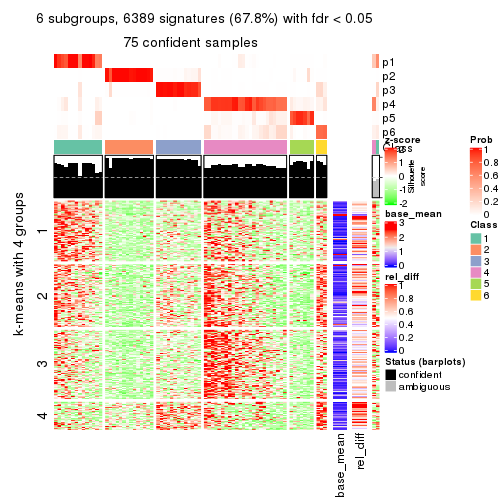</p>

</div>
</div>


Signature heatmaps where rows are not scaled:


<script>
$( function() {
	$( '#tabs-SD-mclust-get-signatures-no-scale' ).tabs();
} );
</script>
<div id='tabs-SD-mclust-get-signatures-no-scale'>
<ul>
<li><a href='#tab-SD-mclust-get-signatures-no-scale-1'>k = 2</a></li>
<li><a href='#tab-SD-mclust-get-signatures-no-scale-2'>k = 3</a></li>
<li><a href='#tab-SD-mclust-get-signatures-no-scale-3'>k = 4</a></li>
<li><a href='#tab-SD-mclust-get-signatures-no-scale-4'>k = 5</a></li>
<li><a href='#tab-SD-mclust-get-signatures-no-scale-5'>k = 6</a></li>
</ul>
<div id='tab-SD-mclust-get-signatures-no-scale-1'>
<pre><code class="r">get_signatures(res, k = 2, scale_rows = FALSE)
</code></pre>

<p>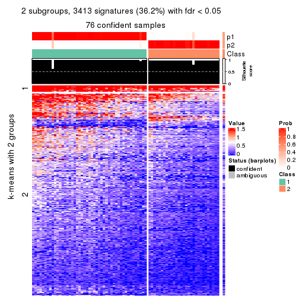</p>

</div>
<div id='tab-SD-mclust-get-signatures-no-scale-2'>
<pre><code class="r">get_signatures(res, k = 3, scale_rows = FALSE)
</code></pre>

<p></p>

</div>
<div id='tab-SD-mclust-get-signatures-no-scale-3'>
<pre><code class="r">get_signatures(res, k = 4, scale_rows = FALSE)
</code></pre>

<p></p>

</div>
<div id='tab-SD-mclust-get-signatures-no-scale-4'>
<pre><code class="r">get_signatures(res, k = 5, scale_rows = FALSE)
</code></pre>

<p></p>

</div>
<div id='tab-SD-mclust-get-signatures-no-scale-5'>
<pre><code class="r">get_signatures(res, k = 6, scale_rows = FALSE)
</code></pre>

<p></p>

</div>
</div>


Compare the overlap of signatures from different k:

```r
compare_signatures(res)
```


`get_signature()` returns a data frame invisibly. TO get the list of signatures, the function
call should be assigned to a variable explicitly. In following code, if `plot` argument is set
to `FALSE`, no heatmap is plotted while only the differential analysis is performed.

```r
# code only for demonstration
tb = get_signature(res, k = ..., plot = FALSE)
```

An example of the output of `tb` is:

```
#>   which_row         fdr    mean_1    mean_2 scaled_mean_1 scaled_mean_2 km
#> 1        38 0.042760348  8.373488  9.131774    -0.5533452     0.5164555  1
#> 2        40 0.018707592  7.106213  8.469186    -0.6173731     0.5762149  1
#> 3        55 0.019134737 10.221463 11.207825    -0.6159697     0.5749050  1
#> 4        59 0.006059896  5.921854  7.869574    -0.6899429     0.6439467  1
#> 5        60 0.018055526  8.928898 10.211722    -0.6204761     0.5791110  1
#> 6        98 0.009384629 15.714769 14.887706     0.6635654    -0.6193277  2
...
```

The columns in `tb` are:

1. `which_row`: row indices corresponding to the input matrix.
2. `fdr`: FDR for the differential test. 
3. `mean_x`: The mean value in group x.
4. `scaled_mean_x`: The mean value in group x after rows are scaled.
5. `km`: Row groups if k-means clustering is applied to rows.


UMAP plot which shows how samples are separated.


<script>
$( function() {
	$( '#tabs-SD-mclust-dimension-reduction' ).tabs();
} );
</script>
<div id='tabs-SD-mclust-dimension-reduction'>
<ul>
<li><a href='#tab-SD-mclust-dimension-reduction-1'>k = 2</a></li>
<li><a href='#tab-SD-mclust-dimension-reduction-2'>k = 3</a></li>
<li><a href='#tab-SD-mclust-dimension-reduction-3'>k = 4</a></li>
<li><a href='#tab-SD-mclust-dimension-reduction-4'>k = 5</a></li>
<li><a href='#tab-SD-mclust-dimension-reduction-5'>k = 6</a></li>
</ul>
<div id='tab-SD-mclust-dimension-reduction-1'>
<pre><code class="r">dimension_reduction(res, k = 2, method = &quot;UMAP&quot;)
</code></pre>

<p></p>

</div>
<div id='tab-SD-mclust-dimension-reduction-2'>
<pre><code class="r">dimension_reduction(res, k = 3, method = &quot;UMAP&quot;)
</code></pre>

<p></p>

</div>
<div id='tab-SD-mclust-dimension-reduction-3'>
<pre><code class="r">dimension_reduction(res, k = 4, method = &quot;UMAP&quot;)
</code></pre>

<p></p>

</div>
<div id='tab-SD-mclust-dimension-reduction-4'>
<pre><code class="r">dimension_reduction(res, k = 5, method = &quot;UMAP&quot;)
</code></pre>

<p></p>

</div>
<div id='tab-SD-mclust-dimension-reduction-5'>
<pre><code class="r">dimension_reduction(res, k = 6, method = &quot;UMAP&quot;)
</code></pre>

<p></p>

</div>
</div>


Following heatmap shows how subgroups are split when increasing `k`:

```r
collect_classes(res)
```


If matrix rows can be associated to genes, consider to use `GO_Enrichment(res,
...)` to perform function enrichment for the signature genes.


 

---------------------------------------------------


### SD:NMF*


The object with results only for a single top-value method and a single partition method 
can be extracted as:

```r
res = res_list["SD", "NMF"]
# you can also extract it by
# res = res_list["SD:NMF"]
```

A summary of `res` and all the functions that can be applied to it:

```r
res
```

```
#> A 'ConsensusPartition' object with k = 2, 3, 4, 5, 6.
#>   On a matrix with 9427 rows and 77 columns.
#>   Top rows (943, 1886, 2828, 3771, 4714) are extracted by 'SD' method.
#>   Subgroups are detected by 'NMF' method.
#>   Performed in total 1250 partitions by row resampling.
#>   Best k for subgroups seems to be 3.
#> 
#> Following methods can be applied to this 'ConsensusPartition' object:
#>  [1] "cola_report"             "collect_classes"         "collect_plots"          
#>  [4] "collect_stats"           "colnames"                "compare_signatures"     
#>  [7] "consensus_heatmap"       "dimension_reduction"     "functional_enrichment"  
#> [10] "get_anno_col"            "get_anno"                "get_classes"            
#> [13] "get_consensus"           "get_matrix"              "get_membership"         
#> [16] "get_param"               "get_signatures"          "get_stats"              
#> [19] "is_best_k"               "is_stable_k"             "membership_heatmap"     
#> [22] "ncol"                    "nrow"                    "plot_ecdf"              
#> [25] "rownames"                "select_partition_number" "show"                   
#> [28] "suggest_best_k"          "test_to_known_factors"
```

`collect_plots()` function collects all the plots made from `res` for all `k` (number of partitions)
into one single page to provide an easy and fast comparison between different `k`.

```r
collect_plots(res)
```


The plots are:

- The first row: a plot of the ECDF (Empirical cumulative distribution
  function) curves of the consensus matrix for each `k` and the heatmap of
  predicted classes for each `k`.
- The second row: heatmaps of the consensus matrix for each `k`.
- The third row: heatmaps of the membership matrix for each `k`.
- The fouth row: heatmaps of the signatures for each `k`.

All the plots in panels can be made by individual functions and they are
plotted later in this section.

`select_partition_number()` produces several plots showing different
statistics for choosing "optimized" `k`. There are following statistics:

- ECDF curves of the consensus matrix for each `k`;
- 1-PAC. [The PAC
  score](https://en.wikipedia.org/wiki/Consensus_clustering#Over-interpretation_potential_of_consensus_clustering)
  measures the proportion of the ambiguous subgrouping.
- Mean silhouette score.
- Concordance. The mean probability of fiting the consensus class ids in all
  partitions.
- Area increased. Denote $A_k$ as the area under the ECDF curve for current
  `k`, the area increased is defined as $A_k - A_{k-1}$.
- Rand index. The percent of pairs of samples that are both in a same cluster
  or both are not in a same cluster in the partition of k and k-1.
- Jaccard index. The ratio of pairs of samples are both in a same cluster in
  the partition of k and k-1 and the pairs of samples are both in a same
  cluster in the partition k or k-1.

The detailed explanations of these statistics can be found in [the cola
vignette](http://bioconductor.org/packages/devel/bioc/vignettes/cola/inst/doc/cola.html#toc_13).

Generally speaking, lower PAC score, higher mean silhouette score or higher
concordance corresponds to better partition. Rand index and Jaccard index
measure how similar the current partition is compared to partition with `k-1`.
If they are too similar, we won't accept `k` is better than `k-1`.

```r
select_partition_number(res)
```


The numeric values for all these statistics can be obtained by `get_stats()`.

```r
get_stats(res)
```

```
#>   k 1-PAC mean_silhouette concordance area_increased  Rand Jaccard
#> 2 2 1.000           0.976       0.989         0.5032 0.496   0.496
#> 3 3 0.924           0.910       0.963         0.3127 0.806   0.624
#> 4 4 0.814           0.775       0.896         0.0975 0.880   0.670
#> 5 5 0.744           0.656       0.793         0.0531 0.936   0.775
#> 6 6 0.716           0.606       0.769         0.0357 0.961   0.842
```

`suggest_best_k()` suggests the best $k$ based on these statistics. The rules are as follows:

- All $k$ with Jaccard index larger than 0.95 are removed because the increase of
  the partition number does not provides enough extra information. If all $k$ are removed,
  the best $k$ is assigned by `NA`.
- For $k$ with 1-PAC larger than 0.9, the maximal $k$ is taken as the "best k". Other $k$ is called "optional k".
- If it does not fit the second rule. The $k$ with the highest vote of highest
  1-PAC, mean silhouette and concordance is taken as the "best k".

```r
suggest_best_k(res)
```

```
#> [1] 3
#> attr(,"optional")
#> [1] 2
```

There is also optional best $k$ = 2 that is worth to check.

Following shows the table of the partitions (You need to click the **show/hide
code output** link to see it). The membership matrix (columns with name `p*`)
is inferred by
[`clue::cl_consensus()`](https://www.rdocumentation.org/link/cl_consensus?package=clue)
function with the `SE` method. Basically the value in the membership matrix
represents the probability to belong to a certain group. The finall class
label for an item is determined with the group with highest probability it
belongs to.

In `get_classes()` function, the entropy is calculated from the membership
matrix and the silhouette score is calculated from the consensus matrix.


<script>
$( function() {
	$( '#tabs-SD-NMF-get-classes' ).tabs();
} );
</script>
<div id='tabs-SD-NMF-get-classes'>
<ul>
<li><a href='#tab-SD-NMF-get-classes-1'>k = 2</a></li>
<li><a href='#tab-SD-NMF-get-classes-2'>k = 3</a></li>
<li><a href='#tab-SD-NMF-get-classes-3'>k = 4</a></li>
<li><a href='#tab-SD-NMF-get-classes-4'>k = 5</a></li>
<li><a href='#tab-SD-NMF-get-classes-5'>k = 6</a></li>
</ul>

<div id='tab-SD-NMF-get-classes-1'>
<p><a id='tab-SD-NMF-get-classes-1-a' style='color:#0366d6' href='#'>show/hide code output</a></p>
<pre><code class="r">cbind(get_classes(res, k = 2), get_membership(res, k = 2))
</code></pre>

<pre><code>#&gt;           class entropy silhouette    p1    p2
#&gt; SRR944011     2  0.0000      0.977 0.000 1.000
#&gt; SRR944012     1  0.0000      0.999 1.000 0.000
#&gt; SRR944014     2  0.0000      0.977 0.000 1.000
#&gt; SRR944013     1  0.0000      0.999 1.000 0.000
#&gt; SRR944015     1  0.1184      0.984 0.984 0.016
#&gt; SRR944016     1  0.0000      0.999 1.000 0.000
#&gt; SRR944017     1  0.0000      0.999 1.000 0.000
#&gt; SRR944018     1  0.0000      0.999 1.000 0.000
#&gt; SRR944019     1  0.0000      0.999 1.000 0.000
#&gt; SRR944020     1  0.0000      0.999 1.000 0.000
#&gt; SRR944021     2  0.0000      0.977 0.000 1.000
#&gt; SRR944022     1  0.0000      0.999 1.000 0.000
#&gt; SRR944023     2  0.0000      0.977 0.000 1.000
#&gt; SRR944024     1  0.0000      0.999 1.000 0.000
#&gt; SRR944026     1  0.0000      0.999 1.000 0.000
#&gt; SRR944025     1  0.0000      0.999 1.000 0.000
#&gt; SRR944028     1  0.0000      0.999 1.000 0.000
#&gt; SRR944029     1  0.0000      0.999 1.000 0.000
#&gt; SRR944030     2  0.0000      0.977 0.000 1.000
#&gt; SRR944031     2  0.0000      0.977 0.000 1.000
#&gt; SRR944032     1  0.0000      0.999 1.000 0.000
#&gt; SRR944033     2  0.0000      0.977 0.000 1.000
#&gt; SRR944034     2  0.0000      0.977 0.000 1.000
#&gt; SRR944036     2  0.0000      0.977 0.000 1.000
#&gt; SRR944035     2  0.7528      0.734 0.216 0.784
#&gt; SRR944038     2  0.0000      0.977 0.000 1.000
#&gt; SRR944037     1  0.0000      0.999 1.000 0.000
#&gt; SRR944039     1  0.0000      0.999 1.000 0.000
#&gt; SRR944040     2  0.0000      0.977 0.000 1.000
#&gt; SRR944041     1  0.0000      0.999 1.000 0.000
#&gt; SRR944042     2  0.0000      0.977 0.000 1.000
#&gt; SRR944043     1  0.0000      0.999 1.000 0.000
#&gt; SRR944044     1  0.0000      0.999 1.000 0.000
#&gt; SRR944046     2  0.0000      0.977 0.000 1.000
#&gt; SRR944045     2  0.0000      0.977 0.000 1.000
#&gt; SRR944047     2  0.0000      0.977 0.000 1.000
#&gt; SRR944048     1  0.0000      0.999 1.000 0.000
#&gt; SRR944049     2  0.8267      0.663 0.260 0.740
#&gt; SRR944050     1  0.0000      0.999 1.000 0.000
#&gt; SRR944051     1  0.0000      0.999 1.000 0.000
#&gt; SRR944052     2  0.0000      0.977 0.000 1.000
#&gt; SRR944053     1  0.0000      0.999 1.000 0.000
#&gt; SRR944054     1  0.0000      0.999 1.000 0.000
#&gt; SRR944055     2  0.0000      0.977 0.000 1.000
#&gt; SRR944056     2  0.0000      0.977 0.000 1.000
#&gt; SRR944057     1  0.0000      0.999 1.000 0.000
#&gt; SRR944058     1  0.0000      0.999 1.000 0.000
#&gt; SRR944059     2  0.0000      0.977 0.000 1.000
#&gt; SRR944060     2  0.0000      0.977 0.000 1.000
#&gt; SRR944061     2  0.0000      0.977 0.000 1.000
#&gt; SRR944062     1  0.0000      0.999 1.000 0.000
#&gt; SRR944063     1  0.0000      0.999 1.000 0.000
#&gt; SRR944064     1  0.0672      0.992 0.992 0.008
#&gt; SRR944065     1  0.0000      0.999 1.000 0.000
#&gt; SRR944066     1  0.0000      0.999 1.000 0.000
#&gt; SRR944067     1  0.0000      0.999 1.000 0.000
#&gt; SRR944068     1  0.0938      0.988 0.988 0.012
#&gt; SRR944069     2  0.0000      0.977 0.000 1.000
#&gt; SRR944070     2  0.0000      0.977 0.000 1.000
#&gt; SRR944071     2  0.0000      0.977 0.000 1.000
#&gt; SRR944072     1  0.0000      0.999 1.000 0.000
#&gt; SRR944073     2  0.0000      0.977 0.000 1.000
#&gt; SRR944075     2  0.0000      0.977 0.000 1.000
#&gt; SRR944074     1  0.0000      0.999 1.000 0.000
#&gt; SRR944076     2  0.0000      0.977 0.000 1.000
#&gt; SRR944077     2  0.0000      0.977 0.000 1.000
#&gt; SRR944078     2  0.0000      0.977 0.000 1.000
#&gt; SRR944079     2  0.0000      0.977 0.000 1.000
#&gt; SRR944080     2  0.0000      0.977 0.000 1.000
#&gt; SRR944081     1  0.0000      0.999 1.000 0.000
#&gt; SRR944082     1  0.0000      0.999 1.000 0.000
#&gt; SRR944083     1  0.0000      0.999 1.000 0.000
#&gt; SRR944084     2  0.8909      0.572 0.308 0.692
#&gt; SRR944085     2  0.0000      0.977 0.000 1.000
#&gt; SRR944086     1  0.0000      0.999 1.000 0.000
#&gt; SRR944088     1  0.0000      0.999 1.000 0.000
#&gt; SRR944087     2  0.0000      0.977 0.000 1.000
</code></pre>

<script>
$('#tab-SD-NMF-get-classes-1-a').parent().next().next().hide();
$('#tab-SD-NMF-get-classes-1-a').click(function(){
  $('#tab-SD-NMF-get-classes-1-a').parent().next().next().toggle();
  return(false);
});
</script>
</div>

<div id='tab-SD-NMF-get-classes-2'>
<p><a id='tab-SD-NMF-get-classes-2-a' style='color:#0366d6' href='#'>show/hide code output</a></p>
<pre><code class="r">cbind(get_classes(res, k = 3), get_membership(res, k = 3))
</code></pre>

<pre><code>#&gt;           class entropy silhouette    p1    p2    p3
#&gt; SRR944011     3  0.0000      0.982 0.000 0.000 1.000
#&gt; SRR944012     2  0.0237      0.928 0.004 0.996 0.000
#&gt; SRR944014     3  0.0000      0.982 0.000 0.000 1.000
#&gt; SRR944013     2  0.0747      0.923 0.016 0.984 0.000
#&gt; SRR944015     2  0.0000      0.930 0.000 1.000 0.000
#&gt; SRR944016     1  0.0000      0.955 1.000 0.000 0.000
#&gt; SRR944017     2  0.3340      0.841 0.120 0.880 0.000
#&gt; SRR944018     2  0.6062      0.423 0.384 0.616 0.000
#&gt; SRR944019     2  0.0747      0.923 0.016 0.984 0.000
#&gt; SRR944020     2  0.0000      0.930 0.000 1.000 0.000
#&gt; SRR944021     3  0.0000      0.982 0.000 0.000 1.000
#&gt; SRR944022     2  0.0000      0.930 0.000 1.000 0.000
#&gt; SRR944023     1  0.5591      0.544 0.696 0.000 0.304
#&gt; SRR944024     1  0.0000      0.955 1.000 0.000 0.000
#&gt; SRR944026     2  0.0000      0.930 0.000 1.000 0.000
#&gt; SRR944025     1  0.0000      0.955 1.000 0.000 0.000
#&gt; SRR944028     1  0.0237      0.952 0.996 0.004 0.000
#&gt; SRR944029     2  0.0000      0.930 0.000 1.000 0.000
#&gt; SRR944030     3  0.0000      0.982 0.000 0.000 1.000
#&gt; SRR944031     3  0.0000      0.982 0.000 0.000 1.000
#&gt; SRR944032     1  0.0000      0.955 1.000 0.000 0.000
#&gt; SRR944033     3  0.0000      0.982 0.000 0.000 1.000
#&gt; SRR944034     3  0.0000      0.982 0.000 0.000 1.000
#&gt; SRR944036     3  0.6215      0.225 0.428 0.000 0.572
#&gt; SRR944035     1  0.0000      0.955 1.000 0.000 0.000
#&gt; SRR944038     3  0.0000      0.982 0.000 0.000 1.000
#&gt; SRR944037     2  0.0000      0.930 0.000 1.000 0.000
#&gt; SRR944039     2  0.5621      0.591 0.308 0.692 0.000
#&gt; SRR944040     3  0.0000      0.982 0.000 0.000 1.000
#&gt; SRR944041     2  0.0237      0.928 0.004 0.996 0.000
#&gt; SRR944042     3  0.0000      0.982 0.000 0.000 1.000
#&gt; SRR944043     2  0.6008      0.453 0.372 0.628 0.000
#&gt; SRR944044     2  0.0000      0.930 0.000 1.000 0.000
#&gt; SRR944046     3  0.0000      0.982 0.000 0.000 1.000
#&gt; SRR944045     3  0.0000      0.982 0.000 0.000 1.000
#&gt; SRR944047     3  0.0000      0.982 0.000 0.000 1.000
#&gt; SRR944048     1  0.0000      0.955 1.000 0.000 0.000
#&gt; SRR944049     3  0.2434      0.929 0.036 0.024 0.940
#&gt; SRR944050     1  0.0000      0.955 1.000 0.000 0.000
#&gt; SRR944051     2  0.4399      0.765 0.188 0.812 0.000
#&gt; SRR944052     3  0.0000      0.982 0.000 0.000 1.000
#&gt; SRR944053     2  0.0000      0.930 0.000 1.000 0.000
#&gt; SRR944054     2  0.0000      0.930 0.000 1.000 0.000
#&gt; SRR944055     3  0.0000      0.982 0.000 0.000 1.000
#&gt; SRR944056     3  0.0000      0.982 0.000 0.000 1.000
#&gt; SRR944057     1  0.0000      0.955 1.000 0.000 0.000
#&gt; SRR944058     1  0.0000      0.955 1.000 0.000 0.000
#&gt; SRR944059     3  0.0000      0.982 0.000 0.000 1.000
#&gt; SRR944060     3  0.2448      0.904 0.000 0.076 0.924
#&gt; SRR944061     3  0.0000      0.982 0.000 0.000 1.000
#&gt; SRR944062     1  0.0000      0.955 1.000 0.000 0.000
#&gt; SRR944063     2  0.0000      0.930 0.000 1.000 0.000
#&gt; SRR944064     1  0.0000      0.955 1.000 0.000 0.000
#&gt; SRR944065     2  0.4291      0.778 0.180 0.820 0.000
#&gt; SRR944066     1  0.0000      0.955 1.000 0.000 0.000
#&gt; SRR944067     1  0.0000      0.955 1.000 0.000 0.000
#&gt; SRR944068     2  0.0000      0.930 0.000 1.000 0.000
#&gt; SRR944069     3  0.0000      0.982 0.000 0.000 1.000
#&gt; SRR944070     3  0.0000      0.982 0.000 0.000 1.000
#&gt; SRR944071     3  0.0000      0.982 0.000 0.000 1.000
#&gt; SRR944072     1  0.0237      0.952 0.996 0.004 0.000
#&gt; SRR944073     3  0.0000      0.982 0.000 0.000 1.000
#&gt; SRR944075     3  0.0000      0.982 0.000 0.000 1.000
#&gt; SRR944074     2  0.0237      0.928 0.004 0.996 0.000
#&gt; SRR944076     3  0.0000      0.982 0.000 0.000 1.000
#&gt; SRR944077     3  0.0000      0.982 0.000 0.000 1.000
#&gt; SRR944078     3  0.0000      0.982 0.000 0.000 1.000
#&gt; SRR944079     3  0.0000      0.982 0.000 0.000 1.000
#&gt; SRR944080     3  0.0000      0.982 0.000 0.000 1.000
#&gt; SRR944081     2  0.0000      0.930 0.000 1.000 0.000
#&gt; SRR944082     1  0.0000      0.955 1.000 0.000 0.000
#&gt; SRR944083     1  0.0000      0.955 1.000 0.000 0.000
#&gt; SRR944084     2  0.0237      0.927 0.000 0.996 0.004
#&gt; SRR944085     3  0.0000      0.982 0.000 0.000 1.000
#&gt; SRR944086     1  0.6026      0.299 0.624 0.376 0.000
#&gt; SRR944088     2  0.0000      0.930 0.000 1.000 0.000
#&gt; SRR944087     3  0.0000      0.982 0.000 0.000 1.000
</code></pre>

<script>
$('#tab-SD-NMF-get-classes-2-a').parent().next().next().hide();
$('#tab-SD-NMF-get-classes-2-a').click(function(){
  $('#tab-SD-NMF-get-classes-2-a').parent().next().next().toggle();
  return(false);
});
</script>
</div>

<div id='tab-SD-NMF-get-classes-3'>
<p><a id='tab-SD-NMF-get-classes-3-a' style='color:#0366d6' href='#'>show/hide code output</a></p>
<pre><code class="r">cbind(get_classes(res, k = 4), get_membership(res, k = 4))
</code></pre>

<pre><code>#&gt;           class entropy silhouette    p1    p2    p3    p4
#&gt; SRR944011     2  0.0000     0.9905 0.000 1.000 0.000 0.000
#&gt; SRR944012     4  0.0524     0.7491 0.008 0.000 0.004 0.988
#&gt; SRR944014     2  0.0000     0.9905 0.000 1.000 0.000 0.000
#&gt; SRR944013     4  0.3224     0.6966 0.016 0.000 0.120 0.864
#&gt; SRR944015     3  0.3355     0.6439 0.000 0.004 0.836 0.160
#&gt; SRR944016     1  0.2921     0.8505 0.860 0.000 0.140 0.000
#&gt; SRR944017     3  0.1284     0.6864 0.024 0.000 0.964 0.012
#&gt; SRR944018     3  0.2131     0.6904 0.032 0.000 0.932 0.036
#&gt; SRR944019     3  0.5167     0.0665 0.004 0.000 0.508 0.488
#&gt; SRR944020     4  0.4713     0.2847 0.000 0.000 0.360 0.640
#&gt; SRR944021     2  0.0000     0.9905 0.000 1.000 0.000 0.000
#&gt; SRR944022     4  0.4948     0.0224 0.000 0.000 0.440 0.560
#&gt; SRR944023     1  0.6149     0.6137 0.676 0.180 0.144 0.000
#&gt; SRR944024     1  0.0336     0.8797 0.992 0.000 0.008 0.000
#&gt; SRR944026     4  0.0707     0.7561 0.000 0.000 0.020 0.980
#&gt; SRR944025     1  0.1545     0.8802 0.952 0.000 0.040 0.008
#&gt; SRR944028     1  0.1767     0.8791 0.944 0.000 0.044 0.012
#&gt; SRR944029     4  0.0469     0.7557 0.000 0.000 0.012 0.988
#&gt; SRR944030     3  0.4500     0.4358 0.000 0.316 0.684 0.000
#&gt; SRR944031     2  0.1022     0.9627 0.000 0.968 0.032 0.000
#&gt; SRR944032     1  0.0779     0.8767 0.980 0.000 0.016 0.004
#&gt; SRR944033     2  0.0000     0.9905 0.000 1.000 0.000 0.000
#&gt; SRR944034     2  0.0188     0.9889 0.000 0.996 0.004 0.000
#&gt; SRR944036     1  0.5842     0.2020 0.520 0.448 0.032 0.000
#&gt; SRR944035     1  0.1305     0.8769 0.960 0.000 0.036 0.004
#&gt; SRR944038     2  0.0000     0.9905 0.000 1.000 0.000 0.000
#&gt; SRR944037     3  0.4992     0.1674 0.000 0.000 0.524 0.476
#&gt; SRR944039     3  0.2775     0.6623 0.084 0.000 0.896 0.020
#&gt; SRR944040     2  0.0000     0.9905 0.000 1.000 0.000 0.000
#&gt; SRR944041     4  0.0817     0.7553 0.000 0.000 0.024 0.976
#&gt; SRR944042     2  0.0000     0.9905 0.000 1.000 0.000 0.000
#&gt; SRR944043     3  0.2021     0.6876 0.040 0.000 0.936 0.024
#&gt; SRR944044     4  0.0336     0.7555 0.000 0.000 0.008 0.992
#&gt; SRR944046     2  0.0000     0.9905 0.000 1.000 0.000 0.000
#&gt; SRR944045     2  0.0000     0.9905 0.000 1.000 0.000 0.000
#&gt; SRR944047     2  0.0188     0.9889 0.000 0.996 0.004 0.000
#&gt; SRR944048     1  0.0707     0.8826 0.980 0.000 0.020 0.000
#&gt; SRR944049     4  0.7515     0.1491 0.124 0.368 0.016 0.492
#&gt; SRR944050     1  0.3219     0.8363 0.836 0.000 0.164 0.000
#&gt; SRR944051     4  0.2706     0.6874 0.080 0.000 0.020 0.900
#&gt; SRR944052     2  0.0000     0.9905 0.000 1.000 0.000 0.000
#&gt; SRR944053     4  0.3649     0.5983 0.000 0.000 0.204 0.796
#&gt; SRR944054     4  0.0336     0.7560 0.000 0.000 0.008 0.992
#&gt; SRR944055     2  0.0000     0.9905 0.000 1.000 0.000 0.000
#&gt; SRR944056     2  0.0992     0.9706 0.004 0.976 0.008 0.012
#&gt; SRR944057     1  0.3074     0.8441 0.848 0.000 0.152 0.000
#&gt; SRR944058     1  0.1174     0.8772 0.968 0.000 0.020 0.012
#&gt; SRR944059     2  0.0000     0.9905 0.000 1.000 0.000 0.000
#&gt; SRR944060     3  0.1978     0.6629 0.000 0.068 0.928 0.004
#&gt; SRR944061     2  0.0000     0.9905 0.000 1.000 0.000 0.000
#&gt; SRR944062     1  0.1389     0.8790 0.952 0.000 0.048 0.000
#&gt; SRR944063     4  0.1211     0.7501 0.000 0.000 0.040 0.960
#&gt; SRR944064     1  0.0592     0.8814 0.984 0.000 0.016 0.000
#&gt; SRR944065     4  0.5228     0.4865 0.268 0.000 0.036 0.696
#&gt; SRR944066     1  0.3942     0.7787 0.764 0.000 0.236 0.000
#&gt; SRR944067     1  0.1004     0.8740 0.972 0.000 0.024 0.004
#&gt; SRR944068     4  0.4477     0.4093 0.000 0.000 0.312 0.688
#&gt; SRR944069     2  0.0188     0.9889 0.000 0.996 0.004 0.000
#&gt; SRR944070     2  0.0188     0.9882 0.000 0.996 0.004 0.000
#&gt; SRR944071     2  0.3266     0.7936 0.000 0.832 0.168 0.000
#&gt; SRR944072     1  0.3942     0.7776 0.764 0.000 0.236 0.000
#&gt; SRR944073     2  0.0188     0.9889 0.000 0.996 0.004 0.000
#&gt; SRR944075     2  0.0000     0.9905 0.000 1.000 0.000 0.000
#&gt; SRR944074     4  0.0000     0.7535 0.000 0.000 0.000 1.000
#&gt; SRR944076     2  0.0188     0.9882 0.000 0.996 0.004 0.000
#&gt; SRR944077     2  0.0000     0.9905 0.000 1.000 0.000 0.000
#&gt; SRR944078     2  0.0000     0.9905 0.000 1.000 0.000 0.000
#&gt; SRR944079     2  0.0188     0.9889 0.000 0.996 0.004 0.000
#&gt; SRR944080     2  0.0188     0.9889 0.000 0.996 0.004 0.000
#&gt; SRR944081     3  0.4925     0.3082 0.000 0.000 0.572 0.428
#&gt; SRR944082     1  0.2281     0.8653 0.904 0.000 0.096 0.000
#&gt; SRR944083     1  0.0592     0.8825 0.984 0.000 0.016 0.000
#&gt; SRR944084     3  0.4855     0.4496 0.000 0.004 0.644 0.352
#&gt; SRR944085     2  0.0000     0.9905 0.000 1.000 0.000 0.000
#&gt; SRR944086     4  0.5906     0.2137 0.436 0.000 0.036 0.528
#&gt; SRR944088     4  0.1022     0.7533 0.000 0.000 0.032 0.968
#&gt; SRR944087     2  0.0000     0.9905 0.000 1.000 0.000 0.000
</code></pre>

<script>
$('#tab-SD-NMF-get-classes-3-a').parent().next().next().hide();
$('#tab-SD-NMF-get-classes-3-a').click(function(){
  $('#tab-SD-NMF-get-classes-3-a').parent().next().next().toggle();
  return(false);
});
</script>
</div>

<div id='tab-SD-NMF-get-classes-4'>
<p><a id='tab-SD-NMF-get-classes-4-a' style='color:#0366d6' href='#'>show/hide code output</a></p>
<pre><code class="r">cbind(get_classes(res, k = 5), get_membership(res, k = 5))
</code></pre>

<pre><code>#&gt;           class entropy silhouette    p1    p2    p3    p4    p5
#&gt; SRR944011     2  0.1568     0.9326 0.020 0.944 0.000 0.036 0.000
#&gt; SRR944012     5  0.1484     0.7694 0.048 0.000 0.000 0.008 0.944
#&gt; SRR944014     2  0.0162     0.9495 0.000 0.996 0.000 0.004 0.000
#&gt; SRR944013     5  0.6032     0.4481 0.220 0.000 0.020 0.132 0.628
#&gt; SRR944015     4  0.2251     0.6239 0.024 0.008 0.000 0.916 0.052
#&gt; SRR944016     1  0.4978     0.5306 0.496 0.000 0.476 0.028 0.000
#&gt; SRR944017     4  0.4350     0.1733 0.408 0.000 0.004 0.588 0.000
#&gt; SRR944018     4  0.3068     0.5991 0.072 0.000 0.032 0.876 0.020
#&gt; SRR944019     1  0.6739    -0.2370 0.400 0.000 0.000 0.336 0.264
#&gt; SRR944020     5  0.4540     0.2766 0.020 0.000 0.000 0.340 0.640
#&gt; SRR944021     2  0.0290     0.9502 0.008 0.992 0.000 0.000 0.000
#&gt; SRR944022     4  0.5049     0.0826 0.032 0.000 0.000 0.484 0.484
#&gt; SRR944023     3  0.5823     0.4947 0.096 0.084 0.700 0.120 0.000
#&gt; SRR944024     3  0.0693     0.6540 0.012 0.000 0.980 0.008 0.000
#&gt; SRR944026     5  0.0451     0.7781 0.008 0.000 0.000 0.004 0.988
#&gt; SRR944025     1  0.4670     0.4724 0.548 0.000 0.440 0.008 0.004
#&gt; SRR944028     3  0.4595    -0.1261 0.488 0.000 0.504 0.004 0.004
#&gt; SRR944029     5  0.0510     0.7774 0.016 0.000 0.000 0.000 0.984
#&gt; SRR944030     4  0.5981     0.1828 0.112 0.404 0.000 0.484 0.000
#&gt; SRR944031     2  0.1270     0.9274 0.000 0.948 0.000 0.052 0.000
#&gt; SRR944032     3  0.3551     0.6020 0.220 0.000 0.772 0.008 0.000
#&gt; SRR944033     2  0.0000     0.9494 0.000 1.000 0.000 0.000 0.000
#&gt; SRR944034     2  0.0566     0.9490 0.012 0.984 0.000 0.004 0.000
#&gt; SRR944036     3  0.6302     0.4212 0.132 0.156 0.648 0.064 0.000
#&gt; SRR944035     3  0.4419     0.5133 0.344 0.008 0.644 0.004 0.000
#&gt; SRR944038     2  0.3056     0.8840 0.056 0.876 0.012 0.056 0.000
#&gt; SRR944037     4  0.5188     0.4155 0.056 0.000 0.000 0.600 0.344
#&gt; SRR944039     1  0.5652    -0.0383 0.468 0.000 0.064 0.464 0.004
#&gt; SRR944040     2  0.0000     0.9494 0.000 1.000 0.000 0.000 0.000
#&gt; SRR944041     5  0.1399     0.7760 0.028 0.000 0.000 0.020 0.952
#&gt; SRR944042     2  0.1300     0.9376 0.028 0.956 0.000 0.016 0.000
#&gt; SRR944043     4  0.3256     0.5853 0.084 0.000 0.028 0.864 0.024
#&gt; SRR944044     5  0.1082     0.7770 0.028 0.000 0.000 0.008 0.964
#&gt; SRR944046     2  0.0798     0.9465 0.016 0.976 0.000 0.008 0.000
#&gt; SRR944045     2  0.0162     0.9496 0.000 0.996 0.000 0.004 0.000
#&gt; SRR944047     2  0.0162     0.9495 0.000 0.996 0.000 0.004 0.000
#&gt; SRR944048     3  0.1851     0.5987 0.088 0.000 0.912 0.000 0.000
#&gt; SRR944049     5  0.7319     0.2309 0.120 0.292 0.048 0.020 0.520
#&gt; SRR944050     1  0.4855     0.5703 0.552 0.000 0.424 0.024 0.000
#&gt; SRR944051     5  0.4291     0.6729 0.160 0.000 0.044 0.016 0.780
#&gt; SRR944052     2  0.1012     0.9430 0.020 0.968 0.000 0.012 0.000
#&gt; SRR944053     5  0.4192     0.5267 0.032 0.000 0.000 0.232 0.736
#&gt; SRR944054     5  0.1943     0.7617 0.056 0.000 0.000 0.020 0.924
#&gt; SRR944055     2  0.0324     0.9499 0.004 0.992 0.000 0.004 0.000
#&gt; SRR944056     2  0.1932     0.9245 0.032 0.936 0.008 0.020 0.004
#&gt; SRR944057     1  0.4965     0.5510 0.520 0.000 0.452 0.028 0.000
#&gt; SRR944058     3  0.3861     0.3402 0.284 0.000 0.712 0.000 0.004
#&gt; SRR944059     2  0.0162     0.9500 0.004 0.996 0.000 0.000 0.000
#&gt; SRR944060     4  0.3649     0.5229 0.152 0.040 0.000 0.808 0.000
#&gt; SRR944061     2  0.0451     0.9488 0.008 0.988 0.000 0.004 0.000
#&gt; SRR944062     3  0.1877     0.6458 0.064 0.000 0.924 0.012 0.000
#&gt; SRR944063     5  0.1725     0.7565 0.020 0.000 0.000 0.044 0.936
#&gt; SRR944064     3  0.0566     0.6489 0.012 0.000 0.984 0.004 0.000
#&gt; SRR944065     5  0.6735     0.2952 0.168 0.000 0.304 0.020 0.508
#&gt; SRR944066     1  0.5693     0.5414 0.468 0.000 0.452 0.080 0.000
#&gt; SRR944067     3  0.2806     0.6334 0.152 0.000 0.844 0.004 0.000
#&gt; SRR944068     4  0.5573     0.4416 0.076 0.008 0.000 0.612 0.304
#&gt; SRR944069     2  0.0798     0.9476 0.016 0.976 0.000 0.008 0.000
#&gt; SRR944070     2  0.2260     0.9100 0.028 0.908 0.000 0.064 0.000
#&gt; SRR944071     2  0.3534     0.6755 0.000 0.744 0.000 0.256 0.000
#&gt; SRR944072     1  0.5775     0.5382 0.496 0.000 0.424 0.076 0.004
#&gt; SRR944073     2  0.0451     0.9488 0.008 0.988 0.000 0.004 0.000
#&gt; SRR944075     2  0.0671     0.9467 0.016 0.980 0.000 0.004 0.000
#&gt; SRR944074     5  0.1041     0.7749 0.032 0.000 0.000 0.004 0.964
#&gt; SRR944076     2  0.5543     0.7030 0.088 0.724 0.096 0.092 0.000
#&gt; SRR944077     2  0.0451     0.9488 0.008 0.988 0.000 0.004 0.000
#&gt; SRR944078     2  0.0404     0.9483 0.012 0.988 0.000 0.000 0.000
#&gt; SRR944079     2  0.0162     0.9495 0.000 0.996 0.000 0.004 0.000
#&gt; SRR944080     2  0.1569     0.9339 0.032 0.948 0.008 0.012 0.000
#&gt; SRR944081     4  0.5547     0.3809 0.080 0.000 0.000 0.564 0.356
#&gt; SRR944082     3  0.2735     0.6301 0.084 0.000 0.880 0.036 0.000
#&gt; SRR944083     3  0.3160     0.4648 0.188 0.000 0.808 0.004 0.000
#&gt; SRR944084     4  0.4384     0.5956 0.032 0.020 0.000 0.764 0.184
#&gt; SRR944085     2  0.3279     0.8790 0.048 0.864 0.016 0.072 0.000
#&gt; SRR944086     3  0.6708     0.3753 0.288 0.000 0.520 0.020 0.172
#&gt; SRR944088     5  0.1018     0.7754 0.016 0.000 0.000 0.016 0.968
#&gt; SRR944087     2  0.3142     0.8780 0.056 0.868 0.008 0.068 0.000
</code></pre>

<script>
$('#tab-SD-NMF-get-classes-4-a').parent().next().next().hide();
$('#tab-SD-NMF-get-classes-4-a').click(function(){
  $('#tab-SD-NMF-get-classes-4-a').parent().next().next().toggle();
  return(false);
});
</script>
</div>

<div id='tab-SD-NMF-get-classes-5'>
<p><a id='tab-SD-NMF-get-classes-5-a' style='color:#0366d6' href='#'>show/hide code output</a></p>
<pre><code class="r">cbind(get_classes(res, k = 6), get_membership(res, k = 6))
</code></pre>

<pre><code>#&gt;           class entropy silhouette    p1    p2    p3    p4    p5    p6
#&gt; SRR944011     2  0.0551     0.9209 0.000 0.984 0.004 0.004 0.000 0.008
#&gt; SRR944012     5  0.2757     0.6810 0.004 0.000 0.008 0.004 0.848 0.136
#&gt; SRR944014     2  0.0146     0.9215 0.000 0.996 0.000 0.004 0.000 0.000
#&gt; SRR944013     5  0.7735     0.2134 0.156 0.000 0.028 0.184 0.432 0.200
#&gt; SRR944015     4  0.3227     0.5693 0.000 0.008 0.036 0.860 0.040 0.056
#&gt; SRR944016     1  0.2058     0.7215 0.908 0.000 0.072 0.012 0.000 0.008
#&gt; SRR944017     4  0.5476     0.3329 0.380 0.000 0.036 0.536 0.004 0.044
#&gt; SRR944018     4  0.3538     0.5562 0.028 0.000 0.084 0.836 0.008 0.044
#&gt; SRR944019     4  0.7893     0.2812 0.284 0.000 0.020 0.344 0.180 0.172
#&gt; SRR944020     5  0.4945    -0.0054 0.000 0.000 0.000 0.452 0.484 0.064
#&gt; SRR944021     2  0.0767     0.9214 0.004 0.976 0.008 0.000 0.000 0.012
#&gt; SRR944022     4  0.5768     0.2414 0.004 0.000 0.012 0.536 0.324 0.124
#&gt; SRR944023     3  0.6453     0.2429 0.064 0.040 0.620 0.172 0.004 0.100
#&gt; SRR944024     3  0.3731     0.5937 0.240 0.000 0.736 0.004 0.000 0.020
#&gt; SRR944026     5  0.0622     0.7205 0.000 0.000 0.000 0.008 0.980 0.012
#&gt; SRR944025     1  0.3400     0.6707 0.832 0.000 0.064 0.008 0.004 0.092
#&gt; SRR944028     1  0.6366    -0.1035 0.436 0.000 0.144 0.016 0.016 0.388
#&gt; SRR944029     5  0.0665     0.7184 0.000 0.000 0.004 0.008 0.980 0.008
#&gt; SRR944030     4  0.6564     0.2288 0.096 0.364 0.040 0.472 0.000 0.028
#&gt; SRR944031     2  0.2130     0.8910 0.008 0.916 0.020 0.048 0.000 0.008
#&gt; SRR944032     6  0.6050     0.1981 0.276 0.000 0.312 0.000 0.000 0.412
#&gt; SRR944033     2  0.0291     0.9218 0.000 0.992 0.000 0.004 0.000 0.004
#&gt; SRR944034     2  0.1375     0.9162 0.008 0.952 0.008 0.004 0.000 0.028
#&gt; SRR944036     3  0.5879     0.2258 0.032 0.112 0.660 0.044 0.000 0.152
#&gt; SRR944035     6  0.5879     0.3923 0.228 0.000 0.260 0.004 0.000 0.508
#&gt; SRR944038     2  0.3525     0.8005 0.000 0.800 0.156 0.012 0.000 0.032
#&gt; SRR944037     4  0.5225     0.3808 0.004 0.000 0.008 0.620 0.272 0.096
#&gt; SRR944039     4  0.6558     0.2850 0.356 0.000 0.052 0.468 0.012 0.112
#&gt; SRR944040     2  0.0260     0.9218 0.000 0.992 0.000 0.000 0.000 0.008
#&gt; SRR944041     5  0.1882     0.7125 0.000 0.000 0.008 0.012 0.920 0.060
#&gt; SRR944042     2  0.1257     0.9124 0.000 0.952 0.028 0.000 0.000 0.020
#&gt; SRR944043     4  0.4493     0.5041 0.056 0.000 0.120 0.764 0.004 0.056
#&gt; SRR944044     5  0.1668     0.7140 0.000 0.000 0.004 0.008 0.928 0.060
#&gt; SRR944046     2  0.0291     0.9215 0.000 0.992 0.000 0.004 0.000 0.004
#&gt; SRR944045     2  0.0551     0.9219 0.000 0.984 0.004 0.004 0.000 0.008
#&gt; SRR944047     2  0.0653     0.9215 0.004 0.980 0.000 0.004 0.000 0.012
#&gt; SRR944048     3  0.4362     0.4580 0.392 0.000 0.584 0.004 0.000 0.020
#&gt; SRR944049     5  0.7454     0.2937 0.056 0.168 0.060 0.020 0.536 0.160
#&gt; SRR944050     1  0.0964     0.7334 0.968 0.000 0.012 0.016 0.000 0.004
#&gt; SRR944051     5  0.5011     0.1058 0.004 0.000 0.048 0.004 0.492 0.452
#&gt; SRR944052     2  0.1931     0.8958 0.004 0.916 0.008 0.004 0.000 0.068
#&gt; SRR944053     5  0.5887     0.3284 0.012 0.000 0.008 0.260 0.564 0.156
#&gt; SRR944054     5  0.3037     0.6916 0.008 0.000 0.012 0.008 0.840 0.132
#&gt; SRR944055     2  0.0508     0.9222 0.000 0.984 0.000 0.004 0.000 0.012
#&gt; SRR944056     2  0.2572     0.8768 0.004 0.884 0.008 0.008 0.008 0.088
#&gt; SRR944057     1  0.1148     0.7370 0.960 0.000 0.020 0.016 0.000 0.004
#&gt; SRR944058     1  0.5969     0.2164 0.560 0.000 0.260 0.016 0.008 0.156
#&gt; SRR944059     2  0.0777     0.9200 0.000 0.972 0.004 0.000 0.000 0.024
#&gt; SRR944060     4  0.4586     0.5253 0.156 0.036 0.036 0.752 0.000 0.020
#&gt; SRR944061     2  0.0582     0.9216 0.004 0.984 0.004 0.004 0.000 0.004
#&gt; SRR944062     3  0.3012     0.5929 0.196 0.000 0.796 0.000 0.000 0.008
#&gt; SRR944063     5  0.4077     0.6387 0.000 0.000 0.008 0.100 0.768 0.124
#&gt; SRR944064     3  0.3756     0.5854 0.268 0.000 0.712 0.000 0.000 0.020
#&gt; SRR944065     6  0.6562     0.4454 0.032 0.000 0.240 0.016 0.192 0.520
#&gt; SRR944066     1  0.2789     0.7149 0.864 0.000 0.088 0.044 0.000 0.004
#&gt; SRR944067     3  0.5631    -0.1902 0.156 0.000 0.484 0.000 0.000 0.360
#&gt; SRR944068     4  0.6631     0.2153 0.000 0.008 0.048 0.476 0.316 0.152
#&gt; SRR944069     2  0.1760     0.9088 0.004 0.936 0.020 0.012 0.000 0.028
#&gt; SRR944070     2  0.2274     0.8915 0.000 0.908 0.028 0.028 0.000 0.036
#&gt; SRR944071     2  0.4991     0.3454 0.012 0.576 0.024 0.372 0.000 0.016
#&gt; SRR944072     1  0.3728     0.6821 0.816 0.000 0.052 0.040 0.000 0.092
#&gt; SRR944073     2  0.0146     0.9215 0.000 0.996 0.000 0.004 0.000 0.000
#&gt; SRR944075     2  0.0717     0.9199 0.000 0.976 0.008 0.000 0.000 0.016
#&gt; SRR944074     5  0.1714     0.7082 0.000 0.000 0.000 0.000 0.908 0.092
#&gt; SRR944076     2  0.5246     0.6126 0.000 0.652 0.228 0.032 0.000 0.088
#&gt; SRR944077     2  0.0291     0.9213 0.000 0.992 0.000 0.004 0.000 0.004
#&gt; SRR944078     2  0.0603     0.9215 0.000 0.980 0.004 0.000 0.000 0.016
#&gt; SRR944079     2  0.0146     0.9215 0.000 0.996 0.000 0.004 0.000 0.000
#&gt; SRR944080     2  0.3896     0.8064 0.008 0.796 0.048 0.008 0.004 0.136
#&gt; SRR944081     4  0.5786     0.3875 0.020 0.000 0.016 0.604 0.252 0.108
#&gt; SRR944082     3  0.3492     0.5688 0.168 0.000 0.796 0.020 0.000 0.016
#&gt; SRR944083     3  0.4315     0.2460 0.492 0.000 0.492 0.004 0.000 0.012
#&gt; SRR944084     4  0.4388     0.5420 0.000 0.012 0.028 0.776 0.108 0.076
#&gt; SRR944085     2  0.5208     0.6879 0.000 0.684 0.180 0.060 0.000 0.076
#&gt; SRR944086     6  0.5924     0.5048 0.060 0.000 0.164 0.028 0.092 0.656
#&gt; SRR944088     5  0.1536     0.7135 0.000 0.000 0.004 0.016 0.940 0.040
#&gt; SRR944087     2  0.3077     0.8591 0.000 0.860 0.068 0.032 0.000 0.040
</code></pre>

<script>
$('#tab-SD-NMF-get-classes-5-a').parent().next().next().hide();
$('#tab-SD-NMF-get-classes-5-a').click(function(){
  $('#tab-SD-NMF-get-classes-5-a').parent().next().next().toggle();
  return(false);
});
</script>
</div>
</div>

Heatmaps for the consensus matrix. It visualizes the probability of two
samples to be in a same group.


<script>
$( function() {
	$( '#tabs-SD-NMF-consensus-heatmap' ).tabs();
} );
</script>
<div id='tabs-SD-NMF-consensus-heatmap'>
<ul>
<li><a href='#tab-SD-NMF-consensus-heatmap-1'>k = 2</a></li>
<li><a href='#tab-SD-NMF-consensus-heatmap-2'>k = 3</a></li>
<li><a href='#tab-SD-NMF-consensus-heatmap-3'>k = 4</a></li>
<li><a href='#tab-SD-NMF-consensus-heatmap-4'>k = 5</a></li>
<li><a href='#tab-SD-NMF-consensus-heatmap-5'>k = 6</a></li>
</ul>
<div id='tab-SD-NMF-consensus-heatmap-1'>
<pre><code class="r">consensus_heatmap(res, k = 2)
</code></pre>

<p></p>

</div>
<div id='tab-SD-NMF-consensus-heatmap-2'>
<pre><code class="r">consensus_heatmap(res, k = 3)
</code></pre>

<p></p>

</div>
<div id='tab-SD-NMF-consensus-heatmap-3'>
<pre><code class="r">consensus_heatmap(res, k = 4)
</code></pre>

<p></p>

</div>
<div id='tab-SD-NMF-consensus-heatmap-4'>
<pre><code class="r">consensus_heatmap(res, k = 5)
</code></pre>

<p></p>

</div>
<div id='tab-SD-NMF-consensus-heatmap-5'>
<pre><code class="r">consensus_heatmap(res, k = 6)
</code></pre>

<p></p>

</div>
</div>

Heatmaps for the membership of samples in all partitions to see how consistent they are:


<script>
$( function() {
	$( '#tabs-SD-NMF-membership-heatmap' ).tabs();
} );
</script>
<div id='tabs-SD-NMF-membership-heatmap'>
<ul>
<li><a href='#tab-SD-NMF-membership-heatmap-1'>k = 2</a></li>
<li><a href='#tab-SD-NMF-membership-heatmap-2'>k = 3</a></li>
<li><a href='#tab-SD-NMF-membership-heatmap-3'>k = 4</a></li>
<li><a href='#tab-SD-NMF-membership-heatmap-4'>k = 5</a></li>
<li><a href='#tab-SD-NMF-membership-heatmap-5'>k = 6</a></li>
</ul>
<div id='tab-SD-NMF-membership-heatmap-1'>
<pre><code class="r">membership_heatmap(res, k = 2)
</code></pre>

<p></p>

</div>
<div id='tab-SD-NMF-membership-heatmap-2'>
<pre><code class="r">membership_heatmap(res, k = 3)
</code></pre>

<p></p>

</div>
<div id='tab-SD-NMF-membership-heatmap-3'>
<pre><code class="r">membership_heatmap(res, k = 4)
</code></pre>

<p></p>

</div>
<div id='tab-SD-NMF-membership-heatmap-4'>
<pre><code class="r">membership_heatmap(res, k = 5)
</code></pre>

<p></p>

</div>
<div id='tab-SD-NMF-membership-heatmap-5'>
<pre><code class="r">membership_heatmap(res, k = 6)
</code></pre>

<p></p>

</div>
</div>

As soon as we have had the classes for columns, we can look for signatures
which are significantly different between classes which can be candidate marks
for certain classes. Following are the heatmaps for signatures.


Signature heatmaps where rows are scaled:


<script>
$( function() {
	$( '#tabs-SD-NMF-get-signatures' ).tabs();
} );
</script>
<div id='tabs-SD-NMF-get-signatures'>
<ul>
<li><a href='#tab-SD-NMF-get-signatures-1'>k = 2</a></li>
<li><a href='#tab-SD-NMF-get-signatures-2'>k = 3</a></li>
<li><a href='#tab-SD-NMF-get-signatures-3'>k = 4</a></li>
<li><a href='#tab-SD-NMF-get-signatures-4'>k = 5</a></li>
<li><a href='#tab-SD-NMF-get-signatures-5'>k = 6</a></li>
</ul>
<div id='tab-SD-NMF-get-signatures-1'>
<pre><code class="r">get_signatures(res, k = 2)
</code></pre>

<p></p>

</div>
<div id='tab-SD-NMF-get-signatures-2'>
<pre><code class="r">get_signatures(res, k = 3)
</code></pre>

<p></p>

</div>
<div id='tab-SD-NMF-get-signatures-3'>
<pre><code class="r">get_signatures(res, k = 4)
</code></pre>

<p></p>

</div>
<div id='tab-SD-NMF-get-signatures-4'>
<pre><code class="r">get_signatures(res, k = 5)
</code></pre>

<p></p>

</div>
<div id='tab-SD-NMF-get-signatures-5'>
<pre><code class="r">get_signatures(res, k = 6)
</code></pre>

<p></p>

</div>
</div>


Signature heatmaps where rows are not scaled:


<script>
$( function() {
	$( '#tabs-SD-NMF-get-signatures-no-scale' ).tabs();
} );
</script>
<div id='tabs-SD-NMF-get-signatures-no-scale'>
<ul>
<li><a href='#tab-SD-NMF-get-signatures-no-scale-1'>k = 2</a></li>
<li><a href='#tab-SD-NMF-get-signatures-no-scale-2'>k = 3</a></li>
<li><a href='#tab-SD-NMF-get-signatures-no-scale-3'>k = 4</a></li>
<li><a href='#tab-SD-NMF-get-signatures-no-scale-4'>k = 5</a></li>
<li><a href='#tab-SD-NMF-get-signatures-no-scale-5'>k = 6</a></li>
</ul>
<div id='tab-SD-NMF-get-signatures-no-scale-1'>
<pre><code class="r">get_signatures(res, k = 2, scale_rows = FALSE)
</code></pre>

<p></p>

</div>
<div id='tab-SD-NMF-get-signatures-no-scale-2'>
<pre><code class="r">get_signatures(res, k = 3, scale_rows = FALSE)
</code></pre>

<p></p>

</div>
<div id='tab-SD-NMF-get-signatures-no-scale-3'>
<pre><code class="r">get_signatures(res, k = 4, scale_rows = FALSE)
</code></pre>

<p></p>

</div>
<div id='tab-SD-NMF-get-signatures-no-scale-4'>
<pre><code class="r">get_signatures(res, k = 5, scale_rows = FALSE)
</code></pre>

<p></p>

</div>
<div id='tab-SD-NMF-get-signatures-no-scale-5'>
<pre><code class="r">get_signatures(res, k = 6, scale_rows = FALSE)
</code></pre>

<p>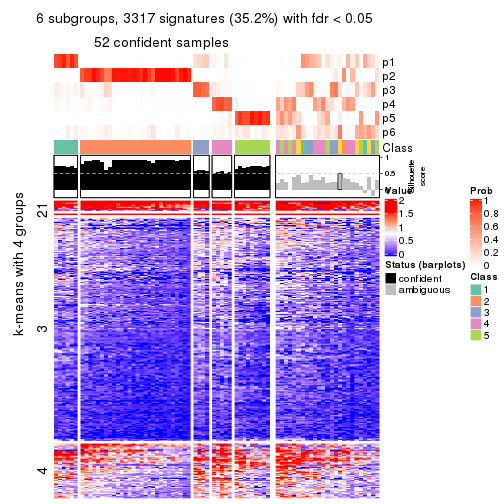</p>

</div>
</div>


Compare the overlap of signatures from different k:

```r
compare_signatures(res)
```


`get_signature()` returns a data frame invisibly. TO get the list of signatures, the function
call should be assigned to a variable explicitly. In following code, if `plot` argument is set
to `FALSE`, no heatmap is plotted while only the differential analysis is performed.

```r
# code only for demonstration
tb = get_signature(res, k = ..., plot = FALSE)
```

An example of the output of `tb` is:

```
#>   which_row         fdr    mean_1    mean_2 scaled_mean_1 scaled_mean_2 km
#> 1        38 0.042760348  8.373488  9.131774    -0.5533452     0.5164555  1
#> 2        40 0.018707592  7.106213  8.469186    -0.6173731     0.5762149  1
#> 3        55 0.019134737 10.221463 11.207825    -0.6159697     0.5749050  1
#> 4        59 0.006059896  5.921854  7.869574    -0.6899429     0.6439467  1
#> 5        60 0.018055526  8.928898 10.211722    -0.6204761     0.5791110  1
#> 6        98 0.009384629 15.714769 14.887706     0.6635654    -0.6193277  2
...
```

The columns in `tb` are:

1. `which_row`: row indices corresponding to the input matrix.
2. `fdr`: FDR for the differential test. 
3. `mean_x`: The mean value in group x.
4. `scaled_mean_x`: The mean value in group x after rows are scaled.
5. `km`: Row groups if k-means clustering is applied to rows.


UMAP plot which shows how samples are separated.


<script>
$( function() {
	$( '#tabs-SD-NMF-dimension-reduction' ).tabs();
} );
</script>
<div id='tabs-SD-NMF-dimension-reduction'>
<ul>
<li><a href='#tab-SD-NMF-dimension-reduction-1'>k = 2</a></li>
<li><a href='#tab-SD-NMF-dimension-reduction-2'>k = 3</a></li>
<li><a href='#tab-SD-NMF-dimension-reduction-3'>k = 4</a></li>
<li><a href='#tab-SD-NMF-dimension-reduction-4'>k = 5</a></li>
<li><a href='#tab-SD-NMF-dimension-reduction-5'>k = 6</a></li>
</ul>
<div id='tab-SD-NMF-dimension-reduction-1'>
<pre><code class="r">dimension_reduction(res, k = 2, method = &quot;UMAP&quot;)
</code></pre>

<p></p>

</div>
<div id='tab-SD-NMF-dimension-reduction-2'>
<pre><code class="r">dimension_reduction(res, k = 3, method = &quot;UMAP&quot;)
</code></pre>

<p></p>

</div>
<div id='tab-SD-NMF-dimension-reduction-3'>
<pre><code class="r">dimension_reduction(res, k = 4, method = &quot;UMAP&quot;)
</code></pre>

<p></p>

</div>
<div id='tab-SD-NMF-dimension-reduction-4'>
<pre><code class="r">dimension_reduction(res, k = 5, method = &quot;UMAP&quot;)
</code></pre>

<p></p>

</div>
<div id='tab-SD-NMF-dimension-reduction-5'>
<pre><code class="r">dimension_reduction(res, k = 6, method = &quot;UMAP&quot;)
</code></pre>

<p></p>

</div>
</div>


Following heatmap shows how subgroups are split when increasing `k`:

```r
collect_classes(res)
```


If matrix rows can be associated to genes, consider to use `GO_Enrichment(res,
...)` to perform function enrichment for the signature genes.


 

---------------------------------------------------


### CV:hclust


The object with results only for a single top-value method and a single partition method 
can be extracted as:

```r
res = res_list["CV", "hclust"]
# you can also extract it by
# res = res_list["CV:hclust"]
```

A summary of `res` and all the functions that can be applied to it:

```r
res
```

```
#> A 'ConsensusPartition' object with k = 2, 3, 4, 5, 6.
#>   On a matrix with 9427 rows and 77 columns.
#>   Top rows (943, 1886, 2828, 3771, 4714) are extracted by 'CV' method.
#>   Subgroups are detected by 'hclust' method.
#>   Performed in total 1250 partitions by row resampling.
#>   Best k for subgroups seems to be 3.
#> 
#> Following methods can be applied to this 'ConsensusPartition' object:
#>  [1] "cola_report"             "collect_classes"         "collect_plots"          
#>  [4] "collect_stats"           "colnames"                "compare_signatures"     
#>  [7] "consensus_heatmap"       "dimension_reduction"     "functional_enrichment"  
#> [10] "get_anno_col"            "get_anno"                "get_classes"            
#> [13] "get_consensus"           "get_matrix"              "get_membership"         
#> [16] "get_param"               "get_signatures"          "get_stats"              
#> [19] "is_best_k"               "is_stable_k"             "membership_heatmap"     
#> [22] "ncol"                    "nrow"                    "plot_ecdf"              
#> [25] "rownames"                "select_partition_number" "show"                   
#> [28] "suggest_best_k"          "test_to_known_factors"
```

`collect_plots()` function collects all the plots made from `res` for all `k` (number of partitions)
into one single page to provide an easy and fast comparison between different `k`.

```r
collect_plots(res)
```


The plots are:

- The first row: a plot of the ECDF (Empirical cumulative distribution
  function) curves of the consensus matrix for each `k` and the heatmap of
  predicted classes for each `k`.
- The second row: heatmaps of the consensus matrix for each `k`.
- The third row: heatmaps of the membership matrix for each `k`.
- The fouth row: heatmaps of the signatures for each `k`.

All the plots in panels can be made by individual functions and they are
plotted later in this section.

`select_partition_number()` produces several plots showing different
statistics for choosing "optimized" `k`. There are following statistics:

- ECDF curves of the consensus matrix for each `k`;
- 1-PAC. [The PAC
  score](https://en.wikipedia.org/wiki/Consensus_clustering#Over-interpretation_potential_of_consensus_clustering)
  measures the proportion of the ambiguous subgrouping.
- Mean silhouette score.
- Concordance. The mean probability of fiting the consensus class ids in all
  partitions.
- Area increased. Denote $A_k$ as the area under the ECDF curve for current
  `k`, the area increased is defined as $A_k - A_{k-1}$.
- Rand index. The percent of pairs of samples that are both in a same cluster
  or both are not in a same cluster in the partition of k and k-1.
- Jaccard index. The ratio of pairs of samples are both in a same cluster in
  the partition of k and k-1 and the pairs of samples are both in a same
  cluster in the partition k or k-1.

The detailed explanations of these statistics can be found in [the cola
vignette](http://bioconductor.org/packages/devel/bioc/vignettes/cola/inst/doc/cola.html#toc_13).

Generally speaking, lower PAC score, higher mean silhouette score or higher
concordance corresponds to better partition. Rand index and Jaccard index
measure how similar the current partition is compared to partition with `k-1`.
If they are too similar, we won't accept `k` is better than `k-1`.

```r
select_partition_number(res)
```


The numeric values for all these statistics can be obtained by `get_stats()`.

```r
get_stats(res)
```

```
#>   k 1-PAC mean_silhouette concordance area_increased  Rand Jaccard
#> 2 2 0.566           0.795       0.908         0.2828 0.771   0.771
#> 3 3 0.568           0.742       0.795         0.3762 0.606   0.533
#> 4 4 0.883           0.916       0.943         0.3425 0.911   0.835
#> 5 5 0.906           0.910       0.941         0.0457 0.998   0.996
#> 6 6 0.929           0.872       0.921         0.0376 1.000   1.000
```

`suggest_best_k()` suggests the best $k$ based on these statistics. The rules are as follows:

- All $k$ with Jaccard index larger than 0.95 are removed because the increase of
  the partition number does not provides enough extra information. If all $k$ are removed,
  the best $k$ is assigned by `NA`.
- For $k$ with 1-PAC larger than 0.9, the maximal $k$ is taken as the "best k". Other $k$ is called "optional k".
- If it does not fit the second rule. The $k$ with the highest vote of highest
  1-PAC, mean silhouette and concordance is taken as the "best k".

```r
suggest_best_k(res)
```

```
#> [1] 3
```


Following shows the table of the partitions (You need to click the **show/hide
code output** link to see it). The membership matrix (columns with name `p*`)
is inferred by
[`clue::cl_consensus()`](https://www.rdocumentation.org/link/cl_consensus?package=clue)
function with the `SE` method. Basically the value in the membership matrix
represents the probability to belong to a certain group. The finall class
label for an item is determined with the group with highest probability it
belongs to.

In `get_classes()` function, the entropy is calculated from the membership
matrix and the silhouette score is calculated from the consensus matrix.


<script>
$( function() {
	$( '#tabs-CV-hclust-get-classes' ).tabs();
} );
</script>
<div id='tabs-CV-hclust-get-classes'>
<ul>
<li><a href='#tab-CV-hclust-get-classes-1'>k = 2</a></li>
<li><a href='#tab-CV-hclust-get-classes-2'>k = 3</a></li>
<li><a href='#tab-CV-hclust-get-classes-3'>k = 4</a></li>
<li><a href='#tab-CV-hclust-get-classes-4'>k = 5</a></li>
<li><a href='#tab-CV-hclust-get-classes-5'>k = 6</a></li>
</ul>

<div id='tab-CV-hclust-get-classes-1'>
<p><a id='tab-CV-hclust-get-classes-1-a' style='color:#0366d6' href='#'>show/hide code output</a></p>
<pre><code class="r">cbind(get_classes(res, k = 2), get_membership(res, k = 2))
</code></pre>

<pre><code>#&gt;           class entropy silhouette    p1    p2
#&gt; SRR944011     2  0.0376      0.886 0.004 0.996
#&gt; SRR944012     1  0.9866      0.209 0.568 0.432
#&gt; SRR944014     2  0.0000      0.889 0.000 1.000
#&gt; SRR944013     2  0.0000      0.889 0.000 1.000
#&gt; SRR944015     1  0.0672      0.828 0.992 0.008
#&gt; SRR944016     2  0.8499      0.640 0.276 0.724
#&gt; SRR944017     2  0.0000      0.889 0.000 1.000
#&gt; SRR944018     2  0.8909      0.594 0.308 0.692
#&gt; SRR944019     2  0.8608      0.630 0.284 0.716
#&gt; SRR944020     1  0.0000      0.828 1.000 0.000
#&gt; SRR944021     2  0.0000      0.889 0.000 1.000
#&gt; SRR944022     1  0.0000      0.828 1.000 0.000
#&gt; SRR944023     2  0.6712      0.740 0.176 0.824
#&gt; SRR944024     2  0.8713      0.618 0.292 0.708
#&gt; SRR944026     2  0.0000      0.889 0.000 1.000
#&gt; SRR944025     2  0.0000      0.889 0.000 1.000
#&gt; SRR944028     2  0.0000      0.889 0.000 1.000
#&gt; SRR944029     2  0.0000      0.889 0.000 1.000
#&gt; SRR944030     2  0.0000      0.889 0.000 1.000
#&gt; SRR944031     2  0.6801      0.735 0.180 0.820
#&gt; SRR944032     2  0.0000      0.889 0.000 1.000
#&gt; SRR944033     2  0.0000      0.889 0.000 1.000
#&gt; SRR944034     2  0.0000      0.889 0.000 1.000
#&gt; SRR944036     2  0.0000      0.889 0.000 1.000
#&gt; SRR944035     2  0.0000      0.889 0.000 1.000
#&gt; SRR944038     1  0.8327      0.658 0.736 0.264
#&gt; SRR944037     2  0.9044      0.571 0.320 0.680
#&gt; SRR944039     2  0.8763      0.613 0.296 0.704
#&gt; SRR944040     2  0.0000      0.889 0.000 1.000
#&gt; SRR944041     2  0.8955      0.584 0.312 0.688
#&gt; SRR944042     2  0.0672      0.883 0.008 0.992
#&gt; SRR944043     2  0.8608      0.629 0.284 0.716
#&gt; SRR944044     2  0.0000      0.889 0.000 1.000
#&gt; SRR944046     2  0.0672      0.883 0.008 0.992
#&gt; SRR944045     2  0.0000      0.889 0.000 1.000
#&gt; SRR944047     2  0.0000      0.889 0.000 1.000
#&gt; SRR944048     2  0.8713      0.618 0.292 0.708
#&gt; SRR944049     2  0.0000      0.889 0.000 1.000
#&gt; SRR944050     2  0.8499      0.640 0.276 0.724
#&gt; SRR944051     2  0.0000      0.889 0.000 1.000
#&gt; SRR944052     2  0.0000      0.889 0.000 1.000
#&gt; SRR944053     1  0.0000      0.828 1.000 0.000
#&gt; SRR944054     2  0.0000      0.889 0.000 1.000
#&gt; SRR944055     2  0.0000      0.889 0.000 1.000
#&gt; SRR944056     2  0.0000      0.889 0.000 1.000
#&gt; SRR944057     2  0.8661      0.624 0.288 0.712
#&gt; SRR944058     2  0.8955      0.586 0.312 0.688
#&gt; SRR944059     2  0.0376      0.886 0.004 0.996
#&gt; SRR944060     1  0.8763      0.610 0.704 0.296
#&gt; SRR944061     2  0.0000      0.889 0.000 1.000
#&gt; SRR944062     2  0.8813      0.606 0.300 0.700
#&gt; SRR944063     1  0.0000      0.828 1.000 0.000
#&gt; SRR944064     2  0.0000      0.889 0.000 1.000
#&gt; SRR944065     2  0.9427      0.482 0.360 0.640
#&gt; SRR944066     2  0.8661      0.624 0.288 0.712
#&gt; SRR944067     2  0.0000      0.889 0.000 1.000
#&gt; SRR944068     1  0.0672      0.828 0.992 0.008
#&gt; SRR944069     2  0.0000      0.889 0.000 1.000
#&gt; SRR944070     1  0.8327      0.658 0.736 0.264
#&gt; SRR944071     2  0.0000      0.889 0.000 1.000
#&gt; SRR944072     2  0.8909      0.593 0.308 0.692
#&gt; SRR944073     2  0.0000      0.889 0.000 1.000
#&gt; SRR944075     2  0.0000      0.889 0.000 1.000
#&gt; SRR944074     2  0.0000      0.889 0.000 1.000
#&gt; SRR944076     2  0.0938      0.880 0.012 0.988
#&gt; SRR944077     2  0.0000      0.889 0.000 1.000
#&gt; SRR944078     2  0.0000      0.889 0.000 1.000
#&gt; SRR944079     2  0.0000      0.889 0.000 1.000
#&gt; SRR944080     2  0.0000      0.889 0.000 1.000
#&gt; SRR944081     2  0.0000      0.889 0.000 1.000
#&gt; SRR944082     2  0.8763      0.613 0.296 0.704
#&gt; SRR944083     2  0.8661      0.624 0.288 0.712
#&gt; SRR944084     2  0.0000      0.889 0.000 1.000
#&gt; SRR944085     2  0.0672      0.883 0.008 0.992
#&gt; SRR944086     2  0.0000      0.889 0.000 1.000
#&gt; SRR944088     2  0.0000      0.889 0.000 1.000
#&gt; SRR944087     2  0.0000      0.889 0.000 1.000
</code></pre>

<script>
$('#tab-CV-hclust-get-classes-1-a').parent().next().next().hide();
$('#tab-CV-hclust-get-classes-1-a').click(function(){
  $('#tab-CV-hclust-get-classes-1-a').parent().next().next().toggle();
  return(false);
});
</script>
</div>

<div id='tab-CV-hclust-get-classes-2'>
<p><a id='tab-CV-hclust-get-classes-2-a' style='color:#0366d6' href='#'>show/hide code output</a></p>
<pre><code class="r">cbind(get_classes(res, k = 3), get_membership(res, k = 3))
</code></pre>

<pre><code>#&gt;           class entropy silhouette    p1    p2    p3
#&gt; SRR944011     2  0.6495      0.822 0.460 0.536 0.004
#&gt; SRR944012     1  0.6853      0.389 0.712 0.224 0.064
#&gt; SRR944014     2  0.6295      0.842 0.472 0.528 0.000
#&gt; SRR944013     2  0.6295      0.842 0.472 0.528 0.000
#&gt; SRR944015     3  0.0424      0.812 0.000 0.008 0.992
#&gt; SRR944016     1  0.1289      0.883 0.968 0.032 0.000
#&gt; SRR944017     2  0.6295      0.842 0.472 0.528 0.000
#&gt; SRR944018     1  0.1491      0.896 0.968 0.016 0.016
#&gt; SRR944019     1  0.1964      0.879 0.944 0.056 0.000
#&gt; SRR944020     2  0.9823     -0.644 0.260 0.420 0.320
#&gt; SRR944021     2  0.6295      0.842 0.472 0.528 0.000
#&gt; SRR944022     2  0.9823     -0.644 0.260 0.420 0.320
#&gt; SRR944023     1  0.9191     -0.300 0.428 0.424 0.148
#&gt; SRR944024     1  0.0592      0.902 0.988 0.012 0.000
#&gt; SRR944026     2  0.6295      0.842 0.472 0.528 0.000
#&gt; SRR944025     2  0.6295      0.842 0.472 0.528 0.000
#&gt; SRR944028     2  0.6295      0.842 0.472 0.528 0.000
#&gt; SRR944029     2  0.6295      0.842 0.472 0.528 0.000
#&gt; SRR944030     2  0.6295      0.842 0.472 0.528 0.000
#&gt; SRR944031     2  0.9224      0.221 0.408 0.440 0.152
#&gt; SRR944032     2  0.6295      0.842 0.472 0.528 0.000
#&gt; SRR944033     2  0.6295      0.842 0.472 0.528 0.000
#&gt; SRR944034     2  0.6295      0.842 0.472 0.528 0.000
#&gt; SRR944036     2  0.6295      0.842 0.472 0.528 0.000
#&gt; SRR944035     2  0.6295      0.842 0.472 0.528 0.000
#&gt; SRR944038     3  0.6811      0.843 0.220 0.064 0.716
#&gt; SRR944037     1  0.2187      0.881 0.948 0.024 0.028
#&gt; SRR944039     1  0.1643      0.890 0.956 0.044 0.000
#&gt; SRR944040     2  0.6286      0.835 0.464 0.536 0.000
#&gt; SRR944041     1  0.2261      0.875 0.932 0.068 0.000
#&gt; SRR944042     2  0.6633      0.789 0.444 0.548 0.008
#&gt; SRR944043     1  0.1267      0.895 0.972 0.024 0.004
#&gt; SRR944044     2  0.6295      0.842 0.472 0.528 0.000
#&gt; SRR944046     2  0.6641      0.806 0.448 0.544 0.008
#&gt; SRR944045     2  0.6295      0.842 0.472 0.528 0.000
#&gt; SRR944047     2  0.6295      0.842 0.472 0.528 0.000
#&gt; SRR944048     1  0.0592      0.902 0.988 0.012 0.000
#&gt; SRR944049     2  0.6295      0.842 0.472 0.528 0.000
#&gt; SRR944050     1  0.1289      0.883 0.968 0.032 0.000
#&gt; SRR944051     2  0.6295      0.842 0.472 0.528 0.000
#&gt; SRR944052     2  0.6295      0.842 0.472 0.528 0.000
#&gt; SRR944053     2  0.9823     -0.644 0.260 0.420 0.320
#&gt; SRR944054     2  0.6295      0.842 0.472 0.528 0.000
#&gt; SRR944055     2  0.6280      0.831 0.460 0.540 0.000
#&gt; SRR944056     2  0.6295      0.842 0.472 0.528 0.000
#&gt; SRR944057     1  0.0747      0.901 0.984 0.016 0.000
#&gt; SRR944058     1  0.0592      0.895 0.988 0.012 0.000
#&gt; SRR944059     2  0.6495      0.813 0.460 0.536 0.004
#&gt; SRR944060     3  0.7758      0.776 0.280 0.084 0.636
#&gt; SRR944061     2  0.6295      0.842 0.472 0.528 0.000
#&gt; SRR944062     1  0.0424      0.901 0.992 0.008 0.000
#&gt; SRR944063     2  0.9823     -0.644 0.260 0.420 0.320
#&gt; SRR944064     2  0.6295      0.842 0.472 0.528 0.000
#&gt; SRR944065     1  0.3528      0.827 0.892 0.016 0.092
#&gt; SRR944066     1  0.0747      0.901 0.984 0.016 0.000
#&gt; SRR944067     2  0.6295      0.842 0.472 0.528 0.000
#&gt; SRR944068     3  0.0424      0.812 0.000 0.008 0.992
#&gt; SRR944069     2  0.6295      0.842 0.472 0.528 0.000
#&gt; SRR944070     3  0.6811      0.843 0.220 0.064 0.716
#&gt; SRR944071     2  0.6286      0.835 0.464 0.536 0.000
#&gt; SRR944072     1  0.0424      0.897 0.992 0.008 0.000
#&gt; SRR944073     2  0.6295      0.842 0.472 0.528 0.000
#&gt; SRR944075     2  0.6280      0.831 0.460 0.540 0.000
#&gt; SRR944074     2  0.6295      0.842 0.472 0.528 0.000
#&gt; SRR944076     2  0.6786      0.795 0.448 0.540 0.012
#&gt; SRR944077     2  0.6295      0.842 0.472 0.528 0.000
#&gt; SRR944078     2  0.6280      0.831 0.460 0.540 0.000
#&gt; SRR944079     2  0.6295      0.842 0.472 0.528 0.000
#&gt; SRR944080     2  0.6295      0.842 0.472 0.528 0.000
#&gt; SRR944081     2  0.6295      0.842 0.472 0.528 0.000
#&gt; SRR944082     1  0.0983      0.902 0.980 0.016 0.004
#&gt; SRR944083     1  0.0747      0.901 0.984 0.016 0.000
#&gt; SRR944084     2  0.6295      0.842 0.472 0.528 0.000
#&gt; SRR944085     2  0.6641      0.795 0.448 0.544 0.008
#&gt; SRR944086     2  0.6295      0.842 0.472 0.528 0.000
#&gt; SRR944088     2  0.6295      0.842 0.472 0.528 0.000
#&gt; SRR944087     2  0.6286      0.827 0.464 0.536 0.000
</code></pre>

<script>
$('#tab-CV-hclust-get-classes-2-a').parent().next().next().hide();
$('#tab-CV-hclust-get-classes-2-a').click(function(){
  $('#tab-CV-hclust-get-classes-2-a').parent().next().next().toggle();
  return(false);
});
</script>
</div>

<div id='tab-CV-hclust-get-classes-3'>
<p><a id='tab-CV-hclust-get-classes-3-a' style='color:#0366d6' href='#'>show/hide code output</a></p>
<pre><code class="r">cbind(get_classes(res, k = 4), get_membership(res, k = 4))
</code></pre>

<pre><code>#&gt;           class entropy silhouette    p1    p2    p3    p4
#&gt; SRR944011     2  0.0937      0.967 0.012 0.976 0.012 0.000
#&gt; SRR944012     1  0.7153      0.239 0.444 0.132 0.000 0.424
#&gt; SRR944014     2  0.0000      0.981 0.000 1.000 0.000 0.000
#&gt; SRR944013     2  0.0000      0.981 0.000 1.000 0.000 0.000
#&gt; SRR944015     3  0.1637      0.656 0.000 0.000 0.940 0.060
#&gt; SRR944016     1  0.2011      0.889 0.920 0.080 0.000 0.000
#&gt; SRR944017     2  0.0000      0.981 0.000 1.000 0.000 0.000
#&gt; SRR944018     1  0.3593      0.877 0.868 0.092 0.016 0.024
#&gt; SRR944019     1  0.4322      0.808 0.804 0.152 0.000 0.044
#&gt; SRR944020     4  0.0000      1.000 0.000 0.000 0.000 1.000
#&gt; SRR944021     2  0.0000      0.981 0.000 1.000 0.000 0.000
#&gt; SRR944022     4  0.0000      1.000 0.000 0.000 0.000 1.000
#&gt; SRR944023     2  0.5800      0.607 0.128 0.708 0.164 0.000
#&gt; SRR944024     1  0.1557      0.888 0.944 0.056 0.000 0.000
#&gt; SRR944026     2  0.0000      0.981 0.000 1.000 0.000 0.000
#&gt; SRR944025     2  0.0000      0.981 0.000 1.000 0.000 0.000
#&gt; SRR944028     2  0.0000      0.981 0.000 1.000 0.000 0.000
#&gt; SRR944029     2  0.0188      0.979 0.004 0.996 0.000 0.000
#&gt; SRR944030     2  0.0000      0.981 0.000 1.000 0.000 0.000
#&gt; SRR944031     2  0.5863      0.602 0.120 0.700 0.180 0.000
#&gt; SRR944032     2  0.0188      0.979 0.004 0.996 0.000 0.000
#&gt; SRR944033     2  0.0000      0.981 0.000 1.000 0.000 0.000
#&gt; SRR944034     2  0.0000      0.981 0.000 1.000 0.000 0.000
#&gt; SRR944036     2  0.0000      0.981 0.000 1.000 0.000 0.000
#&gt; SRR944035     2  0.0000      0.981 0.000 1.000 0.000 0.000
#&gt; SRR944038     3  0.4387      0.780 0.236 0.012 0.752 0.000
#&gt; SRR944037     1  0.4792      0.838 0.808 0.120 0.028 0.044
#&gt; SRR944039     1  0.4123      0.829 0.820 0.136 0.000 0.044
#&gt; SRR944040     2  0.0376      0.977 0.004 0.992 0.004 0.000
#&gt; SRR944041     1  0.4804      0.779 0.776 0.160 0.000 0.064
#&gt; SRR944042     2  0.1624      0.948 0.020 0.952 0.028 0.000
#&gt; SRR944043     1  0.2256      0.877 0.924 0.056 0.020 0.000
#&gt; SRR944044     2  0.0188      0.979 0.004 0.996 0.000 0.000
#&gt; SRR944046     2  0.1297      0.957 0.020 0.964 0.016 0.000
#&gt; SRR944045     2  0.0000      0.981 0.000 1.000 0.000 0.000
#&gt; SRR944047     2  0.0000      0.981 0.000 1.000 0.000 0.000
#&gt; SRR944048     1  0.1557      0.888 0.944 0.056 0.000 0.000
#&gt; SRR944049     2  0.0000      0.981 0.000 1.000 0.000 0.000
#&gt; SRR944050     1  0.2081      0.888 0.916 0.084 0.000 0.000
#&gt; SRR944051     2  0.0000      0.981 0.000 1.000 0.000 0.000
#&gt; SRR944052     2  0.0000      0.981 0.000 1.000 0.000 0.000
#&gt; SRR944053     4  0.0000      1.000 0.000 0.000 0.000 1.000
#&gt; SRR944054     2  0.0188      0.979 0.004 0.996 0.000 0.000
#&gt; SRR944055     2  0.0524      0.974 0.004 0.988 0.008 0.000
#&gt; SRR944056     2  0.0000      0.981 0.000 1.000 0.000 0.000
#&gt; SRR944057     1  0.1792      0.893 0.932 0.068 0.000 0.000
#&gt; SRR944058     1  0.2214      0.873 0.928 0.044 0.000 0.028
#&gt; SRR944059     2  0.1182      0.962 0.016 0.968 0.016 0.000
#&gt; SRR944060     3  0.5206      0.711 0.308 0.024 0.668 0.000
#&gt; SRR944061     2  0.0000      0.981 0.000 1.000 0.000 0.000
#&gt; SRR944062     1  0.1675      0.874 0.948 0.044 0.004 0.004
#&gt; SRR944063     4  0.0000      1.000 0.000 0.000 0.000 1.000
#&gt; SRR944064     2  0.0000      0.981 0.000 1.000 0.000 0.000
#&gt; SRR944065     1  0.5145      0.817 0.792 0.092 0.092 0.024
#&gt; SRR944066     1  0.1792      0.893 0.932 0.068 0.000 0.000
#&gt; SRR944067     2  0.0000      0.981 0.000 1.000 0.000 0.000
#&gt; SRR944068     3  0.1637      0.656 0.000 0.000 0.940 0.060
#&gt; SRR944069     2  0.0000      0.981 0.000 1.000 0.000 0.000
#&gt; SRR944070     3  0.4387      0.780 0.236 0.012 0.752 0.000
#&gt; SRR944071     2  0.0376      0.977 0.004 0.992 0.004 0.000
#&gt; SRR944072     1  0.2197      0.878 0.928 0.048 0.000 0.024
#&gt; SRR944073     2  0.0000      0.981 0.000 1.000 0.000 0.000
#&gt; SRR944075     2  0.0524      0.974 0.004 0.988 0.008 0.000
#&gt; SRR944074     2  0.0188      0.979 0.004 0.996 0.000 0.000
#&gt; SRR944076     2  0.1520      0.952 0.020 0.956 0.024 0.000
#&gt; SRR944077     2  0.0000      0.981 0.000 1.000 0.000 0.000
#&gt; SRR944078     2  0.0524      0.974 0.004 0.988 0.008 0.000
#&gt; SRR944079     2  0.0000      0.981 0.000 1.000 0.000 0.000
#&gt; SRR944080     2  0.0000      0.981 0.000 1.000 0.000 0.000
#&gt; SRR944081     2  0.0188      0.979 0.004 0.996 0.000 0.000
#&gt; SRR944082     1  0.2311      0.894 0.916 0.076 0.004 0.004
#&gt; SRR944083     1  0.1792      0.893 0.932 0.068 0.000 0.000
#&gt; SRR944084     2  0.0188      0.979 0.004 0.996 0.000 0.000
#&gt; SRR944085     2  0.1520      0.952 0.020 0.956 0.024 0.000
#&gt; SRR944086     2  0.0000      0.981 0.000 1.000 0.000 0.000
#&gt; SRR944088     2  0.0188      0.979 0.004 0.996 0.000 0.000
#&gt; SRR944087     2  0.0672      0.972 0.008 0.984 0.008 0.000
</code></pre>

<script>
$('#tab-CV-hclust-get-classes-3-a').parent().next().next().hide();
$('#tab-CV-hclust-get-classes-3-a').click(function(){
  $('#tab-CV-hclust-get-classes-3-a').parent().next().next().toggle();
  return(false);
});
</script>
</div>

<div id='tab-CV-hclust-get-classes-4'>
<p><a id='tab-CV-hclust-get-classes-4-a' style='color:#0366d6' href='#'>show/hide code output</a></p>
<pre><code class="r">cbind(get_classes(res, k = 5), get_membership(res, k = 5))
</code></pre>

<pre><code>#&gt;           class entropy silhouette    p1    p2    p3    p4    p5
#&gt; SRR944011     2  0.0955      0.962 0.004 0.968 0.028 0.000 0.000
#&gt; SRR944012     1  0.7356      0.113 0.420 0.116 0.080 0.384 0.000
#&gt; SRR944014     2  0.0000      0.979 0.000 1.000 0.000 0.000 0.000
#&gt; SRR944013     2  0.0000      0.979 0.000 1.000 0.000 0.000 0.000
#&gt; SRR944015     5  0.0000      1.000 0.000 0.000 0.000 0.000 1.000
#&gt; SRR944016     1  0.2074      0.850 0.920 0.036 0.044 0.000 0.000
#&gt; SRR944017     2  0.0000      0.979 0.000 1.000 0.000 0.000 0.000
#&gt; SRR944018     1  0.2989      0.824 0.868 0.060 0.072 0.000 0.000
#&gt; SRR944019     1  0.4107      0.752 0.804 0.132 0.040 0.024 0.000
#&gt; SRR944020     4  0.0000      0.965 0.000 0.000 0.000 1.000 0.000
#&gt; SRR944021     2  0.0000      0.979 0.000 1.000 0.000 0.000 0.000
#&gt; SRR944022     4  0.2230      0.890 0.000 0.000 0.116 0.884 0.000
#&gt; SRR944023     2  0.4633      0.594 0.036 0.696 0.264 0.000 0.004
#&gt; SRR944024     1  0.1444      0.847 0.948 0.012 0.040 0.000 0.000
#&gt; SRR944026     2  0.0000      0.979 0.000 1.000 0.000 0.000 0.000
#&gt; SRR944025     2  0.0000      0.979 0.000 1.000 0.000 0.000 0.000
#&gt; SRR944028     2  0.0000      0.979 0.000 1.000 0.000 0.000 0.000
#&gt; SRR944029     2  0.0162      0.977 0.000 0.996 0.004 0.000 0.000
#&gt; SRR944030     2  0.0000      0.979 0.000 1.000 0.000 0.000 0.000
#&gt; SRR944031     2  0.4359      0.593 0.016 0.692 0.288 0.000 0.004
#&gt; SRR944032     2  0.0162      0.977 0.004 0.996 0.000 0.000 0.000
#&gt; SRR944033     2  0.0000      0.979 0.000 1.000 0.000 0.000 0.000
#&gt; SRR944034     2  0.0000      0.979 0.000 1.000 0.000 0.000 0.000
#&gt; SRR944036     2  0.0000      0.979 0.000 1.000 0.000 0.000 0.000
#&gt; SRR944035     2  0.0000      0.979 0.000 1.000 0.000 0.000 0.000
#&gt; SRR944038     3  0.4016      0.919 0.012 0.000 0.716 0.000 0.272
#&gt; SRR944037     1  0.4537      0.770 0.784 0.096 0.096 0.024 0.000
#&gt; SRR944039     1  0.3920      0.770 0.820 0.116 0.040 0.024 0.000
#&gt; SRR944040     2  0.0510      0.971 0.000 0.984 0.016 0.000 0.000
#&gt; SRR944041     1  0.4692      0.716 0.768 0.144 0.052 0.036 0.000
#&gt; SRR944042     2  0.1430      0.943 0.004 0.944 0.052 0.000 0.000
#&gt; SRR944043     1  0.3661      0.641 0.724 0.000 0.276 0.000 0.000
#&gt; SRR944044     2  0.0162      0.977 0.000 0.996 0.004 0.000 0.000
#&gt; SRR944046     2  0.1205      0.953 0.004 0.956 0.040 0.000 0.000
#&gt; SRR944045     2  0.0000      0.979 0.000 1.000 0.000 0.000 0.000
#&gt; SRR944047     2  0.0000      0.979 0.000 1.000 0.000 0.000 0.000
#&gt; SRR944048     1  0.1444      0.847 0.948 0.012 0.040 0.000 0.000
#&gt; SRR944049     2  0.0000      0.979 0.000 1.000 0.000 0.000 0.000
#&gt; SRR944050     1  0.2153      0.848 0.916 0.040 0.044 0.000 0.000
#&gt; SRR944051     2  0.0000      0.979 0.000 1.000 0.000 0.000 0.000
#&gt; SRR944052     2  0.0000      0.979 0.000 1.000 0.000 0.000 0.000
#&gt; SRR944053     4  0.0000      0.965 0.000 0.000 0.000 1.000 0.000
#&gt; SRR944054     2  0.0162      0.977 0.000 0.996 0.004 0.000 0.000
#&gt; SRR944055     2  0.0609      0.969 0.000 0.980 0.020 0.000 0.000
#&gt; SRR944056     2  0.0000      0.979 0.000 1.000 0.000 0.000 0.000
#&gt; SRR944057     1  0.1965      0.852 0.924 0.024 0.052 0.000 0.000
#&gt; SRR944058     1  0.0963      0.832 0.964 0.000 0.036 0.000 0.000
#&gt; SRR944059     2  0.1124      0.956 0.004 0.960 0.036 0.000 0.000
#&gt; SRR944060     3  0.3919      0.845 0.036 0.000 0.776 0.000 0.188
#&gt; SRR944061     2  0.0000      0.979 0.000 1.000 0.000 0.000 0.000
#&gt; SRR944062     1  0.1671      0.820 0.924 0.000 0.076 0.000 0.000
#&gt; SRR944063     4  0.0000      0.965 0.000 0.000 0.000 1.000 0.000
#&gt; SRR944064     2  0.0000      0.979 0.000 1.000 0.000 0.000 0.000
#&gt; SRR944065     1  0.4656      0.752 0.768 0.052 0.148 0.000 0.032
#&gt; SRR944066     1  0.1965      0.852 0.924 0.024 0.052 0.000 0.000
#&gt; SRR944067     2  0.0000      0.979 0.000 1.000 0.000 0.000 0.000
#&gt; SRR944068     5  0.0000      1.000 0.000 0.000 0.000 0.000 1.000
#&gt; SRR944069     2  0.0000      0.979 0.000 1.000 0.000 0.000 0.000
#&gt; SRR944070     3  0.4016      0.919 0.012 0.000 0.716 0.000 0.272
#&gt; SRR944071     2  0.0510      0.971 0.000 0.984 0.016 0.000 0.000
#&gt; SRR944072     1  0.1041      0.836 0.964 0.004 0.032 0.000 0.000
#&gt; SRR944073     2  0.0000      0.979 0.000 1.000 0.000 0.000 0.000
#&gt; SRR944075     2  0.0609      0.969 0.000 0.980 0.020 0.000 0.000
#&gt; SRR944074     2  0.0162      0.977 0.000 0.996 0.004 0.000 0.000
#&gt; SRR944076     2  0.1357      0.947 0.004 0.948 0.048 0.000 0.000
#&gt; SRR944077     2  0.0000      0.979 0.000 1.000 0.000 0.000 0.000
#&gt; SRR944078     2  0.0609      0.969 0.000 0.980 0.020 0.000 0.000
#&gt; SRR944079     2  0.0000      0.979 0.000 1.000 0.000 0.000 0.000
#&gt; SRR944080     2  0.0000      0.979 0.000 1.000 0.000 0.000 0.000
#&gt; SRR944081     2  0.0162      0.977 0.000 0.996 0.004 0.000 0.000
#&gt; SRR944082     1  0.1818      0.851 0.932 0.024 0.044 0.000 0.000
#&gt; SRR944083     1  0.1725      0.850 0.936 0.020 0.044 0.000 0.000
#&gt; SRR944084     2  0.0162      0.977 0.000 0.996 0.004 0.000 0.000
#&gt; SRR944085     2  0.1357      0.946 0.004 0.948 0.048 0.000 0.000
#&gt; SRR944086     2  0.0162      0.977 0.004 0.996 0.000 0.000 0.000
#&gt; SRR944088     2  0.0162      0.977 0.000 0.996 0.004 0.000 0.000
#&gt; SRR944087     2  0.0771      0.967 0.004 0.976 0.020 0.000 0.000
</code></pre>

<script>
$('#tab-CV-hclust-get-classes-4-a').parent().next().next().hide();
$('#tab-CV-hclust-get-classes-4-a').click(function(){
  $('#tab-CV-hclust-get-classes-4-a').parent().next().next().toggle();
  return(false);
});
</script>
</div>

<div id='tab-CV-hclust-get-classes-5'>
<p><a id='tab-CV-hclust-get-classes-5-a' style='color:#0366d6' href='#'>show/hide code output</a></p>
<pre><code class="r">cbind(get_classes(res, k = 6), get_membership(res, k = 6))
</code></pre>

<pre><code>#&gt;           class entropy silhouette    p1    p2 p3    p4    p5    p6
#&gt; SRR944011     2  0.0790      0.960 0.000 0.968 NA 0.000 0.000 0.032
#&gt; SRR944012     1  0.6484     -0.314 0.464 0.024 NA 0.336 0.000 0.012
#&gt; SRR944014     2  0.0000      0.974 0.000 1.000 NA 0.000 0.000 0.000
#&gt; SRR944013     2  0.0405      0.971 0.008 0.988 NA 0.000 0.000 0.000
#&gt; SRR944015     5  0.0146      1.000 0.000 0.000 NA 0.000 0.996 0.004
#&gt; SRR944016     1  0.4266      0.781 0.620 0.020 NA 0.000 0.000 0.004
#&gt; SRR944017     2  0.0000      0.974 0.000 1.000 NA 0.000 0.000 0.000
#&gt; SRR944018     1  0.4734      0.756 0.692 0.024 NA 0.000 0.000 0.060
#&gt; SRR944019     1  0.2345      0.553 0.904 0.052 NA 0.012 0.000 0.004
#&gt; SRR944020     4  0.0000      0.891 0.000 0.000 NA 1.000 0.000 0.000
#&gt; SRR944021     2  0.0000      0.974 0.000 1.000 NA 0.000 0.000 0.000
#&gt; SRR944022     4  0.3940      0.627 0.000 0.000 NA 0.652 0.004 0.008
#&gt; SRR944023     2  0.4406      0.592 0.016 0.692 NA 0.000 0.000 0.256
#&gt; SRR944024     1  0.3747      0.781 0.604 0.000 NA 0.000 0.000 0.000
#&gt; SRR944026     2  0.0508      0.969 0.012 0.984 NA 0.000 0.000 0.000
#&gt; SRR944025     2  0.0000      0.974 0.000 1.000 NA 0.000 0.000 0.000
#&gt; SRR944028     2  0.0508      0.969 0.012 0.984 NA 0.000 0.000 0.000
#&gt; SRR944029     2  0.0717      0.966 0.016 0.976 NA 0.000 0.000 0.000
#&gt; SRR944030     2  0.0000      0.974 0.000 1.000 NA 0.000 0.000 0.000
#&gt; SRR944031     2  0.4063      0.597 0.008 0.692 NA 0.000 0.000 0.280
#&gt; SRR944032     2  0.0146      0.973 0.000 0.996 NA 0.000 0.000 0.000
#&gt; SRR944033     2  0.0000      0.974 0.000 1.000 NA 0.000 0.000 0.000
#&gt; SRR944034     2  0.0000      0.974 0.000 1.000 NA 0.000 0.000 0.000
#&gt; SRR944036     2  0.0000      0.974 0.000 1.000 NA 0.000 0.000 0.000
#&gt; SRR944035     2  0.0000      0.974 0.000 1.000 NA 0.000 0.000 0.000
#&gt; SRR944038     6  0.1556      0.930 0.000 0.000 NA 0.000 0.080 0.920
#&gt; SRR944037     1  0.2433      0.556 0.900 0.016 NA 0.012 0.000 0.060
#&gt; SRR944039     1  0.1729      0.581 0.936 0.036 NA 0.012 0.000 0.004
#&gt; SRR944040     2  0.0458      0.969 0.000 0.984 NA 0.000 0.000 0.016
#&gt; SRR944041     1  0.3318      0.499 0.848 0.052 NA 0.024 0.000 0.004
#&gt; SRR944042     2  0.1204      0.943 0.000 0.944 NA 0.000 0.000 0.056
#&gt; SRR944043     1  0.5836      0.580 0.420 0.000 NA 0.000 0.000 0.188
#&gt; SRR944044     2  0.0717      0.966 0.016 0.976 NA 0.000 0.000 0.000
#&gt; SRR944046     2  0.1007      0.953 0.000 0.956 NA 0.000 0.000 0.044
#&gt; SRR944045     2  0.0000      0.974 0.000 1.000 NA 0.000 0.000 0.000
#&gt; SRR944047     2  0.0000      0.974 0.000 1.000 NA 0.000 0.000 0.000
#&gt; SRR944048     1  0.3747      0.781 0.604 0.000 NA 0.000 0.000 0.000
#&gt; SRR944049     2  0.0603      0.968 0.016 0.980 NA 0.000 0.000 0.000
#&gt; SRR944050     1  0.4254      0.781 0.624 0.020 NA 0.000 0.000 0.004
#&gt; SRR944051     2  0.0146      0.973 0.004 0.996 NA 0.000 0.000 0.000
#&gt; SRR944052     2  0.0000      0.974 0.000 1.000 NA 0.000 0.000 0.000
#&gt; SRR944053     4  0.0000      0.891 0.000 0.000 NA 1.000 0.000 0.000
#&gt; SRR944054     2  0.0717      0.966 0.016 0.976 NA 0.000 0.000 0.000
#&gt; SRR944055     2  0.0547      0.967 0.000 0.980 NA 0.000 0.000 0.020
#&gt; SRR944056     2  0.0000      0.974 0.000 1.000 NA 0.000 0.000 0.000
#&gt; SRR944057     1  0.4034      0.784 0.624 0.004 NA 0.000 0.000 0.008
#&gt; SRR944058     1  0.3833      0.775 0.648 0.000 NA 0.000 0.000 0.008
#&gt; SRR944059     2  0.0937      0.956 0.000 0.960 NA 0.000 0.000 0.040
#&gt; SRR944060     6  0.1657      0.865 0.016 0.000 NA 0.000 0.000 0.928
#&gt; SRR944061     2  0.0000      0.974 0.000 1.000 NA 0.000 0.000 0.000
#&gt; SRR944062     1  0.4685      0.730 0.520 0.000 NA 0.000 0.000 0.044
#&gt; SRR944063     4  0.0000      0.891 0.000 0.000 NA 1.000 0.000 0.000
#&gt; SRR944064     2  0.0000      0.974 0.000 1.000 NA 0.000 0.000 0.000
#&gt; SRR944065     1  0.5577      0.690 0.604 0.016 NA 0.000 0.000 0.168
#&gt; SRR944066     1  0.4034      0.784 0.624 0.004 NA 0.000 0.000 0.008
#&gt; SRR944067     2  0.0291      0.972 0.004 0.992 NA 0.000 0.000 0.000
#&gt; SRR944068     5  0.0146      1.000 0.000 0.000 NA 0.000 0.996 0.004
#&gt; SRR944069     2  0.0000      0.974 0.000 1.000 NA 0.000 0.000 0.000
#&gt; SRR944070     6  0.1556      0.930 0.000 0.000 NA 0.000 0.080 0.920
#&gt; SRR944071     2  0.0458      0.969 0.000 0.984 NA 0.000 0.000 0.016
#&gt; SRR944072     1  0.3774      0.777 0.664 0.000 NA 0.000 0.000 0.008
#&gt; SRR944073     2  0.0000      0.974 0.000 1.000 NA 0.000 0.000 0.000
#&gt; SRR944075     2  0.0547      0.967 0.000 0.980 NA 0.000 0.000 0.020
#&gt; SRR944074     2  0.0717      0.966 0.016 0.976 NA 0.000 0.000 0.000
#&gt; SRR944076     2  0.1141      0.947 0.000 0.948 NA 0.000 0.000 0.052
#&gt; SRR944077     2  0.0000      0.974 0.000 1.000 NA 0.000 0.000 0.000
#&gt; SRR944078     2  0.0547      0.967 0.000 0.980 NA 0.000 0.000 0.020
#&gt; SRR944079     2  0.0000      0.974 0.000 1.000 NA 0.000 0.000 0.000
#&gt; SRR944080     2  0.0000      0.974 0.000 1.000 NA 0.000 0.000 0.000
#&gt; SRR944081     2  0.0717      0.966 0.016 0.976 NA 0.000 0.000 0.000
#&gt; SRR944082     1  0.4397      0.784 0.632 0.012 NA 0.000 0.000 0.020
#&gt; SRR944083     1  0.3830      0.783 0.620 0.004 NA 0.000 0.000 0.000
#&gt; SRR944084     2  0.0603      0.968 0.016 0.980 NA 0.000 0.000 0.000
#&gt; SRR944085     2  0.1141      0.946 0.000 0.948 NA 0.000 0.000 0.052
#&gt; SRR944086     2  0.0713      0.961 0.028 0.972 NA 0.000 0.000 0.000
#&gt; SRR944088     2  0.0717      0.966 0.016 0.976 NA 0.000 0.000 0.000
#&gt; SRR944087     2  0.0632      0.965 0.000 0.976 NA 0.000 0.000 0.024
</code></pre>

<script>
$('#tab-CV-hclust-get-classes-5-a').parent().next().next().hide();
$('#tab-CV-hclust-get-classes-5-a').click(function(){
  $('#tab-CV-hclust-get-classes-5-a').parent().next().next().toggle();
  return(false);
});
</script>
</div>
</div>

Heatmaps for the consensus matrix. It visualizes the probability of two
samples to be in a same group.


<script>
$( function() {
	$( '#tabs-CV-hclust-consensus-heatmap' ).tabs();
} );
</script>
<div id='tabs-CV-hclust-consensus-heatmap'>
<ul>
<li><a href='#tab-CV-hclust-consensus-heatmap-1'>k = 2</a></li>
<li><a href='#tab-CV-hclust-consensus-heatmap-2'>k = 3</a></li>
<li><a href='#tab-CV-hclust-consensus-heatmap-3'>k = 4</a></li>
<li><a href='#tab-CV-hclust-consensus-heatmap-4'>k = 5</a></li>
<li><a href='#tab-CV-hclust-consensus-heatmap-5'>k = 6</a></li>
</ul>
<div id='tab-CV-hclust-consensus-heatmap-1'>
<pre><code class="r">consensus_heatmap(res, k = 2)
</code></pre>

<p>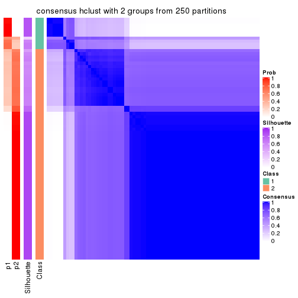</p>

</div>
<div id='tab-CV-hclust-consensus-heatmap-2'>
<pre><code class="r">consensus_heatmap(res, k = 3)
</code></pre>

<p></p>

</div>
<div id='tab-CV-hclust-consensus-heatmap-3'>
<pre><code class="r">consensus_heatmap(res, k = 4)
</code></pre>

<p></p>

</div>
<div id='tab-CV-hclust-consensus-heatmap-4'>
<pre><code class="r">consensus_heatmap(res, k = 5)
</code></pre>

<p></p>

</div>
<div id='tab-CV-hclust-consensus-heatmap-5'>
<pre><code class="r">consensus_heatmap(res, k = 6)
</code></pre>

<p></p>

</div>
</div>

Heatmaps for the membership of samples in all partitions to see how consistent they are:


<script>
$( function() {
	$( '#tabs-CV-hclust-membership-heatmap' ).tabs();
} );
</script>
<div id='tabs-CV-hclust-membership-heatmap'>
<ul>
<li><a href='#tab-CV-hclust-membership-heatmap-1'>k = 2</a></li>
<li><a href='#tab-CV-hclust-membership-heatmap-2'>k = 3</a></li>
<li><a href='#tab-CV-hclust-membership-heatmap-3'>k = 4</a></li>
<li><a href='#tab-CV-hclust-membership-heatmap-4'>k = 5</a></li>
<li><a href='#tab-CV-hclust-membership-heatmap-5'>k = 6</a></li>
</ul>
<div id='tab-CV-hclust-membership-heatmap-1'>
<pre><code class="r">membership_heatmap(res, k = 2)
</code></pre>

<p></p>

</div>
<div id='tab-CV-hclust-membership-heatmap-2'>
<pre><code class="r">membership_heatmap(res, k = 3)
</code></pre>

<p></p>

</div>
<div id='tab-CV-hclust-membership-heatmap-3'>
<pre><code class="r">membership_heatmap(res, k = 4)
</code></pre>

<p></p>

</div>
<div id='tab-CV-hclust-membership-heatmap-4'>
<pre><code class="r">membership_heatmap(res, k = 5)
</code></pre>

<p></p>

</div>
<div id='tab-CV-hclust-membership-heatmap-5'>
<pre><code class="r">membership_heatmap(res, k = 6)
</code></pre>

<p></p>

</div>
</div>

As soon as we have had the classes for columns, we can look for signatures
which are significantly different between classes which can be candidate marks
for certain classes. Following are the heatmaps for signatures.


Signature heatmaps where rows are scaled:


<script>
$( function() {
	$( '#tabs-CV-hclust-get-signatures' ).tabs();
} );
</script>
<div id='tabs-CV-hclust-get-signatures'>
<ul>
<li><a href='#tab-CV-hclust-get-signatures-1'>k = 2</a></li>
<li><a href='#tab-CV-hclust-get-signatures-2'>k = 3</a></li>
<li><a href='#tab-CV-hclust-get-signatures-3'>k = 4</a></li>
<li><a href='#tab-CV-hclust-get-signatures-4'>k = 5</a></li>
<li><a href='#tab-CV-hclust-get-signatures-5'>k = 6</a></li>
</ul>
<div id='tab-CV-hclust-get-signatures-1'>
<pre><code class="r">get_signatures(res, k = 2)
</code></pre>

<p></p>

</div>
<div id='tab-CV-hclust-get-signatures-2'>
<pre><code class="r">get_signatures(res, k = 3)
</code></pre>

<p></p>

</div>
<div id='tab-CV-hclust-get-signatures-3'>
<pre><code class="r">get_signatures(res, k = 4)
</code></pre>

<p></p>

</div>
<div id='tab-CV-hclust-get-signatures-4'>
<pre><code class="r">get_signatures(res, k = 5)
</code></pre>

<p></p>

</div>
<div id='tab-CV-hclust-get-signatures-5'>
<pre><code class="r">get_signatures(res, k = 6)
</code></pre>

<p></p>

</div>
</div>


Signature heatmaps where rows are not scaled:


<script>
$( function() {
	$( '#tabs-CV-hclust-get-signatures-no-scale' ).tabs();
} );
</script>
<div id='tabs-CV-hclust-get-signatures-no-scale'>
<ul>
<li><a href='#tab-CV-hclust-get-signatures-no-scale-1'>k = 2</a></li>
<li><a href='#tab-CV-hclust-get-signatures-no-scale-2'>k = 3</a></li>
<li><a href='#tab-CV-hclust-get-signatures-no-scale-3'>k = 4</a></li>
<li><a href='#tab-CV-hclust-get-signatures-no-scale-4'>k = 5</a></li>
<li><a href='#tab-CV-hclust-get-signatures-no-scale-5'>k = 6</a></li>
</ul>
<div id='tab-CV-hclust-get-signatures-no-scale-1'>
<pre><code class="r">get_signatures(res, k = 2, scale_rows = FALSE)
</code></pre>

<p></p>

</div>
<div id='tab-CV-hclust-get-signatures-no-scale-2'>
<pre><code class="r">get_signatures(res, k = 3, scale_rows = FALSE)
</code></pre>

<pre><code>#&gt; Error in mat[ceiling(1:nr/h_ratio), ceiling(1:nc/w_ratio), drop = FALSE]: subscript out of bounds
</code></pre>

<p></p>

</div>
<div id='tab-CV-hclust-get-signatures-no-scale-3'>
<pre><code class="r">get_signatures(res, k = 4, scale_rows = FALSE)
</code></pre>

<pre><code>#&gt; Error in mat[ceiling(1:nr/h_ratio), ceiling(1:nc/w_ratio), drop = FALSE]: subscript out of bounds
</code></pre>

<p></p>

</div>
<div id='tab-CV-hclust-get-signatures-no-scale-4'>
<pre><code class="r">get_signatures(res, k = 5, scale_rows = FALSE)
</code></pre>

<p></p>

</div>
<div id='tab-CV-hclust-get-signatures-no-scale-5'>
<pre><code class="r">get_signatures(res, k = 6, scale_rows = FALSE)
</code></pre>

<pre><code>#&gt; Error in mat[ceiling(1:nr/h_ratio), ceiling(1:nc/w_ratio), drop = FALSE]: subscript out of bounds
</code></pre>

<p></p>

</div>
</div>


Compare the overlap of signatures from different k:

```r
compare_signatures(res)
```


`get_signature()` returns a data frame invisibly. TO get the list of signatures, the function
call should be assigned to a variable explicitly. In following code, if `plot` argument is set
to `FALSE`, no heatmap is plotted while only the differential analysis is performed.

```r
# code only for demonstration
tb = get_signature(res, k = ..., plot = FALSE)
```

An example of the output of `tb` is:

```
#>   which_row         fdr    mean_1    mean_2 scaled_mean_1 scaled_mean_2 km
#> 1        38 0.042760348  8.373488  9.131774    -0.5533452     0.5164555  1
#> 2        40 0.018707592  7.106213  8.469186    -0.6173731     0.5762149  1
#> 3        55 0.019134737 10.221463 11.207825    -0.6159697     0.5749050  1
#> 4        59 0.006059896  5.921854  7.869574    -0.6899429     0.6439467  1
#> 5        60 0.018055526  8.928898 10.211722    -0.6204761     0.5791110  1
#> 6        98 0.009384629 15.714769 14.887706     0.6635654    -0.6193277  2
...
```

The columns in `tb` are:

1. `which_row`: row indices corresponding to the input matrix.
2. `fdr`: FDR for the differential test. 
3. `mean_x`: The mean value in group x.
4. `scaled_mean_x`: The mean value in group x after rows are scaled.
5. `km`: Row groups if k-means clustering is applied to rows.


UMAP plot which shows how samples are separated.


<script>
$( function() {
	$( '#tabs-CV-hclust-dimension-reduction' ).tabs();
} );
</script>
<div id='tabs-CV-hclust-dimension-reduction'>
<ul>
<li><a href='#tab-CV-hclust-dimension-reduction-1'>k = 2</a></li>
<li><a href='#tab-CV-hclust-dimension-reduction-2'>k = 3</a></li>
<li><a href='#tab-CV-hclust-dimension-reduction-3'>k = 4</a></li>
<li><a href='#tab-CV-hclust-dimension-reduction-4'>k = 5</a></li>
<li><a href='#tab-CV-hclust-dimension-reduction-5'>k = 6</a></li>
</ul>
<div id='tab-CV-hclust-dimension-reduction-1'>
<pre><code class="r">dimension_reduction(res, k = 2, method = &quot;UMAP&quot;)
</code></pre>

<p></p>

</div>
<div id='tab-CV-hclust-dimension-reduction-2'>
<pre><code class="r">dimension_reduction(res, k = 3, method = &quot;UMAP&quot;)
</code></pre>

<p></p>

</div>
<div id='tab-CV-hclust-dimension-reduction-3'>
<pre><code class="r">dimension_reduction(res, k = 4, method = &quot;UMAP&quot;)
</code></pre>

<p></p>

</div>
<div id='tab-CV-hclust-dimension-reduction-4'>
<pre><code class="r">dimension_reduction(res, k = 5, method = &quot;UMAP&quot;)
</code></pre>

<p></p>

</div>
<div id='tab-CV-hclust-dimension-reduction-5'>
<pre><code class="r">dimension_reduction(res, k = 6, method = &quot;UMAP&quot;)
</code></pre>

<p></p>

</div>
</div>


Following heatmap shows how subgroups are split when increasing `k`:

```r
collect_classes(res)
```


If matrix rows can be associated to genes, consider to use `GO_Enrichment(res,
...)` to perform function enrichment for the signature genes.


 

---------------------------------------------------


### CV:kmeans**


The object with results only for a single top-value method and a single partition method 
can be extracted as:

```r
res = res_list["CV", "kmeans"]
# you can also extract it by
# res = res_list["CV:kmeans"]
```

A summary of `res` and all the functions that can be applied to it:

```r
res
```

```
#> A 'ConsensusPartition' object with k = 2, 3, 4, 5, 6.
#>   On a matrix with 9427 rows and 77 columns.
#>   Top rows (943, 1886, 2828, 3771, 4714) are extracted by 'CV' method.
#>   Subgroups are detected by 'kmeans' method.
#>   Performed in total 1250 partitions by row resampling.
#>   Best k for subgroups seems to be 2.
#> 
#> Following methods can be applied to this 'ConsensusPartition' object:
#>  [1] "cola_report"             "collect_classes"         "collect_plots"          
#>  [4] "collect_stats"           "colnames"                "compare_signatures"     
#>  [7] "consensus_heatmap"       "dimension_reduction"     "functional_enrichment"  
#> [10] "get_anno_col"            "get_anno"                "get_classes"            
#> [13] "get_consensus"           "get_matrix"              "get_membership"         
#> [16] "get_param"               "get_signatures"          "get_stats"              
#> [19] "is_best_k"               "is_stable_k"             "membership_heatmap"     
#> [22] "ncol"                    "nrow"                    "plot_ecdf"              
#> [25] "rownames"                "select_partition_number" "show"                   
#> [28] "suggest_best_k"          "test_to_known_factors"
```

`collect_plots()` function collects all the plots made from `res` for all `k` (number of partitions)
into one single page to provide an easy and fast comparison between different `k`.

```r
collect_plots(res)
```


The plots are:

- The first row: a plot of the ECDF (Empirical cumulative distribution
  function) curves of the consensus matrix for each `k` and the heatmap of
  predicted classes for each `k`.
- The second row: heatmaps of the consensus matrix for each `k`.
- The third row: heatmaps of the membership matrix for each `k`.
- The fouth row: heatmaps of the signatures for each `k`.

All the plots in panels can be made by individual functions and they are
plotted later in this section.

`select_partition_number()` produces several plots showing different
statistics for choosing "optimized" `k`. There are following statistics:

- ECDF curves of the consensus matrix for each `k`;
- 1-PAC. [The PAC
  score](https://en.wikipedia.org/wiki/Consensus_clustering#Over-interpretation_potential_of_consensus_clustering)
  measures the proportion of the ambiguous subgrouping.
- Mean silhouette score.
- Concordance. The mean probability of fiting the consensus class ids in all
  partitions.
- Area increased. Denote $A_k$ as the area under the ECDF curve for current
  `k`, the area increased is defined as $A_k - A_{k-1}$.
- Rand index. The percent of pairs of samples that are both in a same cluster
  or both are not in a same cluster in the partition of k and k-1.
- Jaccard index. The ratio of pairs of samples are both in a same cluster in
  the partition of k and k-1 and the pairs of samples are both in a same
  cluster in the partition k or k-1.

The detailed explanations of these statistics can be found in [the cola
vignette](http://bioconductor.org/packages/devel/bioc/vignettes/cola/inst/doc/cola.html#toc_13).

Generally speaking, lower PAC score, higher mean silhouette score or higher
concordance corresponds to better partition. Rand index and Jaccard index
measure how similar the current partition is compared to partition with `k-1`.
If they are too similar, we won't accept `k` is better than `k-1`.

```r
select_partition_number(res)
```


The numeric values for all these statistics can be obtained by `get_stats()`.

```r
get_stats(res)
```

```
#>   k 1-PAC mean_silhouette concordance area_increased  Rand Jaccard
#> 2 2 1.000           0.996       0.998         0.4762 0.524   0.524
#> 3 3 0.639           0.798       0.883         0.1969 0.935   0.876
#> 4 4 0.669           0.720       0.826         0.1845 0.792   0.567
#> 5 5 0.669           0.717       0.828         0.0955 0.912   0.715
#> 6 6 0.679           0.682       0.812         0.0405 0.957   0.826
```

`suggest_best_k()` suggests the best $k$ based on these statistics. The rules are as follows:

- All $k$ with Jaccard index larger than 0.95 are removed because the increase of
  the partition number does not provides enough extra information. If all $k$ are removed,
  the best $k$ is assigned by `NA`.
- For $k$ with 1-PAC larger than 0.9, the maximal $k$ is taken as the "best k". Other $k$ is called "optional k".
- If it does not fit the second rule. The $k$ with the highest vote of highest
  1-PAC, mean silhouette and concordance is taken as the "best k".

```r
suggest_best_k(res)
```

```
#> [1] 2
```


Following shows the table of the partitions (You need to click the **show/hide
code output** link to see it). The membership matrix (columns with name `p*`)
is inferred by
[`clue::cl_consensus()`](https://www.rdocumentation.org/link/cl_consensus?package=clue)
function with the `SE` method. Basically the value in the membership matrix
represents the probability to belong to a certain group. The finall class
label for an item is determined with the group with highest probability it
belongs to.

In `get_classes()` function, the entropy is calculated from the membership
matrix and the silhouette score is calculated from the consensus matrix.


<script>
$( function() {
	$( '#tabs-CV-kmeans-get-classes' ).tabs();
} );
</script>
<div id='tabs-CV-kmeans-get-classes'>
<ul>
<li><a href='#tab-CV-kmeans-get-classes-1'>k = 2</a></li>
<li><a href='#tab-CV-kmeans-get-classes-2'>k = 3</a></li>
<li><a href='#tab-CV-kmeans-get-classes-3'>k = 4</a></li>
<li><a href='#tab-CV-kmeans-get-classes-4'>k = 5</a></li>
<li><a href='#tab-CV-kmeans-get-classes-5'>k = 6</a></li>
</ul>

<div id='tab-CV-kmeans-get-classes-1'>
<p><a id='tab-CV-kmeans-get-classes-1-a' style='color:#0366d6' href='#'>show/hide code output</a></p>
<pre><code class="r">cbind(get_classes(res, k = 2), get_membership(res, k = 2))
</code></pre>

<pre><code>#&gt;           class entropy silhouette    p1    p2
#&gt; SRR944011     2  0.0000      0.998 0.000 1.000
#&gt; SRR944012     1  0.0000      0.997 1.000 0.000
#&gt; SRR944014     2  0.0000      0.998 0.000 1.000
#&gt; SRR944013     2  0.0000      0.998 0.000 1.000
#&gt; SRR944015     1  0.0000      0.997 1.000 0.000
#&gt; SRR944016     1  0.0672      0.991 0.992 0.008
#&gt; SRR944017     2  0.0000      0.998 0.000 1.000
#&gt; SRR944018     1  0.0000      0.997 1.000 0.000
#&gt; SRR944019     1  0.0000      0.997 1.000 0.000
#&gt; SRR944020     1  0.0000      0.997 1.000 0.000
#&gt; SRR944021     2  0.0000      0.998 0.000 1.000
#&gt; SRR944022     1  0.0000      0.997 1.000 0.000
#&gt; SRR944023     1  0.0000      0.997 1.000 0.000
#&gt; SRR944024     1  0.0000      0.997 1.000 0.000
#&gt; SRR944026     2  0.0000      0.998 0.000 1.000
#&gt; SRR944025     2  0.0000      0.998 0.000 1.000
#&gt; SRR944028     2  0.0000      0.998 0.000 1.000
#&gt; SRR944029     2  0.0938      0.988 0.012 0.988
#&gt; SRR944030     2  0.0000      0.998 0.000 1.000
#&gt; SRR944031     2  0.0000      0.998 0.000 1.000
#&gt; SRR944032     2  0.0938      0.988 0.012 0.988
#&gt; SRR944033     2  0.0000      0.998 0.000 1.000
#&gt; SRR944034     2  0.0000      0.998 0.000 1.000
#&gt; SRR944036     2  0.0000      0.998 0.000 1.000
#&gt; SRR944035     2  0.0000      0.998 0.000 1.000
#&gt; SRR944038     1  0.0000      0.997 1.000 0.000
#&gt; SRR944037     1  0.0000      0.997 1.000 0.000
#&gt; SRR944039     1  0.0000      0.997 1.000 0.000
#&gt; SRR944040     2  0.0000      0.998 0.000 1.000
#&gt; SRR944041     1  0.0000      0.997 1.000 0.000
#&gt; SRR944042     2  0.0000      0.998 0.000 1.000
#&gt; SRR944043     1  0.0000      0.997 1.000 0.000
#&gt; SRR944044     2  0.0000      0.998 0.000 1.000
#&gt; SRR944046     2  0.0000      0.998 0.000 1.000
#&gt; SRR944045     2  0.0000      0.998 0.000 1.000
#&gt; SRR944047     2  0.0000      0.998 0.000 1.000
#&gt; SRR944048     1  0.0938      0.988 0.988 0.012
#&gt; SRR944049     2  0.0000      0.998 0.000 1.000
#&gt; SRR944050     1  0.2603      0.955 0.956 0.044
#&gt; SRR944051     2  0.0000      0.998 0.000 1.000
#&gt; SRR944052     2  0.0000      0.998 0.000 1.000
#&gt; SRR944053     1  0.0000      0.997 1.000 0.000
#&gt; SRR944054     2  0.0000      0.998 0.000 1.000
#&gt; SRR944055     2  0.0000      0.998 0.000 1.000
#&gt; SRR944056     2  0.0000      0.998 0.000 1.000
#&gt; SRR944057     1  0.0000      0.997 1.000 0.000
#&gt; SRR944058     1  0.0000      0.997 1.000 0.000
#&gt; SRR944059     2  0.0000      0.998 0.000 1.000
#&gt; SRR944060     1  0.0000      0.997 1.000 0.000
#&gt; SRR944061     2  0.0000      0.998 0.000 1.000
#&gt; SRR944062     1  0.0000      0.997 1.000 0.000
#&gt; SRR944063     1  0.0000      0.997 1.000 0.000
#&gt; SRR944064     2  0.0000      0.998 0.000 1.000
#&gt; SRR944065     1  0.0000      0.997 1.000 0.000
#&gt; SRR944066     1  0.0000      0.997 1.000 0.000
#&gt; SRR944067     2  0.0000      0.998 0.000 1.000
#&gt; SRR944068     1  0.0000      0.997 1.000 0.000
#&gt; SRR944069     2  0.0000      0.998 0.000 1.000
#&gt; SRR944070     1  0.0938      0.988 0.988 0.012
#&gt; SRR944071     2  0.0000      0.998 0.000 1.000
#&gt; SRR944072     1  0.0000      0.997 1.000 0.000
#&gt; SRR944073     2  0.0000      0.998 0.000 1.000
#&gt; SRR944075     2  0.0000      0.998 0.000 1.000
#&gt; SRR944074     2  0.0000      0.998 0.000 1.000
#&gt; SRR944076     2  0.0000      0.998 0.000 1.000
#&gt; SRR944077     2  0.0000      0.998 0.000 1.000
#&gt; SRR944078     2  0.0000      0.998 0.000 1.000
#&gt; SRR944079     2  0.0000      0.998 0.000 1.000
#&gt; SRR944080     2  0.0000      0.998 0.000 1.000
#&gt; SRR944081     2  0.1414      0.980 0.020 0.980
#&gt; SRR944082     1  0.0000      0.997 1.000 0.000
#&gt; SRR944083     1  0.0000      0.997 1.000 0.000
#&gt; SRR944084     2  0.0000      0.998 0.000 1.000
#&gt; SRR944085     2  0.0000      0.998 0.000 1.000
#&gt; SRR944086     2  0.2236      0.964 0.036 0.964
#&gt; SRR944088     2  0.0000      0.998 0.000 1.000
#&gt; SRR944087     2  0.0000      0.998 0.000 1.000
</code></pre>

<script>
$('#tab-CV-kmeans-get-classes-1-a').parent().next().next().hide();
$('#tab-CV-kmeans-get-classes-1-a').click(function(){
  $('#tab-CV-kmeans-get-classes-1-a').parent().next().next().toggle();
  return(false);
});
</script>
</div>

<div id='tab-CV-kmeans-get-classes-2'>
<p><a id='tab-CV-kmeans-get-classes-2-a' style='color:#0366d6' href='#'>show/hide code output</a></p>
<pre><code class="r">cbind(get_classes(res, k = 3), get_membership(res, k = 3))
</code></pre>

<pre><code>#&gt;           class entropy silhouette    p1    p2    p3
#&gt; SRR944011     2  0.6266    0.79635 0.156 0.768 0.076
#&gt; SRR944012     3  0.5650    0.62741 0.312 0.000 0.688
#&gt; SRR944014     2  0.0000    0.90368 0.000 1.000 0.000
#&gt; SRR944013     2  0.1585    0.89519 0.008 0.964 0.028
#&gt; SRR944015     3  0.3267    0.74895 0.116 0.000 0.884
#&gt; SRR944016     1  0.0592    0.83687 0.988 0.000 0.012
#&gt; SRR944017     2  0.1031    0.89961 0.000 0.976 0.024
#&gt; SRR944018     1  0.2448    0.83395 0.924 0.000 0.076
#&gt; SRR944019     1  0.1964    0.83237 0.944 0.000 0.056
#&gt; SRR944020     3  0.4062    0.77252 0.164 0.000 0.836
#&gt; SRR944021     2  0.0000    0.90368 0.000 1.000 0.000
#&gt; SRR944022     3  0.4062    0.77252 0.164 0.000 0.836
#&gt; SRR944023     1  0.3340    0.69433 0.880 0.000 0.120
#&gt; SRR944024     1  0.2448    0.83122 0.924 0.000 0.076
#&gt; SRR944026     2  0.1163    0.89847 0.000 0.972 0.028
#&gt; SRR944025     2  0.1031    0.89961 0.000 0.976 0.024
#&gt; SRR944028     2  0.1031    0.89961 0.000 0.976 0.024
#&gt; SRR944029     2  0.6542    0.77807 0.204 0.736 0.060
#&gt; SRR944030     2  0.0000    0.90368 0.000 1.000 0.000
#&gt; SRR944031     2  0.7588    0.72267 0.196 0.684 0.120
#&gt; SRR944032     2  0.6601    0.68466 0.296 0.676 0.028
#&gt; SRR944033     2  0.0000    0.90368 0.000 1.000 0.000
#&gt; SRR944034     2  0.0000    0.90368 0.000 1.000 0.000
#&gt; SRR944036     2  0.6304    0.78048 0.192 0.752 0.056
#&gt; SRR944035     2  0.0237    0.90325 0.000 0.996 0.004
#&gt; SRR944038     3  0.6140    0.30635 0.404 0.000 0.596
#&gt; SRR944037     3  0.6295    0.29205 0.472 0.000 0.528
#&gt; SRR944039     1  0.1529    0.84061 0.960 0.000 0.040
#&gt; SRR944040     2  0.0000    0.90368 0.000 1.000 0.000
#&gt; SRR944041     1  0.4121    0.78637 0.832 0.000 0.168
#&gt; SRR944042     2  0.7524    0.72694 0.196 0.688 0.116
#&gt; SRR944043     1  0.3192    0.80503 0.888 0.000 0.112
#&gt; SRR944044     2  0.1163    0.89847 0.000 0.972 0.028
#&gt; SRR944046     2  0.6827    0.76423 0.192 0.728 0.080
#&gt; SRR944045     2  0.0000    0.90368 0.000 1.000 0.000
#&gt; SRR944047     2  0.0000    0.90368 0.000 1.000 0.000
#&gt; SRR944048     1  0.0000    0.83481 1.000 0.000 0.000
#&gt; SRR944049     2  0.0892    0.90051 0.000 0.980 0.020
#&gt; SRR944050     1  0.0747    0.83557 0.984 0.000 0.016
#&gt; SRR944051     2  0.1163    0.89847 0.000 0.972 0.028
#&gt; SRR944052     2  0.0000    0.90368 0.000 1.000 0.000
#&gt; SRR944053     3  0.4062    0.77252 0.164 0.000 0.836
#&gt; SRR944054     2  0.1163    0.89847 0.000 0.972 0.028
#&gt; SRR944055     2  0.2448    0.87624 0.000 0.924 0.076
#&gt; SRR944056     2  0.0000    0.90368 0.000 1.000 0.000
#&gt; SRR944057     1  0.0747    0.83557 0.984 0.000 0.016
#&gt; SRR944058     1  0.4654    0.65664 0.792 0.000 0.208
#&gt; SRR944059     2  0.4749    0.84617 0.072 0.852 0.076
#&gt; SRR944060     1  0.4121    0.64860 0.832 0.000 0.168
#&gt; SRR944061     2  0.0000    0.90368 0.000 1.000 0.000
#&gt; SRR944062     1  0.3192    0.80503 0.888 0.000 0.112
#&gt; SRR944063     3  0.4062    0.77252 0.164 0.000 0.836
#&gt; SRR944064     2  0.0237    0.90325 0.000 0.996 0.004
#&gt; SRR944065     1  0.6192   -0.00734 0.580 0.000 0.420
#&gt; SRR944066     1  0.0892    0.84250 0.980 0.000 0.020
#&gt; SRR944067     2  0.0747    0.90130 0.000 0.984 0.016
#&gt; SRR944068     3  0.3267    0.74895 0.116 0.000 0.884
#&gt; SRR944069     2  0.0000    0.90368 0.000 1.000 0.000
#&gt; SRR944070     3  0.7895    0.17434 0.436 0.056 0.508
#&gt; SRR944071     2  0.6490    0.78446 0.172 0.752 0.076
#&gt; SRR944072     1  0.3816    0.77412 0.852 0.000 0.148
#&gt; SRR944073     2  0.0000    0.90368 0.000 1.000 0.000
#&gt; SRR944075     2  0.2682    0.87499 0.004 0.920 0.076
#&gt; SRR944074     2  0.1163    0.89847 0.000 0.972 0.028
#&gt; SRR944076     2  0.6984    0.75775 0.192 0.720 0.088
#&gt; SRR944077     2  0.0000    0.90368 0.000 1.000 0.000
#&gt; SRR944078     2  0.2165    0.88164 0.000 0.936 0.064
#&gt; SRR944079     2  0.0000    0.90368 0.000 1.000 0.000
#&gt; SRR944080     2  0.0000    0.90368 0.000 1.000 0.000
#&gt; SRR944081     2  0.5921    0.78440 0.212 0.756 0.032
#&gt; SRR944082     1  0.3192    0.80503 0.888 0.000 0.112
#&gt; SRR944083     1  0.0237    0.83766 0.996 0.000 0.004
#&gt; SRR944084     2  0.6906    0.77438 0.192 0.724 0.084
#&gt; SRR944085     2  0.6906    0.76107 0.192 0.724 0.084
#&gt; SRR944086     2  0.6744    0.67705 0.300 0.668 0.032
#&gt; SRR944088     2  0.1163    0.89847 0.000 0.972 0.028
#&gt; SRR944087     2  0.6746    0.76723 0.192 0.732 0.076
</code></pre>

<script>
$('#tab-CV-kmeans-get-classes-2-a').parent().next().next().hide();
$('#tab-CV-kmeans-get-classes-2-a').click(function(){
  $('#tab-CV-kmeans-get-classes-2-a').parent().next().next().toggle();
  return(false);
});
</script>
</div>

<div id='tab-CV-kmeans-get-classes-3'>
<p><a id='tab-CV-kmeans-get-classes-3-a' style='color:#0366d6' href='#'>show/hide code output</a></p>
<pre><code class="r">cbind(get_classes(res, k = 4), get_membership(res, k = 4))
</code></pre>

<pre><code>#&gt;           class entropy silhouette    p1    p2    p3    p4
#&gt; SRR944011     3  0.5028     0.7353 0.004 0.400 0.596 0.000
#&gt; SRR944012     4  0.7314     0.3016 0.336 0.000 0.168 0.496
#&gt; SRR944014     2  0.0000     0.8618 0.000 1.000 0.000 0.000
#&gt; SRR944013     2  0.4715     0.7138 0.024 0.776 0.188 0.012
#&gt; SRR944015     4  0.3946     0.7494 0.020 0.000 0.168 0.812
#&gt; SRR944016     1  0.1557     0.8826 0.944 0.000 0.056 0.000
#&gt; SRR944017     2  0.1716     0.8468 0.000 0.936 0.064 0.000
#&gt; SRR944018     1  0.1042     0.8929 0.972 0.000 0.020 0.008
#&gt; SRR944019     1  0.4716     0.6714 0.764 0.000 0.196 0.040
#&gt; SRR944020     4  0.1557     0.8159 0.056 0.000 0.000 0.944
#&gt; SRR944021     2  0.0000     0.8618 0.000 1.000 0.000 0.000
#&gt; SRR944022     4  0.1557     0.8159 0.056 0.000 0.000 0.944
#&gt; SRR944023     3  0.5004     0.2020 0.392 0.000 0.604 0.004
#&gt; SRR944024     1  0.1209     0.8921 0.964 0.000 0.032 0.004
#&gt; SRR944026     2  0.3300     0.7849 0.000 0.848 0.144 0.008
#&gt; SRR944025     2  0.1716     0.8468 0.000 0.936 0.064 0.000
#&gt; SRR944028     2  0.2216     0.8299 0.000 0.908 0.092 0.000
#&gt; SRR944029     3  0.5651     0.5096 0.028 0.260 0.692 0.020
#&gt; SRR944030     2  0.0000     0.8618 0.000 1.000 0.000 0.000
#&gt; SRR944031     3  0.4991     0.7378 0.004 0.388 0.608 0.000
#&gt; SRR944032     2  0.8091     0.1210 0.264 0.444 0.280 0.012
#&gt; SRR944033     2  0.0000     0.8618 0.000 1.000 0.000 0.000
#&gt; SRR944034     2  0.0188     0.8617 0.000 0.996 0.004 0.000
#&gt; SRR944036     3  0.5105     0.6946 0.004 0.432 0.564 0.000
#&gt; SRR944035     2  0.0817     0.8590 0.000 0.976 0.024 0.000
#&gt; SRR944038     3  0.6097     0.2423 0.120 0.012 0.708 0.160
#&gt; SRR944037     4  0.6302     0.3534 0.368 0.000 0.068 0.564
#&gt; SRR944039     1  0.2730     0.8309 0.896 0.000 0.088 0.016
#&gt; SRR944040     2  0.0188     0.8583 0.000 0.996 0.004 0.000
#&gt; SRR944041     1  0.6646     0.4549 0.624 0.000 0.204 0.172
#&gt; SRR944042     3  0.5085     0.7353 0.008 0.376 0.616 0.000
#&gt; SRR944043     1  0.0927     0.8915 0.976 0.000 0.016 0.008
#&gt; SRR944044     2  0.3088     0.7986 0.000 0.864 0.128 0.008
#&gt; SRR944046     3  0.5016     0.7379 0.004 0.396 0.600 0.000
#&gt; SRR944045     2  0.0000     0.8618 0.000 1.000 0.000 0.000
#&gt; SRR944047     2  0.0000     0.8618 0.000 1.000 0.000 0.000
#&gt; SRR944048     1  0.1637     0.8835 0.940 0.000 0.060 0.000
#&gt; SRR944049     2  0.1637     0.8485 0.000 0.940 0.060 0.000
#&gt; SRR944050     1  0.1637     0.8810 0.940 0.000 0.060 0.000
#&gt; SRR944051     2  0.4503     0.7233 0.016 0.784 0.188 0.012
#&gt; SRR944052     2  0.0000     0.8618 0.000 1.000 0.000 0.000
#&gt; SRR944053     4  0.1743     0.8162 0.056 0.000 0.004 0.940
#&gt; SRR944054     2  0.3672     0.7637 0.000 0.824 0.164 0.012
#&gt; SRR944055     3  0.4961     0.6747 0.000 0.448 0.552 0.000
#&gt; SRR944056     2  0.0000     0.8618 0.000 1.000 0.000 0.000
#&gt; SRR944057     1  0.1389     0.8858 0.952 0.000 0.048 0.000
#&gt; SRR944058     1  0.1576     0.8732 0.948 0.000 0.004 0.048
#&gt; SRR944059     3  0.4898     0.7183 0.000 0.416 0.584 0.000
#&gt; SRR944060     3  0.5025     0.3098 0.252 0.000 0.716 0.032
#&gt; SRR944061     2  0.0000     0.8618 0.000 1.000 0.000 0.000
#&gt; SRR944062     1  0.1151     0.8921 0.968 0.000 0.024 0.008
#&gt; SRR944063     4  0.1743     0.8162 0.056 0.000 0.004 0.940
#&gt; SRR944064     2  0.0921     0.8582 0.000 0.972 0.028 0.000
#&gt; SRR944065     1  0.4770     0.5037 0.700 0.000 0.012 0.288
#&gt; SRR944066     1  0.1305     0.8926 0.960 0.000 0.036 0.004
#&gt; SRR944067     2  0.1557     0.8501 0.000 0.944 0.056 0.000
#&gt; SRR944068     4  0.3946     0.7494 0.020 0.000 0.168 0.812
#&gt; SRR944069     2  0.0000     0.8618 0.000 1.000 0.000 0.000
#&gt; SRR944070     3  0.6117     0.3266 0.092 0.040 0.732 0.136
#&gt; SRR944071     3  0.5028     0.7353 0.004 0.400 0.596 0.000
#&gt; SRR944072     1  0.1004     0.8861 0.972 0.000 0.004 0.024
#&gt; SRR944073     2  0.0000     0.8618 0.000 1.000 0.000 0.000
#&gt; SRR944075     3  0.4972     0.6639 0.000 0.456 0.544 0.000
#&gt; SRR944074     2  0.3300     0.7849 0.000 0.848 0.144 0.008
#&gt; SRR944076     3  0.5016     0.7379 0.004 0.396 0.600 0.000
#&gt; SRR944077     2  0.0000     0.8618 0.000 1.000 0.000 0.000
#&gt; SRR944078     2  0.4605    -0.0320 0.000 0.664 0.336 0.000
#&gt; SRR944079     2  0.0000     0.8618 0.000 1.000 0.000 0.000
#&gt; SRR944080     2  0.0000     0.8618 0.000 1.000 0.000 0.000
#&gt; SRR944081     2  0.8217     0.0302 0.192 0.416 0.368 0.024
#&gt; SRR944082     1  0.1151     0.8921 0.968 0.000 0.024 0.008
#&gt; SRR944083     1  0.1022     0.8933 0.968 0.000 0.032 0.000
#&gt; SRR944084     3  0.4798     0.5801 0.012 0.232 0.744 0.012
#&gt; SRR944085     3  0.5016     0.7379 0.004 0.396 0.600 0.000
#&gt; SRR944086     3  0.8254     0.0379 0.340 0.280 0.368 0.012
#&gt; SRR944088     2  0.4301     0.7298 0.008 0.788 0.192 0.012
#&gt; SRR944087     3  0.5016     0.7379 0.004 0.396 0.600 0.000
</code></pre>

<script>
$('#tab-CV-kmeans-get-classes-3-a').parent().next().next().hide();
$('#tab-CV-kmeans-get-classes-3-a').click(function(){
  $('#tab-CV-kmeans-get-classes-3-a').parent().next().next().toggle();
  return(false);
});
</script>
</div>

<div id='tab-CV-kmeans-get-classes-4'>
<p><a id='tab-CV-kmeans-get-classes-4-a' style='color:#0366d6' href='#'>show/hide code output</a></p>
<pre><code class="r">cbind(get_classes(res, k = 5), get_membership(res, k = 5))
</code></pre>

<pre><code>#&gt;           class entropy silhouette    p1    p2    p3    p4    p5
#&gt; SRR944011     3  0.3242     0.8259 0.000 0.216 0.784 0.000 0.000
#&gt; SRR944012     5  0.3832     0.2765 0.060 0.000 0.012 0.104 0.824
#&gt; SRR944014     2  0.0609     0.8924 0.000 0.980 0.020 0.000 0.000
#&gt; SRR944013     5  0.4779     0.2987 0.004 0.448 0.012 0.000 0.536
#&gt; SRR944015     4  0.3048     0.7014 0.000 0.000 0.176 0.820 0.004
#&gt; SRR944016     1  0.1124     0.9001 0.960 0.000 0.004 0.000 0.036
#&gt; SRR944017     2  0.1965     0.8267 0.000 0.904 0.000 0.000 0.096
#&gt; SRR944018     1  0.2295     0.8603 0.900 0.000 0.008 0.004 0.088
#&gt; SRR944019     5  0.4591     0.2350 0.332 0.000 0.012 0.008 0.648
#&gt; SRR944020     4  0.3642     0.8357 0.008 0.000 0.000 0.760 0.232
#&gt; SRR944021     2  0.0609     0.8924 0.000 0.980 0.020 0.000 0.000
#&gt; SRR944022     4  0.3671     0.8338 0.008 0.000 0.000 0.756 0.236
#&gt; SRR944023     3  0.4192     0.5544 0.232 0.000 0.736 0.000 0.032
#&gt; SRR944024     1  0.0671     0.9009 0.980 0.000 0.016 0.000 0.004
#&gt; SRR944026     2  0.3039     0.7052 0.000 0.808 0.000 0.000 0.192
#&gt; SRR944025     2  0.1965     0.8267 0.000 0.904 0.000 0.000 0.096
#&gt; SRR944028     2  0.2179     0.8084 0.000 0.888 0.000 0.000 0.112
#&gt; SRR944029     5  0.5051     0.5089 0.004 0.068 0.248 0.000 0.680
#&gt; SRR944030     2  0.0609     0.8924 0.000 0.980 0.020 0.000 0.000
#&gt; SRR944031     3  0.3421     0.8238 0.000 0.204 0.788 0.000 0.008
#&gt; SRR944032     5  0.6881     0.5742 0.064 0.232 0.136 0.000 0.568
#&gt; SRR944033     2  0.0609     0.8924 0.000 0.980 0.020 0.000 0.000
#&gt; SRR944034     2  0.0290     0.8899 0.000 0.992 0.008 0.000 0.000
#&gt; SRR944036     3  0.3884     0.7645 0.000 0.288 0.708 0.000 0.004
#&gt; SRR944035     2  0.0703     0.8769 0.000 0.976 0.000 0.000 0.024
#&gt; SRR944038     3  0.4618     0.4043 0.024 0.000 0.748 0.192 0.036
#&gt; SRR944037     5  0.6011    -0.2440 0.092 0.000 0.016 0.316 0.576
#&gt; SRR944039     1  0.4730     0.3542 0.568 0.000 0.012 0.004 0.416
#&gt; SRR944040     2  0.1197     0.8651 0.000 0.952 0.048 0.000 0.000
#&gt; SRR944041     5  0.3241     0.3915 0.104 0.000 0.012 0.028 0.856
#&gt; SRR944042     3  0.3333     0.8265 0.000 0.208 0.788 0.000 0.004
#&gt; SRR944043     1  0.1444     0.8837 0.948 0.000 0.012 0.000 0.040
#&gt; SRR944044     2  0.2852     0.7374 0.000 0.828 0.000 0.000 0.172
#&gt; SRR944046     3  0.3177     0.8270 0.000 0.208 0.792 0.000 0.000
#&gt; SRR944045     2  0.0609     0.8924 0.000 0.980 0.020 0.000 0.000
#&gt; SRR944047     2  0.0609     0.8924 0.000 0.980 0.020 0.000 0.000
#&gt; SRR944048     1  0.1018     0.9012 0.968 0.000 0.016 0.000 0.016
#&gt; SRR944049     2  0.1671     0.8442 0.000 0.924 0.000 0.000 0.076
#&gt; SRR944050     1  0.1124     0.9001 0.960 0.000 0.004 0.000 0.036
#&gt; SRR944051     5  0.4641     0.2757 0.000 0.456 0.012 0.000 0.532
#&gt; SRR944052     2  0.0609     0.8924 0.000 0.980 0.020 0.000 0.000
#&gt; SRR944053     4  0.3421     0.8411 0.008 0.000 0.000 0.788 0.204
#&gt; SRR944054     2  0.4276     0.2369 0.000 0.616 0.004 0.000 0.380
#&gt; SRR944055     3  0.3612     0.7887 0.000 0.268 0.732 0.000 0.000
#&gt; SRR944056     2  0.0609     0.8924 0.000 0.980 0.020 0.000 0.000
#&gt; SRR944057     1  0.0955     0.9016 0.968 0.000 0.004 0.000 0.028
#&gt; SRR944058     1  0.1921     0.8749 0.932 0.000 0.012 0.012 0.044
#&gt; SRR944059     3  0.3242     0.8259 0.000 0.216 0.784 0.000 0.000
#&gt; SRR944060     3  0.5390     0.4824 0.128 0.000 0.728 0.092 0.052
#&gt; SRR944061     2  0.0609     0.8924 0.000 0.980 0.020 0.000 0.000
#&gt; SRR944062     1  0.0671     0.9009 0.980 0.000 0.016 0.000 0.004
#&gt; SRR944063     4  0.3455     0.8413 0.008 0.000 0.000 0.784 0.208
#&gt; SRR944064     2  0.0794     0.8748 0.000 0.972 0.000 0.000 0.028
#&gt; SRR944065     1  0.6465     0.2800 0.480 0.000 0.016 0.120 0.384
#&gt; SRR944066     1  0.0703     0.9025 0.976 0.000 0.000 0.000 0.024
#&gt; SRR944067     2  0.1544     0.8505 0.000 0.932 0.000 0.000 0.068
#&gt; SRR944068     4  0.3048     0.7014 0.000 0.000 0.176 0.820 0.004
#&gt; SRR944069     2  0.0609     0.8924 0.000 0.980 0.020 0.000 0.000
#&gt; SRR944070     3  0.4206     0.4544 0.008 0.004 0.780 0.172 0.036
#&gt; SRR944071     3  0.3395     0.8134 0.000 0.236 0.764 0.000 0.000
#&gt; SRR944072     1  0.0898     0.8997 0.972 0.000 0.008 0.000 0.020
#&gt; SRR944073     2  0.0609     0.8924 0.000 0.980 0.020 0.000 0.000
#&gt; SRR944075     3  0.3752     0.7628 0.000 0.292 0.708 0.000 0.000
#&gt; SRR944074     2  0.3109     0.6927 0.000 0.800 0.000 0.000 0.200
#&gt; SRR944076     3  0.3177     0.8270 0.000 0.208 0.792 0.000 0.000
#&gt; SRR944077     2  0.0609     0.8924 0.000 0.980 0.020 0.000 0.000
#&gt; SRR944078     2  0.4242    -0.0804 0.000 0.572 0.428 0.000 0.000
#&gt; SRR944079     2  0.0609     0.8924 0.000 0.980 0.020 0.000 0.000
#&gt; SRR944080     2  0.0290     0.8899 0.000 0.992 0.008 0.000 0.000
#&gt; SRR944081     5  0.5444     0.5829 0.032 0.112 0.144 0.000 0.712
#&gt; SRR944082     1  0.0671     0.9009 0.980 0.000 0.016 0.000 0.004
#&gt; SRR944083     1  0.1018     0.9012 0.968 0.000 0.016 0.000 0.016
#&gt; SRR944084     3  0.5080     0.2653 0.000 0.044 0.588 0.000 0.368
#&gt; SRR944085     3  0.3177     0.8270 0.000 0.208 0.792 0.000 0.000
#&gt; SRR944086     5  0.5867     0.5664 0.068 0.080 0.168 0.000 0.684
#&gt; SRR944088     5  0.5703     0.3603 0.000 0.408 0.084 0.000 0.508
#&gt; SRR944087     3  0.3210     0.8268 0.000 0.212 0.788 0.000 0.000
</code></pre>

<script>
$('#tab-CV-kmeans-get-classes-4-a').parent().next().next().hide();
$('#tab-CV-kmeans-get-classes-4-a').click(function(){
  $('#tab-CV-kmeans-get-classes-4-a').parent().next().next().toggle();
  return(false);
});
</script>
</div>

<div id='tab-CV-kmeans-get-classes-5'>
<p><a id='tab-CV-kmeans-get-classes-5-a' style='color:#0366d6' href='#'>show/hide code output</a></p>
<pre><code class="r">cbind(get_classes(res, k = 6), get_membership(res, k = 6))
</code></pre>

<pre><code>#&gt;           class entropy silhouette    p1    p2    p3    p4    p5    p6
#&gt; SRR944011     3  0.2048     0.8019 0.000 0.120 0.880 0.000 0.000 0.000
#&gt; SRR944012     5  0.4132     0.1792 0.008 0.000 0.004 0.352 0.632 0.004
#&gt; SRR944014     2  0.0790     0.9284 0.000 0.968 0.032 0.000 0.000 0.000
#&gt; SRR944013     5  0.4015     0.5627 0.000 0.328 0.008 0.008 0.656 0.000
#&gt; SRR944015     6  0.0260     0.6061 0.000 0.000 0.008 0.000 0.000 0.992
#&gt; SRR944016     1  0.2278     0.8494 0.900 0.000 0.004 0.044 0.052 0.000
#&gt; SRR944017     2  0.1556     0.8696 0.000 0.920 0.000 0.000 0.080 0.000
#&gt; SRR944018     1  0.3907     0.7665 0.792 0.000 0.016 0.104 0.088 0.000
#&gt; SRR944019     5  0.4314     0.3629 0.156 0.000 0.004 0.104 0.736 0.000
#&gt; SRR944020     4  0.4275     0.3513 0.004 0.000 0.000 0.592 0.016 0.388
#&gt; SRR944021     2  0.0790     0.9284 0.000 0.968 0.032 0.000 0.000 0.000
#&gt; SRR944022     4  0.4657     0.3503 0.004 0.000 0.016 0.588 0.016 0.376
#&gt; SRR944023     3  0.3982     0.6241 0.116 0.000 0.792 0.060 0.032 0.000
#&gt; SRR944024     1  0.2020     0.8579 0.920 0.000 0.020 0.040 0.020 0.000
#&gt; SRR944026     2  0.2762     0.7199 0.000 0.804 0.000 0.000 0.196 0.000
#&gt; SRR944025     2  0.1556     0.8696 0.000 0.920 0.000 0.000 0.080 0.000
#&gt; SRR944028     2  0.1863     0.8422 0.000 0.896 0.000 0.000 0.104 0.000
#&gt; SRR944029     5  0.3973     0.5147 0.000 0.048 0.148 0.024 0.780 0.000
#&gt; SRR944030     2  0.0713     0.9282 0.000 0.972 0.028 0.000 0.000 0.000
#&gt; SRR944031     3  0.2756     0.7876 0.000 0.084 0.872 0.028 0.016 0.000
#&gt; SRR944032     5  0.5027     0.5813 0.024 0.196 0.064 0.016 0.700 0.000
#&gt; SRR944033     2  0.0790     0.9284 0.000 0.968 0.032 0.000 0.000 0.000
#&gt; SRR944034     2  0.0713     0.9282 0.000 0.972 0.028 0.000 0.000 0.000
#&gt; SRR944036     3  0.2955     0.7670 0.000 0.172 0.816 0.008 0.004 0.000
#&gt; SRR944035     2  0.0260     0.9127 0.000 0.992 0.000 0.000 0.008 0.000
#&gt; SRR944038     3  0.6180     0.1911 0.004 0.000 0.476 0.104 0.040 0.376
#&gt; SRR944037     4  0.6058     0.1051 0.068 0.000 0.008 0.484 0.392 0.048
#&gt; SRR944039     5  0.5578    -0.0611 0.388 0.000 0.004 0.124 0.484 0.000
#&gt; SRR944040     2  0.1204     0.9041 0.000 0.944 0.056 0.000 0.000 0.000
#&gt; SRR944041     5  0.3619     0.3450 0.024 0.000 0.000 0.232 0.744 0.000
#&gt; SRR944042     3  0.1866     0.7981 0.000 0.084 0.908 0.000 0.008 0.000
#&gt; SRR944043     1  0.4189     0.7846 0.772 0.000 0.028 0.148 0.048 0.004
#&gt; SRR944044     2  0.2762     0.7199 0.000 0.804 0.000 0.000 0.196 0.000
#&gt; SRR944046     3  0.1663     0.8017 0.000 0.088 0.912 0.000 0.000 0.000
#&gt; SRR944045     2  0.0790     0.9284 0.000 0.968 0.032 0.000 0.000 0.000
#&gt; SRR944047     2  0.0790     0.9284 0.000 0.968 0.032 0.000 0.000 0.000
#&gt; SRR944048     1  0.2594     0.8549 0.884 0.000 0.016 0.072 0.028 0.000
#&gt; SRR944049     2  0.1556     0.8696 0.000 0.920 0.000 0.000 0.080 0.000
#&gt; SRR944050     1  0.2340     0.8473 0.896 0.000 0.004 0.044 0.056 0.000
#&gt; SRR944051     5  0.4015     0.5622 0.000 0.328 0.008 0.008 0.656 0.000
#&gt; SRR944052     2  0.0790     0.9284 0.000 0.968 0.032 0.000 0.000 0.000
#&gt; SRR944053     6  0.4310    -0.4614 0.004 0.000 0.000 0.472 0.012 0.512
#&gt; SRR944054     5  0.3998     0.1686 0.000 0.492 0.004 0.000 0.504 0.000
#&gt; SRR944055     3  0.2664     0.7684 0.000 0.184 0.816 0.000 0.000 0.000
#&gt; SRR944056     2  0.0790     0.9284 0.000 0.968 0.032 0.000 0.000 0.000
#&gt; SRR944057     1  0.1933     0.8568 0.920 0.000 0.004 0.044 0.032 0.000
#&gt; SRR944058     1  0.2744     0.8355 0.876 0.000 0.012 0.060 0.052 0.000
#&gt; SRR944059     3  0.1910     0.8036 0.000 0.108 0.892 0.000 0.000 0.000
#&gt; SRR944060     3  0.6298     0.4922 0.072 0.000 0.644 0.124 0.056 0.104
#&gt; SRR944061     2  0.0790     0.9284 0.000 0.968 0.032 0.000 0.000 0.000
#&gt; SRR944062     1  0.2172     0.8563 0.912 0.000 0.020 0.044 0.024 0.000
#&gt; SRR944063     4  0.4390     0.1540 0.004 0.000 0.000 0.508 0.016 0.472
#&gt; SRR944064     2  0.0547     0.9066 0.000 0.980 0.000 0.000 0.020 0.000
#&gt; SRR944065     1  0.6509     0.0438 0.392 0.000 0.020 0.368 0.216 0.004
#&gt; SRR944066     1  0.1552     0.8624 0.940 0.000 0.004 0.036 0.020 0.000
#&gt; SRR944067     2  0.1501     0.8725 0.000 0.924 0.000 0.000 0.076 0.000
#&gt; SRR944068     6  0.0260     0.6061 0.000 0.000 0.008 0.000 0.000 0.992
#&gt; SRR944069     2  0.0790     0.9284 0.000 0.968 0.032 0.000 0.000 0.000
#&gt; SRR944070     3  0.6004     0.3295 0.004 0.000 0.544 0.100 0.040 0.312
#&gt; SRR944071     3  0.2260     0.7944 0.000 0.140 0.860 0.000 0.000 0.000
#&gt; SRR944072     1  0.1716     0.8560 0.932 0.000 0.004 0.028 0.036 0.000
#&gt; SRR944073     2  0.0713     0.9282 0.000 0.972 0.028 0.000 0.000 0.000
#&gt; SRR944075     3  0.3050     0.7200 0.000 0.236 0.764 0.000 0.000 0.000
#&gt; SRR944074     2  0.2762     0.7199 0.000 0.804 0.000 0.000 0.196 0.000
#&gt; SRR944076     3  0.1663     0.8017 0.000 0.088 0.912 0.000 0.000 0.000
#&gt; SRR944077     2  0.0790     0.9284 0.000 0.968 0.032 0.000 0.000 0.000
#&gt; SRR944078     3  0.3797     0.4162 0.000 0.420 0.580 0.000 0.000 0.000
#&gt; SRR944079     2  0.0790     0.9284 0.000 0.968 0.032 0.000 0.000 0.000
#&gt; SRR944080     2  0.0713     0.9282 0.000 0.972 0.028 0.000 0.000 0.000
#&gt; SRR944081     5  0.3569     0.5549 0.016 0.064 0.056 0.024 0.840 0.000
#&gt; SRR944082     1  0.2366     0.8538 0.900 0.000 0.020 0.056 0.024 0.000
#&gt; SRR944083     1  0.2288     0.8589 0.900 0.000 0.016 0.068 0.016 0.000
#&gt; SRR944084     3  0.4738     0.3111 0.000 0.036 0.596 0.012 0.356 0.000
#&gt; SRR944085     3  0.1714     0.8025 0.000 0.092 0.908 0.000 0.000 0.000
#&gt; SRR944086     5  0.4284     0.5380 0.028 0.052 0.072 0.048 0.800 0.000
#&gt; SRR944088     5  0.4355     0.5629 0.000 0.320 0.032 0.004 0.644 0.000
#&gt; SRR944087     3  0.2003     0.8028 0.000 0.116 0.884 0.000 0.000 0.000
</code></pre>

<script>
$('#tab-CV-kmeans-get-classes-5-a').parent().next().next().hide();
$('#tab-CV-kmeans-get-classes-5-a').click(function(){
  $('#tab-CV-kmeans-get-classes-5-a').parent().next().next().toggle();
  return(false);
});
</script>
</div>
</div>

Heatmaps for the consensus matrix. It visualizes the probability of two
samples to be in a same group.


<script>
$( function() {
	$( '#tabs-CV-kmeans-consensus-heatmap' ).tabs();
} );
</script>
<div id='tabs-CV-kmeans-consensus-heatmap'>
<ul>
<li><a href='#tab-CV-kmeans-consensus-heatmap-1'>k = 2</a></li>
<li><a href='#tab-CV-kmeans-consensus-heatmap-2'>k = 3</a></li>
<li><a href='#tab-CV-kmeans-consensus-heatmap-3'>k = 4</a></li>
<li><a href='#tab-CV-kmeans-consensus-heatmap-4'>k = 5</a></li>
<li><a href='#tab-CV-kmeans-consensus-heatmap-5'>k = 6</a></li>
</ul>
<div id='tab-CV-kmeans-consensus-heatmap-1'>
<pre><code class="r">consensus_heatmap(res, k = 2)
</code></pre>

<p></p>

</div>
<div id='tab-CV-kmeans-consensus-heatmap-2'>
<pre><code class="r">consensus_heatmap(res, k = 3)
</code></pre>

<p></p>

</div>
<div id='tab-CV-kmeans-consensus-heatmap-3'>
<pre><code class="r">consensus_heatmap(res, k = 4)
</code></pre>

<p></p>

</div>
<div id='tab-CV-kmeans-consensus-heatmap-4'>
<pre><code class="r">consensus_heatmap(res, k = 5)
</code></pre>

<p></p>

</div>
<div id='tab-CV-kmeans-consensus-heatmap-5'>
<pre><code class="r">consensus_heatmap(res, k = 6)
</code></pre>

<p></p>

</div>
</div>

Heatmaps for the membership of samples in all partitions to see how consistent they are:


<script>
$( function() {
	$( '#tabs-CV-kmeans-membership-heatmap' ).tabs();
} );
</script>
<div id='tabs-CV-kmeans-membership-heatmap'>
<ul>
<li><a href='#tab-CV-kmeans-membership-heatmap-1'>k = 2</a></li>
<li><a href='#tab-CV-kmeans-membership-heatmap-2'>k = 3</a></li>
<li><a href='#tab-CV-kmeans-membership-heatmap-3'>k = 4</a></li>
<li><a href='#tab-CV-kmeans-membership-heatmap-4'>k = 5</a></li>
<li><a href='#tab-CV-kmeans-membership-heatmap-5'>k = 6</a></li>
</ul>
<div id='tab-CV-kmeans-membership-heatmap-1'>
<pre><code class="r">membership_heatmap(res, k = 2)
</code></pre>

<p></p>

</div>
<div id='tab-CV-kmeans-membership-heatmap-2'>
<pre><code class="r">membership_heatmap(res, k = 3)
</code></pre>

<p></p>

</div>
<div id='tab-CV-kmeans-membership-heatmap-3'>
<pre><code class="r">membership_heatmap(res, k = 4)
</code></pre>

<p></p>

</div>
<div id='tab-CV-kmeans-membership-heatmap-4'>
<pre><code class="r">membership_heatmap(res, k = 5)
</code></pre>

<p></p>

</div>
<div id='tab-CV-kmeans-membership-heatmap-5'>
<pre><code class="r">membership_heatmap(res, k = 6)
</code></pre>

<p></p>

</div>
</div>

As soon as we have had the classes for columns, we can look for signatures
which are significantly different between classes which can be candidate marks
for certain classes. Following are the heatmaps for signatures.


Signature heatmaps where rows are scaled:


<script>
$( function() {
	$( '#tabs-CV-kmeans-get-signatures' ).tabs();
} );
</script>
<div id='tabs-CV-kmeans-get-signatures'>
<ul>
<li><a href='#tab-CV-kmeans-get-signatures-1'>k = 2</a></li>
<li><a href='#tab-CV-kmeans-get-signatures-2'>k = 3</a></li>
<li><a href='#tab-CV-kmeans-get-signatures-3'>k = 4</a></li>
<li><a href='#tab-CV-kmeans-get-signatures-4'>k = 5</a></li>
<li><a href='#tab-CV-kmeans-get-signatures-5'>k = 6</a></li>
</ul>
<div id='tab-CV-kmeans-get-signatures-1'>
<pre><code class="r">get_signatures(res, k = 2)
</code></pre>

<p></p>

</div>
<div id='tab-CV-kmeans-get-signatures-2'>
<pre><code class="r">get_signatures(res, k = 3)
</code></pre>

<p></p>

</div>
<div id='tab-CV-kmeans-get-signatures-3'>
<pre><code class="r">get_signatures(res, k = 4)
</code></pre>

<p></p>

</div>
<div id='tab-CV-kmeans-get-signatures-4'>
<pre><code class="r">get_signatures(res, k = 5)
</code></pre>

<p></p>

</div>
<div id='tab-CV-kmeans-get-signatures-5'>
<pre><code class="r">get_signatures(res, k = 6)
</code></pre>

<p></p>

</div>
</div>


Signature heatmaps where rows are not scaled:


<script>
$( function() {
	$( '#tabs-CV-kmeans-get-signatures-no-scale' ).tabs();
} );
</script>
<div id='tabs-CV-kmeans-get-signatures-no-scale'>
<ul>
<li><a href='#tab-CV-kmeans-get-signatures-no-scale-1'>k = 2</a></li>
<li><a href='#tab-CV-kmeans-get-signatures-no-scale-2'>k = 3</a></li>
<li><a href='#tab-CV-kmeans-get-signatures-no-scale-3'>k = 4</a></li>
<li><a href='#tab-CV-kmeans-get-signatures-no-scale-4'>k = 5</a></li>
<li><a href='#tab-CV-kmeans-get-signatures-no-scale-5'>k = 6</a></li>
</ul>
<div id='tab-CV-kmeans-get-signatures-no-scale-1'>
<pre><code class="r">get_signatures(res, k = 2, scale_rows = FALSE)
</code></pre>

<p></p>

</div>
<div id='tab-CV-kmeans-get-signatures-no-scale-2'>
<pre><code class="r">get_signatures(res, k = 3, scale_rows = FALSE)
</code></pre>

<p></p>

</div>
<div id='tab-CV-kmeans-get-signatures-no-scale-3'>
<pre><code class="r">get_signatures(res, k = 4, scale_rows = FALSE)
</code></pre>

<p></p>

</div>
<div id='tab-CV-kmeans-get-signatures-no-scale-4'>
<pre><code class="r">get_signatures(res, k = 5, scale_rows = FALSE)
</code></pre>

<p></p>

</div>
<div id='tab-CV-kmeans-get-signatures-no-scale-5'>
<pre><code class="r">get_signatures(res, k = 6, scale_rows = FALSE)
</code></pre>

<p></p>

</div>
</div>


Compare the overlap of signatures from different k:

```r
compare_signatures(res)
```


`get_signature()` returns a data frame invisibly. TO get the list of signatures, the function
call should be assigned to a variable explicitly. In following code, if `plot` argument is set
to `FALSE`, no heatmap is plotted while only the differential analysis is performed.

```r
# code only for demonstration
tb = get_signature(res, k = ..., plot = FALSE)
```

An example of the output of `tb` is:

```
#>   which_row         fdr    mean_1    mean_2 scaled_mean_1 scaled_mean_2 km
#> 1        38 0.042760348  8.373488  9.131774    -0.5533452     0.5164555  1
#> 2        40 0.018707592  7.106213  8.469186    -0.6173731     0.5762149  1
#> 3        55 0.019134737 10.221463 11.207825    -0.6159697     0.5749050  1
#> 4        59 0.006059896  5.921854  7.869574    -0.6899429     0.6439467  1
#> 5        60 0.018055526  8.928898 10.211722    -0.6204761     0.5791110  1
#> 6        98 0.009384629 15.714769 14.887706     0.6635654    -0.6193277  2
...
```

The columns in `tb` are:

1. `which_row`: row indices corresponding to the input matrix.
2. `fdr`: FDR for the differential test. 
3. `mean_x`: The mean value in group x.
4. `scaled_mean_x`: The mean value in group x after rows are scaled.
5. `km`: Row groups if k-means clustering is applied to rows.


UMAP plot which shows how samples are separated.


<script>
$( function() {
	$( '#tabs-CV-kmeans-dimension-reduction' ).tabs();
} );
</script>
<div id='tabs-CV-kmeans-dimension-reduction'>
<ul>
<li><a href='#tab-CV-kmeans-dimension-reduction-1'>k = 2</a></li>
<li><a href='#tab-CV-kmeans-dimension-reduction-2'>k = 3</a></li>
<li><a href='#tab-CV-kmeans-dimension-reduction-3'>k = 4</a></li>
<li><a href='#tab-CV-kmeans-dimension-reduction-4'>k = 5</a></li>
<li><a href='#tab-CV-kmeans-dimension-reduction-5'>k = 6</a></li>
</ul>
<div id='tab-CV-kmeans-dimension-reduction-1'>
<pre><code class="r">dimension_reduction(res, k = 2, method = &quot;UMAP&quot;)
</code></pre>

<p>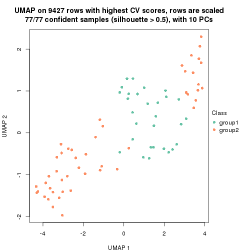</p>

</div>
<div id='tab-CV-kmeans-dimension-reduction-2'>
<pre><code class="r">dimension_reduction(res, k = 3, method = &quot;UMAP&quot;)
</code></pre>

<p></p>

</div>
<div id='tab-CV-kmeans-dimension-reduction-3'>
<pre><code class="r">dimension_reduction(res, k = 4, method = &quot;UMAP&quot;)
</code></pre>

<p></p>

</div>
<div id='tab-CV-kmeans-dimension-reduction-4'>
<pre><code class="r">dimension_reduction(res, k = 5, method = &quot;UMAP&quot;)
</code></pre>

<p></p>

</div>
<div id='tab-CV-kmeans-dimension-reduction-5'>
<pre><code class="r">dimension_reduction(res, k = 6, method = &quot;UMAP&quot;)
</code></pre>

<p></p>

</div>
</div>


Following heatmap shows how subgroups are split when increasing `k`:

```r
collect_classes(res)
```


If matrix rows can be associated to genes, consider to use `GO_Enrichment(res,
...)` to perform function enrichment for the signature genes.


 

---------------------------------------------------


### CV:skmeans*


The object with results only for a single top-value method and a single partition method 
can be extracted as:

```r
res = res_list["CV", "skmeans"]
# you can also extract it by
# res = res_list["CV:skmeans"]
```

A summary of `res` and all the functions that can be applied to it:

```r
res
```

```
#> A 'ConsensusPartition' object with k = 2, 3, 4, 5, 6.
#>   On a matrix with 9427 rows and 77 columns.
#>   Top rows (943, 1886, 2828, 3771, 4714) are extracted by 'CV' method.
#>   Subgroups are detected by 'skmeans' method.
#>   Performed in total 1250 partitions by row resampling.
#>   Best k for subgroups seems to be 3.
#> 
#> Following methods can be applied to this 'ConsensusPartition' object:
#>  [1] "cola_report"             "collect_classes"         "collect_plots"          
#>  [4] "collect_stats"           "colnames"                "compare_signatures"     
#>  [7] "consensus_heatmap"       "dimension_reduction"     "functional_enrichment"  
#> [10] "get_anno_col"            "get_anno"                "get_classes"            
#> [13] "get_consensus"           "get_matrix"              "get_membership"         
#> [16] "get_param"               "get_signatures"          "get_stats"              
#> [19] "is_best_k"               "is_stable_k"             "membership_heatmap"     
#> [22] "ncol"                    "nrow"                    "plot_ecdf"              
#> [25] "rownames"                "select_partition_number" "show"                   
#> [28] "suggest_best_k"          "test_to_known_factors"
```

`collect_plots()` function collects all the plots made from `res` for all `k` (number of partitions)
into one single page to provide an easy and fast comparison between different `k`.

```r
collect_plots(res)
```


The plots are:

- The first row: a plot of the ECDF (Empirical cumulative distribution
  function) curves of the consensus matrix for each `k` and the heatmap of
  predicted classes for each `k`.
- The second row: heatmaps of the consensus matrix for each `k`.
- The third row: heatmaps of the membership matrix for each `k`.
- The fouth row: heatmaps of the signatures for each `k`.

All the plots in panels can be made by individual functions and they are
plotted later in this section.

`select_partition_number()` produces several plots showing different
statistics for choosing "optimized" `k`. There are following statistics:

- ECDF curves of the consensus matrix for each `k`;
- 1-PAC. [The PAC
  score](https://en.wikipedia.org/wiki/Consensus_clustering#Over-interpretation_potential_of_consensus_clustering)
  measures the proportion of the ambiguous subgrouping.
- Mean silhouette score.
- Concordance. The mean probability of fiting the consensus class ids in all
  partitions.
- Area increased. Denote $A_k$ as the area under the ECDF curve for current
  `k`, the area increased is defined as $A_k - A_{k-1}$.
- Rand index. The percent of pairs of samples that are both in a same cluster
  or both are not in a same cluster in the partition of k and k-1.
- Jaccard index. The ratio of pairs of samples are both in a same cluster in
  the partition of k and k-1 and the pairs of samples are both in a same
  cluster in the partition k or k-1.

The detailed explanations of these statistics can be found in [the cola
vignette](http://bioconductor.org/packages/devel/bioc/vignettes/cola/inst/doc/cola.html#toc_13).

Generally speaking, lower PAC score, higher mean silhouette score or higher
concordance corresponds to better partition. Rand index and Jaccard index
measure how similar the current partition is compared to partition with `k-1`.
If they are too similar, we won't accept `k` is better than `k-1`.

```r
select_partition_number(res)
```


The numeric values for all these statistics can be obtained by `get_stats()`.

```r
get_stats(res)
```

```
#>   k 1-PAC mean_silhouette concordance area_increased  Rand Jaccard
#> 2 2 0.920           0.937       0.974         0.5007 0.500   0.500
#> 3 3 0.943           0.934       0.969         0.3078 0.791   0.602
#> 4 4 0.699           0.674       0.829         0.1063 0.913   0.751
#> 5 5 0.649           0.606       0.796         0.0649 0.916   0.712
#> 6 6 0.653           0.549       0.748         0.0334 0.944   0.780
```

`suggest_best_k()` suggests the best $k$ based on these statistics. The rules are as follows:

- All $k$ with Jaccard index larger than 0.95 are removed because the increase of
  the partition number does not provides enough extra information. If all $k$ are removed,
  the best $k$ is assigned by `NA`.
- For $k$ with 1-PAC larger than 0.9, the maximal $k$ is taken as the "best k". Other $k$ is called "optional k".
- If it does not fit the second rule. The $k$ with the highest vote of highest
  1-PAC, mean silhouette and concordance is taken as the "best k".

```r
suggest_best_k(res)
```

```
#> [1] 3
#> attr(,"optional")
#> [1] 2
```

There is also optional best $k$ = 2 that is worth to check.

Following shows the table of the partitions (You need to click the **show/hide
code output** link to see it). The membership matrix (columns with name `p*`)
is inferred by
[`clue::cl_consensus()`](https://www.rdocumentation.org/link/cl_consensus?package=clue)
function with the `SE` method. Basically the value in the membership matrix
represents the probability to belong to a certain group. The finall class
label for an item is determined with the group with highest probability it
belongs to.

In `get_classes()` function, the entropy is calculated from the membership
matrix and the silhouette score is calculated from the consensus matrix.


<script>
$( function() {
	$( '#tabs-CV-skmeans-get-classes' ).tabs();
} );
</script>
<div id='tabs-CV-skmeans-get-classes'>
<ul>
<li><a href='#tab-CV-skmeans-get-classes-1'>k = 2</a></li>
<li><a href='#tab-CV-skmeans-get-classes-2'>k = 3</a></li>
<li><a href='#tab-CV-skmeans-get-classes-3'>k = 4</a></li>
<li><a href='#tab-CV-skmeans-get-classes-4'>k = 5</a></li>
<li><a href='#tab-CV-skmeans-get-classes-5'>k = 6</a></li>
</ul>

<div id='tab-CV-skmeans-get-classes-1'>
<p><a id='tab-CV-skmeans-get-classes-1-a' style='color:#0366d6' href='#'>show/hide code output</a></p>
<pre><code class="r">cbind(get_classes(res, k = 2), get_membership(res, k = 2))
</code></pre>

<pre><code>#&gt;           class entropy silhouette    p1    p2
#&gt; SRR944011     2  0.0000      0.970 0.000 1.000
#&gt; SRR944012     1  0.0000      0.975 1.000 0.000
#&gt; SRR944014     2  0.0000      0.970 0.000 1.000
#&gt; SRR944013     2  0.6801      0.773 0.180 0.820
#&gt; SRR944015     1  0.0000      0.975 1.000 0.000
#&gt; SRR944016     1  0.0000      0.975 1.000 0.000
#&gt; SRR944017     2  0.0000      0.970 0.000 1.000
#&gt; SRR944018     1  0.0000      0.975 1.000 0.000
#&gt; SRR944019     1  0.0000      0.975 1.000 0.000
#&gt; SRR944020     1  0.0000      0.975 1.000 0.000
#&gt; SRR944021     2  0.0000      0.970 0.000 1.000
#&gt; SRR944022     1  0.0000      0.975 1.000 0.000
#&gt; SRR944023     1  0.0000      0.975 1.000 0.000
#&gt; SRR944024     1  0.0000      0.975 1.000 0.000
#&gt; SRR944026     2  0.0000      0.970 0.000 1.000
#&gt; SRR944025     2  0.0000      0.970 0.000 1.000
#&gt; SRR944028     2  0.0000      0.970 0.000 1.000
#&gt; SRR944029     1  0.0000      0.975 1.000 0.000
#&gt; SRR944030     2  0.0000      0.970 0.000 1.000
#&gt; SRR944031     2  0.9661      0.353 0.392 0.608
#&gt; SRR944032     2  0.9000      0.537 0.316 0.684
#&gt; SRR944033     2  0.0000      0.970 0.000 1.000
#&gt; SRR944034     2  0.0000      0.970 0.000 1.000
#&gt; SRR944036     2  0.0376      0.967 0.004 0.996
#&gt; SRR944035     2  0.0000      0.970 0.000 1.000
#&gt; SRR944038     1  0.0000      0.975 1.000 0.000
#&gt; SRR944037     1  0.0000      0.975 1.000 0.000
#&gt; SRR944039     1  0.0000      0.975 1.000 0.000
#&gt; SRR944040     2  0.0000      0.970 0.000 1.000
#&gt; SRR944041     1  0.0000      0.975 1.000 0.000
#&gt; SRR944042     1  0.9635      0.355 0.612 0.388
#&gt; SRR944043     1  0.0000      0.975 1.000 0.000
#&gt; SRR944044     2  0.0000      0.970 0.000 1.000
#&gt; SRR944046     2  0.4690      0.879 0.100 0.900
#&gt; SRR944045     2  0.0000      0.970 0.000 1.000
#&gt; SRR944047     2  0.0000      0.970 0.000 1.000
#&gt; SRR944048     1  0.0000      0.975 1.000 0.000
#&gt; SRR944049     2  0.0000      0.970 0.000 1.000
#&gt; SRR944050     1  0.0000      0.975 1.000 0.000
#&gt; SRR944051     2  0.0000      0.970 0.000 1.000
#&gt; SRR944052     2  0.0000      0.970 0.000 1.000
#&gt; SRR944053     1  0.0000      0.975 1.000 0.000
#&gt; SRR944054     2  0.0000      0.970 0.000 1.000
#&gt; SRR944055     2  0.0000      0.970 0.000 1.000
#&gt; SRR944056     2  0.0000      0.970 0.000 1.000
#&gt; SRR944057     1  0.0000      0.975 1.000 0.000
#&gt; SRR944058     1  0.0000      0.975 1.000 0.000
#&gt; SRR944059     2  0.0000      0.970 0.000 1.000
#&gt; SRR944060     1  0.0000      0.975 1.000 0.000
#&gt; SRR944061     2  0.0000      0.970 0.000 1.000
#&gt; SRR944062     1  0.0000      0.975 1.000 0.000
#&gt; SRR944063     1  0.0000      0.975 1.000 0.000
#&gt; SRR944064     2  0.0000      0.970 0.000 1.000
#&gt; SRR944065     1  0.0000      0.975 1.000 0.000
#&gt; SRR944066     1  0.0000      0.975 1.000 0.000
#&gt; SRR944067     2  0.0000      0.970 0.000 1.000
#&gt; SRR944068     1  0.0000      0.975 1.000 0.000
#&gt; SRR944069     2  0.0000      0.970 0.000 1.000
#&gt; SRR944070     1  0.0000      0.975 1.000 0.000
#&gt; SRR944071     2  0.0000      0.970 0.000 1.000
#&gt; SRR944072     1  0.0000      0.975 1.000 0.000
#&gt; SRR944073     2  0.0000      0.970 0.000 1.000
#&gt; SRR944075     2  0.0000      0.970 0.000 1.000
#&gt; SRR944074     2  0.0000      0.970 0.000 1.000
#&gt; SRR944076     2  0.4690      0.879 0.100 0.900
#&gt; SRR944077     2  0.0000      0.970 0.000 1.000
#&gt; SRR944078     2  0.0000      0.970 0.000 1.000
#&gt; SRR944079     2  0.0000      0.970 0.000 1.000
#&gt; SRR944080     2  0.0000      0.970 0.000 1.000
#&gt; SRR944081     1  0.0000      0.975 1.000 0.000
#&gt; SRR944082     1  0.0000      0.975 1.000 0.000
#&gt; SRR944083     1  0.0000      0.975 1.000 0.000
#&gt; SRR944084     1  0.9358      0.448 0.648 0.352
#&gt; SRR944085     2  0.0376      0.967 0.004 0.996
#&gt; SRR944086     1  0.3114      0.920 0.944 0.056
#&gt; SRR944088     2  0.0000      0.970 0.000 1.000
#&gt; SRR944087     2  0.4298      0.892 0.088 0.912
</code></pre>

<script>
$('#tab-CV-skmeans-get-classes-1-a').parent().next().next().hide();
$('#tab-CV-skmeans-get-classes-1-a').click(function(){
  $('#tab-CV-skmeans-get-classes-1-a').parent().next().next().toggle();
  return(false);
});
</script>
</div>

<div id='tab-CV-skmeans-get-classes-2'>
<p><a id='tab-CV-skmeans-get-classes-2-a' style='color:#0366d6' href='#'>show/hide code output</a></p>
<pre><code class="r">cbind(get_classes(res, k = 3), get_membership(res, k = 3))
</code></pre>

<pre><code>#&gt;           class entropy silhouette    p1    p2    p3
#&gt; SRR944011     3  0.0424      0.918 0.000 0.008 0.992
#&gt; SRR944012     1  0.0000      0.979 1.000 0.000 0.000
#&gt; SRR944014     2  0.0424      0.982 0.000 0.992 0.008
#&gt; SRR944013     2  0.2496      0.907 0.068 0.928 0.004
#&gt; SRR944015     1  0.0000      0.979 1.000 0.000 0.000
#&gt; SRR944016     1  0.0424      0.976 0.992 0.000 0.008
#&gt; SRR944017     2  0.0000      0.981 0.000 1.000 0.000
#&gt; SRR944018     1  0.0000      0.979 1.000 0.000 0.000
#&gt; SRR944019     1  0.0000      0.979 1.000 0.000 0.000
#&gt; SRR944020     1  0.0000      0.979 1.000 0.000 0.000
#&gt; SRR944021     2  0.0424      0.982 0.000 0.992 0.008
#&gt; SRR944022     1  0.0000      0.979 1.000 0.000 0.000
#&gt; SRR944023     3  0.3686      0.811 0.140 0.000 0.860
#&gt; SRR944024     1  0.0237      0.978 0.996 0.000 0.004
#&gt; SRR944026     2  0.0237      0.980 0.000 0.996 0.004
#&gt; SRR944025     2  0.0000      0.981 0.000 1.000 0.000
#&gt; SRR944028     2  0.0237      0.980 0.000 0.996 0.004
#&gt; SRR944029     1  0.6255      0.685 0.748 0.048 0.204
#&gt; SRR944030     2  0.0424      0.982 0.000 0.992 0.008
#&gt; SRR944031     3  0.0237      0.918 0.000 0.004 0.996
#&gt; SRR944032     2  0.5285      0.665 0.244 0.752 0.004
#&gt; SRR944033     2  0.0424      0.982 0.000 0.992 0.008
#&gt; SRR944034     2  0.0424      0.982 0.000 0.992 0.008
#&gt; SRR944036     3  0.2772      0.880 0.004 0.080 0.916
#&gt; SRR944035     2  0.0237      0.982 0.000 0.996 0.004
#&gt; SRR944038     3  0.1860      0.893 0.052 0.000 0.948
#&gt; SRR944037     1  0.0000      0.979 1.000 0.000 0.000
#&gt; SRR944039     1  0.0000      0.979 1.000 0.000 0.000
#&gt; SRR944040     2  0.1031      0.969 0.000 0.976 0.024
#&gt; SRR944041     1  0.0000      0.979 1.000 0.000 0.000
#&gt; SRR944042     3  0.0237      0.917 0.004 0.000 0.996
#&gt; SRR944043     1  0.0000      0.979 1.000 0.000 0.000
#&gt; SRR944044     2  0.0237      0.980 0.000 0.996 0.004
#&gt; SRR944046     3  0.0237      0.918 0.000 0.004 0.996
#&gt; SRR944045     2  0.0424      0.982 0.000 0.992 0.008
#&gt; SRR944047     2  0.0424      0.982 0.000 0.992 0.008
#&gt; SRR944048     1  0.0424      0.976 0.992 0.000 0.008
#&gt; SRR944049     2  0.0000      0.981 0.000 1.000 0.000
#&gt; SRR944050     1  0.0424      0.976 0.992 0.000 0.008
#&gt; SRR944051     2  0.0237      0.980 0.000 0.996 0.004
#&gt; SRR944052     2  0.0424      0.982 0.000 0.992 0.008
#&gt; SRR944053     1  0.0000      0.979 1.000 0.000 0.000
#&gt; SRR944054     2  0.0237      0.980 0.000 0.996 0.004
#&gt; SRR944055     3  0.2959      0.866 0.000 0.100 0.900
#&gt; SRR944056     2  0.0424      0.982 0.000 0.992 0.008
#&gt; SRR944057     1  0.0424      0.976 0.992 0.000 0.008
#&gt; SRR944058     1  0.0000      0.979 1.000 0.000 0.000
#&gt; SRR944059     3  0.1411      0.909 0.000 0.036 0.964
#&gt; SRR944060     3  0.5926      0.457 0.356 0.000 0.644
#&gt; SRR944061     2  0.0424      0.982 0.000 0.992 0.008
#&gt; SRR944062     1  0.0237      0.978 0.996 0.000 0.004
#&gt; SRR944063     1  0.0000      0.979 1.000 0.000 0.000
#&gt; SRR944064     2  0.0237      0.982 0.000 0.996 0.004
#&gt; SRR944065     1  0.0000      0.979 1.000 0.000 0.000
#&gt; SRR944066     1  0.0424      0.976 0.992 0.000 0.008
#&gt; SRR944067     2  0.0000      0.981 0.000 1.000 0.000
#&gt; SRR944068     1  0.0000      0.979 1.000 0.000 0.000
#&gt; SRR944069     2  0.0424      0.982 0.000 0.992 0.008
#&gt; SRR944070     3  0.0747      0.913 0.016 0.000 0.984
#&gt; SRR944071     3  0.0237      0.918 0.000 0.004 0.996
#&gt; SRR944072     1  0.0000      0.979 1.000 0.000 0.000
#&gt; SRR944073     2  0.0424      0.982 0.000 0.992 0.008
#&gt; SRR944075     3  0.2878      0.870 0.000 0.096 0.904
#&gt; SRR944074     2  0.0237      0.980 0.000 0.996 0.004
#&gt; SRR944076     3  0.0237      0.918 0.000 0.004 0.996
#&gt; SRR944077     2  0.0424      0.982 0.000 0.992 0.008
#&gt; SRR944078     3  0.6244      0.230 0.000 0.440 0.560
#&gt; SRR944079     2  0.0424      0.982 0.000 0.992 0.008
#&gt; SRR944080     2  0.0424      0.982 0.000 0.992 0.008
#&gt; SRR944081     1  0.1878      0.934 0.952 0.044 0.004
#&gt; SRR944082     1  0.0237      0.978 0.996 0.000 0.004
#&gt; SRR944083     1  0.0424      0.976 0.992 0.000 0.008
#&gt; SRR944084     3  0.1170      0.913 0.016 0.008 0.976
#&gt; SRR944085     3  0.0237      0.918 0.000 0.004 0.996
#&gt; SRR944086     1  0.4692      0.768 0.820 0.168 0.012
#&gt; SRR944088     2  0.0237      0.980 0.000 0.996 0.004
#&gt; SRR944087     3  0.0237      0.918 0.000 0.004 0.996
</code></pre>

<script>
$('#tab-CV-skmeans-get-classes-2-a').parent().next().next().hide();
$('#tab-CV-skmeans-get-classes-2-a').click(function(){
  $('#tab-CV-skmeans-get-classes-2-a').parent().next().next().toggle();
  return(false);
});
</script>
</div>

<div id='tab-CV-skmeans-get-classes-3'>
<p><a id='tab-CV-skmeans-get-classes-3-a' style='color:#0366d6' href='#'>show/hide code output</a></p>
<pre><code class="r">cbind(get_classes(res, k = 4), get_membership(res, k = 4))
</code></pre>

<pre><code>#&gt;           class entropy silhouette    p1    p2    p3    p4
#&gt; SRR944011     3  0.1059      0.807 0.012 0.016 0.972 0.000
#&gt; SRR944012     4  0.1792      0.645 0.068 0.000 0.000 0.932
#&gt; SRR944014     2  0.0000      0.930 0.000 1.000 0.000 0.000
#&gt; SRR944013     2  0.6835      0.602 0.264 0.600 0.004 0.132
#&gt; SRR944015     4  0.0804      0.665 0.012 0.000 0.008 0.980
#&gt; SRR944016     1  0.4543      0.768 0.676 0.000 0.000 0.324
#&gt; SRR944017     2  0.1389      0.917 0.048 0.952 0.000 0.000
#&gt; SRR944018     4  0.4193      0.219 0.268 0.000 0.000 0.732
#&gt; SRR944019     4  0.3688      0.540 0.208 0.000 0.000 0.792
#&gt; SRR944020     4  0.0592      0.666 0.016 0.000 0.000 0.984
#&gt; SRR944021     2  0.0000      0.930 0.000 1.000 0.000 0.000
#&gt; SRR944022     4  0.0188      0.664 0.004 0.000 0.000 0.996
#&gt; SRR944023     3  0.6919      0.206 0.352 0.000 0.528 0.120
#&gt; SRR944024     1  0.4817      0.733 0.612 0.000 0.000 0.388
#&gt; SRR944026     2  0.3626      0.833 0.184 0.812 0.004 0.000
#&gt; SRR944025     2  0.1792      0.907 0.068 0.932 0.000 0.000
#&gt; SRR944028     2  0.2011      0.902 0.080 0.920 0.000 0.000
#&gt; SRR944029     4  0.5277      0.443 0.304 0.000 0.028 0.668
#&gt; SRR944030     2  0.0000      0.930 0.000 1.000 0.000 0.000
#&gt; SRR944031     3  0.0779      0.805 0.016 0.000 0.980 0.004
#&gt; SRR944032     1  0.5921      0.268 0.672 0.256 0.004 0.068
#&gt; SRR944033     2  0.0000      0.930 0.000 1.000 0.000 0.000
#&gt; SRR944034     2  0.0000      0.930 0.000 1.000 0.000 0.000
#&gt; SRR944036     3  0.6163      0.648 0.164 0.160 0.676 0.000
#&gt; SRR944035     2  0.0000      0.930 0.000 1.000 0.000 0.000
#&gt; SRR944038     3  0.3280      0.732 0.016 0.000 0.860 0.124
#&gt; SRR944037     4  0.0188      0.667 0.004 0.000 0.000 0.996
#&gt; SRR944039     4  0.3942      0.370 0.236 0.000 0.000 0.764
#&gt; SRR944040     2  0.1545      0.895 0.008 0.952 0.040 0.000
#&gt; SRR944041     4  0.2469      0.626 0.108 0.000 0.000 0.892
#&gt; SRR944042     3  0.0376      0.806 0.004 0.000 0.992 0.004
#&gt; SRR944043     4  0.4961     -0.436 0.448 0.000 0.000 0.552
#&gt; SRR944044     2  0.3074      0.858 0.152 0.848 0.000 0.000
#&gt; SRR944046     3  0.0376      0.806 0.004 0.000 0.992 0.004
#&gt; SRR944045     2  0.0000      0.930 0.000 1.000 0.000 0.000
#&gt; SRR944047     2  0.0000      0.930 0.000 1.000 0.000 0.000
#&gt; SRR944048     1  0.4564      0.770 0.672 0.000 0.000 0.328
#&gt; SRR944049     2  0.1302      0.918 0.044 0.956 0.000 0.000
#&gt; SRR944050     1  0.4500      0.762 0.684 0.000 0.000 0.316
#&gt; SRR944051     2  0.4690      0.755 0.268 0.720 0.004 0.008
#&gt; SRR944052     2  0.0000      0.930 0.000 1.000 0.000 0.000
#&gt; SRR944053     4  0.0000      0.666 0.000 0.000 0.000 1.000
#&gt; SRR944054     2  0.4198      0.799 0.224 0.768 0.004 0.004
#&gt; SRR944055     3  0.4690      0.669 0.016 0.260 0.724 0.000
#&gt; SRR944056     2  0.0188      0.928 0.004 0.996 0.000 0.000
#&gt; SRR944057     1  0.4624      0.768 0.660 0.000 0.000 0.340
#&gt; SRR944058     4  0.5000     -0.562 0.500 0.000 0.000 0.500
#&gt; SRR944059     3  0.3392      0.767 0.020 0.124 0.856 0.000
#&gt; SRR944060     3  0.7495      0.112 0.192 0.000 0.468 0.340
#&gt; SRR944061     2  0.0000      0.930 0.000 1.000 0.000 0.000
#&gt; SRR944062     1  0.4843      0.722 0.604 0.000 0.000 0.396
#&gt; SRR944063     4  0.0000      0.666 0.000 0.000 0.000 1.000
#&gt; SRR944064     2  0.0336      0.929 0.008 0.992 0.000 0.000
#&gt; SRR944065     4  0.2647      0.545 0.120 0.000 0.000 0.880
#&gt; SRR944066     1  0.4730      0.755 0.636 0.000 0.000 0.364
#&gt; SRR944067     2  0.0817      0.925 0.024 0.976 0.000 0.000
#&gt; SRR944068     4  0.0657      0.666 0.012 0.000 0.004 0.984
#&gt; SRR944069     2  0.0000      0.930 0.000 1.000 0.000 0.000
#&gt; SRR944070     3  0.2060      0.783 0.016 0.000 0.932 0.052
#&gt; SRR944071     3  0.2521      0.795 0.024 0.064 0.912 0.000
#&gt; SRR944072     4  0.4999     -0.545 0.492 0.000 0.000 0.508
#&gt; SRR944073     2  0.0000      0.930 0.000 1.000 0.000 0.000
#&gt; SRR944075     3  0.4857      0.635 0.016 0.284 0.700 0.000
#&gt; SRR944074     2  0.3610      0.824 0.200 0.800 0.000 0.000
#&gt; SRR944076     3  0.0657      0.806 0.012 0.000 0.984 0.004
#&gt; SRR944077     2  0.0000      0.930 0.000 1.000 0.000 0.000
#&gt; SRR944078     3  0.5606      0.184 0.020 0.480 0.500 0.000
#&gt; SRR944079     2  0.0000      0.930 0.000 1.000 0.000 0.000
#&gt; SRR944080     2  0.0000      0.930 0.000 1.000 0.000 0.000
#&gt; SRR944081     4  0.5012      0.445 0.320 0.008 0.004 0.668
#&gt; SRR944082     1  0.4994      0.563 0.520 0.000 0.000 0.480
#&gt; SRR944083     1  0.4585      0.770 0.668 0.000 0.000 0.332
#&gt; SRR944084     4  0.7358      0.168 0.140 0.008 0.332 0.520
#&gt; SRR944085     3  0.0779      0.807 0.016 0.004 0.980 0.000
#&gt; SRR944086     1  0.6141      0.112 0.620 0.060 0.004 0.316
#&gt; SRR944088     2  0.6027      0.682 0.272 0.656 0.004 0.068
#&gt; SRR944087     3  0.0844      0.807 0.004 0.012 0.980 0.004
</code></pre>

<script>
$('#tab-CV-skmeans-get-classes-3-a').parent().next().next().hide();
$('#tab-CV-skmeans-get-classes-3-a').click(function(){
  $('#tab-CV-skmeans-get-classes-3-a').parent().next().next().toggle();
  return(false);
});
</script>
</div>

<div id='tab-CV-skmeans-get-classes-4'>
<p><a id='tab-CV-skmeans-get-classes-4-a' style='color:#0366d6' href='#'>show/hide code output</a></p>
<pre><code class="r">cbind(get_classes(res, k = 5), get_membership(res, k = 5))
</code></pre>

<pre><code>#&gt;           class entropy silhouette    p1    p2    p3    p4    p5
#&gt; SRR944011     3  0.2282     0.7234 0.004 0.032 0.920 0.008 0.036
#&gt; SRR944012     4  0.2645     0.7527 0.068 0.000 0.000 0.888 0.044
#&gt; SRR944014     2  0.0000     0.8139 0.000 1.000 0.000 0.000 0.000
#&gt; SRR944013     5  0.5157     0.5811 0.016 0.288 0.000 0.040 0.656
#&gt; SRR944015     4  0.2291     0.7520 0.072 0.000 0.008 0.908 0.012
#&gt; SRR944016     1  0.0912     0.8017 0.972 0.000 0.000 0.012 0.016
#&gt; SRR944017     2  0.3143     0.6556 0.000 0.796 0.000 0.000 0.204
#&gt; SRR944018     4  0.4798     0.2077 0.396 0.000 0.000 0.580 0.024
#&gt; SRR944019     4  0.6024     0.4670 0.288 0.000 0.000 0.560 0.152
#&gt; SRR944020     4  0.2189     0.7587 0.084 0.000 0.000 0.904 0.012
#&gt; SRR944021     2  0.0000     0.8139 0.000 1.000 0.000 0.000 0.000
#&gt; SRR944022     4  0.2179     0.7564 0.100 0.000 0.000 0.896 0.004
#&gt; SRR944023     3  0.6794     0.1455 0.388 0.000 0.468 0.096 0.048
#&gt; SRR944024     1  0.2462     0.8084 0.880 0.000 0.000 0.112 0.008
#&gt; SRR944026     2  0.4735    -0.0945 0.000 0.524 0.000 0.016 0.460
#&gt; SRR944025     2  0.4047     0.4593 0.000 0.676 0.000 0.004 0.320
#&gt; SRR944028     2  0.3990     0.4754 0.000 0.688 0.000 0.004 0.308
#&gt; SRR944029     4  0.4705     0.4034 0.000 0.004 0.012 0.580 0.404
#&gt; SRR944030     2  0.0000     0.8139 0.000 1.000 0.000 0.000 0.000
#&gt; SRR944031     3  0.1774     0.7276 0.000 0.000 0.932 0.016 0.052
#&gt; SRR944032     5  0.6057     0.2414 0.392 0.060 0.004 0.020 0.524
#&gt; SRR944033     2  0.0000     0.8139 0.000 1.000 0.000 0.000 0.000
#&gt; SRR944034     2  0.0000     0.8139 0.000 1.000 0.000 0.000 0.000
#&gt; SRR944036     3  0.8629     0.2650 0.216 0.260 0.392 0.032 0.100
#&gt; SRR944035     2  0.2230     0.7477 0.000 0.884 0.000 0.000 0.116
#&gt; SRR944038     3  0.4422     0.5771 0.020 0.000 0.732 0.232 0.016
#&gt; SRR944037     4  0.2249     0.7582 0.096 0.000 0.000 0.896 0.008
#&gt; SRR944039     4  0.5314     0.2226 0.420 0.000 0.000 0.528 0.052
#&gt; SRR944040     2  0.1960     0.7484 0.000 0.928 0.048 0.004 0.020
#&gt; SRR944041     4  0.4069     0.7068 0.096 0.000 0.000 0.792 0.112
#&gt; SRR944042     3  0.1082     0.7297 0.000 0.000 0.964 0.008 0.028
#&gt; SRR944043     1  0.4597     0.3274 0.564 0.000 0.000 0.424 0.012
#&gt; SRR944044     2  0.4473     0.1285 0.000 0.580 0.000 0.008 0.412
#&gt; SRR944046     3  0.1153     0.7295 0.004 0.000 0.964 0.008 0.024
#&gt; SRR944045     2  0.0162     0.8116 0.000 0.996 0.000 0.004 0.000
#&gt; SRR944047     2  0.0000     0.8139 0.000 1.000 0.000 0.000 0.000
#&gt; SRR944048     1  0.1211     0.8025 0.960 0.000 0.000 0.016 0.024
#&gt; SRR944049     2  0.3550     0.6009 0.000 0.760 0.000 0.004 0.236
#&gt; SRR944050     1  0.1043     0.7844 0.960 0.000 0.000 0.000 0.040
#&gt; SRR944051     5  0.4217     0.6101 0.012 0.244 0.000 0.012 0.732
#&gt; SRR944052     2  0.0000     0.8139 0.000 1.000 0.000 0.000 0.000
#&gt; SRR944053     4  0.1965     0.7576 0.096 0.000 0.000 0.904 0.000
#&gt; SRR944054     5  0.4752     0.3336 0.000 0.412 0.000 0.020 0.568
#&gt; SRR944055     3  0.5654     0.3842 0.004 0.384 0.552 0.008 0.052
#&gt; SRR944056     2  0.0000     0.8139 0.000 1.000 0.000 0.000 0.000
#&gt; SRR944057     1  0.1106     0.8095 0.964 0.000 0.000 0.024 0.012
#&gt; SRR944058     1  0.3857     0.6164 0.688 0.000 0.000 0.312 0.000
#&gt; SRR944059     3  0.4684     0.6312 0.000 0.176 0.744 0.008 0.072
#&gt; SRR944060     3  0.7647     0.1630 0.244 0.000 0.408 0.292 0.056
#&gt; SRR944061     2  0.0000     0.8139 0.000 1.000 0.000 0.000 0.000
#&gt; SRR944062     1  0.2997     0.7916 0.840 0.000 0.000 0.148 0.012
#&gt; SRR944063     4  0.2020     0.7562 0.100 0.000 0.000 0.900 0.000
#&gt; SRR944064     2  0.2886     0.7143 0.008 0.844 0.000 0.000 0.148
#&gt; SRR944065     4  0.3550     0.6725 0.184 0.000 0.000 0.796 0.020
#&gt; SRR944066     1  0.2011     0.8145 0.908 0.000 0.000 0.088 0.004
#&gt; SRR944067     2  0.3242     0.6453 0.000 0.784 0.000 0.000 0.216
#&gt; SRR944068     4  0.2077     0.7540 0.084 0.000 0.000 0.908 0.008
#&gt; SRR944069     2  0.0162     0.8116 0.000 0.996 0.000 0.004 0.000
#&gt; SRR944070     3  0.3218     0.6889 0.004 0.000 0.844 0.128 0.024
#&gt; SRR944071     3  0.5736     0.6180 0.016 0.176 0.692 0.016 0.100
#&gt; SRR944072     1  0.4118     0.5614 0.660 0.000 0.000 0.336 0.004
#&gt; SRR944073     2  0.0000     0.8139 0.000 1.000 0.000 0.000 0.000
#&gt; SRR944075     3  0.5786     0.3439 0.004 0.400 0.532 0.012 0.052
#&gt; SRR944074     2  0.4747    -0.1857 0.000 0.500 0.000 0.016 0.484
#&gt; SRR944076     3  0.1195     0.7303 0.000 0.000 0.960 0.012 0.028
#&gt; SRR944077     2  0.0000     0.8139 0.000 1.000 0.000 0.000 0.000
#&gt; SRR944078     2  0.5322     0.1514 0.000 0.580 0.372 0.012 0.036
#&gt; SRR944079     2  0.0000     0.8139 0.000 1.000 0.000 0.000 0.000
#&gt; SRR944080     2  0.0794     0.8015 0.000 0.972 0.000 0.000 0.028
#&gt; SRR944081     4  0.4907     0.2407 0.024 0.000 0.000 0.488 0.488
#&gt; SRR944082     1  0.3988     0.7017 0.732 0.000 0.000 0.252 0.016
#&gt; SRR944083     1  0.1124     0.8128 0.960 0.000 0.000 0.036 0.004
#&gt; SRR944084     4  0.6274     0.4413 0.012 0.008 0.172 0.616 0.192
#&gt; SRR944085     3  0.2102     0.7286 0.004 0.000 0.916 0.012 0.068
#&gt; SRR944086     5  0.7111     0.1291 0.272 0.024 0.008 0.192 0.504
#&gt; SRR944088     5  0.4938     0.5498 0.000 0.312 0.000 0.048 0.640
#&gt; SRR944087     3  0.1731     0.7287 0.000 0.008 0.940 0.012 0.040
</code></pre>

<script>
$('#tab-CV-skmeans-get-classes-4-a').parent().next().next().hide();
$('#tab-CV-skmeans-get-classes-4-a').click(function(){
  $('#tab-CV-skmeans-get-classes-4-a').parent().next().next().toggle();
  return(false);
});
</script>
</div>

<div id='tab-CV-skmeans-get-classes-5'>
<p><a id='tab-CV-skmeans-get-classes-5-a' style='color:#0366d6' href='#'>show/hide code output</a></p>
<pre><code class="r">cbind(get_classes(res, k = 6), get_membership(res, k = 6))
</code></pre>

<pre><code>#&gt;           class entropy silhouette    p1    p2    p3    p4    p5 p6
#&gt; SRR944011     3  0.4160     0.6761 0.004 0.068 0.760 0.000 0.008 NA
#&gt; SRR944012     4  0.3189     0.7188 0.016 0.000 0.000 0.848 0.064 NA
#&gt; SRR944014     2  0.0146     0.7676 0.000 0.996 0.000 0.000 0.000 NA
#&gt; SRR944013     5  0.5867     0.5658 0.020 0.200 0.000 0.024 0.624 NA
#&gt; SRR944015     4  0.2145     0.7296 0.012 0.000 0.028 0.916 0.004 NA
#&gt; SRR944016     1  0.2825     0.7613 0.876 0.000 0.000 0.040 0.028 NA
#&gt; SRR944017     2  0.4354     0.4495 0.008 0.684 0.000 0.000 0.268 NA
#&gt; SRR944018     4  0.5317     0.2606 0.288 0.000 0.000 0.608 0.024 NA
#&gt; SRR944019     4  0.6553     0.4824 0.132 0.000 0.000 0.552 0.132 NA
#&gt; SRR944020     4  0.0984     0.7469 0.012 0.000 0.000 0.968 0.008 NA
#&gt; SRR944021     2  0.0692     0.7643 0.000 0.976 0.000 0.000 0.004 NA
#&gt; SRR944022     4  0.0777     0.7428 0.024 0.000 0.000 0.972 0.000 NA
#&gt; SRR944023     3  0.6876     0.2837 0.316 0.000 0.444 0.048 0.012 NA
#&gt; SRR944024     1  0.3663     0.7583 0.796 0.000 0.000 0.128 0.004 NA
#&gt; SRR944026     5  0.4172     0.1751 0.000 0.460 0.000 0.000 0.528 NA
#&gt; SRR944025     2  0.4794     0.2523 0.004 0.596 0.000 0.000 0.344 NA
#&gt; SRR944028     2  0.4763     0.1751 0.004 0.576 0.000 0.000 0.372 NA
#&gt; SRR944029     4  0.6403     0.2917 0.004 0.000 0.032 0.468 0.336 NA
#&gt; SRR944030     2  0.0146     0.7669 0.000 0.996 0.000 0.000 0.004 NA
#&gt; SRR944031     3  0.2698     0.7096 0.008 0.000 0.860 0.004 0.008 NA
#&gt; SRR944032     5  0.7141     0.1269 0.296 0.052 0.004 0.008 0.408 NA
#&gt; SRR944033     2  0.0000     0.7675 0.000 1.000 0.000 0.000 0.000 NA
#&gt; SRR944034     2  0.0260     0.7657 0.000 0.992 0.000 0.000 0.008 NA
#&gt; SRR944036     3  0.8838     0.2187 0.144 0.216 0.304 0.012 0.092 NA
#&gt; SRR944035     2  0.3567     0.6280 0.008 0.804 0.000 0.000 0.136 NA
#&gt; SRR944038     3  0.4500     0.6207 0.016 0.000 0.740 0.160 0.004 NA
#&gt; SRR944037     4  0.1938     0.7412 0.020 0.000 0.000 0.920 0.008 NA
#&gt; SRR944039     4  0.6485     0.1277 0.336 0.000 0.000 0.468 0.060 NA
#&gt; SRR944040     2  0.2290     0.6990 0.000 0.892 0.020 0.000 0.004 NA
#&gt; SRR944041     4  0.4470     0.6757 0.044 0.000 0.000 0.760 0.092 NA
#&gt; SRR944042     3  0.1082     0.7186 0.004 0.000 0.956 0.000 0.000 NA
#&gt; SRR944043     1  0.5647     0.2285 0.464 0.000 0.008 0.440 0.016 NA
#&gt; SRR944044     2  0.4172    -0.0797 0.000 0.528 0.000 0.000 0.460 NA
#&gt; SRR944046     3  0.2545     0.7151 0.004 0.008 0.884 0.000 0.020 NA
#&gt; SRR944045     2  0.0632     0.7631 0.000 0.976 0.000 0.000 0.000 NA
#&gt; SRR944047     2  0.0000     0.7675 0.000 1.000 0.000 0.000 0.000 NA
#&gt; SRR944048     1  0.2390     0.7712 0.896 0.000 0.000 0.044 0.008 NA
#&gt; SRR944049     2  0.3719     0.5297 0.000 0.728 0.000 0.000 0.248 NA
#&gt; SRR944050     1  0.3113     0.7371 0.856 0.000 0.000 0.028 0.040 NA
#&gt; SRR944051     5  0.5463     0.5588 0.024 0.200 0.000 0.008 0.652 NA
#&gt; SRR944052     2  0.0547     0.7643 0.000 0.980 0.000 0.000 0.000 NA
#&gt; SRR944053     4  0.0717     0.7453 0.016 0.000 0.000 0.976 0.000 NA
#&gt; SRR944054     5  0.4616     0.4781 0.000 0.316 0.000 0.000 0.624 NA
#&gt; SRR944055     2  0.5980    -0.2080 0.000 0.408 0.396 0.000 0.004 NA
#&gt; SRR944056     2  0.0935     0.7582 0.000 0.964 0.000 0.000 0.004 NA
#&gt; SRR944057     1  0.2577     0.7637 0.888 0.000 0.000 0.040 0.016 NA
#&gt; SRR944058     1  0.4770     0.5116 0.584 0.000 0.000 0.368 0.012 NA
#&gt; SRR944059     3  0.5761     0.4805 0.000 0.236 0.536 0.000 0.004 NA
#&gt; SRR944060     3  0.7531     0.2184 0.164 0.000 0.396 0.272 0.008 NA
#&gt; SRR944061     2  0.0363     0.7669 0.000 0.988 0.000 0.000 0.000 NA
#&gt; SRR944062     1  0.3980     0.7392 0.760 0.000 0.000 0.168 0.004 NA
#&gt; SRR944063     4  0.0717     0.7453 0.016 0.000 0.000 0.976 0.000 NA
#&gt; SRR944064     2  0.3527     0.6332 0.008 0.808 0.000 0.000 0.132 NA
#&gt; SRR944065     4  0.4166     0.5929 0.156 0.000 0.000 0.764 0.024 NA
#&gt; SRR944066     1  0.2679     0.7756 0.868 0.000 0.000 0.096 0.004 NA
#&gt; SRR944067     2  0.4515     0.4616 0.008 0.688 0.000 0.000 0.244 NA
#&gt; SRR944068     4  0.1578     0.7385 0.012 0.000 0.012 0.944 0.004 NA
#&gt; SRR944069     2  0.0508     0.7665 0.000 0.984 0.000 0.000 0.004 NA
#&gt; SRR944070     3  0.3427     0.6838 0.008 0.000 0.824 0.088 0.000 NA
#&gt; SRR944071     3  0.6357     0.4937 0.008 0.212 0.488 0.000 0.016 NA
#&gt; SRR944072     1  0.5536     0.4610 0.540 0.000 0.000 0.356 0.024 NA
#&gt; SRR944073     2  0.0000     0.7675 0.000 1.000 0.000 0.000 0.000 NA
#&gt; SRR944075     2  0.6182    -0.1678 0.000 0.416 0.372 0.000 0.012 NA
#&gt; SRR944074     5  0.4123     0.2814 0.000 0.420 0.000 0.000 0.568 NA
#&gt; SRR944076     3  0.2890     0.7192 0.012 0.000 0.848 0.000 0.016 NA
#&gt; SRR944077     2  0.0000     0.7675 0.000 1.000 0.000 0.000 0.000 NA
#&gt; SRR944078     2  0.5663     0.2940 0.000 0.576 0.244 0.000 0.012 NA
#&gt; SRR944079     2  0.0146     0.7676 0.000 0.996 0.000 0.000 0.000 NA
#&gt; SRR944080     2  0.1225     0.7463 0.000 0.952 0.000 0.000 0.036 NA
#&gt; SRR944081     5  0.6629    -0.2214 0.028 0.000 0.004 0.356 0.396 NA
#&gt; SRR944082     1  0.4552     0.6163 0.640 0.000 0.000 0.300 0.000 NA
#&gt; SRR944083     1  0.2201     0.7755 0.904 0.000 0.000 0.056 0.004 NA
#&gt; SRR944084     4  0.7228     0.2923 0.000 0.004 0.176 0.460 0.144 NA
#&gt; SRR944085     3  0.3514     0.7115 0.008 0.004 0.804 0.004 0.020 NA
#&gt; SRR944086     5  0.7912     0.1269 0.160 0.012 0.016 0.144 0.380 NA
#&gt; SRR944088     5  0.5364     0.5488 0.000 0.228 0.004 0.012 0.632 NA
#&gt; SRR944087     3  0.3773     0.6966 0.004 0.028 0.796 0.000 0.024 NA
</code></pre>

<script>
$('#tab-CV-skmeans-get-classes-5-a').parent().next().next().hide();
$('#tab-CV-skmeans-get-classes-5-a').click(function(){
  $('#tab-CV-skmeans-get-classes-5-a').parent().next().next().toggle();
  return(false);
});
</script>
</div>
</div>

Heatmaps for the consensus matrix. It visualizes the probability of two
samples to be in a same group.


<script>
$( function() {
	$( '#tabs-CV-skmeans-consensus-heatmap' ).tabs();
} );
</script>
<div id='tabs-CV-skmeans-consensus-heatmap'>
<ul>
<li><a href='#tab-CV-skmeans-consensus-heatmap-1'>k = 2</a></li>
<li><a href='#tab-CV-skmeans-consensus-heatmap-2'>k = 3</a></li>
<li><a href='#tab-CV-skmeans-consensus-heatmap-3'>k = 4</a></li>
<li><a href='#tab-CV-skmeans-consensus-heatmap-4'>k = 5</a></li>
<li><a href='#tab-CV-skmeans-consensus-heatmap-5'>k = 6</a></li>
</ul>
<div id='tab-CV-skmeans-consensus-heatmap-1'>
<pre><code class="r">consensus_heatmap(res, k = 2)
</code></pre>

<p></p>

</div>
<div id='tab-CV-skmeans-consensus-heatmap-2'>
<pre><code class="r">consensus_heatmap(res, k = 3)
</code></pre>

<p></p>

</div>
<div id='tab-CV-skmeans-consensus-heatmap-3'>
<pre><code class="r">consensus_heatmap(res, k = 4)
</code></pre>

<p></p>

</div>
<div id='tab-CV-skmeans-consensus-heatmap-4'>
<pre><code class="r">consensus_heatmap(res, k = 5)
</code></pre>

<p></p>

</div>
<div id='tab-CV-skmeans-consensus-heatmap-5'>
<pre><code class="r">consensus_heatmap(res, k = 6)
</code></pre>

<p></p>

</div>
</div>

Heatmaps for the membership of samples in all partitions to see how consistent they are:


<script>
$( function() {
	$( '#tabs-CV-skmeans-membership-heatmap' ).tabs();
} );
</script>
<div id='tabs-CV-skmeans-membership-heatmap'>
<ul>
<li><a href='#tab-CV-skmeans-membership-heatmap-1'>k = 2</a></li>
<li><a href='#tab-CV-skmeans-membership-heatmap-2'>k = 3</a></li>
<li><a href='#tab-CV-skmeans-membership-heatmap-3'>k = 4</a></li>
<li><a href='#tab-CV-skmeans-membership-heatmap-4'>k = 5</a></li>
<li><a href='#tab-CV-skmeans-membership-heatmap-5'>k = 6</a></li>
</ul>
<div id='tab-CV-skmeans-membership-heatmap-1'>
<pre><code class="r">membership_heatmap(res, k = 2)
</code></pre>

<p></p>

</div>
<div id='tab-CV-skmeans-membership-heatmap-2'>
<pre><code class="r">membership_heatmap(res, k = 3)
</code></pre>

<p></p>

</div>
<div id='tab-CV-skmeans-membership-heatmap-3'>
<pre><code class="r">membership_heatmap(res, k = 4)
</code></pre>

<p></p>

</div>
<div id='tab-CV-skmeans-membership-heatmap-4'>
<pre><code class="r">membership_heatmap(res, k = 5)
</code></pre>

<p></p>

</div>
<div id='tab-CV-skmeans-membership-heatmap-5'>
<pre><code class="r">membership_heatmap(res, k = 6)
</code></pre>

<p></p>

</div>
</div>

As soon as we have had the classes for columns, we can look for signatures
which are significantly different between classes which can be candidate marks
for certain classes. Following are the heatmaps for signatures.


Signature heatmaps where rows are scaled:


<script>
$( function() {
	$( '#tabs-CV-skmeans-get-signatures' ).tabs();
} );
</script>
<div id='tabs-CV-skmeans-get-signatures'>
<ul>
<li><a href='#tab-CV-skmeans-get-signatures-1'>k = 2</a></li>
<li><a href='#tab-CV-skmeans-get-signatures-2'>k = 3</a></li>
<li><a href='#tab-CV-skmeans-get-signatures-3'>k = 4</a></li>
<li><a href='#tab-CV-skmeans-get-signatures-4'>k = 5</a></li>
<li><a href='#tab-CV-skmeans-get-signatures-5'>k = 6</a></li>
</ul>
<div id='tab-CV-skmeans-get-signatures-1'>
<pre><code class="r">get_signatures(res, k = 2)
</code></pre>

<p></p>

</div>
<div id='tab-CV-skmeans-get-signatures-2'>
<pre><code class="r">get_signatures(res, k = 3)
</code></pre>

<p></p>

</div>
<div id='tab-CV-skmeans-get-signatures-3'>
<pre><code class="r">get_signatures(res, k = 4)
</code></pre>

<p></p>

</div>
<div id='tab-CV-skmeans-get-signatures-4'>
<pre><code class="r">get_signatures(res, k = 5)
</code></pre>

<p></p>

</div>
<div id='tab-CV-skmeans-get-signatures-5'>
<pre><code class="r">get_signatures(res, k = 6)
</code></pre>

<p></p>

</div>
</div>


Signature heatmaps where rows are not scaled:


<script>
$( function() {
	$( '#tabs-CV-skmeans-get-signatures-no-scale' ).tabs();
} );
</script>
<div id='tabs-CV-skmeans-get-signatures-no-scale'>
<ul>
<li><a href='#tab-CV-skmeans-get-signatures-no-scale-1'>k = 2</a></li>
<li><a href='#tab-CV-skmeans-get-signatures-no-scale-2'>k = 3</a></li>
<li><a href='#tab-CV-skmeans-get-signatures-no-scale-3'>k = 4</a></li>
<li><a href='#tab-CV-skmeans-get-signatures-no-scale-4'>k = 5</a></li>
<li><a href='#tab-CV-skmeans-get-signatures-no-scale-5'>k = 6</a></li>
</ul>
<div id='tab-CV-skmeans-get-signatures-no-scale-1'>
<pre><code class="r">get_signatures(res, k = 2, scale_rows = FALSE)
</code></pre>

<p></p>

</div>
<div id='tab-CV-skmeans-get-signatures-no-scale-2'>
<pre><code class="r">get_signatures(res, k = 3, scale_rows = FALSE)
</code></pre>

<p></p>

</div>
<div id='tab-CV-skmeans-get-signatures-no-scale-3'>
<pre><code class="r">get_signatures(res, k = 4, scale_rows = FALSE)
</code></pre>

<p></p>

</div>
<div id='tab-CV-skmeans-get-signatures-no-scale-4'>
<pre><code class="r">get_signatures(res, k = 5, scale_rows = FALSE)
</code></pre>

<p></p>

</div>
<div id='tab-CV-skmeans-get-signatures-no-scale-5'>
<pre><code class="r">get_signatures(res, k = 6, scale_rows = FALSE)
</code></pre>

<p></p>

</div>
</div>


Compare the overlap of signatures from different k:

```r
compare_signatures(res)
```


`get_signature()` returns a data frame invisibly. TO get the list of signatures, the function
call should be assigned to a variable explicitly. In following code, if `plot` argument is set
to `FALSE`, no heatmap is plotted while only the differential analysis is performed.

```r
# code only for demonstration
tb = get_signature(res, k = ..., plot = FALSE)
```

An example of the output of `tb` is:

```
#>   which_row         fdr    mean_1    mean_2 scaled_mean_1 scaled_mean_2 km
#> 1        38 0.042760348  8.373488  9.131774    -0.5533452     0.5164555  1
#> 2        40 0.018707592  7.106213  8.469186    -0.6173731     0.5762149  1
#> 3        55 0.019134737 10.221463 11.207825    -0.6159697     0.5749050  1
#> 4        59 0.006059896  5.921854  7.869574    -0.6899429     0.6439467  1
#> 5        60 0.018055526  8.928898 10.211722    -0.6204761     0.5791110  1
#> 6        98 0.009384629 15.714769 14.887706     0.6635654    -0.6193277  2
...
```

The columns in `tb` are:

1. `which_row`: row indices corresponding to the input matrix.
2. `fdr`: FDR for the differential test. 
3. `mean_x`: The mean value in group x.
4. `scaled_mean_x`: The mean value in group x after rows are scaled.
5. `km`: Row groups if k-means clustering is applied to rows.


UMAP plot which shows how samples are separated.


<script>
$( function() {
	$( '#tabs-CV-skmeans-dimension-reduction' ).tabs();
} );
</script>
<div id='tabs-CV-skmeans-dimension-reduction'>
<ul>
<li><a href='#tab-CV-skmeans-dimension-reduction-1'>k = 2</a></li>
<li><a href='#tab-CV-skmeans-dimension-reduction-2'>k = 3</a></li>
<li><a href='#tab-CV-skmeans-dimension-reduction-3'>k = 4</a></li>
<li><a href='#tab-CV-skmeans-dimension-reduction-4'>k = 5</a></li>
<li><a href='#tab-CV-skmeans-dimension-reduction-5'>k = 6</a></li>
</ul>
<div id='tab-CV-skmeans-dimension-reduction-1'>
<pre><code class="r">dimension_reduction(res, k = 2, method = &quot;UMAP&quot;)
</code></pre>

<p></p>

</div>
<div id='tab-CV-skmeans-dimension-reduction-2'>
<pre><code class="r">dimension_reduction(res, k = 3, method = &quot;UMAP&quot;)
</code></pre>

<p></p>

</div>
<div id='tab-CV-skmeans-dimension-reduction-3'>
<pre><code class="r">dimension_reduction(res, k = 4, method = &quot;UMAP&quot;)
</code></pre>

<p></p>

</div>
<div id='tab-CV-skmeans-dimension-reduction-4'>
<pre><code class="r">dimension_reduction(res, k = 5, method = &quot;UMAP&quot;)
</code></pre>

<p></p>

</div>
<div id='tab-CV-skmeans-dimension-reduction-5'>
<pre><code class="r">dimension_reduction(res, k = 6, method = &quot;UMAP&quot;)
</code></pre>

<p></p>

</div>
</div>


Following heatmap shows how subgroups are split when increasing `k`:

```r
collect_classes(res)
```


If matrix rows can be associated to genes, consider to use `GO_Enrichment(res,
...)` to perform function enrichment for the signature genes.


 

---------------------------------------------------


### CV:pam*


The object with results only for a single top-value method and a single partition method 
can be extracted as:

```r
res = res_list["CV", "pam"]
# you can also extract it by
# res = res_list["CV:pam"]
```

A summary of `res` and all the functions that can be applied to it:

```r
res
```

```
#> A 'ConsensusPartition' object with k = 2, 3, 4, 5, 6.
#>   On a matrix with 9427 rows and 77 columns.
#>   Top rows (943, 1886, 2828, 3771, 4714) are extracted by 'CV' method.
#>   Subgroups are detected by 'pam' method.
#>   Performed in total 1250 partitions by row resampling.
#>   Best k for subgroups seems to be 2.
#> 
#> Following methods can be applied to this 'ConsensusPartition' object:
#>  [1] "cola_report"             "collect_classes"         "collect_plots"          
#>  [4] "collect_stats"           "colnames"                "compare_signatures"     
#>  [7] "consensus_heatmap"       "dimension_reduction"     "functional_enrichment"  
#> [10] "get_anno_col"            "get_anno"                "get_classes"            
#> [13] "get_consensus"           "get_matrix"              "get_membership"         
#> [16] "get_param"               "get_signatures"          "get_stats"              
#> [19] "is_best_k"               "is_stable_k"             "membership_heatmap"     
#> [22] "ncol"                    "nrow"                    "plot_ecdf"              
#> [25] "rownames"                "select_partition_number" "show"                   
#> [28] "suggest_best_k"          "test_to_known_factors"
```

`collect_plots()` function collects all the plots made from `res` for all `k` (number of partitions)
into one single page to provide an easy and fast comparison between different `k`.

```r
collect_plots(res)
```


The plots are:

- The first row: a plot of the ECDF (Empirical cumulative distribution
  function) curves of the consensus matrix for each `k` and the heatmap of
  predicted classes for each `k`.
- The second row: heatmaps of the consensus matrix for each `k`.
- The third row: heatmaps of the membership matrix for each `k`.
- The fouth row: heatmaps of the signatures for each `k`.

All the plots in panels can be made by individual functions and they are
plotted later in this section.

`select_partition_number()` produces several plots showing different
statistics for choosing "optimized" `k`. There are following statistics:

- ECDF curves of the consensus matrix for each `k`;
- 1-PAC. [The PAC
  score](https://en.wikipedia.org/wiki/Consensus_clustering#Over-interpretation_potential_of_consensus_clustering)
  measures the proportion of the ambiguous subgrouping.
- Mean silhouette score.
- Concordance. The mean probability of fiting the consensus class ids in all
  partitions.
- Area increased. Denote $A_k$ as the area under the ECDF curve for current
  `k`, the area increased is defined as $A_k - A_{k-1}$.
- Rand index. The percent of pairs of samples that are both in a same cluster
  or both are not in a same cluster in the partition of k and k-1.
- Jaccard index. The ratio of pairs of samples are both in a same cluster in
  the partition of k and k-1 and the pairs of samples are both in a same
  cluster in the partition k or k-1.

The detailed explanations of these statistics can be found in [the cola
vignette](http://bioconductor.org/packages/devel/bioc/vignettes/cola/inst/doc/cola.html#toc_13).

Generally speaking, lower PAC score, higher mean silhouette score or higher
concordance corresponds to better partition. Rand index and Jaccard index
measure how similar the current partition is compared to partition with `k-1`.
If they are too similar, we won't accept `k` is better than `k-1`.

```r
select_partition_number(res)
```


The numeric values for all these statistics can be obtained by `get_stats()`.

```r
get_stats(res)
```

```
#>   k 1-PAC mean_silhouette concordance area_increased  Rand Jaccard
#> 2 2 0.946           0.954       0.980         0.3740 0.623   0.623
#> 3 3 0.944           0.934       0.976         0.0728 0.976   0.962
#> 4 4 0.860           0.900       0.958         0.0501 0.999   0.998
#> 5 5 0.827           0.870       0.949         0.0230 0.999   0.998
#> 6 6 0.820           0.804       0.929         0.0667 0.957   0.927
```

`suggest_best_k()` suggests the best $k$ based on these statistics. The rules are as follows:

- All $k$ with Jaccard index larger than 0.95 are removed because the increase of
  the partition number does not provides enough extra information. If all $k$ are removed,
  the best $k$ is assigned by `NA`.
- For $k$ with 1-PAC larger than 0.9, the maximal $k$ is taken as the "best k". Other $k$ is called "optional k".
- If it does not fit the second rule. The $k$ with the highest vote of highest
  1-PAC, mean silhouette and concordance is taken as the "best k".

```r
suggest_best_k(res)
```

```
#> [1] 2
```


Following shows the table of the partitions (You need to click the **show/hide
code output** link to see it). The membership matrix (columns with name `p*`)
is inferred by
[`clue::cl_consensus()`](https://www.rdocumentation.org/link/cl_consensus?package=clue)
function with the `SE` method. Basically the value in the membership matrix
represents the probability to belong to a certain group. The finall class
label for an item is determined with the group with highest probability it
belongs to.

In `get_classes()` function, the entropy is calculated from the membership
matrix and the silhouette score is calculated from the consensus matrix.


<script>
$( function() {
	$( '#tabs-CV-pam-get-classes' ).tabs();
} );
</script>
<div id='tabs-CV-pam-get-classes'>
<ul>
<li><a href='#tab-CV-pam-get-classes-1'>k = 2</a></li>
<li><a href='#tab-CV-pam-get-classes-2'>k = 3</a></li>
<li><a href='#tab-CV-pam-get-classes-3'>k = 4</a></li>
<li><a href='#tab-CV-pam-get-classes-4'>k = 5</a></li>
<li><a href='#tab-CV-pam-get-classes-5'>k = 6</a></li>
</ul>

<div id='tab-CV-pam-get-classes-1'>
<p><a id='tab-CV-pam-get-classes-1-a' style='color:#0366d6' href='#'>show/hide code output</a></p>
<pre><code class="r">cbind(get_classes(res, k = 2), get_membership(res, k = 2))
</code></pre>

<pre><code>#&gt;           class entropy silhouette    p1    p2
#&gt; SRR944011     2  0.0000      0.987 0.000 1.000
#&gt; SRR944012     2  0.8813      0.548 0.300 0.700
#&gt; SRR944014     2  0.0000      0.987 0.000 1.000
#&gt; SRR944013     2  0.0000      0.987 0.000 1.000
#&gt; SRR944015     1  0.0000      0.951 1.000 0.000
#&gt; SRR944016     2  0.6712      0.776 0.176 0.824
#&gt; SRR944017     2  0.0000      0.987 0.000 1.000
#&gt; SRR944018     1  0.0000      0.951 1.000 0.000
#&gt; SRR944019     2  0.0000      0.987 0.000 1.000
#&gt; SRR944020     1  0.8386      0.660 0.732 0.268
#&gt; SRR944021     2  0.0000      0.987 0.000 1.000
#&gt; SRR944022     1  0.0000      0.951 1.000 0.000
#&gt; SRR944023     2  0.0000      0.987 0.000 1.000
#&gt; SRR944024     1  0.0000      0.951 1.000 0.000
#&gt; SRR944026     2  0.0000      0.987 0.000 1.000
#&gt; SRR944025     2  0.0000      0.987 0.000 1.000
#&gt; SRR944028     2  0.0000      0.987 0.000 1.000
#&gt; SRR944029     2  0.0000      0.987 0.000 1.000
#&gt; SRR944030     2  0.0000      0.987 0.000 1.000
#&gt; SRR944031     2  0.0000      0.987 0.000 1.000
#&gt; SRR944032     2  0.0000      0.987 0.000 1.000
#&gt; SRR944033     2  0.0000      0.987 0.000 1.000
#&gt; SRR944034     2  0.0000      0.987 0.000 1.000
#&gt; SRR944036     2  0.0000      0.987 0.000 1.000
#&gt; SRR944035     2  0.0000      0.987 0.000 1.000
#&gt; SRR944038     1  0.7376      0.753 0.792 0.208
#&gt; SRR944037     1  0.9129      0.551 0.672 0.328
#&gt; SRR944039     2  0.0000      0.987 0.000 1.000
#&gt; SRR944040     2  0.0000      0.987 0.000 1.000
#&gt; SRR944041     2  0.0000      0.987 0.000 1.000
#&gt; SRR944042     2  0.0000      0.987 0.000 1.000
#&gt; SRR944043     1  0.0000      0.951 1.000 0.000
#&gt; SRR944044     2  0.0000      0.987 0.000 1.000
#&gt; SRR944046     2  0.0000      0.987 0.000 1.000
#&gt; SRR944045     2  0.0000      0.987 0.000 1.000
#&gt; SRR944047     2  0.0000      0.987 0.000 1.000
#&gt; SRR944048     1  0.0000      0.951 1.000 0.000
#&gt; SRR944049     2  0.0000      0.987 0.000 1.000
#&gt; SRR944050     2  0.0000      0.987 0.000 1.000
#&gt; SRR944051     2  0.0000      0.987 0.000 1.000
#&gt; SRR944052     2  0.0000      0.987 0.000 1.000
#&gt; SRR944053     1  0.0000      0.951 1.000 0.000
#&gt; SRR944054     2  0.0000      0.987 0.000 1.000
#&gt; SRR944055     2  0.0000      0.987 0.000 1.000
#&gt; SRR944056     2  0.0000      0.987 0.000 1.000
#&gt; SRR944057     2  0.0000      0.987 0.000 1.000
#&gt; SRR944058     1  0.0000      0.951 1.000 0.000
#&gt; SRR944059     2  0.0000      0.987 0.000 1.000
#&gt; SRR944060     2  0.0000      0.987 0.000 1.000
#&gt; SRR944061     2  0.0000      0.987 0.000 1.000
#&gt; SRR944062     1  0.0000      0.951 1.000 0.000
#&gt; SRR944063     1  0.0000      0.951 1.000 0.000
#&gt; SRR944064     2  0.0000      0.987 0.000 1.000
#&gt; SRR944065     1  0.3431      0.905 0.936 0.064
#&gt; SRR944066     1  0.0000      0.951 1.000 0.000
#&gt; SRR944067     2  0.0000      0.987 0.000 1.000
#&gt; SRR944068     1  0.0000      0.951 1.000 0.000
#&gt; SRR944069     2  0.0000      0.987 0.000 1.000
#&gt; SRR944070     2  0.7219      0.734 0.200 0.800
#&gt; SRR944071     2  0.0000      0.987 0.000 1.000
#&gt; SRR944072     1  0.0376      0.948 0.996 0.004
#&gt; SRR944073     2  0.0000      0.987 0.000 1.000
#&gt; SRR944075     2  0.0000      0.987 0.000 1.000
#&gt; SRR944074     2  0.0000      0.987 0.000 1.000
#&gt; SRR944076     2  0.0000      0.987 0.000 1.000
#&gt; SRR944077     2  0.0000      0.987 0.000 1.000
#&gt; SRR944078     2  0.0000      0.987 0.000 1.000
#&gt; SRR944079     2  0.0000      0.987 0.000 1.000
#&gt; SRR944080     2  0.0000      0.987 0.000 1.000
#&gt; SRR944081     2  0.0000      0.987 0.000 1.000
#&gt; SRR944082     1  0.0000      0.951 1.000 0.000
#&gt; SRR944083     1  0.0000      0.951 1.000 0.000
#&gt; SRR944084     2  0.0000      0.987 0.000 1.000
#&gt; SRR944085     2  0.0000      0.987 0.000 1.000
#&gt; SRR944086     2  0.0000      0.987 0.000 1.000
#&gt; SRR944088     2  0.0000      0.987 0.000 1.000
#&gt; SRR944087     2  0.0000      0.987 0.000 1.000
</code></pre>

<script>
$('#tab-CV-pam-get-classes-1-a').parent().next().next().hide();
$('#tab-CV-pam-get-classes-1-a').click(function(){
  $('#tab-CV-pam-get-classes-1-a').parent().next().next().toggle();
  return(false);
});
</script>
</div>

<div id='tab-CV-pam-get-classes-2'>
<p><a id='tab-CV-pam-get-classes-2-a' style='color:#0366d6' href='#'>show/hide code output</a></p>
<pre><code class="r">cbind(get_classes(res, k = 3), get_membership(res, k = 3))
</code></pre>

<pre><code>#&gt;           class entropy silhouette    p1    p2    p3
#&gt; SRR944011     2  0.0000      0.987 0.000 1.000 0.000
#&gt; SRR944012     2  0.5560      0.550 0.300 0.700 0.000
#&gt; SRR944014     2  0.0000      0.987 0.000 1.000 0.000
#&gt; SRR944013     2  0.0000      0.987 0.000 1.000 0.000
#&gt; SRR944015     3  0.0000      0.903 0.000 0.000 1.000
#&gt; SRR944016     2  0.4291      0.774 0.180 0.820 0.000
#&gt; SRR944017     2  0.0000      0.987 0.000 1.000 0.000
#&gt; SRR944018     1  0.0892      0.870 0.980 0.020 0.000
#&gt; SRR944019     2  0.0000      0.987 0.000 1.000 0.000
#&gt; SRR944020     3  0.1525      0.898 0.032 0.004 0.964
#&gt; SRR944021     2  0.0000      0.987 0.000 1.000 0.000
#&gt; SRR944022     3  0.5497      0.588 0.292 0.000 0.708
#&gt; SRR944023     2  0.0000      0.987 0.000 1.000 0.000
#&gt; SRR944024     1  0.0000      0.887 1.000 0.000 0.000
#&gt; SRR944026     2  0.0000      0.987 0.000 1.000 0.000
#&gt; SRR944025     2  0.0000      0.987 0.000 1.000 0.000
#&gt; SRR944028     2  0.0000      0.987 0.000 1.000 0.000
#&gt; SRR944029     2  0.0000      0.987 0.000 1.000 0.000
#&gt; SRR944030     2  0.0000      0.987 0.000 1.000 0.000
#&gt; SRR944031     2  0.0000      0.987 0.000 1.000 0.000
#&gt; SRR944032     2  0.0000      0.987 0.000 1.000 0.000
#&gt; SRR944033     2  0.0000      0.987 0.000 1.000 0.000
#&gt; SRR944034     2  0.0000      0.987 0.000 1.000 0.000
#&gt; SRR944036     2  0.0000      0.987 0.000 1.000 0.000
#&gt; SRR944035     2  0.0000      0.987 0.000 1.000 0.000
#&gt; SRR944038     1  0.4834      0.577 0.792 0.204 0.004
#&gt; SRR944037     1  0.5706      0.382 0.680 0.320 0.000
#&gt; SRR944039     2  0.0747      0.972 0.016 0.984 0.000
#&gt; SRR944040     2  0.0000      0.987 0.000 1.000 0.000
#&gt; SRR944041     2  0.0000      0.987 0.000 1.000 0.000
#&gt; SRR944042     2  0.0000      0.987 0.000 1.000 0.000
#&gt; SRR944043     1  0.0000      0.887 1.000 0.000 0.000
#&gt; SRR944044     2  0.0000      0.987 0.000 1.000 0.000
#&gt; SRR944046     2  0.0000      0.987 0.000 1.000 0.000
#&gt; SRR944045     2  0.0000      0.987 0.000 1.000 0.000
#&gt; SRR944047     2  0.0000      0.987 0.000 1.000 0.000
#&gt; SRR944048     1  0.0000      0.887 1.000 0.000 0.000
#&gt; SRR944049     2  0.0000      0.987 0.000 1.000 0.000
#&gt; SRR944050     2  0.0747      0.972 0.016 0.984 0.000
#&gt; SRR944051     2  0.0000      0.987 0.000 1.000 0.000
#&gt; SRR944052     2  0.0000      0.987 0.000 1.000 0.000
#&gt; SRR944053     3  0.0000      0.903 0.000 0.000 1.000
#&gt; SRR944054     2  0.0000      0.987 0.000 1.000 0.000
#&gt; SRR944055     2  0.0000      0.987 0.000 1.000 0.000
#&gt; SRR944056     2  0.0000      0.987 0.000 1.000 0.000
#&gt; SRR944057     2  0.0000      0.987 0.000 1.000 0.000
#&gt; SRR944058     1  0.0000      0.887 1.000 0.000 0.000
#&gt; SRR944059     2  0.0000      0.987 0.000 1.000 0.000
#&gt; SRR944060     2  0.0000      0.987 0.000 1.000 0.000
#&gt; SRR944061     2  0.0000      0.987 0.000 1.000 0.000
#&gt; SRR944062     1  0.0000      0.887 1.000 0.000 0.000
#&gt; SRR944063     1  0.3412      0.779 0.876 0.000 0.124
#&gt; SRR944064     2  0.0000      0.987 0.000 1.000 0.000
#&gt; SRR944065     1  0.2165      0.813 0.936 0.064 0.000
#&gt; SRR944066     1  0.0000      0.887 1.000 0.000 0.000
#&gt; SRR944067     2  0.0000      0.987 0.000 1.000 0.000
#&gt; SRR944068     3  0.1529      0.895 0.040 0.000 0.960
#&gt; SRR944069     2  0.0000      0.987 0.000 1.000 0.000
#&gt; SRR944070     2  0.4555      0.735 0.200 0.800 0.000
#&gt; SRR944071     2  0.0000      0.987 0.000 1.000 0.000
#&gt; SRR944072     1  0.0237      0.885 0.996 0.004 0.000
#&gt; SRR944073     2  0.0000      0.987 0.000 1.000 0.000
#&gt; SRR944075     2  0.0000      0.987 0.000 1.000 0.000
#&gt; SRR944074     2  0.0000      0.987 0.000 1.000 0.000
#&gt; SRR944076     2  0.0000      0.987 0.000 1.000 0.000
#&gt; SRR944077     2  0.0000      0.987 0.000 1.000 0.000
#&gt; SRR944078     2  0.0000      0.987 0.000 1.000 0.000
#&gt; SRR944079     2  0.0000      0.987 0.000 1.000 0.000
#&gt; SRR944080     2  0.0000      0.987 0.000 1.000 0.000
#&gt; SRR944081     2  0.0000      0.987 0.000 1.000 0.000
#&gt; SRR944082     1  0.0000      0.887 1.000 0.000 0.000
#&gt; SRR944083     1  0.0000      0.887 1.000 0.000 0.000
#&gt; SRR944084     2  0.0000      0.987 0.000 1.000 0.000
#&gt; SRR944085     2  0.0000      0.987 0.000 1.000 0.000
#&gt; SRR944086     2  0.0000      0.987 0.000 1.000 0.000
#&gt; SRR944088     2  0.0000      0.987 0.000 1.000 0.000
#&gt; SRR944087     2  0.0000      0.987 0.000 1.000 0.000
</code></pre>

<script>
$('#tab-CV-pam-get-classes-2-a').parent().next().next().hide();
$('#tab-CV-pam-get-classes-2-a').click(function(){
  $('#tab-CV-pam-get-classes-2-a').parent().next().next().toggle();
  return(false);
});
</script>
</div>

<div id='tab-CV-pam-get-classes-3'>
<p><a id='tab-CV-pam-get-classes-3-a' style='color:#0366d6' href='#'>show/hide code output</a></p>
<pre><code class="r">cbind(get_classes(res, k = 4), get_membership(res, k = 4))
</code></pre>

<pre><code>#&gt;           class entropy silhouette    p1    p2    p3    p4
#&gt; SRR944011     2  0.0000      0.974 0.000 1.000 0.000 0.000
#&gt; SRR944012     2  0.4406      0.564 0.300 0.700 0.000 0.000
#&gt; SRR944014     2  0.0000      0.974 0.000 1.000 0.000 0.000
#&gt; SRR944013     2  0.0000      0.974 0.000 1.000 0.000 0.000
#&gt; SRR944015     4  0.0000      0.876 0.000 0.000 0.000 1.000
#&gt; SRR944016     2  0.4121      0.765 0.020 0.796 0.184 0.000
#&gt; SRR944017     2  0.0000      0.974 0.000 1.000 0.000 0.000
#&gt; SRR944018     1  0.0524      0.863 0.988 0.004 0.008 0.000
#&gt; SRR944019     2  0.3400      0.795 0.000 0.820 0.180 0.000
#&gt; SRR944020     4  0.4044      0.754 0.024 0.004 0.152 0.820
#&gt; SRR944021     2  0.0000      0.974 0.000 1.000 0.000 0.000
#&gt; SRR944022     3  0.4267      0.000 0.024 0.000 0.788 0.188
#&gt; SRR944023     2  0.0657      0.961 0.004 0.984 0.012 0.000
#&gt; SRR944024     1  0.0188      0.863 0.996 0.000 0.004 0.000
#&gt; SRR944026     2  0.0000      0.974 0.000 1.000 0.000 0.000
#&gt; SRR944025     2  0.0000      0.974 0.000 1.000 0.000 0.000
#&gt; SRR944028     2  0.0000      0.974 0.000 1.000 0.000 0.000
#&gt; SRR944029     2  0.0000      0.974 0.000 1.000 0.000 0.000
#&gt; SRR944030     2  0.0000      0.974 0.000 1.000 0.000 0.000
#&gt; SRR944031     2  0.0000      0.974 0.000 1.000 0.000 0.000
#&gt; SRR944032     2  0.0000      0.974 0.000 1.000 0.000 0.000
#&gt; SRR944033     2  0.0000      0.974 0.000 1.000 0.000 0.000
#&gt; SRR944034     2  0.0000      0.974 0.000 1.000 0.000 0.000
#&gt; SRR944036     2  0.0000      0.974 0.000 1.000 0.000 0.000
#&gt; SRR944035     2  0.0000      0.974 0.000 1.000 0.000 0.000
#&gt; SRR944038     1  0.4012      0.556 0.788 0.204 0.004 0.004
#&gt; SRR944037     1  0.6805      0.440 0.592 0.148 0.260 0.000
#&gt; SRR944039     2  0.2530      0.881 0.004 0.896 0.100 0.000
#&gt; SRR944040     2  0.0000      0.974 0.000 1.000 0.000 0.000
#&gt; SRR944041     2  0.0000      0.974 0.000 1.000 0.000 0.000
#&gt; SRR944042     2  0.0000      0.974 0.000 1.000 0.000 0.000
#&gt; SRR944043     1  0.0469      0.862 0.988 0.000 0.012 0.000
#&gt; SRR944044     2  0.0000      0.974 0.000 1.000 0.000 0.000
#&gt; SRR944046     2  0.0000      0.974 0.000 1.000 0.000 0.000
#&gt; SRR944045     2  0.0000      0.974 0.000 1.000 0.000 0.000
#&gt; SRR944047     2  0.0000      0.974 0.000 1.000 0.000 0.000
#&gt; SRR944048     1  0.0188      0.863 0.996 0.000 0.004 0.000
#&gt; SRR944049     2  0.0000      0.974 0.000 1.000 0.000 0.000
#&gt; SRR944050     2  0.3444      0.790 0.000 0.816 0.184 0.000
#&gt; SRR944051     2  0.0000      0.974 0.000 1.000 0.000 0.000
#&gt; SRR944052     2  0.0000      0.974 0.000 1.000 0.000 0.000
#&gt; SRR944053     4  0.1211      0.871 0.000 0.000 0.040 0.960
#&gt; SRR944054     2  0.0000      0.974 0.000 1.000 0.000 0.000
#&gt; SRR944055     2  0.0000      0.974 0.000 1.000 0.000 0.000
#&gt; SRR944056     2  0.0000      0.974 0.000 1.000 0.000 0.000
#&gt; SRR944057     2  0.3444      0.790 0.000 0.816 0.184 0.000
#&gt; SRR944058     1  0.1302      0.853 0.956 0.000 0.044 0.000
#&gt; SRR944059     2  0.0000      0.974 0.000 1.000 0.000 0.000
#&gt; SRR944060     2  0.1109      0.950 0.004 0.968 0.028 0.000
#&gt; SRR944061     2  0.0000      0.974 0.000 1.000 0.000 0.000
#&gt; SRR944062     1  0.0188      0.863 0.996 0.000 0.004 0.000
#&gt; SRR944063     1  0.3647      0.771 0.852 0.000 0.040 0.108
#&gt; SRR944064     2  0.0000      0.974 0.000 1.000 0.000 0.000
#&gt; SRR944065     1  0.1824      0.808 0.936 0.060 0.004 0.000
#&gt; SRR944066     1  0.3486      0.761 0.812 0.000 0.188 0.000
#&gt; SRR944067     2  0.0000      0.974 0.000 1.000 0.000 0.000
#&gt; SRR944068     4  0.1211      0.848 0.040 0.000 0.000 0.960
#&gt; SRR944069     2  0.0000      0.974 0.000 1.000 0.000 0.000
#&gt; SRR944070     2  0.3937      0.741 0.188 0.800 0.012 0.000
#&gt; SRR944071     2  0.0000      0.974 0.000 1.000 0.000 0.000
#&gt; SRR944072     1  0.3528      0.760 0.808 0.000 0.192 0.000
#&gt; SRR944073     2  0.0000      0.974 0.000 1.000 0.000 0.000
#&gt; SRR944075     2  0.0000      0.974 0.000 1.000 0.000 0.000
#&gt; SRR944074     2  0.0000      0.974 0.000 1.000 0.000 0.000
#&gt; SRR944076     2  0.0000      0.974 0.000 1.000 0.000 0.000
#&gt; SRR944077     2  0.0000      0.974 0.000 1.000 0.000 0.000
#&gt; SRR944078     2  0.0000      0.974 0.000 1.000 0.000 0.000
#&gt; SRR944079     2  0.0000      0.974 0.000 1.000 0.000 0.000
#&gt; SRR944080     2  0.0000      0.974 0.000 1.000 0.000 0.000
#&gt; SRR944081     2  0.0000      0.974 0.000 1.000 0.000 0.000
#&gt; SRR944082     1  0.0469      0.862 0.988 0.000 0.012 0.000
#&gt; SRR944083     1  0.0188      0.863 0.996 0.000 0.004 0.000
#&gt; SRR944084     2  0.0000      0.974 0.000 1.000 0.000 0.000
#&gt; SRR944085     2  0.0000      0.974 0.000 1.000 0.000 0.000
#&gt; SRR944086     2  0.0000      0.974 0.000 1.000 0.000 0.000
#&gt; SRR944088     2  0.0000      0.974 0.000 1.000 0.000 0.000
#&gt; SRR944087     2  0.0000      0.974 0.000 1.000 0.000 0.000
</code></pre>

<script>
$('#tab-CV-pam-get-classes-3-a').parent().next().next().hide();
$('#tab-CV-pam-get-classes-3-a').click(function(){
  $('#tab-CV-pam-get-classes-3-a').parent().next().next().toggle();
  return(false);
});
</script>
</div>

<div id='tab-CV-pam-get-classes-4'>
<p><a id='tab-CV-pam-get-classes-4-a' style='color:#0366d6' href='#'>show/hide code output</a></p>
<pre><code class="r">cbind(get_classes(res, k = 5), get_membership(res, k = 5))
</code></pre>

<pre><code>#&gt;           class entropy silhouette    p1    p2    p3    p4    p5
#&gt; SRR944011     2  0.0000      0.968 0.000 1.000 0.000 0.000 0.000
#&gt; SRR944012     2  0.3796      0.566 0.300 0.700 0.000 0.000 0.000
#&gt; SRR944014     2  0.0000      0.968 0.000 1.000 0.000 0.000 0.000
#&gt; SRR944013     2  0.0000      0.968 0.000 1.000 0.000 0.000 0.000
#&gt; SRR944015     4  0.4129      0.811 0.000 0.000 0.040 0.756 0.204
#&gt; SRR944016     2  0.3883      0.691 0.004 0.744 0.008 0.244 0.000
#&gt; SRR944017     2  0.0000      0.968 0.000 1.000 0.000 0.000 0.000
#&gt; SRR944018     1  0.0671      0.843 0.980 0.004 0.016 0.000 0.000
#&gt; SRR944019     2  0.3074      0.771 0.000 0.804 0.000 0.196 0.000
#&gt; SRR944020     3  0.0162      0.000 0.004 0.000 0.996 0.000 0.000
#&gt; SRR944021     2  0.0000      0.968 0.000 1.000 0.000 0.000 0.000
#&gt; SRR944022     5  0.3366      0.000 0.000 0.000 0.232 0.000 0.768
#&gt; SRR944023     2  0.0771      0.948 0.004 0.976 0.020 0.000 0.000
#&gt; SRR944024     1  0.0162      0.844 0.996 0.000 0.004 0.000 0.000
#&gt; SRR944026     2  0.0000      0.968 0.000 1.000 0.000 0.000 0.000
#&gt; SRR944025     2  0.0000      0.968 0.000 1.000 0.000 0.000 0.000
#&gt; SRR944028     2  0.0000      0.968 0.000 1.000 0.000 0.000 0.000
#&gt; SRR944029     2  0.0000      0.968 0.000 1.000 0.000 0.000 0.000
#&gt; SRR944030     2  0.0000      0.968 0.000 1.000 0.000 0.000 0.000
#&gt; SRR944031     2  0.0000      0.968 0.000 1.000 0.000 0.000 0.000
#&gt; SRR944032     2  0.0000      0.968 0.000 1.000 0.000 0.000 0.000
#&gt; SRR944033     2  0.0000      0.968 0.000 1.000 0.000 0.000 0.000
#&gt; SRR944034     2  0.0000      0.968 0.000 1.000 0.000 0.000 0.000
#&gt; SRR944036     2  0.0000      0.968 0.000 1.000 0.000 0.000 0.000
#&gt; SRR944035     2  0.0000      0.968 0.000 1.000 0.000 0.000 0.000
#&gt; SRR944038     1  0.4408      0.518 0.752 0.204 0.008 0.004 0.032
#&gt; SRR944037     1  0.6238      0.551 0.620 0.080 0.056 0.244 0.000
#&gt; SRR944039     2  0.3044      0.817 0.004 0.840 0.008 0.148 0.000
#&gt; SRR944040     2  0.0000      0.968 0.000 1.000 0.000 0.000 0.000
#&gt; SRR944041     2  0.0000      0.968 0.000 1.000 0.000 0.000 0.000
#&gt; SRR944042     2  0.0000      0.968 0.000 1.000 0.000 0.000 0.000
#&gt; SRR944043     1  0.0609      0.842 0.980 0.000 0.020 0.000 0.000
#&gt; SRR944044     2  0.0000      0.968 0.000 1.000 0.000 0.000 0.000
#&gt; SRR944046     2  0.0000      0.968 0.000 1.000 0.000 0.000 0.000
#&gt; SRR944045     2  0.0000      0.968 0.000 1.000 0.000 0.000 0.000
#&gt; SRR944047     2  0.0000      0.968 0.000 1.000 0.000 0.000 0.000
#&gt; SRR944048     1  0.0162      0.844 0.996 0.000 0.004 0.000 0.000
#&gt; SRR944049     2  0.0000      0.968 0.000 1.000 0.000 0.000 0.000
#&gt; SRR944050     2  0.3728      0.697 0.000 0.748 0.008 0.244 0.000
#&gt; SRR944051     2  0.0000      0.968 0.000 1.000 0.000 0.000 0.000
#&gt; SRR944052     2  0.0000      0.968 0.000 1.000 0.000 0.000 0.000
#&gt; SRR944053     4  0.3913      0.513 0.000 0.000 0.324 0.676 0.000
#&gt; SRR944054     2  0.0000      0.968 0.000 1.000 0.000 0.000 0.000
#&gt; SRR944055     2  0.0000      0.968 0.000 1.000 0.000 0.000 0.000
#&gt; SRR944056     2  0.0000      0.968 0.000 1.000 0.000 0.000 0.000
#&gt; SRR944057     2  0.3728      0.697 0.000 0.748 0.008 0.244 0.000
#&gt; SRR944058     1  0.1205      0.836 0.956 0.000 0.004 0.040 0.000
#&gt; SRR944059     2  0.0000      0.968 0.000 1.000 0.000 0.000 0.000
#&gt; SRR944060     2  0.2666      0.889 0.004 0.904 0.020 0.044 0.028
#&gt; SRR944061     2  0.0000      0.968 0.000 1.000 0.000 0.000 0.000
#&gt; SRR944062     1  0.0162      0.844 0.996 0.000 0.004 0.000 0.000
#&gt; SRR944063     1  0.3790      0.622 0.724 0.000 0.272 0.004 0.000
#&gt; SRR944064     2  0.0000      0.968 0.000 1.000 0.000 0.000 0.000
#&gt; SRR944065     1  0.1809      0.790 0.928 0.060 0.012 0.000 0.000
#&gt; SRR944066     1  0.3934      0.697 0.740 0.000 0.016 0.244 0.000
#&gt; SRR944067     2  0.0000      0.968 0.000 1.000 0.000 0.000 0.000
#&gt; SRR944068     4  0.4129      0.811 0.000 0.000 0.040 0.756 0.204
#&gt; SRR944069     2  0.0000      0.968 0.000 1.000 0.000 0.000 0.000
#&gt; SRR944070     2  0.4153      0.741 0.152 0.796 0.020 0.004 0.028
#&gt; SRR944071     2  0.0000      0.968 0.000 1.000 0.000 0.000 0.000
#&gt; SRR944072     1  0.3934      0.697 0.740 0.000 0.016 0.244 0.000
#&gt; SRR944073     2  0.0000      0.968 0.000 1.000 0.000 0.000 0.000
#&gt; SRR944075     2  0.0000      0.968 0.000 1.000 0.000 0.000 0.000
#&gt; SRR944074     2  0.0000      0.968 0.000 1.000 0.000 0.000 0.000
#&gt; SRR944076     2  0.0000      0.968 0.000 1.000 0.000 0.000 0.000
#&gt; SRR944077     2  0.0000      0.968 0.000 1.000 0.000 0.000 0.000
#&gt; SRR944078     2  0.0000      0.968 0.000 1.000 0.000 0.000 0.000
#&gt; SRR944079     2  0.0000      0.968 0.000 1.000 0.000 0.000 0.000
#&gt; SRR944080     2  0.0000      0.968 0.000 1.000 0.000 0.000 0.000
#&gt; SRR944081     2  0.0000      0.968 0.000 1.000 0.000 0.000 0.000
#&gt; SRR944082     1  0.0609      0.842 0.980 0.000 0.020 0.000 0.000
#&gt; SRR944083     1  0.0162      0.844 0.996 0.000 0.004 0.000 0.000
#&gt; SRR944084     2  0.0000      0.968 0.000 1.000 0.000 0.000 0.000
#&gt; SRR944085     2  0.0000      0.968 0.000 1.000 0.000 0.000 0.000
#&gt; SRR944086     2  0.0000      0.968 0.000 1.000 0.000 0.000 0.000
#&gt; SRR944088     2  0.0000      0.968 0.000 1.000 0.000 0.000 0.000
#&gt; SRR944087     2  0.0000      0.968 0.000 1.000 0.000 0.000 0.000
</code></pre>

<script>
$('#tab-CV-pam-get-classes-4-a').parent().next().next().hide();
$('#tab-CV-pam-get-classes-4-a').click(function(){
  $('#tab-CV-pam-get-classes-4-a').parent().next().next().toggle();
  return(false);
});
</script>
</div>

<div id='tab-CV-pam-get-classes-5'>
<p><a id='tab-CV-pam-get-classes-5-a' style='color:#0366d6' href='#'>show/hide code output</a></p>
<pre><code class="r">cbind(get_classes(res, k = 6), get_membership(res, k = 6))
</code></pre>

<pre><code>#&gt;           class entropy silhouette    p1    p2    p3    p4 p5    p6
#&gt; SRR944011     2  0.0000      0.944 0.000 1.000 0.000 0.000  0 0.000
#&gt; SRR944012     2  0.3729      0.149 0.296 0.692 0.000 0.000  0 0.012
#&gt; SRR944014     2  0.0000      0.944 0.000 1.000 0.000 0.000  0 0.000
#&gt; SRR944013     2  0.0000      0.944 0.000 1.000 0.000 0.000  0 0.000
#&gt; SRR944015     4  0.3672      0.772 0.000 0.000 0.000 0.632  0 0.368
#&gt; SRR944016     2  0.3672      0.156 0.000 0.632 0.000 0.368  0 0.000
#&gt; SRR944017     2  0.0000      0.944 0.000 1.000 0.000 0.000  0 0.000
#&gt; SRR944018     1  0.0603      0.832 0.980 0.004 0.000 0.000  0 0.016
#&gt; SRR944019     2  0.2793      0.596 0.000 0.800 0.000 0.200  0 0.000
#&gt; SRR944020     3  0.0000      0.000 0.000 0.000 1.000 0.000  0 0.000
#&gt; SRR944021     2  0.0000      0.944 0.000 1.000 0.000 0.000  0 0.000
#&gt; SRR944022     5  0.0000      0.000 0.000 0.000 0.000 0.000  1 0.000
#&gt; SRR944023     2  0.0790      0.898 0.000 0.968 0.000 0.000  0 0.032
#&gt; SRR944024     1  0.0000      0.833 1.000 0.000 0.000 0.000  0 0.000
#&gt; SRR944026     2  0.0000      0.944 0.000 1.000 0.000 0.000  0 0.000
#&gt; SRR944025     2  0.0000      0.944 0.000 1.000 0.000 0.000  0 0.000
#&gt; SRR944028     2  0.0000      0.944 0.000 1.000 0.000 0.000  0 0.000
#&gt; SRR944029     2  0.0000      0.944 0.000 1.000 0.000 0.000  0 0.000
#&gt; SRR944030     2  0.0000      0.944 0.000 1.000 0.000 0.000  0 0.000
#&gt; SRR944031     2  0.0000      0.944 0.000 1.000 0.000 0.000  0 0.000
#&gt; SRR944032     2  0.0000      0.944 0.000 1.000 0.000 0.000  0 0.000
#&gt; SRR944033     2  0.0000      0.944 0.000 1.000 0.000 0.000  0 0.000
#&gt; SRR944034     2  0.0000      0.944 0.000 1.000 0.000 0.000  0 0.000
#&gt; SRR944036     2  0.0000      0.944 0.000 1.000 0.000 0.000  0 0.000
#&gt; SRR944035     2  0.0000      0.944 0.000 1.000 0.000 0.000  0 0.000
#&gt; SRR944038     6  0.5691      0.186 0.276 0.204 0.000 0.000  0 0.520
#&gt; SRR944037     1  0.5133      0.535 0.572 0.028 0.004 0.364  0 0.032
#&gt; SRR944039     2  0.3240      0.482 0.004 0.752 0.000 0.244  0 0.000
#&gt; SRR944040     2  0.0000      0.944 0.000 1.000 0.000 0.000  0 0.000
#&gt; SRR944041     2  0.0000      0.944 0.000 1.000 0.000 0.000  0 0.000
#&gt; SRR944042     2  0.0000      0.944 0.000 1.000 0.000 0.000  0 0.000
#&gt; SRR944043     1  0.0865      0.828 0.964 0.000 0.000 0.000  0 0.036
#&gt; SRR944044     2  0.0000      0.944 0.000 1.000 0.000 0.000  0 0.000
#&gt; SRR944046     2  0.0000      0.944 0.000 1.000 0.000 0.000  0 0.000
#&gt; SRR944045     2  0.0000      0.944 0.000 1.000 0.000 0.000  0 0.000
#&gt; SRR944047     2  0.0000      0.944 0.000 1.000 0.000 0.000  0 0.000
#&gt; SRR944048     1  0.0000      0.833 1.000 0.000 0.000 0.000  0 0.000
#&gt; SRR944049     2  0.0000      0.944 0.000 1.000 0.000 0.000  0 0.000
#&gt; SRR944050     2  0.3672      0.156 0.000 0.632 0.000 0.368  0 0.000
#&gt; SRR944051     2  0.0000      0.944 0.000 1.000 0.000 0.000  0 0.000
#&gt; SRR944052     2  0.0000      0.944 0.000 1.000 0.000 0.000  0 0.000
#&gt; SRR944053     4  0.5408      0.383 0.000 0.000 0.304 0.552  0 0.144
#&gt; SRR944054     2  0.0000      0.944 0.000 1.000 0.000 0.000  0 0.000
#&gt; SRR944055     2  0.0000      0.944 0.000 1.000 0.000 0.000  0 0.000
#&gt; SRR944056     2  0.0000      0.944 0.000 1.000 0.000 0.000  0 0.000
#&gt; SRR944057     2  0.3672      0.156 0.000 0.632 0.000 0.368  0 0.000
#&gt; SRR944058     1  0.0937      0.824 0.960 0.000 0.000 0.040  0 0.000
#&gt; SRR944059     2  0.0000      0.944 0.000 1.000 0.000 0.000  0 0.000
#&gt; SRR944060     6  0.4615      0.697 0.000 0.424 0.000 0.040  0 0.536
#&gt; SRR944061     2  0.0000      0.944 0.000 1.000 0.000 0.000  0 0.000
#&gt; SRR944062     1  0.0000      0.833 1.000 0.000 0.000 0.000  0 0.000
#&gt; SRR944063     1  0.4653      0.487 0.644 0.000 0.292 0.004  0 0.060
#&gt; SRR944064     2  0.0000      0.944 0.000 1.000 0.000 0.000  0 0.000
#&gt; SRR944065     1  0.1970      0.758 0.912 0.060 0.000 0.000  0 0.028
#&gt; SRR944066     1  0.4167      0.578 0.612 0.000 0.000 0.368  0 0.020
#&gt; SRR944067     2  0.0000      0.944 0.000 1.000 0.000 0.000  0 0.000
#&gt; SRR944068     4  0.3672      0.772 0.000 0.000 0.000 0.632  0 0.368
#&gt; SRR944069     2  0.0000      0.944 0.000 1.000 0.000 0.000  0 0.000
#&gt; SRR944070     6  0.3854      0.685 0.000 0.464 0.000 0.000  0 0.536
#&gt; SRR944071     2  0.0000      0.944 0.000 1.000 0.000 0.000  0 0.000
#&gt; SRR944072     1  0.4167      0.578 0.612 0.000 0.000 0.368  0 0.020
#&gt; SRR944073     2  0.0000      0.944 0.000 1.000 0.000 0.000  0 0.000
#&gt; SRR944075     2  0.0000      0.944 0.000 1.000 0.000 0.000  0 0.000
#&gt; SRR944074     2  0.0000      0.944 0.000 1.000 0.000 0.000  0 0.000
#&gt; SRR944076     2  0.0000      0.944 0.000 1.000 0.000 0.000  0 0.000
#&gt; SRR944077     2  0.0000      0.944 0.000 1.000 0.000 0.000  0 0.000
#&gt; SRR944078     2  0.0000      0.944 0.000 1.000 0.000 0.000  0 0.000
#&gt; SRR944079     2  0.0000      0.944 0.000 1.000 0.000 0.000  0 0.000
#&gt; SRR944080     2  0.0000      0.944 0.000 1.000 0.000 0.000  0 0.000
#&gt; SRR944081     2  0.0000      0.944 0.000 1.000 0.000 0.000  0 0.000
#&gt; SRR944082     1  0.0790      0.829 0.968 0.000 0.000 0.000  0 0.032
#&gt; SRR944083     1  0.0000      0.833 1.000 0.000 0.000 0.000  0 0.000
#&gt; SRR944084     2  0.0000      0.944 0.000 1.000 0.000 0.000  0 0.000
#&gt; SRR944085     2  0.0000      0.944 0.000 1.000 0.000 0.000  0 0.000
#&gt; SRR944086     2  0.0000      0.944 0.000 1.000 0.000 0.000  0 0.000
#&gt; SRR944088     2  0.0000      0.944 0.000 1.000 0.000 0.000  0 0.000
#&gt; SRR944087     2  0.0000      0.944 0.000 1.000 0.000 0.000  0 0.000
</code></pre>

<script>
$('#tab-CV-pam-get-classes-5-a').parent().next().next().hide();
$('#tab-CV-pam-get-classes-5-a').click(function(){
  $('#tab-CV-pam-get-classes-5-a').parent().next().next().toggle();
  return(false);
});
</script>
</div>
</div>

Heatmaps for the consensus matrix. It visualizes the probability of two
samples to be in a same group.


<script>
$( function() {
	$( '#tabs-CV-pam-consensus-heatmap' ).tabs();
} );
</script>
<div id='tabs-CV-pam-consensus-heatmap'>
<ul>
<li><a href='#tab-CV-pam-consensus-heatmap-1'>k = 2</a></li>
<li><a href='#tab-CV-pam-consensus-heatmap-2'>k = 3</a></li>
<li><a href='#tab-CV-pam-consensus-heatmap-3'>k = 4</a></li>
<li><a href='#tab-CV-pam-consensus-heatmap-4'>k = 5</a></li>
<li><a href='#tab-CV-pam-consensus-heatmap-5'>k = 6</a></li>
</ul>
<div id='tab-CV-pam-consensus-heatmap-1'>
<pre><code class="r">consensus_heatmap(res, k = 2)
</code></pre>

<p></p>

</div>
<div id='tab-CV-pam-consensus-heatmap-2'>
<pre><code class="r">consensus_heatmap(res, k = 3)
</code></pre>

<p></p>

</div>
<div id='tab-CV-pam-consensus-heatmap-3'>
<pre><code class="r">consensus_heatmap(res, k = 4)
</code></pre>

<p></p>

</div>
<div id='tab-CV-pam-consensus-heatmap-4'>
<pre><code class="r">consensus_heatmap(res, k = 5)
</code></pre>

<p></p>

</div>
<div id='tab-CV-pam-consensus-heatmap-5'>
<pre><code class="r">consensus_heatmap(res, k = 6)
</code></pre>

<p></p>

</div>
</div>

Heatmaps for the membership of samples in all partitions to see how consistent they are:


<script>
$( function() {
	$( '#tabs-CV-pam-membership-heatmap' ).tabs();
} );
</script>
<div id='tabs-CV-pam-membership-heatmap'>
<ul>
<li><a href='#tab-CV-pam-membership-heatmap-1'>k = 2</a></li>
<li><a href='#tab-CV-pam-membership-heatmap-2'>k = 3</a></li>
<li><a href='#tab-CV-pam-membership-heatmap-3'>k = 4</a></li>
<li><a href='#tab-CV-pam-membership-heatmap-4'>k = 5</a></li>
<li><a href='#tab-CV-pam-membership-heatmap-5'>k = 6</a></li>
</ul>
<div id='tab-CV-pam-membership-heatmap-1'>
<pre><code class="r">membership_heatmap(res, k = 2)
</code></pre>

<p></p>

</div>
<div id='tab-CV-pam-membership-heatmap-2'>
<pre><code class="r">membership_heatmap(res, k = 3)
</code></pre>

<p></p>

</div>
<div id='tab-CV-pam-membership-heatmap-3'>
<pre><code class="r">membership_heatmap(res, k = 4)
</code></pre>

<p></p>

</div>
<div id='tab-CV-pam-membership-heatmap-4'>
<pre><code class="r">membership_heatmap(res, k = 5)
</code></pre>

<p></p>

</div>
<div id='tab-CV-pam-membership-heatmap-5'>
<pre><code class="r">membership_heatmap(res, k = 6)
</code></pre>

<p></p>

</div>
</div>

As soon as we have had the classes for columns, we can look for signatures
which are significantly different between classes which can be candidate marks
for certain classes. Following are the heatmaps for signatures.


Signature heatmaps where rows are scaled:


<script>
$( function() {
	$( '#tabs-CV-pam-get-signatures' ).tabs();
} );
</script>
<div id='tabs-CV-pam-get-signatures'>
<ul>
<li><a href='#tab-CV-pam-get-signatures-1'>k = 2</a></li>
<li><a href='#tab-CV-pam-get-signatures-2'>k = 3</a></li>
<li><a href='#tab-CV-pam-get-signatures-3'>k = 4</a></li>
<li><a href='#tab-CV-pam-get-signatures-4'>k = 5</a></li>
<li><a href='#tab-CV-pam-get-signatures-5'>k = 6</a></li>
</ul>
<div id='tab-CV-pam-get-signatures-1'>
<pre><code class="r">get_signatures(res, k = 2)
</code></pre>

<p></p>

</div>
<div id='tab-CV-pam-get-signatures-2'>
<pre><code class="r">get_signatures(res, k = 3)
</code></pre>

<p></p>

</div>
<div id='tab-CV-pam-get-signatures-3'>
<pre><code class="r">get_signatures(res, k = 4)
</code></pre>

<p></p>

</div>
<div id='tab-CV-pam-get-signatures-4'>
<pre><code class="r">get_signatures(res, k = 5)
</code></pre>

<p></p>

</div>
<div id='tab-CV-pam-get-signatures-5'>
<pre><code class="r">get_signatures(res, k = 6)
</code></pre>

<p></p>

</div>
</div>


Signature heatmaps where rows are not scaled:


<script>
$( function() {
	$( '#tabs-CV-pam-get-signatures-no-scale' ).tabs();
} );
</script>
<div id='tabs-CV-pam-get-signatures-no-scale'>
<ul>
<li><a href='#tab-CV-pam-get-signatures-no-scale-1'>k = 2</a></li>
<li><a href='#tab-CV-pam-get-signatures-no-scale-2'>k = 3</a></li>
<li><a href='#tab-CV-pam-get-signatures-no-scale-3'>k = 4</a></li>
<li><a href='#tab-CV-pam-get-signatures-no-scale-4'>k = 5</a></li>
<li><a href='#tab-CV-pam-get-signatures-no-scale-5'>k = 6</a></li>
</ul>
<div id='tab-CV-pam-get-signatures-no-scale-1'>
<pre><code class="r">get_signatures(res, k = 2, scale_rows = FALSE)
</code></pre>

<p></p>

</div>
<div id='tab-CV-pam-get-signatures-no-scale-2'>
<pre><code class="r">get_signatures(res, k = 3, scale_rows = FALSE)
</code></pre>

<p></p>

</div>
<div id='tab-CV-pam-get-signatures-no-scale-3'>
<pre><code class="r">get_signatures(res, k = 4, scale_rows = FALSE)
</code></pre>

<pre><code>#&gt; Error in mat[ceiling(1:nr/h_ratio), ceiling(1:nc/w_ratio), drop = FALSE]: subscript out of bounds
</code></pre>

<p></p>

</div>
<div id='tab-CV-pam-get-signatures-no-scale-4'>
<pre><code class="r">get_signatures(res, k = 5, scale_rows = FALSE)
</code></pre>

<pre><code>#&gt; Error in mat[ceiling(1:nr/h_ratio), ceiling(1:nc/w_ratio), drop = FALSE]: subscript out of bounds
</code></pre>

<p></p>

</div>
<div id='tab-CV-pam-get-signatures-no-scale-5'>
<pre><code class="r">get_signatures(res, k = 6, scale_rows = FALSE)
</code></pre>

<pre><code>#&gt; Error in mat[ceiling(1:nr/h_ratio), ceiling(1:nc/w_ratio), drop = FALSE]: subscript out of bounds
</code></pre>

<p></p>

</div>
</div>


Compare the overlap of signatures from different k:

```r
compare_signatures(res)
```


`get_signature()` returns a data frame invisibly. TO get the list of signatures, the function
call should be assigned to a variable explicitly. In following code, if `plot` argument is set
to `FALSE`, no heatmap is plotted while only the differential analysis is performed.

```r
# code only for demonstration
tb = get_signature(res, k = ..., plot = FALSE)
```

An example of the output of `tb` is:

```
#>   which_row         fdr    mean_1    mean_2 scaled_mean_1 scaled_mean_2 km
#> 1        38 0.042760348  8.373488  9.131774    -0.5533452     0.5164555  1
#> 2        40 0.018707592  7.106213  8.469186    -0.6173731     0.5762149  1
#> 3        55 0.019134737 10.221463 11.207825    -0.6159697     0.5749050  1
#> 4        59 0.006059896  5.921854  7.869574    -0.6899429     0.6439467  1
#> 5        60 0.018055526  8.928898 10.211722    -0.6204761     0.5791110  1
#> 6        98 0.009384629 15.714769 14.887706     0.6635654    -0.6193277  2
...
```

The columns in `tb` are:

1. `which_row`: row indices corresponding to the input matrix.
2. `fdr`: FDR for the differential test. 
3. `mean_x`: The mean value in group x.
4. `scaled_mean_x`: The mean value in group x after rows are scaled.
5. `km`: Row groups if k-means clustering is applied to rows.


UMAP plot which shows how samples are separated.


<script>
$( function() {
	$( '#tabs-CV-pam-dimension-reduction' ).tabs();
} );
</script>
<div id='tabs-CV-pam-dimension-reduction'>
<ul>
<li><a href='#tab-CV-pam-dimension-reduction-1'>k = 2</a></li>
<li><a href='#tab-CV-pam-dimension-reduction-2'>k = 3</a></li>
<li><a href='#tab-CV-pam-dimension-reduction-3'>k = 4</a></li>
<li><a href='#tab-CV-pam-dimension-reduction-4'>k = 5</a></li>
<li><a href='#tab-CV-pam-dimension-reduction-5'>k = 6</a></li>
</ul>
<div id='tab-CV-pam-dimension-reduction-1'>
<pre><code class="r">dimension_reduction(res, k = 2, method = &quot;UMAP&quot;)
</code></pre>

<p></p>

</div>
<div id='tab-CV-pam-dimension-reduction-2'>
<pre><code class="r">dimension_reduction(res, k = 3, method = &quot;UMAP&quot;)
</code></pre>

<p></p>

</div>
<div id='tab-CV-pam-dimension-reduction-3'>
<pre><code class="r">dimension_reduction(res, k = 4, method = &quot;UMAP&quot;)
</code></pre>

<p></p>

</div>
<div id='tab-CV-pam-dimension-reduction-4'>
<pre><code class="r">dimension_reduction(res, k = 5, method = &quot;UMAP&quot;)
</code></pre>

<p></p>

</div>
<div id='tab-CV-pam-dimension-reduction-5'>
<pre><code class="r">dimension_reduction(res, k = 6, method = &quot;UMAP&quot;)
</code></pre>

<p></p>

</div>
</div>


Following heatmap shows how subgroups are split when increasing `k`:

```r
collect_classes(res)
```


If matrix rows can be associated to genes, consider to use `GO_Enrichment(res,
...)` to perform function enrichment for the signature genes.


 

---------------------------------------------------


### CV:mclust


The object with results only for a single top-value method and a single partition method 
can be extracted as:

```r
res = res_list["CV", "mclust"]
# you can also extract it by
# res = res_list["CV:mclust"]
```

A summary of `res` and all the functions that can be applied to it:

```r
res
```

```
#> A 'ConsensusPartition' object with k = 2, 3, 4, 5, 6.
#>   On a matrix with 9427 rows and 77 columns.
#>   Top rows (943, 1886, 2828, 3771, 4714) are extracted by 'CV' method.
#>   Subgroups are detected by 'mclust' method.
#>   Performed in total 1250 partitions by row resampling.
#>   Best k for subgroups seems to be 2.
#> 
#> Following methods can be applied to this 'ConsensusPartition' object:
#>  [1] "cola_report"             "collect_classes"         "collect_plots"          
#>  [4] "collect_stats"           "colnames"                "compare_signatures"     
#>  [7] "consensus_heatmap"       "dimension_reduction"     "functional_enrichment"  
#> [10] "get_anno_col"            "get_anno"                "get_classes"            
#> [13] "get_consensus"           "get_matrix"              "get_membership"         
#> [16] "get_param"               "get_signatures"          "get_stats"              
#> [19] "is_best_k"               "is_stable_k"             "membership_heatmap"     
#> [22] "ncol"                    "nrow"                    "plot_ecdf"              
#> [25] "rownames"                "select_partition_number" "show"                   
#> [28] "suggest_best_k"          "test_to_known_factors"
```

`collect_plots()` function collects all the plots made from `res` for all `k` (number of partitions)
into one single page to provide an easy and fast comparison between different `k`.

```r
collect_plots(res)
```


The plots are:

- The first row: a plot of the ECDF (Empirical cumulative distribution
  function) curves of the consensus matrix for each `k` and the heatmap of
  predicted classes for each `k`.
- The second row: heatmaps of the consensus matrix for each `k`.
- The third row: heatmaps of the membership matrix for each `k`.
- The fouth row: heatmaps of the signatures for each `k`.

All the plots in panels can be made by individual functions and they are
plotted later in this section.

`select_partition_number()` produces several plots showing different
statistics for choosing "optimized" `k`. There are following statistics:

- ECDF curves of the consensus matrix for each `k`;
- 1-PAC. [The PAC
  score](https://en.wikipedia.org/wiki/Consensus_clustering#Over-interpretation_potential_of_consensus_clustering)
  measures the proportion of the ambiguous subgrouping.
- Mean silhouette score.
- Concordance. The mean probability of fiting the consensus class ids in all
  partitions.
- Area increased. Denote $A_k$ as the area under the ECDF curve for current
  `k`, the area increased is defined as $A_k - A_{k-1}$.
- Rand index. The percent of pairs of samples that are both in a same cluster
  or both are not in a same cluster in the partition of k and k-1.
- Jaccard index. The ratio of pairs of samples are both in a same cluster in
  the partition of k and k-1 and the pairs of samples are both in a same
  cluster in the partition k or k-1.

The detailed explanations of these statistics can be found in [the cola
vignette](http://bioconductor.org/packages/devel/bioc/vignettes/cola/inst/doc/cola.html#toc_13).

Generally speaking, lower PAC score, higher mean silhouette score or higher
concordance corresponds to better partition. Rand index and Jaccard index
measure how similar the current partition is compared to partition with `k-1`.
If they are too similar, we won't accept `k` is better than `k-1`.

```r
select_partition_number(res)
```


The numeric values for all these statistics can be obtained by `get_stats()`.

```r
get_stats(res)
```

```
#>   k 1-PAC mean_silhouette concordance area_increased  Rand Jaccard
#> 2 2 0.785           0.930       0.959         0.4670 0.518   0.518
#> 3 3 0.607           0.848       0.863         0.1624 0.843   0.730
#> 4 4 0.503           0.758       0.803         0.2935 0.767   0.532
#> 5 5 0.812           0.870       0.906         0.1252 0.838   0.486
#> 6 6 0.853           0.849       0.863         0.0217 0.928   0.689
```

`suggest_best_k()` suggests the best $k$ based on these statistics. The rules are as follows:

- All $k$ with Jaccard index larger than 0.95 are removed because the increase of
  the partition number does not provides enough extra information. If all $k$ are removed,
  the best $k$ is assigned by `NA`.
- For $k$ with 1-PAC larger than 0.9, the maximal $k$ is taken as the "best k". Other $k$ is called "optional k".
- If it does not fit the second rule. The $k$ with the highest vote of highest
  1-PAC, mean silhouette and concordance is taken as the "best k".

```r
suggest_best_k(res)
```

```
#> [1] 2
```


Following shows the table of the partitions (You need to click the **show/hide
code output** link to see it). The membership matrix (columns with name `p*`)
is inferred by
[`clue::cl_consensus()`](https://www.rdocumentation.org/link/cl_consensus?package=clue)
function with the `SE` method. Basically the value in the membership matrix
represents the probability to belong to a certain group. The finall class
label for an item is determined with the group with highest probability it
belongs to.

In `get_classes()` function, the entropy is calculated from the membership
matrix and the silhouette score is calculated from the consensus matrix.


<script>
$( function() {
	$( '#tabs-CV-mclust-get-classes' ).tabs();
} );
</script>
<div id='tabs-CV-mclust-get-classes'>
<ul>
<li><a href='#tab-CV-mclust-get-classes-1'>k = 2</a></li>
<li><a href='#tab-CV-mclust-get-classes-2'>k = 3</a></li>
<li><a href='#tab-CV-mclust-get-classes-3'>k = 4</a></li>
<li><a href='#tab-CV-mclust-get-classes-4'>k = 5</a></li>
<li><a href='#tab-CV-mclust-get-classes-5'>k = 6</a></li>
</ul>

<div id='tab-CV-mclust-get-classes-1'>
<p><a id='tab-CV-mclust-get-classes-1-a' style='color:#0366d6' href='#'>show/hide code output</a></p>
<pre><code class="r">cbind(get_classes(res, k = 2), get_membership(res, k = 2))
</code></pre>

<pre><code>#&gt;           class entropy silhouette    p1    p2
#&gt; SRR944011     2  0.5294     0.9240 0.120 0.880
#&gt; SRR944012     1  0.0000     0.9756 1.000 0.000
#&gt; SRR944014     2  0.0000     0.9259 0.000 1.000
#&gt; SRR944013     1  0.0000     0.9756 1.000 0.000
#&gt; SRR944015     1  0.0000     0.9756 1.000 0.000
#&gt; SRR944016     1  0.0000     0.9756 1.000 0.000
#&gt; SRR944017     1  0.2778     0.9338 0.952 0.048
#&gt; SRR944018     1  0.0000     0.9756 1.000 0.000
#&gt; SRR944019     1  0.0000     0.9756 1.000 0.000
#&gt; SRR944020     1  0.0000     0.9756 1.000 0.000
#&gt; SRR944021     2  0.0000     0.9259 0.000 1.000
#&gt; SRR944022     1  0.0000     0.9756 1.000 0.000
#&gt; SRR944023     1  0.0000     0.9756 1.000 0.000
#&gt; SRR944024     1  0.0000     0.9756 1.000 0.000
#&gt; SRR944026     1  0.0000     0.9756 1.000 0.000
#&gt; SRR944025     1  0.0376     0.9721 0.996 0.004
#&gt; SRR944028     1  0.2423     0.9403 0.960 0.040
#&gt; SRR944029     1  0.0000     0.9756 1.000 0.000
#&gt; SRR944030     2  0.0376     0.9269 0.004 0.996
#&gt; SRR944031     2  0.5408     0.9215 0.124 0.876
#&gt; SRR944032     1  0.0000     0.9756 1.000 0.000
#&gt; SRR944033     2  0.0000     0.9259 0.000 1.000
#&gt; SRR944034     2  0.3733     0.9317 0.072 0.928
#&gt; SRR944036     1  0.0000     0.9756 1.000 0.000
#&gt; SRR944035     1  0.9996    -0.0478 0.512 0.488
#&gt; SRR944038     2  0.5629     0.9154 0.132 0.868
#&gt; SRR944037     1  0.0000     0.9756 1.000 0.000
#&gt; SRR944039     1  0.0000     0.9756 1.000 0.000
#&gt; SRR944040     2  0.4161     0.9307 0.084 0.916
#&gt; SRR944041     1  0.0000     0.9756 1.000 0.000
#&gt; SRR944042     2  0.5294     0.9240 0.120 0.880
#&gt; SRR944043     1  0.0000     0.9756 1.000 0.000
#&gt; SRR944044     1  0.0000     0.9756 1.000 0.000
#&gt; SRR944046     2  0.5408     0.9214 0.124 0.876
#&gt; SRR944045     2  0.0000     0.9259 0.000 1.000
#&gt; SRR944047     2  0.0000     0.9259 0.000 1.000
#&gt; SRR944048     1  0.0000     0.9756 1.000 0.000
#&gt; SRR944049     1  0.2778     0.9338 0.952 0.048
#&gt; SRR944050     1  0.0000     0.9756 1.000 0.000
#&gt; SRR944051     1  0.0000     0.9756 1.000 0.000
#&gt; SRR944052     2  0.0672     0.9258 0.008 0.992
#&gt; SRR944053     1  0.0000     0.9756 1.000 0.000
#&gt; SRR944054     1  0.0000     0.9756 1.000 0.000
#&gt; SRR944055     2  0.4562     0.9298 0.096 0.904
#&gt; SRR944056     2  0.0000     0.9259 0.000 1.000
#&gt; SRR944057     1  0.0000     0.9756 1.000 0.000
#&gt; SRR944058     1  0.0000     0.9756 1.000 0.000
#&gt; SRR944059     2  0.5294     0.9240 0.120 0.880
#&gt; SRR944060     1  0.9393     0.3679 0.644 0.356
#&gt; SRR944061     2  0.0000     0.9259 0.000 1.000
#&gt; SRR944062     1  0.0000     0.9756 1.000 0.000
#&gt; SRR944063     1  0.0000     0.9756 1.000 0.000
#&gt; SRR944064     1  0.0000     0.9756 1.000 0.000
#&gt; SRR944065     1  0.0000     0.9756 1.000 0.000
#&gt; SRR944066     1  0.0000     0.9756 1.000 0.000
#&gt; SRR944067     1  0.2948     0.9307 0.948 0.052
#&gt; SRR944068     1  0.0000     0.9756 1.000 0.000
#&gt; SRR944069     2  0.0000     0.9259 0.000 1.000
#&gt; SRR944070     2  0.5629     0.9154 0.132 0.868
#&gt; SRR944071     2  0.6887     0.8577 0.184 0.816
#&gt; SRR944072     1  0.0000     0.9756 1.000 0.000
#&gt; SRR944073     2  0.3584     0.9318 0.068 0.932
#&gt; SRR944075     2  0.8267     0.7484 0.260 0.740
#&gt; SRR944074     1  0.0000     0.9756 1.000 0.000
#&gt; SRR944076     2  0.5294     0.9240 0.120 0.880
#&gt; SRR944077     2  0.0000     0.9259 0.000 1.000
#&gt; SRR944078     2  0.4562     0.9298 0.096 0.904
#&gt; SRR944079     2  0.0000     0.9259 0.000 1.000
#&gt; SRR944080     2  0.0938     0.9282 0.012 0.988
#&gt; SRR944081     1  0.0000     0.9756 1.000 0.000
#&gt; SRR944082     1  0.0000     0.9756 1.000 0.000
#&gt; SRR944083     1  0.0000     0.9756 1.000 0.000
#&gt; SRR944084     1  0.0000     0.9756 1.000 0.000
#&gt; SRR944085     2  0.5294     0.9240 0.120 0.880
#&gt; SRR944086     1  0.0000     0.9756 1.000 0.000
#&gt; SRR944088     1  0.0000     0.9756 1.000 0.000
#&gt; SRR944087     2  0.5294     0.9240 0.120 0.880
</code></pre>

<script>
$('#tab-CV-mclust-get-classes-1-a').parent().next().next().hide();
$('#tab-CV-mclust-get-classes-1-a').click(function(){
  $('#tab-CV-mclust-get-classes-1-a').parent().next().next().toggle();
  return(false);
});
</script>
</div>

<div id='tab-CV-mclust-get-classes-2'>
<p><a id='tab-CV-mclust-get-classes-2-a' style='color:#0366d6' href='#'>show/hide code output</a></p>
<pre><code class="r">cbind(get_classes(res, k = 3), get_membership(res, k = 3))
</code></pre>

<pre><code>#&gt;           class entropy silhouette    p1    p2    p3
#&gt; SRR944011     3  0.6452      0.913 0.036 0.252 0.712
#&gt; SRR944012     1  0.1643      0.884 0.956 0.000 0.044
#&gt; SRR944014     2  0.0237      0.925 0.000 0.996 0.004
#&gt; SRR944013     1  0.2066      0.881 0.940 0.000 0.060
#&gt; SRR944015     1  0.3482      0.872 0.872 0.000 0.128
#&gt; SRR944016     1  0.4178      0.846 0.828 0.000 0.172
#&gt; SRR944017     1  0.3456      0.866 0.904 0.036 0.060
#&gt; SRR944018     1  0.2878      0.875 0.904 0.000 0.096
#&gt; SRR944019     1  0.0747      0.888 0.984 0.000 0.016
#&gt; SRR944020     1  0.2066      0.880 0.940 0.000 0.060
#&gt; SRR944021     2  0.0424      0.924 0.000 0.992 0.008
#&gt; SRR944022     1  0.2066      0.880 0.940 0.000 0.060
#&gt; SRR944023     1  0.3752      0.868 0.856 0.000 0.144
#&gt; SRR944024     1  0.4178      0.846 0.828 0.000 0.172
#&gt; SRR944026     1  0.2066      0.881 0.940 0.000 0.060
#&gt; SRR944025     1  0.2651      0.878 0.928 0.012 0.060
#&gt; SRR944028     1  0.3213      0.870 0.912 0.028 0.060
#&gt; SRR944029     1  0.0892      0.888 0.980 0.000 0.020
#&gt; SRR944030     2  0.1015      0.912 0.012 0.980 0.008
#&gt; SRR944031     3  0.6559      0.912 0.040 0.252 0.708
#&gt; SRR944032     1  0.1860      0.882 0.948 0.000 0.052
#&gt; SRR944033     2  0.0237      0.925 0.000 0.996 0.004
#&gt; SRR944034     1  0.6566      0.503 0.636 0.348 0.016
#&gt; SRR944036     1  0.3359      0.880 0.900 0.016 0.084
#&gt; SRR944035     1  0.5884      0.774 0.788 0.148 0.064
#&gt; SRR944038     1  0.7113      0.731 0.720 0.168 0.112
#&gt; SRR944037     1  0.1964      0.881 0.944 0.000 0.056
#&gt; SRR944039     1  0.0237      0.887 0.996 0.000 0.004
#&gt; SRR944040     1  0.9147      0.128 0.496 0.348 0.156
#&gt; SRR944041     1  0.0592      0.887 0.988 0.000 0.012
#&gt; SRR944042     3  0.9857      0.322 0.368 0.252 0.380
#&gt; SRR944043     1  0.4062      0.850 0.836 0.000 0.164
#&gt; SRR944044     1  0.2066      0.881 0.940 0.000 0.060
#&gt; SRR944046     3  0.6452      0.913 0.036 0.252 0.712
#&gt; SRR944045     2  0.0592      0.922 0.000 0.988 0.012
#&gt; SRR944047     2  0.0237      0.925 0.000 0.996 0.004
#&gt; SRR944048     1  0.4178      0.846 0.828 0.000 0.172
#&gt; SRR944049     1  0.3572      0.864 0.900 0.040 0.060
#&gt; SRR944050     1  0.4002      0.852 0.840 0.000 0.160
#&gt; SRR944051     1  0.2066      0.881 0.940 0.000 0.060
#&gt; SRR944052     2  0.0829      0.922 0.004 0.984 0.012
#&gt; SRR944053     1  0.2066      0.880 0.940 0.000 0.060
#&gt; SRR944054     1  0.2066      0.881 0.940 0.000 0.060
#&gt; SRR944055     3  0.6597      0.901 0.036 0.268 0.696
#&gt; SRR944056     2  0.0237      0.925 0.000 0.996 0.004
#&gt; SRR944057     1  0.4178      0.846 0.828 0.000 0.172
#&gt; SRR944058     1  0.4062      0.850 0.836 0.000 0.164
#&gt; SRR944059     3  0.6452      0.913 0.036 0.252 0.712
#&gt; SRR944060     1  0.4514      0.857 0.832 0.012 0.156
#&gt; SRR944061     2  0.0424      0.924 0.000 0.992 0.008
#&gt; SRR944062     1  0.4178      0.846 0.828 0.000 0.172
#&gt; SRR944063     1  0.2066      0.880 0.940 0.000 0.060
#&gt; SRR944064     1  0.2066      0.881 0.940 0.000 0.060
#&gt; SRR944065     1  0.2796      0.881 0.908 0.000 0.092
#&gt; SRR944066     1  0.4178      0.846 0.828 0.000 0.172
#&gt; SRR944067     1  0.3791      0.860 0.892 0.048 0.060
#&gt; SRR944068     1  0.3482      0.872 0.872 0.000 0.128
#&gt; SRR944069     2  0.0237      0.925 0.000 0.996 0.004
#&gt; SRR944070     1  0.7126      0.734 0.720 0.164 0.116
#&gt; SRR944071     3  0.7065      0.878 0.072 0.228 0.700
#&gt; SRR944072     1  0.3941      0.854 0.844 0.000 0.156
#&gt; SRR944073     2  0.6566      0.163 0.376 0.612 0.012
#&gt; SRR944075     3  0.7145      0.877 0.072 0.236 0.692
#&gt; SRR944074     1  0.2066      0.881 0.940 0.000 0.060
#&gt; SRR944076     3  0.6452      0.913 0.036 0.252 0.712
#&gt; SRR944077     2  0.0237      0.925 0.000 0.996 0.004
#&gt; SRR944078     3  0.6597      0.901 0.036 0.268 0.696
#&gt; SRR944079     2  0.0000      0.923 0.000 1.000 0.000
#&gt; SRR944080     2  0.1267      0.888 0.024 0.972 0.004
#&gt; SRR944081     1  0.1860      0.882 0.948 0.000 0.052
#&gt; SRR944082     1  0.4178      0.846 0.828 0.000 0.172
#&gt; SRR944083     1  0.4178      0.846 0.828 0.000 0.172
#&gt; SRR944084     1  0.1753      0.884 0.952 0.000 0.048
#&gt; SRR944085     3  0.6646      0.905 0.048 0.240 0.712
#&gt; SRR944086     1  0.1860      0.882 0.948 0.000 0.052
#&gt; SRR944088     1  0.2066      0.881 0.940 0.000 0.060
#&gt; SRR944087     3  0.6452      0.913 0.036 0.252 0.712
</code></pre>

<script>
$('#tab-CV-mclust-get-classes-2-a').parent().next().next().hide();
$('#tab-CV-mclust-get-classes-2-a').click(function(){
  $('#tab-CV-mclust-get-classes-2-a').parent().next().next().toggle();
  return(false);
});
</script>
</div>

<div id='tab-CV-mclust-get-classes-3'>
<p><a id='tab-CV-mclust-get-classes-3-a' style='color:#0366d6' href='#'>show/hide code output</a></p>
<pre><code class="r">cbind(get_classes(res, k = 4), get_membership(res, k = 4))
</code></pre>

<pre><code>#&gt;           class entropy silhouette    p1    p2    p3    p4
#&gt; SRR944011     3  0.3725      0.966 0.000 0.180 0.812 0.008
#&gt; SRR944012     4  0.5653      0.710 0.192 0.000 0.096 0.712
#&gt; SRR944014     2  0.0000      0.934 0.000 1.000 0.000 0.000
#&gt; SRR944013     4  0.0707      0.775 0.000 0.000 0.020 0.980
#&gt; SRR944015     1  0.6330      0.557 0.656 0.000 0.144 0.200
#&gt; SRR944016     1  0.4977      0.121 0.540 0.000 0.000 0.460
#&gt; SRR944017     4  0.0895      0.776 0.000 0.004 0.020 0.976
#&gt; SRR944018     4  0.5108      0.561 0.308 0.000 0.020 0.672
#&gt; SRR944019     4  0.4378      0.728 0.164 0.000 0.040 0.796
#&gt; SRR944020     4  0.5799      0.675 0.264 0.000 0.068 0.668
#&gt; SRR944021     2  0.0000      0.934 0.000 1.000 0.000 0.000
#&gt; SRR944022     4  0.6027      0.675 0.244 0.000 0.092 0.664
#&gt; SRR944023     1  0.6858      0.616 0.672 0.108 0.044 0.176
#&gt; SRR944024     1  0.2760      0.733 0.872 0.000 0.000 0.128
#&gt; SRR944026     4  0.2053      0.768 0.004 0.000 0.072 0.924
#&gt; SRR944025     4  0.0707      0.775 0.000 0.000 0.020 0.980
#&gt; SRR944028     4  0.0895      0.776 0.004 0.000 0.020 0.976
#&gt; SRR944029     4  0.6122      0.707 0.160 0.000 0.160 0.680
#&gt; SRR944030     2  0.1022      0.912 0.000 0.968 0.000 0.032
#&gt; SRR944031     3  0.3725      0.966 0.000 0.180 0.812 0.008
#&gt; SRR944032     4  0.1624      0.779 0.028 0.000 0.020 0.952
#&gt; SRR944033     2  0.0000      0.934 0.000 1.000 0.000 0.000
#&gt; SRR944034     2  0.5435      0.257 0.000 0.564 0.016 0.420
#&gt; SRR944036     1  0.8039      0.551 0.544 0.112 0.068 0.276
#&gt; SRR944035     4  0.4175      0.593 0.000 0.200 0.016 0.784
#&gt; SRR944038     1  0.6928      0.587 0.652 0.132 0.028 0.188
#&gt; SRR944037     4  0.5648      0.690 0.252 0.000 0.064 0.684
#&gt; SRR944039     4  0.3708      0.728 0.148 0.000 0.020 0.832
#&gt; SRR944040     3  0.6522      0.714 0.000 0.280 0.608 0.112
#&gt; SRR944041     4  0.5066      0.738 0.148 0.000 0.088 0.764
#&gt; SRR944042     3  0.5650      0.868 0.068 0.180 0.736 0.016
#&gt; SRR944043     1  0.3444      0.728 0.816 0.000 0.000 0.184
#&gt; SRR944044     4  0.1940      0.770 0.000 0.000 0.076 0.924
#&gt; SRR944046     3  0.3725      0.966 0.000 0.180 0.812 0.008
#&gt; SRR944045     2  0.0000      0.934 0.000 1.000 0.000 0.000
#&gt; SRR944047     2  0.0000      0.934 0.000 1.000 0.000 0.000
#&gt; SRR944048     1  0.3219      0.725 0.836 0.000 0.000 0.164
#&gt; SRR944049     4  0.1610      0.762 0.000 0.032 0.016 0.952
#&gt; SRR944050     4  0.4916      0.234 0.424 0.000 0.000 0.576
#&gt; SRR944051     4  0.0895      0.776 0.004 0.000 0.020 0.976
#&gt; SRR944052     2  0.0336      0.928 0.000 0.992 0.008 0.000
#&gt; SRR944053     4  0.5970      0.677 0.244 0.000 0.088 0.668
#&gt; SRR944054     4  0.2760      0.762 0.000 0.000 0.128 0.872
#&gt; SRR944055     3  0.3725      0.966 0.000 0.180 0.812 0.008
#&gt; SRR944056     2  0.0000      0.934 0.000 1.000 0.000 0.000
#&gt; SRR944057     1  0.3444      0.718 0.816 0.000 0.000 0.184
#&gt; SRR944058     1  0.4372      0.693 0.728 0.000 0.004 0.268
#&gt; SRR944059     3  0.3725      0.966 0.000 0.180 0.812 0.008
#&gt; SRR944060     1  0.7148      0.592 0.648 0.116 0.048 0.188
#&gt; SRR944061     2  0.0188      0.931 0.000 0.996 0.004 0.000
#&gt; SRR944062     1  0.2760      0.733 0.872 0.000 0.000 0.128
#&gt; SRR944063     4  0.5968      0.674 0.252 0.000 0.084 0.664
#&gt; SRR944064     4  0.2099      0.760 0.004 0.040 0.020 0.936
#&gt; SRR944065     4  0.5453      0.448 0.388 0.000 0.020 0.592
#&gt; SRR944066     1  0.2760      0.733 0.872 0.000 0.000 0.128
#&gt; SRR944067     4  0.0895      0.774 0.000 0.004 0.020 0.976
#&gt; SRR944068     1  0.6330      0.557 0.656 0.000 0.144 0.200
#&gt; SRR944069     2  0.0000      0.934 0.000 1.000 0.000 0.000
#&gt; SRR944070     1  0.6928      0.587 0.652 0.132 0.028 0.188
#&gt; SRR944071     3  0.3681      0.962 0.000 0.176 0.816 0.008
#&gt; SRR944072     1  0.4955      0.595 0.648 0.000 0.008 0.344
#&gt; SRR944073     2  0.3142      0.786 0.000 0.860 0.008 0.132
#&gt; SRR944075     3  0.4095      0.944 0.000 0.172 0.804 0.024
#&gt; SRR944074     4  0.2266      0.768 0.004 0.000 0.084 0.912
#&gt; SRR944076     3  0.3725      0.966 0.000 0.180 0.812 0.008
#&gt; SRR944077     2  0.0000      0.934 0.000 1.000 0.000 0.000
#&gt; SRR944078     3  0.3768      0.962 0.000 0.184 0.808 0.008
#&gt; SRR944079     2  0.0000      0.934 0.000 1.000 0.000 0.000
#&gt; SRR944080     2  0.1256      0.911 0.000 0.964 0.008 0.028
#&gt; SRR944081     4  0.4542      0.763 0.108 0.000 0.088 0.804
#&gt; SRR944082     1  0.2921      0.735 0.860 0.000 0.000 0.140
#&gt; SRR944083     1  0.2973      0.731 0.856 0.000 0.000 0.144
#&gt; SRR944084     4  0.6754      0.647 0.204 0.000 0.184 0.612
#&gt; SRR944085     3  0.3725      0.966 0.000 0.180 0.812 0.008
#&gt; SRR944086     4  0.2563      0.772 0.072 0.000 0.020 0.908
#&gt; SRR944088     4  0.3306      0.751 0.004 0.000 0.156 0.840
#&gt; SRR944087     3  0.3725      0.966 0.000 0.180 0.812 0.008
</code></pre>

<script>
$('#tab-CV-mclust-get-classes-3-a').parent().next().next().hide();
$('#tab-CV-mclust-get-classes-3-a').click(function(){
  $('#tab-CV-mclust-get-classes-3-a').parent().next().next().toggle();
  return(false);
});
</script>
</div>

<div id='tab-CV-mclust-get-classes-4'>
<p><a id='tab-CV-mclust-get-classes-4-a' style='color:#0366d6' href='#'>show/hide code output</a></p>
<pre><code class="r">cbind(get_classes(res, k = 5), get_membership(res, k = 5))
</code></pre>

<pre><code>#&gt;           class entropy silhouette    p1    p2    p3    p4    p5
#&gt; SRR944011     3  0.1197      0.967 0.000 0.000 0.952 0.000 0.048
#&gt; SRR944012     4  0.2389      0.891 0.004 0.116 0.000 0.880 0.000
#&gt; SRR944014     5  0.0000      0.966 0.000 0.000 0.000 0.000 1.000
#&gt; SRR944013     2  0.0404      0.936 0.012 0.988 0.000 0.000 0.000
#&gt; SRR944015     4  0.1836      0.833 0.036 0.000 0.032 0.932 0.000
#&gt; SRR944016     1  0.1341      0.858 0.944 0.056 0.000 0.000 0.000
#&gt; SRR944017     2  0.0290      0.936 0.008 0.992 0.000 0.000 0.000
#&gt; SRR944018     1  0.5373      0.578 0.652 0.112 0.000 0.236 0.000
#&gt; SRR944019     4  0.4101      0.648 0.004 0.332 0.000 0.664 0.000
#&gt; SRR944020     4  0.3090      0.892 0.032 0.104 0.004 0.860 0.000
#&gt; SRR944021     5  0.0000      0.966 0.000 0.000 0.000 0.000 1.000
#&gt; SRR944022     4  0.1965      0.894 0.000 0.096 0.000 0.904 0.000
#&gt; SRR944023     1  0.6079      0.262 0.524 0.020 0.016 0.400 0.040
#&gt; SRR944024     1  0.0880      0.860 0.968 0.032 0.000 0.000 0.000
#&gt; SRR944026     2  0.1280      0.929 0.008 0.960 0.008 0.024 0.000
#&gt; SRR944025     2  0.0290      0.936 0.008 0.992 0.000 0.000 0.000
#&gt; SRR944028     2  0.0510      0.935 0.016 0.984 0.000 0.000 0.000
#&gt; SRR944029     4  0.3001      0.872 0.004 0.144 0.008 0.844 0.000
#&gt; SRR944030     5  0.2605      0.822 0.000 0.148 0.000 0.000 0.852
#&gt; SRR944031     3  0.1484      0.962 0.000 0.000 0.944 0.008 0.048
#&gt; SRR944032     2  0.0510      0.935 0.016 0.984 0.000 0.000 0.000
#&gt; SRR944033     5  0.0000      0.966 0.000 0.000 0.000 0.000 1.000
#&gt; SRR944034     2  0.2230      0.850 0.000 0.884 0.000 0.000 0.116
#&gt; SRR944036     1  0.7949      0.445 0.484 0.212 0.044 0.220 0.040
#&gt; SRR944035     2  0.1124      0.921 0.004 0.960 0.000 0.000 0.036
#&gt; SRR944038     4  0.2494      0.832 0.044 0.000 0.016 0.908 0.032
#&gt; SRR944037     4  0.2927      0.890 0.040 0.092 0.000 0.868 0.000
#&gt; SRR944039     4  0.5253      0.738 0.108 0.188 0.008 0.696 0.000
#&gt; SRR944040     3  0.5405      0.634 0.000 0.204 0.660 0.000 0.136
#&gt; SRR944041     4  0.2488      0.889 0.004 0.124 0.000 0.872 0.000
#&gt; SRR944042     3  0.2903      0.903 0.000 0.000 0.872 0.080 0.048
#&gt; SRR944043     1  0.1364      0.858 0.952 0.036 0.000 0.012 0.000
#&gt; SRR944044     2  0.1455      0.926 0.008 0.952 0.008 0.032 0.000
#&gt; SRR944046     3  0.1197      0.967 0.000 0.000 0.952 0.000 0.048
#&gt; SRR944045     5  0.0290      0.958 0.000 0.008 0.000 0.000 0.992
#&gt; SRR944047     5  0.0000      0.966 0.000 0.000 0.000 0.000 1.000
#&gt; SRR944048     1  0.1197      0.861 0.952 0.048 0.000 0.000 0.000
#&gt; SRR944049     2  0.0451      0.936 0.008 0.988 0.000 0.000 0.004
#&gt; SRR944050     1  0.1965      0.842 0.904 0.096 0.000 0.000 0.000
#&gt; SRR944051     2  0.0566      0.936 0.012 0.984 0.000 0.004 0.000
#&gt; SRR944052     5  0.0000      0.966 0.000 0.000 0.000 0.000 1.000
#&gt; SRR944053     4  0.2068      0.895 0.004 0.092 0.000 0.904 0.000
#&gt; SRR944054     2  0.1569      0.921 0.008 0.944 0.004 0.044 0.000
#&gt; SRR944055     3  0.1197      0.967 0.000 0.000 0.952 0.000 0.048
#&gt; SRR944056     5  0.0000      0.966 0.000 0.000 0.000 0.000 1.000
#&gt; SRR944057     1  0.1197      0.861 0.952 0.048 0.000 0.000 0.000
#&gt; SRR944058     1  0.5717      0.614 0.640 0.124 0.008 0.228 0.000
#&gt; SRR944059     3  0.1197      0.967 0.000 0.000 0.952 0.000 0.048
#&gt; SRR944060     4  0.2474      0.827 0.040 0.000 0.012 0.908 0.040
#&gt; SRR944061     5  0.0000      0.966 0.000 0.000 0.000 0.000 1.000
#&gt; SRR944062     1  0.0963      0.861 0.964 0.036 0.000 0.000 0.000
#&gt; SRR944063     4  0.2068      0.895 0.004 0.092 0.000 0.904 0.000
#&gt; SRR944064     2  0.1195      0.922 0.028 0.960 0.000 0.000 0.012
#&gt; SRR944065     4  0.4046      0.859 0.068 0.120 0.008 0.804 0.000
#&gt; SRR944066     1  0.0963      0.861 0.964 0.036 0.000 0.000 0.000
#&gt; SRR944067     2  0.0290      0.936 0.008 0.992 0.000 0.000 0.000
#&gt; SRR944068     4  0.1836      0.833 0.036 0.000 0.032 0.932 0.000
#&gt; SRR944069     5  0.0000      0.966 0.000 0.000 0.000 0.000 1.000
#&gt; SRR944070     4  0.2494      0.832 0.044 0.000 0.016 0.908 0.032
#&gt; SRR944071     3  0.1197      0.967 0.000 0.000 0.952 0.000 0.048
#&gt; SRR944072     1  0.4539      0.766 0.768 0.124 0.008 0.100 0.000
#&gt; SRR944073     2  0.3837      0.554 0.000 0.692 0.000 0.000 0.308
#&gt; SRR944075     3  0.1197      0.967 0.000 0.000 0.952 0.000 0.048
#&gt; SRR944074     2  0.1393      0.930 0.012 0.956 0.008 0.024 0.000
#&gt; SRR944076     3  0.1197      0.967 0.000 0.000 0.952 0.000 0.048
#&gt; SRR944077     5  0.0000      0.966 0.000 0.000 0.000 0.000 1.000
#&gt; SRR944078     3  0.1197      0.967 0.000 0.000 0.952 0.000 0.048
#&gt; SRR944079     5  0.0000      0.966 0.000 0.000 0.000 0.000 1.000
#&gt; SRR944080     5  0.3003      0.767 0.000 0.188 0.000 0.000 0.812
#&gt; SRR944081     2  0.3461      0.691 0.000 0.772 0.004 0.224 0.000
#&gt; SRR944082     1  0.1364      0.858 0.952 0.036 0.000 0.012 0.000
#&gt; SRR944083     1  0.1043      0.861 0.960 0.040 0.000 0.000 0.000
#&gt; SRR944084     4  0.2775      0.893 0.004 0.100 0.020 0.876 0.000
#&gt; SRR944085     3  0.1197      0.967 0.000 0.000 0.952 0.000 0.048
#&gt; SRR944086     2  0.0404      0.936 0.012 0.988 0.000 0.000 0.000
#&gt; SRR944088     2  0.2588      0.874 0.008 0.884 0.008 0.100 0.000
#&gt; SRR944087     3  0.1197      0.967 0.000 0.000 0.952 0.000 0.048
</code></pre>

<script>
$('#tab-CV-mclust-get-classes-4-a').parent().next().next().hide();
$('#tab-CV-mclust-get-classes-4-a').click(function(){
  $('#tab-CV-mclust-get-classes-4-a').parent().next().next().toggle();
  return(false);
});
</script>
</div>

<div id='tab-CV-mclust-get-classes-5'>
<p><a id='tab-CV-mclust-get-classes-5-a' style='color:#0366d6' href='#'>show/hide code output</a></p>
<pre><code class="r">cbind(get_classes(res, k = 6), get_membership(res, k = 6))
</code></pre>

<pre><code>#&gt;           class entropy silhouette    p1    p2    p3    p4    p5    p6
#&gt; SRR944011     3  0.0713      0.944 0.000 0.028 0.972 0.000 0.000 0.000
#&gt; SRR944012     4  0.2654      0.817 0.004 0.000 0.008 0.864 0.116 0.008
#&gt; SRR944014     2  0.0000      0.953 0.000 1.000 0.000 0.000 0.000 0.000
#&gt; SRR944013     5  0.1584      0.853 0.000 0.000 0.000 0.064 0.928 0.008
#&gt; SRR944015     6  0.0547      0.969 0.000 0.000 0.000 0.020 0.000 0.980
#&gt; SRR944016     1  0.1082      0.894 0.956 0.000 0.000 0.000 0.040 0.004
#&gt; SRR944017     5  0.1231      0.840 0.000 0.004 0.012 0.012 0.960 0.012
#&gt; SRR944018     1  0.2195      0.858 0.908 0.000 0.004 0.028 0.056 0.004
#&gt; SRR944019     5  0.3093      0.812 0.012 0.000 0.000 0.164 0.816 0.008
#&gt; SRR944020     4  0.1860      0.901 0.028 0.000 0.004 0.928 0.004 0.036
#&gt; SRR944021     2  0.0000      0.953 0.000 1.000 0.000 0.000 0.000 0.000
#&gt; SRR944022     4  0.0972      0.910 0.000 0.000 0.008 0.964 0.000 0.028
#&gt; SRR944023     1  0.4566      0.617 0.704 0.020 0.024 0.008 0.004 0.240
#&gt; SRR944024     1  0.0291      0.892 0.992 0.000 0.004 0.004 0.000 0.000
#&gt; SRR944026     5  0.2400      0.846 0.000 0.000 0.008 0.116 0.872 0.004
#&gt; SRR944025     5  0.0870      0.840 0.000 0.000 0.004 0.012 0.972 0.012
#&gt; SRR944028     5  0.1590      0.846 0.000 0.012 0.008 0.028 0.944 0.008
#&gt; SRR944029     5  0.3320      0.788 0.000 0.000 0.016 0.212 0.772 0.000
#&gt; SRR944030     2  0.3231      0.749 0.000 0.800 0.000 0.012 0.180 0.008
#&gt; SRR944031     3  0.1908      0.902 0.000 0.028 0.916 0.000 0.000 0.056
#&gt; SRR944032     5  0.1410      0.837 0.044 0.000 0.000 0.008 0.944 0.004
#&gt; SRR944033     2  0.0000      0.953 0.000 1.000 0.000 0.000 0.000 0.000
#&gt; SRR944034     5  0.1757      0.823 0.000 0.052 0.000 0.012 0.928 0.008
#&gt; SRR944036     1  0.5287      0.629 0.692 0.024 0.028 0.016 0.208 0.032
#&gt; SRR944035     5  0.1223      0.839 0.000 0.016 0.004 0.012 0.960 0.008
#&gt; SRR944038     6  0.0870      0.974 0.000 0.004 0.012 0.012 0.000 0.972
#&gt; SRR944037     4  0.2924      0.860 0.028 0.000 0.000 0.864 0.084 0.024
#&gt; SRR944039     5  0.5414      0.517 0.248 0.000 0.000 0.144 0.600 0.008
#&gt; SRR944040     3  0.2905      0.828 0.000 0.084 0.852 0.000 0.064 0.000
#&gt; SRR944041     5  0.4034      0.584 0.004 0.000 0.008 0.364 0.624 0.000
#&gt; SRR944042     3  0.4410      0.288 0.000 0.028 0.560 0.000 0.000 0.412
#&gt; SRR944043     1  0.0405      0.891 0.988 0.000 0.004 0.008 0.000 0.000
#&gt; SRR944044     5  0.2445      0.846 0.000 0.000 0.008 0.120 0.868 0.004
#&gt; SRR944046     3  0.0713      0.944 0.000 0.028 0.972 0.000 0.000 0.000
#&gt; SRR944045     2  0.0508      0.944 0.000 0.984 0.012 0.000 0.004 0.000
#&gt; SRR944047     2  0.0146      0.952 0.000 0.996 0.000 0.000 0.004 0.000
#&gt; SRR944048     1  0.0865      0.897 0.964 0.000 0.000 0.000 0.036 0.000
#&gt; SRR944049     5  0.1344      0.839 0.000 0.012 0.012 0.012 0.956 0.008
#&gt; SRR944050     1  0.1285      0.892 0.944 0.000 0.000 0.000 0.052 0.004
#&gt; SRR944051     5  0.1753      0.852 0.000 0.000 0.000 0.084 0.912 0.004
#&gt; SRR944052     2  0.0146      0.951 0.000 0.996 0.004 0.000 0.000 0.000
#&gt; SRR944053     4  0.1155      0.912 0.004 0.000 0.004 0.956 0.000 0.036
#&gt; SRR944054     5  0.2655      0.839 0.000 0.000 0.008 0.140 0.848 0.004
#&gt; SRR944055     3  0.0790      0.942 0.000 0.032 0.968 0.000 0.000 0.000
#&gt; SRR944056     2  0.0000      0.953 0.000 1.000 0.000 0.000 0.000 0.000
#&gt; SRR944057     1  0.0865      0.897 0.964 0.000 0.000 0.000 0.036 0.000
#&gt; SRR944058     1  0.1672      0.890 0.932 0.000 0.000 0.016 0.048 0.004
#&gt; SRR944059     3  0.0713      0.944 0.000 0.028 0.972 0.000 0.000 0.000
#&gt; SRR944060     6  0.1592      0.948 0.004 0.024 0.016 0.012 0.000 0.944
#&gt; SRR944061     2  0.0146      0.951 0.000 0.996 0.004 0.000 0.000 0.000
#&gt; SRR944062     1  0.0436      0.892 0.988 0.000 0.004 0.004 0.004 0.000
#&gt; SRR944063     4  0.1116      0.914 0.008 0.000 0.004 0.960 0.000 0.028
#&gt; SRR944064     5  0.2343      0.817 0.080 0.004 0.004 0.004 0.896 0.012
#&gt; SRR944065     1  0.5929      0.325 0.568 0.000 0.004 0.164 0.244 0.020
#&gt; SRR944066     1  0.0405      0.894 0.988 0.000 0.004 0.000 0.008 0.000
#&gt; SRR944067     5  0.0984      0.840 0.000 0.000 0.008 0.012 0.968 0.012
#&gt; SRR944068     6  0.0547      0.969 0.000 0.000 0.000 0.020 0.000 0.980
#&gt; SRR944069     2  0.0146      0.951 0.000 0.996 0.004 0.000 0.000 0.000
#&gt; SRR944070     6  0.0984      0.973 0.000 0.008 0.012 0.012 0.000 0.968
#&gt; SRR944071     3  0.1010      0.937 0.000 0.036 0.960 0.000 0.004 0.000
#&gt; SRR944072     1  0.1801      0.888 0.924 0.000 0.000 0.016 0.056 0.004
#&gt; SRR944073     5  0.4312      0.297 0.000 0.396 0.000 0.012 0.584 0.008
#&gt; SRR944075     3  0.0632      0.941 0.000 0.024 0.976 0.000 0.000 0.000
#&gt; SRR944074     5  0.2400      0.846 0.000 0.000 0.008 0.116 0.872 0.004
#&gt; SRR944076     3  0.0713      0.944 0.000 0.028 0.972 0.000 0.000 0.000
#&gt; SRR944077     2  0.0000      0.953 0.000 1.000 0.000 0.000 0.000 0.000
#&gt; SRR944078     3  0.0790      0.942 0.000 0.032 0.968 0.000 0.000 0.000
#&gt; SRR944079     2  0.0000      0.953 0.000 1.000 0.000 0.000 0.000 0.000
#&gt; SRR944080     2  0.3560      0.717 0.000 0.772 0.004 0.012 0.204 0.008
#&gt; SRR944081     5  0.3023      0.816 0.000 0.000 0.008 0.180 0.808 0.004
#&gt; SRR944082     1  0.0405      0.891 0.988 0.000 0.004 0.008 0.000 0.000
#&gt; SRR944083     1  0.0713      0.897 0.972 0.000 0.000 0.000 0.028 0.000
#&gt; SRR944084     5  0.5711      0.568 0.000 0.000 0.016 0.212 0.584 0.188
#&gt; SRR944085     3  0.0713      0.944 0.000 0.028 0.972 0.000 0.000 0.000
#&gt; SRR944086     5  0.1471      0.854 0.000 0.000 0.000 0.064 0.932 0.004
#&gt; SRR944088     5  0.2848      0.829 0.000 0.000 0.008 0.160 0.828 0.004
#&gt; SRR944087     3  0.0713      0.944 0.000 0.028 0.972 0.000 0.000 0.000
</code></pre>

<script>
$('#tab-CV-mclust-get-classes-5-a').parent().next().next().hide();
$('#tab-CV-mclust-get-classes-5-a').click(function(){
  $('#tab-CV-mclust-get-classes-5-a').parent().next().next().toggle();
  return(false);
});
</script>
</div>
</div>

Heatmaps for the consensus matrix. It visualizes the probability of two
samples to be in a same group.


<script>
$( function() {
	$( '#tabs-CV-mclust-consensus-heatmap' ).tabs();
} );
</script>
<div id='tabs-CV-mclust-consensus-heatmap'>
<ul>
<li><a href='#tab-CV-mclust-consensus-heatmap-1'>k = 2</a></li>
<li><a href='#tab-CV-mclust-consensus-heatmap-2'>k = 3</a></li>
<li><a href='#tab-CV-mclust-consensus-heatmap-3'>k = 4</a></li>
<li><a href='#tab-CV-mclust-consensus-heatmap-4'>k = 5</a></li>
<li><a href='#tab-CV-mclust-consensus-heatmap-5'>k = 6</a></li>
</ul>
<div id='tab-CV-mclust-consensus-heatmap-1'>
<pre><code class="r">consensus_heatmap(res, k = 2)
</code></pre>

<p></p>

</div>
<div id='tab-CV-mclust-consensus-heatmap-2'>
<pre><code class="r">consensus_heatmap(res, k = 3)
</code></pre>

<p></p>

</div>
<div id='tab-CV-mclust-consensus-heatmap-3'>
<pre><code class="r">consensus_heatmap(res, k = 4)
</code></pre>

<p></p>

</div>
<div id='tab-CV-mclust-consensus-heatmap-4'>
<pre><code class="r">consensus_heatmap(res, k = 5)
</code></pre>

<p></p>

</div>
<div id='tab-CV-mclust-consensus-heatmap-5'>
<pre><code class="r">consensus_heatmap(res, k = 6)
</code></pre>

<p></p>

</div>
</div>

Heatmaps for the membership of samples in all partitions to see how consistent they are:


<script>
$( function() {
	$( '#tabs-CV-mclust-membership-heatmap' ).tabs();
} );
</script>
<div id='tabs-CV-mclust-membership-heatmap'>
<ul>
<li><a href='#tab-CV-mclust-membership-heatmap-1'>k = 2</a></li>
<li><a href='#tab-CV-mclust-membership-heatmap-2'>k = 3</a></li>
<li><a href='#tab-CV-mclust-membership-heatmap-3'>k = 4</a></li>
<li><a href='#tab-CV-mclust-membership-heatmap-4'>k = 5</a></li>
<li><a href='#tab-CV-mclust-membership-heatmap-5'>k = 6</a></li>
</ul>
<div id='tab-CV-mclust-membership-heatmap-1'>
<pre><code class="r">membership_heatmap(res, k = 2)
</code></pre>

<p></p>

</div>
<div id='tab-CV-mclust-membership-heatmap-2'>
<pre><code class="r">membership_heatmap(res, k = 3)
</code></pre>

<p></p>

</div>
<div id='tab-CV-mclust-membership-heatmap-3'>
<pre><code class="r">membership_heatmap(res, k = 4)
</code></pre>

<p></p>

</div>
<div id='tab-CV-mclust-membership-heatmap-4'>
<pre><code class="r">membership_heatmap(res, k = 5)
</code></pre>

<p></p>

</div>
<div id='tab-CV-mclust-membership-heatmap-5'>
<pre><code class="r">membership_heatmap(res, k = 6)
</code></pre>

<p></p>

</div>
</div>

As soon as we have had the classes for columns, we can look for signatures
which are significantly different between classes which can be candidate marks
for certain classes. Following are the heatmaps for signatures.


Signature heatmaps where rows are scaled:


<script>
$( function() {
	$( '#tabs-CV-mclust-get-signatures' ).tabs();
} );
</script>
<div id='tabs-CV-mclust-get-signatures'>
<ul>
<li><a href='#tab-CV-mclust-get-signatures-1'>k = 2</a></li>
<li><a href='#tab-CV-mclust-get-signatures-2'>k = 3</a></li>
<li><a href='#tab-CV-mclust-get-signatures-3'>k = 4</a></li>
<li><a href='#tab-CV-mclust-get-signatures-4'>k = 5</a></li>
<li><a href='#tab-CV-mclust-get-signatures-5'>k = 6</a></li>
</ul>
<div id='tab-CV-mclust-get-signatures-1'>
<pre><code class="r">get_signatures(res, k = 2)
</code></pre>

<p></p>

</div>
<div id='tab-CV-mclust-get-signatures-2'>
<pre><code class="r">get_signatures(res, k = 3)
</code></pre>

<p></p>

</div>
<div id='tab-CV-mclust-get-signatures-3'>
<pre><code class="r">get_signatures(res, k = 4)
</code></pre>

<p></p>

</div>
<div id='tab-CV-mclust-get-signatures-4'>
<pre><code class="r">get_signatures(res, k = 5)
</code></pre>

<p></p>

</div>
<div id='tab-CV-mclust-get-signatures-5'>
<pre><code class="r">get_signatures(res, k = 6)
</code></pre>

<p></p>

</div>
</div>


Signature heatmaps where rows are not scaled:


<script>
$( function() {
	$( '#tabs-CV-mclust-get-signatures-no-scale' ).tabs();
} );
</script>
<div id='tabs-CV-mclust-get-signatures-no-scale'>
<ul>
<li><a href='#tab-CV-mclust-get-signatures-no-scale-1'>k = 2</a></li>
<li><a href='#tab-CV-mclust-get-signatures-no-scale-2'>k = 3</a></li>
<li><a href='#tab-CV-mclust-get-signatures-no-scale-3'>k = 4</a></li>
<li><a href='#tab-CV-mclust-get-signatures-no-scale-4'>k = 5</a></li>
<li><a href='#tab-CV-mclust-get-signatures-no-scale-5'>k = 6</a></li>
</ul>
<div id='tab-CV-mclust-get-signatures-no-scale-1'>
<pre><code class="r">get_signatures(res, k = 2, scale_rows = FALSE)
</code></pre>

<p></p>

</div>
<div id='tab-CV-mclust-get-signatures-no-scale-2'>
<pre><code class="r">get_signatures(res, k = 3, scale_rows = FALSE)
</code></pre>

<p></p>

</div>
<div id='tab-CV-mclust-get-signatures-no-scale-3'>
<pre><code class="r">get_signatures(res, k = 4, scale_rows = FALSE)
</code></pre>

<p></p>

</div>
<div id='tab-CV-mclust-get-signatures-no-scale-4'>
<pre><code class="r">get_signatures(res, k = 5, scale_rows = FALSE)
</code></pre>

<p></p>

</div>
<div id='tab-CV-mclust-get-signatures-no-scale-5'>
<pre><code class="r">get_signatures(res, k = 6, scale_rows = FALSE)
</code></pre>

<p></p>

</div>
</div>


Compare the overlap of signatures from different k:

```r
compare_signatures(res)
```


`get_signature()` returns a data frame invisibly. TO get the list of signatures, the function
call should be assigned to a variable explicitly. In following code, if `plot` argument is set
to `FALSE`, no heatmap is plotted while only the differential analysis is performed.

```r
# code only for demonstration
tb = get_signature(res, k = ..., plot = FALSE)
```

An example of the output of `tb` is:

```
#>   which_row         fdr    mean_1    mean_2 scaled_mean_1 scaled_mean_2 km
#> 1        38 0.042760348  8.373488  9.131774    -0.5533452     0.5164555  1
#> 2        40 0.018707592  7.106213  8.469186    -0.6173731     0.5762149  1
#> 3        55 0.019134737 10.221463 11.207825    -0.6159697     0.5749050  1
#> 4        59 0.006059896  5.921854  7.869574    -0.6899429     0.6439467  1
#> 5        60 0.018055526  8.928898 10.211722    -0.6204761     0.5791110  1
#> 6        98 0.009384629 15.714769 14.887706     0.6635654    -0.6193277  2
...
```

The columns in `tb` are:

1. `which_row`: row indices corresponding to the input matrix.
2. `fdr`: FDR for the differential test. 
3. `mean_x`: The mean value in group x.
4. `scaled_mean_x`: The mean value in group x after rows are scaled.
5. `km`: Row groups if k-means clustering is applied to rows.


UMAP plot which shows how samples are separated.


<script>
$( function() {
	$( '#tabs-CV-mclust-dimension-reduction' ).tabs();
} );
</script>
<div id='tabs-CV-mclust-dimension-reduction'>
<ul>
<li><a href='#tab-CV-mclust-dimension-reduction-1'>k = 2</a></li>
<li><a href='#tab-CV-mclust-dimension-reduction-2'>k = 3</a></li>
<li><a href='#tab-CV-mclust-dimension-reduction-3'>k = 4</a></li>
<li><a href='#tab-CV-mclust-dimension-reduction-4'>k = 5</a></li>
<li><a href='#tab-CV-mclust-dimension-reduction-5'>k = 6</a></li>
</ul>
<div id='tab-CV-mclust-dimension-reduction-1'>
<pre><code class="r">dimension_reduction(res, k = 2, method = &quot;UMAP&quot;)
</code></pre>

<p></p>

</div>
<div id='tab-CV-mclust-dimension-reduction-2'>
<pre><code class="r">dimension_reduction(res, k = 3, method = &quot;UMAP&quot;)
</code></pre>

<p></p>

</div>
<div id='tab-CV-mclust-dimension-reduction-3'>
<pre><code class="r">dimension_reduction(res, k = 4, method = &quot;UMAP&quot;)
</code></pre>

<p></p>

</div>
<div id='tab-CV-mclust-dimension-reduction-4'>
<pre><code class="r">dimension_reduction(res, k = 5, method = &quot;UMAP&quot;)
</code></pre>

<p></p>

</div>
<div id='tab-CV-mclust-dimension-reduction-5'>
<pre><code class="r">dimension_reduction(res, k = 6, method = &quot;UMAP&quot;)
</code></pre>

<p></p>

</div>
</div>


Following heatmap shows how subgroups are split when increasing `k`:

```r
collect_classes(res)
```


If matrix rows can be associated to genes, consider to use `GO_Enrichment(res,
...)` to perform function enrichment for the signature genes.


 

---------------------------------------------------


### CV:NMF**


The object with results only for a single top-value method and a single partition method 
can be extracted as:

```r
res = res_list["CV", "NMF"]
# you can also extract it by
# res = res_list["CV:NMF"]
```

A summary of `res` and all the functions that can be applied to it:

```r
res
```

```
#> A 'ConsensusPartition' object with k = 2, 3, 4, 5, 6.
#>   On a matrix with 9427 rows and 77 columns.
#>   Top rows (943, 1886, 2828, 3771, 4714) are extracted by 'CV' method.
#>   Subgroups are detected by 'NMF' method.
#>   Performed in total 1250 partitions by row resampling.
#>   Best k for subgroups seems to be 3.
#> 
#> Following methods can be applied to this 'ConsensusPartition' object:
#>  [1] "cola_report"             "collect_classes"         "collect_plots"          
#>  [4] "collect_stats"           "colnames"                "compare_signatures"     
#>  [7] "consensus_heatmap"       "dimension_reduction"     "functional_enrichment"  
#> [10] "get_anno_col"            "get_anno"                "get_classes"            
#> [13] "get_consensus"           "get_matrix"              "get_membership"         
#> [16] "get_param"               "get_signatures"          "get_stats"              
#> [19] "is_best_k"               "is_stable_k"             "membership_heatmap"     
#> [22] "ncol"                    "nrow"                    "plot_ecdf"              
#> [25] "rownames"                "select_partition_number" "show"                   
#> [28] "suggest_best_k"          "test_to_known_factors"
```

`collect_plots()` function collects all the plots made from `res` for all `k` (number of partitions)
into one single page to provide an easy and fast comparison between different `k`.

```r
collect_plots(res)
```


The plots are:

- The first row: a plot of the ECDF (Empirical cumulative distribution
  function) curves of the consensus matrix for each `k` and the heatmap of
  predicted classes for each `k`.
- The second row: heatmaps of the consensus matrix for each `k`.
- The third row: heatmaps of the membership matrix for each `k`.
- The fouth row: heatmaps of the signatures for each `k`.

All the plots in panels can be made by individual functions and they are
plotted later in this section.

`select_partition_number()` produces several plots showing different
statistics for choosing "optimized" `k`. There are following statistics:

- ECDF curves of the consensus matrix for each `k`;
- 1-PAC. [The PAC
  score](https://en.wikipedia.org/wiki/Consensus_clustering#Over-interpretation_potential_of_consensus_clustering)
  measures the proportion of the ambiguous subgrouping.
- Mean silhouette score.
- Concordance. The mean probability of fiting the consensus class ids in all
  partitions.
- Area increased. Denote $A_k$ as the area under the ECDF curve for current
  `k`, the area increased is defined as $A_k - A_{k-1}$.
- Rand index. The percent of pairs of samples that are both in a same cluster
  or both are not in a same cluster in the partition of k and k-1.
- Jaccard index. The ratio of pairs of samples are both in a same cluster in
  the partition of k and k-1 and the pairs of samples are both in a same
  cluster in the partition k or k-1.

The detailed explanations of these statistics can be found in [the cola
vignette](http://bioconductor.org/packages/devel/bioc/vignettes/cola/inst/doc/cola.html#toc_13).

Generally speaking, lower PAC score, higher mean silhouette score or higher
concordance corresponds to better partition. Rand index and Jaccard index
measure how similar the current partition is compared to partition with `k-1`.
If they are too similar, we won't accept `k` is better than `k-1`.

```r
select_partition_number(res)
```


The numeric values for all these statistics can be obtained by `get_stats()`.

```r
get_stats(res)
```

```
#>   k 1-PAC mean_silhouette concordance area_increased  Rand Jaccard
#> 2 2 1.000           0.981       0.991         0.5045 0.496   0.496
#> 3 3 0.950           0.898       0.963         0.3149 0.767   0.563
#> 4 4 0.827           0.750       0.879         0.0674 0.960   0.884
#> 5 5 0.777           0.713       0.840         0.0428 0.949   0.844
#> 6 6 0.761           0.651       0.793         0.0309 0.976   0.916
```

`suggest_best_k()` suggests the best $k$ based on these statistics. The rules are as follows:

- All $k$ with Jaccard index larger than 0.95 are removed because the increase of
  the partition number does not provides enough extra information. If all $k$ are removed,
  the best $k$ is assigned by `NA`.
- For $k$ with 1-PAC larger than 0.9, the maximal $k$ is taken as the "best k". Other $k$ is called "optional k".
- If it does not fit the second rule. The $k$ with the highest vote of highest
  1-PAC, mean silhouette and concordance is taken as the "best k".

```r
suggest_best_k(res)
```

```
#> [1] 3
#> attr(,"optional")
#> [1] 2
```

There is also optional best $k$ = 2 that is worth to check.

Following shows the table of the partitions (You need to click the **show/hide
code output** link to see it). The membership matrix (columns with name `p*`)
is inferred by
[`clue::cl_consensus()`](https://www.rdocumentation.org/link/cl_consensus?package=clue)
function with the `SE` method. Basically the value in the membership matrix
represents the probability to belong to a certain group. The finall class
label for an item is determined with the group with highest probability it
belongs to.

In `get_classes()` function, the entropy is calculated from the membership
matrix and the silhouette score is calculated from the consensus matrix.


<script>
$( function() {
	$( '#tabs-CV-NMF-get-classes' ).tabs();
} );
</script>
<div id='tabs-CV-NMF-get-classes'>
<ul>
<li><a href='#tab-CV-NMF-get-classes-1'>k = 2</a></li>
<li><a href='#tab-CV-NMF-get-classes-2'>k = 3</a></li>
<li><a href='#tab-CV-NMF-get-classes-3'>k = 4</a></li>
<li><a href='#tab-CV-NMF-get-classes-4'>k = 5</a></li>
<li><a href='#tab-CV-NMF-get-classes-5'>k = 6</a></li>
</ul>

<div id='tab-CV-NMF-get-classes-1'>
<p><a id='tab-CV-NMF-get-classes-1-a' style='color:#0366d6' href='#'>show/hide code output</a></p>
<pre><code class="r">cbind(get_classes(res, k = 2), get_membership(res, k = 2))
</code></pre>

<pre><code>#&gt;           class entropy silhouette    p1    p2
#&gt; SRR944011     2  0.0000      0.989 0.000 1.000
#&gt; SRR944012     1  0.0000      0.992 1.000 0.000
#&gt; SRR944014     2  0.0000      0.989 0.000 1.000
#&gt; SRR944013     1  0.0000      0.992 1.000 0.000
#&gt; SRR944015     2  0.7745      0.708 0.228 0.772
#&gt; SRR944016     1  0.0000      0.992 1.000 0.000
#&gt; SRR944017     1  0.0000      0.992 1.000 0.000
#&gt; SRR944018     1  0.0000      0.992 1.000 0.000
#&gt; SRR944019     1  0.0000      0.992 1.000 0.000
#&gt; SRR944020     1  0.0000      0.992 1.000 0.000
#&gt; SRR944021     2  0.0000      0.989 0.000 1.000
#&gt; SRR944022     1  0.0000      0.992 1.000 0.000
#&gt; SRR944023     2  0.0000      0.989 0.000 1.000
#&gt; SRR944024     1  0.0000      0.992 1.000 0.000
#&gt; SRR944026     1  0.0000      0.992 1.000 0.000
#&gt; SRR944025     1  0.0000      0.992 1.000 0.000
#&gt; SRR944028     1  0.0000      0.992 1.000 0.000
#&gt; SRR944029     1  0.0000      0.992 1.000 0.000
#&gt; SRR944030     2  0.0000      0.989 0.000 1.000
#&gt; SRR944031     2  0.0000      0.989 0.000 1.000
#&gt; SRR944032     1  0.0000      0.992 1.000 0.000
#&gt; SRR944033     2  0.0000      0.989 0.000 1.000
#&gt; SRR944034     2  0.0000      0.989 0.000 1.000
#&gt; SRR944036     2  0.0000      0.989 0.000 1.000
#&gt; SRR944035     2  0.2423      0.953 0.040 0.960
#&gt; SRR944038     2  0.0000      0.989 0.000 1.000
#&gt; SRR944037     1  0.0000      0.992 1.000 0.000
#&gt; SRR944039     1  0.0000      0.992 1.000 0.000
#&gt; SRR944040     2  0.0000      0.989 0.000 1.000
#&gt; SRR944041     1  0.0000      0.992 1.000 0.000
#&gt; SRR944042     2  0.0000      0.989 0.000 1.000
#&gt; SRR944043     1  0.0000      0.992 1.000 0.000
#&gt; SRR944044     1  0.0000      0.992 1.000 0.000
#&gt; SRR944046     2  0.0000      0.989 0.000 1.000
#&gt; SRR944045     2  0.0000      0.989 0.000 1.000
#&gt; SRR944047     2  0.0000      0.989 0.000 1.000
#&gt; SRR944048     1  0.0000      0.992 1.000 0.000
#&gt; SRR944049     1  0.7056      0.761 0.808 0.192
#&gt; SRR944050     1  0.0000      0.992 1.000 0.000
#&gt; SRR944051     1  0.0000      0.992 1.000 0.000
#&gt; SRR944052     2  0.0000      0.989 0.000 1.000
#&gt; SRR944053     1  0.0000      0.992 1.000 0.000
#&gt; SRR944054     1  0.0000      0.992 1.000 0.000
#&gt; SRR944055     2  0.0000      0.989 0.000 1.000
#&gt; SRR944056     2  0.0000      0.989 0.000 1.000
#&gt; SRR944057     1  0.0000      0.992 1.000 0.000
#&gt; SRR944058     1  0.0000      0.992 1.000 0.000
#&gt; SRR944059     2  0.0000      0.989 0.000 1.000
#&gt; SRR944060     2  0.0000      0.989 0.000 1.000
#&gt; SRR944061     2  0.0000      0.989 0.000 1.000
#&gt; SRR944062     1  0.0000      0.992 1.000 0.000
#&gt; SRR944063     1  0.0000      0.992 1.000 0.000
#&gt; SRR944064     1  0.0376      0.988 0.996 0.004
#&gt; SRR944065     1  0.0000      0.992 1.000 0.000
#&gt; SRR944066     1  0.0000      0.992 1.000 0.000
#&gt; SRR944067     1  0.0000      0.992 1.000 0.000
#&gt; SRR944068     1  0.5178      0.868 0.884 0.116
#&gt; SRR944069     2  0.0000      0.989 0.000 1.000
#&gt; SRR944070     2  0.0000      0.989 0.000 1.000
#&gt; SRR944071     2  0.0000      0.989 0.000 1.000
#&gt; SRR944072     1  0.0000      0.992 1.000 0.000
#&gt; SRR944073     2  0.0000      0.989 0.000 1.000
#&gt; SRR944075     2  0.0000      0.989 0.000 1.000
#&gt; SRR944074     1  0.0000      0.992 1.000 0.000
#&gt; SRR944076     2  0.0000      0.989 0.000 1.000
#&gt; SRR944077     2  0.0000      0.989 0.000 1.000
#&gt; SRR944078     2  0.0000      0.989 0.000 1.000
#&gt; SRR944079     2  0.0000      0.989 0.000 1.000
#&gt; SRR944080     2  0.0000      0.989 0.000 1.000
#&gt; SRR944081     1  0.0000      0.992 1.000 0.000
#&gt; SRR944082     1  0.0000      0.992 1.000 0.000
#&gt; SRR944083     1  0.0000      0.992 1.000 0.000
#&gt; SRR944084     2  0.4815      0.883 0.104 0.896
#&gt; SRR944085     2  0.0000      0.989 0.000 1.000
#&gt; SRR944086     1  0.0000      0.992 1.000 0.000
#&gt; SRR944088     1  0.0000      0.992 1.000 0.000
#&gt; SRR944087     2  0.0000      0.989 0.000 1.000
</code></pre>

<script>
$('#tab-CV-NMF-get-classes-1-a').parent().next().next().hide();
$('#tab-CV-NMF-get-classes-1-a').click(function(){
  $('#tab-CV-NMF-get-classes-1-a').parent().next().next().toggle();
  return(false);
});
</script>
</div>

<div id='tab-CV-NMF-get-classes-2'>
<p><a id='tab-CV-NMF-get-classes-2-a' style='color:#0366d6' href='#'>show/hide code output</a></p>
<pre><code class="r">cbind(get_classes(res, k = 3), get_membership(res, k = 3))
</code></pre>

<pre><code>#&gt;           class entropy silhouette    p1    p2    p3
#&gt; SRR944011     2  0.0000     0.9707 0.000 1.000 0.000
#&gt; SRR944012     3  0.0000     0.9445 0.000 0.000 1.000
#&gt; SRR944014     2  0.0000     0.9707 0.000 1.000 0.000
#&gt; SRR944013     3  0.0424     0.9394 0.008 0.000 0.992
#&gt; SRR944015     3  0.0424     0.9383 0.000 0.008 0.992
#&gt; SRR944016     1  0.0000     0.9558 1.000 0.000 0.000
#&gt; SRR944017     1  0.6305    -0.0277 0.516 0.000 0.484
#&gt; SRR944018     1  0.0237     0.9527 0.996 0.000 0.004
#&gt; SRR944019     3  0.1031     0.9268 0.024 0.000 0.976
#&gt; SRR944020     3  0.0000     0.9445 0.000 0.000 1.000
#&gt; SRR944021     2  0.0000     0.9707 0.000 1.000 0.000
#&gt; SRR944022     3  0.0000     0.9445 0.000 0.000 1.000
#&gt; SRR944023     2  0.6274     0.1436 0.456 0.544 0.000
#&gt; SRR944024     1  0.0000     0.9558 1.000 0.000 0.000
#&gt; SRR944026     3  0.0000     0.9445 0.000 0.000 1.000
#&gt; SRR944025     1  0.0000     0.9558 1.000 0.000 0.000
#&gt; SRR944028     1  0.0592     0.9458 0.988 0.000 0.012
#&gt; SRR944029     3  0.0000     0.9445 0.000 0.000 1.000
#&gt; SRR944030     2  0.0000     0.9707 0.000 1.000 0.000
#&gt; SRR944031     2  0.0000     0.9707 0.000 1.000 0.000
#&gt; SRR944032     1  0.0000     0.9558 1.000 0.000 0.000
#&gt; SRR944033     2  0.0000     0.9707 0.000 1.000 0.000
#&gt; SRR944034     2  0.0000     0.9707 0.000 1.000 0.000
#&gt; SRR944036     1  0.5327     0.6044 0.728 0.272 0.000
#&gt; SRR944035     1  0.0747     0.9408 0.984 0.016 0.000
#&gt; SRR944038     2  0.0000     0.9707 0.000 1.000 0.000
#&gt; SRR944037     3  0.0000     0.9445 0.000 0.000 1.000
#&gt; SRR944039     3  0.6260     0.1973 0.448 0.000 0.552
#&gt; SRR944040     2  0.0000     0.9707 0.000 1.000 0.000
#&gt; SRR944041     3  0.0000     0.9445 0.000 0.000 1.000
#&gt; SRR944042     2  0.0000     0.9707 0.000 1.000 0.000
#&gt; SRR944043     1  0.0000     0.9558 1.000 0.000 0.000
#&gt; SRR944044     3  0.0000     0.9445 0.000 0.000 1.000
#&gt; SRR944046     2  0.0000     0.9707 0.000 1.000 0.000
#&gt; SRR944045     2  0.0000     0.9707 0.000 1.000 0.000
#&gt; SRR944047     2  0.0000     0.9707 0.000 1.000 0.000
#&gt; SRR944048     1  0.0000     0.9558 1.000 0.000 0.000
#&gt; SRR944049     2  0.7337     0.1836 0.032 0.540 0.428
#&gt; SRR944050     1  0.0000     0.9558 1.000 0.000 0.000
#&gt; SRR944051     3  0.0000     0.9445 0.000 0.000 1.000
#&gt; SRR944052     2  0.0000     0.9707 0.000 1.000 0.000
#&gt; SRR944053     3  0.0000     0.9445 0.000 0.000 1.000
#&gt; SRR944054     3  0.0000     0.9445 0.000 0.000 1.000
#&gt; SRR944055     2  0.0000     0.9707 0.000 1.000 0.000
#&gt; SRR944056     2  0.0000     0.9707 0.000 1.000 0.000
#&gt; SRR944057     1  0.0000     0.9558 1.000 0.000 0.000
#&gt; SRR944058     1  0.0000     0.9558 1.000 0.000 0.000
#&gt; SRR944059     2  0.0000     0.9707 0.000 1.000 0.000
#&gt; SRR944060     2  0.0000     0.9707 0.000 1.000 0.000
#&gt; SRR944061     2  0.0000     0.9707 0.000 1.000 0.000
#&gt; SRR944062     1  0.0000     0.9558 1.000 0.000 0.000
#&gt; SRR944063     3  0.0000     0.9445 0.000 0.000 1.000
#&gt; SRR944064     1  0.0000     0.9558 1.000 0.000 0.000
#&gt; SRR944065     3  0.5058     0.6721 0.244 0.000 0.756
#&gt; SRR944066     1  0.0000     0.9558 1.000 0.000 0.000
#&gt; SRR944067     1  0.0000     0.9558 1.000 0.000 0.000
#&gt; SRR944068     3  0.0000     0.9445 0.000 0.000 1.000
#&gt; SRR944069     2  0.0000     0.9707 0.000 1.000 0.000
#&gt; SRR944070     2  0.0000     0.9707 0.000 1.000 0.000
#&gt; SRR944071     2  0.0000     0.9707 0.000 1.000 0.000
#&gt; SRR944072     1  0.0000     0.9558 1.000 0.000 0.000
#&gt; SRR944073     2  0.0000     0.9707 0.000 1.000 0.000
#&gt; SRR944075     2  0.0000     0.9707 0.000 1.000 0.000
#&gt; SRR944074     3  0.0000     0.9445 0.000 0.000 1.000
#&gt; SRR944076     2  0.0000     0.9707 0.000 1.000 0.000
#&gt; SRR944077     2  0.0000     0.9707 0.000 1.000 0.000
#&gt; SRR944078     2  0.0000     0.9707 0.000 1.000 0.000
#&gt; SRR944079     2  0.0000     0.9707 0.000 1.000 0.000
#&gt; SRR944080     2  0.0000     0.9707 0.000 1.000 0.000
#&gt; SRR944081     3  0.0000     0.9445 0.000 0.000 1.000
#&gt; SRR944082     1  0.0000     0.9558 1.000 0.000 0.000
#&gt; SRR944083     1  0.0000     0.9558 1.000 0.000 0.000
#&gt; SRR944084     3  0.0424     0.9382 0.000 0.008 0.992
#&gt; SRR944085     2  0.0000     0.9707 0.000 1.000 0.000
#&gt; SRR944086     3  0.6215     0.2696 0.428 0.000 0.572
#&gt; SRR944088     3  0.0000     0.9445 0.000 0.000 1.000
#&gt; SRR944087     2  0.0000     0.9707 0.000 1.000 0.000
</code></pre>

<script>
$('#tab-CV-NMF-get-classes-2-a').parent().next().next().hide();
$('#tab-CV-NMF-get-classes-2-a').click(function(){
  $('#tab-CV-NMF-get-classes-2-a').parent().next().next().toggle();
  return(false);
});
</script>
</div>

<div id='tab-CV-NMF-get-classes-3'>
<p><a id='tab-CV-NMF-get-classes-3-a' style='color:#0366d6' href='#'>show/hide code output</a></p>
<pre><code class="r">cbind(get_classes(res, k = 4), get_membership(res, k = 4))
</code></pre>

<pre><code>#&gt;           class entropy silhouette    p1    p2    p3    p4
#&gt; SRR944011     2  0.0000     0.9328 0.000 1.000 0.000 0.000
#&gt; SRR944012     4  0.1211     0.9111 0.000 0.000 0.040 0.960
#&gt; SRR944014     2  0.0000     0.9328 0.000 1.000 0.000 0.000
#&gt; SRR944013     4  0.1398     0.9171 0.004 0.000 0.040 0.956
#&gt; SRR944015     4  0.4203     0.8016 0.000 0.068 0.108 0.824
#&gt; SRR944016     1  0.3610     0.7068 0.800 0.000 0.200 0.000
#&gt; SRR944017     3  0.6677    -0.2226 0.348 0.000 0.552 0.100
#&gt; SRR944018     1  0.3801     0.7036 0.780 0.000 0.220 0.000
#&gt; SRR944019     4  0.3695     0.8183 0.016 0.000 0.156 0.828
#&gt; SRR944020     4  0.1022     0.9176 0.000 0.000 0.032 0.968
#&gt; SRR944021     2  0.0921     0.9147 0.000 0.972 0.028 0.000
#&gt; SRR944022     4  0.2011     0.9051 0.000 0.000 0.080 0.920
#&gt; SRR944023     2  0.7553    -0.1856 0.308 0.476 0.216 0.000
#&gt; SRR944024     1  0.1637     0.7150 0.940 0.000 0.060 0.000
#&gt; SRR944026     4  0.0188     0.9176 0.000 0.000 0.004 0.996
#&gt; SRR944025     1  0.4624     0.5640 0.660 0.000 0.340 0.000
#&gt; SRR944028     1  0.3401     0.6869 0.840 0.000 0.152 0.008
#&gt; SRR944029     4  0.0469     0.9181 0.000 0.000 0.012 0.988
#&gt; SRR944030     2  0.3710     0.7202 0.004 0.804 0.192 0.000
#&gt; SRR944031     2  0.1389     0.8979 0.000 0.952 0.048 0.000
#&gt; SRR944032     1  0.3945     0.6756 0.780 0.000 0.216 0.004
#&gt; SRR944033     2  0.0000     0.9328 0.000 1.000 0.000 0.000
#&gt; SRR944034     2  0.0000     0.9328 0.000 1.000 0.000 0.000
#&gt; SRR944036     1  0.6617     0.2355 0.628 0.196 0.176 0.000
#&gt; SRR944035     1  0.5396     0.2568 0.524 0.012 0.464 0.000
#&gt; SRR944038     2  0.0188     0.9306 0.000 0.996 0.004 0.000
#&gt; SRR944037     4  0.3074     0.8522 0.000 0.000 0.152 0.848
#&gt; SRR944039     1  0.7580     0.1358 0.476 0.000 0.296 0.228
#&gt; SRR944040     2  0.0000     0.9328 0.000 1.000 0.000 0.000
#&gt; SRR944041     4  0.0707     0.9183 0.000 0.000 0.020 0.980
#&gt; SRR944042     2  0.0000     0.9328 0.000 1.000 0.000 0.000
#&gt; SRR944043     1  0.3975     0.6835 0.760 0.000 0.240 0.000
#&gt; SRR944044     4  0.0817     0.9175 0.000 0.000 0.024 0.976
#&gt; SRR944046     2  0.0000     0.9328 0.000 1.000 0.000 0.000
#&gt; SRR944045     2  0.0188     0.9309 0.000 0.996 0.004 0.000
#&gt; SRR944047     2  0.0000     0.9328 0.000 1.000 0.000 0.000
#&gt; SRR944048     1  0.0592     0.7290 0.984 0.000 0.016 0.000
#&gt; SRR944049     2  0.9015    -0.3411 0.232 0.360 0.064 0.344
#&gt; SRR944050     1  0.4134     0.6752 0.740 0.000 0.260 0.000
#&gt; SRR944051     4  0.3539     0.7927 0.004 0.000 0.176 0.820
#&gt; SRR944052     2  0.0000     0.9328 0.000 1.000 0.000 0.000
#&gt; SRR944053     4  0.1022     0.9179 0.000 0.000 0.032 0.968
#&gt; SRR944054     4  0.1557     0.9131 0.000 0.000 0.056 0.944
#&gt; SRR944055     2  0.0000     0.9328 0.000 1.000 0.000 0.000
#&gt; SRR944056     2  0.0000     0.9328 0.000 1.000 0.000 0.000
#&gt; SRR944057     1  0.3907     0.6890 0.768 0.000 0.232 0.000
#&gt; SRR944058     1  0.1792     0.7215 0.932 0.000 0.068 0.000
#&gt; SRR944059     2  0.0000     0.9328 0.000 1.000 0.000 0.000
#&gt; SRR944060     3  0.6211    -0.0967 0.052 0.460 0.488 0.000
#&gt; SRR944061     2  0.0000     0.9328 0.000 1.000 0.000 0.000
#&gt; SRR944062     1  0.0592     0.7290 0.984 0.000 0.016 0.000
#&gt; SRR944063     4  0.0336     0.9180 0.000 0.000 0.008 0.992
#&gt; SRR944064     1  0.1022     0.7251 0.968 0.000 0.032 0.000
#&gt; SRR944065     4  0.6468     0.3636 0.084 0.000 0.348 0.568
#&gt; SRR944066     1  0.4382     0.6456 0.704 0.000 0.296 0.000
#&gt; SRR944067     1  0.4277     0.5051 0.720 0.000 0.280 0.000
#&gt; SRR944068     4  0.1211     0.9162 0.000 0.000 0.040 0.960
#&gt; SRR944069     2  0.1867     0.8759 0.000 0.928 0.072 0.000
#&gt; SRR944070     2  0.0188     0.9306 0.000 0.996 0.004 0.000
#&gt; SRR944071     2  0.1557     0.8931 0.000 0.944 0.056 0.000
#&gt; SRR944072     1  0.3942     0.6973 0.764 0.000 0.236 0.000
#&gt; SRR944073     2  0.0000     0.9328 0.000 1.000 0.000 0.000
#&gt; SRR944075     2  0.0000     0.9328 0.000 1.000 0.000 0.000
#&gt; SRR944074     4  0.0336     0.9182 0.000 0.000 0.008 0.992
#&gt; SRR944076     2  0.0188     0.9309 0.000 0.996 0.004 0.000
#&gt; SRR944077     2  0.0000     0.9328 0.000 1.000 0.000 0.000
#&gt; SRR944078     2  0.0000     0.9328 0.000 1.000 0.000 0.000
#&gt; SRR944079     2  0.0000     0.9328 0.000 1.000 0.000 0.000
#&gt; SRR944080     2  0.2921     0.7967 0.000 0.860 0.140 0.000
#&gt; SRR944081     4  0.2081     0.8985 0.000 0.000 0.084 0.916
#&gt; SRR944082     1  0.1211     0.7362 0.960 0.000 0.040 0.000
#&gt; SRR944083     1  0.1474     0.7359 0.948 0.000 0.052 0.000
#&gt; SRR944084     4  0.2623     0.8857 0.000 0.028 0.064 0.908
#&gt; SRR944085     2  0.0188     0.9309 0.000 0.996 0.004 0.000
#&gt; SRR944086     3  0.7627    -0.0434 0.272 0.000 0.472 0.256
#&gt; SRR944088     4  0.0336     0.9182 0.000 0.000 0.008 0.992
#&gt; SRR944087     2  0.0336     0.9282 0.000 0.992 0.008 0.000
</code></pre>

<script>
$('#tab-CV-NMF-get-classes-3-a').parent().next().next().hide();
$('#tab-CV-NMF-get-classes-3-a').click(function(){
  $('#tab-CV-NMF-get-classes-3-a').parent().next().next().toggle();
  return(false);
});
</script>
</div>

<div id='tab-CV-NMF-get-classes-4'>
<p><a id='tab-CV-NMF-get-classes-4-a' style='color:#0366d6' href='#'>show/hide code output</a></p>
<pre><code class="r">cbind(get_classes(res, k = 5), get_membership(res, k = 5))
</code></pre>

<pre><code>#&gt;           class entropy silhouette    p1    p2    p3    p4    p5
#&gt; SRR944011     2  0.0000      0.959 0.000 1.000 0.000 0.000 0.000
#&gt; SRR944012     4  0.2370      0.795 0.000 0.000 0.056 0.904 0.040
#&gt; SRR944014     2  0.0162      0.958 0.000 0.996 0.000 0.000 0.004
#&gt; SRR944013     4  0.4554      0.763 0.028 0.000 0.128 0.780 0.064
#&gt; SRR944015     4  0.5558      0.644 0.000 0.052 0.240 0.668 0.040
#&gt; SRR944016     1  0.3010      0.691 0.824 0.000 0.172 0.000 0.004
#&gt; SRR944017     3  0.4237      0.206 0.152 0.000 0.772 0.076 0.000
#&gt; SRR944018     1  0.5023      0.602 0.708 0.000 0.192 0.004 0.096
#&gt; SRR944019     4  0.6187      0.629 0.104 0.000 0.152 0.664 0.080
#&gt; SRR944020     4  0.3291      0.800 0.000 0.000 0.120 0.840 0.040
#&gt; SRR944021     2  0.1197      0.926 0.000 0.952 0.048 0.000 0.000
#&gt; SRR944022     4  0.4457      0.763 0.000 0.000 0.152 0.756 0.092
#&gt; SRR944023     3  0.7328      0.265 0.272 0.292 0.408 0.000 0.028
#&gt; SRR944024     1  0.2067      0.657 0.920 0.000 0.032 0.000 0.048
#&gt; SRR944026     4  0.0912      0.813 0.000 0.000 0.016 0.972 0.012
#&gt; SRR944025     1  0.4359      0.477 0.584 0.000 0.412 0.000 0.004
#&gt; SRR944028     1  0.4429      0.547 0.764 0.000 0.060 0.008 0.168
#&gt; SRR944029     4  0.1493      0.805 0.000 0.000 0.028 0.948 0.024
#&gt; SRR944030     2  0.4375      0.370 0.004 0.628 0.364 0.000 0.004
#&gt; SRR944031     2  0.1638      0.908 0.000 0.932 0.064 0.000 0.004
#&gt; SRR944032     1  0.5509      0.226 0.564 0.000 0.076 0.000 0.360
#&gt; SRR944033     2  0.0000      0.959 0.000 1.000 0.000 0.000 0.000
#&gt; SRR944034     2  0.0162      0.958 0.000 0.996 0.004 0.000 0.000
#&gt; SRR944036     1  0.7684     -0.349 0.388 0.136 0.100 0.000 0.376
#&gt; SRR944035     5  0.4818      0.533 0.180 0.000 0.100 0.000 0.720
#&gt; SRR944038     2  0.0324      0.957 0.000 0.992 0.004 0.000 0.004
#&gt; SRR944037     4  0.4087      0.759 0.000 0.000 0.208 0.756 0.036
#&gt; SRR944039     1  0.6651      0.449 0.584 0.000 0.252 0.092 0.072
#&gt; SRR944040     2  0.0000      0.959 0.000 1.000 0.000 0.000 0.000
#&gt; SRR944041     4  0.1648      0.811 0.000 0.000 0.040 0.940 0.020
#&gt; SRR944042     2  0.0162      0.958 0.000 0.996 0.000 0.000 0.004
#&gt; SRR944043     1  0.4620      0.574 0.652 0.000 0.320 0.000 0.028
#&gt; SRR944044     4  0.2104      0.806 0.000 0.000 0.024 0.916 0.060
#&gt; SRR944046     2  0.0162      0.958 0.000 0.996 0.004 0.000 0.000
#&gt; SRR944045     2  0.0162      0.958 0.000 0.996 0.004 0.000 0.000
#&gt; SRR944047     2  0.0000      0.959 0.000 1.000 0.000 0.000 0.000
#&gt; SRR944048     1  0.1493      0.673 0.948 0.000 0.024 0.000 0.028
#&gt; SRR944049     4  0.8917     -0.207 0.276 0.248 0.088 0.336 0.052
#&gt; SRR944050     1  0.3916      0.655 0.732 0.000 0.256 0.000 0.012
#&gt; SRR944051     4  0.5733      0.481 0.004 0.000 0.092 0.580 0.324
#&gt; SRR944052     2  0.0000      0.959 0.000 1.000 0.000 0.000 0.000
#&gt; SRR944053     4  0.3237      0.802 0.000 0.000 0.104 0.848 0.048
#&gt; SRR944054     4  0.2519      0.810 0.000 0.000 0.100 0.884 0.016
#&gt; SRR944055     2  0.0324      0.957 0.000 0.992 0.004 0.000 0.004
#&gt; SRR944056     2  0.0162      0.958 0.000 0.996 0.000 0.000 0.004
#&gt; SRR944057     1  0.3487      0.677 0.780 0.000 0.212 0.000 0.008
#&gt; SRR944058     1  0.2713      0.652 0.888 0.000 0.036 0.004 0.072
#&gt; SRR944059     2  0.0162      0.958 0.000 0.996 0.004 0.000 0.000
#&gt; SRR944060     3  0.5325      0.363 0.060 0.260 0.664 0.000 0.016
#&gt; SRR944061     2  0.0000      0.959 0.000 1.000 0.000 0.000 0.000
#&gt; SRR944062     1  0.1582      0.672 0.944 0.000 0.028 0.000 0.028
#&gt; SRR944063     4  0.2149      0.816 0.000 0.000 0.048 0.916 0.036
#&gt; SRR944064     1  0.2012      0.665 0.920 0.000 0.020 0.000 0.060
#&gt; SRR944065     3  0.7783     -0.149 0.056 0.000 0.320 0.320 0.304
#&gt; SRR944066     1  0.4009      0.618 0.684 0.000 0.312 0.000 0.004
#&gt; SRR944067     5  0.4549      0.200 0.464 0.000 0.008 0.000 0.528
#&gt; SRR944068     4  0.3112      0.794 0.000 0.000 0.100 0.856 0.044
#&gt; SRR944069     2  0.1410      0.915 0.000 0.940 0.060 0.000 0.000
#&gt; SRR944070     2  0.0000      0.959 0.000 1.000 0.000 0.000 0.000
#&gt; SRR944071     2  0.2771      0.829 0.000 0.860 0.128 0.000 0.012
#&gt; SRR944072     1  0.3612      0.690 0.800 0.000 0.172 0.000 0.028
#&gt; SRR944073     2  0.0000      0.959 0.000 1.000 0.000 0.000 0.000
#&gt; SRR944075     2  0.0451      0.954 0.000 0.988 0.004 0.000 0.008
#&gt; SRR944074     4  0.1386      0.811 0.000 0.000 0.032 0.952 0.016
#&gt; SRR944076     2  0.0000      0.959 0.000 1.000 0.000 0.000 0.000
#&gt; SRR944077     2  0.0162      0.958 0.000 0.996 0.000 0.000 0.004
#&gt; SRR944078     2  0.0162      0.958 0.000 0.996 0.000 0.000 0.004
#&gt; SRR944079     2  0.0162      0.958 0.000 0.996 0.004 0.000 0.000
#&gt; SRR944080     2  0.4121      0.587 0.004 0.720 0.264 0.000 0.012
#&gt; SRR944081     4  0.3565      0.791 0.000 0.000 0.144 0.816 0.040
#&gt; SRR944082     1  0.1493      0.693 0.948 0.000 0.028 0.000 0.024
#&gt; SRR944083     1  0.0865      0.696 0.972 0.000 0.024 0.000 0.004
#&gt; SRR944084     4  0.4933      0.710 0.000 0.048 0.176 0.740 0.036
#&gt; SRR944085     2  0.0451      0.954 0.000 0.988 0.008 0.000 0.004
#&gt; SRR944086     5  0.5039      0.421 0.052 0.000 0.076 0.116 0.756
#&gt; SRR944088     4  0.1310      0.807 0.000 0.000 0.020 0.956 0.024
#&gt; SRR944087     2  0.0566      0.951 0.000 0.984 0.004 0.000 0.012
</code></pre>

<script>
$('#tab-CV-NMF-get-classes-4-a').parent().next().next().hide();
$('#tab-CV-NMF-get-classes-4-a').click(function(){
  $('#tab-CV-NMF-get-classes-4-a').parent().next().next().toggle();
  return(false);
});
</script>
</div>

<div id='tab-CV-NMF-get-classes-5'>
<p><a id='tab-CV-NMF-get-classes-5-a' style='color:#0366d6' href='#'>show/hide code output</a></p>
<pre><code class="r">cbind(get_classes(res, k = 6), get_membership(res, k = 6))
</code></pre>

<pre><code>#&gt;           class entropy silhouette    p1    p2    p3    p4    p5    p6
#&gt; SRR944011     2  0.0000    0.94161 0.000 1.000 0.000 0.000 0.000 0.000
#&gt; SRR944012     4  0.3637    0.63314 0.000 0.000 0.052 0.820 0.096 0.032
#&gt; SRR944014     2  0.0260    0.94098 0.000 0.992 0.008 0.000 0.000 0.000
#&gt; SRR944013     4  0.6811    0.50711 0.064 0.000 0.092 0.596 0.136 0.112
#&gt; SRR944015     4  0.7197    0.42734 0.000 0.068 0.112 0.452 0.044 0.324
#&gt; SRR944016     1  0.3122    0.66898 0.816 0.000 0.020 0.000 0.004 0.160
#&gt; SRR944017     6  0.3345    0.24280 0.144 0.000 0.004 0.032 0.004 0.816
#&gt; SRR944018     1  0.6221    0.49141 0.600 0.000 0.072 0.016 0.092 0.220
#&gt; SRR944019     4  0.7536    0.41111 0.112 0.000 0.088 0.508 0.100 0.192
#&gt; SRR944020     4  0.3778    0.69879 0.000 0.000 0.020 0.796 0.048 0.136
#&gt; SRR944021     2  0.1528    0.90405 0.000 0.936 0.016 0.000 0.000 0.048
#&gt; SRR944022     4  0.6202    0.56300 0.000 0.000 0.076 0.580 0.140 0.204
#&gt; SRR944023     6  0.7783    0.38460 0.276 0.216 0.100 0.000 0.032 0.376
#&gt; SRR944024     1  0.3154    0.62636 0.836 0.000 0.124 0.000 0.020 0.020
#&gt; SRR944026     4  0.1409    0.70210 0.000 0.000 0.008 0.948 0.032 0.012
#&gt; SRR944025     1  0.4800    0.37330 0.580 0.000 0.032 0.000 0.016 0.372
#&gt; SRR944028     1  0.6260    0.37454 0.616 0.000 0.092 0.020 0.184 0.088
#&gt; SRR944029     4  0.2316    0.67965 0.000 0.000 0.040 0.904 0.040 0.016
#&gt; SRR944030     2  0.5349    0.06461 0.012 0.540 0.068 0.000 0.004 0.376
#&gt; SRR944031     2  0.2255    0.86280 0.000 0.892 0.028 0.000 0.000 0.080
#&gt; SRR944032     5  0.4763    0.13915 0.392 0.000 0.012 0.000 0.564 0.032
#&gt; SRR944033     2  0.0000    0.94161 0.000 1.000 0.000 0.000 0.000 0.000
#&gt; SRR944034     2  0.0363    0.93866 0.000 0.988 0.000 0.000 0.000 0.012
#&gt; SRR944036     3  0.6058    0.42861 0.268 0.080 0.588 0.000 0.040 0.024
#&gt; SRR944035     3  0.5269    0.32425 0.084 0.000 0.548 0.000 0.360 0.008
#&gt; SRR944038     2  0.0458    0.93828 0.000 0.984 0.016 0.000 0.000 0.000
#&gt; SRR944037     4  0.5293    0.63022 0.000 0.000 0.056 0.624 0.044 0.276
#&gt; SRR944039     1  0.7676    0.26466 0.468 0.000 0.084 0.128 0.084 0.236
#&gt; SRR944040     2  0.0146    0.94154 0.000 0.996 0.004 0.000 0.000 0.000
#&gt; SRR944041     4  0.2424    0.70332 0.000 0.000 0.036 0.900 0.036 0.028
#&gt; SRR944042     2  0.0000    0.94161 0.000 1.000 0.000 0.000 0.000 0.000
#&gt; SRR944043     1  0.4910    0.47936 0.644 0.000 0.040 0.000 0.032 0.284
#&gt; SRR944044     4  0.3135    0.67809 0.000 0.000 0.048 0.856 0.068 0.028
#&gt; SRR944046     2  0.0146    0.94166 0.000 0.996 0.004 0.000 0.000 0.000
#&gt; SRR944045     2  0.0806    0.93096 0.000 0.972 0.008 0.000 0.000 0.020
#&gt; SRR944047     2  0.0146    0.94166 0.000 0.996 0.004 0.000 0.000 0.000
#&gt; SRR944048     1  0.2687    0.64830 0.872 0.000 0.092 0.000 0.012 0.024
#&gt; SRR944049     4  0.8734   -0.13417 0.280 0.140 0.100 0.360 0.048 0.072
#&gt; SRR944050     1  0.3972    0.61830 0.732 0.000 0.020 0.000 0.016 0.232
#&gt; SRR944051     5  0.6332   -0.00165 0.012 0.000 0.068 0.388 0.468 0.064
#&gt; SRR944052     2  0.0405    0.93952 0.000 0.988 0.004 0.000 0.000 0.008
#&gt; SRR944053     4  0.4471    0.68615 0.000 0.000 0.040 0.752 0.068 0.140
#&gt; SRR944054     4  0.2847    0.71207 0.000 0.000 0.012 0.852 0.016 0.120
#&gt; SRR944055     2  0.0260    0.94061 0.000 0.992 0.008 0.000 0.000 0.000
#&gt; SRR944056     2  0.0508    0.93805 0.000 0.984 0.012 0.000 0.004 0.000
#&gt; SRR944057     1  0.3691    0.64117 0.764 0.000 0.020 0.000 0.012 0.204
#&gt; SRR944058     1  0.4276    0.59430 0.784 0.000 0.080 0.004 0.088 0.044
#&gt; SRR944059     2  0.0622    0.93775 0.000 0.980 0.008 0.000 0.000 0.012
#&gt; SRR944060     6  0.5664    0.46709 0.088 0.224 0.052 0.000 0.004 0.632
#&gt; SRR944061     2  0.0146    0.94155 0.000 0.996 0.004 0.000 0.000 0.000
#&gt; SRR944062     1  0.2895    0.63746 0.852 0.000 0.116 0.000 0.016 0.016
#&gt; SRR944063     4  0.4561    0.69008 0.000 0.000 0.072 0.756 0.064 0.108
#&gt; SRR944064     1  0.2218    0.65024 0.884 0.000 0.104 0.000 0.012 0.000
#&gt; SRR944065     5  0.7348    0.27682 0.112 0.000 0.048 0.132 0.516 0.192
#&gt; SRR944066     1  0.4564    0.54291 0.664 0.000 0.032 0.000 0.020 0.284
#&gt; SRR944067     5  0.5792   -0.04723 0.368 0.000 0.144 0.000 0.480 0.008
#&gt; SRR944068     4  0.6297    0.57444 0.000 0.012 0.108 0.588 0.072 0.220
#&gt; SRR944069     2  0.2006    0.87560 0.000 0.904 0.016 0.000 0.000 0.080
#&gt; SRR944070     2  0.0405    0.94070 0.000 0.988 0.008 0.000 0.000 0.004
#&gt; SRR944071     2  0.3370    0.76475 0.000 0.812 0.064 0.000 0.000 0.124
#&gt; SRR944072     1  0.4785    0.65203 0.720 0.000 0.040 0.004 0.056 0.180
#&gt; SRR944073     2  0.0000    0.94161 0.000 1.000 0.000 0.000 0.000 0.000
#&gt; SRR944075     2  0.0260    0.94061 0.000 0.992 0.008 0.000 0.000 0.000
#&gt; SRR944074     4  0.2038    0.69568 0.000 0.000 0.028 0.920 0.032 0.020
#&gt; SRR944076     2  0.0520    0.93968 0.000 0.984 0.008 0.000 0.000 0.008
#&gt; SRR944077     2  0.0363    0.93956 0.000 0.988 0.012 0.000 0.000 0.000
#&gt; SRR944078     2  0.0291    0.94191 0.000 0.992 0.004 0.000 0.000 0.004
#&gt; SRR944079     2  0.0000    0.94161 0.000 1.000 0.000 0.000 0.000 0.000
#&gt; SRR944080     2  0.5103    0.44364 0.016 0.664 0.040 0.000 0.028 0.252
#&gt; SRR944081     4  0.4673    0.66961 0.000 0.000 0.040 0.708 0.044 0.208
#&gt; SRR944082     1  0.1555    0.68111 0.940 0.000 0.040 0.000 0.012 0.008
#&gt; SRR944083     1  0.1257    0.69020 0.952 0.000 0.020 0.000 0.000 0.028
#&gt; SRR944084     4  0.6636    0.51359 0.000 0.040 0.100 0.520 0.040 0.300
#&gt; SRR944085     2  0.1341    0.91640 0.000 0.948 0.024 0.000 0.000 0.028
#&gt; SRR944086     5  0.3277    0.09423 0.024 0.000 0.040 0.068 0.856 0.012
#&gt; SRR944088     4  0.2401    0.68708 0.000 0.000 0.036 0.900 0.044 0.020
#&gt; SRR944087     2  0.0922    0.92809 0.000 0.968 0.024 0.000 0.004 0.004
</code></pre>

<script>
$('#tab-CV-NMF-get-classes-5-a').parent().next().next().hide();
$('#tab-CV-NMF-get-classes-5-a').click(function(){
  $('#tab-CV-NMF-get-classes-5-a').parent().next().next().toggle();
  return(false);
});
</script>
</div>
</div>

Heatmaps for the consensus matrix. It visualizes the probability of two
samples to be in a same group.


<script>
$( function() {
	$( '#tabs-CV-NMF-consensus-heatmap' ).tabs();
} );
</script>
<div id='tabs-CV-NMF-consensus-heatmap'>
<ul>
<li><a href='#tab-CV-NMF-consensus-heatmap-1'>k = 2</a></li>
<li><a href='#tab-CV-NMF-consensus-heatmap-2'>k = 3</a></li>
<li><a href='#tab-CV-NMF-consensus-heatmap-3'>k = 4</a></li>
<li><a href='#tab-CV-NMF-consensus-heatmap-4'>k = 5</a></li>
<li><a href='#tab-CV-NMF-consensus-heatmap-5'>k = 6</a></li>
</ul>
<div id='tab-CV-NMF-consensus-heatmap-1'>
<pre><code class="r">consensus_heatmap(res, k = 2)
</code></pre>

<p></p>

</div>
<div id='tab-CV-NMF-consensus-heatmap-2'>
<pre><code class="r">consensus_heatmap(res, k = 3)
</code></pre>

<p></p>

</div>
<div id='tab-CV-NMF-consensus-heatmap-3'>
<pre><code class="r">consensus_heatmap(res, k = 4)
</code></pre>

<p></p>

</div>
<div id='tab-CV-NMF-consensus-heatmap-4'>
<pre><code class="r">consensus_heatmap(res, k = 5)
</code></pre>

<p></p>

</div>
<div id='tab-CV-NMF-consensus-heatmap-5'>
<pre><code class="r">consensus_heatmap(res, k = 6)
</code></pre>

<p></p>

</div>
</div>

Heatmaps for the membership of samples in all partitions to see how consistent they are:


<script>
$( function() {
	$( '#tabs-CV-NMF-membership-heatmap' ).tabs();
} );
</script>
<div id='tabs-CV-NMF-membership-heatmap'>
<ul>
<li><a href='#tab-CV-NMF-membership-heatmap-1'>k = 2</a></li>
<li><a href='#tab-CV-NMF-membership-heatmap-2'>k = 3</a></li>
<li><a href='#tab-CV-NMF-membership-heatmap-3'>k = 4</a></li>
<li><a href='#tab-CV-NMF-membership-heatmap-4'>k = 5</a></li>
<li><a href='#tab-CV-NMF-membership-heatmap-5'>k = 6</a></li>
</ul>
<div id='tab-CV-NMF-membership-heatmap-1'>
<pre><code class="r">membership_heatmap(res, k = 2)
</code></pre>

<p></p>

</div>
<div id='tab-CV-NMF-membership-heatmap-2'>
<pre><code class="r">membership_heatmap(res, k = 3)
</code></pre>

<p></p>

</div>
<div id='tab-CV-NMF-membership-heatmap-3'>
<pre><code class="r">membership_heatmap(res, k = 4)
</code></pre>

<p></p>

</div>
<div id='tab-CV-NMF-membership-heatmap-4'>
<pre><code class="r">membership_heatmap(res, k = 5)
</code></pre>

<p></p>

</div>
<div id='tab-CV-NMF-membership-heatmap-5'>
<pre><code class="r">membership_heatmap(res, k = 6)
</code></pre>

<p></p>

</div>
</div>

As soon as we have had the classes for columns, we can look for signatures
which are significantly different between classes which can be candidate marks
for certain classes. Following are the heatmaps for signatures.


Signature heatmaps where rows are scaled:


<script>
$( function() {
	$( '#tabs-CV-NMF-get-signatures' ).tabs();
} );
</script>
<div id='tabs-CV-NMF-get-signatures'>
<ul>
<li><a href='#tab-CV-NMF-get-signatures-1'>k = 2</a></li>
<li><a href='#tab-CV-NMF-get-signatures-2'>k = 3</a></li>
<li><a href='#tab-CV-NMF-get-signatures-3'>k = 4</a></li>
<li><a href='#tab-CV-NMF-get-signatures-4'>k = 5</a></li>
<li><a href='#tab-CV-NMF-get-signatures-5'>k = 6</a></li>
</ul>
<div id='tab-CV-NMF-get-signatures-1'>
<pre><code class="r">get_signatures(res, k = 2)
</code></pre>

<p>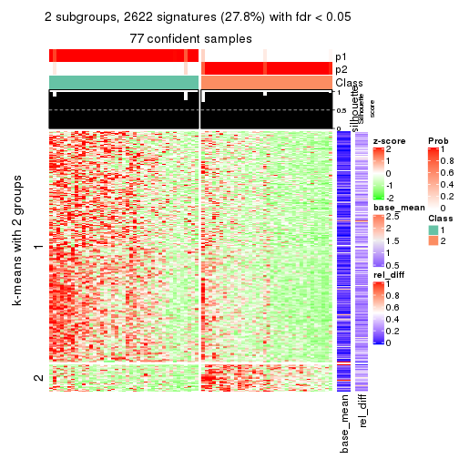</p>

</div>
<div id='tab-CV-NMF-get-signatures-2'>
<pre><code class="r">get_signatures(res, k = 3)
</code></pre>

<p></p>

</div>
<div id='tab-CV-NMF-get-signatures-3'>
<pre><code class="r">get_signatures(res, k = 4)
</code></pre>

<p></p>

</div>
<div id='tab-CV-NMF-get-signatures-4'>
<pre><code class="r">get_signatures(res, k = 5)
</code></pre>

<p></p>

</div>
<div id='tab-CV-NMF-get-signatures-5'>
<pre><code class="r">get_signatures(res, k = 6)
</code></pre>

<p></p>

</div>
</div>


Signature heatmaps where rows are not scaled:


<script>
$( function() {
	$( '#tabs-CV-NMF-get-signatures-no-scale' ).tabs();
} );
</script>
<div id='tabs-CV-NMF-get-signatures-no-scale'>
<ul>
<li><a href='#tab-CV-NMF-get-signatures-no-scale-1'>k = 2</a></li>
<li><a href='#tab-CV-NMF-get-signatures-no-scale-2'>k = 3</a></li>
<li><a href='#tab-CV-NMF-get-signatures-no-scale-3'>k = 4</a></li>
<li><a href='#tab-CV-NMF-get-signatures-no-scale-4'>k = 5</a></li>
<li><a href='#tab-CV-NMF-get-signatures-no-scale-5'>k = 6</a></li>
</ul>
<div id='tab-CV-NMF-get-signatures-no-scale-1'>
<pre><code class="r">get_signatures(res, k = 2, scale_rows = FALSE)
</code></pre>

<p></p>

</div>
<div id='tab-CV-NMF-get-signatures-no-scale-2'>
<pre><code class="r">get_signatures(res, k = 3, scale_rows = FALSE)
</code></pre>

<p></p>

</div>
<div id='tab-CV-NMF-get-signatures-no-scale-3'>
<pre><code class="r">get_signatures(res, k = 4, scale_rows = FALSE)
</code></pre>

<p></p>

</div>
<div id='tab-CV-NMF-get-signatures-no-scale-4'>
<pre><code class="r">get_signatures(res, k = 5, scale_rows = FALSE)
</code></pre>

<p></p>

</div>
<div id='tab-CV-NMF-get-signatures-no-scale-5'>
<pre><code class="r">get_signatures(res, k = 6, scale_rows = FALSE)
</code></pre>

<p></p>

</div>
</div>


Compare the overlap of signatures from different k:

```r
compare_signatures(res)
```


`get_signature()` returns a data frame invisibly. TO get the list of signatures, the function
call should be assigned to a variable explicitly. In following code, if `plot` argument is set
to `FALSE`, no heatmap is plotted while only the differential analysis is performed.

```r
# code only for demonstration
tb = get_signature(res, k = ..., plot = FALSE)
```

An example of the output of `tb` is:

```
#>   which_row         fdr    mean_1    mean_2 scaled_mean_1 scaled_mean_2 km
#> 1        38 0.042760348  8.373488  9.131774    -0.5533452     0.5164555  1
#> 2        40 0.018707592  7.106213  8.469186    -0.6173731     0.5762149  1
#> 3        55 0.019134737 10.221463 11.207825    -0.6159697     0.5749050  1
#> 4        59 0.006059896  5.921854  7.869574    -0.6899429     0.6439467  1
#> 5        60 0.018055526  8.928898 10.211722    -0.6204761     0.5791110  1
#> 6        98 0.009384629 15.714769 14.887706     0.6635654    -0.6193277  2
...
```

The columns in `tb` are:

1. `which_row`: row indices corresponding to the input matrix.
2. `fdr`: FDR for the differential test. 
3. `mean_x`: The mean value in group x.
4. `scaled_mean_x`: The mean value in group x after rows are scaled.
5. `km`: Row groups if k-means clustering is applied to rows.


UMAP plot which shows how samples are separated.


<script>
$( function() {
	$( '#tabs-CV-NMF-dimension-reduction' ).tabs();
} );
</script>
<div id='tabs-CV-NMF-dimension-reduction'>
<ul>
<li><a href='#tab-CV-NMF-dimension-reduction-1'>k = 2</a></li>
<li><a href='#tab-CV-NMF-dimension-reduction-2'>k = 3</a></li>
<li><a href='#tab-CV-NMF-dimension-reduction-3'>k = 4</a></li>
<li><a href='#tab-CV-NMF-dimension-reduction-4'>k = 5</a></li>
<li><a href='#tab-CV-NMF-dimension-reduction-5'>k = 6</a></li>
</ul>
<div id='tab-CV-NMF-dimension-reduction-1'>
<pre><code class="r">dimension_reduction(res, k = 2, method = &quot;UMAP&quot;)
</code></pre>

<p></p>

</div>
<div id='tab-CV-NMF-dimension-reduction-2'>
<pre><code class="r">dimension_reduction(res, k = 3, method = &quot;UMAP&quot;)
</code></pre>

<p></p>

</div>
<div id='tab-CV-NMF-dimension-reduction-3'>
<pre><code class="r">dimension_reduction(res, k = 4, method = &quot;UMAP&quot;)
</code></pre>

<p></p>

</div>
<div id='tab-CV-NMF-dimension-reduction-4'>
<pre><code class="r">dimension_reduction(res, k = 5, method = &quot;UMAP&quot;)
</code></pre>

<p></p>

</div>
<div id='tab-CV-NMF-dimension-reduction-5'>
<pre><code class="r">dimension_reduction(res, k = 6, method = &quot;UMAP&quot;)
</code></pre>

<p></p>

</div>
</div>


Following heatmap shows how subgroups are split when increasing `k`:

```r
collect_classes(res)
```


If matrix rows can be associated to genes, consider to use `GO_Enrichment(res,
...)` to perform function enrichment for the signature genes.


 

---------------------------------------------------


### MAD:hclust


The object with results only for a single top-value method and a single partition method 
can be extracted as:

```r
res = res_list["MAD", "hclust"]
# you can also extract it by
# res = res_list["MAD:hclust"]
```

A summary of `res` and all the functions that can be applied to it:

```r
res
```

```
#> A 'ConsensusPartition' object with k = 2, 3, 4, 5, 6.
#>   On a matrix with 9427 rows and 77 columns.
#>   Top rows (943, 1886, 2828, 3771, 4714) are extracted by 'MAD' method.
#>   Subgroups are detected by 'hclust' method.
#>   Performed in total 1250 partitions by row resampling.
#>   Best k for subgroups seems to be 2.
#> 
#> Following methods can be applied to this 'ConsensusPartition' object:
#>  [1] "cola_report"             "collect_classes"         "collect_plots"          
#>  [4] "collect_stats"           "colnames"                "compare_signatures"     
#>  [7] "consensus_heatmap"       "dimension_reduction"     "functional_enrichment"  
#> [10] "get_anno_col"            "get_anno"                "get_classes"            
#> [13] "get_consensus"           "get_matrix"              "get_membership"         
#> [16] "get_param"               "get_signatures"          "get_stats"              
#> [19] "is_best_k"               "is_stable_k"             "membership_heatmap"     
#> [22] "ncol"                    "nrow"                    "plot_ecdf"              
#> [25] "rownames"                "select_partition_number" "show"                   
#> [28] "suggest_best_k"          "test_to_known_factors"
```

`collect_plots()` function collects all the plots made from `res` for all `k` (number of partitions)
into one single page to provide an easy and fast comparison between different `k`.

```r
collect_plots(res)
```


The plots are:

- The first row: a plot of the ECDF (Empirical cumulative distribution
  function) curves of the consensus matrix for each `k` and the heatmap of
  predicted classes for each `k`.
- The second row: heatmaps of the consensus matrix for each `k`.
- The third row: heatmaps of the membership matrix for each `k`.
- The fouth row: heatmaps of the signatures for each `k`.

All the plots in panels can be made by individual functions and they are
plotted later in this section.

`select_partition_number()` produces several plots showing different
statistics for choosing "optimized" `k`. There are following statistics:

- ECDF curves of the consensus matrix for each `k`;
- 1-PAC. [The PAC
  score](https://en.wikipedia.org/wiki/Consensus_clustering#Over-interpretation_potential_of_consensus_clustering)
  measures the proportion of the ambiguous subgrouping.
- Mean silhouette score.
- Concordance. The mean probability of fiting the consensus class ids in all
  partitions.
- Area increased. Denote $A_k$ as the area under the ECDF curve for current
  `k`, the area increased is defined as $A_k - A_{k-1}$.
- Rand index. The percent of pairs of samples that are both in a same cluster
  or both are not in a same cluster in the partition of k and k-1.
- Jaccard index. The ratio of pairs of samples are both in a same cluster in
  the partition of k and k-1 and the pairs of samples are both in a same
  cluster in the partition k or k-1.

The detailed explanations of these statistics can be found in [the cola
vignette](http://bioconductor.org/packages/devel/bioc/vignettes/cola/inst/doc/cola.html#toc_13).

Generally speaking, lower PAC score, higher mean silhouette score or higher
concordance corresponds to better partition. Rand index and Jaccard index
measure how similar the current partition is compared to partition with `k-1`.
If they are too similar, we won't accept `k` is better than `k-1`.

```r
select_partition_number(res)
```


The numeric values for all these statistics can be obtained by `get_stats()`.

```r
get_stats(res)
```

```
#>   k 1-PAC mean_silhouette concordance area_increased  Rand Jaccard
#> 2 2 0.430           0.838       0.903         0.4452 0.531   0.531
#> 3 3 0.629           0.750       0.867         0.2875 0.933   0.875
#> 4 4 0.586           0.604       0.770         0.1197 0.942   0.878
#> 5 5 0.648           0.732       0.818         0.0765 0.808   0.563
#> 6 6 0.649           0.723       0.820         0.0489 0.963   0.866
```

`suggest_best_k()` suggests the best $k$ based on these statistics. The rules are as follows:

- All $k$ with Jaccard index larger than 0.95 are removed because the increase of
  the partition number does not provides enough extra information. If all $k$ are removed,
  the best $k$ is assigned by `NA`.
- For $k$ with 1-PAC larger than 0.9, the maximal $k$ is taken as the "best k". Other $k$ is called "optional k".
- If it does not fit the second rule. The $k$ with the highest vote of highest
  1-PAC, mean silhouette and concordance is taken as the "best k".

```r
suggest_best_k(res)
```

```
#> [1] 2
```


Following shows the table of the partitions (You need to click the **show/hide
code output** link to see it). The membership matrix (columns with name `p*`)
is inferred by
[`clue::cl_consensus()`](https://www.rdocumentation.org/link/cl_consensus?package=clue)
function with the `SE` method. Basically the value in the membership matrix
represents the probability to belong to a certain group. The finall class
label for an item is determined with the group with highest probability it
belongs to.

In `get_classes()` function, the entropy is calculated from the membership
matrix and the silhouette score is calculated from the consensus matrix.


<script>
$( function() {
	$( '#tabs-MAD-hclust-get-classes' ).tabs();
} );
</script>
<div id='tabs-MAD-hclust-get-classes'>
<ul>
<li><a href='#tab-MAD-hclust-get-classes-1'>k = 2</a></li>
<li><a href='#tab-MAD-hclust-get-classes-2'>k = 3</a></li>
<li><a href='#tab-MAD-hclust-get-classes-3'>k = 4</a></li>
<li><a href='#tab-MAD-hclust-get-classes-4'>k = 5</a></li>
<li><a href='#tab-MAD-hclust-get-classes-5'>k = 6</a></li>
</ul>

<div id='tab-MAD-hclust-get-classes-1'>
<p><a id='tab-MAD-hclust-get-classes-1-a' style='color:#0366d6' href='#'>show/hide code output</a></p>
<pre><code class="r">cbind(get_classes(res, k = 2), get_membership(res, k = 2))
</code></pre>

<pre><code>#&gt;           class entropy silhouette    p1    p2
#&gt; SRR944011     2  0.8144      0.735 0.252 0.748
#&gt; SRR944012     1  0.7883      0.796 0.764 0.236
#&gt; SRR944014     2  0.0000      0.889 0.000 1.000
#&gt; SRR944013     2  0.2043      0.881 0.032 0.968
#&gt; SRR944015     1  0.0000      0.869 1.000 0.000
#&gt; SRR944016     1  0.7219      0.837 0.800 0.200
#&gt; SRR944017     2  0.2043      0.881 0.032 0.968
#&gt; SRR944018     1  0.2778      0.872 0.952 0.048
#&gt; SRR944019     1  0.7299      0.834 0.796 0.204
#&gt; SRR944020     1  0.0000      0.869 1.000 0.000
#&gt; SRR944021     2  0.0000      0.889 0.000 1.000
#&gt; SRR944022     1  0.0000      0.869 1.000 0.000
#&gt; SRR944023     2  0.9087      0.621 0.324 0.676
#&gt; SRR944024     1  0.7950      0.791 0.760 0.240
#&gt; SRR944026     2  0.0000      0.889 0.000 1.000
#&gt; SRR944025     2  0.0000      0.889 0.000 1.000
#&gt; SRR944028     2  0.0000      0.889 0.000 1.000
#&gt; SRR944029     2  0.6438      0.812 0.164 0.836
#&gt; SRR944030     2  0.0000      0.889 0.000 1.000
#&gt; SRR944031     2  0.8713      0.678 0.292 0.708
#&gt; SRR944032     2  0.0376      0.888 0.004 0.996
#&gt; SRR944033     2  0.0000      0.889 0.000 1.000
#&gt; SRR944034     2  0.0000      0.889 0.000 1.000
#&gt; SRR944036     2  0.7528      0.768 0.216 0.784
#&gt; SRR944035     2  0.0000      0.889 0.000 1.000
#&gt; SRR944038     1  0.0000      0.869 1.000 0.000
#&gt; SRR944037     1  0.0376      0.870 0.996 0.004
#&gt; SRR944039     1  0.7299      0.834 0.796 0.204
#&gt; SRR944040     2  0.2236      0.879 0.036 0.964
#&gt; SRR944041     1  0.7299      0.834 0.796 0.204
#&gt; SRR944042     2  0.8386      0.715 0.268 0.732
#&gt; SRR944043     1  0.0672      0.871 0.992 0.008
#&gt; SRR944044     2  0.0000      0.889 0.000 1.000
#&gt; SRR944046     2  0.8443      0.709 0.272 0.728
#&gt; SRR944045     2  0.0376      0.888 0.004 0.996
#&gt; SRR944047     2  0.0000      0.889 0.000 1.000
#&gt; SRR944048     1  0.7950      0.791 0.760 0.240
#&gt; SRR944049     2  0.0000      0.889 0.000 1.000
#&gt; SRR944050     1  0.7219      0.837 0.800 0.200
#&gt; SRR944051     2  0.0000      0.889 0.000 1.000
#&gt; SRR944052     2  0.0000      0.889 0.000 1.000
#&gt; SRR944053     1  0.0000      0.869 1.000 0.000
#&gt; SRR944054     2  0.1184      0.885 0.016 0.984
#&gt; SRR944055     2  0.5737      0.832 0.136 0.864
#&gt; SRR944056     2  0.0000      0.889 0.000 1.000
#&gt; SRR944057     1  0.7219      0.837 0.800 0.200
#&gt; SRR944058     1  0.7219      0.837 0.800 0.200
#&gt; SRR944059     2  0.7950      0.749 0.240 0.760
#&gt; SRR944060     1  0.0000      0.869 1.000 0.000
#&gt; SRR944061     2  0.0000      0.889 0.000 1.000
#&gt; SRR944062     1  0.3431      0.871 0.936 0.064
#&gt; SRR944063     1  0.0000      0.869 1.000 0.000
#&gt; SRR944064     2  0.0000      0.889 0.000 1.000
#&gt; SRR944065     1  0.0938      0.871 0.988 0.012
#&gt; SRR944066     1  0.7139      0.839 0.804 0.196
#&gt; SRR944067     2  0.0000      0.889 0.000 1.000
#&gt; SRR944068     1  0.0000      0.869 1.000 0.000
#&gt; SRR944069     2  0.0000      0.889 0.000 1.000
#&gt; SRR944070     1  0.0000      0.869 1.000 0.000
#&gt; SRR944071     2  0.8207      0.730 0.256 0.744
#&gt; SRR944072     1  0.7219      0.837 0.800 0.200
#&gt; SRR944073     2  0.0000      0.889 0.000 1.000
#&gt; SRR944075     2  0.5519      0.837 0.128 0.872
#&gt; SRR944074     2  0.0000      0.889 0.000 1.000
#&gt; SRR944076     2  0.8608      0.692 0.284 0.716
#&gt; SRR944077     2  0.0000      0.889 0.000 1.000
#&gt; SRR944078     2  0.5408      0.839 0.124 0.876
#&gt; SRR944079     2  0.0000      0.889 0.000 1.000
#&gt; SRR944080     2  0.0000      0.889 0.000 1.000
#&gt; SRR944081     2  0.8909      0.596 0.308 0.692
#&gt; SRR944082     1  0.2948      0.872 0.948 0.052
#&gt; SRR944083     1  0.7219      0.837 0.800 0.200
#&gt; SRR944084     2  0.7602      0.766 0.220 0.780
#&gt; SRR944085     2  0.8713      0.679 0.292 0.708
#&gt; SRR944086     2  0.7745      0.757 0.228 0.772
#&gt; SRR944088     2  0.5629      0.835 0.132 0.868
#&gt; SRR944087     2  0.8267      0.725 0.260 0.740
</code></pre>

<script>
$('#tab-MAD-hclust-get-classes-1-a').parent().next().next().hide();
$('#tab-MAD-hclust-get-classes-1-a').click(function(){
  $('#tab-MAD-hclust-get-classes-1-a').parent().next().next().toggle();
  return(false);
});
</script>
</div>

<div id='tab-MAD-hclust-get-classes-2'>
<p><a id='tab-MAD-hclust-get-classes-2-a' style='color:#0366d6' href='#'>show/hide code output</a></p>
<pre><code class="r">cbind(get_classes(res, k = 3), get_membership(res, k = 3))
</code></pre>

<pre><code>#&gt;           class entropy silhouette    p1    p2    p3
#&gt; SRR944011     2  0.6832     0.5962 0.376 0.604 0.020
#&gt; SRR944012     1  0.1711     0.8779 0.960 0.032 0.008
#&gt; SRR944014     2  0.0000     0.8329 0.000 1.000 0.000
#&gt; SRR944013     2  0.2356     0.8226 0.072 0.928 0.000
#&gt; SRR944015     3  0.0000     0.8383 0.000 0.000 1.000
#&gt; SRR944016     1  0.0237     0.9072 0.996 0.000 0.004
#&gt; SRR944017     2  0.2356     0.8226 0.072 0.928 0.000
#&gt; SRR944018     1  0.6451    -0.0695 0.560 0.004 0.436
#&gt; SRR944019     1  0.0661     0.9046 0.988 0.004 0.008
#&gt; SRR944020     3  0.0000     0.8383 0.000 0.000 1.000
#&gt; SRR944021     2  0.0000     0.8329 0.000 1.000 0.000
#&gt; SRR944022     3  0.0000     0.8383 0.000 0.000 1.000
#&gt; SRR944023     2  0.7690     0.4810 0.416 0.536 0.048
#&gt; SRR944024     1  0.1411     0.8761 0.964 0.036 0.000
#&gt; SRR944026     2  0.0892     0.8322 0.020 0.980 0.000
#&gt; SRR944025     2  0.0000     0.8329 0.000 1.000 0.000
#&gt; SRR944028     2  0.0237     0.8329 0.004 0.996 0.000
#&gt; SRR944029     2  0.5497     0.6990 0.292 0.708 0.000
#&gt; SRR944030     2  0.0000     0.8329 0.000 1.000 0.000
#&gt; SRR944031     2  0.6973     0.5315 0.416 0.564 0.020
#&gt; SRR944032     2  0.2356     0.8226 0.072 0.928 0.000
#&gt; SRR944033     2  0.0000     0.8329 0.000 1.000 0.000
#&gt; SRR944034     2  0.0000     0.8329 0.000 1.000 0.000
#&gt; SRR944036     2  0.6008     0.6236 0.372 0.628 0.000
#&gt; SRR944035     2  0.0000     0.8329 0.000 1.000 0.000
#&gt; SRR944038     3  0.2448     0.8309 0.076 0.000 0.924
#&gt; SRR944037     3  0.5621     0.6295 0.308 0.000 0.692
#&gt; SRR944039     1  0.0661     0.9046 0.988 0.004 0.008
#&gt; SRR944040     2  0.2878     0.8127 0.096 0.904 0.000
#&gt; SRR944041     1  0.0829     0.9027 0.984 0.004 0.012
#&gt; SRR944042     2  0.7001     0.5745 0.388 0.588 0.024
#&gt; SRR944043     3  0.5810     0.5918 0.336 0.000 0.664
#&gt; SRR944044     2  0.0000     0.8329 0.000 1.000 0.000
#&gt; SRR944046     2  0.6910     0.5669 0.396 0.584 0.020
#&gt; SRR944045     2  0.0747     0.8329 0.016 0.984 0.000
#&gt; SRR944047     2  0.0000     0.8329 0.000 1.000 0.000
#&gt; SRR944048     1  0.1411     0.8761 0.964 0.036 0.000
#&gt; SRR944049     2  0.0000     0.8329 0.000 1.000 0.000
#&gt; SRR944050     1  0.0237     0.9072 0.996 0.000 0.004
#&gt; SRR944051     2  0.1163     0.8315 0.028 0.972 0.000
#&gt; SRR944052     2  0.0000     0.8329 0.000 1.000 0.000
#&gt; SRR944053     3  0.0000     0.8383 0.000 0.000 1.000
#&gt; SRR944054     2  0.1964     0.8267 0.056 0.944 0.000
#&gt; SRR944055     2  0.4974     0.7395 0.236 0.764 0.000
#&gt; SRR944056     2  0.0000     0.8329 0.000 1.000 0.000
#&gt; SRR944057     1  0.0237     0.9072 0.996 0.000 0.004
#&gt; SRR944058     1  0.0237     0.9072 0.996 0.000 0.004
#&gt; SRR944059     2  0.6566     0.6322 0.348 0.636 0.016
#&gt; SRR944060     3  0.2066     0.8359 0.060 0.000 0.940
#&gt; SRR944061     2  0.0000     0.8329 0.000 1.000 0.000
#&gt; SRR944062     1  0.6126     0.1543 0.600 0.000 0.400
#&gt; SRR944063     3  0.1163     0.8373 0.028 0.000 0.972
#&gt; SRR944064     2  0.1753     0.8268 0.048 0.952 0.000
#&gt; SRR944065     3  0.5926     0.5561 0.356 0.000 0.644
#&gt; SRR944066     1  0.0424     0.9048 0.992 0.000 0.008
#&gt; SRR944067     2  0.0000     0.8329 0.000 1.000 0.000
#&gt; SRR944068     3  0.0000     0.8383 0.000 0.000 1.000
#&gt; SRR944069     2  0.0000     0.8329 0.000 1.000 0.000
#&gt; SRR944070     3  0.2448     0.8309 0.076 0.000 0.924
#&gt; SRR944071     2  0.6849     0.5905 0.380 0.600 0.020
#&gt; SRR944072     1  0.0237     0.9072 0.996 0.000 0.004
#&gt; SRR944073     2  0.0000     0.8329 0.000 1.000 0.000
#&gt; SRR944075     2  0.4842     0.7476 0.224 0.776 0.000
#&gt; SRR944074     2  0.0892     0.8322 0.020 0.980 0.000
#&gt; SRR944076     2  0.7056     0.5490 0.404 0.572 0.024
#&gt; SRR944077     2  0.0000     0.8329 0.000 1.000 0.000
#&gt; SRR944078     2  0.4654     0.7574 0.208 0.792 0.000
#&gt; SRR944079     2  0.0000     0.8329 0.000 1.000 0.000
#&gt; SRR944080     2  0.0000     0.8329 0.000 1.000 0.000
#&gt; SRR944081     2  0.6509     0.3662 0.472 0.524 0.004
#&gt; SRR944082     3  0.6309     0.1652 0.500 0.000 0.500
#&gt; SRR944083     1  0.0237     0.9072 0.996 0.000 0.004
#&gt; SRR944084     2  0.6339     0.6310 0.360 0.632 0.008
#&gt; SRR944085     2  0.7181     0.5363 0.408 0.564 0.028
#&gt; SRR944086     2  0.6045     0.6153 0.380 0.620 0.000
#&gt; SRR944088     2  0.5138     0.7314 0.252 0.748 0.000
#&gt; SRR944087     2  0.6865     0.5843 0.384 0.596 0.020
</code></pre>

<script>
$('#tab-MAD-hclust-get-classes-2-a').parent().next().next().hide();
$('#tab-MAD-hclust-get-classes-2-a').click(function(){
  $('#tab-MAD-hclust-get-classes-2-a').parent().next().next().toggle();
  return(false);
});
</script>
</div>

<div id='tab-MAD-hclust-get-classes-3'>
<p><a id='tab-MAD-hclust-get-classes-3-a' style='color:#0366d6' href='#'>show/hide code output</a></p>
<pre><code class="r">cbind(get_classes(res, k = 4), get_membership(res, k = 4))
</code></pre>

<pre><code>#&gt;           class entropy silhouette    p1    p2    p3    p4
#&gt; SRR944011     2  0.7502     0.4210 0.156 0.436 0.404 0.004
#&gt; SRR944012     1  0.4452     0.6173 0.732 0.000 0.260 0.008
#&gt; SRR944014     2  0.0000     0.7581 0.000 1.000 0.000 0.000
#&gt; SRR944013     2  0.3870     0.7104 0.004 0.788 0.208 0.000
#&gt; SRR944015     4  0.2011     0.9334 0.000 0.000 0.080 0.920
#&gt; SRR944016     1  0.0336     0.8321 0.992 0.000 0.008 0.000
#&gt; SRR944017     2  0.3870     0.7104 0.004 0.788 0.208 0.000
#&gt; SRR944018     1  0.7442     0.1577 0.496 0.000 0.304 0.200
#&gt; SRR944019     1  0.1970     0.8141 0.932 0.000 0.060 0.008
#&gt; SRR944020     4  0.0000     0.9601 0.000 0.000 0.000 1.000
#&gt; SRR944021     2  0.0000     0.7581 0.000 1.000 0.000 0.000
#&gt; SRR944022     4  0.0000     0.9601 0.000 0.000 0.000 1.000
#&gt; SRR944023     3  0.7965    -0.4137 0.176 0.400 0.408 0.016
#&gt; SRR944024     1  0.2256     0.8022 0.924 0.020 0.056 0.000
#&gt; SRR944026     2  0.1211     0.7549 0.000 0.960 0.040 0.000
#&gt; SRR944025     2  0.0000     0.7581 0.000 1.000 0.000 0.000
#&gt; SRR944028     2  0.0188     0.7578 0.000 0.996 0.004 0.000
#&gt; SRR944029     2  0.6725     0.5510 0.104 0.548 0.348 0.000
#&gt; SRR944030     2  0.0000     0.7581 0.000 1.000 0.000 0.000
#&gt; SRR944031     3  0.7562    -0.4545 0.164 0.412 0.420 0.004
#&gt; SRR944032     2  0.4079     0.7177 0.020 0.800 0.180 0.000
#&gt; SRR944033     2  0.0000     0.7581 0.000 1.000 0.000 0.000
#&gt; SRR944034     2  0.0000     0.7581 0.000 1.000 0.000 0.000
#&gt; SRR944036     2  0.7349     0.4570 0.160 0.456 0.384 0.000
#&gt; SRR944035     2  0.0000     0.7581 0.000 1.000 0.000 0.000
#&gt; SRR944038     3  0.5643    -0.0644 0.024 0.000 0.548 0.428
#&gt; SRR944037     3  0.7651     0.1875 0.248 0.000 0.464 0.288
#&gt; SRR944039     1  0.1970     0.8141 0.932 0.000 0.060 0.008
#&gt; SRR944040     2  0.4012     0.7140 0.016 0.800 0.184 0.000
#&gt; SRR944041     1  0.2928     0.7781 0.880 0.000 0.108 0.012
#&gt; SRR944042     2  0.7679     0.4043 0.164 0.432 0.396 0.008
#&gt; SRR944043     3  0.7421     0.2421 0.268 0.000 0.512 0.220
#&gt; SRR944044     2  0.0000     0.7581 0.000 1.000 0.000 0.000
#&gt; SRR944046     2  0.7559     0.3988 0.164 0.428 0.404 0.004
#&gt; SRR944045     2  0.0921     0.7568 0.000 0.972 0.028 0.000
#&gt; SRR944047     2  0.0000     0.7581 0.000 1.000 0.000 0.000
#&gt; SRR944048     1  0.2256     0.8022 0.924 0.020 0.056 0.000
#&gt; SRR944049     2  0.0000     0.7581 0.000 1.000 0.000 0.000
#&gt; SRR944050     1  0.0336     0.8321 0.992 0.000 0.008 0.000
#&gt; SRR944051     2  0.2973     0.7324 0.000 0.856 0.144 0.000
#&gt; SRR944052     2  0.0000     0.7581 0.000 1.000 0.000 0.000
#&gt; SRR944053     4  0.0000     0.9601 0.000 0.000 0.000 1.000
#&gt; SRR944054     2  0.3626     0.7195 0.004 0.812 0.184 0.000
#&gt; SRR944055     2  0.6079     0.6133 0.072 0.628 0.300 0.000
#&gt; SRR944056     2  0.0000     0.7581 0.000 1.000 0.000 0.000
#&gt; SRR944057     1  0.0336     0.8321 0.992 0.000 0.008 0.000
#&gt; SRR944058     1  0.0188     0.8308 0.996 0.000 0.004 0.000
#&gt; SRR944059     2  0.7358     0.4614 0.140 0.468 0.388 0.004
#&gt; SRR944060     3  0.5244    -0.1040 0.008 0.000 0.556 0.436
#&gt; SRR944061     2  0.0000     0.7581 0.000 1.000 0.000 0.000
#&gt; SRR944062     1  0.5526     0.2896 0.564 0.000 0.416 0.020
#&gt; SRR944063     4  0.1004     0.9390 0.024 0.000 0.004 0.972
#&gt; SRR944064     2  0.1975     0.7466 0.016 0.936 0.048 0.000
#&gt; SRR944065     3  0.7407     0.2258 0.288 0.000 0.508 0.204
#&gt; SRR944066     1  0.0469     0.8306 0.988 0.000 0.012 0.000
#&gt; SRR944067     2  0.0000     0.7581 0.000 1.000 0.000 0.000
#&gt; SRR944068     4  0.2011     0.9334 0.000 0.000 0.080 0.920
#&gt; SRR944069     2  0.0000     0.7581 0.000 1.000 0.000 0.000
#&gt; SRR944070     3  0.5643    -0.0644 0.024 0.000 0.548 0.428
#&gt; SRR944071     2  0.7529     0.4190 0.160 0.436 0.400 0.004
#&gt; SRR944072     1  0.0188     0.8308 0.996 0.000 0.004 0.000
#&gt; SRR944073     2  0.0000     0.7581 0.000 1.000 0.000 0.000
#&gt; SRR944075     2  0.5972     0.6225 0.068 0.640 0.292 0.000
#&gt; SRR944074     2  0.1211     0.7549 0.000 0.960 0.040 0.000
#&gt; SRR944076     2  0.7613     0.3823 0.172 0.420 0.404 0.004
#&gt; SRR944077     2  0.0000     0.7581 0.000 1.000 0.000 0.000
#&gt; SRR944078     2  0.5697     0.6341 0.052 0.656 0.292 0.000
#&gt; SRR944079     2  0.0000     0.7581 0.000 1.000 0.000 0.000
#&gt; SRR944080     2  0.0000     0.7581 0.000 1.000 0.000 0.000
#&gt; SRR944081     2  0.8020     0.2404 0.340 0.380 0.276 0.004
#&gt; SRR944082     1  0.7182     0.0161 0.452 0.000 0.412 0.136
#&gt; SRR944083     1  0.0336     0.8321 0.992 0.000 0.008 0.000
#&gt; SRR944084     2  0.7179     0.4583 0.136 0.456 0.408 0.000
#&gt; SRR944085     2  0.7638     0.3717 0.176 0.416 0.404 0.004
#&gt; SRR944086     2  0.7431     0.4478 0.172 0.448 0.380 0.000
#&gt; SRR944088     2  0.6351     0.5874 0.080 0.588 0.332 0.000
#&gt; SRR944087     2  0.7504     0.4116 0.156 0.432 0.408 0.004
</code></pre>

<script>
$('#tab-MAD-hclust-get-classes-3-a').parent().next().next().hide();
$('#tab-MAD-hclust-get-classes-3-a').click(function(){
  $('#tab-MAD-hclust-get-classes-3-a').parent().next().next().toggle();
  return(false);
});
</script>
</div>

<div id='tab-MAD-hclust-get-classes-4'>
<p><a id='tab-MAD-hclust-get-classes-4-a' style='color:#0366d6' href='#'>show/hide code output</a></p>
<pre><code class="r">cbind(get_classes(res, k = 5), get_membership(res, k = 5))
</code></pre>

<pre><code>#&gt;           class entropy silhouette    p1    p2    p3    p4    p5
#&gt; SRR944011     3  0.5299      0.876 0.028 0.280 0.656 0.000 0.036
#&gt; SRR944012     1  0.5565      0.414 0.552 0.000 0.384 0.008 0.056
#&gt; SRR944014     2  0.0000      0.872 0.000 1.000 0.000 0.000 0.000
#&gt; SRR944013     2  0.3883      0.520 0.000 0.744 0.244 0.004 0.008
#&gt; SRR944015     4  0.4852      0.764 0.000 0.000 0.100 0.716 0.184
#&gt; SRR944016     1  0.0609      0.837 0.980 0.000 0.020 0.000 0.000
#&gt; SRR944017     2  0.3883      0.520 0.000 0.744 0.244 0.004 0.008
#&gt; SRR944018     5  0.5707      0.393 0.388 0.000 0.052 0.016 0.544
#&gt; SRR944019     1  0.3187      0.790 0.860 0.000 0.096 0.008 0.036
#&gt; SRR944020     4  0.0324      0.886 0.000 0.000 0.004 0.992 0.004
#&gt; SRR944021     2  0.0000      0.872 0.000 1.000 0.000 0.000 0.000
#&gt; SRR944022     4  0.0162      0.887 0.000 0.000 0.000 0.996 0.004
#&gt; SRR944023     3  0.6722      0.828 0.048 0.276 0.556 0.000 0.120
#&gt; SRR944024     1  0.2304      0.800 0.892 0.000 0.100 0.000 0.008
#&gt; SRR944026     2  0.1430      0.836 0.000 0.944 0.052 0.000 0.004
#&gt; SRR944025     2  0.0000      0.872 0.000 1.000 0.000 0.000 0.000
#&gt; SRR944028     2  0.0162      0.870 0.000 0.996 0.004 0.000 0.000
#&gt; SRR944029     3  0.5210      0.733 0.020 0.388 0.576 0.004 0.012
#&gt; SRR944030     2  0.0000      0.872 0.000 1.000 0.000 0.000 0.000
#&gt; SRR944031     3  0.5963      0.866 0.032 0.276 0.616 0.000 0.076
#&gt; SRR944032     2  0.3851      0.598 0.000 0.768 0.212 0.004 0.016
#&gt; SRR944033     2  0.0000      0.872 0.000 1.000 0.000 0.000 0.000
#&gt; SRR944034     2  0.0000      0.872 0.000 1.000 0.000 0.000 0.000
#&gt; SRR944036     3  0.4832      0.858 0.032 0.292 0.668 0.000 0.008
#&gt; SRR944035     2  0.0000      0.872 0.000 1.000 0.000 0.000 0.000
#&gt; SRR944038     5  0.3051      0.618 0.000 0.000 0.060 0.076 0.864
#&gt; SRR944037     5  0.5840      0.657 0.136 0.000 0.044 0.136 0.684
#&gt; SRR944039     1  0.3187      0.790 0.860 0.000 0.096 0.008 0.036
#&gt; SRR944040     2  0.3932      0.211 0.000 0.672 0.328 0.000 0.000
#&gt; SRR944041     1  0.4160      0.718 0.780 0.000 0.168 0.008 0.044
#&gt; SRR944042     3  0.5622      0.875 0.032 0.276 0.640 0.000 0.052
#&gt; SRR944043     5  0.4000      0.713 0.172 0.000 0.012 0.028 0.788
#&gt; SRR944044     2  0.0324      0.869 0.000 0.992 0.004 0.000 0.004
#&gt; SRR944046     3  0.5622      0.874 0.032 0.276 0.640 0.000 0.052
#&gt; SRR944045     2  0.0880      0.852 0.000 0.968 0.032 0.000 0.000
#&gt; SRR944047     2  0.0000      0.872 0.000 1.000 0.000 0.000 0.000
#&gt; SRR944048     1  0.2304      0.800 0.892 0.000 0.100 0.000 0.008
#&gt; SRR944049     2  0.0000      0.872 0.000 1.000 0.000 0.000 0.000
#&gt; SRR944050     1  0.0609      0.837 0.980 0.000 0.020 0.000 0.000
#&gt; SRR944051     2  0.3006      0.697 0.000 0.836 0.156 0.004 0.004
#&gt; SRR944052     2  0.0000      0.872 0.000 1.000 0.000 0.000 0.000
#&gt; SRR944053     4  0.0162      0.887 0.000 0.000 0.000 0.996 0.004
#&gt; SRR944054     2  0.3643      0.596 0.000 0.776 0.212 0.004 0.008
#&gt; SRR944055     3  0.4561      0.525 0.008 0.488 0.504 0.000 0.000
#&gt; SRR944056     2  0.0000      0.872 0.000 1.000 0.000 0.000 0.000
#&gt; SRR944057     1  0.0609      0.837 0.980 0.000 0.020 0.000 0.000
#&gt; SRR944058     1  0.1753      0.828 0.936 0.000 0.032 0.000 0.032
#&gt; SRR944059     3  0.5321      0.859 0.028 0.316 0.628 0.000 0.028
#&gt; SRR944060     5  0.3425      0.595 0.004 0.000 0.044 0.112 0.840
#&gt; SRR944061     2  0.0000      0.872 0.000 1.000 0.000 0.000 0.000
#&gt; SRR944062     1  0.6202     -0.164 0.496 0.000 0.148 0.000 0.356
#&gt; SRR944063     4  0.1074      0.876 0.004 0.000 0.016 0.968 0.012
#&gt; SRR944064     2  0.1894      0.812 0.000 0.920 0.072 0.000 0.008
#&gt; SRR944065     5  0.4351      0.712 0.164 0.000 0.040 0.020 0.776
#&gt; SRR944066     1  0.0510      0.834 0.984 0.000 0.016 0.000 0.000
#&gt; SRR944067     2  0.0000      0.872 0.000 1.000 0.000 0.000 0.000
#&gt; SRR944068     4  0.4852      0.764 0.000 0.000 0.100 0.716 0.184
#&gt; SRR944069     2  0.0000      0.872 0.000 1.000 0.000 0.000 0.000
#&gt; SRR944070     5  0.3051      0.618 0.000 0.000 0.060 0.076 0.864
#&gt; SRR944071     3  0.5302      0.876 0.032 0.280 0.656 0.000 0.032
#&gt; SRR944072     1  0.1668      0.828 0.940 0.000 0.028 0.000 0.032
#&gt; SRR944073     2  0.0000      0.872 0.000 1.000 0.000 0.000 0.000
#&gt; SRR944075     2  0.4560     -0.504 0.008 0.508 0.484 0.000 0.000
#&gt; SRR944074     2  0.1430      0.836 0.000 0.944 0.052 0.000 0.004
#&gt; SRR944076     3  0.5873      0.871 0.036 0.276 0.624 0.000 0.064
#&gt; SRR944077     2  0.0000      0.872 0.000 1.000 0.000 0.000 0.000
#&gt; SRR944078     2  0.4300     -0.448 0.000 0.524 0.476 0.000 0.000
#&gt; SRR944079     2  0.0000      0.872 0.000 1.000 0.000 0.000 0.000
#&gt; SRR944080     2  0.0000      0.872 0.000 1.000 0.000 0.000 0.000
#&gt; SRR944081     3  0.7263      0.477 0.300 0.308 0.376 0.008 0.008
#&gt; SRR944082     5  0.5812      0.434 0.372 0.000 0.100 0.000 0.528
#&gt; SRR944083     1  0.0609      0.837 0.980 0.000 0.020 0.000 0.000
#&gt; SRR944084     3  0.4715      0.861 0.020 0.296 0.672 0.000 0.012
#&gt; SRR944085     3  0.5983      0.867 0.036 0.276 0.616 0.000 0.072
#&gt; SRR944086     3  0.5587      0.836 0.056 0.292 0.632 0.004 0.016
#&gt; SRR944088     3  0.5023      0.630 0.008 0.436 0.540 0.004 0.012
#&gt; SRR944087     3  0.5425      0.876 0.032 0.276 0.652 0.000 0.040
</code></pre>

<script>
$('#tab-MAD-hclust-get-classes-4-a').parent().next().next().hide();
$('#tab-MAD-hclust-get-classes-4-a').click(function(){
  $('#tab-MAD-hclust-get-classes-4-a').parent().next().next().toggle();
  return(false);
});
</script>
</div>

<div id='tab-MAD-hclust-get-classes-5'>
<p><a id='tab-MAD-hclust-get-classes-5-a' style='color:#0366d6' href='#'>show/hide code output</a></p>
<pre><code class="r">cbind(get_classes(res, k = 6), get_membership(res, k = 6))
</code></pre>

<pre><code>#&gt;           class entropy silhouette    p1    p2    p3    p4    p5    p6
#&gt; SRR944011     3  0.3351     0.8379 0.004 0.168 0.800 0.000 0.000 0.028
#&gt; SRR944012     1  0.7483    -0.1034 0.352 0.000 0.264 0.000 0.240 0.144
#&gt; SRR944014     2  0.0000     0.9185 0.000 1.000 0.000 0.000 0.000 0.000
#&gt; SRR944013     2  0.3900     0.5869 0.000 0.728 0.232 0.000 0.040 0.000
#&gt; SRR944015     4  0.0146     0.6259 0.000 0.000 0.000 0.996 0.000 0.004
#&gt; SRR944016     1  0.0508     0.7715 0.984 0.000 0.012 0.000 0.004 0.000
#&gt; SRR944017     2  0.3900     0.5869 0.000 0.728 0.232 0.000 0.040 0.000
#&gt; SRR944018     6  0.4370     0.1856 0.268 0.000 0.048 0.000 0.004 0.680
#&gt; SRR944019     1  0.3789     0.6711 0.808 0.000 0.040 0.000 0.044 0.108
#&gt; SRR944020     4  0.4301     0.8211 0.000 0.000 0.004 0.580 0.400 0.016
#&gt; SRR944021     2  0.0000     0.9185 0.000 1.000 0.000 0.000 0.000 0.000
#&gt; SRR944022     4  0.4176     0.8216 0.000 0.000 0.000 0.580 0.404 0.016
#&gt; SRR944023     3  0.4946     0.7923 0.016 0.168 0.688 0.000 0.000 0.128
#&gt; SRR944024     1  0.2328     0.7185 0.892 0.000 0.052 0.000 0.056 0.000
#&gt; SRR944026     2  0.1644     0.8772 0.000 0.932 0.040 0.000 0.028 0.000
#&gt; SRR944025     2  0.0000     0.9185 0.000 1.000 0.000 0.000 0.000 0.000
#&gt; SRR944028     2  0.0146     0.9164 0.000 0.996 0.000 0.000 0.004 0.000
#&gt; SRR944029     3  0.4983     0.7522 0.004 0.268 0.644 0.000 0.076 0.008
#&gt; SRR944030     2  0.0000     0.9185 0.000 1.000 0.000 0.000 0.000 0.000
#&gt; SRR944031     3  0.4185     0.8275 0.012 0.168 0.752 0.000 0.000 0.068
#&gt; SRR944032     2  0.3927     0.6654 0.000 0.756 0.172 0.000 0.072 0.000
#&gt; SRR944033     2  0.0000     0.9185 0.000 1.000 0.000 0.000 0.000 0.000
#&gt; SRR944034     2  0.0000     0.9185 0.000 1.000 0.000 0.000 0.000 0.000
#&gt; SRR944036     3  0.4371     0.8173 0.016 0.180 0.736 0.000 0.068 0.000
#&gt; SRR944035     2  0.0000     0.9185 0.000 1.000 0.000 0.000 0.000 0.000
#&gt; SRR944038     6  0.3748     0.5994 0.000 0.000 0.012 0.300 0.000 0.688
#&gt; SRR944037     6  0.4077     0.5057 0.040 0.000 0.012 0.092 0.052 0.804
#&gt; SRR944039     1  0.3789     0.6711 0.808 0.000 0.040 0.000 0.044 0.108
#&gt; SRR944040     2  0.3852     0.0674 0.000 0.612 0.384 0.000 0.004 0.000
#&gt; SRR944041     1  0.5411     0.5072 0.684 0.000 0.108 0.000 0.092 0.116
#&gt; SRR944042     3  0.3834     0.8365 0.012 0.168 0.776 0.000 0.000 0.044
#&gt; SRR944043     6  0.2103     0.5703 0.056 0.000 0.020 0.012 0.000 0.912
#&gt; SRR944044     2  0.0405     0.9131 0.000 0.988 0.004 0.000 0.008 0.000
#&gt; SRR944046     3  0.3834     0.8351 0.012 0.168 0.776 0.000 0.000 0.044
#&gt; SRR944045     2  0.0790     0.8992 0.000 0.968 0.032 0.000 0.000 0.000
#&gt; SRR944047     2  0.0000     0.9185 0.000 1.000 0.000 0.000 0.000 0.000
#&gt; SRR944048     1  0.2328     0.7185 0.892 0.000 0.052 0.000 0.056 0.000
#&gt; SRR944049     2  0.0000     0.9185 0.000 1.000 0.000 0.000 0.000 0.000
#&gt; SRR944050     1  0.0363     0.7724 0.988 0.000 0.012 0.000 0.000 0.000
#&gt; SRR944051     2  0.3101     0.7431 0.000 0.820 0.148 0.000 0.032 0.000
#&gt; SRR944052     2  0.0000     0.9185 0.000 1.000 0.000 0.000 0.000 0.000
#&gt; SRR944053     4  0.4176     0.8216 0.000 0.000 0.000 0.580 0.404 0.016
#&gt; SRR944054     2  0.3679     0.6534 0.000 0.760 0.200 0.000 0.040 0.000
#&gt; SRR944055     3  0.3923     0.5796 0.000 0.416 0.580 0.000 0.004 0.000
#&gt; SRR944056     2  0.0000     0.9185 0.000 1.000 0.000 0.000 0.000 0.000
#&gt; SRR944057     1  0.0363     0.7724 0.988 0.000 0.012 0.000 0.000 0.000
#&gt; SRR944058     1  0.3154     0.7030 0.848 0.000 0.012 0.000 0.068 0.072
#&gt; SRR944059     3  0.3799     0.8366 0.012 0.208 0.756 0.000 0.000 0.024
#&gt; SRR944060     6  0.3725     0.5844 0.000 0.000 0.008 0.316 0.000 0.676
#&gt; SRR944061     2  0.0000     0.9185 0.000 1.000 0.000 0.000 0.000 0.000
#&gt; SRR944062     5  0.7409     0.0000 0.308 0.000 0.116 0.000 0.312 0.264
#&gt; SRR944063     4  0.4543     0.8098 0.000 0.000 0.000 0.576 0.384 0.040
#&gt; SRR944064     2  0.1863     0.8632 0.000 0.920 0.036 0.000 0.044 0.000
#&gt; SRR944065     6  0.1932     0.5677 0.040 0.000 0.020 0.000 0.016 0.924
#&gt; SRR944066     1  0.0767     0.7685 0.976 0.000 0.012 0.000 0.008 0.004
#&gt; SRR944067     2  0.0000     0.9185 0.000 1.000 0.000 0.000 0.000 0.000
#&gt; SRR944068     4  0.0146     0.6259 0.000 0.000 0.000 0.996 0.000 0.004
#&gt; SRR944069     2  0.0000     0.9185 0.000 1.000 0.000 0.000 0.000 0.000
#&gt; SRR944070     6  0.3748     0.5994 0.000 0.000 0.012 0.300 0.000 0.688
#&gt; SRR944071     3  0.3516     0.8387 0.012 0.172 0.792 0.000 0.000 0.024
#&gt; SRR944072     1  0.2883     0.7105 0.864 0.000 0.008 0.000 0.060 0.068
#&gt; SRR944073     2  0.0000     0.9185 0.000 1.000 0.000 0.000 0.000 0.000
#&gt; SRR944075     3  0.3961     0.5247 0.000 0.440 0.556 0.000 0.004 0.000
#&gt; SRR944074     2  0.1644     0.8772 0.000 0.932 0.040 0.000 0.028 0.000
#&gt; SRR944076     3  0.4131     0.8310 0.012 0.168 0.756 0.000 0.000 0.064
#&gt; SRR944077     2  0.0000     0.9185 0.000 1.000 0.000 0.000 0.000 0.000
#&gt; SRR944078     3  0.3982     0.4716 0.000 0.460 0.536 0.000 0.004 0.000
#&gt; SRR944079     2  0.0000     0.9185 0.000 1.000 0.000 0.000 0.000 0.000
#&gt; SRR944080     2  0.0000     0.9185 0.000 1.000 0.000 0.000 0.000 0.000
#&gt; SRR944081     3  0.7633     0.3570 0.280 0.248 0.364 0.000 0.084 0.024
#&gt; SRR944082     6  0.6062    -0.1944 0.236 0.000 0.104 0.000 0.076 0.584
#&gt; SRR944083     1  0.0622     0.7699 0.980 0.000 0.012 0.000 0.008 0.000
#&gt; SRR944084     3  0.3121     0.8347 0.000 0.180 0.804 0.000 0.012 0.004
#&gt; SRR944085     3  0.4238     0.8279 0.012 0.168 0.748 0.000 0.000 0.072
#&gt; SRR944086     3  0.5143     0.7854 0.032 0.180 0.680 0.000 0.108 0.000
#&gt; SRR944088     3  0.5185     0.6901 0.004 0.316 0.596 0.000 0.076 0.008
#&gt; SRR944087     3  0.3631     0.8375 0.012 0.168 0.788 0.000 0.000 0.032
</code></pre>

<script>
$('#tab-MAD-hclust-get-classes-5-a').parent().next().next().hide();
$('#tab-MAD-hclust-get-classes-5-a').click(function(){
  $('#tab-MAD-hclust-get-classes-5-a').parent().next().next().toggle();
  return(false);
});
</script>
</div>
</div>

Heatmaps for the consensus matrix. It visualizes the probability of two
samples to be in a same group.


<script>
$( function() {
	$( '#tabs-MAD-hclust-consensus-heatmap' ).tabs();
} );
</script>
<div id='tabs-MAD-hclust-consensus-heatmap'>
<ul>
<li><a href='#tab-MAD-hclust-consensus-heatmap-1'>k = 2</a></li>
<li><a href='#tab-MAD-hclust-consensus-heatmap-2'>k = 3</a></li>
<li><a href='#tab-MAD-hclust-consensus-heatmap-3'>k = 4</a></li>
<li><a href='#tab-MAD-hclust-consensus-heatmap-4'>k = 5</a></li>
<li><a href='#tab-MAD-hclust-consensus-heatmap-5'>k = 6</a></li>
</ul>
<div id='tab-MAD-hclust-consensus-heatmap-1'>
<pre><code class="r">consensus_heatmap(res, k = 2)
</code></pre>

<p></p>

</div>
<div id='tab-MAD-hclust-consensus-heatmap-2'>
<pre><code class="r">consensus_heatmap(res, k = 3)
</code></pre>

<p></p>

</div>
<div id='tab-MAD-hclust-consensus-heatmap-3'>
<pre><code class="r">consensus_heatmap(res, k = 4)
</code></pre>

<p>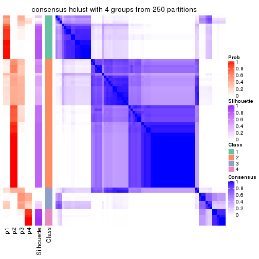</p>

</div>
<div id='tab-MAD-hclust-consensus-heatmap-4'>
<pre><code class="r">consensus_heatmap(res, k = 5)
</code></pre>

<p></p>

</div>
<div id='tab-MAD-hclust-consensus-heatmap-5'>
<pre><code class="r">consensus_heatmap(res, k = 6)
</code></pre>

<p></p>

</div>
</div>

Heatmaps for the membership of samples in all partitions to see how consistent they are:


<script>
$( function() {
	$( '#tabs-MAD-hclust-membership-heatmap' ).tabs();
} );
</script>
<div id='tabs-MAD-hclust-membership-heatmap'>
<ul>
<li><a href='#tab-MAD-hclust-membership-heatmap-1'>k = 2</a></li>
<li><a href='#tab-MAD-hclust-membership-heatmap-2'>k = 3</a></li>
<li><a href='#tab-MAD-hclust-membership-heatmap-3'>k = 4</a></li>
<li><a href='#tab-MAD-hclust-membership-heatmap-4'>k = 5</a></li>
<li><a href='#tab-MAD-hclust-membership-heatmap-5'>k = 6</a></li>
</ul>
<div id='tab-MAD-hclust-membership-heatmap-1'>
<pre><code class="r">membership_heatmap(res, k = 2)
</code></pre>

<p></p>

</div>
<div id='tab-MAD-hclust-membership-heatmap-2'>
<pre><code class="r">membership_heatmap(res, k = 3)
</code></pre>

<p></p>

</div>
<div id='tab-MAD-hclust-membership-heatmap-3'>
<pre><code class="r">membership_heatmap(res, k = 4)
</code></pre>

<p></p>

</div>
<div id='tab-MAD-hclust-membership-heatmap-4'>
<pre><code class="r">membership_heatmap(res, k = 5)
</code></pre>

<p></p>

</div>
<div id='tab-MAD-hclust-membership-heatmap-5'>
<pre><code class="r">membership_heatmap(res, k = 6)
</code></pre>

<p>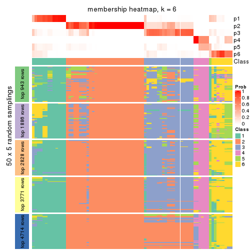</p>

</div>
</div>

As soon as we have had the classes for columns, we can look for signatures
which are significantly different between classes which can be candidate marks
for certain classes. Following are the heatmaps for signatures.


Signature heatmaps where rows are scaled:


<script>
$( function() {
	$( '#tabs-MAD-hclust-get-signatures' ).tabs();
} );
</script>
<div id='tabs-MAD-hclust-get-signatures'>
<ul>
<li><a href='#tab-MAD-hclust-get-signatures-1'>k = 2</a></li>
<li><a href='#tab-MAD-hclust-get-signatures-2'>k = 3</a></li>
<li><a href='#tab-MAD-hclust-get-signatures-3'>k = 4</a></li>
<li><a href='#tab-MAD-hclust-get-signatures-4'>k = 5</a></li>
<li><a href='#tab-MAD-hclust-get-signatures-5'>k = 6</a></li>
</ul>
<div id='tab-MAD-hclust-get-signatures-1'>
<pre><code class="r">get_signatures(res, k = 2)
</code></pre>

<p></p>

</div>
<div id='tab-MAD-hclust-get-signatures-2'>
<pre><code class="r">get_signatures(res, k = 3)
</code></pre>

<p></p>

</div>
<div id='tab-MAD-hclust-get-signatures-3'>
<pre><code class="r">get_signatures(res, k = 4)
</code></pre>

<p></p>

</div>
<div id='tab-MAD-hclust-get-signatures-4'>
<pre><code class="r">get_signatures(res, k = 5)
</code></pre>

<p></p>

</div>
<div id='tab-MAD-hclust-get-signatures-5'>
<pre><code class="r">get_signatures(res, k = 6)
</code></pre>

<p></p>

</div>
</div>


Signature heatmaps where rows are not scaled:


<script>
$( function() {
	$( '#tabs-MAD-hclust-get-signatures-no-scale' ).tabs();
} );
</script>
<div id='tabs-MAD-hclust-get-signatures-no-scale'>
<ul>
<li><a href='#tab-MAD-hclust-get-signatures-no-scale-1'>k = 2</a></li>
<li><a href='#tab-MAD-hclust-get-signatures-no-scale-2'>k = 3</a></li>
<li><a href='#tab-MAD-hclust-get-signatures-no-scale-3'>k = 4</a></li>
<li><a href='#tab-MAD-hclust-get-signatures-no-scale-4'>k = 5</a></li>
<li><a href='#tab-MAD-hclust-get-signatures-no-scale-5'>k = 6</a></li>
</ul>
<div id='tab-MAD-hclust-get-signatures-no-scale-1'>
<pre><code class="r">get_signatures(res, k = 2, scale_rows = FALSE)
</code></pre>

<p></p>

</div>
<div id='tab-MAD-hclust-get-signatures-no-scale-2'>
<pre><code class="r">get_signatures(res, k = 3, scale_rows = FALSE)
</code></pre>

<p></p>

</div>
<div id='tab-MAD-hclust-get-signatures-no-scale-3'>
<pre><code class="r">get_signatures(res, k = 4, scale_rows = FALSE)
</code></pre>

<pre><code>#&gt; Error in mat[ceiling(1:nr/h_ratio), ceiling(1:nc/w_ratio), drop = FALSE]: subscript out of bounds
</code></pre>

<p></p>

</div>
<div id='tab-MAD-hclust-get-signatures-no-scale-4'>
<pre><code class="r">get_signatures(res, k = 5, scale_rows = FALSE)
</code></pre>

<p></p>

</div>
<div id='tab-MAD-hclust-get-signatures-no-scale-5'>
<pre><code class="r">get_signatures(res, k = 6, scale_rows = FALSE)
</code></pre>

<pre><code>#&gt; Error in mat[ceiling(1:nr/h_ratio), ceiling(1:nc/w_ratio), drop = FALSE]: subscript out of bounds
</code></pre>

<p></p>

</div>
</div>


Compare the overlap of signatures from different k:

```r
compare_signatures(res)
```


`get_signature()` returns a data frame invisibly. TO get the list of signatures, the function
call should be assigned to a variable explicitly. In following code, if `plot` argument is set
to `FALSE`, no heatmap is plotted while only the differential analysis is performed.

```r
# code only for demonstration
tb = get_signature(res, k = ..., plot = FALSE)
```

An example of the output of `tb` is:

```
#>   which_row         fdr    mean_1    mean_2 scaled_mean_1 scaled_mean_2 km
#> 1        38 0.042760348  8.373488  9.131774    -0.5533452     0.5164555  1
#> 2        40 0.018707592  7.106213  8.469186    -0.6173731     0.5762149  1
#> 3        55 0.019134737 10.221463 11.207825    -0.6159697     0.5749050  1
#> 4        59 0.006059896  5.921854  7.869574    -0.6899429     0.6439467  1
#> 5        60 0.018055526  8.928898 10.211722    -0.6204761     0.5791110  1
#> 6        98 0.009384629 15.714769 14.887706     0.6635654    -0.6193277  2
...
```

The columns in `tb` are:

1. `which_row`: row indices corresponding to the input matrix.
2. `fdr`: FDR for the differential test. 
3. `mean_x`: The mean value in group x.
4. `scaled_mean_x`: The mean value in group x after rows are scaled.
5. `km`: Row groups if k-means clustering is applied to rows.


UMAP plot which shows how samples are separated.


<script>
$( function() {
	$( '#tabs-MAD-hclust-dimension-reduction' ).tabs();
} );
</script>
<div id='tabs-MAD-hclust-dimension-reduction'>
<ul>
<li><a href='#tab-MAD-hclust-dimension-reduction-1'>k = 2</a></li>
<li><a href='#tab-MAD-hclust-dimension-reduction-2'>k = 3</a></li>
<li><a href='#tab-MAD-hclust-dimension-reduction-3'>k = 4</a></li>
<li><a href='#tab-MAD-hclust-dimension-reduction-4'>k = 5</a></li>
<li><a href='#tab-MAD-hclust-dimension-reduction-5'>k = 6</a></li>
</ul>
<div id='tab-MAD-hclust-dimension-reduction-1'>
<pre><code class="r">dimension_reduction(res, k = 2, method = &quot;UMAP&quot;)
</code></pre>

<p></p>

</div>
<div id='tab-MAD-hclust-dimension-reduction-2'>
<pre><code class="r">dimension_reduction(res, k = 3, method = &quot;UMAP&quot;)
</code></pre>

<p></p>

</div>
<div id='tab-MAD-hclust-dimension-reduction-3'>
<pre><code class="r">dimension_reduction(res, k = 4, method = &quot;UMAP&quot;)
</code></pre>

<p></p>

</div>
<div id='tab-MAD-hclust-dimension-reduction-4'>
<pre><code class="r">dimension_reduction(res, k = 5, method = &quot;UMAP&quot;)
</code></pre>

<p></p>

</div>
<div id='tab-MAD-hclust-dimension-reduction-5'>
<pre><code class="r">dimension_reduction(res, k = 6, method = &quot;UMAP&quot;)
</code></pre>

<p></p>

</div>
</div>


Following heatmap shows how subgroups are split when increasing `k`:

```r
collect_classes(res)
```


If matrix rows can be associated to genes, consider to use `GO_Enrichment(res,
...)` to perform function enrichment for the signature genes.


 

---------------------------------------------------


### MAD:kmeans*


The object with results only for a single top-value method and a single partition method 
can be extracted as:

```r
res = res_list["MAD", "kmeans"]
# you can also extract it by
# res = res_list["MAD:kmeans"]
```

A summary of `res` and all the functions that can be applied to it:

```r
res
```

```
#> A 'ConsensusPartition' object with k = 2, 3, 4, 5, 6.
#>   On a matrix with 9427 rows and 77 columns.
#>   Top rows (943, 1886, 2828, 3771, 4714) are extracted by 'MAD' method.
#>   Subgroups are detected by 'kmeans' method.
#>   Performed in total 1250 partitions by row resampling.
#>   Best k for subgroups seems to be 4.
#> 
#> Following methods can be applied to this 'ConsensusPartition' object:
#>  [1] "cola_report"             "collect_classes"         "collect_plots"          
#>  [4] "collect_stats"           "colnames"                "compare_signatures"     
#>  [7] "consensus_heatmap"       "dimension_reduction"     "functional_enrichment"  
#> [10] "get_anno_col"            "get_anno"                "get_classes"            
#> [13] "get_consensus"           "get_matrix"              "get_membership"         
#> [16] "get_param"               "get_signatures"          "get_stats"              
#> [19] "is_best_k"               "is_stable_k"             "membership_heatmap"     
#> [22] "ncol"                    "nrow"                    "plot_ecdf"              
#> [25] "rownames"                "select_partition_number" "show"                   
#> [28] "suggest_best_k"          "test_to_known_factors"
```

`collect_plots()` function collects all the plots made from `res` for all `k` (number of partitions)
into one single page to provide an easy and fast comparison between different `k`.

```r
collect_plots(res)
```


The plots are:

- The first row: a plot of the ECDF (Empirical cumulative distribution
  function) curves of the consensus matrix for each `k` and the heatmap of
  predicted classes for each `k`.
- The second row: heatmaps of the consensus matrix for each `k`.
- The third row: heatmaps of the membership matrix for each `k`.
- The fouth row: heatmaps of the signatures for each `k`.

All the plots in panels can be made by individual functions and they are
plotted later in this section.

`select_partition_number()` produces several plots showing different
statistics for choosing "optimized" `k`. There are following statistics:

- ECDF curves of the consensus matrix for each `k`;
- 1-PAC. [The PAC
  score](https://en.wikipedia.org/wiki/Consensus_clustering#Over-interpretation_potential_of_consensus_clustering)
  measures the proportion of the ambiguous subgrouping.
- Mean silhouette score.
- Concordance. The mean probability of fiting the consensus class ids in all
  partitions.
- Area increased. Denote $A_k$ as the area under the ECDF curve for current
  `k`, the area increased is defined as $A_k - A_{k-1}$.
- Rand index. The percent of pairs of samples that are both in a same cluster
  or both are not in a same cluster in the partition of k and k-1.
- Jaccard index. The ratio of pairs of samples are both in a same cluster in
  the partition of k and k-1 and the pairs of samples are both in a same
  cluster in the partition k or k-1.

The detailed explanations of these statistics can be found in [the cola
vignette](http://bioconductor.org/packages/devel/bioc/vignettes/cola/inst/doc/cola.html#toc_13).

Generally speaking, lower PAC score, higher mean silhouette score or higher
concordance corresponds to better partition. Rand index and Jaccard index
measure how similar the current partition is compared to partition with `k-1`.
If they are too similar, we won't accept `k` is better than `k-1`.

```r
select_partition_number(res)
```

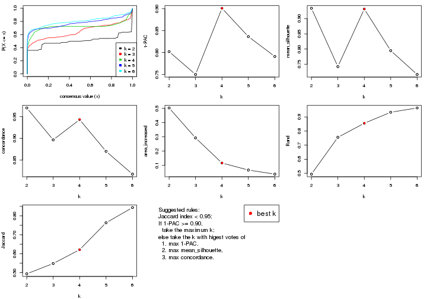

The numeric values for all these statistics can be obtained by `get_stats()`.

```r
get_stats(res)
```

```
#>   k 1-PAC mean_silhouette concordance area_increased  Rand Jaccard
#> 2 2 0.802           0.934       0.970         0.5022 0.494   0.494
#> 3 3 0.750           0.742       0.897         0.2927 0.756   0.549
#> 4 4 0.901           0.932       0.943         0.1169 0.855   0.621
#> 5 5 0.836           0.795       0.870         0.0677 0.934   0.764
#> 6 6 0.791           0.716       0.818         0.0391 0.964   0.844
```

`suggest_best_k()` suggests the best $k$ based on these statistics. The rules are as follows:

- All $k$ with Jaccard index larger than 0.95 are removed because the increase of
  the partition number does not provides enough extra information. If all $k$ are removed,
  the best $k$ is assigned by `NA`.
- For $k$ with 1-PAC larger than 0.9, the maximal $k$ is taken as the "best k". Other $k$ is called "optional k".
- If it does not fit the second rule. The $k$ with the highest vote of highest
  1-PAC, mean silhouette and concordance is taken as the "best k".

```r
suggest_best_k(res)
```

```
#> [1] 4
```


Following shows the table of the partitions (You need to click the **show/hide
code output** link to see it). The membership matrix (columns with name `p*`)
is inferred by
[`clue::cl_consensus()`](https://www.rdocumentation.org/link/cl_consensus?package=clue)
function with the `SE` method. Basically the value in the membership matrix
represents the probability to belong to a certain group. The finall class
label for an item is determined with the group with highest probability it
belongs to.

In `get_classes()` function, the entropy is calculated from the membership
matrix and the silhouette score is calculated from the consensus matrix.


<script>
$( function() {
	$( '#tabs-MAD-kmeans-get-classes' ).tabs();
} );
</script>
<div id='tabs-MAD-kmeans-get-classes'>
<ul>
<li><a href='#tab-MAD-kmeans-get-classes-1'>k = 2</a></li>
<li><a href='#tab-MAD-kmeans-get-classes-2'>k = 3</a></li>
<li><a href='#tab-MAD-kmeans-get-classes-3'>k = 4</a></li>
<li><a href='#tab-MAD-kmeans-get-classes-4'>k = 5</a></li>
<li><a href='#tab-MAD-kmeans-get-classes-5'>k = 6</a></li>
</ul>

<div id='tab-MAD-kmeans-get-classes-1'>
<p><a id='tab-MAD-kmeans-get-classes-1-a' style='color:#0366d6' href='#'>show/hide code output</a></p>
<pre><code class="r">cbind(get_classes(res, k = 2), get_membership(res, k = 2))
</code></pre>

<pre><code>#&gt;           class entropy silhouette    p1    p2
#&gt; SRR944011     1   0.900      0.591 0.684 0.316
#&gt; SRR944012     1   0.000      0.958 1.000 0.000
#&gt; SRR944014     2   0.000      0.977 0.000 1.000
#&gt; SRR944013     2   0.000      0.977 0.000 1.000
#&gt; SRR944015     1   0.000      0.958 1.000 0.000
#&gt; SRR944016     1   0.482      0.891 0.896 0.104
#&gt; SRR944017     2   0.000      0.977 0.000 1.000
#&gt; SRR944018     1   0.000      0.958 1.000 0.000
#&gt; SRR944019     1   0.000      0.958 1.000 0.000
#&gt; SRR944020     1   0.000      0.958 1.000 0.000
#&gt; SRR944021     2   0.000      0.977 0.000 1.000
#&gt; SRR944022     1   0.000      0.958 1.000 0.000
#&gt; SRR944023     1   0.000      0.958 1.000 0.000
#&gt; SRR944024     1   0.000      0.958 1.000 0.000
#&gt; SRR944026     2   0.000      0.977 0.000 1.000
#&gt; SRR944025     2   0.000      0.977 0.000 1.000
#&gt; SRR944028     2   0.000      0.977 0.000 1.000
#&gt; SRR944029     1   0.584      0.863 0.860 0.140
#&gt; SRR944030     2   0.000      0.977 0.000 1.000
#&gt; SRR944031     1   0.000      0.958 1.000 0.000
#&gt; SRR944032     2   0.000      0.977 0.000 1.000
#&gt; SRR944033     2   0.000      0.977 0.000 1.000
#&gt; SRR944034     2   0.000      0.977 0.000 1.000
#&gt; SRR944036     1   0.584      0.863 0.860 0.140
#&gt; SRR944035     2   0.000      0.977 0.000 1.000
#&gt; SRR944038     1   0.000      0.958 1.000 0.000
#&gt; SRR944037     1   0.000      0.958 1.000 0.000
#&gt; SRR944039     1   0.000      0.958 1.000 0.000
#&gt; SRR944040     2   0.000      0.977 0.000 1.000
#&gt; SRR944041     1   0.000      0.958 1.000 0.000
#&gt; SRR944042     1   0.000      0.958 1.000 0.000
#&gt; SRR944043     1   0.000      0.958 1.000 0.000
#&gt; SRR944044     2   0.000      0.977 0.000 1.000
#&gt; SRR944046     1   0.000      0.958 1.000 0.000
#&gt; SRR944045     2   0.000      0.977 0.000 1.000
#&gt; SRR944047     2   0.000      0.977 0.000 1.000
#&gt; SRR944048     2   0.969      0.290 0.396 0.604
#&gt; SRR944049     2   0.000      0.977 0.000 1.000
#&gt; SRR944050     1   0.625      0.845 0.844 0.156
#&gt; SRR944051     2   0.000      0.977 0.000 1.000
#&gt; SRR944052     2   0.000      0.977 0.000 1.000
#&gt; SRR944053     1   0.000      0.958 1.000 0.000
#&gt; SRR944054     2   0.000      0.977 0.000 1.000
#&gt; SRR944055     2   0.000      0.977 0.000 1.000
#&gt; SRR944056     2   0.000      0.977 0.000 1.000
#&gt; SRR944057     1   0.000      0.958 1.000 0.000
#&gt; SRR944058     1   0.000      0.958 1.000 0.000
#&gt; SRR944059     2   0.000      0.977 0.000 1.000
#&gt; SRR944060     1   0.000      0.958 1.000 0.000
#&gt; SRR944061     2   0.000      0.977 0.000 1.000
#&gt; SRR944062     1   0.000      0.958 1.000 0.000
#&gt; SRR944063     1   0.000      0.958 1.000 0.000
#&gt; SRR944064     2   0.000      0.977 0.000 1.000
#&gt; SRR944065     1   0.000      0.958 1.000 0.000
#&gt; SRR944066     1   0.000      0.958 1.000 0.000
#&gt; SRR944067     2   0.000      0.977 0.000 1.000
#&gt; SRR944068     1   0.000      0.958 1.000 0.000
#&gt; SRR944069     2   0.000      0.977 0.000 1.000
#&gt; SRR944070     1   0.000      0.958 1.000 0.000
#&gt; SRR944071     1   0.584      0.863 0.860 0.140
#&gt; SRR944072     1   0.000      0.958 1.000 0.000
#&gt; SRR944073     2   0.000      0.977 0.000 1.000
#&gt; SRR944075     2   0.000      0.977 0.000 1.000
#&gt; SRR944074     2   0.000      0.977 0.000 1.000
#&gt; SRR944076     1   0.584      0.863 0.860 0.140
#&gt; SRR944077     2   0.000      0.977 0.000 1.000
#&gt; SRR944078     2   0.000      0.977 0.000 1.000
#&gt; SRR944079     2   0.000      0.977 0.000 1.000
#&gt; SRR944080     2   0.000      0.977 0.000 1.000
#&gt; SRR944081     1   0.563      0.870 0.868 0.132
#&gt; SRR944082     1   0.000      0.958 1.000 0.000
#&gt; SRR944083     1   0.000      0.958 1.000 0.000
#&gt; SRR944084     1   0.584      0.863 0.860 0.140
#&gt; SRR944085     2   0.958      0.334 0.380 0.620
#&gt; SRR944086     1   0.584      0.863 0.860 0.140
#&gt; SRR944088     2   0.000      0.977 0.000 1.000
#&gt; SRR944087     1   0.000      0.958 1.000 0.000
</code></pre>

<script>
$('#tab-MAD-kmeans-get-classes-1-a').parent().next().next().hide();
$('#tab-MAD-kmeans-get-classes-1-a').click(function(){
  $('#tab-MAD-kmeans-get-classes-1-a').parent().next().next().toggle();
  return(false);
});
</script>
</div>

<div id='tab-MAD-kmeans-get-classes-2'>
<p><a id='tab-MAD-kmeans-get-classes-2-a' style='color:#0366d6' href='#'>show/hide code output</a></p>
<pre><code class="r">cbind(get_classes(res, k = 3), get_membership(res, k = 3))
</code></pre>

<pre><code>#&gt;           class entropy silhouette    p1    p2    p3
#&gt; SRR944011     1  0.1877     0.7798 0.956 0.012 0.032
#&gt; SRR944012     1  0.6274    -0.0234 0.544 0.000 0.456
#&gt; SRR944014     2  0.0000     0.9643 0.000 1.000 0.000
#&gt; SRR944013     2  0.4504     0.7514 0.196 0.804 0.000
#&gt; SRR944015     3  0.0237     0.8252 0.004 0.000 0.996
#&gt; SRR944016     1  0.2796     0.7579 0.908 0.000 0.092
#&gt; SRR944017     2  0.0747     0.9607 0.016 0.984 0.000
#&gt; SRR944018     3  0.6291     0.1548 0.468 0.000 0.532
#&gt; SRR944019     1  0.4235     0.6720 0.824 0.000 0.176
#&gt; SRR944020     3  0.0000     0.8262 0.000 0.000 1.000
#&gt; SRR944021     2  0.0000     0.9643 0.000 1.000 0.000
#&gt; SRR944022     3  0.0000     0.8262 0.000 0.000 1.000
#&gt; SRR944023     1  0.1643     0.7833 0.956 0.000 0.044
#&gt; SRR944024     1  0.2537     0.7653 0.920 0.000 0.080
#&gt; SRR944026     2  0.0747     0.9607 0.016 0.984 0.000
#&gt; SRR944025     2  0.0747     0.9607 0.016 0.984 0.000
#&gt; SRR944028     2  0.0747     0.9607 0.016 0.984 0.000
#&gt; SRR944029     1  0.0424     0.7797 0.992 0.000 0.008
#&gt; SRR944030     2  0.0000     0.9643 0.000 1.000 0.000
#&gt; SRR944031     1  0.1643     0.7833 0.956 0.000 0.044
#&gt; SRR944032     1  0.6295     0.0887 0.528 0.472 0.000
#&gt; SRR944033     2  0.0000     0.9643 0.000 1.000 0.000
#&gt; SRR944034     2  0.0000     0.9643 0.000 1.000 0.000
#&gt; SRR944036     1  0.0747     0.7811 0.984 0.000 0.016
#&gt; SRR944035     2  0.0424     0.9626 0.008 0.992 0.000
#&gt; SRR944038     3  0.2537     0.7729 0.080 0.000 0.920
#&gt; SRR944037     3  0.0000     0.8262 0.000 0.000 1.000
#&gt; SRR944039     1  0.5465     0.4851 0.712 0.000 0.288
#&gt; SRR944040     2  0.0000     0.9643 0.000 1.000 0.000
#&gt; SRR944041     1  0.6286    -0.0538 0.536 0.000 0.464
#&gt; SRR944042     1  0.1643     0.7833 0.956 0.000 0.044
#&gt; SRR944043     3  0.0000     0.8262 0.000 0.000 1.000
#&gt; SRR944044     2  0.0747     0.9607 0.016 0.984 0.000
#&gt; SRR944046     1  0.1643     0.7833 0.956 0.000 0.044
#&gt; SRR944045     2  0.0000     0.9643 0.000 1.000 0.000
#&gt; SRR944047     2  0.0000     0.9643 0.000 1.000 0.000
#&gt; SRR944048     1  0.2496     0.7483 0.928 0.068 0.004
#&gt; SRR944049     2  0.0000     0.9643 0.000 1.000 0.000
#&gt; SRR944050     1  0.2590     0.7616 0.924 0.004 0.072
#&gt; SRR944051     2  0.0747     0.9607 0.016 0.984 0.000
#&gt; SRR944052     2  0.0000     0.9643 0.000 1.000 0.000
#&gt; SRR944053     3  0.0000     0.8262 0.000 0.000 1.000
#&gt; SRR944054     2  0.1411     0.9463 0.036 0.964 0.000
#&gt; SRR944055     1  0.6309    -0.0318 0.504 0.496 0.000
#&gt; SRR944056     2  0.0000     0.9643 0.000 1.000 0.000
#&gt; SRR944057     1  0.2796     0.7579 0.908 0.000 0.092
#&gt; SRR944058     1  0.6305    -0.1311 0.516 0.000 0.484
#&gt; SRR944059     1  0.5882     0.4177 0.652 0.348 0.000
#&gt; SRR944060     3  0.0237     0.8252 0.004 0.000 0.996
#&gt; SRR944061     2  0.0000     0.9643 0.000 1.000 0.000
#&gt; SRR944062     3  0.5397     0.6008 0.280 0.000 0.720
#&gt; SRR944063     3  0.0000     0.8262 0.000 0.000 1.000
#&gt; SRR944064     2  0.0747     0.9607 0.016 0.984 0.000
#&gt; SRR944065     3  0.2711     0.7783 0.088 0.000 0.912
#&gt; SRR944066     3  0.6309     0.1090 0.500 0.000 0.500
#&gt; SRR944067     2  0.0747     0.9607 0.016 0.984 0.000
#&gt; SRR944068     3  0.0237     0.8252 0.004 0.000 0.996
#&gt; SRR944069     2  0.0000     0.9643 0.000 1.000 0.000
#&gt; SRR944070     3  0.2537     0.7729 0.080 0.000 0.920
#&gt; SRR944071     1  0.1643     0.7833 0.956 0.000 0.044
#&gt; SRR944072     3  0.6308     0.1354 0.492 0.000 0.508
#&gt; SRR944073     2  0.0000     0.9643 0.000 1.000 0.000
#&gt; SRR944075     1  0.6111     0.2972 0.604 0.396 0.000
#&gt; SRR944074     2  0.0747     0.9607 0.016 0.984 0.000
#&gt; SRR944076     1  0.1643     0.7833 0.956 0.000 0.044
#&gt; SRR944077     2  0.0000     0.9643 0.000 1.000 0.000
#&gt; SRR944078     2  0.6286     0.1176 0.464 0.536 0.000
#&gt; SRR944079     2  0.0000     0.9643 0.000 1.000 0.000
#&gt; SRR944080     2  0.0000     0.9643 0.000 1.000 0.000
#&gt; SRR944081     1  0.2356     0.7628 0.928 0.000 0.072
#&gt; SRR944082     3  0.5397     0.6008 0.280 0.000 0.720
#&gt; SRR944083     1  0.2878     0.7554 0.904 0.000 0.096
#&gt; SRR944084     1  0.1643     0.7833 0.956 0.000 0.044
#&gt; SRR944085     1  0.1585     0.7740 0.964 0.028 0.008
#&gt; SRR944086     1  0.0237     0.7787 0.996 0.000 0.004
#&gt; SRR944088     2  0.4235     0.7813 0.176 0.824 0.000
#&gt; SRR944087     1  0.1643     0.7833 0.956 0.000 0.044
</code></pre>

<script>
$('#tab-MAD-kmeans-get-classes-2-a').parent().next().next().hide();
$('#tab-MAD-kmeans-get-classes-2-a').click(function(){
  $('#tab-MAD-kmeans-get-classes-2-a').parent().next().next().toggle();
  return(false);
});
</script>
</div>

<div id='tab-MAD-kmeans-get-classes-3'>
<p><a id='tab-MAD-kmeans-get-classes-3-a' style='color:#0366d6' href='#'>show/hide code output</a></p>
<pre><code class="r">cbind(get_classes(res, k = 4), get_membership(res, k = 4))
</code></pre>

<pre><code>#&gt;           class entropy silhouette    p1    p2    p3    p4
#&gt; SRR944011     3  0.1452      0.971 0.036 0.000 0.956 0.008
#&gt; SRR944012     1  0.0937      0.924 0.976 0.000 0.012 0.012
#&gt; SRR944014     2  0.0592      0.966 0.000 0.984 0.016 0.000
#&gt; SRR944013     2  0.3550      0.886 0.096 0.860 0.044 0.000
#&gt; SRR944015     4  0.0000      0.926 0.000 0.000 0.000 1.000
#&gt; SRR944016     1  0.2216      0.924 0.908 0.000 0.092 0.000
#&gt; SRR944017     2  0.1510      0.954 0.016 0.956 0.028 0.000
#&gt; SRR944018     1  0.3658      0.851 0.836 0.000 0.020 0.144
#&gt; SRR944019     1  0.0927      0.929 0.976 0.000 0.016 0.008
#&gt; SRR944020     4  0.0707      0.929 0.020 0.000 0.000 0.980
#&gt; SRR944021     2  0.0592      0.966 0.000 0.984 0.016 0.000
#&gt; SRR944022     4  0.0707      0.929 0.020 0.000 0.000 0.980
#&gt; SRR944023     3  0.1677      0.971 0.040 0.000 0.948 0.012
#&gt; SRR944024     1  0.1867      0.931 0.928 0.000 0.072 0.000
#&gt; SRR944026     2  0.1510      0.954 0.016 0.956 0.028 0.000
#&gt; SRR944025     2  0.1059      0.959 0.012 0.972 0.016 0.000
#&gt; SRR944028     2  0.1059      0.959 0.012 0.972 0.016 0.000
#&gt; SRR944029     3  0.2125      0.935 0.076 0.004 0.920 0.000
#&gt; SRR944030     2  0.0592      0.966 0.000 0.984 0.016 0.000
#&gt; SRR944031     3  0.1677      0.971 0.040 0.000 0.948 0.012
#&gt; SRR944032     2  0.4155      0.854 0.072 0.828 0.100 0.000
#&gt; SRR944033     2  0.0592      0.966 0.000 0.984 0.016 0.000
#&gt; SRR944034     2  0.0592      0.966 0.000 0.984 0.016 0.000
#&gt; SRR944036     3  0.1545      0.969 0.040 0.000 0.952 0.008
#&gt; SRR944035     2  0.0779      0.961 0.004 0.980 0.016 0.000
#&gt; SRR944038     4  0.4307      0.768 0.024 0.000 0.192 0.784
#&gt; SRR944037     4  0.1004      0.929 0.024 0.000 0.004 0.972
#&gt; SRR944039     1  0.1284      0.933 0.964 0.000 0.024 0.012
#&gt; SRR944040     2  0.0592      0.966 0.000 0.984 0.016 0.000
#&gt; SRR944041     1  0.0804      0.925 0.980 0.000 0.008 0.012
#&gt; SRR944042     3  0.1677      0.971 0.040 0.000 0.948 0.012
#&gt; SRR944043     4  0.1489      0.917 0.044 0.000 0.004 0.952
#&gt; SRR944044     2  0.1510      0.954 0.016 0.956 0.028 0.000
#&gt; SRR944046     3  0.1677      0.971 0.040 0.000 0.948 0.012
#&gt; SRR944045     2  0.0592      0.966 0.000 0.984 0.016 0.000
#&gt; SRR944047     2  0.0592      0.966 0.000 0.984 0.016 0.000
#&gt; SRR944048     1  0.2216      0.924 0.908 0.000 0.092 0.000
#&gt; SRR944049     2  0.0188      0.964 0.004 0.996 0.000 0.000
#&gt; SRR944050     1  0.2216      0.924 0.908 0.000 0.092 0.000
#&gt; SRR944051     2  0.2385      0.932 0.052 0.920 0.028 0.000
#&gt; SRR944052     2  0.0592      0.966 0.000 0.984 0.016 0.000
#&gt; SRR944053     4  0.0592      0.929 0.016 0.000 0.000 0.984
#&gt; SRR944054     2  0.2670      0.925 0.052 0.908 0.040 0.000
#&gt; SRR944055     3  0.1302      0.932 0.000 0.044 0.956 0.000
#&gt; SRR944056     2  0.0592      0.966 0.000 0.984 0.016 0.000
#&gt; SRR944057     1  0.1940      0.930 0.924 0.000 0.076 0.000
#&gt; SRR944058     1  0.1820      0.927 0.944 0.000 0.020 0.036
#&gt; SRR944059     3  0.1610      0.951 0.016 0.032 0.952 0.000
#&gt; SRR944060     4  0.1174      0.922 0.020 0.000 0.012 0.968
#&gt; SRR944061     2  0.0592      0.966 0.000 0.984 0.016 0.000
#&gt; SRR944062     1  0.2867      0.882 0.884 0.000 0.012 0.104
#&gt; SRR944063     4  0.0707      0.929 0.020 0.000 0.000 0.980
#&gt; SRR944064     2  0.1059      0.959 0.012 0.972 0.016 0.000
#&gt; SRR944065     4  0.4220      0.695 0.248 0.000 0.004 0.748
#&gt; SRR944066     1  0.1929      0.928 0.940 0.000 0.024 0.036
#&gt; SRR944067     2  0.1059      0.959 0.012 0.972 0.016 0.000
#&gt; SRR944068     4  0.0000      0.926 0.000 0.000 0.000 1.000
#&gt; SRR944069     2  0.0592      0.966 0.000 0.984 0.016 0.000
#&gt; SRR944070     4  0.4307      0.768 0.024 0.000 0.192 0.784
#&gt; SRR944071     3  0.1584      0.971 0.036 0.000 0.952 0.012
#&gt; SRR944072     1  0.1677      0.923 0.948 0.000 0.012 0.040
#&gt; SRR944073     2  0.0592      0.966 0.000 0.984 0.016 0.000
#&gt; SRR944075     3  0.1305      0.940 0.004 0.036 0.960 0.000
#&gt; SRR944074     2  0.1510      0.954 0.016 0.956 0.028 0.000
#&gt; SRR944076     3  0.1584      0.971 0.036 0.000 0.952 0.012
#&gt; SRR944077     2  0.0592      0.966 0.000 0.984 0.016 0.000
#&gt; SRR944078     3  0.1474      0.922 0.000 0.052 0.948 0.000
#&gt; SRR944079     2  0.0592      0.966 0.000 0.984 0.016 0.000
#&gt; SRR944080     2  0.0592      0.966 0.000 0.984 0.016 0.000
#&gt; SRR944081     1  0.3088      0.859 0.864 0.008 0.128 0.000
#&gt; SRR944082     1  0.2988      0.875 0.876 0.000 0.012 0.112
#&gt; SRR944083     1  0.1867      0.931 0.928 0.000 0.072 0.000
#&gt; SRR944084     3  0.2329      0.950 0.072 0.000 0.916 0.012
#&gt; SRR944085     3  0.1452      0.971 0.036 0.000 0.956 0.008
#&gt; SRR944086     1  0.2814      0.865 0.868 0.000 0.132 0.000
#&gt; SRR944088     2  0.4234      0.838 0.052 0.816 0.132 0.000
#&gt; SRR944087     3  0.1677      0.971 0.040 0.000 0.948 0.012
</code></pre>

<script>
$('#tab-MAD-kmeans-get-classes-3-a').parent().next().next().hide();
$('#tab-MAD-kmeans-get-classes-3-a').click(function(){
  $('#tab-MAD-kmeans-get-classes-3-a').parent().next().next().toggle();
  return(false);
});
</script>
</div>

<div id='tab-MAD-kmeans-get-classes-4'>
<p><a id='tab-MAD-kmeans-get-classes-4-a' style='color:#0366d6' href='#'>show/hide code output</a></p>
<pre><code class="r">cbind(get_classes(res, k = 5), get_membership(res, k = 5))
</code></pre>

<pre><code>#&gt;           class entropy silhouette    p1    p2    p3    p4    p5
#&gt; SRR944011     3  0.0162     0.9758 0.004 0.000 0.996 0.000 0.000
#&gt; SRR944012     1  0.5230     0.3310 0.504 0.000 0.000 0.044 0.452
#&gt; SRR944014     2  0.0162     0.9276 0.000 0.996 0.000 0.000 0.004
#&gt; SRR944013     5  0.5023     0.6190 0.012 0.348 0.024 0.000 0.616
#&gt; SRR944015     4  0.3521     0.8089 0.004 0.000 0.000 0.764 0.232
#&gt; SRR944016     1  0.1628     0.8192 0.936 0.000 0.008 0.000 0.056
#&gt; SRR944017     2  0.3123     0.7459 0.000 0.812 0.004 0.000 0.184
#&gt; SRR944018     1  0.5470     0.5459 0.628 0.000 0.000 0.268 0.104
#&gt; SRR944019     1  0.4425     0.5049 0.600 0.000 0.000 0.008 0.392
#&gt; SRR944020     4  0.3197     0.8221 0.024 0.000 0.000 0.836 0.140
#&gt; SRR944021     2  0.0162     0.9276 0.000 0.996 0.000 0.000 0.004
#&gt; SRR944022     4  0.3197     0.8221 0.024 0.000 0.000 0.836 0.140
#&gt; SRR944023     3  0.1251     0.9592 0.008 0.000 0.956 0.000 0.036
#&gt; SRR944024     1  0.0992     0.8268 0.968 0.000 0.008 0.000 0.024
#&gt; SRR944026     2  0.3730     0.5521 0.000 0.712 0.000 0.000 0.288
#&gt; SRR944025     2  0.1792     0.8740 0.000 0.916 0.000 0.000 0.084
#&gt; SRR944028     2  0.1792     0.8740 0.000 0.916 0.000 0.000 0.084
#&gt; SRR944029     5  0.4276     0.2184 0.004 0.000 0.380 0.000 0.616
#&gt; SRR944030     2  0.0000     0.9279 0.000 1.000 0.000 0.000 0.000
#&gt; SRR944031     3  0.1026     0.9659 0.004 0.000 0.968 0.004 0.024
#&gt; SRR944032     5  0.5893     0.6359 0.052 0.320 0.036 0.000 0.592
#&gt; SRR944033     2  0.0000     0.9279 0.000 1.000 0.000 0.000 0.000
#&gt; SRR944034     2  0.0000     0.9279 0.000 1.000 0.000 0.000 0.000
#&gt; SRR944036     3  0.0566     0.9763 0.004 0.000 0.984 0.000 0.012
#&gt; SRR944035     2  0.0290     0.9251 0.000 0.992 0.000 0.000 0.008
#&gt; SRR944038     4  0.5898     0.5867 0.004 0.000 0.252 0.604 0.140
#&gt; SRR944037     4  0.1278     0.8084 0.020 0.000 0.004 0.960 0.016
#&gt; SRR944039     1  0.2624     0.8009 0.872 0.000 0.000 0.012 0.116
#&gt; SRR944040     2  0.0324     0.9243 0.000 0.992 0.004 0.000 0.004
#&gt; SRR944041     1  0.5281     0.4308 0.548 0.000 0.000 0.052 0.400
#&gt; SRR944042     3  0.1026     0.9659 0.004 0.000 0.968 0.004 0.024
#&gt; SRR944043     4  0.3120     0.7600 0.084 0.000 0.004 0.864 0.048
#&gt; SRR944044     2  0.3366     0.6697 0.000 0.768 0.000 0.000 0.232
#&gt; SRR944046     3  0.1026     0.9659 0.004 0.000 0.968 0.004 0.024
#&gt; SRR944045     2  0.0162     0.9276 0.000 0.996 0.000 0.000 0.004
#&gt; SRR944047     2  0.0000     0.9279 0.000 1.000 0.000 0.000 0.000
#&gt; SRR944048     1  0.1628     0.8192 0.936 0.000 0.008 0.000 0.056
#&gt; SRR944049     2  0.0162     0.9268 0.000 0.996 0.000 0.000 0.004
#&gt; SRR944050     1  0.1628     0.8192 0.936 0.000 0.008 0.000 0.056
#&gt; SRR944051     5  0.4875     0.5272 0.004 0.400 0.020 0.000 0.576
#&gt; SRR944052     2  0.0162     0.9276 0.000 0.996 0.000 0.000 0.004
#&gt; SRR944053     4  0.2920     0.8222 0.016 0.000 0.000 0.852 0.132
#&gt; SRR944054     5  0.4883     0.5797 0.004 0.372 0.024 0.000 0.600
#&gt; SRR944055     3  0.0771     0.9744 0.000 0.004 0.976 0.000 0.020
#&gt; SRR944056     2  0.0162     0.9276 0.000 0.996 0.000 0.000 0.004
#&gt; SRR944057     1  0.1168     0.8244 0.960 0.000 0.008 0.000 0.032
#&gt; SRR944058     1  0.0510     0.8274 0.984 0.000 0.000 0.000 0.016
#&gt; SRR944059     3  0.0771     0.9744 0.000 0.004 0.976 0.000 0.020
#&gt; SRR944060     4  0.3441     0.7802 0.004 0.000 0.028 0.828 0.140
#&gt; SRR944061     2  0.0162     0.9276 0.000 0.996 0.000 0.000 0.004
#&gt; SRR944062     1  0.3978     0.7249 0.796 0.000 0.004 0.148 0.052
#&gt; SRR944063     4  0.3197     0.8221 0.024 0.000 0.000 0.836 0.140
#&gt; SRR944064     2  0.1792     0.8740 0.000 0.916 0.000 0.000 0.084
#&gt; SRR944065     4  0.4510     0.6473 0.164 0.000 0.004 0.756 0.076
#&gt; SRR944066     1  0.0451     0.8249 0.988 0.000 0.000 0.008 0.004
#&gt; SRR944067     2  0.1792     0.8740 0.000 0.916 0.000 0.000 0.084
#&gt; SRR944068     4  0.3521     0.8089 0.004 0.000 0.000 0.764 0.232
#&gt; SRR944069     2  0.0162     0.9276 0.000 0.996 0.000 0.000 0.004
#&gt; SRR944070     4  0.5898     0.5867 0.004 0.000 0.252 0.604 0.140
#&gt; SRR944071     3  0.0566     0.9763 0.004 0.000 0.984 0.000 0.012
#&gt; SRR944072     1  0.1041     0.8222 0.964 0.000 0.000 0.004 0.032
#&gt; SRR944073     2  0.0000     0.9279 0.000 1.000 0.000 0.000 0.000
#&gt; SRR944075     3  0.0771     0.9744 0.000 0.004 0.976 0.000 0.020
#&gt; SRR944074     2  0.3730     0.5521 0.000 0.712 0.000 0.000 0.288
#&gt; SRR944076     3  0.0324     0.9764 0.004 0.000 0.992 0.000 0.004
#&gt; SRR944077     2  0.0000     0.9279 0.000 1.000 0.000 0.000 0.000
#&gt; SRR944078     3  0.0771     0.9744 0.000 0.004 0.976 0.000 0.020
#&gt; SRR944079     2  0.0162     0.9276 0.000 0.996 0.000 0.000 0.004
#&gt; SRR944080     2  0.0000     0.9279 0.000 1.000 0.000 0.000 0.000
#&gt; SRR944081     5  0.5070     0.2179 0.272 0.000 0.052 0.008 0.668
#&gt; SRR944082     1  0.4332     0.7118 0.768 0.000 0.004 0.164 0.064
#&gt; SRR944083     1  0.0798     0.8266 0.976 0.000 0.008 0.000 0.016
#&gt; SRR944084     3  0.1282     0.9548 0.004 0.000 0.952 0.000 0.044
#&gt; SRR944085     3  0.0671     0.9750 0.004 0.000 0.980 0.000 0.016
#&gt; SRR944086     5  0.5449    -0.0542 0.376 0.000 0.068 0.000 0.556
#&gt; SRR944088     5  0.5059     0.6495 0.004 0.292 0.052 0.000 0.652
#&gt; SRR944087     3  0.1026     0.9659 0.004 0.000 0.968 0.004 0.024
</code></pre>

<script>
$('#tab-MAD-kmeans-get-classes-4-a').parent().next().next().hide();
$('#tab-MAD-kmeans-get-classes-4-a').click(function(){
  $('#tab-MAD-kmeans-get-classes-4-a').parent().next().next().toggle();
  return(false);
});
</script>
</div>

<div id='tab-MAD-kmeans-get-classes-5'>
<p><a id='tab-MAD-kmeans-get-classes-5-a' style='color:#0366d6' href='#'>show/hide code output</a></p>
<pre><code class="r">cbind(get_classes(res, k = 6), get_membership(res, k = 6))
</code></pre>

<pre><code>#&gt;           class entropy silhouette    p1    p2    p3    p4    p5    p6
#&gt; SRR944011     3  0.0260     0.9696 0.000 0.000 0.992 0.000 0.008 0.000
#&gt; SRR944012     5  0.4776     0.4912 0.136 0.000 0.000 0.032 0.724 0.108
#&gt; SRR944014     2  0.0363     0.8938 0.000 0.988 0.000 0.000 0.000 0.012
#&gt; SRR944013     5  0.5225     0.6531 0.004 0.140 0.012 0.000 0.660 0.184
#&gt; SRR944015     4  0.2994     0.4815 0.000 0.000 0.000 0.788 0.004 0.208
#&gt; SRR944016     1  0.1957     0.7788 0.888 0.000 0.000 0.000 0.112 0.000
#&gt; SRR944017     2  0.4552     0.7003 0.000 0.700 0.004 0.000 0.092 0.204
#&gt; SRR944018     6  0.7456    -0.1626 0.300 0.000 0.004 0.116 0.224 0.356
#&gt; SRR944019     5  0.4447     0.4615 0.148 0.000 0.000 0.016 0.740 0.096
#&gt; SRR944020     4  0.0260     0.6405 0.000 0.000 0.000 0.992 0.008 0.000
#&gt; SRR944021     2  0.0458     0.8929 0.000 0.984 0.000 0.000 0.000 0.016
#&gt; SRR944022     4  0.0000     0.6403 0.000 0.000 0.000 1.000 0.000 0.000
#&gt; SRR944023     3  0.1398     0.9297 0.000 0.000 0.940 0.000 0.008 0.052
#&gt; SRR944024     1  0.1285     0.7909 0.944 0.000 0.000 0.000 0.004 0.052
#&gt; SRR944026     2  0.5249     0.5338 0.000 0.600 0.000 0.000 0.156 0.244
#&gt; SRR944025     2  0.2980     0.8031 0.000 0.808 0.000 0.000 0.012 0.180
#&gt; SRR944028     2  0.3014     0.7999 0.000 0.804 0.000 0.000 0.012 0.184
#&gt; SRR944029     5  0.3754     0.5768 0.000 0.000 0.152 0.000 0.776 0.072
#&gt; SRR944030     2  0.0000     0.8951 0.000 1.000 0.000 0.000 0.000 0.000
#&gt; SRR944031     3  0.0858     0.9538 0.000 0.000 0.968 0.000 0.004 0.028
#&gt; SRR944032     5  0.5487     0.6361 0.012 0.116 0.012 0.000 0.632 0.228
#&gt; SRR944033     2  0.0000     0.8951 0.000 1.000 0.000 0.000 0.000 0.000
#&gt; SRR944034     2  0.0000     0.8951 0.000 1.000 0.000 0.000 0.000 0.000
#&gt; SRR944036     3  0.0603     0.9694 0.000 0.000 0.980 0.000 0.016 0.004
#&gt; SRR944035     2  0.2135     0.8434 0.000 0.872 0.000 0.000 0.000 0.128
#&gt; SRR944038     6  0.5799     0.4295 0.000 0.000 0.232 0.236 0.004 0.528
#&gt; SRR944037     4  0.4139     0.3522 0.004 0.000 0.000 0.700 0.036 0.260
#&gt; SRR944039     1  0.5728     0.5099 0.560 0.000 0.000 0.016 0.280 0.144
#&gt; SRR944040     2  0.0603     0.8913 0.000 0.980 0.004 0.000 0.000 0.016
#&gt; SRR944041     5  0.5429     0.4317 0.152 0.000 0.000 0.052 0.668 0.128
#&gt; SRR944042     3  0.0713     0.9563 0.000 0.000 0.972 0.000 0.000 0.028
#&gt; SRR944043     4  0.6278     0.0125 0.104 0.000 0.000 0.436 0.056 0.404
#&gt; SRR944044     2  0.4809     0.6241 0.000 0.652 0.000 0.000 0.108 0.240
#&gt; SRR944046     3  0.0713     0.9563 0.000 0.000 0.972 0.000 0.000 0.028
#&gt; SRR944045     2  0.0603     0.8909 0.000 0.980 0.004 0.000 0.000 0.016
#&gt; SRR944047     2  0.0000     0.8951 0.000 1.000 0.000 0.000 0.000 0.000
#&gt; SRR944048     1  0.2121     0.7810 0.892 0.000 0.000 0.000 0.096 0.012
#&gt; SRR944049     2  0.1204     0.8776 0.000 0.944 0.000 0.000 0.000 0.056
#&gt; SRR944050     1  0.1957     0.7788 0.888 0.000 0.000 0.000 0.112 0.000
#&gt; SRR944051     5  0.5678     0.5914 0.000 0.184 0.008 0.000 0.564 0.244
#&gt; SRR944052     2  0.0363     0.8938 0.000 0.988 0.000 0.000 0.000 0.012
#&gt; SRR944053     4  0.0146     0.6398 0.000 0.000 0.000 0.996 0.004 0.000
#&gt; SRR944054     5  0.5567     0.6210 0.000 0.160 0.012 0.000 0.592 0.236
#&gt; SRR944055     3  0.0964     0.9642 0.000 0.004 0.968 0.000 0.012 0.016
#&gt; SRR944056     2  0.0146     0.8950 0.000 0.996 0.000 0.000 0.000 0.004
#&gt; SRR944057     1  0.1444     0.7913 0.928 0.000 0.000 0.000 0.072 0.000
#&gt; SRR944058     1  0.1408     0.7949 0.944 0.000 0.000 0.000 0.020 0.036
#&gt; SRR944059     3  0.0820     0.9670 0.000 0.000 0.972 0.000 0.016 0.012
#&gt; SRR944060     6  0.4576    -0.0417 0.000 0.000 0.028 0.436 0.004 0.532
#&gt; SRR944061     2  0.0260     0.8946 0.000 0.992 0.000 0.000 0.000 0.008
#&gt; SRR944062     1  0.4791     0.3945 0.564 0.000 0.000 0.004 0.048 0.384
#&gt; SRR944063     4  0.0260     0.6405 0.000 0.000 0.000 0.992 0.008 0.000
#&gt; SRR944064     2  0.2805     0.8174 0.000 0.828 0.000 0.000 0.012 0.160
#&gt; SRR944065     4  0.7010    -0.0558 0.108 0.000 0.004 0.396 0.124 0.368
#&gt; SRR944066     1  0.0458     0.7956 0.984 0.000 0.000 0.000 0.000 0.016
#&gt; SRR944067     2  0.2841     0.8147 0.000 0.824 0.000 0.000 0.012 0.164
#&gt; SRR944068     4  0.2994     0.4815 0.000 0.000 0.000 0.788 0.004 0.208
#&gt; SRR944069     2  0.0458     0.8929 0.000 0.984 0.000 0.000 0.000 0.016
#&gt; SRR944070     6  0.5799     0.4295 0.000 0.000 0.232 0.236 0.004 0.528
#&gt; SRR944071     3  0.0458     0.9693 0.000 0.000 0.984 0.000 0.016 0.000
#&gt; SRR944072     1  0.3472     0.7286 0.808 0.000 0.000 0.000 0.092 0.100
#&gt; SRR944073     2  0.0000     0.8951 0.000 1.000 0.000 0.000 0.000 0.000
#&gt; SRR944075     3  0.0870     0.9662 0.000 0.004 0.972 0.000 0.012 0.012
#&gt; SRR944074     2  0.5249     0.5338 0.000 0.600 0.000 0.000 0.156 0.244
#&gt; SRR944076     3  0.0363     0.9696 0.000 0.000 0.988 0.000 0.012 0.000
#&gt; SRR944077     2  0.0146     0.8950 0.000 0.996 0.000 0.000 0.000 0.004
#&gt; SRR944078     3  0.0964     0.9642 0.000 0.004 0.968 0.000 0.012 0.016
#&gt; SRR944079     2  0.0458     0.8929 0.000 0.984 0.000 0.000 0.000 0.016
#&gt; SRR944080     2  0.0000     0.8951 0.000 1.000 0.000 0.000 0.000 0.000
#&gt; SRR944081     5  0.1528     0.6265 0.028 0.000 0.016 0.000 0.944 0.012
#&gt; SRR944082     1  0.5562     0.3207 0.512 0.000 0.000 0.020 0.084 0.384
#&gt; SRR944083     1  0.0777     0.7953 0.972 0.000 0.000 0.000 0.004 0.024
#&gt; SRR944084     3  0.1501     0.9165 0.000 0.000 0.924 0.000 0.076 0.000
#&gt; SRR944085     3  0.0458     0.9693 0.000 0.000 0.984 0.000 0.016 0.000
#&gt; SRR944086     5  0.2255     0.6202 0.044 0.000 0.024 0.000 0.908 0.024
#&gt; SRR944088     5  0.5131     0.6581 0.000 0.108 0.028 0.000 0.676 0.188
#&gt; SRR944087     3  0.0363     0.9625 0.000 0.000 0.988 0.000 0.000 0.012
</code></pre>

<script>
$('#tab-MAD-kmeans-get-classes-5-a').parent().next().next().hide();
$('#tab-MAD-kmeans-get-classes-5-a').click(function(){
  $('#tab-MAD-kmeans-get-classes-5-a').parent().next().next().toggle();
  return(false);
});
</script>
</div>
</div>

Heatmaps for the consensus matrix. It visualizes the probability of two
samples to be in a same group.


<script>
$( function() {
	$( '#tabs-MAD-kmeans-consensus-heatmap' ).tabs();
} );
</script>
<div id='tabs-MAD-kmeans-consensus-heatmap'>
<ul>
<li><a href='#tab-MAD-kmeans-consensus-heatmap-1'>k = 2</a></li>
<li><a href='#tab-MAD-kmeans-consensus-heatmap-2'>k = 3</a></li>
<li><a href='#tab-MAD-kmeans-consensus-heatmap-3'>k = 4</a></li>
<li><a href='#tab-MAD-kmeans-consensus-heatmap-4'>k = 5</a></li>
<li><a href='#tab-MAD-kmeans-consensus-heatmap-5'>k = 6</a></li>
</ul>
<div id='tab-MAD-kmeans-consensus-heatmap-1'>
<pre><code class="r">consensus_heatmap(res, k = 2)
</code></pre>

<p></p>

</div>
<div id='tab-MAD-kmeans-consensus-heatmap-2'>
<pre><code class="r">consensus_heatmap(res, k = 3)
</code></pre>

<p></p>

</div>
<div id='tab-MAD-kmeans-consensus-heatmap-3'>
<pre><code class="r">consensus_heatmap(res, k = 4)
</code></pre>

<p></p>

</div>
<div id='tab-MAD-kmeans-consensus-heatmap-4'>
<pre><code class="r">consensus_heatmap(res, k = 5)
</code></pre>

<p></p>

</div>
<div id='tab-MAD-kmeans-consensus-heatmap-5'>
<pre><code class="r">consensus_heatmap(res, k = 6)
</code></pre>

<p></p>

</div>
</div>

Heatmaps for the membership of samples in all partitions to see how consistent they are:


<script>
$( function() {
	$( '#tabs-MAD-kmeans-membership-heatmap' ).tabs();
} );
</script>
<div id='tabs-MAD-kmeans-membership-heatmap'>
<ul>
<li><a href='#tab-MAD-kmeans-membership-heatmap-1'>k = 2</a></li>
<li><a href='#tab-MAD-kmeans-membership-heatmap-2'>k = 3</a></li>
<li><a href='#tab-MAD-kmeans-membership-heatmap-3'>k = 4</a></li>
<li><a href='#tab-MAD-kmeans-membership-heatmap-4'>k = 5</a></li>
<li><a href='#tab-MAD-kmeans-membership-heatmap-5'>k = 6</a></li>
</ul>
<div id='tab-MAD-kmeans-membership-heatmap-1'>
<pre><code class="r">membership_heatmap(res, k = 2)
</code></pre>

<p></p>

</div>
<div id='tab-MAD-kmeans-membership-heatmap-2'>
<pre><code class="r">membership_heatmap(res, k = 3)
</code></pre>

<p>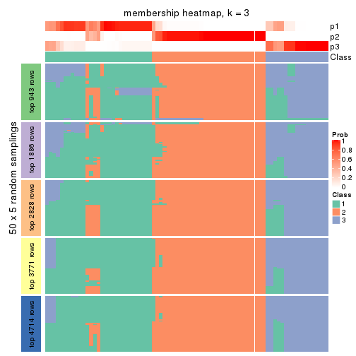</p>

</div>
<div id='tab-MAD-kmeans-membership-heatmap-3'>
<pre><code class="r">membership_heatmap(res, k = 4)
</code></pre>

<p></p>

</div>
<div id='tab-MAD-kmeans-membership-heatmap-4'>
<pre><code class="r">membership_heatmap(res, k = 5)
</code></pre>

<p></p>

</div>
<div id='tab-MAD-kmeans-membership-heatmap-5'>
<pre><code class="r">membership_heatmap(res, k = 6)
</code></pre>

<p></p>

</div>
</div>

As soon as we have had the classes for columns, we can look for signatures
which are significantly different between classes which can be candidate marks
for certain classes. Following are the heatmaps for signatures.


Signature heatmaps where rows are scaled:


<script>
$( function() {
	$( '#tabs-MAD-kmeans-get-signatures' ).tabs();
} );
</script>
<div id='tabs-MAD-kmeans-get-signatures'>
<ul>
<li><a href='#tab-MAD-kmeans-get-signatures-1'>k = 2</a></li>
<li><a href='#tab-MAD-kmeans-get-signatures-2'>k = 3</a></li>
<li><a href='#tab-MAD-kmeans-get-signatures-3'>k = 4</a></li>
<li><a href='#tab-MAD-kmeans-get-signatures-4'>k = 5</a></li>
<li><a href='#tab-MAD-kmeans-get-signatures-5'>k = 6</a></li>
</ul>
<div id='tab-MAD-kmeans-get-signatures-1'>
<pre><code class="r">get_signatures(res, k = 2)
</code></pre>

<p></p>

</div>
<div id='tab-MAD-kmeans-get-signatures-2'>
<pre><code class="r">get_signatures(res, k = 3)
</code></pre>

<p></p>

</div>
<div id='tab-MAD-kmeans-get-signatures-3'>
<pre><code class="r">get_signatures(res, k = 4)
</code></pre>

<p></p>

</div>
<div id='tab-MAD-kmeans-get-signatures-4'>
<pre><code class="r">get_signatures(res, k = 5)
</code></pre>

<p></p>

</div>
<div id='tab-MAD-kmeans-get-signatures-5'>
<pre><code class="r">get_signatures(res, k = 6)
</code></pre>

<p></p>

</div>
</div>


Signature heatmaps where rows are not scaled:


<script>
$( function() {
	$( '#tabs-MAD-kmeans-get-signatures-no-scale' ).tabs();
} );
</script>
<div id='tabs-MAD-kmeans-get-signatures-no-scale'>
<ul>
<li><a href='#tab-MAD-kmeans-get-signatures-no-scale-1'>k = 2</a></li>
<li><a href='#tab-MAD-kmeans-get-signatures-no-scale-2'>k = 3</a></li>
<li><a href='#tab-MAD-kmeans-get-signatures-no-scale-3'>k = 4</a></li>
<li><a href='#tab-MAD-kmeans-get-signatures-no-scale-4'>k = 5</a></li>
<li><a href='#tab-MAD-kmeans-get-signatures-no-scale-5'>k = 6</a></li>
</ul>
<div id='tab-MAD-kmeans-get-signatures-no-scale-1'>
<pre><code class="r">get_signatures(res, k = 2, scale_rows = FALSE)
</code></pre>

<p></p>

</div>
<div id='tab-MAD-kmeans-get-signatures-no-scale-2'>
<pre><code class="r">get_signatures(res, k = 3, scale_rows = FALSE)
</code></pre>

<pre><code>#&gt; Error in mat[ceiling(1:nr/h_ratio), ceiling(1:nc/w_ratio), drop = FALSE]: subscript out of bounds
</code></pre>

<p></p>

</div>
<div id='tab-MAD-kmeans-get-signatures-no-scale-3'>
<pre><code class="r">get_signatures(res, k = 4, scale_rows = FALSE)
</code></pre>

<pre><code>#&gt; Error in mat[ceiling(1:nr/h_ratio), ceiling(1:nc/w_ratio), drop = FALSE]: subscript out of bounds
</code></pre>

<p></p>

</div>
<div id='tab-MAD-kmeans-get-signatures-no-scale-4'>
<pre><code class="r">get_signatures(res, k = 5, scale_rows = FALSE)
</code></pre>

<p></p>

</div>
<div id='tab-MAD-kmeans-get-signatures-no-scale-5'>
<pre><code class="r">get_signatures(res, k = 6, scale_rows = FALSE)
</code></pre>

<pre><code>#&gt; Error in mat[ceiling(1:nr/h_ratio), ceiling(1:nc/w_ratio), drop = FALSE]: subscript out of bounds
</code></pre>

<p></p>

</div>
</div>


Compare the overlap of signatures from different k:

```r
compare_signatures(res)
```


`get_signature()` returns a data frame invisibly. TO get the list of signatures, the function
call should be assigned to a variable explicitly. In following code, if `plot` argument is set
to `FALSE`, no heatmap is plotted while only the differential analysis is performed.

```r
# code only for demonstration
tb = get_signature(res, k = ..., plot = FALSE)
```

An example of the output of `tb` is:

```
#>   which_row         fdr    mean_1    mean_2 scaled_mean_1 scaled_mean_2 km
#> 1        38 0.042760348  8.373488  9.131774    -0.5533452     0.5164555  1
#> 2        40 0.018707592  7.106213  8.469186    -0.6173731     0.5762149  1
#> 3        55 0.019134737 10.221463 11.207825    -0.6159697     0.5749050  1
#> 4        59 0.006059896  5.921854  7.869574    -0.6899429     0.6439467  1
#> 5        60 0.018055526  8.928898 10.211722    -0.6204761     0.5791110  1
#> 6        98 0.009384629 15.714769 14.887706     0.6635654    -0.6193277  2
...
```

The columns in `tb` are:

1. `which_row`: row indices corresponding to the input matrix.
2. `fdr`: FDR for the differential test. 
3. `mean_x`: The mean value in group x.
4. `scaled_mean_x`: The mean value in group x after rows are scaled.
5. `km`: Row groups if k-means clustering is applied to rows.


UMAP plot which shows how samples are separated.


<script>
$( function() {
	$( '#tabs-MAD-kmeans-dimension-reduction' ).tabs();
} );
</script>
<div id='tabs-MAD-kmeans-dimension-reduction'>
<ul>
<li><a href='#tab-MAD-kmeans-dimension-reduction-1'>k = 2</a></li>
<li><a href='#tab-MAD-kmeans-dimension-reduction-2'>k = 3</a></li>
<li><a href='#tab-MAD-kmeans-dimension-reduction-3'>k = 4</a></li>
<li><a href='#tab-MAD-kmeans-dimension-reduction-4'>k = 5</a></li>
<li><a href='#tab-MAD-kmeans-dimension-reduction-5'>k = 6</a></li>
</ul>
<div id='tab-MAD-kmeans-dimension-reduction-1'>
<pre><code class="r">dimension_reduction(res, k = 2, method = &quot;UMAP&quot;)
</code></pre>

<p></p>

</div>
<div id='tab-MAD-kmeans-dimension-reduction-2'>
<pre><code class="r">dimension_reduction(res, k = 3, method = &quot;UMAP&quot;)
</code></pre>

<p></p>

</div>
<div id='tab-MAD-kmeans-dimension-reduction-3'>
<pre><code class="r">dimension_reduction(res, k = 4, method = &quot;UMAP&quot;)
</code></pre>

<p></p>

</div>
<div id='tab-MAD-kmeans-dimension-reduction-4'>
<pre><code class="r">dimension_reduction(res, k = 5, method = &quot;UMAP&quot;)
</code></pre>

<p></p>

</div>
<div id='tab-MAD-kmeans-dimension-reduction-5'>
<pre><code class="r">dimension_reduction(res, k = 6, method = &quot;UMAP&quot;)
</code></pre>

<p></p>

</div>
</div>


Following heatmap shows how subgroups are split when increasing `k`:

```r
collect_classes(res)
```

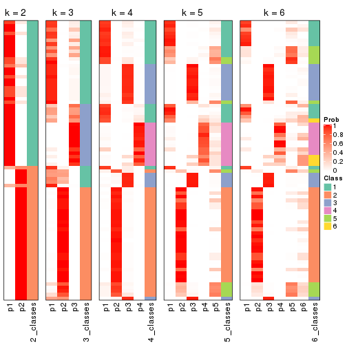


If matrix rows can be associated to genes, consider to use `GO_Enrichment(res,
...)` to perform function enrichment for the signature genes.


 

---------------------------------------------------


### MAD:skmeans**


The object with results only for a single top-value method and a single partition method 
can be extracted as:

```r
res = res_list["MAD", "skmeans"]
# you can also extract it by
# res = res_list["MAD:skmeans"]
```

A summary of `res` and all the functions that can be applied to it:

```r
res
```

```
#> A 'ConsensusPartition' object with k = 2, 3, 4, 5, 6.
#>   On a matrix with 9427 rows and 77 columns.
#>   Top rows (943, 1886, 2828, 3771, 4714) are extracted by 'MAD' method.
#>   Subgroups are detected by 'skmeans' method.
#>   Performed in total 1250 partitions by row resampling.
#>   Best k for subgroups seems to be 3.
#> 
#> Following methods can be applied to this 'ConsensusPartition' object:
#>  [1] "cola_report"             "collect_classes"         "collect_plots"          
#>  [4] "collect_stats"           "colnames"                "compare_signatures"     
#>  [7] "consensus_heatmap"       "dimension_reduction"     "functional_enrichment"  
#> [10] "get_anno_col"            "get_anno"                "get_classes"            
#> [13] "get_consensus"           "get_matrix"              "get_membership"         
#> [16] "get_param"               "get_signatures"          "get_stats"              
#> [19] "is_best_k"               "is_stable_k"             "membership_heatmap"     
#> [22] "ncol"                    "nrow"                    "plot_ecdf"              
#> [25] "rownames"                "select_partition_number" "show"                   
#> [28] "suggest_best_k"          "test_to_known_factors"
```

`collect_plots()` function collects all the plots made from `res` for all `k` (number of partitions)
into one single page to provide an easy and fast comparison between different `k`.

```r
collect_plots(res)
```


The plots are:

- The first row: a plot of the ECDF (Empirical cumulative distribution
  function) curves of the consensus matrix for each `k` and the heatmap of
  predicted classes for each `k`.
- The second row: heatmaps of the consensus matrix for each `k`.
- The third row: heatmaps of the membership matrix for each `k`.
- The fouth row: heatmaps of the signatures for each `k`.

All the plots in panels can be made by individual functions and they are
plotted later in this section.

`select_partition_number()` produces several plots showing different
statistics for choosing "optimized" `k`. There are following statistics:

- ECDF curves of the consensus matrix for each `k`;
- 1-PAC. [The PAC
  score](https://en.wikipedia.org/wiki/Consensus_clustering#Over-interpretation_potential_of_consensus_clustering)
  measures the proportion of the ambiguous subgrouping.
- Mean silhouette score.
- Concordance. The mean probability of fiting the consensus class ids in all
  partitions.
- Area increased. Denote $A_k$ as the area under the ECDF curve for current
  `k`, the area increased is defined as $A_k - A_{k-1}$.
- Rand index. The percent of pairs of samples that are both in a same cluster
  or both are not in a same cluster in the partition of k and k-1.
- Jaccard index. The ratio of pairs of samples are both in a same cluster in
  the partition of k and k-1 and the pairs of samples are both in a same
  cluster in the partition k or k-1.

The detailed explanations of these statistics can be found in [the cola
vignette](http://bioconductor.org/packages/devel/bioc/vignettes/cola/inst/doc/cola.html#toc_13).

Generally speaking, lower PAC score, higher mean silhouette score or higher
concordance corresponds to better partition. Rand index and Jaccard index
measure how similar the current partition is compared to partition with `k-1`.
If they are too similar, we won't accept `k` is better than `k-1`.

```r
select_partition_number(res)
```


The numeric values for all these statistics can be obtained by `get_stats()`.

```r
get_stats(res)
```

```
#>   k 1-PAC mean_silhouette concordance area_increased  Rand Jaccard
#> 2 2 1.000           0.972       0.989         0.5064 0.494   0.494
#> 3 3 0.984           0.946       0.976         0.2890 0.786   0.594
#> 4 4 0.790           0.833       0.903         0.1007 0.923   0.781
#> 5 5 0.702           0.634       0.828         0.0625 0.955   0.841
#> 6 6 0.697           0.636       0.780         0.0373 0.933   0.746
```

`suggest_best_k()` suggests the best $k$ based on these statistics. The rules are as follows:

- All $k$ with Jaccard index larger than 0.95 are removed because the increase of
  the partition number does not provides enough extra information. If all $k$ are removed,
  the best $k$ is assigned by `NA`.
- For $k$ with 1-PAC larger than 0.9, the maximal $k$ is taken as the "best k". Other $k$ is called "optional k".
- If it does not fit the second rule. The $k$ with the highest vote of highest
  1-PAC, mean silhouette and concordance is taken as the "best k".

```r
suggest_best_k(res)
```

```
#> [1] 3
#> attr(,"optional")
#> [1] 2
```

There is also optional best $k$ = 2 that is worth to check.

Following shows the table of the partitions (You need to click the **show/hide
code output** link to see it). The membership matrix (columns with name `p*`)
is inferred by
[`clue::cl_consensus()`](https://www.rdocumentation.org/link/cl_consensus?package=clue)
function with the `SE` method. Basically the value in the membership matrix
represents the probability to belong to a certain group. The finall class
label for an item is determined with the group with highest probability it
belongs to.

In `get_classes()` function, the entropy is calculated from the membership
matrix and the silhouette score is calculated from the consensus matrix.


<script>
$( function() {
	$( '#tabs-MAD-skmeans-get-classes' ).tabs();
} );
</script>
<div id='tabs-MAD-skmeans-get-classes'>
<ul>
<li><a href='#tab-MAD-skmeans-get-classes-1'>k = 2</a></li>
<li><a href='#tab-MAD-skmeans-get-classes-2'>k = 3</a></li>
<li><a href='#tab-MAD-skmeans-get-classes-3'>k = 4</a></li>
<li><a href='#tab-MAD-skmeans-get-classes-4'>k = 5</a></li>
<li><a href='#tab-MAD-skmeans-get-classes-5'>k = 6</a></li>
</ul>

<div id='tab-MAD-skmeans-get-classes-1'>
<p><a id='tab-MAD-skmeans-get-classes-1-a' style='color:#0366d6' href='#'>show/hide code output</a></p>
<pre><code class="r">cbind(get_classes(res, k = 2), get_membership(res, k = 2))
</code></pre>

<pre><code>#&gt;           class entropy silhouette    p1    p2
#&gt; SRR944011     2   0.988      0.241 0.436 0.564
#&gt; SRR944012     1   0.000      0.999 1.000 0.000
#&gt; SRR944014     2   0.000      0.977 0.000 1.000
#&gt; SRR944013     2   0.000      0.977 0.000 1.000
#&gt; SRR944015     1   0.000      0.999 1.000 0.000
#&gt; SRR944016     1   0.000      0.999 1.000 0.000
#&gt; SRR944017     2   0.000      0.977 0.000 1.000
#&gt; SRR944018     1   0.000      0.999 1.000 0.000
#&gt; SRR944019     1   0.000      0.999 1.000 0.000
#&gt; SRR944020     1   0.000      0.999 1.000 0.000
#&gt; SRR944021     2   0.000      0.977 0.000 1.000
#&gt; SRR944022     1   0.000      0.999 1.000 0.000
#&gt; SRR944023     1   0.000      0.999 1.000 0.000
#&gt; SRR944024     1   0.000      0.999 1.000 0.000
#&gt; SRR944026     2   0.000      0.977 0.000 1.000
#&gt; SRR944025     2   0.000      0.977 0.000 1.000
#&gt; SRR944028     2   0.000      0.977 0.000 1.000
#&gt; SRR944029     1   0.000      0.999 1.000 0.000
#&gt; SRR944030     2   0.000      0.977 0.000 1.000
#&gt; SRR944031     1   0.000      0.999 1.000 0.000
#&gt; SRR944032     2   0.000      0.977 0.000 1.000
#&gt; SRR944033     2   0.000      0.977 0.000 1.000
#&gt; SRR944034     2   0.000      0.977 0.000 1.000
#&gt; SRR944036     1   0.000      0.999 1.000 0.000
#&gt; SRR944035     2   0.000      0.977 0.000 1.000
#&gt; SRR944038     1   0.000      0.999 1.000 0.000
#&gt; SRR944037     1   0.000      0.999 1.000 0.000
#&gt; SRR944039     1   0.000      0.999 1.000 0.000
#&gt; SRR944040     2   0.000      0.977 0.000 1.000
#&gt; SRR944041     1   0.000      0.999 1.000 0.000
#&gt; SRR944042     1   0.000      0.999 1.000 0.000
#&gt; SRR944043     1   0.000      0.999 1.000 0.000
#&gt; SRR944044     2   0.000      0.977 0.000 1.000
#&gt; SRR944046     1   0.000      0.999 1.000 0.000
#&gt; SRR944045     2   0.000      0.977 0.000 1.000
#&gt; SRR944047     2   0.000      0.977 0.000 1.000
#&gt; SRR944048     2   0.891      0.558 0.308 0.692
#&gt; SRR944049     2   0.000      0.977 0.000 1.000
#&gt; SRR944050     1   0.242      0.957 0.960 0.040
#&gt; SRR944051     2   0.000      0.977 0.000 1.000
#&gt; SRR944052     2   0.000      0.977 0.000 1.000
#&gt; SRR944053     1   0.000      0.999 1.000 0.000
#&gt; SRR944054     2   0.000      0.977 0.000 1.000
#&gt; SRR944055     2   0.000      0.977 0.000 1.000
#&gt; SRR944056     2   0.000      0.977 0.000 1.000
#&gt; SRR944057     1   0.000      0.999 1.000 0.000
#&gt; SRR944058     1   0.000      0.999 1.000 0.000
#&gt; SRR944059     2   0.000      0.977 0.000 1.000
#&gt; SRR944060     1   0.000      0.999 1.000 0.000
#&gt; SRR944061     2   0.000      0.977 0.000 1.000
#&gt; SRR944062     1   0.000      0.999 1.000 0.000
#&gt; SRR944063     1   0.000      0.999 1.000 0.000
#&gt; SRR944064     2   0.000      0.977 0.000 1.000
#&gt; SRR944065     1   0.000      0.999 1.000 0.000
#&gt; SRR944066     1   0.000      0.999 1.000 0.000
#&gt; SRR944067     2   0.000      0.977 0.000 1.000
#&gt; SRR944068     1   0.000      0.999 1.000 0.000
#&gt; SRR944069     2   0.000      0.977 0.000 1.000
#&gt; SRR944070     1   0.000      0.999 1.000 0.000
#&gt; SRR944071     1   0.000      0.999 1.000 0.000
#&gt; SRR944072     1   0.000      0.999 1.000 0.000
#&gt; SRR944073     2   0.000      0.977 0.000 1.000
#&gt; SRR944075     2   0.000      0.977 0.000 1.000
#&gt; SRR944074     2   0.000      0.977 0.000 1.000
#&gt; SRR944076     1   0.000      0.999 1.000 0.000
#&gt; SRR944077     2   0.000      0.977 0.000 1.000
#&gt; SRR944078     2   0.000      0.977 0.000 1.000
#&gt; SRR944079     2   0.000      0.977 0.000 1.000
#&gt; SRR944080     2   0.000      0.977 0.000 1.000
#&gt; SRR944081     1   0.000      0.999 1.000 0.000
#&gt; SRR944082     1   0.000      0.999 1.000 0.000
#&gt; SRR944083     1   0.000      0.999 1.000 0.000
#&gt; SRR944084     1   0.000      0.999 1.000 0.000
#&gt; SRR944085     2   0.416      0.895 0.084 0.916
#&gt; SRR944086     1   0.000      0.999 1.000 0.000
#&gt; SRR944088     2   0.000      0.977 0.000 1.000
#&gt; SRR944087     1   0.000      0.999 1.000 0.000
</code></pre>

<script>
$('#tab-MAD-skmeans-get-classes-1-a').parent().next().next().hide();
$('#tab-MAD-skmeans-get-classes-1-a').click(function(){
  $('#tab-MAD-skmeans-get-classes-1-a').parent().next().next().toggle();
  return(false);
});
</script>
</div>

<div id='tab-MAD-skmeans-get-classes-2'>
<p><a id='tab-MAD-skmeans-get-classes-2-a' style='color:#0366d6' href='#'>show/hide code output</a></p>
<pre><code class="r">cbind(get_classes(res, k = 3), get_membership(res, k = 3))
</code></pre>

<pre><code>#&gt;           class entropy silhouette    p1    p2    p3
#&gt; SRR944011     3  0.0000      0.934 0.000 0.000 1.000
#&gt; SRR944012     1  0.0424      0.967 0.992 0.000 0.008
#&gt; SRR944014     2  0.0000      1.000 0.000 1.000 0.000
#&gt; SRR944013     2  0.0237      0.996 0.004 0.996 0.000
#&gt; SRR944015     1  0.0892      0.966 0.980 0.000 0.020
#&gt; SRR944016     1  0.0000      0.967 1.000 0.000 0.000
#&gt; SRR944017     2  0.0000      1.000 0.000 1.000 0.000
#&gt; SRR944018     1  0.0892      0.966 0.980 0.000 0.020
#&gt; SRR944019     1  0.0000      0.967 1.000 0.000 0.000
#&gt; SRR944020     1  0.0892      0.966 0.980 0.000 0.020
#&gt; SRR944021     2  0.0000      1.000 0.000 1.000 0.000
#&gt; SRR944022     1  0.0892      0.966 0.980 0.000 0.020
#&gt; SRR944023     3  0.3267      0.830 0.116 0.000 0.884
#&gt; SRR944024     1  0.0000      0.967 1.000 0.000 0.000
#&gt; SRR944026     2  0.0000      1.000 0.000 1.000 0.000
#&gt; SRR944025     2  0.0000      1.000 0.000 1.000 0.000
#&gt; SRR944028     2  0.0000      1.000 0.000 1.000 0.000
#&gt; SRR944029     1  0.2165      0.930 0.936 0.000 0.064
#&gt; SRR944030     2  0.0000      1.000 0.000 1.000 0.000
#&gt; SRR944031     3  0.0000      0.934 0.000 0.000 1.000
#&gt; SRR944032     2  0.0000      1.000 0.000 1.000 0.000
#&gt; SRR944033     2  0.0000      1.000 0.000 1.000 0.000
#&gt; SRR944034     2  0.0000      1.000 0.000 1.000 0.000
#&gt; SRR944036     3  0.1031      0.925 0.024 0.000 0.976
#&gt; SRR944035     2  0.0000      1.000 0.000 1.000 0.000
#&gt; SRR944038     3  0.1289      0.916 0.032 0.000 0.968
#&gt; SRR944037     1  0.0892      0.966 0.980 0.000 0.020
#&gt; SRR944039     1  0.0000      0.967 1.000 0.000 0.000
#&gt; SRR944040     2  0.0000      1.000 0.000 1.000 0.000
#&gt; SRR944041     1  0.0237      0.968 0.996 0.000 0.004
#&gt; SRR944042     3  0.0000      0.934 0.000 0.000 1.000
#&gt; SRR944043     1  0.0892      0.966 0.980 0.000 0.020
#&gt; SRR944044     2  0.0000      1.000 0.000 1.000 0.000
#&gt; SRR944046     3  0.0000      0.934 0.000 0.000 1.000
#&gt; SRR944045     2  0.0000      1.000 0.000 1.000 0.000
#&gt; SRR944047     2  0.0000      1.000 0.000 1.000 0.000
#&gt; SRR944048     1  0.4750      0.700 0.784 0.216 0.000
#&gt; SRR944049     2  0.0000      1.000 0.000 1.000 0.000
#&gt; SRR944050     1  0.0000      0.967 1.000 0.000 0.000
#&gt; SRR944051     2  0.0000      1.000 0.000 1.000 0.000
#&gt; SRR944052     2  0.0000      1.000 0.000 1.000 0.000
#&gt; SRR944053     1  0.0892      0.966 0.980 0.000 0.020
#&gt; SRR944054     2  0.0000      1.000 0.000 1.000 0.000
#&gt; SRR944055     3  0.1753      0.906 0.000 0.048 0.952
#&gt; SRR944056     2  0.0000      1.000 0.000 1.000 0.000
#&gt; SRR944057     1  0.0000      0.967 1.000 0.000 0.000
#&gt; SRR944058     1  0.0000      0.967 1.000 0.000 0.000
#&gt; SRR944059     3  0.5138      0.670 0.000 0.252 0.748
#&gt; SRR944060     1  0.6008      0.430 0.628 0.000 0.372
#&gt; SRR944061     2  0.0000      1.000 0.000 1.000 0.000
#&gt; SRR944062     1  0.0237      0.968 0.996 0.000 0.004
#&gt; SRR944063     1  0.0892      0.966 0.980 0.000 0.020
#&gt; SRR944064     2  0.0000      1.000 0.000 1.000 0.000
#&gt; SRR944065     1  0.0892      0.966 0.980 0.000 0.020
#&gt; SRR944066     1  0.0000      0.967 1.000 0.000 0.000
#&gt; SRR944067     2  0.0000      1.000 0.000 1.000 0.000
#&gt; SRR944068     1  0.0892      0.966 0.980 0.000 0.020
#&gt; SRR944069     2  0.0000      1.000 0.000 1.000 0.000
#&gt; SRR944070     3  0.0592      0.929 0.012 0.000 0.988
#&gt; SRR944071     3  0.0000      0.934 0.000 0.000 1.000
#&gt; SRR944072     1  0.0000      0.967 1.000 0.000 0.000
#&gt; SRR944073     2  0.0000      1.000 0.000 1.000 0.000
#&gt; SRR944075     3  0.0892      0.924 0.000 0.020 0.980
#&gt; SRR944074     2  0.0000      1.000 0.000 1.000 0.000
#&gt; SRR944076     3  0.0000      0.934 0.000 0.000 1.000
#&gt; SRR944077     2  0.0000      1.000 0.000 1.000 0.000
#&gt; SRR944078     3  0.6291      0.168 0.000 0.468 0.532
#&gt; SRR944079     2  0.0000      1.000 0.000 1.000 0.000
#&gt; SRR944080     2  0.0000      1.000 0.000 1.000 0.000
#&gt; SRR944081     1  0.0237      0.968 0.996 0.000 0.004
#&gt; SRR944082     1  0.0747      0.966 0.984 0.000 0.016
#&gt; SRR944083     1  0.0000      0.967 1.000 0.000 0.000
#&gt; SRR944084     3  0.0747      0.927 0.016 0.000 0.984
#&gt; SRR944085     3  0.0000      0.934 0.000 0.000 1.000
#&gt; SRR944086     1  0.0000      0.967 1.000 0.000 0.000
#&gt; SRR944088     2  0.0000      1.000 0.000 1.000 0.000
#&gt; SRR944087     3  0.0000      0.934 0.000 0.000 1.000
</code></pre>

<script>
$('#tab-MAD-skmeans-get-classes-2-a').parent().next().next().hide();
$('#tab-MAD-skmeans-get-classes-2-a').click(function(){
  $('#tab-MAD-skmeans-get-classes-2-a').parent().next().next().toggle();
  return(false);
});
</script>
</div>

<div id='tab-MAD-skmeans-get-classes-3'>
<p><a id='tab-MAD-skmeans-get-classes-3-a' style='color:#0366d6' href='#'>show/hide code output</a></p>
<pre><code class="r">cbind(get_classes(res, k = 4), get_membership(res, k = 4))
</code></pre>

<pre><code>#&gt;           class entropy silhouette    p1    p2    p3    p4
#&gt; SRR944011     3  0.0712      0.838 0.008 0.004 0.984 0.004
#&gt; SRR944012     4  0.0921      0.863 0.028 0.000 0.000 0.972
#&gt; SRR944014     2  0.0000      0.965 0.000 1.000 0.000 0.000
#&gt; SRR944013     2  0.3102      0.912 0.116 0.872 0.008 0.004
#&gt; SRR944015     4  0.0469      0.871 0.000 0.000 0.012 0.988
#&gt; SRR944016     1  0.3024      0.872 0.852 0.000 0.000 0.148
#&gt; SRR944017     2  0.1151      0.959 0.024 0.968 0.008 0.000
#&gt; SRR944018     4  0.0657      0.868 0.012 0.000 0.004 0.984
#&gt; SRR944019     4  0.4072      0.602 0.252 0.000 0.000 0.748
#&gt; SRR944020     4  0.0188      0.873 0.000 0.000 0.004 0.996
#&gt; SRR944021     2  0.0000      0.965 0.000 1.000 0.000 0.000
#&gt; SRR944022     4  0.0188      0.873 0.000 0.000 0.004 0.996
#&gt; SRR944023     3  0.6519      0.438 0.096 0.000 0.584 0.320
#&gt; SRR944024     1  0.3444      0.872 0.816 0.000 0.000 0.184
#&gt; SRR944026     2  0.2597      0.930 0.084 0.904 0.008 0.004
#&gt; SRR944025     2  0.1256      0.958 0.028 0.964 0.008 0.000
#&gt; SRR944028     2  0.1356      0.956 0.032 0.960 0.008 0.000
#&gt; SRR944029     4  0.3335      0.768 0.128 0.000 0.016 0.856
#&gt; SRR944030     2  0.0000      0.965 0.000 1.000 0.000 0.000
#&gt; SRR944031     3  0.0804      0.838 0.008 0.000 0.980 0.012
#&gt; SRR944032     2  0.4374      0.778 0.228 0.760 0.008 0.004
#&gt; SRR944033     2  0.0000      0.965 0.000 1.000 0.000 0.000
#&gt; SRR944034     2  0.0000      0.965 0.000 1.000 0.000 0.000
#&gt; SRR944036     3  0.5069      0.512 0.320 0.000 0.664 0.016
#&gt; SRR944035     2  0.0779      0.962 0.016 0.980 0.004 0.000
#&gt; SRR944038     3  0.4897      0.514 0.008 0.000 0.660 0.332
#&gt; SRR944037     4  0.0336      0.872 0.000 0.000 0.008 0.992
#&gt; SRR944039     4  0.3486      0.678 0.188 0.000 0.000 0.812
#&gt; SRR944040     2  0.0336      0.961 0.000 0.992 0.008 0.000
#&gt; SRR944041     4  0.0921      0.865 0.028 0.000 0.000 0.972
#&gt; SRR944042     3  0.0672      0.839 0.008 0.000 0.984 0.008
#&gt; SRR944043     4  0.0188      0.873 0.000 0.000 0.004 0.996
#&gt; SRR944044     2  0.2384      0.936 0.072 0.916 0.008 0.004
#&gt; SRR944046     3  0.0524      0.839 0.004 0.000 0.988 0.008
#&gt; SRR944045     2  0.0000      0.965 0.000 1.000 0.000 0.000
#&gt; SRR944047     2  0.0000      0.965 0.000 1.000 0.000 0.000
#&gt; SRR944048     1  0.3308      0.824 0.872 0.036 0.000 0.092
#&gt; SRR944049     2  0.0188      0.965 0.004 0.996 0.000 0.000
#&gt; SRR944050     1  0.2760      0.862 0.872 0.000 0.000 0.128
#&gt; SRR944051     2  0.3102      0.910 0.116 0.872 0.008 0.004
#&gt; SRR944052     2  0.0000      0.965 0.000 1.000 0.000 0.000
#&gt; SRR944053     4  0.0188      0.873 0.000 0.000 0.004 0.996
#&gt; SRR944054     2  0.2983      0.916 0.108 0.880 0.008 0.004
#&gt; SRR944055     3  0.2610      0.792 0.012 0.088 0.900 0.000
#&gt; SRR944056     2  0.0000      0.965 0.000 1.000 0.000 0.000
#&gt; SRR944057     1  0.3074      0.874 0.848 0.000 0.000 0.152
#&gt; SRR944058     1  0.4193      0.812 0.732 0.000 0.000 0.268
#&gt; SRR944059     3  0.4019      0.689 0.012 0.196 0.792 0.000
#&gt; SRR944060     4  0.3157      0.747 0.004 0.000 0.144 0.852
#&gt; SRR944061     2  0.0000      0.965 0.000 1.000 0.000 0.000
#&gt; SRR944062     4  0.4916     -0.109 0.424 0.000 0.000 0.576
#&gt; SRR944063     4  0.0188      0.873 0.000 0.000 0.004 0.996
#&gt; SRR944064     2  0.0895      0.961 0.020 0.976 0.004 0.000
#&gt; SRR944065     4  0.0188      0.873 0.000 0.000 0.004 0.996
#&gt; SRR944066     1  0.3837      0.851 0.776 0.000 0.000 0.224
#&gt; SRR944067     2  0.1256      0.958 0.028 0.964 0.008 0.000
#&gt; SRR944068     4  0.0469      0.871 0.000 0.000 0.012 0.988
#&gt; SRR944069     2  0.0000      0.965 0.000 1.000 0.000 0.000
#&gt; SRR944070     3  0.4567      0.608 0.008 0.000 0.716 0.276
#&gt; SRR944071     3  0.0804      0.838 0.012 0.000 0.980 0.008
#&gt; SRR944072     1  0.4992      0.389 0.524 0.000 0.000 0.476
#&gt; SRR944073     2  0.0000      0.965 0.000 1.000 0.000 0.000
#&gt; SRR944075     3  0.1388      0.828 0.012 0.028 0.960 0.000
#&gt; SRR944074     2  0.2597      0.930 0.084 0.904 0.008 0.004
#&gt; SRR944076     3  0.0524      0.839 0.004 0.000 0.988 0.008
#&gt; SRR944077     2  0.0000      0.965 0.000 1.000 0.000 0.000
#&gt; SRR944078     3  0.4868      0.558 0.012 0.304 0.684 0.000
#&gt; SRR944079     2  0.0000      0.965 0.000 1.000 0.000 0.000
#&gt; SRR944080     2  0.0000      0.965 0.000 1.000 0.000 0.000
#&gt; SRR944081     4  0.3498      0.765 0.160 0.000 0.008 0.832
#&gt; SRR944082     4  0.2530      0.778 0.112 0.000 0.000 0.888
#&gt; SRR944083     1  0.3266      0.874 0.832 0.000 0.000 0.168
#&gt; SRR944084     4  0.5417      0.525 0.040 0.000 0.284 0.676
#&gt; SRR944085     3  0.1139      0.838 0.012 0.008 0.972 0.008
#&gt; SRR944086     1  0.4690      0.657 0.712 0.000 0.012 0.276
#&gt; SRR944088     2  0.3272      0.900 0.128 0.860 0.008 0.004
#&gt; SRR944087     3  0.0672      0.839 0.008 0.000 0.984 0.008
</code></pre>

<script>
$('#tab-MAD-skmeans-get-classes-3-a').parent().next().next().hide();
$('#tab-MAD-skmeans-get-classes-3-a').click(function(){
  $('#tab-MAD-skmeans-get-classes-3-a').parent().next().next().toggle();
  return(false);
});
</script>
</div>

<div id='tab-MAD-skmeans-get-classes-4'>
<p><a id='tab-MAD-skmeans-get-classes-4-a' style='color:#0366d6' href='#'>show/hide code output</a></p>
<pre><code class="r">cbind(get_classes(res, k = 5), get_membership(res, k = 5))
</code></pre>

<pre><code>#&gt;           class entropy silhouette    p1    p2    p3    p4    p5
#&gt; SRR944011     3  0.2011     0.7467 0.004 0.000 0.908 0.000 0.088
#&gt; SRR944012     4  0.3214     0.7731 0.036 0.000 0.000 0.844 0.120
#&gt; SRR944014     2  0.0000     0.8264 0.000 1.000 0.000 0.000 0.000
#&gt; SRR944013     5  0.4904     0.4160 0.024 0.472 0.000 0.000 0.504
#&gt; SRR944015     4  0.0566     0.8394 0.000 0.000 0.004 0.984 0.012
#&gt; SRR944016     1  0.0898     0.8077 0.972 0.000 0.000 0.020 0.008
#&gt; SRR944017     2  0.3086     0.6560 0.004 0.816 0.000 0.000 0.180
#&gt; SRR944018     4  0.0912     0.8373 0.012 0.000 0.000 0.972 0.016
#&gt; SRR944019     4  0.4960     0.6247 0.180 0.000 0.000 0.708 0.112
#&gt; SRR944020     4  0.0000     0.8411 0.000 0.000 0.000 1.000 0.000
#&gt; SRR944021     2  0.0162     0.8243 0.000 0.996 0.000 0.000 0.004
#&gt; SRR944022     4  0.0000     0.8411 0.000 0.000 0.000 1.000 0.000
#&gt; SRR944023     3  0.7099     0.2178 0.132 0.000 0.472 0.344 0.052
#&gt; SRR944024     1  0.2921     0.7985 0.856 0.000 0.000 0.124 0.020
#&gt; SRR944026     2  0.4235    -0.2219 0.000 0.576 0.000 0.000 0.424
#&gt; SRR944025     2  0.2648     0.6985 0.000 0.848 0.000 0.000 0.152
#&gt; SRR944028     2  0.2891     0.6606 0.000 0.824 0.000 0.000 0.176
#&gt; SRR944029     5  0.4985    -0.3814 0.008 0.000 0.016 0.452 0.524
#&gt; SRR944030     2  0.0162     0.8258 0.000 0.996 0.000 0.000 0.004
#&gt; SRR944031     3  0.1377     0.7492 0.004 0.000 0.956 0.020 0.020
#&gt; SRR944032     2  0.6260    -0.3288 0.152 0.476 0.000 0.000 0.372
#&gt; SRR944033     2  0.0000     0.8264 0.000 1.000 0.000 0.000 0.000
#&gt; SRR944034     2  0.0290     0.8246 0.000 0.992 0.000 0.000 0.008
#&gt; SRR944036     3  0.6308     0.4142 0.284 0.000 0.588 0.044 0.084
#&gt; SRR944035     2  0.1671     0.7806 0.000 0.924 0.000 0.000 0.076
#&gt; SRR944038     3  0.4832     0.3923 0.004 0.000 0.616 0.356 0.024
#&gt; SRR944037     4  0.0162     0.8407 0.000 0.000 0.000 0.996 0.004
#&gt; SRR944039     4  0.4465     0.6414 0.204 0.000 0.000 0.736 0.060
#&gt; SRR944040     2  0.2464     0.6839 0.004 0.892 0.012 0.000 0.092
#&gt; SRR944041     4  0.2249     0.8038 0.008 0.000 0.000 0.896 0.096
#&gt; SRR944042     3  0.1018     0.7523 0.000 0.000 0.968 0.016 0.016
#&gt; SRR944043     4  0.0854     0.8383 0.008 0.000 0.004 0.976 0.012
#&gt; SRR944044     2  0.4074     0.0595 0.000 0.636 0.000 0.000 0.364
#&gt; SRR944046     3  0.0579     0.7531 0.000 0.000 0.984 0.008 0.008
#&gt; SRR944045     2  0.0609     0.8075 0.000 0.980 0.000 0.000 0.020
#&gt; SRR944047     2  0.0000     0.8264 0.000 1.000 0.000 0.000 0.000
#&gt; SRR944048     1  0.0960     0.7986 0.972 0.004 0.000 0.008 0.016
#&gt; SRR944049     2  0.1270     0.7999 0.000 0.948 0.000 0.000 0.052
#&gt; SRR944050     1  0.0693     0.7998 0.980 0.000 0.000 0.008 0.012
#&gt; SRR944051     5  0.4659     0.3864 0.012 0.488 0.000 0.000 0.500
#&gt; SRR944052     2  0.0000     0.8264 0.000 1.000 0.000 0.000 0.000
#&gt; SRR944053     4  0.0000     0.8411 0.000 0.000 0.000 1.000 0.000
#&gt; SRR944054     5  0.4304     0.4088 0.000 0.484 0.000 0.000 0.516
#&gt; SRR944055     3  0.5991     0.5847 0.008 0.204 0.616 0.000 0.172
#&gt; SRR944056     2  0.0000     0.8264 0.000 1.000 0.000 0.000 0.000
#&gt; SRR944057     1  0.1168     0.8127 0.960 0.000 0.000 0.032 0.008
#&gt; SRR944058     1  0.3550     0.6984 0.760 0.000 0.000 0.236 0.004
#&gt; SRR944059     3  0.6315     0.5418 0.008 0.228 0.568 0.000 0.196
#&gt; SRR944060     4  0.3942     0.6176 0.000 0.000 0.232 0.748 0.020
#&gt; SRR944061     2  0.0000     0.8264 0.000 1.000 0.000 0.000 0.000
#&gt; SRR944062     4  0.4861     0.0244 0.428 0.000 0.000 0.548 0.024
#&gt; SRR944063     4  0.0000     0.8411 0.000 0.000 0.000 1.000 0.000
#&gt; SRR944064     2  0.2488     0.7306 0.004 0.872 0.000 0.000 0.124
#&gt; SRR944065     4  0.0566     0.8400 0.004 0.000 0.000 0.984 0.012
#&gt; SRR944066     1  0.3010     0.7718 0.824 0.000 0.000 0.172 0.004
#&gt; SRR944067     2  0.2605     0.7045 0.000 0.852 0.000 0.000 0.148
#&gt; SRR944068     4  0.0451     0.8399 0.000 0.000 0.004 0.988 0.008
#&gt; SRR944069     2  0.0162     0.8243 0.000 0.996 0.000 0.000 0.004
#&gt; SRR944070     3  0.4338     0.5282 0.000 0.000 0.696 0.280 0.024
#&gt; SRR944071     3  0.2228     0.7505 0.004 0.000 0.900 0.004 0.092
#&gt; SRR944072     1  0.4826     0.1444 0.508 0.000 0.000 0.472 0.020
#&gt; SRR944073     2  0.0000     0.8264 0.000 1.000 0.000 0.000 0.000
#&gt; SRR944075     3  0.4012     0.7106 0.008 0.036 0.788 0.000 0.168
#&gt; SRR944074     2  0.4256    -0.2776 0.000 0.564 0.000 0.000 0.436
#&gt; SRR944076     3  0.1043     0.7528 0.000 0.000 0.960 0.000 0.040
#&gt; SRR944077     2  0.0000     0.8264 0.000 1.000 0.000 0.000 0.000
#&gt; SRR944078     3  0.6646     0.2941 0.008 0.376 0.444 0.000 0.172
#&gt; SRR944079     2  0.0000     0.8264 0.000 1.000 0.000 0.000 0.000
#&gt; SRR944080     2  0.0404     0.8230 0.000 0.988 0.000 0.000 0.012
#&gt; SRR944081     4  0.5144     0.5558 0.064 0.000 0.000 0.632 0.304
#&gt; SRR944082     4  0.3169     0.7276 0.140 0.000 0.004 0.840 0.016
#&gt; SRR944083     1  0.1830     0.8150 0.924 0.000 0.000 0.068 0.008
#&gt; SRR944084     4  0.5908     0.4874 0.004 0.000 0.224 0.612 0.160
#&gt; SRR944085     3  0.3516     0.7310 0.008 0.020 0.820 0.000 0.152
#&gt; SRR944086     1  0.7055     0.3906 0.440 0.000 0.016 0.264 0.280
#&gt; SRR944088     5  0.3895     0.4990 0.000 0.320 0.000 0.000 0.680
#&gt; SRR944087     3  0.0992     0.7527 0.000 0.000 0.968 0.008 0.024
</code></pre>

<script>
$('#tab-MAD-skmeans-get-classes-4-a').parent().next().next().hide();
$('#tab-MAD-skmeans-get-classes-4-a').click(function(){
  $('#tab-MAD-skmeans-get-classes-4-a').parent().next().next().toggle();
  return(false);
});
</script>
</div>

<div id='tab-MAD-skmeans-get-classes-5'>
<p><a id='tab-MAD-skmeans-get-classes-5-a' style='color:#0366d6' href='#'>show/hide code output</a></p>
<pre><code class="r">cbind(get_classes(res, k = 6), get_membership(res, k = 6))
</code></pre>

<pre><code>#&gt;           class entropy silhouette    p1    p2    p3    p4    p5 p6
#&gt; SRR944011     3  0.2778     0.7245 0.000 0.000 0.824 0.000 0.008 NA
#&gt; SRR944012     4  0.3875     0.7352 0.028 0.000 0.000 0.796 0.052 NA
#&gt; SRR944014     2  0.0000     0.8236 0.000 1.000 0.000 0.000 0.000 NA
#&gt; SRR944013     5  0.5170     0.5619 0.008 0.312 0.000 0.000 0.592 NA
#&gt; SRR944015     4  0.0717     0.8027 0.000 0.000 0.016 0.976 0.000 NA
#&gt; SRR944016     1  0.1844     0.8783 0.924 0.000 0.000 0.004 0.024 NA
#&gt; SRR944017     2  0.4014     0.5209 0.000 0.716 0.000 0.000 0.240 NA
#&gt; SRR944018     4  0.1901     0.7943 0.028 0.000 0.000 0.924 0.008 NA
#&gt; SRR944019     4  0.6149     0.5617 0.124 0.000 0.000 0.604 0.112 NA
#&gt; SRR944020     4  0.0146     0.8052 0.000 0.000 0.000 0.996 0.000 NA
#&gt; SRR944021     2  0.0000     0.8236 0.000 1.000 0.000 0.000 0.000 NA
#&gt; SRR944022     4  0.0000     0.8052 0.000 0.000 0.000 1.000 0.000 NA
#&gt; SRR944023     3  0.7124     0.4316 0.104 0.000 0.508 0.240 0.028 NA
#&gt; SRR944024     1  0.2973     0.8550 0.860 0.000 0.000 0.084 0.016 NA
#&gt; SRR944026     5  0.4039     0.4426 0.000 0.424 0.000 0.000 0.568 NA
#&gt; SRR944025     2  0.3582     0.5352 0.000 0.732 0.000 0.000 0.252 NA
#&gt; SRR944028     2  0.4101     0.3774 0.000 0.664 0.000 0.000 0.308 NA
#&gt; SRR944029     5  0.6645    -0.0943 0.004 0.000 0.024 0.296 0.408 NA
#&gt; SRR944030     2  0.0777     0.8152 0.000 0.972 0.000 0.000 0.024 NA
#&gt; SRR944031     3  0.2182     0.7333 0.004 0.000 0.900 0.020 0.000 NA
#&gt; SRR944032     5  0.6090     0.5290 0.076 0.268 0.000 0.000 0.564 NA
#&gt; SRR944033     2  0.0000     0.8236 0.000 1.000 0.000 0.000 0.000 NA
#&gt; SRR944034     2  0.0777     0.8152 0.000 0.972 0.000 0.000 0.024 NA
#&gt; SRR944036     3  0.6809     0.3726 0.256 0.000 0.496 0.024 0.036 NA
#&gt; SRR944035     2  0.3245     0.6511 0.000 0.800 0.000 0.000 0.172 NA
#&gt; SRR944038     3  0.3938     0.4680 0.000 0.000 0.672 0.312 0.004 NA
#&gt; SRR944037     4  0.0405     0.8059 0.000 0.000 0.000 0.988 0.004 NA
#&gt; SRR944039     4  0.4763     0.6777 0.132 0.000 0.000 0.728 0.036 NA
#&gt; SRR944040     2  0.2513     0.6574 0.000 0.852 0.000 0.000 0.008 NA
#&gt; SRR944041     4  0.3194     0.7605 0.012 0.000 0.000 0.840 0.044 NA
#&gt; SRR944042     3  0.0717     0.7309 0.000 0.000 0.976 0.016 0.000 NA
#&gt; SRR944043     4  0.0810     0.8043 0.004 0.000 0.008 0.976 0.004 NA
#&gt; SRR944044     5  0.4262     0.3085 0.000 0.476 0.000 0.000 0.508 NA
#&gt; SRR944046     3  0.0951     0.7345 0.000 0.000 0.968 0.008 0.004 NA
#&gt; SRR944045     2  0.0713     0.8026 0.000 0.972 0.000 0.000 0.000 NA
#&gt; SRR944047     2  0.0146     0.8232 0.000 0.996 0.000 0.000 0.004 NA
#&gt; SRR944048     1  0.1232     0.8796 0.956 0.000 0.000 0.004 0.016 NA
#&gt; SRR944049     2  0.2212     0.7450 0.000 0.880 0.000 0.000 0.112 NA
#&gt; SRR944050     1  0.2594     0.8666 0.880 0.000 0.000 0.004 0.056 NA
#&gt; SRR944051     5  0.4514     0.5909 0.008 0.288 0.000 0.000 0.660 NA
#&gt; SRR944052     2  0.0260     0.8198 0.000 0.992 0.000 0.000 0.000 NA
#&gt; SRR944053     4  0.0000     0.8052 0.000 0.000 0.000 1.000 0.000 NA
#&gt; SRR944054     5  0.4233     0.6014 0.000 0.268 0.000 0.000 0.684 NA
#&gt; SRR944055     3  0.6312     0.4253 0.000 0.252 0.412 0.000 0.012 NA
#&gt; SRR944056     2  0.0000     0.8236 0.000 1.000 0.000 0.000 0.000 NA
#&gt; SRR944057     1  0.1663     0.8835 0.940 0.000 0.004 0.008 0.024 NA
#&gt; SRR944058     1  0.4158     0.6396 0.716 0.000 0.000 0.240 0.012 NA
#&gt; SRR944059     3  0.6403     0.3473 0.000 0.300 0.364 0.000 0.012 NA
#&gt; SRR944060     4  0.4130     0.4836 0.004 0.000 0.300 0.672 0.000 NA
#&gt; SRR944061     2  0.0000     0.8236 0.000 1.000 0.000 0.000 0.000 NA
#&gt; SRR944062     4  0.5118     0.2463 0.400 0.000 0.012 0.544 0.016 NA
#&gt; SRR944063     4  0.0146     0.8053 0.000 0.000 0.000 0.996 0.004 NA
#&gt; SRR944064     2  0.3834     0.5479 0.000 0.732 0.000 0.000 0.232 NA
#&gt; SRR944065     4  0.0767     0.8036 0.012 0.000 0.000 0.976 0.008 NA
#&gt; SRR944066     1  0.2992     0.8439 0.852 0.000 0.004 0.112 0.016 NA
#&gt; SRR944067     2  0.3950     0.4603 0.000 0.696 0.000 0.000 0.276 NA
#&gt; SRR944068     4  0.0520     0.8042 0.000 0.000 0.008 0.984 0.000 NA
#&gt; SRR944069     2  0.0000     0.8236 0.000 1.000 0.000 0.000 0.000 NA
#&gt; SRR944070     3  0.3543     0.5942 0.000 0.000 0.756 0.224 0.004 NA
#&gt; SRR944071     3  0.3819     0.7185 0.012 0.000 0.768 0.004 0.024 NA
#&gt; SRR944072     4  0.5319     0.1617 0.408 0.000 0.000 0.516 0.028 NA
#&gt; SRR944073     2  0.0363     0.8212 0.000 0.988 0.000 0.000 0.012 NA
#&gt; SRR944075     3  0.5315     0.6190 0.000 0.084 0.584 0.000 0.016 NA
#&gt; SRR944074     5  0.4101     0.4734 0.000 0.408 0.000 0.000 0.580 NA
#&gt; SRR944076     3  0.2723     0.7315 0.000 0.000 0.856 0.004 0.020 NA
#&gt; SRR944077     2  0.0000     0.8236 0.000 1.000 0.000 0.000 0.000 NA
#&gt; SRR944078     2  0.6516    -0.3346 0.000 0.360 0.272 0.000 0.020 NA
#&gt; SRR944079     2  0.0146     0.8216 0.000 0.996 0.000 0.000 0.000 NA
#&gt; SRR944080     2  0.1219     0.8012 0.000 0.948 0.000 0.000 0.048 NA
#&gt; SRR944081     4  0.6316     0.3836 0.016 0.000 0.000 0.448 0.272 NA
#&gt; SRR944082     4  0.3635     0.7085 0.156 0.000 0.016 0.800 0.008 NA
#&gt; SRR944083     1  0.1168     0.8862 0.956 0.000 0.000 0.028 0.000 NA
#&gt; SRR944084     4  0.6828     0.3124 0.004 0.000 0.216 0.496 0.076 NA
#&gt; SRR944085     3  0.4901     0.6880 0.004 0.028 0.660 0.000 0.040 NA
#&gt; SRR944086     5  0.8030    -0.2812 0.272 0.000 0.020 0.168 0.280 NA
#&gt; SRR944088     5  0.5022     0.5721 0.000 0.204 0.000 0.000 0.640 NA
#&gt; SRR944087     3  0.1615     0.7358 0.000 0.000 0.928 0.004 0.004 NA
</code></pre>

<script>
$('#tab-MAD-skmeans-get-classes-5-a').parent().next().next().hide();
$('#tab-MAD-skmeans-get-classes-5-a').click(function(){
  $('#tab-MAD-skmeans-get-classes-5-a').parent().next().next().toggle();
  return(false);
});
</script>
</div>
</div>

Heatmaps for the consensus matrix. It visualizes the probability of two
samples to be in a same group.


<script>
$( function() {
	$( '#tabs-MAD-skmeans-consensus-heatmap' ).tabs();
} );
</script>
<div id='tabs-MAD-skmeans-consensus-heatmap'>
<ul>
<li><a href='#tab-MAD-skmeans-consensus-heatmap-1'>k = 2</a></li>
<li><a href='#tab-MAD-skmeans-consensus-heatmap-2'>k = 3</a></li>
<li><a href='#tab-MAD-skmeans-consensus-heatmap-3'>k = 4</a></li>
<li><a href='#tab-MAD-skmeans-consensus-heatmap-4'>k = 5</a></li>
<li><a href='#tab-MAD-skmeans-consensus-heatmap-5'>k = 6</a></li>
</ul>
<div id='tab-MAD-skmeans-consensus-heatmap-1'>
<pre><code class="r">consensus_heatmap(res, k = 2)
</code></pre>

<p>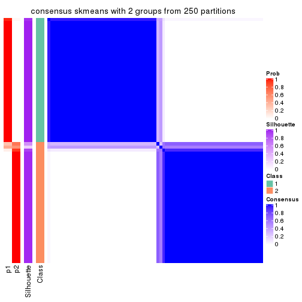</p>

</div>
<div id='tab-MAD-skmeans-consensus-heatmap-2'>
<pre><code class="r">consensus_heatmap(res, k = 3)
</code></pre>

<p>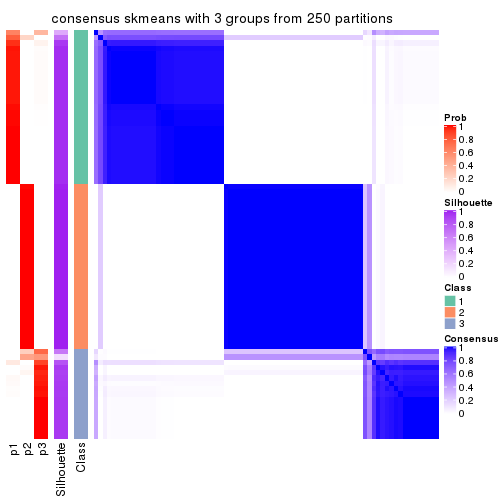</p>

</div>
<div id='tab-MAD-skmeans-consensus-heatmap-3'>
<pre><code class="r">consensus_heatmap(res, k = 4)
</code></pre>

<p></p>

</div>
<div id='tab-MAD-skmeans-consensus-heatmap-4'>
<pre><code class="r">consensus_heatmap(res, k = 5)
</code></pre>

<p></p>

</div>
<div id='tab-MAD-skmeans-consensus-heatmap-5'>
<pre><code class="r">consensus_heatmap(res, k = 6)
</code></pre>

<p></p>

</div>
</div>

Heatmaps for the membership of samples in all partitions to see how consistent they are:


<script>
$( function() {
	$( '#tabs-MAD-skmeans-membership-heatmap' ).tabs();
} );
</script>
<div id='tabs-MAD-skmeans-membership-heatmap'>
<ul>
<li><a href='#tab-MAD-skmeans-membership-heatmap-1'>k = 2</a></li>
<li><a href='#tab-MAD-skmeans-membership-heatmap-2'>k = 3</a></li>
<li><a href='#tab-MAD-skmeans-membership-heatmap-3'>k = 4</a></li>
<li><a href='#tab-MAD-skmeans-membership-heatmap-4'>k = 5</a></li>
<li><a href='#tab-MAD-skmeans-membership-heatmap-5'>k = 6</a></li>
</ul>
<div id='tab-MAD-skmeans-membership-heatmap-1'>
<pre><code class="r">membership_heatmap(res, k = 2)
</code></pre>

<p></p>

</div>
<div id='tab-MAD-skmeans-membership-heatmap-2'>
<pre><code class="r">membership_heatmap(res, k = 3)
</code></pre>

<p></p>

</div>
<div id='tab-MAD-skmeans-membership-heatmap-3'>
<pre><code class="r">membership_heatmap(res, k = 4)
</code></pre>

<p></p>

</div>
<div id='tab-MAD-skmeans-membership-heatmap-4'>
<pre><code class="r">membership_heatmap(res, k = 5)
</code></pre>

<p></p>

</div>
<div id='tab-MAD-skmeans-membership-heatmap-5'>
<pre><code class="r">membership_heatmap(res, k = 6)
</code></pre>

<p></p>

</div>
</div>

As soon as we have had the classes for columns, we can look for signatures
which are significantly different between classes which can be candidate marks
for certain classes. Following are the heatmaps for signatures.


Signature heatmaps where rows are scaled:


<script>
$( function() {
	$( '#tabs-MAD-skmeans-get-signatures' ).tabs();
} );
</script>
<div id='tabs-MAD-skmeans-get-signatures'>
<ul>
<li><a href='#tab-MAD-skmeans-get-signatures-1'>k = 2</a></li>
<li><a href='#tab-MAD-skmeans-get-signatures-2'>k = 3</a></li>
<li><a href='#tab-MAD-skmeans-get-signatures-3'>k = 4</a></li>
<li><a href='#tab-MAD-skmeans-get-signatures-4'>k = 5</a></li>
<li><a href='#tab-MAD-skmeans-get-signatures-5'>k = 6</a></li>
</ul>
<div id='tab-MAD-skmeans-get-signatures-1'>
<pre><code class="r">get_signatures(res, k = 2)
</code></pre>

<p></p>

</div>
<div id='tab-MAD-skmeans-get-signatures-2'>
<pre><code class="r">get_signatures(res, k = 3)
</code></pre>

<p></p>

</div>
<div id='tab-MAD-skmeans-get-signatures-3'>
<pre><code class="r">get_signatures(res, k = 4)
</code></pre>

<p></p>

</div>
<div id='tab-MAD-skmeans-get-signatures-4'>
<pre><code class="r">get_signatures(res, k = 5)
</code></pre>

<p></p>

</div>
<div id='tab-MAD-skmeans-get-signatures-5'>
<pre><code class="r">get_signatures(res, k = 6)
</code></pre>

<p></p>

</div>
</div>


Signature heatmaps where rows are not scaled:


<script>
$( function() {
	$( '#tabs-MAD-skmeans-get-signatures-no-scale' ).tabs();
} );
</script>
<div id='tabs-MAD-skmeans-get-signatures-no-scale'>
<ul>
<li><a href='#tab-MAD-skmeans-get-signatures-no-scale-1'>k = 2</a></li>
<li><a href='#tab-MAD-skmeans-get-signatures-no-scale-2'>k = 3</a></li>
<li><a href='#tab-MAD-skmeans-get-signatures-no-scale-3'>k = 4</a></li>
<li><a href='#tab-MAD-skmeans-get-signatures-no-scale-4'>k = 5</a></li>
<li><a href='#tab-MAD-skmeans-get-signatures-no-scale-5'>k = 6</a></li>
</ul>
<div id='tab-MAD-skmeans-get-signatures-no-scale-1'>
<pre><code class="r">get_signatures(res, k = 2, scale_rows = FALSE)
</code></pre>

<p></p>

</div>
<div id='tab-MAD-skmeans-get-signatures-no-scale-2'>
<pre><code class="r">get_signatures(res, k = 3, scale_rows = FALSE)
</code></pre>

<p></p>

</div>
<div id='tab-MAD-skmeans-get-signatures-no-scale-3'>
<pre><code class="r">get_signatures(res, k = 4, scale_rows = FALSE)
</code></pre>

<p></p>

</div>
<div id='tab-MAD-skmeans-get-signatures-no-scale-4'>
<pre><code class="r">get_signatures(res, k = 5, scale_rows = FALSE)
</code></pre>

<p></p>

</div>
<div id='tab-MAD-skmeans-get-signatures-no-scale-5'>
<pre><code class="r">get_signatures(res, k = 6, scale_rows = FALSE)
</code></pre>

<p></p>

</div>
</div>


Compare the overlap of signatures from different k:

```r
compare_signatures(res)
```


`get_signature()` returns a data frame invisibly. TO get the list of signatures, the function
call should be assigned to a variable explicitly. In following code, if `plot` argument is set
to `FALSE`, no heatmap is plotted while only the differential analysis is performed.

```r
# code only for demonstration
tb = get_signature(res, k = ..., plot = FALSE)
```

An example of the output of `tb` is:

```
#>   which_row         fdr    mean_1    mean_2 scaled_mean_1 scaled_mean_2 km
#> 1        38 0.042760348  8.373488  9.131774    -0.5533452     0.5164555  1
#> 2        40 0.018707592  7.106213  8.469186    -0.6173731     0.5762149  1
#> 3        55 0.019134737 10.221463 11.207825    -0.6159697     0.5749050  1
#> 4        59 0.006059896  5.921854  7.869574    -0.6899429     0.6439467  1
#> 5        60 0.018055526  8.928898 10.211722    -0.6204761     0.5791110  1
#> 6        98 0.009384629 15.714769 14.887706     0.6635654    -0.6193277  2
...
```

The columns in `tb` are:

1. `which_row`: row indices corresponding to the input matrix.
2. `fdr`: FDR for the differential test. 
3. `mean_x`: The mean value in group x.
4. `scaled_mean_x`: The mean value in group x after rows are scaled.
5. `km`: Row groups if k-means clustering is applied to rows.


UMAP plot which shows how samples are separated.


<script>
$( function() {
	$( '#tabs-MAD-skmeans-dimension-reduction' ).tabs();
} );
</script>
<div id='tabs-MAD-skmeans-dimension-reduction'>
<ul>
<li><a href='#tab-MAD-skmeans-dimension-reduction-1'>k = 2</a></li>
<li><a href='#tab-MAD-skmeans-dimension-reduction-2'>k = 3</a></li>
<li><a href='#tab-MAD-skmeans-dimension-reduction-3'>k = 4</a></li>
<li><a href='#tab-MAD-skmeans-dimension-reduction-4'>k = 5</a></li>
<li><a href='#tab-MAD-skmeans-dimension-reduction-5'>k = 6</a></li>
</ul>
<div id='tab-MAD-skmeans-dimension-reduction-1'>
<pre><code class="r">dimension_reduction(res, k = 2, method = &quot;UMAP&quot;)
</code></pre>

<p></p>

</div>
<div id='tab-MAD-skmeans-dimension-reduction-2'>
<pre><code class="r">dimension_reduction(res, k = 3, method = &quot;UMAP&quot;)
</code></pre>

<p></p>

</div>
<div id='tab-MAD-skmeans-dimension-reduction-3'>
<pre><code class="r">dimension_reduction(res, k = 4, method = &quot;UMAP&quot;)
</code></pre>

<p></p>

</div>
<div id='tab-MAD-skmeans-dimension-reduction-4'>
<pre><code class="r">dimension_reduction(res, k = 5, method = &quot;UMAP&quot;)
</code></pre>

<p></p>

</div>
<div id='tab-MAD-skmeans-dimension-reduction-5'>
<pre><code class="r">dimension_reduction(res, k = 6, method = &quot;UMAP&quot;)
</code></pre>

<p></p>

</div>
</div>


Following heatmap shows how subgroups are split when increasing `k`:

```r
collect_classes(res)
```


If matrix rows can be associated to genes, consider to use `GO_Enrichment(res,
...)` to perform function enrichment for the signature genes.


 

---------------------------------------------------


### MAD:pam


The object with results only for a single top-value method and a single partition method 
can be extracted as:

```r
res = res_list["MAD", "pam"]
# you can also extract it by
# res = res_list["MAD:pam"]
```

A summary of `res` and all the functions that can be applied to it:

```r
res
```

```
#> A 'ConsensusPartition' object with k = 2, 3, 4, 5, 6.
#>   On a matrix with 9427 rows and 77 columns.
#>   Top rows (943, 1886, 2828, 3771, 4714) are extracted by 'MAD' method.
#>   Subgroups are detected by 'pam' method.
#>   Performed in total 1250 partitions by row resampling.
#>   Best k for subgroups seems to be 2.
#> 
#> Following methods can be applied to this 'ConsensusPartition' object:
#>  [1] "cola_report"             "collect_classes"         "collect_plots"          
#>  [4] "collect_stats"           "colnames"                "compare_signatures"     
#>  [7] "consensus_heatmap"       "dimension_reduction"     "functional_enrichment"  
#> [10] "get_anno_col"            "get_anno"                "get_classes"            
#> [13] "get_consensus"           "get_matrix"              "get_membership"         
#> [16] "get_param"               "get_signatures"          "get_stats"              
#> [19] "is_best_k"               "is_stable_k"             "membership_heatmap"     
#> [22] "ncol"                    "nrow"                    "plot_ecdf"              
#> [25] "rownames"                "select_partition_number" "show"                   
#> [28] "suggest_best_k"          "test_to_known_factors"
```

`collect_plots()` function collects all the plots made from `res` for all `k` (number of partitions)
into one single page to provide an easy and fast comparison between different `k`.

```r
collect_plots(res)
```


The plots are:

- The first row: a plot of the ECDF (Empirical cumulative distribution
  function) curves of the consensus matrix for each `k` and the heatmap of
  predicted classes for each `k`.
- The second row: heatmaps of the consensus matrix for each `k`.
- The third row: heatmaps of the membership matrix for each `k`.
- The fouth row: heatmaps of the signatures for each `k`.

All the plots in panels can be made by individual functions and they are
plotted later in this section.

`select_partition_number()` produces several plots showing different
statistics for choosing "optimized" `k`. There are following statistics:

- ECDF curves of the consensus matrix for each `k`;
- 1-PAC. [The PAC
  score](https://en.wikipedia.org/wiki/Consensus_clustering#Over-interpretation_potential_of_consensus_clustering)
  measures the proportion of the ambiguous subgrouping.
- Mean silhouette score.
- Concordance. The mean probability of fiting the consensus class ids in all
  partitions.
- Area increased. Denote $A_k$ as the area under the ECDF curve for current
  `k`, the area increased is defined as $A_k - A_{k-1}$.
- Rand index. The percent of pairs of samples that are both in a same cluster
  or both are not in a same cluster in the partition of k and k-1.
- Jaccard index. The ratio of pairs of samples are both in a same cluster in
  the partition of k and k-1 and the pairs of samples are both in a same
  cluster in the partition k or k-1.

The detailed explanations of these statistics can be found in [the cola
vignette](http://bioconductor.org/packages/devel/bioc/vignettes/cola/inst/doc/cola.html#toc_13).

Generally speaking, lower PAC score, higher mean silhouette score or higher
concordance corresponds to better partition. Rand index and Jaccard index
measure how similar the current partition is compared to partition with `k-1`.
If they are too similar, we won't accept `k` is better than `k-1`.

```r
select_partition_number(res)
```


The numeric values for all these statistics can be obtained by `get_stats()`.

```r
get_stats(res)
```

```
#>   k 1-PAC mean_silhouette concordance area_increased  Rand Jaccard
#> 2 2 0.793           0.882       0.951         0.5018 0.494   0.494
#> 3 3 0.612           0.713       0.851         0.2041 0.885   0.771
#> 4 4 0.770           0.783       0.909         0.1368 0.876   0.702
#> 5 5 0.737           0.653       0.830         0.0517 0.947   0.837
#> 6 6 0.753           0.687       0.818         0.0370 0.964   0.881
```

`suggest_best_k()` suggests the best $k$ based on these statistics. The rules are as follows:

- All $k$ with Jaccard index larger than 0.95 are removed because the increase of
  the partition number does not provides enough extra information. If all $k$ are removed,
  the best $k$ is assigned by `NA`.
- For $k$ with 1-PAC larger than 0.9, the maximal $k$ is taken as the "best k". Other $k$ is called "optional k".
- If it does not fit the second rule. The $k$ with the highest vote of highest
  1-PAC, mean silhouette and concordance is taken as the "best k".

```r
suggest_best_k(res)
```

```
#> [1] 2
```


Following shows the table of the partitions (You need to click the **show/hide
code output** link to see it). The membership matrix (columns with name `p*`)
is inferred by
[`clue::cl_consensus()`](https://www.rdocumentation.org/link/cl_consensus?package=clue)
function with the `SE` method. Basically the value in the membership matrix
represents the probability to belong to a certain group. The finall class
label for an item is determined with the group with highest probability it
belongs to.

In `get_classes()` function, the entropy is calculated from the membership
matrix and the silhouette score is calculated from the consensus matrix.


<script>
$( function() {
	$( '#tabs-MAD-pam-get-classes' ).tabs();
} );
</script>
<div id='tabs-MAD-pam-get-classes'>
<ul>
<li><a href='#tab-MAD-pam-get-classes-1'>k = 2</a></li>
<li><a href='#tab-MAD-pam-get-classes-2'>k = 3</a></li>
<li><a href='#tab-MAD-pam-get-classes-3'>k = 4</a></li>
<li><a href='#tab-MAD-pam-get-classes-4'>k = 5</a></li>
<li><a href='#tab-MAD-pam-get-classes-5'>k = 6</a></li>
</ul>

<div id='tab-MAD-pam-get-classes-1'>
<p><a id='tab-MAD-pam-get-classes-1-a' style='color:#0366d6' href='#'>show/hide code output</a></p>
<pre><code class="r">cbind(get_classes(res, k = 2), get_membership(res, k = 2))
</code></pre>

<pre><code>#&gt;           class entropy silhouette    p1    p2
#&gt; SRR944011     1   0.802     0.6880 0.756 0.244
#&gt; SRR944012     1   0.000     0.9373 1.000 0.000
#&gt; SRR944014     2   0.000     0.9518 0.000 1.000
#&gt; SRR944013     2   0.163     0.9360 0.024 0.976
#&gt; SRR944015     1   0.000     0.9373 1.000 0.000
#&gt; SRR944016     1   0.917     0.5051 0.668 0.332
#&gt; SRR944017     2   0.000     0.9518 0.000 1.000
#&gt; SRR944018     1   0.000     0.9373 1.000 0.000
#&gt; SRR944019     1   0.821     0.6634 0.744 0.256
#&gt; SRR944020     1   0.000     0.9373 1.000 0.000
#&gt; SRR944021     2   0.000     0.9518 0.000 1.000
#&gt; SRR944022     1   0.000     0.9373 1.000 0.000
#&gt; SRR944023     1   0.000     0.9373 1.000 0.000
#&gt; SRR944024     1   0.000     0.9373 1.000 0.000
#&gt; SRR944026     2   0.000     0.9518 0.000 1.000
#&gt; SRR944025     2   0.000     0.9518 0.000 1.000
#&gt; SRR944028     2   0.000     0.9518 0.000 1.000
#&gt; SRR944029     1   0.821     0.6714 0.744 0.256
#&gt; SRR944030     2   0.000     0.9518 0.000 1.000
#&gt; SRR944031     1   0.000     0.9373 1.000 0.000
#&gt; SRR944032     2   0.000     0.9518 0.000 1.000
#&gt; SRR944033     2   0.000     0.9518 0.000 1.000
#&gt; SRR944034     2   0.000     0.9518 0.000 1.000
#&gt; SRR944036     1   0.184     0.9180 0.972 0.028
#&gt; SRR944035     2   0.000     0.9518 0.000 1.000
#&gt; SRR944038     1   0.000     0.9373 1.000 0.000
#&gt; SRR944037     1   0.000     0.9373 1.000 0.000
#&gt; SRR944039     1   0.000     0.9373 1.000 0.000
#&gt; SRR944040     2   0.000     0.9518 0.000 1.000
#&gt; SRR944041     1   0.000     0.9373 1.000 0.000
#&gt; SRR944042     1   0.000     0.9373 1.000 0.000
#&gt; SRR944043     1   0.000     0.9373 1.000 0.000
#&gt; SRR944044     2   0.000     0.9518 0.000 1.000
#&gt; SRR944046     1   0.000     0.9373 1.000 0.000
#&gt; SRR944045     2   0.000     0.9518 0.000 1.000
#&gt; SRR944047     2   0.000     0.9518 0.000 1.000
#&gt; SRR944048     2   0.358     0.8965 0.068 0.932
#&gt; SRR944049     2   0.000     0.9518 0.000 1.000
#&gt; SRR944050     2   0.745     0.7109 0.212 0.788
#&gt; SRR944051     2   0.000     0.9518 0.000 1.000
#&gt; SRR944052     2   0.000     0.9518 0.000 1.000
#&gt; SRR944053     1   0.000     0.9373 1.000 0.000
#&gt; SRR944054     2   0.141     0.9392 0.020 0.980
#&gt; SRR944055     2   0.295     0.9109 0.052 0.948
#&gt; SRR944056     2   0.000     0.9518 0.000 1.000
#&gt; SRR944057     1   0.000     0.9373 1.000 0.000
#&gt; SRR944058     1   0.000     0.9373 1.000 0.000
#&gt; SRR944059     2   0.861     0.5853 0.284 0.716
#&gt; SRR944060     1   0.000     0.9373 1.000 0.000
#&gt; SRR944061     2   0.000     0.9518 0.000 1.000
#&gt; SRR944062     1   0.000     0.9373 1.000 0.000
#&gt; SRR944063     1   0.000     0.9373 1.000 0.000
#&gt; SRR944064     2   0.000     0.9518 0.000 1.000
#&gt; SRR944065     1   0.000     0.9373 1.000 0.000
#&gt; SRR944066     1   0.000     0.9373 1.000 0.000
#&gt; SRR944067     2   0.000     0.9518 0.000 1.000
#&gt; SRR944068     1   0.000     0.9373 1.000 0.000
#&gt; SRR944069     2   0.000     0.9518 0.000 1.000
#&gt; SRR944070     1   0.000     0.9373 1.000 0.000
#&gt; SRR944071     1   0.745     0.7324 0.788 0.212
#&gt; SRR944072     1   0.000     0.9373 1.000 0.000
#&gt; SRR944073     2   0.000     0.9518 0.000 1.000
#&gt; SRR944075     2   1.000    -0.0218 0.488 0.512
#&gt; SRR944074     2   0.000     0.9518 0.000 1.000
#&gt; SRR944076     1   0.000     0.9373 1.000 0.000
#&gt; SRR944077     2   0.000     0.9518 0.000 1.000
#&gt; SRR944078     2   0.118     0.9419 0.016 0.984
#&gt; SRR944079     2   0.000     0.9518 0.000 1.000
#&gt; SRR944080     2   0.000     0.9518 0.000 1.000
#&gt; SRR944081     2   0.966     0.3322 0.392 0.608
#&gt; SRR944082     1   0.000     0.9373 1.000 0.000
#&gt; SRR944083     1   0.000     0.9373 1.000 0.000
#&gt; SRR944084     1   0.866     0.6194 0.712 0.288
#&gt; SRR944085     1   0.767     0.7187 0.776 0.224
#&gt; SRR944086     1   0.929     0.5082 0.656 0.344
#&gt; SRR944088     2   0.327     0.9046 0.060 0.940
#&gt; SRR944087     1   0.000     0.9373 1.000 0.000
</code></pre>

<script>
$('#tab-MAD-pam-get-classes-1-a').parent().next().next().hide();
$('#tab-MAD-pam-get-classes-1-a').click(function(){
  $('#tab-MAD-pam-get-classes-1-a').parent().next().next().toggle();
  return(false);
});
</script>
</div>

<div id='tab-MAD-pam-get-classes-2'>
<p><a id='tab-MAD-pam-get-classes-2-a' style='color:#0366d6' href='#'>show/hide code output</a></p>
<pre><code class="r">cbind(get_classes(res, k = 3), get_membership(res, k = 3))
</code></pre>

<pre><code>#&gt;           class entropy silhouette    p1    p2    p3
#&gt; SRR944011     1  0.9718     0.3611 0.452 0.288 0.260
#&gt; SRR944012     1  0.2625     0.6630 0.916 0.000 0.084
#&gt; SRR944014     2  0.0000     0.9291 0.000 1.000 0.000
#&gt; SRR944013     2  0.3412     0.8263 0.124 0.876 0.000
#&gt; SRR944015     3  0.0000     0.8313 0.000 0.000 1.000
#&gt; SRR944016     1  0.0892     0.6589 0.980 0.020 0.000
#&gt; SRR944017     2  0.0237     0.9270 0.004 0.996 0.000
#&gt; SRR944018     1  0.2356     0.6739 0.928 0.000 0.072
#&gt; SRR944019     1  0.4446     0.5809 0.856 0.032 0.112
#&gt; SRR944020     3  0.0592     0.8299 0.012 0.000 0.988
#&gt; SRR944021     2  0.0000     0.9291 0.000 1.000 0.000
#&gt; SRR944022     3  0.0592     0.8288 0.012 0.000 0.988
#&gt; SRR944023     1  0.5216     0.6256 0.740 0.000 0.260
#&gt; SRR944024     1  0.1289     0.6752 0.968 0.000 0.032
#&gt; SRR944026     2  0.0000     0.9291 0.000 1.000 0.000
#&gt; SRR944025     2  0.0000     0.9291 0.000 1.000 0.000
#&gt; SRR944028     2  0.0000     0.9291 0.000 1.000 0.000
#&gt; SRR944029     1  0.9676     0.3690 0.460 0.288 0.252
#&gt; SRR944030     2  0.0000     0.9291 0.000 1.000 0.000
#&gt; SRR944031     1  0.5216     0.6256 0.740 0.000 0.260
#&gt; SRR944032     2  0.0237     0.9269 0.004 0.996 0.000
#&gt; SRR944033     2  0.0000     0.9291 0.000 1.000 0.000
#&gt; SRR944034     2  0.0000     0.9291 0.000 1.000 0.000
#&gt; SRR944036     1  0.6224     0.6286 0.728 0.032 0.240
#&gt; SRR944035     2  0.0000     0.9291 0.000 1.000 0.000
#&gt; SRR944038     3  0.5835     0.3749 0.340 0.000 0.660
#&gt; SRR944037     3  0.5178     0.5282 0.256 0.000 0.744
#&gt; SRR944039     1  0.3038     0.5985 0.896 0.000 0.104
#&gt; SRR944040     2  0.0000     0.9291 0.000 1.000 0.000
#&gt; SRR944041     1  0.6154     0.4262 0.592 0.000 0.408
#&gt; SRR944042     1  0.5216     0.6256 0.740 0.000 0.260
#&gt; SRR944043     1  0.5529     0.5732 0.704 0.000 0.296
#&gt; SRR944044     2  0.0000     0.9291 0.000 1.000 0.000
#&gt; SRR944046     1  0.5216     0.6256 0.740 0.000 0.260
#&gt; SRR944045     2  0.1289     0.9086 0.032 0.968 0.000
#&gt; SRR944047     2  0.0000     0.9291 0.000 1.000 0.000
#&gt; SRR944048     2  0.6244     0.3176 0.440 0.560 0.000
#&gt; SRR944049     2  0.0000     0.9291 0.000 1.000 0.000
#&gt; SRR944050     2  0.6095     0.3439 0.392 0.608 0.000
#&gt; SRR944051     2  0.0000     0.9291 0.000 1.000 0.000
#&gt; SRR944052     2  0.0000     0.9291 0.000 1.000 0.000
#&gt; SRR944053     3  0.0237     0.8306 0.004 0.000 0.996
#&gt; SRR944054     2  0.2878     0.8554 0.096 0.904 0.000
#&gt; SRR944055     2  0.3349     0.8406 0.108 0.888 0.004
#&gt; SRR944056     2  0.0000     0.9291 0.000 1.000 0.000
#&gt; SRR944057     1  0.0000     0.6648 1.000 0.000 0.000
#&gt; SRR944058     1  0.4062     0.5140 0.836 0.000 0.164
#&gt; SRR944059     2  0.6314     0.2998 0.392 0.604 0.004
#&gt; SRR944060     1  0.6267     0.3115 0.548 0.000 0.452
#&gt; SRR944061     2  0.0000     0.9291 0.000 1.000 0.000
#&gt; SRR944062     1  0.2066     0.6741 0.940 0.000 0.060
#&gt; SRR944063     3  0.2959     0.7508 0.100 0.000 0.900
#&gt; SRR944064     2  0.0000     0.9291 0.000 1.000 0.000
#&gt; SRR944065     1  0.5098     0.6254 0.752 0.000 0.248
#&gt; SRR944066     1  0.0747     0.6612 0.984 0.000 0.016
#&gt; SRR944067     2  0.0000     0.9291 0.000 1.000 0.000
#&gt; SRR944068     3  0.0000     0.8313 0.000 0.000 1.000
#&gt; SRR944069     2  0.0000     0.9291 0.000 1.000 0.000
#&gt; SRR944070     3  0.4974     0.5916 0.236 0.000 0.764
#&gt; SRR944071     1  0.9536     0.4000 0.488 0.252 0.260
#&gt; SRR944072     1  0.1753     0.6455 0.952 0.000 0.048
#&gt; SRR944073     2  0.0000     0.9291 0.000 1.000 0.000
#&gt; SRR944075     2  0.8402     0.0829 0.376 0.532 0.092
#&gt; SRR944074     2  0.0000     0.9291 0.000 1.000 0.000
#&gt; SRR944076     1  0.5216     0.6256 0.740 0.000 0.260
#&gt; SRR944077     2  0.0000     0.9291 0.000 1.000 0.000
#&gt; SRR944078     2  0.3192     0.8399 0.112 0.888 0.000
#&gt; SRR944079     2  0.0000     0.9291 0.000 1.000 0.000
#&gt; SRR944080     2  0.0000     0.9291 0.000 1.000 0.000
#&gt; SRR944081     1  0.6495     0.1398 0.536 0.460 0.004
#&gt; SRR944082     1  0.1753     0.6762 0.952 0.000 0.048
#&gt; SRR944083     1  0.0000     0.6648 1.000 0.000 0.000
#&gt; SRR944084     1  0.9633     0.3694 0.464 0.300 0.236
#&gt; SRR944085     1  0.7878     0.5689 0.668 0.172 0.160
#&gt; SRR944086     1  0.9442     0.3357 0.456 0.360 0.184
#&gt; SRR944088     2  0.2066     0.8868 0.060 0.940 0.000
#&gt; SRR944087     1  0.5216     0.6256 0.740 0.000 0.260
</code></pre>

<script>
$('#tab-MAD-pam-get-classes-2-a').parent().next().next().hide();
$('#tab-MAD-pam-get-classes-2-a').click(function(){
  $('#tab-MAD-pam-get-classes-2-a').parent().next().next().toggle();
  return(false);
});
</script>
</div>

<div id='tab-MAD-pam-get-classes-3'>
<p><a id='tab-MAD-pam-get-classes-3-a' style='color:#0366d6' href='#'>show/hide code output</a></p>
<pre><code class="r">cbind(get_classes(res, k = 4), get_membership(res, k = 4))
</code></pre>

<pre><code>#&gt;           class entropy silhouette    p1    p2    p3    p4
#&gt; SRR944011     3  0.0336     0.8309 0.000 0.008 0.992 0.000
#&gt; SRR944012     1  0.4123     0.6926 0.772 0.000 0.220 0.008
#&gt; SRR944014     2  0.0000     0.9604 0.000 1.000 0.000 0.000
#&gt; SRR944013     2  0.1211     0.9298 0.000 0.960 0.040 0.000
#&gt; SRR944015     4  0.0000     0.8513 0.000 0.000 0.000 1.000
#&gt; SRR944016     1  0.3123     0.7170 0.844 0.000 0.156 0.000
#&gt; SRR944017     2  0.0000     0.9604 0.000 1.000 0.000 0.000
#&gt; SRR944018     3  0.4482     0.5124 0.264 0.000 0.728 0.008
#&gt; SRR944019     1  0.5204     0.4504 0.612 0.000 0.376 0.012
#&gt; SRR944020     4  0.0000     0.8513 0.000 0.000 0.000 1.000
#&gt; SRR944021     2  0.0000     0.9604 0.000 1.000 0.000 0.000
#&gt; SRR944022     4  0.0000     0.8513 0.000 0.000 0.000 1.000
#&gt; SRR944023     3  0.0000     0.8312 0.000 0.000 1.000 0.000
#&gt; SRR944024     1  0.3356     0.7252 0.824 0.000 0.176 0.000
#&gt; SRR944026     2  0.0000     0.9604 0.000 1.000 0.000 0.000
#&gt; SRR944025     2  0.0000     0.9604 0.000 1.000 0.000 0.000
#&gt; SRR944028     2  0.0000     0.9604 0.000 1.000 0.000 0.000
#&gt; SRR944029     3  0.0336     0.8307 0.000 0.008 0.992 0.000
#&gt; SRR944030     2  0.0000     0.9604 0.000 1.000 0.000 0.000
#&gt; SRR944031     3  0.0000     0.8312 0.000 0.000 1.000 0.000
#&gt; SRR944032     2  0.0188     0.9577 0.000 0.996 0.004 0.000
#&gt; SRR944033     2  0.0000     0.9604 0.000 1.000 0.000 0.000
#&gt; SRR944034     2  0.0000     0.9604 0.000 1.000 0.000 0.000
#&gt; SRR944036     3  0.0469     0.8296 0.000 0.012 0.988 0.000
#&gt; SRR944035     2  0.0000     0.9604 0.000 1.000 0.000 0.000
#&gt; SRR944038     4  0.4994     0.1480 0.000 0.000 0.480 0.520
#&gt; SRR944037     4  0.4730     0.4403 0.000 0.000 0.364 0.636
#&gt; SRR944039     1  0.4936     0.4608 0.624 0.000 0.372 0.004
#&gt; SRR944040     2  0.0000     0.9604 0.000 1.000 0.000 0.000
#&gt; SRR944041     3  0.5982    -0.0699 0.436 0.000 0.524 0.040
#&gt; SRR944042     3  0.0000     0.8312 0.000 0.000 1.000 0.000
#&gt; SRR944043     3  0.6637     0.2458 0.324 0.000 0.572 0.104
#&gt; SRR944044     2  0.0000     0.9604 0.000 1.000 0.000 0.000
#&gt; SRR944046     3  0.0000     0.8312 0.000 0.000 1.000 0.000
#&gt; SRR944045     2  0.0188     0.9577 0.000 0.996 0.004 0.000
#&gt; SRR944047     2  0.0000     0.9604 0.000 1.000 0.000 0.000
#&gt; SRR944048     1  0.0921     0.7451 0.972 0.000 0.028 0.000
#&gt; SRR944049     2  0.0000     0.9604 0.000 1.000 0.000 0.000
#&gt; SRR944050     2  0.6374     0.4007 0.324 0.592 0.084 0.000
#&gt; SRR944051     2  0.0000     0.9604 0.000 1.000 0.000 0.000
#&gt; SRR944052     2  0.0000     0.9604 0.000 1.000 0.000 0.000
#&gt; SRR944053     4  0.0000     0.8513 0.000 0.000 0.000 1.000
#&gt; SRR944054     2  0.0921     0.9394 0.000 0.972 0.028 0.000
#&gt; SRR944055     2  0.3764     0.7188 0.000 0.784 0.216 0.000
#&gt; SRR944056     2  0.0000     0.9604 0.000 1.000 0.000 0.000
#&gt; SRR944057     1  0.4888     0.3514 0.588 0.000 0.412 0.000
#&gt; SRR944058     1  0.0000     0.7410 1.000 0.000 0.000 0.000
#&gt; SRR944059     2  0.4746     0.4109 0.000 0.632 0.368 0.000
#&gt; SRR944060     3  0.2530     0.7543 0.000 0.000 0.888 0.112
#&gt; SRR944061     2  0.0000     0.9604 0.000 1.000 0.000 0.000
#&gt; SRR944062     1  0.3569     0.7038 0.804 0.000 0.196 0.000
#&gt; SRR944063     4  0.0000     0.8513 0.000 0.000 0.000 1.000
#&gt; SRR944064     2  0.0000     0.9604 0.000 1.000 0.000 0.000
#&gt; SRR944065     1  0.5517     0.3126 0.568 0.000 0.412 0.020
#&gt; SRR944066     1  0.0000     0.7410 1.000 0.000 0.000 0.000
#&gt; SRR944067     2  0.0000     0.9604 0.000 1.000 0.000 0.000
#&gt; SRR944068     4  0.0000     0.8513 0.000 0.000 0.000 1.000
#&gt; SRR944069     2  0.0000     0.9604 0.000 1.000 0.000 0.000
#&gt; SRR944070     3  0.3610     0.6432 0.000 0.000 0.800 0.200
#&gt; SRR944071     3  0.0000     0.8312 0.000 0.000 1.000 0.000
#&gt; SRR944072     1  0.0000     0.7410 1.000 0.000 0.000 0.000
#&gt; SRR944073     2  0.0000     0.9604 0.000 1.000 0.000 0.000
#&gt; SRR944075     3  0.4356     0.4865 0.000 0.292 0.708 0.000
#&gt; SRR944074     2  0.0000     0.9604 0.000 1.000 0.000 0.000
#&gt; SRR944076     3  0.0000     0.8312 0.000 0.000 1.000 0.000
#&gt; SRR944077     2  0.0000     0.9604 0.000 1.000 0.000 0.000
#&gt; SRR944078     2  0.2216     0.8806 0.000 0.908 0.092 0.000
#&gt; SRR944079     2  0.0000     0.9604 0.000 1.000 0.000 0.000
#&gt; SRR944080     2  0.0000     0.9604 0.000 1.000 0.000 0.000
#&gt; SRR944081     3  0.5944     0.5019 0.140 0.164 0.696 0.000
#&gt; SRR944082     1  0.3311     0.7264 0.828 0.000 0.172 0.000
#&gt; SRR944083     1  0.0000     0.7410 1.000 0.000 0.000 0.000
#&gt; SRR944084     3  0.0817     0.8229 0.000 0.024 0.976 0.000
#&gt; SRR944085     3  0.2973     0.6998 0.000 0.144 0.856 0.000
#&gt; SRR944086     3  0.1545     0.8092 0.008 0.040 0.952 0.000
#&gt; SRR944088     2  0.2149     0.8838 0.000 0.912 0.088 0.000
#&gt; SRR944087     3  0.0000     0.8312 0.000 0.000 1.000 0.000
</code></pre>

<script>
$('#tab-MAD-pam-get-classes-3-a').parent().next().next().hide();
$('#tab-MAD-pam-get-classes-3-a').click(function(){
  $('#tab-MAD-pam-get-classes-3-a').parent().next().next().toggle();
  return(false);
});
</script>
</div>

<div id='tab-MAD-pam-get-classes-4'>
<p><a id='tab-MAD-pam-get-classes-4-a' style='color:#0366d6' href='#'>show/hide code output</a></p>
<pre><code class="r">cbind(get_classes(res, k = 5), get_membership(res, k = 5))
</code></pre>

<pre><code>#&gt;           class entropy silhouette    p1    p2    p3    p4    p5
#&gt; SRR944011     3  0.2583     0.5941 0.000 0.004 0.864 0.000 0.132
#&gt; SRR944012     1  0.5823     0.3259 0.628 0.000 0.184 0.004 0.184
#&gt; SRR944014     2  0.0000     0.9492 0.000 1.000 0.000 0.000 0.000
#&gt; SRR944013     2  0.3400     0.8560 0.000 0.828 0.036 0.000 0.136
#&gt; SRR944015     4  0.0162     0.9408 0.000 0.000 0.000 0.996 0.004
#&gt; SRR944016     1  0.6420     0.0154 0.496 0.000 0.204 0.000 0.300
#&gt; SRR944017     2  0.0000     0.9492 0.000 1.000 0.000 0.000 0.000
#&gt; SRR944018     3  0.5847     0.1417 0.204 0.000 0.608 0.000 0.188
#&gt; SRR944019     5  0.6608     0.1616 0.300 0.000 0.244 0.000 0.456
#&gt; SRR944020     4  0.2690     0.8616 0.000 0.000 0.000 0.844 0.156
#&gt; SRR944021     2  0.0000     0.9492 0.000 1.000 0.000 0.000 0.000
#&gt; SRR944022     4  0.1341     0.9364 0.000 0.000 0.000 0.944 0.056
#&gt; SRR944023     3  0.0000     0.6015 0.000 0.000 1.000 0.000 0.000
#&gt; SRR944024     1  0.3527     0.4940 0.804 0.000 0.172 0.000 0.024
#&gt; SRR944026     2  0.1732     0.9238 0.000 0.920 0.000 0.000 0.080
#&gt; SRR944025     2  0.0880     0.9424 0.000 0.968 0.000 0.000 0.032
#&gt; SRR944028     2  0.1478     0.9318 0.000 0.936 0.000 0.000 0.064
#&gt; SRR944029     3  0.2605     0.5019 0.000 0.000 0.852 0.000 0.148
#&gt; SRR944030     2  0.0000     0.9492 0.000 1.000 0.000 0.000 0.000
#&gt; SRR944031     3  0.2561     0.5848 0.000 0.000 0.856 0.000 0.144
#&gt; SRR944032     2  0.1608     0.9281 0.000 0.928 0.000 0.000 0.072
#&gt; SRR944033     2  0.0000     0.9492 0.000 1.000 0.000 0.000 0.000
#&gt; SRR944034     2  0.0000     0.9492 0.000 1.000 0.000 0.000 0.000
#&gt; SRR944036     3  0.0451     0.6030 0.000 0.008 0.988 0.000 0.004
#&gt; SRR944035     2  0.0880     0.9424 0.000 0.968 0.000 0.000 0.032
#&gt; SRR944038     3  0.6763     0.0400 0.000 0.000 0.392 0.332 0.276
#&gt; SRR944037     5  0.6403     0.0128 0.000 0.000 0.256 0.232 0.512
#&gt; SRR944039     5  0.6655     0.1829 0.296 0.000 0.260 0.000 0.444
#&gt; SRR944040     2  0.0000     0.9492 0.000 1.000 0.000 0.000 0.000
#&gt; SRR944041     5  0.6453     0.0964 0.184 0.000 0.272 0.008 0.536
#&gt; SRR944042     3  0.3636     0.5365 0.000 0.000 0.728 0.000 0.272
#&gt; SRR944043     3  0.6947     0.1090 0.172 0.000 0.584 0.084 0.160
#&gt; SRR944044     2  0.1478     0.9299 0.000 0.936 0.000 0.000 0.064
#&gt; SRR944046     3  0.3636     0.5365 0.000 0.000 0.728 0.000 0.272
#&gt; SRR944045     2  0.0290     0.9465 0.000 0.992 0.008 0.000 0.000
#&gt; SRR944047     2  0.0000     0.9492 0.000 1.000 0.000 0.000 0.000
#&gt; SRR944048     1  0.1386     0.5750 0.952 0.000 0.032 0.000 0.016
#&gt; SRR944049     2  0.0290     0.9478 0.000 0.992 0.000 0.000 0.008
#&gt; SRR944050     1  0.7737     0.0168 0.324 0.324 0.052 0.000 0.300
#&gt; SRR944051     2  0.1732     0.9238 0.000 0.920 0.000 0.000 0.080
#&gt; SRR944052     2  0.0000     0.9492 0.000 1.000 0.000 0.000 0.000
#&gt; SRR944053     4  0.0000     0.9414 0.000 0.000 0.000 1.000 0.000
#&gt; SRR944054     2  0.3064     0.8706 0.000 0.856 0.036 0.000 0.108
#&gt; SRR944055     2  0.3419     0.7637 0.000 0.804 0.180 0.000 0.016
#&gt; SRR944056     2  0.0000     0.9492 0.000 1.000 0.000 0.000 0.000
#&gt; SRR944057     1  0.6248     0.1076 0.524 0.000 0.176 0.000 0.300
#&gt; SRR944058     1  0.0000     0.5794 1.000 0.000 0.000 0.000 0.000
#&gt; SRR944059     2  0.4210     0.3423 0.000 0.588 0.412 0.000 0.000
#&gt; SRR944060     3  0.4768     0.4753 0.000 0.000 0.656 0.040 0.304
#&gt; SRR944061     2  0.0000     0.9492 0.000 1.000 0.000 0.000 0.000
#&gt; SRR944062     1  0.4634     0.3754 0.744 0.000 0.120 0.000 0.136
#&gt; SRR944063     4  0.1608     0.9298 0.000 0.000 0.000 0.928 0.072
#&gt; SRR944064     2  0.0880     0.9424 0.000 0.968 0.000 0.000 0.032
#&gt; SRR944065     3  0.6917    -0.0907 0.312 0.000 0.388 0.004 0.296
#&gt; SRR944066     1  0.1792     0.5556 0.916 0.000 0.000 0.000 0.084
#&gt; SRR944067     2  0.0880     0.9424 0.000 0.968 0.000 0.000 0.032
#&gt; SRR944068     4  0.0162     0.9408 0.000 0.000 0.000 0.996 0.004
#&gt; SRR944069     2  0.0000     0.9492 0.000 1.000 0.000 0.000 0.000
#&gt; SRR944070     3  0.5275     0.4558 0.000 0.000 0.640 0.084 0.276
#&gt; SRR944071     3  0.0609     0.6041 0.000 0.000 0.980 0.000 0.020
#&gt; SRR944072     1  0.3966     0.3633 0.664 0.000 0.000 0.000 0.336
#&gt; SRR944073     2  0.0000     0.9492 0.000 1.000 0.000 0.000 0.000
#&gt; SRR944075     3  0.5490     0.1973 0.000 0.372 0.556 0.000 0.072
#&gt; SRR944074     2  0.1671     0.9256 0.000 0.924 0.000 0.000 0.076
#&gt; SRR944076     3  0.0000     0.6015 0.000 0.000 1.000 0.000 0.000
#&gt; SRR944077     2  0.0000     0.9492 0.000 1.000 0.000 0.000 0.000
#&gt; SRR944078     2  0.1544     0.9089 0.000 0.932 0.068 0.000 0.000
#&gt; SRR944079     2  0.0000     0.9492 0.000 1.000 0.000 0.000 0.000
#&gt; SRR944080     2  0.0000     0.9492 0.000 1.000 0.000 0.000 0.000
#&gt; SRR944081     3  0.5606     0.1619 0.000 0.104 0.600 0.000 0.296
#&gt; SRR944082     1  0.3282     0.4875 0.804 0.000 0.188 0.000 0.008
#&gt; SRR944083     1  0.0162     0.5795 0.996 0.000 0.000 0.000 0.004
#&gt; SRR944084     3  0.1800     0.5785 0.000 0.020 0.932 0.000 0.048
#&gt; SRR944085     3  0.2561     0.4860 0.000 0.144 0.856 0.000 0.000
#&gt; SRR944086     3  0.2582     0.5531 0.004 0.024 0.892 0.000 0.080
#&gt; SRR944088     2  0.3409     0.8385 0.000 0.824 0.032 0.000 0.144
#&gt; SRR944087     3  0.3636     0.5365 0.000 0.000 0.728 0.000 0.272
</code></pre>

<script>
$('#tab-MAD-pam-get-classes-4-a').parent().next().next().hide();
$('#tab-MAD-pam-get-classes-4-a').click(function(){
  $('#tab-MAD-pam-get-classes-4-a').parent().next().next().toggle();
  return(false);
});
</script>
</div>

<div id='tab-MAD-pam-get-classes-5'>
<p><a id='tab-MAD-pam-get-classes-5-a' style='color:#0366d6' href='#'>show/hide code output</a></p>
<pre><code class="r">cbind(get_classes(res, k = 6), get_membership(res, k = 6))
</code></pre>

<pre><code>#&gt;           class entropy silhouette    p1    p2    p3    p4    p5    p6
#&gt; SRR944011     3  0.3888     0.4181 0.028 0.008 0.740 0.000 0.000 0.224
#&gt; SRR944012     1  0.4633     0.6739 0.744 0.000 0.124 0.000 0.044 0.088
#&gt; SRR944014     2  0.0000     0.9312 0.000 1.000 0.000 0.000 0.000 0.000
#&gt; SRR944013     2  0.3589     0.8507 0.148 0.800 0.040 0.000 0.000 0.012
#&gt; SRR944015     4  0.0146     0.7946 0.000 0.000 0.000 0.996 0.000 0.004
#&gt; SRR944016     5  0.0972     0.8578 0.028 0.000 0.008 0.000 0.964 0.000
#&gt; SRR944017     2  0.0260     0.9305 0.008 0.992 0.000 0.000 0.000 0.000
#&gt; SRR944018     3  0.5294     0.3417 0.156 0.000 0.668 0.000 0.032 0.144
#&gt; SRR944019     5  0.2264     0.8055 0.012 0.000 0.004 0.000 0.888 0.096
#&gt; SRR944020     4  0.4242     0.5289 0.016 0.000 0.000 0.536 0.000 0.448
#&gt; SRR944021     2  0.0000     0.9312 0.000 1.000 0.000 0.000 0.000 0.000
#&gt; SRR944022     4  0.3104     0.7709 0.016 0.000 0.000 0.800 0.000 0.184
#&gt; SRR944023     3  0.0146     0.5725 0.004 0.000 0.996 0.000 0.000 0.000
#&gt; SRR944024     1  0.4042     0.7911 0.784 0.000 0.096 0.000 0.100 0.020
#&gt; SRR944026     2  0.2558     0.8770 0.156 0.840 0.000 0.000 0.000 0.004
#&gt; SRR944025     2  0.1267     0.9194 0.060 0.940 0.000 0.000 0.000 0.000
#&gt; SRR944028     2  0.2100     0.9008 0.112 0.884 0.000 0.000 0.000 0.004
#&gt; SRR944029     3  0.3253     0.5160 0.044 0.008 0.844 0.000 0.008 0.096
#&gt; SRR944030     2  0.0000     0.9312 0.000 1.000 0.000 0.000 0.000 0.000
#&gt; SRR944031     3  0.3755     0.4094 0.036 0.000 0.744 0.000 0.000 0.220
#&gt; SRR944032     2  0.2260     0.8892 0.140 0.860 0.000 0.000 0.000 0.000
#&gt; SRR944033     2  0.0000     0.9312 0.000 1.000 0.000 0.000 0.000 0.000
#&gt; SRR944034     2  0.0000     0.9312 0.000 1.000 0.000 0.000 0.000 0.000
#&gt; SRR944036     3  0.0717     0.5740 0.000 0.008 0.976 0.000 0.000 0.016
#&gt; SRR944035     2  0.1267     0.9194 0.060 0.940 0.000 0.000 0.000 0.000
#&gt; SRR944038     6  0.6706     0.3629 0.036 0.000 0.220 0.312 0.004 0.428
#&gt; SRR944037     6  0.3827     0.4939 0.028 0.000 0.096 0.036 0.020 0.820
#&gt; SRR944039     5  0.4948     0.6015 0.024 0.000 0.168 0.000 0.696 0.112
#&gt; SRR944040     2  0.0000     0.9312 0.000 1.000 0.000 0.000 0.000 0.000
#&gt; SRR944041     6  0.3514     0.4279 0.040 0.000 0.096 0.000 0.036 0.828
#&gt; SRR944042     3  0.4524     0.1147 0.036 0.000 0.560 0.000 0.000 0.404
#&gt; SRR944043     3  0.5415    -0.2342 0.048 0.000 0.464 0.032 0.000 0.456
#&gt; SRR944044     2  0.2278     0.8894 0.128 0.868 0.000 0.000 0.000 0.004
#&gt; SRR944046     3  0.4524     0.1147 0.036 0.000 0.560 0.000 0.000 0.404
#&gt; SRR944045     2  0.0363     0.9284 0.000 0.988 0.012 0.000 0.000 0.000
#&gt; SRR944047     2  0.0000     0.9312 0.000 1.000 0.000 0.000 0.000 0.000
#&gt; SRR944048     1  0.3319     0.7857 0.800 0.000 0.036 0.000 0.164 0.000
#&gt; SRR944049     2  0.0260     0.9301 0.008 0.992 0.000 0.000 0.000 0.000
#&gt; SRR944050     5  0.0865     0.8313 0.000 0.036 0.000 0.000 0.964 0.000
#&gt; SRR944051     2  0.2558     0.8770 0.156 0.840 0.000 0.000 0.000 0.004
#&gt; SRR944052     2  0.0000     0.9312 0.000 1.000 0.000 0.000 0.000 0.000
#&gt; SRR944053     4  0.0260     0.7967 0.000 0.000 0.000 0.992 0.000 0.008
#&gt; SRR944054     2  0.3233     0.8641 0.132 0.828 0.016 0.000 0.000 0.024
#&gt; SRR944055     2  0.3522     0.7553 0.000 0.784 0.172 0.000 0.000 0.044
#&gt; SRR944056     2  0.0000     0.9312 0.000 1.000 0.000 0.000 0.000 0.000
#&gt; SRR944057     5  0.0972     0.8558 0.008 0.000 0.028 0.000 0.964 0.000
#&gt; SRR944058     1  0.2996     0.7727 0.772 0.000 0.000 0.000 0.228 0.000
#&gt; SRR944059     2  0.3868     0.1243 0.000 0.504 0.496 0.000 0.000 0.000
#&gt; SRR944060     6  0.5430     0.0272 0.036 0.000 0.432 0.036 0.004 0.492
#&gt; SRR944061     2  0.0000     0.9312 0.000 1.000 0.000 0.000 0.000 0.000
#&gt; SRR944062     1  0.3803     0.6962 0.808 0.000 0.060 0.000 0.032 0.100
#&gt; SRR944063     4  0.3717     0.7186 0.016 0.000 0.000 0.708 0.000 0.276
#&gt; SRR944064     2  0.1267     0.9194 0.060 0.940 0.000 0.000 0.000 0.000
#&gt; SRR944065     6  0.4756     0.5014 0.112 0.000 0.224 0.000 0.000 0.664
#&gt; SRR944066     1  0.3828     0.4753 0.560 0.000 0.000 0.000 0.440 0.000
#&gt; SRR944067     2  0.1267     0.9194 0.060 0.940 0.000 0.000 0.000 0.000
#&gt; SRR944068     4  0.0146     0.7946 0.000 0.000 0.000 0.996 0.000 0.004
#&gt; SRR944069     2  0.0000     0.9312 0.000 1.000 0.000 0.000 0.000 0.000
#&gt; SRR944070     3  0.5539    -0.0620 0.036 0.000 0.488 0.044 0.004 0.428
#&gt; SRR944071     3  0.1327     0.5564 0.000 0.000 0.936 0.000 0.000 0.064
#&gt; SRR944072     5  0.0865     0.8517 0.036 0.000 0.000 0.000 0.964 0.000
#&gt; SRR944073     2  0.0000     0.9312 0.000 1.000 0.000 0.000 0.000 0.000
#&gt; SRR944075     3  0.5632     0.1075 0.024 0.384 0.508 0.000 0.000 0.084
#&gt; SRR944074     2  0.2482     0.8812 0.148 0.848 0.000 0.000 0.000 0.004
#&gt; SRR944076     3  0.0000     0.5726 0.000 0.000 1.000 0.000 0.000 0.000
#&gt; SRR944077     2  0.0000     0.9312 0.000 1.000 0.000 0.000 0.000 0.000
#&gt; SRR944078     2  0.1556     0.8974 0.000 0.920 0.080 0.000 0.000 0.000
#&gt; SRR944079     2  0.0000     0.9312 0.000 1.000 0.000 0.000 0.000 0.000
#&gt; SRR944080     2  0.0000     0.9312 0.000 1.000 0.000 0.000 0.000 0.000
#&gt; SRR944081     3  0.5513     0.3913 0.148 0.020 0.680 0.000 0.032 0.120
#&gt; SRR944082     1  0.3976     0.7773 0.776 0.000 0.128 0.000 0.088 0.008
#&gt; SRR944083     1  0.3126     0.7621 0.752 0.000 0.000 0.000 0.248 0.000
#&gt; SRR944084     3  0.1552     0.5677 0.004 0.020 0.940 0.000 0.000 0.036
#&gt; SRR944085     3  0.2278     0.4770 0.004 0.128 0.868 0.000 0.000 0.000
#&gt; SRR944086     3  0.2372     0.5538 0.056 0.012 0.904 0.000 0.012 0.016
#&gt; SRR944088     2  0.3875     0.8323 0.120 0.796 0.024 0.000 0.000 0.060
#&gt; SRR944087     3  0.4524     0.1147 0.036 0.000 0.560 0.000 0.000 0.404
</code></pre>

<script>
$('#tab-MAD-pam-get-classes-5-a').parent().next().next().hide();
$('#tab-MAD-pam-get-classes-5-a').click(function(){
  $('#tab-MAD-pam-get-classes-5-a').parent().next().next().toggle();
  return(false);
});
</script>
</div>
</div>

Heatmaps for the consensus matrix. It visualizes the probability of two
samples to be in a same group.


<script>
$( function() {
	$( '#tabs-MAD-pam-consensus-heatmap' ).tabs();
} );
</script>
<div id='tabs-MAD-pam-consensus-heatmap'>
<ul>
<li><a href='#tab-MAD-pam-consensus-heatmap-1'>k = 2</a></li>
<li><a href='#tab-MAD-pam-consensus-heatmap-2'>k = 3</a></li>
<li><a href='#tab-MAD-pam-consensus-heatmap-3'>k = 4</a></li>
<li><a href='#tab-MAD-pam-consensus-heatmap-4'>k = 5</a></li>
<li><a href='#tab-MAD-pam-consensus-heatmap-5'>k = 6</a></li>
</ul>
<div id='tab-MAD-pam-consensus-heatmap-1'>
<pre><code class="r">consensus_heatmap(res, k = 2)
</code></pre>

<p></p>

</div>
<div id='tab-MAD-pam-consensus-heatmap-2'>
<pre><code class="r">consensus_heatmap(res, k = 3)
</code></pre>

<p></p>

</div>
<div id='tab-MAD-pam-consensus-heatmap-3'>
<pre><code class="r">consensus_heatmap(res, k = 4)
</code></pre>

<p></p>

</div>
<div id='tab-MAD-pam-consensus-heatmap-4'>
<pre><code class="r">consensus_heatmap(res, k = 5)
</code></pre>

<p></p>

</div>
<div id='tab-MAD-pam-consensus-heatmap-5'>
<pre><code class="r">consensus_heatmap(res, k = 6)
</code></pre>

<p></p>

</div>
</div>

Heatmaps for the membership of samples in all partitions to see how consistent they are:


<script>
$( function() {
	$( '#tabs-MAD-pam-membership-heatmap' ).tabs();
} );
</script>
<div id='tabs-MAD-pam-membership-heatmap'>
<ul>
<li><a href='#tab-MAD-pam-membership-heatmap-1'>k = 2</a></li>
<li><a href='#tab-MAD-pam-membership-heatmap-2'>k = 3</a></li>
<li><a href='#tab-MAD-pam-membership-heatmap-3'>k = 4</a></li>
<li><a href='#tab-MAD-pam-membership-heatmap-4'>k = 5</a></li>
<li><a href='#tab-MAD-pam-membership-heatmap-5'>k = 6</a></li>
</ul>
<div id='tab-MAD-pam-membership-heatmap-1'>
<pre><code class="r">membership_heatmap(res, k = 2)
</code></pre>

<p></p>

</div>
<div id='tab-MAD-pam-membership-heatmap-2'>
<pre><code class="r">membership_heatmap(res, k = 3)
</code></pre>

<p></p>

</div>
<div id='tab-MAD-pam-membership-heatmap-3'>
<pre><code class="r">membership_heatmap(res, k = 4)
</code></pre>

<p></p>

</div>
<div id='tab-MAD-pam-membership-heatmap-4'>
<pre><code class="r">membership_heatmap(res, k = 5)
</code></pre>

<p></p>

</div>
<div id='tab-MAD-pam-membership-heatmap-5'>
<pre><code class="r">membership_heatmap(res, k = 6)
</code></pre>

<p></p>

</div>
</div>

As soon as we have had the classes for columns, we can look for signatures
which are significantly different between classes which can be candidate marks
for certain classes. Following are the heatmaps for signatures.


Signature heatmaps where rows are scaled:


<script>
$( function() {
	$( '#tabs-MAD-pam-get-signatures' ).tabs();
} );
</script>
<div id='tabs-MAD-pam-get-signatures'>
<ul>
<li><a href='#tab-MAD-pam-get-signatures-1'>k = 2</a></li>
<li><a href='#tab-MAD-pam-get-signatures-2'>k = 3</a></li>
<li><a href='#tab-MAD-pam-get-signatures-3'>k = 4</a></li>
<li><a href='#tab-MAD-pam-get-signatures-4'>k = 5</a></li>
<li><a href='#tab-MAD-pam-get-signatures-5'>k = 6</a></li>
</ul>
<div id='tab-MAD-pam-get-signatures-1'>
<pre><code class="r">get_signatures(res, k = 2)
</code></pre>

<p></p>

</div>
<div id='tab-MAD-pam-get-signatures-2'>
<pre><code class="r">get_signatures(res, k = 3)
</code></pre>

<p></p>

</div>
<div id='tab-MAD-pam-get-signatures-3'>
<pre><code class="r">get_signatures(res, k = 4)
</code></pre>

<p></p>

</div>
<div id='tab-MAD-pam-get-signatures-4'>
<pre><code class="r">get_signatures(res, k = 5)
</code></pre>

<p></p>

</div>
<div id='tab-MAD-pam-get-signatures-5'>
<pre><code class="r">get_signatures(res, k = 6)
</code></pre>

<p></p>

</div>
</div>


Signature heatmaps where rows are not scaled:


<script>
$( function() {
	$( '#tabs-MAD-pam-get-signatures-no-scale' ).tabs();
} );
</script>
<div id='tabs-MAD-pam-get-signatures-no-scale'>
<ul>
<li><a href='#tab-MAD-pam-get-signatures-no-scale-1'>k = 2</a></li>
<li><a href='#tab-MAD-pam-get-signatures-no-scale-2'>k = 3</a></li>
<li><a href='#tab-MAD-pam-get-signatures-no-scale-3'>k = 4</a></li>
<li><a href='#tab-MAD-pam-get-signatures-no-scale-4'>k = 5</a></li>
<li><a href='#tab-MAD-pam-get-signatures-no-scale-5'>k = 6</a></li>
</ul>
<div id='tab-MAD-pam-get-signatures-no-scale-1'>
<pre><code class="r">get_signatures(res, k = 2, scale_rows = FALSE)
</code></pre>

<p></p>

</div>
<div id='tab-MAD-pam-get-signatures-no-scale-2'>
<pre><code class="r">get_signatures(res, k = 3, scale_rows = FALSE)
</code></pre>

<p></p>

</div>
<div id='tab-MAD-pam-get-signatures-no-scale-3'>
<pre><code class="r">get_signatures(res, k = 4, scale_rows = FALSE)
</code></pre>

<p></p>

</div>
<div id='tab-MAD-pam-get-signatures-no-scale-4'>
<pre><code class="r">get_signatures(res, k = 5, scale_rows = FALSE)
</code></pre>

<p></p>

</div>
<div id='tab-MAD-pam-get-signatures-no-scale-5'>
<pre><code class="r">get_signatures(res, k = 6, scale_rows = FALSE)
</code></pre>

<p></p>

</div>
</div>


Compare the overlap of signatures from different k:

```r
compare_signatures(res)
```


`get_signature()` returns a data frame invisibly. TO get the list of signatures, the function
call should be assigned to a variable explicitly. In following code, if `plot` argument is set
to `FALSE`, no heatmap is plotted while only the differential analysis is performed.

```r
# code only for demonstration
tb = get_signature(res, k = ..., plot = FALSE)
```

An example of the output of `tb` is:

```
#>   which_row         fdr    mean_1    mean_2 scaled_mean_1 scaled_mean_2 km
#> 1        38 0.042760348  8.373488  9.131774    -0.5533452     0.5164555  1
#> 2        40 0.018707592  7.106213  8.469186    -0.6173731     0.5762149  1
#> 3        55 0.019134737 10.221463 11.207825    -0.6159697     0.5749050  1
#> 4        59 0.006059896  5.921854  7.869574    -0.6899429     0.6439467  1
#> 5        60 0.018055526  8.928898 10.211722    -0.6204761     0.5791110  1
#> 6        98 0.009384629 15.714769 14.887706     0.6635654    -0.6193277  2
...
```

The columns in `tb` are:

1. `which_row`: row indices corresponding to the input matrix.
2. `fdr`: FDR for the differential test. 
3. `mean_x`: The mean value in group x.
4. `scaled_mean_x`: The mean value in group x after rows are scaled.
5. `km`: Row groups if k-means clustering is applied to rows.


UMAP plot which shows how samples are separated.


<script>
$( function() {
	$( '#tabs-MAD-pam-dimension-reduction' ).tabs();
} );
</script>
<div id='tabs-MAD-pam-dimension-reduction'>
<ul>
<li><a href='#tab-MAD-pam-dimension-reduction-1'>k = 2</a></li>
<li><a href='#tab-MAD-pam-dimension-reduction-2'>k = 3</a></li>
<li><a href='#tab-MAD-pam-dimension-reduction-3'>k = 4</a></li>
<li><a href='#tab-MAD-pam-dimension-reduction-4'>k = 5</a></li>
<li><a href='#tab-MAD-pam-dimension-reduction-5'>k = 6</a></li>
</ul>
<div id='tab-MAD-pam-dimension-reduction-1'>
<pre><code class="r">dimension_reduction(res, k = 2, method = &quot;UMAP&quot;)
</code></pre>

<p>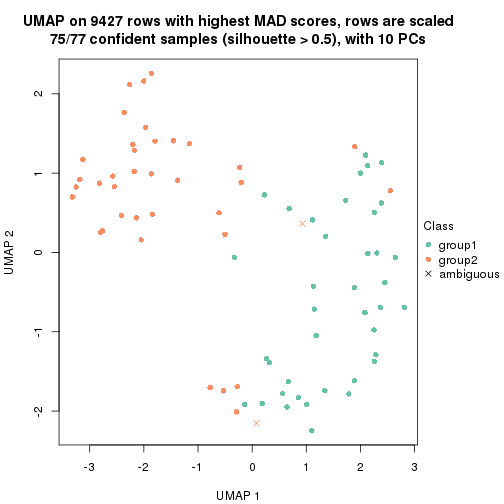</p>

</div>
<div id='tab-MAD-pam-dimension-reduction-2'>
<pre><code class="r">dimension_reduction(res, k = 3, method = &quot;UMAP&quot;)
</code></pre>

<p></p>

</div>
<div id='tab-MAD-pam-dimension-reduction-3'>
<pre><code class="r">dimension_reduction(res, k = 4, method = &quot;UMAP&quot;)
</code></pre>

<p></p>

</div>
<div id='tab-MAD-pam-dimension-reduction-4'>
<pre><code class="r">dimension_reduction(res, k = 5, method = &quot;UMAP&quot;)
</code></pre>

<p></p>

</div>
<div id='tab-MAD-pam-dimension-reduction-5'>
<pre><code class="r">dimension_reduction(res, k = 6, method = &quot;UMAP&quot;)
</code></pre>

<p></p>

</div>
</div>


Following heatmap shows how subgroups are split when increasing `k`:

```r
collect_classes(res)
```


If matrix rows can be associated to genes, consider to use `GO_Enrichment(res,
...)` to perform function enrichment for the signature genes.


 

---------------------------------------------------


### MAD:mclust**


The object with results only for a single top-value method and a single partition method 
can be extracted as:

```r
res = res_list["MAD", "mclust"]
# you can also extract it by
# res = res_list["MAD:mclust"]
```

A summary of `res` and all the functions that can be applied to it:

```r
res
```

```
#> A 'ConsensusPartition' object with k = 2, 3, 4, 5, 6.
#>   On a matrix with 9427 rows and 77 columns.
#>   Top rows (943, 1886, 2828, 3771, 4714) are extracted by 'MAD' method.
#>   Subgroups are detected by 'mclust' method.
#>   Performed in total 1250 partitions by row resampling.
#>   Best k for subgroups seems to be 2.
#> 
#> Following methods can be applied to this 'ConsensusPartition' object:
#>  [1] "cola_report"             "collect_classes"         "collect_plots"          
#>  [4] "collect_stats"           "colnames"                "compare_signatures"     
#>  [7] "consensus_heatmap"       "dimension_reduction"     "functional_enrichment"  
#> [10] "get_anno_col"            "get_anno"                "get_classes"            
#> [13] "get_consensus"           "get_matrix"              "get_membership"         
#> [16] "get_param"               "get_signatures"          "get_stats"              
#> [19] "is_best_k"               "is_stable_k"             "membership_heatmap"     
#> [22] "ncol"                    "nrow"                    "plot_ecdf"              
#> [25] "rownames"                "select_partition_number" "show"                   
#> [28] "suggest_best_k"          "test_to_known_factors"
```

`collect_plots()` function collects all the plots made from `res` for all `k` (number of partitions)
into one single page to provide an easy and fast comparison between different `k`.

```r
collect_plots(res)
```


The plots are:

- The first row: a plot of the ECDF (Empirical cumulative distribution
  function) curves of the consensus matrix for each `k` and the heatmap of
  predicted classes for each `k`.
- The second row: heatmaps of the consensus matrix for each `k`.
- The third row: heatmaps of the membership matrix for each `k`.
- The fouth row: heatmaps of the signatures for each `k`.

All the plots in panels can be made by individual functions and they are
plotted later in this section.

`select_partition_number()` produces several plots showing different
statistics for choosing "optimized" `k`. There are following statistics:

- ECDF curves of the consensus matrix for each `k`;
- 1-PAC. [The PAC
  score](https://en.wikipedia.org/wiki/Consensus_clustering#Over-interpretation_potential_of_consensus_clustering)
  measures the proportion of the ambiguous subgrouping.
- Mean silhouette score.
- Concordance. The mean probability of fiting the consensus class ids in all
  partitions.
- Area increased. Denote $A_k$ as the area under the ECDF curve for current
  `k`, the area increased is defined as $A_k - A_{k-1}$.
- Rand index. The percent of pairs of samples that are both in a same cluster
  or both are not in a same cluster in the partition of k and k-1.
- Jaccard index. The ratio of pairs of samples are both in a same cluster in
  the partition of k and k-1 and the pairs of samples are both in a same
  cluster in the partition k or k-1.

The detailed explanations of these statistics can be found in [the cola
vignette](http://bioconductor.org/packages/devel/bioc/vignettes/cola/inst/doc/cola.html#toc_13).

Generally speaking, lower PAC score, higher mean silhouette score or higher
concordance corresponds to better partition. Rand index and Jaccard index
measure how similar the current partition is compared to partition with `k-1`.
If they are too similar, we won't accept `k` is better than `k-1`.

```r
select_partition_number(res)
```


The numeric values for all these statistics can be obtained by `get_stats()`.

```r
get_stats(res)
```

```
#>   k 1-PAC mean_silhouette concordance area_increased  Rand Jaccard
#> 2 2 1.000           0.981       0.991         0.4787 0.518   0.518
#> 3 3 0.564           0.580       0.773         0.2212 0.972   0.947
#> 4 4 0.728           0.769       0.878         0.2037 0.766   0.539
#> 5 5 0.721           0.776       0.853         0.0928 0.895   0.655
#> 6 6 0.813           0.841       0.902         0.0464 0.981   0.911
```

`suggest_best_k()` suggests the best $k$ based on these statistics. The rules are as follows:

- All $k$ with Jaccard index larger than 0.95 are removed because the increase of
  the partition number does not provides enough extra information. If all $k$ are removed,
  the best $k$ is assigned by `NA`.
- For $k$ with 1-PAC larger than 0.9, the maximal $k$ is taken as the "best k". Other $k$ is called "optional k".
- If it does not fit the second rule. The $k$ with the highest vote of highest
  1-PAC, mean silhouette and concordance is taken as the "best k".

```r
suggest_best_k(res)
```

```
#> [1] 2
```


Following shows the table of the partitions (You need to click the **show/hide
code output** link to see it). The membership matrix (columns with name `p*`)
is inferred by
[`clue::cl_consensus()`](https://www.rdocumentation.org/link/cl_consensus?package=clue)
function with the `SE` method. Basically the value in the membership matrix
represents the probability to belong to a certain group. The finall class
label for an item is determined with the group with highest probability it
belongs to.

In `get_classes()` function, the entropy is calculated from the membership
matrix and the silhouette score is calculated from the consensus matrix.


<script>
$( function() {
	$( '#tabs-MAD-mclust-get-classes' ).tabs();
} );
</script>
<div id='tabs-MAD-mclust-get-classes'>
<ul>
<li><a href='#tab-MAD-mclust-get-classes-1'>k = 2</a></li>
<li><a href='#tab-MAD-mclust-get-classes-2'>k = 3</a></li>
<li><a href='#tab-MAD-mclust-get-classes-3'>k = 4</a></li>
<li><a href='#tab-MAD-mclust-get-classes-4'>k = 5</a></li>
<li><a href='#tab-MAD-mclust-get-classes-5'>k = 6</a></li>
</ul>

<div id='tab-MAD-mclust-get-classes-1'>
<p><a id='tab-MAD-mclust-get-classes-1-a' style='color:#0366d6' href='#'>show/hide code output</a></p>
<pre><code class="r">cbind(get_classes(res, k = 2), get_membership(res, k = 2))
</code></pre>

<pre><code>#&gt;           class entropy silhouette    p1    p2
#&gt; SRR944011     2  0.0000      0.979 0.000 1.000
#&gt; SRR944012     1  0.0000      0.997 1.000 0.000
#&gt; SRR944014     2  0.0000      0.979 0.000 1.000
#&gt; SRR944013     1  0.0000      0.997 1.000 0.000
#&gt; SRR944015     1  0.0000      0.997 1.000 0.000
#&gt; SRR944016     1  0.0000      0.997 1.000 0.000
#&gt; SRR944017     1  0.0000      0.997 1.000 0.000
#&gt; SRR944018     1  0.0000      0.997 1.000 0.000
#&gt; SRR944019     1  0.0000      0.997 1.000 0.000
#&gt; SRR944020     1  0.0000      0.997 1.000 0.000
#&gt; SRR944021     2  0.0000      0.979 0.000 1.000
#&gt; SRR944022     1  0.0000      0.997 1.000 0.000
#&gt; SRR944023     1  0.0000      0.997 1.000 0.000
#&gt; SRR944024     1  0.0000      0.997 1.000 0.000
#&gt; SRR944026     1  0.0000      0.997 1.000 0.000
#&gt; SRR944025     1  0.0000      0.997 1.000 0.000
#&gt; SRR944028     1  0.0000      0.997 1.000 0.000
#&gt; SRR944029     1  0.0000      0.997 1.000 0.000
#&gt; SRR944030     2  0.4690      0.887 0.100 0.900
#&gt; SRR944031     2  0.1184      0.975 0.016 0.984
#&gt; SRR944032     1  0.0000      0.997 1.000 0.000
#&gt; SRR944033     2  0.0000      0.979 0.000 1.000
#&gt; SRR944034     2  0.0000      0.979 0.000 1.000
#&gt; SRR944036     1  0.0000      0.997 1.000 0.000
#&gt; SRR944035     1  0.0672      0.990 0.992 0.008
#&gt; SRR944038     2  0.1184      0.975 0.016 0.984
#&gt; SRR944037     1  0.0000      0.997 1.000 0.000
#&gt; SRR944039     1  0.0000      0.997 1.000 0.000
#&gt; SRR944040     2  0.0000      0.979 0.000 1.000
#&gt; SRR944041     1  0.0000      0.997 1.000 0.000
#&gt; SRR944042     2  0.1184      0.975 0.016 0.984
#&gt; SRR944043     1  0.0000      0.997 1.000 0.000
#&gt; SRR944044     1  0.0000      0.997 1.000 0.000
#&gt; SRR944046     2  0.0000      0.979 0.000 1.000
#&gt; SRR944045     2  0.0000      0.979 0.000 1.000
#&gt; SRR944047     2  0.0000      0.979 0.000 1.000
#&gt; SRR944048     1  0.0000      0.997 1.000 0.000
#&gt; SRR944049     1  0.0672      0.990 0.992 0.008
#&gt; SRR944050     1  0.0000      0.997 1.000 0.000
#&gt; SRR944051     1  0.0000      0.997 1.000 0.000
#&gt; SRR944052     2  0.1414      0.972 0.020 0.980
#&gt; SRR944053     1  0.0000      0.997 1.000 0.000
#&gt; SRR944054     1  0.0000      0.997 1.000 0.000
#&gt; SRR944055     2  0.0000      0.979 0.000 1.000
#&gt; SRR944056     2  0.0000      0.979 0.000 1.000
#&gt; SRR944057     1  0.0000      0.997 1.000 0.000
#&gt; SRR944058     1  0.0000      0.997 1.000 0.000
#&gt; SRR944059     2  0.1184      0.975 0.016 0.984
#&gt; SRR944060     1  0.4815      0.881 0.896 0.104
#&gt; SRR944061     2  0.1184      0.975 0.016 0.984
#&gt; SRR944062     1  0.0000      0.997 1.000 0.000
#&gt; SRR944063     1  0.0000      0.997 1.000 0.000
#&gt; SRR944064     1  0.0000      0.997 1.000 0.000
#&gt; SRR944065     1  0.0000      0.997 1.000 0.000
#&gt; SRR944066     1  0.0000      0.997 1.000 0.000
#&gt; SRR944067     1  0.0000      0.997 1.000 0.000
#&gt; SRR944068     1  0.0000      0.997 1.000 0.000
#&gt; SRR944069     2  0.0376      0.978 0.004 0.996
#&gt; SRR944070     2  0.0376      0.978 0.004 0.996
#&gt; SRR944071     2  0.9209      0.509 0.336 0.664
#&gt; SRR944072     1  0.0000      0.997 1.000 0.000
#&gt; SRR944073     2  0.0000      0.979 0.000 1.000
#&gt; SRR944075     2  0.1184      0.975 0.016 0.984
#&gt; SRR944074     1  0.0000      0.997 1.000 0.000
#&gt; SRR944076     2  0.1184      0.975 0.016 0.984
#&gt; SRR944077     2  0.0000      0.979 0.000 1.000
#&gt; SRR944078     2  0.0000      0.979 0.000 1.000
#&gt; SRR944079     2  0.0000      0.979 0.000 1.000
#&gt; SRR944080     2  0.0000      0.979 0.000 1.000
#&gt; SRR944081     1  0.0000      0.997 1.000 0.000
#&gt; SRR944082     1  0.0000      0.997 1.000 0.000
#&gt; SRR944083     1  0.0000      0.997 1.000 0.000
#&gt; SRR944084     1  0.0000      0.997 1.000 0.000
#&gt; SRR944085     2  0.1184      0.975 0.016 0.984
#&gt; SRR944086     1  0.0000      0.997 1.000 0.000
#&gt; SRR944088     1  0.0000      0.997 1.000 0.000
#&gt; SRR944087     2  0.1184      0.975 0.016 0.984
</code></pre>

<script>
$('#tab-MAD-mclust-get-classes-1-a').parent().next().next().hide();
$('#tab-MAD-mclust-get-classes-1-a').click(function(){
  $('#tab-MAD-mclust-get-classes-1-a').parent().next().next().toggle();
  return(false);
});
</script>
</div>

<div id='tab-MAD-mclust-get-classes-2'>
<p><a id='tab-MAD-mclust-get-classes-2-a' style='color:#0366d6' href='#'>show/hide code output</a></p>
<pre><code class="r">cbind(get_classes(res, k = 3), get_membership(res, k = 3))
</code></pre>

<pre><code>#&gt;           class entropy silhouette    p1    p2    p3
#&gt; SRR944011     2  0.6267    -0.2314 0.000 0.548 0.452
#&gt; SRR944012     1  0.1163     0.8713 0.972 0.000 0.028
#&gt; SRR944014     2  0.1031     0.5427 0.000 0.976 0.024
#&gt; SRR944013     1  0.0237     0.8723 0.996 0.000 0.004
#&gt; SRR944015     1  0.5621     0.7500 0.692 0.000 0.308
#&gt; SRR944016     1  0.5058     0.8205 0.756 0.000 0.244
#&gt; SRR944017     1  0.0424     0.8717 0.992 0.008 0.000
#&gt; SRR944018     1  0.4062     0.8432 0.836 0.000 0.164
#&gt; SRR944019     1  0.1163     0.8713 0.972 0.000 0.028
#&gt; SRR944020     1  0.1643     0.8720 0.956 0.000 0.044
#&gt; SRR944021     2  0.1753     0.5410 0.000 0.952 0.048
#&gt; SRR944022     1  0.1529     0.8719 0.960 0.000 0.040
#&gt; SRR944023     1  0.6217     0.7665 0.712 0.024 0.264
#&gt; SRR944024     1  0.5058     0.8205 0.756 0.000 0.244
#&gt; SRR944026     1  0.1031     0.8708 0.976 0.000 0.024
#&gt; SRR944025     1  0.3966     0.8146 0.876 0.024 0.100
#&gt; SRR944028     1  0.3528     0.8253 0.892 0.016 0.092
#&gt; SRR944029     1  0.1031     0.8708 0.976 0.000 0.024
#&gt; SRR944030     2  0.3120     0.5049 0.012 0.908 0.080
#&gt; SRR944031     2  0.6286    -0.2620 0.000 0.536 0.464
#&gt; SRR944032     1  0.0747     0.8698 0.984 0.016 0.000
#&gt; SRR944033     2  0.0892     0.5424 0.000 0.980 0.020
#&gt; SRR944034     2  0.4324     0.3739 0.112 0.860 0.028
#&gt; SRR944036     1  0.6322     0.7525 0.700 0.024 0.276
#&gt; SRR944035     1  0.4609     0.7889 0.844 0.028 0.128
#&gt; SRR944038     2  0.6664    -0.3081 0.008 0.528 0.464
#&gt; SRR944037     1  0.1753     0.8739 0.952 0.000 0.048
#&gt; SRR944039     1  0.1163     0.8733 0.972 0.000 0.028
#&gt; SRR944040     2  0.5363     0.2246 0.000 0.724 0.276
#&gt; SRR944041     1  0.1163     0.8713 0.972 0.000 0.028
#&gt; SRR944042     2  0.6280    -0.2514 0.000 0.540 0.460
#&gt; SRR944043     1  0.4062     0.8432 0.836 0.000 0.164
#&gt; SRR944044     1  0.1031     0.8708 0.976 0.000 0.024
#&gt; SRR944046     2  0.6274    -0.2392 0.000 0.544 0.456
#&gt; SRR944045     2  0.1411     0.5342 0.000 0.964 0.036
#&gt; SRR944047     2  0.1289     0.5371 0.000 0.968 0.032
#&gt; SRR944048     1  0.5058     0.8205 0.756 0.000 0.244
#&gt; SRR944049     1  0.6250     0.7136 0.776 0.104 0.120
#&gt; SRR944050     1  0.5058     0.8205 0.756 0.000 0.244
#&gt; SRR944051     1  0.1031     0.8708 0.976 0.000 0.024
#&gt; SRR944052     2  0.5450     0.4152 0.012 0.760 0.228
#&gt; SRR944053     1  0.1529     0.8719 0.960 0.000 0.040
#&gt; SRR944054     1  0.1031     0.8708 0.976 0.000 0.024
#&gt; SRR944055     2  0.6126    -0.0994 0.000 0.600 0.400
#&gt; SRR944056     2  0.2165     0.5355 0.000 0.936 0.064
#&gt; SRR944057     1  0.5058     0.8205 0.756 0.000 0.244
#&gt; SRR944058     1  0.5016     0.8220 0.760 0.000 0.240
#&gt; SRR944059     2  0.6305    -0.3425 0.000 0.516 0.484
#&gt; SRR944060     1  0.8065     0.3435 0.484 0.064 0.452
#&gt; SRR944061     2  0.4555     0.4587 0.000 0.800 0.200
#&gt; SRR944062     1  0.5058     0.8205 0.756 0.000 0.244
#&gt; SRR944063     1  0.1529     0.8719 0.960 0.000 0.040
#&gt; SRR944064     1  0.1015     0.8707 0.980 0.012 0.008
#&gt; SRR944065     1  0.4531     0.8419 0.824 0.008 0.168
#&gt; SRR944066     1  0.5058     0.8205 0.756 0.000 0.244
#&gt; SRR944067     1  0.4349     0.7943 0.852 0.020 0.128
#&gt; SRR944068     1  0.5621     0.7500 0.692 0.000 0.308
#&gt; SRR944069     2  0.3551     0.4660 0.000 0.868 0.132
#&gt; SRR944070     2  0.6664    -0.3024 0.008 0.528 0.464
#&gt; SRR944071     3  0.9836     0.2221 0.268 0.312 0.420
#&gt; SRR944072     1  0.5016     0.8220 0.760 0.000 0.240
#&gt; SRR944073     2  0.0237     0.5438 0.000 0.996 0.004
#&gt; SRR944075     2  0.6286    -0.2652 0.000 0.536 0.464
#&gt; SRR944074     1  0.1031     0.8708 0.976 0.000 0.024
#&gt; SRR944076     3  0.6302     0.1965 0.000 0.480 0.520
#&gt; SRR944077     2  0.0424     0.5440 0.000 0.992 0.008
#&gt; SRR944078     2  0.6111    -0.0887 0.000 0.604 0.396
#&gt; SRR944079     2  0.0747     0.5440 0.000 0.984 0.016
#&gt; SRR944080     2  0.3941     0.4475 0.000 0.844 0.156
#&gt; SRR944081     1  0.1031     0.8708 0.976 0.000 0.024
#&gt; SRR944082     1  0.4504     0.8375 0.804 0.000 0.196
#&gt; SRR944083     1  0.5058     0.8205 0.756 0.000 0.244
#&gt; SRR944084     1  0.4002     0.8454 0.840 0.000 0.160
#&gt; SRR944085     3  0.7072     0.2531 0.020 0.476 0.504
#&gt; SRR944086     1  0.0661     0.8717 0.988 0.008 0.004
#&gt; SRR944088     1  0.1031     0.8708 0.976 0.000 0.024
#&gt; SRR944087     2  0.6280    -0.2514 0.000 0.540 0.460
</code></pre>

<script>
$('#tab-MAD-mclust-get-classes-2-a').parent().next().next().hide();
$('#tab-MAD-mclust-get-classes-2-a').click(function(){
  $('#tab-MAD-mclust-get-classes-2-a').parent().next().next().toggle();
  return(false);
});
</script>
</div>

<div id='tab-MAD-mclust-get-classes-3'>
<p><a id='tab-MAD-mclust-get-classes-3-a' style='color:#0366d6' href='#'>show/hide code output</a></p>
<pre><code class="r">cbind(get_classes(res, k = 4), get_membership(res, k = 4))
</code></pre>

<pre><code>#&gt;           class entropy silhouette    p1    p2    p3    p4
#&gt; SRR944011     3  0.2011     0.9034 0.000 0.080 0.920 0.000
#&gt; SRR944012     4  0.0336     0.8245 0.008 0.000 0.000 0.992
#&gt; SRR944014     2  0.0469     0.9325 0.000 0.988 0.012 0.000
#&gt; SRR944013     4  0.1706     0.8154 0.016 0.000 0.036 0.948
#&gt; SRR944015     4  0.3168     0.7723 0.060 0.000 0.056 0.884
#&gt; SRR944016     1  0.0000     0.8640 1.000 0.000 0.000 0.000
#&gt; SRR944017     4  0.5705     0.6317 0.280 0.008 0.040 0.672
#&gt; SRR944018     4  0.5300     0.6264 0.308 0.000 0.028 0.664
#&gt; SRR944019     4  0.0469     0.8245 0.012 0.000 0.000 0.988
#&gt; SRR944020     4  0.0524     0.8245 0.008 0.000 0.004 0.988
#&gt; SRR944021     2  0.0469     0.9325 0.000 0.988 0.012 0.000
#&gt; SRR944022     4  0.0336     0.8245 0.008 0.000 0.000 0.992
#&gt; SRR944023     1  0.7389    -0.1750 0.448 0.024 0.088 0.440
#&gt; SRR944024     1  0.0000     0.8640 1.000 0.000 0.000 0.000
#&gt; SRR944026     4  0.0376     0.8215 0.000 0.004 0.004 0.992
#&gt; SRR944025     4  0.5852     0.6216 0.284 0.012 0.040 0.664
#&gt; SRR944028     4  0.5827     0.6270 0.280 0.012 0.040 0.668
#&gt; SRR944029     4  0.0188     0.8237 0.004 0.000 0.000 0.996
#&gt; SRR944030     2  0.0188     0.9274 0.000 0.996 0.000 0.004
#&gt; SRR944031     3  0.2011     0.9034 0.000 0.080 0.920 0.000
#&gt; SRR944032     4  0.5517     0.5927 0.316 0.000 0.036 0.648
#&gt; SRR944033     2  0.0336     0.9320 0.000 0.992 0.008 0.000
#&gt; SRR944034     2  0.8384    -0.2183 0.228 0.376 0.024 0.372
#&gt; SRR944036     4  0.7435     0.0967 0.440 0.024 0.092 0.444
#&gt; SRR944035     4  0.5960     0.6217 0.280 0.020 0.036 0.664
#&gt; SRR944038     3  0.5287     0.7486 0.008 0.076 0.760 0.156
#&gt; SRR944037     4  0.0336     0.8245 0.008 0.000 0.000 0.992
#&gt; SRR944039     4  0.5022     0.6968 0.220 0.000 0.044 0.736
#&gt; SRR944040     3  0.3942     0.7369 0.000 0.236 0.764 0.000
#&gt; SRR944041     4  0.0188     0.8237 0.004 0.000 0.000 0.996
#&gt; SRR944042     3  0.2011     0.9034 0.000 0.080 0.920 0.000
#&gt; SRR944043     4  0.5535     0.6192 0.304 0.000 0.040 0.656
#&gt; SRR944044     4  0.0376     0.8215 0.000 0.004 0.004 0.992
#&gt; SRR944046     3  0.2011     0.9034 0.000 0.080 0.920 0.000
#&gt; SRR944045     2  0.1635     0.9027 0.000 0.948 0.044 0.008
#&gt; SRR944047     2  0.0469     0.9325 0.000 0.988 0.012 0.000
#&gt; SRR944048     1  0.0000     0.8640 1.000 0.000 0.000 0.000
#&gt; SRR944049     4  0.5887     0.6325 0.272 0.016 0.040 0.672
#&gt; SRR944050     1  0.1938     0.8403 0.936 0.000 0.012 0.052
#&gt; SRR944051     4  0.0844     0.8236 0.012 0.004 0.004 0.980
#&gt; SRR944052     2  0.1706     0.8955 0.000 0.948 0.036 0.016
#&gt; SRR944053     4  0.0336     0.8245 0.008 0.000 0.000 0.992
#&gt; SRR944054     4  0.0188     0.8224 0.000 0.004 0.000 0.996
#&gt; SRR944055     3  0.2011     0.9034 0.000 0.080 0.920 0.000
#&gt; SRR944056     2  0.0188     0.9304 0.000 0.996 0.004 0.000
#&gt; SRR944057     1  0.0000     0.8640 1.000 0.000 0.000 0.000
#&gt; SRR944058     1  0.3862     0.7553 0.824 0.000 0.024 0.152
#&gt; SRR944059     3  0.2011     0.9034 0.000 0.080 0.920 0.000
#&gt; SRR944060     3  0.6591     0.0736 0.028 0.032 0.524 0.416
#&gt; SRR944061     2  0.0336     0.9303 0.000 0.992 0.008 0.000
#&gt; SRR944062     1  0.0000     0.8640 1.000 0.000 0.000 0.000
#&gt; SRR944063     4  0.0336     0.8245 0.008 0.000 0.000 0.992
#&gt; SRR944064     4  0.5882     0.3106 0.436 0.012 0.016 0.536
#&gt; SRR944065     4  0.3013     0.7891 0.080 0.000 0.032 0.888
#&gt; SRR944066     1  0.0000     0.8640 1.000 0.000 0.000 0.000
#&gt; SRR944067     4  0.5852     0.6216 0.284 0.012 0.040 0.664
#&gt; SRR944068     4  0.3168     0.7723 0.060 0.000 0.056 0.884
#&gt; SRR944069     2  0.0336     0.9319 0.000 0.992 0.008 0.000
#&gt; SRR944070     3  0.5219     0.7467 0.008 0.072 0.764 0.156
#&gt; SRR944071     3  0.3611     0.8594 0.000 0.080 0.860 0.060
#&gt; SRR944072     1  0.4898     0.5719 0.716 0.000 0.024 0.260
#&gt; SRR944073     2  0.0657     0.9318 0.000 0.984 0.012 0.004
#&gt; SRR944075     3  0.1978     0.8961 0.000 0.068 0.928 0.004
#&gt; SRR944074     4  0.0376     0.8215 0.000 0.004 0.004 0.992
#&gt; SRR944076     3  0.2011     0.9034 0.000 0.080 0.920 0.000
#&gt; SRR944077     2  0.0469     0.9325 0.000 0.988 0.012 0.000
#&gt; SRR944078     3  0.2081     0.9010 0.000 0.084 0.916 0.000
#&gt; SRR944079     2  0.0469     0.9325 0.000 0.988 0.012 0.000
#&gt; SRR944080     2  0.0188     0.9308 0.000 0.996 0.004 0.000
#&gt; SRR944081     4  0.0188     0.8237 0.004 0.000 0.000 0.996
#&gt; SRR944082     1  0.3577     0.7476 0.832 0.000 0.012 0.156
#&gt; SRR944083     1  0.0000     0.8640 1.000 0.000 0.000 0.000
#&gt; SRR944084     4  0.0657     0.8223 0.004 0.000 0.012 0.984
#&gt; SRR944085     3  0.2197     0.9018 0.000 0.080 0.916 0.004
#&gt; SRR944086     4  0.4379     0.7382 0.172 0.000 0.036 0.792
#&gt; SRR944088     4  0.0188     0.8237 0.004 0.000 0.000 0.996
#&gt; SRR944087     3  0.2011     0.9034 0.000 0.080 0.920 0.000
</code></pre>

<script>
$('#tab-MAD-mclust-get-classes-3-a').parent().next().next().hide();
$('#tab-MAD-mclust-get-classes-3-a').click(function(){
  $('#tab-MAD-mclust-get-classes-3-a').parent().next().next().toggle();
  return(false);
});
</script>
</div>

<div id='tab-MAD-mclust-get-classes-4'>
<p><a id='tab-MAD-mclust-get-classes-4-a' style='color:#0366d6' href='#'>show/hide code output</a></p>
<pre><code class="r">cbind(get_classes(res, k = 5), get_membership(res, k = 5))
</code></pre>

<pre><code>#&gt;           class entropy silhouette    p1    p2    p3    p4    p5
#&gt; SRR944011     3  0.1732      0.882 0.000 0.080 0.920 0.000 0.000
#&gt; SRR944012     4  0.1043      0.791 0.000 0.000 0.000 0.960 0.040
#&gt; SRR944014     2  0.0510      0.978 0.000 0.984 0.016 0.000 0.000
#&gt; SRR944013     4  0.3920      0.641 0.004 0.000 0.004 0.724 0.268
#&gt; SRR944015     4  0.3740      0.543 0.012 0.000 0.008 0.784 0.196
#&gt; SRR944016     1  0.0162      0.856 0.996 0.000 0.000 0.000 0.004
#&gt; SRR944017     5  0.5470      0.663 0.080 0.000 0.000 0.332 0.588
#&gt; SRR944018     4  0.3590      0.639 0.092 0.000 0.000 0.828 0.080
#&gt; SRR944019     4  0.1197      0.791 0.000 0.000 0.000 0.952 0.048
#&gt; SRR944020     4  0.0324      0.781 0.000 0.000 0.004 0.992 0.004
#&gt; SRR944021     2  0.0000      0.983 0.000 1.000 0.000 0.000 0.000
#&gt; SRR944022     4  0.0324      0.781 0.000 0.000 0.004 0.992 0.004
#&gt; SRR944023     1  0.7045      0.512 0.596 0.008 0.168 0.084 0.144
#&gt; SRR944024     1  0.0000      0.856 1.000 0.000 0.000 0.000 0.000
#&gt; SRR944026     4  0.3366      0.727 0.000 0.000 0.004 0.784 0.212
#&gt; SRR944025     5  0.5232      0.744 0.084 0.000 0.000 0.268 0.648
#&gt; SRR944028     5  0.5466      0.735 0.084 0.000 0.004 0.284 0.628
#&gt; SRR944029     4  0.2890      0.762 0.000 0.000 0.004 0.836 0.160
#&gt; SRR944030     2  0.0579      0.974 0.000 0.984 0.000 0.008 0.008
#&gt; SRR944031     3  0.0609      0.894 0.000 0.020 0.980 0.000 0.000
#&gt; SRR944032     5  0.6758      0.508 0.304 0.000 0.000 0.292 0.404
#&gt; SRR944033     2  0.0000      0.983 0.000 1.000 0.000 0.000 0.000
#&gt; SRR944034     5  0.7849      0.516 0.080 0.244 0.000 0.264 0.412
#&gt; SRR944036     1  0.6980      0.520 0.600 0.008 0.168 0.076 0.148
#&gt; SRR944035     5  0.5232      0.744 0.084 0.000 0.000 0.268 0.648
#&gt; SRR944038     3  0.6230      0.496 0.000 0.020 0.528 0.092 0.360
#&gt; SRR944037     4  0.0324      0.781 0.000 0.000 0.004 0.992 0.004
#&gt; SRR944039     4  0.3359      0.687 0.052 0.000 0.000 0.840 0.108
#&gt; SRR944040     3  0.2690      0.824 0.000 0.156 0.844 0.000 0.000
#&gt; SRR944041     4  0.0963      0.791 0.000 0.000 0.000 0.964 0.036
#&gt; SRR944042     3  0.1399      0.885 0.000 0.020 0.952 0.000 0.028
#&gt; SRR944043     4  0.3460      0.668 0.076 0.000 0.004 0.844 0.076
#&gt; SRR944044     4  0.3366      0.727 0.000 0.000 0.004 0.784 0.212
#&gt; SRR944046     3  0.0609      0.894 0.000 0.020 0.980 0.000 0.000
#&gt; SRR944045     2  0.1608      0.925 0.000 0.928 0.072 0.000 0.000
#&gt; SRR944047     2  0.0000      0.983 0.000 1.000 0.000 0.000 0.000
#&gt; SRR944048     1  0.0000      0.856 1.000 0.000 0.000 0.000 0.000
#&gt; SRR944049     5  0.5542      0.737 0.084 0.008 0.000 0.276 0.632
#&gt; SRR944050     1  0.0912      0.849 0.972 0.000 0.000 0.012 0.016
#&gt; SRR944051     4  0.3333      0.726 0.000 0.000 0.004 0.788 0.208
#&gt; SRR944052     2  0.1197      0.950 0.000 0.952 0.048 0.000 0.000
#&gt; SRR944053     4  0.0324      0.781 0.000 0.000 0.004 0.992 0.004
#&gt; SRR944054     4  0.3300      0.733 0.000 0.000 0.004 0.792 0.204
#&gt; SRR944055     3  0.2020      0.873 0.000 0.100 0.900 0.000 0.000
#&gt; SRR944056     2  0.0000      0.983 0.000 1.000 0.000 0.000 0.000
#&gt; SRR944057     1  0.0000      0.856 1.000 0.000 0.000 0.000 0.000
#&gt; SRR944058     1  0.3141      0.771 0.852 0.000 0.000 0.108 0.040
#&gt; SRR944059     3  0.0609      0.894 0.000 0.020 0.980 0.000 0.000
#&gt; SRR944060     5  0.6951     -0.280 0.012 0.008 0.388 0.164 0.428
#&gt; SRR944061     2  0.0162      0.983 0.000 0.996 0.004 0.000 0.000
#&gt; SRR944062     1  0.0000      0.856 1.000 0.000 0.000 0.000 0.000
#&gt; SRR944063     4  0.0324      0.781 0.000 0.000 0.004 0.992 0.004
#&gt; SRR944064     1  0.5107      0.464 0.632 0.000 0.004 0.048 0.316
#&gt; SRR944065     4  0.2490      0.774 0.020 0.000 0.004 0.896 0.080
#&gt; SRR944066     1  0.0000      0.856 1.000 0.000 0.000 0.000 0.000
#&gt; SRR944067     5  0.5232      0.744 0.084 0.000 0.000 0.268 0.648
#&gt; SRR944068     4  0.3740      0.543 0.012 0.000 0.008 0.784 0.196
#&gt; SRR944069     2  0.0000      0.983 0.000 1.000 0.000 0.000 0.000
#&gt; SRR944070     3  0.6230      0.496 0.000 0.020 0.528 0.092 0.360
#&gt; SRR944071     3  0.3046      0.818 0.000 0.020 0.876 0.028 0.076
#&gt; SRR944072     1  0.3983      0.700 0.784 0.000 0.000 0.164 0.052
#&gt; SRR944073     2  0.0609      0.974 0.000 0.980 0.000 0.000 0.020
#&gt; SRR944075     3  0.1965      0.875 0.000 0.096 0.904 0.000 0.000
#&gt; SRR944074     4  0.3366      0.727 0.000 0.000 0.004 0.784 0.212
#&gt; SRR944076     3  0.0609      0.894 0.000 0.020 0.980 0.000 0.000
#&gt; SRR944077     2  0.0290      0.982 0.000 0.992 0.008 0.000 0.000
#&gt; SRR944078     3  0.2074      0.871 0.000 0.104 0.896 0.000 0.000
#&gt; SRR944079     2  0.0510      0.978 0.000 0.984 0.016 0.000 0.000
#&gt; SRR944080     2  0.0000      0.983 0.000 1.000 0.000 0.000 0.000
#&gt; SRR944081     4  0.2020      0.786 0.000 0.000 0.000 0.900 0.100
#&gt; SRR944082     1  0.2172      0.815 0.908 0.000 0.000 0.076 0.016
#&gt; SRR944083     1  0.0000      0.856 1.000 0.000 0.000 0.000 0.000
#&gt; SRR944084     4  0.2629      0.769 0.000 0.000 0.004 0.860 0.136
#&gt; SRR944085     3  0.0609      0.894 0.000 0.020 0.980 0.000 0.000
#&gt; SRR944086     4  0.4885      0.507 0.056 0.000 0.000 0.668 0.276
#&gt; SRR944088     4  0.3196      0.743 0.000 0.000 0.004 0.804 0.192
#&gt; SRR944087     3  0.0609      0.894 0.000 0.020 0.980 0.000 0.000
</code></pre>

<script>
$('#tab-MAD-mclust-get-classes-4-a').parent().next().next().hide();
$('#tab-MAD-mclust-get-classes-4-a').click(function(){
  $('#tab-MAD-mclust-get-classes-4-a').parent().next().next().toggle();
  return(false);
});
</script>
</div>

<div id='tab-MAD-mclust-get-classes-5'>
<p><a id='tab-MAD-mclust-get-classes-5-a' style='color:#0366d6' href='#'>show/hide code output</a></p>
<pre><code class="r">cbind(get_classes(res, k = 6), get_membership(res, k = 6))
</code></pre>

<pre><code>#&gt;           class entropy silhouette    p1    p2    p3    p4    p5    p6
#&gt; SRR944011     3  0.2219      0.811 0.000 0.136 0.864 0.000 0.000 0.000
#&gt; SRR944012     4  0.0146      0.868 0.000 0.000 0.000 0.996 0.004 0.000
#&gt; SRR944014     2  0.0146      0.988 0.000 0.996 0.004 0.000 0.000 0.000
#&gt; SRR944013     4  0.4560      0.731 0.000 0.000 0.000 0.692 0.200 0.108
#&gt; SRR944015     4  0.1863      0.815 0.000 0.000 0.000 0.896 0.000 0.104
#&gt; SRR944016     1  0.0000      0.870 1.000 0.000 0.000 0.000 0.000 0.000
#&gt; SRR944017     5  0.3098      0.771 0.000 0.004 0.000 0.064 0.844 0.088
#&gt; SRR944018     4  0.0976      0.865 0.008 0.000 0.000 0.968 0.016 0.008
#&gt; SRR944019     4  0.0260      0.868 0.000 0.000 0.000 0.992 0.008 0.000
#&gt; SRR944020     4  0.0520      0.867 0.000 0.000 0.000 0.984 0.008 0.008
#&gt; SRR944021     2  0.0000      0.988 0.000 1.000 0.000 0.000 0.000 0.000
#&gt; SRR944022     4  0.0520      0.867 0.000 0.000 0.000 0.984 0.008 0.008
#&gt; SRR944023     1  0.5535      0.621 0.692 0.000 0.160 0.060 0.044 0.044
#&gt; SRR944024     1  0.0000      0.870 1.000 0.000 0.000 0.000 0.000 0.000
#&gt; SRR944026     4  0.4371      0.681 0.000 0.000 0.000 0.620 0.036 0.344
#&gt; SRR944025     5  0.0000      0.880 0.000 0.000 0.000 0.000 1.000 0.000
#&gt; SRR944028     5  0.0858      0.872 0.000 0.000 0.000 0.004 0.968 0.028
#&gt; SRR944029     4  0.2805      0.818 0.000 0.000 0.000 0.812 0.004 0.184
#&gt; SRR944030     2  0.0146      0.987 0.000 0.996 0.000 0.000 0.004 0.000
#&gt; SRR944031     3  0.0000      0.861 0.000 0.000 1.000 0.000 0.000 0.000
#&gt; SRR944032     1  0.5083      0.320 0.520 0.000 0.000 0.068 0.408 0.004
#&gt; SRR944033     2  0.0000      0.988 0.000 1.000 0.000 0.000 0.000 0.000
#&gt; SRR944034     5  0.3076      0.635 0.000 0.240 0.000 0.000 0.760 0.000
#&gt; SRR944036     1  0.5504      0.618 0.692 0.000 0.164 0.060 0.044 0.040
#&gt; SRR944035     5  0.0146      0.880 0.000 0.004 0.000 0.000 0.996 0.000
#&gt; SRR944038     6  0.4682      0.866 0.000 0.000 0.284 0.076 0.000 0.640
#&gt; SRR944037     4  0.0146      0.868 0.000 0.000 0.000 0.996 0.004 0.000
#&gt; SRR944039     4  0.1434      0.859 0.024 0.000 0.000 0.948 0.020 0.008
#&gt; SRR944040     3  0.3076      0.652 0.000 0.240 0.760 0.000 0.000 0.000
#&gt; SRR944041     4  0.0146      0.868 0.000 0.000 0.000 0.996 0.004 0.000
#&gt; SRR944042     3  0.0865      0.832 0.000 0.000 0.964 0.000 0.000 0.036
#&gt; SRR944043     4  0.1180      0.861 0.012 0.000 0.000 0.960 0.012 0.016
#&gt; SRR944044     4  0.4371      0.681 0.000 0.000 0.000 0.620 0.036 0.344
#&gt; SRR944046     3  0.0146      0.859 0.000 0.000 0.996 0.000 0.000 0.004
#&gt; SRR944045     2  0.1267      0.927 0.000 0.940 0.060 0.000 0.000 0.000
#&gt; SRR944047     2  0.0000      0.988 0.000 1.000 0.000 0.000 0.000 0.000
#&gt; SRR944048     1  0.0000      0.870 1.000 0.000 0.000 0.000 0.000 0.000
#&gt; SRR944049     5  0.1501      0.837 0.000 0.076 0.000 0.000 0.924 0.000
#&gt; SRR944050     1  0.0291      0.868 0.992 0.000 0.000 0.000 0.004 0.004
#&gt; SRR944051     4  0.4140      0.782 0.000 0.000 0.000 0.744 0.152 0.104
#&gt; SRR944052     2  0.0858      0.964 0.000 0.968 0.028 0.000 0.004 0.000
#&gt; SRR944053     4  0.0405      0.867 0.000 0.000 0.000 0.988 0.004 0.008
#&gt; SRR944054     4  0.3841      0.769 0.000 0.000 0.000 0.724 0.032 0.244
#&gt; SRR944055     3  0.2260      0.808 0.000 0.140 0.860 0.000 0.000 0.000
#&gt; SRR944056     2  0.0146      0.988 0.000 0.996 0.004 0.000 0.000 0.000
#&gt; SRR944057     1  0.0000      0.870 1.000 0.000 0.000 0.000 0.000 0.000
#&gt; SRR944058     1  0.2325      0.794 0.884 0.000 0.000 0.100 0.008 0.008
#&gt; SRR944059     3  0.0000      0.861 0.000 0.000 1.000 0.000 0.000 0.000
#&gt; SRR944060     6  0.5669      0.802 0.004 0.004 0.184 0.148 0.024 0.636
#&gt; SRR944061     2  0.0260      0.985 0.000 0.992 0.008 0.000 0.000 0.000
#&gt; SRR944062     1  0.0000      0.870 1.000 0.000 0.000 0.000 0.000 0.000
#&gt; SRR944063     4  0.0146      0.868 0.000 0.000 0.000 0.996 0.004 0.000
#&gt; SRR944064     1  0.3536      0.696 0.736 0.000 0.000 0.008 0.252 0.004
#&gt; SRR944065     4  0.0837      0.867 0.004 0.000 0.000 0.972 0.020 0.004
#&gt; SRR944066     1  0.0000      0.870 1.000 0.000 0.000 0.000 0.000 0.000
#&gt; SRR944067     5  0.0000      0.880 0.000 0.000 0.000 0.000 1.000 0.000
#&gt; SRR944068     4  0.1863      0.815 0.000 0.000 0.000 0.896 0.000 0.104
#&gt; SRR944069     2  0.0000      0.988 0.000 1.000 0.000 0.000 0.000 0.000
#&gt; SRR944070     6  0.4196      0.819 0.000 0.000 0.332 0.028 0.000 0.640
#&gt; SRR944071     3  0.1837      0.805 0.000 0.004 0.928 0.044 0.020 0.004
#&gt; SRR944072     1  0.2685      0.766 0.852 0.000 0.000 0.132 0.008 0.008
#&gt; SRR944073     2  0.0146      0.987 0.000 0.996 0.000 0.000 0.004 0.000
#&gt; SRR944075     3  0.2219      0.811 0.000 0.136 0.864 0.000 0.000 0.000
#&gt; SRR944074     4  0.4371      0.681 0.000 0.000 0.000 0.620 0.036 0.344
#&gt; SRR944076     3  0.0146      0.859 0.000 0.004 0.996 0.000 0.000 0.000
#&gt; SRR944077     2  0.0146      0.988 0.000 0.996 0.004 0.000 0.000 0.000
#&gt; SRR944078     3  0.2300      0.803 0.000 0.144 0.856 0.000 0.000 0.000
#&gt; SRR944079     2  0.0146      0.988 0.000 0.996 0.004 0.000 0.000 0.000
#&gt; SRR944080     2  0.0146      0.987 0.000 0.996 0.000 0.000 0.004 0.000
#&gt; SRR944081     4  0.1398      0.864 0.000 0.000 0.000 0.940 0.008 0.052
#&gt; SRR944082     1  0.0837      0.861 0.972 0.000 0.000 0.020 0.004 0.004
#&gt; SRR944083     1  0.0000      0.870 1.000 0.000 0.000 0.000 0.000 0.000
#&gt; SRR944084     4  0.2416      0.831 0.000 0.000 0.000 0.844 0.000 0.156
#&gt; SRR944085     3  0.0000      0.861 0.000 0.000 1.000 0.000 0.000 0.000
#&gt; SRR944086     4  0.3409      0.775 0.024 0.000 0.000 0.788 0.184 0.004
#&gt; SRR944088     4  0.3298      0.786 0.000 0.000 0.000 0.756 0.008 0.236
#&gt; SRR944087     3  0.0000      0.861 0.000 0.000 1.000 0.000 0.000 0.000
</code></pre>

<script>
$('#tab-MAD-mclust-get-classes-5-a').parent().next().next().hide();
$('#tab-MAD-mclust-get-classes-5-a').click(function(){
  $('#tab-MAD-mclust-get-classes-5-a').parent().next().next().toggle();
  return(false);
});
</script>
</div>
</div>

Heatmaps for the consensus matrix. It visualizes the probability of two
samples to be in a same group.


<script>
$( function() {
	$( '#tabs-MAD-mclust-consensus-heatmap' ).tabs();
} );
</script>
<div id='tabs-MAD-mclust-consensus-heatmap'>
<ul>
<li><a href='#tab-MAD-mclust-consensus-heatmap-1'>k = 2</a></li>
<li><a href='#tab-MAD-mclust-consensus-heatmap-2'>k = 3</a></li>
<li><a href='#tab-MAD-mclust-consensus-heatmap-3'>k = 4</a></li>
<li><a href='#tab-MAD-mclust-consensus-heatmap-4'>k = 5</a></li>
<li><a href='#tab-MAD-mclust-consensus-heatmap-5'>k = 6</a></li>
</ul>
<div id='tab-MAD-mclust-consensus-heatmap-1'>
<pre><code class="r">consensus_heatmap(res, k = 2)
</code></pre>

<p></p>

</div>
<div id='tab-MAD-mclust-consensus-heatmap-2'>
<pre><code class="r">consensus_heatmap(res, k = 3)
</code></pre>

<p></p>

</div>
<div id='tab-MAD-mclust-consensus-heatmap-3'>
<pre><code class="r">consensus_heatmap(res, k = 4)
</code></pre>

<p></p>

</div>
<div id='tab-MAD-mclust-consensus-heatmap-4'>
<pre><code class="r">consensus_heatmap(res, k = 5)
</code></pre>

<p></p>

</div>
<div id='tab-MAD-mclust-consensus-heatmap-5'>
<pre><code class="r">consensus_heatmap(res, k = 6)
</code></pre>

<p></p>

</div>
</div>

Heatmaps for the membership of samples in all partitions to see how consistent they are:


<script>
$( function() {
	$( '#tabs-MAD-mclust-membership-heatmap' ).tabs();
} );
</script>
<div id='tabs-MAD-mclust-membership-heatmap'>
<ul>
<li><a href='#tab-MAD-mclust-membership-heatmap-1'>k = 2</a></li>
<li><a href='#tab-MAD-mclust-membership-heatmap-2'>k = 3</a></li>
<li><a href='#tab-MAD-mclust-membership-heatmap-3'>k = 4</a></li>
<li><a href='#tab-MAD-mclust-membership-heatmap-4'>k = 5</a></li>
<li><a href='#tab-MAD-mclust-membership-heatmap-5'>k = 6</a></li>
</ul>
<div id='tab-MAD-mclust-membership-heatmap-1'>
<pre><code class="r">membership_heatmap(res, k = 2)
</code></pre>

<p></p>

</div>
<div id='tab-MAD-mclust-membership-heatmap-2'>
<pre><code class="r">membership_heatmap(res, k = 3)
</code></pre>

<p></p>

</div>
<div id='tab-MAD-mclust-membership-heatmap-3'>
<pre><code class="r">membership_heatmap(res, k = 4)
</code></pre>

<p></p>

</div>
<div id='tab-MAD-mclust-membership-heatmap-4'>
<pre><code class="r">membership_heatmap(res, k = 5)
</code></pre>

<p></p>

</div>
<div id='tab-MAD-mclust-membership-heatmap-5'>
<pre><code class="r">membership_heatmap(res, k = 6)
</code></pre>

<p></p>

</div>
</div>

As soon as we have had the classes for columns, we can look for signatures
which are significantly different between classes which can be candidate marks
for certain classes. Following are the heatmaps for signatures.


Signature heatmaps where rows are scaled:


<script>
$( function() {
	$( '#tabs-MAD-mclust-get-signatures' ).tabs();
} );
</script>
<div id='tabs-MAD-mclust-get-signatures'>
<ul>
<li><a href='#tab-MAD-mclust-get-signatures-1'>k = 2</a></li>
<li><a href='#tab-MAD-mclust-get-signatures-2'>k = 3</a></li>
<li><a href='#tab-MAD-mclust-get-signatures-3'>k = 4</a></li>
<li><a href='#tab-MAD-mclust-get-signatures-4'>k = 5</a></li>
<li><a href='#tab-MAD-mclust-get-signatures-5'>k = 6</a></li>
</ul>
<div id='tab-MAD-mclust-get-signatures-1'>
<pre><code class="r">get_signatures(res, k = 2)
</code></pre>

<p></p>

</div>
<div id='tab-MAD-mclust-get-signatures-2'>
<pre><code class="r">get_signatures(res, k = 3)
</code></pre>

<p></p>

</div>
<div id='tab-MAD-mclust-get-signatures-3'>
<pre><code class="r">get_signatures(res, k = 4)
</code></pre>

<p></p>

</div>
<div id='tab-MAD-mclust-get-signatures-4'>
<pre><code class="r">get_signatures(res, k = 5)
</code></pre>

<p></p>

</div>
<div id='tab-MAD-mclust-get-signatures-5'>
<pre><code class="r">get_signatures(res, k = 6)
</code></pre>

<p></p>

</div>
</div>


Signature heatmaps where rows are not scaled:


<script>
$( function() {
	$( '#tabs-MAD-mclust-get-signatures-no-scale' ).tabs();
} );
</script>
<div id='tabs-MAD-mclust-get-signatures-no-scale'>
<ul>
<li><a href='#tab-MAD-mclust-get-signatures-no-scale-1'>k = 2</a></li>
<li><a href='#tab-MAD-mclust-get-signatures-no-scale-2'>k = 3</a></li>
<li><a href='#tab-MAD-mclust-get-signatures-no-scale-3'>k = 4</a></li>
<li><a href='#tab-MAD-mclust-get-signatures-no-scale-4'>k = 5</a></li>
<li><a href='#tab-MAD-mclust-get-signatures-no-scale-5'>k = 6</a></li>
</ul>
<div id='tab-MAD-mclust-get-signatures-no-scale-1'>
<pre><code class="r">get_signatures(res, k = 2, scale_rows = FALSE)
</code></pre>

<p></p>

</div>
<div id='tab-MAD-mclust-get-signatures-no-scale-2'>
<pre><code class="r">get_signatures(res, k = 3, scale_rows = FALSE)
</code></pre>

<p></p>

</div>
<div id='tab-MAD-mclust-get-signatures-no-scale-3'>
<pre><code class="r">get_signatures(res, k = 4, scale_rows = FALSE)
</code></pre>

<p></p>

</div>
<div id='tab-MAD-mclust-get-signatures-no-scale-4'>
<pre><code class="r">get_signatures(res, k = 5, scale_rows = FALSE)
</code></pre>

<p></p>

</div>
<div id='tab-MAD-mclust-get-signatures-no-scale-5'>
<pre><code class="r">get_signatures(res, k = 6, scale_rows = FALSE)
</code></pre>

<p></p>

</div>
</div>


Compare the overlap of signatures from different k:

```r
compare_signatures(res)
```


`get_signature()` returns a data frame invisibly. TO get the list of signatures, the function
call should be assigned to a variable explicitly. In following code, if `plot` argument is set
to `FALSE`, no heatmap is plotted while only the differential analysis is performed.

```r
# code only for demonstration
tb = get_signature(res, k = ..., plot = FALSE)
```

An example of the output of `tb` is:

```
#>   which_row         fdr    mean_1    mean_2 scaled_mean_1 scaled_mean_2 km
#> 1        38 0.042760348  8.373488  9.131774    -0.5533452     0.5164555  1
#> 2        40 0.018707592  7.106213  8.469186    -0.6173731     0.5762149  1
#> 3        55 0.019134737 10.221463 11.207825    -0.6159697     0.5749050  1
#> 4        59 0.006059896  5.921854  7.869574    -0.6899429     0.6439467  1
#> 5        60 0.018055526  8.928898 10.211722    -0.6204761     0.5791110  1
#> 6        98 0.009384629 15.714769 14.887706     0.6635654    -0.6193277  2
...
```

The columns in `tb` are:

1. `which_row`: row indices corresponding to the input matrix.
2. `fdr`: FDR for the differential test. 
3. `mean_x`: The mean value in group x.
4. `scaled_mean_x`: The mean value in group x after rows are scaled.
5. `km`: Row groups if k-means clustering is applied to rows.


UMAP plot which shows how samples are separated.


<script>
$( function() {
	$( '#tabs-MAD-mclust-dimension-reduction' ).tabs();
} );
</script>
<div id='tabs-MAD-mclust-dimension-reduction'>
<ul>
<li><a href='#tab-MAD-mclust-dimension-reduction-1'>k = 2</a></li>
<li><a href='#tab-MAD-mclust-dimension-reduction-2'>k = 3</a></li>
<li><a href='#tab-MAD-mclust-dimension-reduction-3'>k = 4</a></li>
<li><a href='#tab-MAD-mclust-dimension-reduction-4'>k = 5</a></li>
<li><a href='#tab-MAD-mclust-dimension-reduction-5'>k = 6</a></li>
</ul>
<div id='tab-MAD-mclust-dimension-reduction-1'>
<pre><code class="r">dimension_reduction(res, k = 2, method = &quot;UMAP&quot;)
</code></pre>

<p></p>

</div>
<div id='tab-MAD-mclust-dimension-reduction-2'>
<pre><code class="r">dimension_reduction(res, k = 3, method = &quot;UMAP&quot;)
</code></pre>

<p></p>

</div>
<div id='tab-MAD-mclust-dimension-reduction-3'>
<pre><code class="r">dimension_reduction(res, k = 4, method = &quot;UMAP&quot;)
</code></pre>

<p></p>

</div>
<div id='tab-MAD-mclust-dimension-reduction-4'>
<pre><code class="r">dimension_reduction(res, k = 5, method = &quot;UMAP&quot;)
</code></pre>

<p></p>

</div>
<div id='tab-MAD-mclust-dimension-reduction-5'>
<pre><code class="r">dimension_reduction(res, k = 6, method = &quot;UMAP&quot;)
</code></pre>

<p></p>

</div>
</div>


Following heatmap shows how subgroups are split when increasing `k`:

```r
collect_classes(res)
```


If matrix rows can be associated to genes, consider to use `GO_Enrichment(res,
...)` to perform function enrichment for the signature genes.


 

---------------------------------------------------


### MAD:NMF*


The object with results only for a single top-value method and a single partition method 
can be extracted as:

```r
res = res_list["MAD", "NMF"]
# you can also extract it by
# res = res_list["MAD:NMF"]
```

A summary of `res` and all the functions that can be applied to it:

```r
res
```

```
#> A 'ConsensusPartition' object with k = 2, 3, 4, 5, 6.
#>   On a matrix with 9427 rows and 77 columns.
#>   Top rows (943, 1886, 2828, 3771, 4714) are extracted by 'MAD' method.
#>   Subgroups are detected by 'NMF' method.
#>   Performed in total 1250 partitions by row resampling.
#>   Best k for subgroups seems to be 3.
#> 
#> Following methods can be applied to this 'ConsensusPartition' object:
#>  [1] "cola_report"             "collect_classes"         "collect_plots"          
#>  [4] "collect_stats"           "colnames"                "compare_signatures"     
#>  [7] "consensus_heatmap"       "dimension_reduction"     "functional_enrichment"  
#> [10] "get_anno_col"            "get_anno"                "get_classes"            
#> [13] "get_consensus"           "get_matrix"              "get_membership"         
#> [16] "get_param"               "get_signatures"          "get_stats"              
#> [19] "is_best_k"               "is_stable_k"             "membership_heatmap"     
#> [22] "ncol"                    "nrow"                    "plot_ecdf"              
#> [25] "rownames"                "select_partition_number" "show"                   
#> [28] "suggest_best_k"          "test_to_known_factors"
```

`collect_plots()` function collects all the plots made from `res` for all `k` (number of partitions)
into one single page to provide an easy and fast comparison between different `k`.

```r
collect_plots(res)
```


The plots are:

- The first row: a plot of the ECDF (Empirical cumulative distribution
  function) curves of the consensus matrix for each `k` and the heatmap of
  predicted classes for each `k`.
- The second row: heatmaps of the consensus matrix for each `k`.
- The third row: heatmaps of the membership matrix for each `k`.
- The fouth row: heatmaps of the signatures for each `k`.

All the plots in panels can be made by individual functions and they are
plotted later in this section.

`select_partition_number()` produces several plots showing different
statistics for choosing "optimized" `k`. There are following statistics:

- ECDF curves of the consensus matrix for each `k`;
- 1-PAC. [The PAC
  score](https://en.wikipedia.org/wiki/Consensus_clustering#Over-interpretation_potential_of_consensus_clustering)
  measures the proportion of the ambiguous subgrouping.
- Mean silhouette score.
- Concordance. The mean probability of fiting the consensus class ids in all
  partitions.
- Area increased. Denote $A_k$ as the area under the ECDF curve for current
  `k`, the area increased is defined as $A_k - A_{k-1}$.
- Rand index. The percent of pairs of samples that are both in a same cluster
  or both are not in a same cluster in the partition of k and k-1.
- Jaccard index. The ratio of pairs of samples are both in a same cluster in
  the partition of k and k-1 and the pairs of samples are both in a same
  cluster in the partition k or k-1.

The detailed explanations of these statistics can be found in [the cola
vignette](http://bioconductor.org/packages/devel/bioc/vignettes/cola/inst/doc/cola.html#toc_13).

Generally speaking, lower PAC score, higher mean silhouette score or higher
concordance corresponds to better partition. Rand index and Jaccard index
measure how similar the current partition is compared to partition with `k-1`.
If they are too similar, we won't accept `k` is better than `k-1`.

```r
select_partition_number(res)
```


The numeric values for all these statistics can be obtained by `get_stats()`.

```r
get_stats(res)
```

```
#>   k 1-PAC mean_silhouette concordance area_increased  Rand Jaccard
#> 2 2 1.000           0.978       0.991         0.5033 0.496   0.496
#> 3 3 0.904           0.907       0.959         0.3140 0.794   0.603
#> 4 4 0.837           0.791       0.896         0.1017 0.914   0.752
#> 5 5 0.761           0.664       0.811         0.0465 0.952   0.834
#> 6 6 0.711           0.613       0.756         0.0340 0.962   0.858
```

`suggest_best_k()` suggests the best $k$ based on these statistics. The rules are as follows:

- All $k$ with Jaccard index larger than 0.95 are removed because the increase of
  the partition number does not provides enough extra information. If all $k$ are removed,
  the best $k$ is assigned by `NA`.
- For $k$ with 1-PAC larger than 0.9, the maximal $k$ is taken as the "best k". Other $k$ is called "optional k".
- If it does not fit the second rule. The $k$ with the highest vote of highest
  1-PAC, mean silhouette and concordance is taken as the "best k".

```r
suggest_best_k(res)
```

```
#> [1] 3
#> attr(,"optional")
#> [1] 2
```

There is also optional best $k$ = 2 that is worth to check.

Following shows the table of the partitions (You need to click the **show/hide
code output** link to see it). The membership matrix (columns with name `p*`)
is inferred by
[`clue::cl_consensus()`](https://www.rdocumentation.org/link/cl_consensus?package=clue)
function with the `SE` method. Basically the value in the membership matrix
represents the probability to belong to a certain group. The finall class
label for an item is determined with the group with highest probability it
belongs to.

In `get_classes()` function, the entropy is calculated from the membership
matrix and the silhouette score is calculated from the consensus matrix.


<script>
$( function() {
	$( '#tabs-MAD-NMF-get-classes' ).tabs();
} );
</script>
<div id='tabs-MAD-NMF-get-classes'>
<ul>
<li><a href='#tab-MAD-NMF-get-classes-1'>k = 2</a></li>
<li><a href='#tab-MAD-NMF-get-classes-2'>k = 3</a></li>
<li><a href='#tab-MAD-NMF-get-classes-3'>k = 4</a></li>
<li><a href='#tab-MAD-NMF-get-classes-4'>k = 5</a></li>
<li><a href='#tab-MAD-NMF-get-classes-5'>k = 6</a></li>
</ul>

<div id='tab-MAD-NMF-get-classes-1'>
<p><a id='tab-MAD-NMF-get-classes-1-a' style='color:#0366d6' href='#'>show/hide code output</a></p>
<pre><code class="r">cbind(get_classes(res, k = 2), get_membership(res, k = 2))
</code></pre>

<pre><code>#&gt;           class entropy silhouette    p1    p2
#&gt; SRR944011     2  0.0000      0.979 0.000 1.000
#&gt; SRR944012     1  0.0000      1.000 1.000 0.000
#&gt; SRR944014     2  0.0000      0.979 0.000 1.000
#&gt; SRR944013     1  0.0000      1.000 1.000 0.000
#&gt; SRR944015     1  0.0938      0.987 0.988 0.012
#&gt; SRR944016     1  0.0000      1.000 1.000 0.000
#&gt; SRR944017     1  0.0000      1.000 1.000 0.000
#&gt; SRR944018     1  0.0000      1.000 1.000 0.000
#&gt; SRR944019     1  0.0000      1.000 1.000 0.000
#&gt; SRR944020     1  0.0000      1.000 1.000 0.000
#&gt; SRR944021     2  0.0000      0.979 0.000 1.000
#&gt; SRR944022     1  0.0000      1.000 1.000 0.000
#&gt; SRR944023     2  0.1843      0.956 0.028 0.972
#&gt; SRR944024     1  0.0000      1.000 1.000 0.000
#&gt; SRR944026     1  0.0000      1.000 1.000 0.000
#&gt; SRR944025     1  0.0000      1.000 1.000 0.000
#&gt; SRR944028     1  0.0000      1.000 1.000 0.000
#&gt; SRR944029     1  0.0000      1.000 1.000 0.000
#&gt; SRR944030     2  0.0000      0.979 0.000 1.000
#&gt; SRR944031     2  0.0000      0.979 0.000 1.000
#&gt; SRR944032     1  0.0000      1.000 1.000 0.000
#&gt; SRR944033     2  0.0000      0.979 0.000 1.000
#&gt; SRR944034     2  0.0000      0.979 0.000 1.000
#&gt; SRR944036     2  0.0000      0.979 0.000 1.000
#&gt; SRR944035     2  0.9248      0.502 0.340 0.660
#&gt; SRR944038     2  0.0000      0.979 0.000 1.000
#&gt; SRR944037     1  0.0000      1.000 1.000 0.000
#&gt; SRR944039     1  0.0000      1.000 1.000 0.000
#&gt; SRR944040     2  0.0000      0.979 0.000 1.000
#&gt; SRR944041     1  0.0000      1.000 1.000 0.000
#&gt; SRR944042     2  0.0000      0.979 0.000 1.000
#&gt; SRR944043     1  0.0000      1.000 1.000 0.000
#&gt; SRR944044     1  0.0000      1.000 1.000 0.000
#&gt; SRR944046     2  0.0000      0.979 0.000 1.000
#&gt; SRR944045     2  0.0000      0.979 0.000 1.000
#&gt; SRR944047     2  0.0000      0.979 0.000 1.000
#&gt; SRR944048     1  0.0000      1.000 1.000 0.000
#&gt; SRR944049     2  0.3431      0.922 0.064 0.936
#&gt; SRR944050     1  0.0000      1.000 1.000 0.000
#&gt; SRR944051     1  0.0000      1.000 1.000 0.000
#&gt; SRR944052     2  0.0000      0.979 0.000 1.000
#&gt; SRR944053     1  0.0000      1.000 1.000 0.000
#&gt; SRR944054     1  0.0000      1.000 1.000 0.000
#&gt; SRR944055     2  0.0000      0.979 0.000 1.000
#&gt; SRR944056     2  0.0000      0.979 0.000 1.000
#&gt; SRR944057     1  0.0000      1.000 1.000 0.000
#&gt; SRR944058     1  0.0000      1.000 1.000 0.000
#&gt; SRR944059     2  0.0000      0.979 0.000 1.000
#&gt; SRR944060     2  0.0376      0.976 0.004 0.996
#&gt; SRR944061     2  0.0000      0.979 0.000 1.000
#&gt; SRR944062     1  0.0000      1.000 1.000 0.000
#&gt; SRR944063     1  0.0000      1.000 1.000 0.000
#&gt; SRR944064     1  0.0000      1.000 1.000 0.000
#&gt; SRR944065     1  0.0000      1.000 1.000 0.000
#&gt; SRR944066     1  0.0000      1.000 1.000 0.000
#&gt; SRR944067     1  0.0000      1.000 1.000 0.000
#&gt; SRR944068     1  0.0000      1.000 1.000 0.000
#&gt; SRR944069     2  0.0000      0.979 0.000 1.000
#&gt; SRR944070     2  0.0000      0.979 0.000 1.000
#&gt; SRR944071     2  0.0000      0.979 0.000 1.000
#&gt; SRR944072     1  0.0000      1.000 1.000 0.000
#&gt; SRR944073     2  0.0000      0.979 0.000 1.000
#&gt; SRR944075     2  0.0000      0.979 0.000 1.000
#&gt; SRR944074     1  0.0000      1.000 1.000 0.000
#&gt; SRR944076     2  0.0000      0.979 0.000 1.000
#&gt; SRR944077     2  0.0000      0.979 0.000 1.000
#&gt; SRR944078     2  0.0000      0.979 0.000 1.000
#&gt; SRR944079     2  0.0000      0.979 0.000 1.000
#&gt; SRR944080     2  0.0000      0.979 0.000 1.000
#&gt; SRR944081     1  0.0000      1.000 1.000 0.000
#&gt; SRR944082     1  0.0000      1.000 1.000 0.000
#&gt; SRR944083     1  0.0000      1.000 1.000 0.000
#&gt; SRR944084     2  0.8555      0.623 0.280 0.720
#&gt; SRR944085     2  0.0000      0.979 0.000 1.000
#&gt; SRR944086     1  0.0000      1.000 1.000 0.000
#&gt; SRR944088     1  0.0000      1.000 1.000 0.000
#&gt; SRR944087     2  0.0000      0.979 0.000 1.000
</code></pre>

<script>
$('#tab-MAD-NMF-get-classes-1-a').parent().next().next().hide();
$('#tab-MAD-NMF-get-classes-1-a').click(function(){
  $('#tab-MAD-NMF-get-classes-1-a').parent().next().next().toggle();
  return(false);
});
</script>
</div>

<div id='tab-MAD-NMF-get-classes-2'>
<p><a id='tab-MAD-NMF-get-classes-2-a' style='color:#0366d6' href='#'>show/hide code output</a></p>
<pre><code class="r">cbind(get_classes(res, k = 3), get_membership(res, k = 3))
</code></pre>

<pre><code>#&gt;           class entropy silhouette    p1    p2    p3
#&gt; SRR944011     3  0.0000      0.991 0.000 0.000 1.000
#&gt; SRR944012     1  0.0237      0.910 0.996 0.004 0.000
#&gt; SRR944014     3  0.0000      0.991 0.000 0.000 1.000
#&gt; SRR944013     1  0.3482      0.837 0.872 0.128 0.000
#&gt; SRR944015     1  0.0000      0.911 1.000 0.000 0.000
#&gt; SRR944016     2  0.0000      0.948 0.000 1.000 0.000
#&gt; SRR944017     1  0.2537      0.870 0.920 0.080 0.000
#&gt; SRR944018     1  0.6267      0.276 0.548 0.452 0.000
#&gt; SRR944019     1  0.1289      0.897 0.968 0.032 0.000
#&gt; SRR944020     1  0.0000      0.911 1.000 0.000 0.000
#&gt; SRR944021     3  0.0000      0.991 0.000 0.000 1.000
#&gt; SRR944022     1  0.0000      0.911 1.000 0.000 0.000
#&gt; SRR944023     2  0.5988      0.438 0.000 0.632 0.368
#&gt; SRR944024     2  0.0000      0.948 0.000 1.000 0.000
#&gt; SRR944026     1  0.0000      0.911 1.000 0.000 0.000
#&gt; SRR944025     2  0.0000      0.948 0.000 1.000 0.000
#&gt; SRR944028     2  0.0747      0.937 0.016 0.984 0.000
#&gt; SRR944029     1  0.0000      0.911 1.000 0.000 0.000
#&gt; SRR944030     3  0.0000      0.991 0.000 0.000 1.000
#&gt; SRR944031     3  0.0000      0.991 0.000 0.000 1.000
#&gt; SRR944032     2  0.0000      0.948 0.000 1.000 0.000
#&gt; SRR944033     3  0.0000      0.991 0.000 0.000 1.000
#&gt; SRR944034     3  0.0237      0.988 0.000 0.004 0.996
#&gt; SRR944036     2  0.5591      0.577 0.000 0.696 0.304
#&gt; SRR944035     2  0.0000      0.948 0.000 1.000 0.000
#&gt; SRR944038     3  0.0000      0.991 0.000 0.000 1.000
#&gt; SRR944037     1  0.0000      0.911 1.000 0.000 0.000
#&gt; SRR944039     1  0.5988      0.504 0.632 0.368 0.000
#&gt; SRR944040     3  0.0000      0.991 0.000 0.000 1.000
#&gt; SRR944041     1  0.0000      0.911 1.000 0.000 0.000
#&gt; SRR944042     3  0.0000      0.991 0.000 0.000 1.000
#&gt; SRR944043     1  0.4121      0.795 0.832 0.168 0.000
#&gt; SRR944044     1  0.0000      0.911 1.000 0.000 0.000
#&gt; SRR944046     3  0.0000      0.991 0.000 0.000 1.000
#&gt; SRR944045     3  0.0000      0.991 0.000 0.000 1.000
#&gt; SRR944047     3  0.0000      0.991 0.000 0.000 1.000
#&gt; SRR944048     2  0.0000      0.948 0.000 1.000 0.000
#&gt; SRR944049     3  0.2261      0.923 0.000 0.068 0.932
#&gt; SRR944050     2  0.0000      0.948 0.000 1.000 0.000
#&gt; SRR944051     1  0.4974      0.717 0.764 0.236 0.000
#&gt; SRR944052     3  0.0000      0.991 0.000 0.000 1.000
#&gt; SRR944053     1  0.0237      0.910 0.996 0.004 0.000
#&gt; SRR944054     1  0.0000      0.911 1.000 0.000 0.000
#&gt; SRR944055     3  0.0000      0.991 0.000 0.000 1.000
#&gt; SRR944056     3  0.0000      0.991 0.000 0.000 1.000
#&gt; SRR944057     2  0.0000      0.948 0.000 1.000 0.000
#&gt; SRR944058     2  0.0592      0.940 0.012 0.988 0.000
#&gt; SRR944059     3  0.0000      0.991 0.000 0.000 1.000
#&gt; SRR944060     3  0.4235      0.782 0.176 0.000 0.824
#&gt; SRR944061     3  0.0000      0.991 0.000 0.000 1.000
#&gt; SRR944062     2  0.0000      0.948 0.000 1.000 0.000
#&gt; SRR944063     1  0.0000      0.911 1.000 0.000 0.000
#&gt; SRR944064     2  0.0000      0.948 0.000 1.000 0.000
#&gt; SRR944065     1  0.4750      0.743 0.784 0.216 0.000
#&gt; SRR944066     2  0.0000      0.948 0.000 1.000 0.000
#&gt; SRR944067     2  0.0000      0.948 0.000 1.000 0.000
#&gt; SRR944068     1  0.0000      0.911 1.000 0.000 0.000
#&gt; SRR944069     3  0.0000      0.991 0.000 0.000 1.000
#&gt; SRR944070     3  0.0000      0.991 0.000 0.000 1.000
#&gt; SRR944071     3  0.0000      0.991 0.000 0.000 1.000
#&gt; SRR944072     2  0.1289      0.922 0.032 0.968 0.000
#&gt; SRR944073     3  0.0000      0.991 0.000 0.000 1.000
#&gt; SRR944075     3  0.0000      0.991 0.000 0.000 1.000
#&gt; SRR944074     1  0.0000      0.911 1.000 0.000 0.000
#&gt; SRR944076     3  0.0000      0.991 0.000 0.000 1.000
#&gt; SRR944077     3  0.0000      0.991 0.000 0.000 1.000
#&gt; SRR944078     3  0.0000      0.991 0.000 0.000 1.000
#&gt; SRR944079     3  0.0000      0.991 0.000 0.000 1.000
#&gt; SRR944080     3  0.0000      0.991 0.000 0.000 1.000
#&gt; SRR944081     1  0.0000      0.911 1.000 0.000 0.000
#&gt; SRR944082     2  0.0892      0.934 0.020 0.980 0.000
#&gt; SRR944083     2  0.0000      0.948 0.000 1.000 0.000
#&gt; SRR944084     1  0.0747      0.900 0.984 0.000 0.016
#&gt; SRR944085     3  0.0000      0.991 0.000 0.000 1.000
#&gt; SRR944086     1  0.6299      0.238 0.524 0.476 0.000
#&gt; SRR944088     1  0.0000      0.911 1.000 0.000 0.000
#&gt; SRR944087     3  0.0000      0.991 0.000 0.000 1.000
</code></pre>

<script>
$('#tab-MAD-NMF-get-classes-2-a').parent().next().next().hide();
$('#tab-MAD-NMF-get-classes-2-a').click(function(){
  $('#tab-MAD-NMF-get-classes-2-a').parent().next().next().toggle();
  return(false);
});
</script>
</div>

<div id='tab-MAD-NMF-get-classes-3'>
<p><a id='tab-MAD-NMF-get-classes-3-a' style='color:#0366d6' href='#'>show/hide code output</a></p>
<pre><code class="r">cbind(get_classes(res, k = 4), get_membership(res, k = 4))
</code></pre>

<pre><code>#&gt;           class entropy silhouette    p1    p2    p3    p4
#&gt; SRR944011     2  0.0188     0.9623 0.000 0.996 0.004 0.000
#&gt; SRR944012     4  0.0804     0.8305 0.012 0.000 0.008 0.980
#&gt; SRR944014     2  0.0000     0.9641 0.000 1.000 0.000 0.000
#&gt; SRR944013     4  0.5280     0.6274 0.156 0.000 0.096 0.748
#&gt; SRR944015     3  0.2081     0.6824 0.000 0.000 0.916 0.084
#&gt; SRR944016     1  0.2704     0.8812 0.876 0.000 0.124 0.000
#&gt; SRR944017     3  0.1042     0.6783 0.020 0.000 0.972 0.008
#&gt; SRR944018     3  0.1109     0.6741 0.028 0.000 0.968 0.004
#&gt; SRR944019     3  0.4936     0.4776 0.004 0.000 0.624 0.372
#&gt; SRR944020     3  0.4898     0.4565 0.000 0.000 0.584 0.416
#&gt; SRR944021     2  0.0000     0.9641 0.000 1.000 0.000 0.000
#&gt; SRR944022     3  0.4730     0.5392 0.000 0.000 0.636 0.364
#&gt; SRR944023     1  0.7179     0.3230 0.480 0.140 0.380 0.000
#&gt; SRR944024     1  0.0817     0.9032 0.976 0.000 0.024 0.000
#&gt; SRR944026     4  0.0336     0.8344 0.000 0.000 0.008 0.992
#&gt; SRR944025     1  0.1059     0.9026 0.972 0.000 0.016 0.012
#&gt; SRR944028     1  0.1174     0.9001 0.968 0.000 0.012 0.020
#&gt; SRR944029     4  0.0469     0.8342 0.000 0.000 0.012 0.988
#&gt; SRR944030     3  0.4985     0.0435 0.000 0.468 0.532 0.000
#&gt; SRR944031     2  0.1867     0.8991 0.000 0.928 0.072 0.000
#&gt; SRR944032     1  0.0524     0.9020 0.988 0.000 0.004 0.008
#&gt; SRR944033     2  0.0000     0.9641 0.000 1.000 0.000 0.000
#&gt; SRR944034     2  0.0188     0.9623 0.004 0.996 0.000 0.000
#&gt; SRR944036     1  0.4483     0.8056 0.808 0.088 0.104 0.000
#&gt; SRR944035     1  0.0657     0.8997 0.984 0.000 0.012 0.004
#&gt; SRR944038     2  0.0336     0.9605 0.000 0.992 0.008 0.000
#&gt; SRR944037     3  0.4713     0.5470 0.000 0.000 0.640 0.360
#&gt; SRR944039     3  0.2796     0.6407 0.092 0.000 0.892 0.016
#&gt; SRR944040     2  0.0000     0.9641 0.000 1.000 0.000 0.000
#&gt; SRR944041     4  0.0921     0.8306 0.000 0.000 0.028 0.972
#&gt; SRR944042     2  0.0000     0.9641 0.000 1.000 0.000 0.000
#&gt; SRR944043     3  0.0927     0.6793 0.016 0.000 0.976 0.008
#&gt; SRR944044     4  0.0592     0.8342 0.000 0.000 0.016 0.984
#&gt; SRR944046     2  0.0000     0.9641 0.000 1.000 0.000 0.000
#&gt; SRR944045     2  0.0000     0.9641 0.000 1.000 0.000 0.000
#&gt; SRR944047     2  0.0000     0.9641 0.000 1.000 0.000 0.000
#&gt; SRR944048     1  0.0469     0.9042 0.988 0.000 0.012 0.000
#&gt; SRR944049     2  0.7583    -0.0525 0.196 0.420 0.000 0.384
#&gt; SRR944050     1  0.2814     0.8768 0.868 0.000 0.132 0.000
#&gt; SRR944051     4  0.1743     0.7957 0.056 0.000 0.004 0.940
#&gt; SRR944052     2  0.0469     0.9576 0.012 0.988 0.000 0.000
#&gt; SRR944053     4  0.4981    -0.2218 0.000 0.000 0.464 0.536
#&gt; SRR944054     4  0.0469     0.8340 0.000 0.000 0.012 0.988
#&gt; SRR944055     2  0.0000     0.9641 0.000 1.000 0.000 0.000
#&gt; SRR944056     2  0.0937     0.9497 0.012 0.976 0.000 0.012
#&gt; SRR944057     1  0.2921     0.8744 0.860 0.000 0.140 0.000
#&gt; SRR944058     1  0.0927     0.9010 0.976 0.000 0.008 0.016
#&gt; SRR944059     2  0.0000     0.9641 0.000 1.000 0.000 0.000
#&gt; SRR944060     3  0.1389     0.6652 0.000 0.048 0.952 0.000
#&gt; SRR944061     2  0.0712     0.9563 0.008 0.984 0.004 0.004
#&gt; SRR944062     1  0.1792     0.9004 0.932 0.000 0.068 0.000
#&gt; SRR944063     4  0.1302     0.8189 0.000 0.000 0.044 0.956
#&gt; SRR944064     1  0.0707     0.9034 0.980 0.000 0.020 0.000
#&gt; SRR944065     4  0.4955     0.5664 0.268 0.000 0.024 0.708
#&gt; SRR944066     1  0.3837     0.8180 0.776 0.000 0.224 0.000
#&gt; SRR944067     1  0.0937     0.8974 0.976 0.000 0.012 0.012
#&gt; SRR944068     3  0.4977     0.3598 0.000 0.000 0.540 0.460
#&gt; SRR944069     2  0.0000     0.9641 0.000 1.000 0.000 0.000
#&gt; SRR944070     2  0.0000     0.9641 0.000 1.000 0.000 0.000
#&gt; SRR944071     2  0.4040     0.6530 0.000 0.752 0.248 0.000
#&gt; SRR944072     1  0.3649     0.8335 0.796 0.000 0.204 0.000
#&gt; SRR944073     2  0.0000     0.9641 0.000 1.000 0.000 0.000
#&gt; SRR944075     2  0.0000     0.9641 0.000 1.000 0.000 0.000
#&gt; SRR944074     4  0.0000     0.8323 0.000 0.000 0.000 1.000
#&gt; SRR944076     2  0.0592     0.9555 0.000 0.984 0.016 0.000
#&gt; SRR944077     2  0.0000     0.9641 0.000 1.000 0.000 0.000
#&gt; SRR944078     2  0.0000     0.9641 0.000 1.000 0.000 0.000
#&gt; SRR944079     2  0.0000     0.9641 0.000 1.000 0.000 0.000
#&gt; SRR944080     2  0.0188     0.9623 0.000 0.996 0.000 0.004
#&gt; SRR944081     3  0.4888     0.4585 0.000 0.000 0.588 0.412
#&gt; SRR944082     1  0.3528     0.8431 0.808 0.000 0.192 0.000
#&gt; SRR944083     1  0.1022     0.9044 0.968 0.000 0.032 0.000
#&gt; SRR944084     3  0.4502     0.6351 0.000 0.016 0.748 0.236
#&gt; SRR944085     2  0.0469     0.9586 0.000 0.988 0.012 0.000
#&gt; SRR944086     4  0.5823     0.4446 0.348 0.000 0.044 0.608
#&gt; SRR944088     4  0.0921     0.8300 0.000 0.000 0.028 0.972
#&gt; SRR944087     2  0.0469     0.9580 0.000 0.988 0.012 0.000
</code></pre>

<script>
$('#tab-MAD-NMF-get-classes-3-a').parent().next().next().hide();
$('#tab-MAD-NMF-get-classes-3-a').click(function(){
  $('#tab-MAD-NMF-get-classes-3-a').parent().next().next().toggle();
  return(false);
});
</script>
</div>

<div id='tab-MAD-NMF-get-classes-4'>
<p><a id='tab-MAD-NMF-get-classes-4-a' style='color:#0366d6' href='#'>show/hide code output</a></p>
<pre><code class="r">cbind(get_classes(res, k = 5), get_membership(res, k = 5))
</code></pre>

<pre><code>#&gt;           class entropy silhouette    p1    p2    p3    p4    p5
#&gt; SRR944011     2  0.0771     0.9312 0.000 0.976 0.020 0.004 0.000
#&gt; SRR944012     5  0.2054     0.7885 0.004 0.000 0.072 0.008 0.916
#&gt; SRR944014     2  0.0000     0.9331 0.000 1.000 0.000 0.000 0.000
#&gt; SRR944013     5  0.7469     0.2419 0.160 0.000 0.132 0.176 0.532
#&gt; SRR944015     4  0.2409     0.6501 0.000 0.000 0.068 0.900 0.032
#&gt; SRR944016     1  0.4555     0.5440 0.720 0.000 0.224 0.056 0.000
#&gt; SRR944017     4  0.4264     0.5206 0.044 0.000 0.212 0.744 0.000
#&gt; SRR944018     4  0.2995     0.6235 0.032 0.000 0.088 0.872 0.008
#&gt; SRR944019     4  0.7487     0.4757 0.088 0.000 0.180 0.504 0.228
#&gt; SRR944020     4  0.4836     0.5841 0.000 0.000 0.036 0.628 0.336
#&gt; SRR944021     2  0.0162     0.9333 0.000 0.996 0.004 0.000 0.000
#&gt; SRR944022     4  0.4378     0.6643 0.000 0.000 0.036 0.716 0.248
#&gt; SRR944023     3  0.8008     0.2978 0.348 0.132 0.368 0.152 0.000
#&gt; SRR944024     1  0.3177     0.4675 0.792 0.000 0.208 0.000 0.000
#&gt; SRR944026     5  0.0324     0.8020 0.000 0.000 0.004 0.004 0.992
#&gt; SRR944025     1  0.4677     0.5221 0.688 0.008 0.280 0.020 0.004
#&gt; SRR944028     1  0.3467     0.5711 0.832 0.000 0.128 0.004 0.036
#&gt; SRR944029     5  0.0898     0.8018 0.000 0.000 0.020 0.008 0.972
#&gt; SRR944030     2  0.5440     0.2756 0.000 0.540 0.064 0.396 0.000
#&gt; SRR944031     2  0.1668     0.9154 0.000 0.940 0.028 0.032 0.000
#&gt; SRR944032     1  0.2818     0.5403 0.856 0.000 0.132 0.000 0.012
#&gt; SRR944033     2  0.0000     0.9331 0.000 1.000 0.000 0.000 0.000
#&gt; SRR944034     2  0.0510     0.9324 0.000 0.984 0.016 0.000 0.000
#&gt; SRR944036     1  0.6469    -0.4072 0.448 0.068 0.440 0.044 0.000
#&gt; SRR944035     1  0.4273     0.2107 0.552 0.000 0.448 0.000 0.000
#&gt; SRR944038     2  0.2286     0.8745 0.000 0.888 0.108 0.004 0.000
#&gt; SRR944037     4  0.4184     0.6476 0.000 0.000 0.016 0.700 0.284
#&gt; SRR944039     4  0.5877     0.4100 0.184 0.000 0.176 0.632 0.008
#&gt; SRR944040     2  0.0404     0.9334 0.000 0.988 0.012 0.000 0.000
#&gt; SRR944041     5  0.0703     0.7968 0.000 0.000 0.000 0.024 0.976
#&gt; SRR944042     2  0.1121     0.9226 0.000 0.956 0.044 0.000 0.000
#&gt; SRR944043     4  0.3218     0.6236 0.020 0.000 0.108 0.856 0.016
#&gt; SRR944044     5  0.1205     0.7998 0.000 0.000 0.040 0.004 0.956
#&gt; SRR944046     2  0.0771     0.9310 0.000 0.976 0.020 0.004 0.000
#&gt; SRR944045     2  0.0404     0.9329 0.000 0.988 0.012 0.000 0.000
#&gt; SRR944047     2  0.0290     0.9331 0.000 0.992 0.008 0.000 0.000
#&gt; SRR944048     1  0.2233     0.5566 0.892 0.000 0.104 0.004 0.000
#&gt; SRR944049     5  0.7571     0.0133 0.120 0.340 0.104 0.000 0.436
#&gt; SRR944050     1  0.5309     0.5038 0.644 0.000 0.264 0.092 0.000
#&gt; SRR944051     5  0.2712     0.7647 0.032 0.000 0.088 0.000 0.880
#&gt; SRR944052     2  0.0880     0.9243 0.000 0.968 0.032 0.000 0.000
#&gt; SRR944053     4  0.5658     0.4198 0.000 0.000 0.080 0.512 0.408
#&gt; SRR944054     5  0.1043     0.7930 0.000 0.000 0.040 0.000 0.960
#&gt; SRR944055     2  0.0000     0.9331 0.000 1.000 0.000 0.000 0.000
#&gt; SRR944056     2  0.1408     0.9128 0.000 0.948 0.044 0.000 0.008
#&gt; SRR944057     1  0.5215     0.5145 0.656 0.000 0.256 0.088 0.000
#&gt; SRR944058     1  0.2012     0.5832 0.920 0.000 0.060 0.000 0.020
#&gt; SRR944059     2  0.0404     0.9343 0.000 0.988 0.012 0.000 0.000
#&gt; SRR944060     4  0.2484     0.6146 0.004 0.028 0.068 0.900 0.000
#&gt; SRR944061     2  0.0609     0.9295 0.000 0.980 0.020 0.000 0.000
#&gt; SRR944062     1  0.3607     0.4075 0.752 0.000 0.244 0.004 0.000
#&gt; SRR944063     5  0.1981     0.7633 0.000 0.000 0.016 0.064 0.920
#&gt; SRR944064     1  0.3039     0.4818 0.808 0.000 0.192 0.000 0.000
#&gt; SRR944065     5  0.7276     0.1871 0.224 0.000 0.172 0.076 0.528
#&gt; SRR944066     1  0.5848     0.4607 0.604 0.000 0.228 0.168 0.000
#&gt; SRR944067     1  0.3353     0.4871 0.796 0.000 0.196 0.000 0.008
#&gt; SRR944068     4  0.6333     0.4936 0.000 0.000 0.196 0.516 0.288
#&gt; SRR944069     2  0.0671     0.9313 0.000 0.980 0.016 0.004 0.000
#&gt; SRR944070     2  0.1478     0.9131 0.000 0.936 0.064 0.000 0.000
#&gt; SRR944071     2  0.4309     0.5439 0.000 0.676 0.016 0.308 0.000
#&gt; SRR944072     1  0.5756     0.4589 0.620 0.000 0.204 0.176 0.000
#&gt; SRR944073     2  0.0290     0.9337 0.000 0.992 0.008 0.000 0.000
#&gt; SRR944075     2  0.0510     0.9322 0.000 0.984 0.016 0.000 0.000
#&gt; SRR944074     5  0.0609     0.7996 0.000 0.000 0.020 0.000 0.980
#&gt; SRR944076     2  0.4372     0.6354 0.004 0.712 0.260 0.024 0.000
#&gt; SRR944077     2  0.0290     0.9330 0.000 0.992 0.008 0.000 0.000
#&gt; SRR944078     2  0.0703     0.9311 0.000 0.976 0.024 0.000 0.000
#&gt; SRR944079     2  0.0000     0.9331 0.000 1.000 0.000 0.000 0.000
#&gt; SRR944080     2  0.1197     0.9186 0.000 0.952 0.048 0.000 0.000
#&gt; SRR944081     4  0.4594     0.6412 0.000 0.000 0.036 0.680 0.284
#&gt; SRR944082     1  0.5150     0.2316 0.652 0.000 0.272 0.076 0.000
#&gt; SRR944083     1  0.0955     0.5888 0.968 0.000 0.028 0.004 0.000
#&gt; SRR944084     4  0.4838     0.6423 0.000 0.012 0.112 0.748 0.128
#&gt; SRR944085     2  0.2270     0.8926 0.000 0.904 0.076 0.020 0.000
#&gt; SRR944086     3  0.6717     0.3608 0.252 0.000 0.540 0.024 0.184
#&gt; SRR944088     5  0.1907     0.7861 0.000 0.000 0.044 0.028 0.928
#&gt; SRR944087     2  0.2361     0.8814 0.000 0.892 0.096 0.012 0.000
</code></pre>

<script>
$('#tab-MAD-NMF-get-classes-4-a').parent().next().next().hide();
$('#tab-MAD-NMF-get-classes-4-a').click(function(){
  $('#tab-MAD-NMF-get-classes-4-a').parent().next().next().toggle();
  return(false);
});
</script>
</div>

<div id='tab-MAD-NMF-get-classes-5'>
<p><a id='tab-MAD-NMF-get-classes-5-a' style='color:#0366d6' href='#'>show/hide code output</a></p>
<pre><code class="r">cbind(get_classes(res, k = 6), get_membership(res, k = 6))
</code></pre>

<pre><code>#&gt;           class entropy silhouette    p1    p2    p3    p4    p5    p6
#&gt; SRR944011     2  0.0696    0.90561 0.004 0.980 0.004 0.008 0.000 0.004
#&gt; SRR944012     5  0.4052    0.62685 0.020 0.000 0.008 0.020 0.756 0.196
#&gt; SRR944014     2  0.0291    0.90650 0.004 0.992 0.000 0.000 0.000 0.004
#&gt; SRR944013     5  0.8011    0.09925 0.208 0.000 0.072 0.232 0.400 0.088
#&gt; SRR944015     4  0.1773    0.66262 0.016 0.000 0.000 0.932 0.016 0.036
#&gt; SRR944016     1  0.3874    0.76887 0.636 0.000 0.356 0.008 0.000 0.000
#&gt; SRR944017     4  0.4396    0.50849 0.352 0.000 0.000 0.612 0.000 0.036
#&gt; SRR944018     4  0.3469    0.65071 0.060 0.000 0.020 0.840 0.008 0.072
#&gt; SRR944019     4  0.7282    0.39029 0.280 0.000 0.020 0.448 0.164 0.088
#&gt; SRR944020     4  0.4405    0.60999 0.024 0.000 0.000 0.696 0.252 0.028
#&gt; SRR944021     2  0.1675    0.89762 0.024 0.936 0.000 0.008 0.000 0.032
#&gt; SRR944022     4  0.4411    0.65218 0.016 0.000 0.000 0.740 0.160 0.084
#&gt; SRR944023     3  0.7575   -0.00452 0.096 0.064 0.492 0.188 0.000 0.160
#&gt; SRR944024     3  0.1594    0.48656 0.052 0.000 0.932 0.000 0.000 0.016
#&gt; SRR944026     5  0.1777    0.71311 0.004 0.000 0.000 0.024 0.928 0.044
#&gt; SRR944025     1  0.5079    0.58931 0.620 0.000 0.288 0.000 0.012 0.080
#&gt; SRR944028     3  0.6809   -0.14987 0.324 0.000 0.388 0.004 0.036 0.248
#&gt; SRR944029     5  0.1844    0.70980 0.012 0.004 0.000 0.024 0.932 0.028
#&gt; SRR944030     2  0.6450    0.20424 0.140 0.476 0.000 0.328 0.000 0.056
#&gt; SRR944031     2  0.2016    0.88969 0.024 0.920 0.000 0.040 0.000 0.016
#&gt; SRR944032     3  0.5776    0.24942 0.188 0.000 0.520 0.000 0.004 0.288
#&gt; SRR944033     2  0.0291    0.90650 0.004 0.992 0.000 0.000 0.000 0.004
#&gt; SRR944034     2  0.1723    0.89409 0.036 0.928 0.000 0.000 0.000 0.036
#&gt; SRR944036     3  0.6253   -0.03339 0.068 0.044 0.552 0.032 0.000 0.304
#&gt; SRR944035     6  0.6067    0.09507 0.240 0.004 0.308 0.000 0.000 0.448
#&gt; SRR944038     2  0.2962    0.85501 0.028 0.876 0.056 0.012 0.000 0.028
#&gt; SRR944037     4  0.4282    0.64374 0.028 0.000 0.000 0.736 0.200 0.036
#&gt; SRR944039     4  0.6130    0.30394 0.368 0.000 0.092 0.496 0.012 0.032
#&gt; SRR944040     2  0.0291    0.90650 0.004 0.992 0.000 0.000 0.000 0.004
#&gt; SRR944041     5  0.1951    0.70741 0.004 0.000 0.000 0.060 0.916 0.020
#&gt; SRR944042     2  0.1317    0.89743 0.016 0.956 0.016 0.004 0.000 0.008
#&gt; SRR944043     4  0.3369    0.62159 0.072 0.000 0.012 0.832 0.000 0.084
#&gt; SRR944044     5  0.3608    0.67102 0.048 0.000 0.000 0.024 0.816 0.112
#&gt; SRR944046     2  0.0665    0.90636 0.004 0.980 0.000 0.008 0.000 0.008
#&gt; SRR944045     2  0.0748    0.90655 0.004 0.976 0.000 0.004 0.000 0.016
#&gt; SRR944047     2  0.0508    0.90659 0.012 0.984 0.000 0.000 0.000 0.004
#&gt; SRR944048     3  0.2933    0.33450 0.200 0.000 0.796 0.000 0.000 0.004
#&gt; SRR944049     5  0.7659    0.10612 0.080 0.232 0.084 0.004 0.484 0.116
#&gt; SRR944050     1  0.3840    0.81255 0.696 0.000 0.288 0.008 0.000 0.008
#&gt; SRR944051     5  0.5636    0.25976 0.020 0.000 0.072 0.012 0.564 0.332
#&gt; SRR944052     2  0.1930    0.89139 0.028 0.924 0.012 0.000 0.000 0.036
#&gt; SRR944053     4  0.6041    0.51803 0.060 0.000 0.000 0.572 0.256 0.112
#&gt; SRR944054     5  0.2664    0.68806 0.040 0.000 0.000 0.020 0.884 0.056
#&gt; SRR944055     2  0.0291    0.90669 0.004 0.992 0.000 0.000 0.000 0.004
#&gt; SRR944056     2  0.3018    0.85275 0.028 0.872 0.008 0.000 0.040 0.052
#&gt; SRR944057     1  0.3767    0.80695 0.708 0.000 0.276 0.012 0.000 0.004
#&gt; SRR944058     3  0.5825   -0.19117 0.368 0.000 0.496 0.000 0.020 0.116
#&gt; SRR944059     2  0.2222    0.88820 0.032 0.912 0.012 0.004 0.000 0.040
#&gt; SRR944060     4  0.4104    0.59745 0.160 0.036 0.000 0.768 0.000 0.036
#&gt; SRR944061     2  0.0405    0.90639 0.004 0.988 0.000 0.000 0.000 0.008
#&gt; SRR944062     3  0.2380    0.48189 0.036 0.000 0.892 0.004 0.000 0.068
#&gt; SRR944063     5  0.4674    0.58805 0.016 0.000 0.004 0.148 0.728 0.104
#&gt; SRR944064     3  0.2384    0.47290 0.084 0.000 0.884 0.000 0.000 0.032
#&gt; SRR944065     6  0.7426    0.15954 0.020 0.000 0.152 0.108 0.300 0.420
#&gt; SRR944066     1  0.4738    0.77291 0.640 0.000 0.288 0.068 0.000 0.004
#&gt; SRR944067     3  0.4895    0.31018 0.104 0.000 0.632 0.000 0.000 0.264
#&gt; SRR944068     4  0.6283    0.46689 0.024 0.004 0.024 0.592 0.172 0.184
#&gt; SRR944069     2  0.2853    0.86577 0.068 0.868 0.000 0.004 0.004 0.056
#&gt; SRR944070     2  0.1811    0.88963 0.020 0.936 0.012 0.012 0.000 0.020
#&gt; SRR944071     2  0.5154    0.49296 0.040 0.608 0.000 0.312 0.000 0.040
#&gt; SRR944072     1  0.5803    0.69689 0.576 0.000 0.296 0.044 0.004 0.080
#&gt; SRR944073     2  0.0405    0.90639 0.004 0.988 0.000 0.000 0.000 0.008
#&gt; SRR944075     2  0.0291    0.90645 0.004 0.992 0.000 0.000 0.000 0.004
#&gt; SRR944074     5  0.1857    0.70274 0.012 0.000 0.000 0.028 0.928 0.032
#&gt; SRR944076     2  0.6036    0.57319 0.056 0.640 0.112 0.024 0.000 0.168
#&gt; SRR944077     2  0.0291    0.90669 0.004 0.992 0.000 0.000 0.000 0.004
#&gt; SRR944078     2  0.0146    0.90637 0.004 0.996 0.000 0.000 0.000 0.000
#&gt; SRR944079     2  0.0405    0.90639 0.004 0.988 0.000 0.000 0.000 0.008
#&gt; SRR944080     2  0.4231    0.79871 0.072 0.796 0.024 0.000 0.024 0.084
#&gt; SRR944081     4  0.5062    0.63170 0.060 0.000 0.000 0.688 0.196 0.056
#&gt; SRR944082     3  0.3884    0.41471 0.048 0.000 0.808 0.064 0.000 0.080
#&gt; SRR944083     3  0.3499    0.05442 0.320 0.000 0.680 0.000 0.000 0.000
#&gt; SRR944084     4  0.3548    0.65011 0.016 0.008 0.000 0.832 0.080 0.064
#&gt; SRR944085     2  0.5137    0.74263 0.048 0.740 0.100 0.048 0.000 0.064
#&gt; SRR944086     6  0.5583    0.41461 0.040 0.000 0.196 0.020 0.080 0.664
#&gt; SRR944088     5  0.3517    0.68483 0.024 0.000 0.000 0.048 0.824 0.104
#&gt; SRR944087     2  0.3554    0.83337 0.024 0.844 0.048 0.024 0.000 0.060
</code></pre>

<script>
$('#tab-MAD-NMF-get-classes-5-a').parent().next().next().hide();
$('#tab-MAD-NMF-get-classes-5-a').click(function(){
  $('#tab-MAD-NMF-get-classes-5-a').parent().next().next().toggle();
  return(false);
});
</script>
</div>
</div>

Heatmaps for the consensus matrix. It visualizes the probability of two
samples to be in a same group.


<script>
$( function() {
	$( '#tabs-MAD-NMF-consensus-heatmap' ).tabs();
} );
</script>
<div id='tabs-MAD-NMF-consensus-heatmap'>
<ul>
<li><a href='#tab-MAD-NMF-consensus-heatmap-1'>k = 2</a></li>
<li><a href='#tab-MAD-NMF-consensus-heatmap-2'>k = 3</a></li>
<li><a href='#tab-MAD-NMF-consensus-heatmap-3'>k = 4</a></li>
<li><a href='#tab-MAD-NMF-consensus-heatmap-4'>k = 5</a></li>
<li><a href='#tab-MAD-NMF-consensus-heatmap-5'>k = 6</a></li>
</ul>
<div id='tab-MAD-NMF-consensus-heatmap-1'>
<pre><code class="r">consensus_heatmap(res, k = 2)
</code></pre>

<p></p>

</div>
<div id='tab-MAD-NMF-consensus-heatmap-2'>
<pre><code class="r">consensus_heatmap(res, k = 3)
</code></pre>

<p></p>

</div>
<div id='tab-MAD-NMF-consensus-heatmap-3'>
<pre><code class="r">consensus_heatmap(res, k = 4)
</code></pre>

<p></p>

</div>
<div id='tab-MAD-NMF-consensus-heatmap-4'>
<pre><code class="r">consensus_heatmap(res, k = 5)
</code></pre>

<p></p>

</div>
<div id='tab-MAD-NMF-consensus-heatmap-5'>
<pre><code class="r">consensus_heatmap(res, k = 6)
</code></pre>

<p></p>

</div>
</div>

Heatmaps for the membership of samples in all partitions to see how consistent they are:


<script>
$( function() {
	$( '#tabs-MAD-NMF-membership-heatmap' ).tabs();
} );
</script>
<div id='tabs-MAD-NMF-membership-heatmap'>
<ul>
<li><a href='#tab-MAD-NMF-membership-heatmap-1'>k = 2</a></li>
<li><a href='#tab-MAD-NMF-membership-heatmap-2'>k = 3</a></li>
<li><a href='#tab-MAD-NMF-membership-heatmap-3'>k = 4</a></li>
<li><a href='#tab-MAD-NMF-membership-heatmap-4'>k = 5</a></li>
<li><a href='#tab-MAD-NMF-membership-heatmap-5'>k = 6</a></li>
</ul>
<div id='tab-MAD-NMF-membership-heatmap-1'>
<pre><code class="r">membership_heatmap(res, k = 2)
</code></pre>

<p></p>

</div>
<div id='tab-MAD-NMF-membership-heatmap-2'>
<pre><code class="r">membership_heatmap(res, k = 3)
</code></pre>

<p>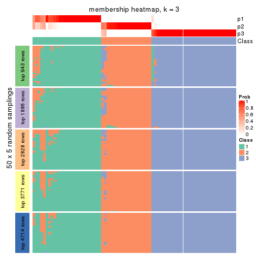</p>

</div>
<div id='tab-MAD-NMF-membership-heatmap-3'>
<pre><code class="r">membership_heatmap(res, k = 4)
</code></pre>

<p></p>

</div>
<div id='tab-MAD-NMF-membership-heatmap-4'>
<pre><code class="r">membership_heatmap(res, k = 5)
</code></pre>

<p>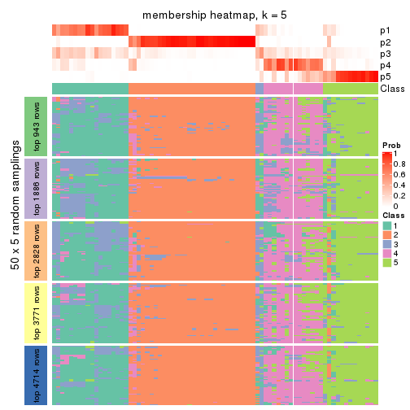</p>

</div>
<div id='tab-MAD-NMF-membership-heatmap-5'>
<pre><code class="r">membership_heatmap(res, k = 6)
</code></pre>

<p></p>

</div>
</div>

As soon as we have had the classes for columns, we can look for signatures
which are significantly different between classes which can be candidate marks
for certain classes. Following are the heatmaps for signatures.


Signature heatmaps where rows are scaled:


<script>
$( function() {
	$( '#tabs-MAD-NMF-get-signatures' ).tabs();
} );
</script>
<div id='tabs-MAD-NMF-get-signatures'>
<ul>
<li><a href='#tab-MAD-NMF-get-signatures-1'>k = 2</a></li>
<li><a href='#tab-MAD-NMF-get-signatures-2'>k = 3</a></li>
<li><a href='#tab-MAD-NMF-get-signatures-3'>k = 4</a></li>
<li><a href='#tab-MAD-NMF-get-signatures-4'>k = 5</a></li>
<li><a href='#tab-MAD-NMF-get-signatures-5'>k = 6</a></li>
</ul>
<div id='tab-MAD-NMF-get-signatures-1'>
<pre><code class="r">get_signatures(res, k = 2)
</code></pre>

<p></p>

</div>
<div id='tab-MAD-NMF-get-signatures-2'>
<pre><code class="r">get_signatures(res, k = 3)
</code></pre>

<p></p>

</div>
<div id='tab-MAD-NMF-get-signatures-3'>
<pre><code class="r">get_signatures(res, k = 4)
</code></pre>

<p></p>

</div>
<div id='tab-MAD-NMF-get-signatures-4'>
<pre><code class="r">get_signatures(res, k = 5)
</code></pre>

<p></p>

</div>
<div id='tab-MAD-NMF-get-signatures-5'>
<pre><code class="r">get_signatures(res, k = 6)
</code></pre>

<p></p>

</div>
</div>


Signature heatmaps where rows are not scaled:


<script>
$( function() {
	$( '#tabs-MAD-NMF-get-signatures-no-scale' ).tabs();
} );
</script>
<div id='tabs-MAD-NMF-get-signatures-no-scale'>
<ul>
<li><a href='#tab-MAD-NMF-get-signatures-no-scale-1'>k = 2</a></li>
<li><a href='#tab-MAD-NMF-get-signatures-no-scale-2'>k = 3</a></li>
<li><a href='#tab-MAD-NMF-get-signatures-no-scale-3'>k = 4</a></li>
<li><a href='#tab-MAD-NMF-get-signatures-no-scale-4'>k = 5</a></li>
<li><a href='#tab-MAD-NMF-get-signatures-no-scale-5'>k = 6</a></li>
</ul>
<div id='tab-MAD-NMF-get-signatures-no-scale-1'>
<pre><code class="r">get_signatures(res, k = 2, scale_rows = FALSE)
</code></pre>

<p></p>

</div>
<div id='tab-MAD-NMF-get-signatures-no-scale-2'>
<pre><code class="r">get_signatures(res, k = 3, scale_rows = FALSE)
</code></pre>

<p></p>

</div>
<div id='tab-MAD-NMF-get-signatures-no-scale-3'>
<pre><code class="r">get_signatures(res, k = 4, scale_rows = FALSE)
</code></pre>

<p></p>

</div>
<div id='tab-MAD-NMF-get-signatures-no-scale-4'>
<pre><code class="r">get_signatures(res, k = 5, scale_rows = FALSE)
</code></pre>

<p></p>

</div>
<div id='tab-MAD-NMF-get-signatures-no-scale-5'>
<pre><code class="r">get_signatures(res, k = 6, scale_rows = FALSE)
</code></pre>

<p></p>

</div>
</div>


Compare the overlap of signatures from different k:

```r
compare_signatures(res)
```


`get_signature()` returns a data frame invisibly. TO get the list of signatures, the function
call should be assigned to a variable explicitly. In following code, if `plot` argument is set
to `FALSE`, no heatmap is plotted while only the differential analysis is performed.

```r
# code only for demonstration
tb = get_signature(res, k = ..., plot = FALSE)
```

An example of the output of `tb` is:

```
#>   which_row         fdr    mean_1    mean_2 scaled_mean_1 scaled_mean_2 km
#> 1        38 0.042760348  8.373488  9.131774    -0.5533452     0.5164555  1
#> 2        40 0.018707592  7.106213  8.469186    -0.6173731     0.5762149  1
#> 3        55 0.019134737 10.221463 11.207825    -0.6159697     0.5749050  1
#> 4        59 0.006059896  5.921854  7.869574    -0.6899429     0.6439467  1
#> 5        60 0.018055526  8.928898 10.211722    -0.6204761     0.5791110  1
#> 6        98 0.009384629 15.714769 14.887706     0.6635654    -0.6193277  2
...
```

The columns in `tb` are:

1. `which_row`: row indices corresponding to the input matrix.
2. `fdr`: FDR for the differential test. 
3. `mean_x`: The mean value in group x.
4. `scaled_mean_x`: The mean value in group x after rows are scaled.
5. `km`: Row groups if k-means clustering is applied to rows.


UMAP plot which shows how samples are separated.


<script>
$( function() {
	$( '#tabs-MAD-NMF-dimension-reduction' ).tabs();
} );
</script>
<div id='tabs-MAD-NMF-dimension-reduction'>
<ul>
<li><a href='#tab-MAD-NMF-dimension-reduction-1'>k = 2</a></li>
<li><a href='#tab-MAD-NMF-dimension-reduction-2'>k = 3</a></li>
<li><a href='#tab-MAD-NMF-dimension-reduction-3'>k = 4</a></li>
<li><a href='#tab-MAD-NMF-dimension-reduction-4'>k = 5</a></li>
<li><a href='#tab-MAD-NMF-dimension-reduction-5'>k = 6</a></li>
</ul>
<div id='tab-MAD-NMF-dimension-reduction-1'>
<pre><code class="r">dimension_reduction(res, k = 2, method = &quot;UMAP&quot;)
</code></pre>

<p></p>

</div>
<div id='tab-MAD-NMF-dimension-reduction-2'>
<pre><code class="r">dimension_reduction(res, k = 3, method = &quot;UMAP&quot;)
</code></pre>

<p></p>

</div>
<div id='tab-MAD-NMF-dimension-reduction-3'>
<pre><code class="r">dimension_reduction(res, k = 4, method = &quot;UMAP&quot;)
</code></pre>

<p></p>

</div>
<div id='tab-MAD-NMF-dimension-reduction-4'>
<pre><code class="r">dimension_reduction(res, k = 5, method = &quot;UMAP&quot;)
</code></pre>

<p></p>

</div>
<div id='tab-MAD-NMF-dimension-reduction-5'>
<pre><code class="r">dimension_reduction(res, k = 6, method = &quot;UMAP&quot;)
</code></pre>

<p></p>

</div>
</div>


Following heatmap shows how subgroups are split when increasing `k`:

```r
collect_classes(res)
```


If matrix rows can be associated to genes, consider to use `GO_Enrichment(res,
...)` to perform function enrichment for the signature genes.


 

---------------------------------------------------


### ATC:hclust


The object with results only for a single top-value method and a single partition method 
can be extracted as:

```r
res = res_list["ATC", "hclust"]
# you can also extract it by
# res = res_list["ATC:hclust"]
```

A summary of `res` and all the functions that can be applied to it:

```r
res
```

```
#> A 'ConsensusPartition' object with k = 2, 3, 4, 5, 6.
#>   On a matrix with 9427 rows and 77 columns.
#>   Top rows (943, 1886, 2828, 3771, 4714) are extracted by 'ATC' method.
#>   Subgroups are detected by 'hclust' method.
#>   Performed in total 1250 partitions by row resampling.
#>   Best k for subgroups seems to be 4.
#> 
#> Following methods can be applied to this 'ConsensusPartition' object:
#>  [1] "cola_report"             "collect_classes"         "collect_plots"          
#>  [4] "collect_stats"           "colnames"                "compare_signatures"     
#>  [7] "consensus_heatmap"       "dimension_reduction"     "functional_enrichment"  
#> [10] "get_anno_col"            "get_anno"                "get_classes"            
#> [13] "get_consensus"           "get_matrix"              "get_membership"         
#> [16] "get_param"               "get_signatures"          "get_stats"              
#> [19] "is_best_k"               "is_stable_k"             "membership_heatmap"     
#> [22] "ncol"                    "nrow"                    "plot_ecdf"              
#> [25] "rownames"                "select_partition_number" "show"                   
#> [28] "suggest_best_k"          "test_to_known_factors"
```

`collect_plots()` function collects all the plots made from `res` for all `k` (number of partitions)
into one single page to provide an easy and fast comparison between different `k`.

```r
collect_plots(res)
```


The plots are:

- The first row: a plot of the ECDF (Empirical cumulative distribution
  function) curves of the consensus matrix for each `k` and the heatmap of
  predicted classes for each `k`.
- The second row: heatmaps of the consensus matrix for each `k`.
- The third row: heatmaps of the membership matrix for each `k`.
- The fouth row: heatmaps of the signatures for each `k`.

All the plots in panels can be made by individual functions and they are
plotted later in this section.

`select_partition_number()` produces several plots showing different
statistics for choosing "optimized" `k`. There are following statistics:

- ECDF curves of the consensus matrix for each `k`;
- 1-PAC. [The PAC
  score](https://en.wikipedia.org/wiki/Consensus_clustering#Over-interpretation_potential_of_consensus_clustering)
  measures the proportion of the ambiguous subgrouping.
- Mean silhouette score.
- Concordance. The mean probability of fiting the consensus class ids in all
  partitions.
- Area increased. Denote $A_k$ as the area under the ECDF curve for current
  `k`, the area increased is defined as $A_k - A_{k-1}$.
- Rand index. The percent of pairs of samples that are both in a same cluster
  or both are not in a same cluster in the partition of k and k-1.
- Jaccard index. The ratio of pairs of samples are both in a same cluster in
  the partition of k and k-1 and the pairs of samples are both in a same
  cluster in the partition k or k-1.

The detailed explanations of these statistics can be found in [the cola
vignette](http://bioconductor.org/packages/devel/bioc/vignettes/cola/inst/doc/cola.html#toc_13).

Generally speaking, lower PAC score, higher mean silhouette score or higher
concordance corresponds to better partition. Rand index and Jaccard index
measure how similar the current partition is compared to partition with `k-1`.
If they are too similar, we won't accept `k` is better than `k-1`.

```r
select_partition_number(res)
```


The numeric values for all these statistics can be obtained by `get_stats()`.

```r
get_stats(res)
```

```
#>   k 1-PAC mean_silhouette concordance area_increased  Rand Jaccard
#> 2 2 0.701           0.804       0.917         0.3937 0.576   0.576
#> 3 3 0.522           0.506       0.800         0.4522 0.756   0.603
#> 4 4 0.592           0.733       0.810         0.1904 0.758   0.474
#> 5 5 0.758           0.766       0.866         0.0777 0.967   0.881
#> 6 6 0.743           0.723       0.860         0.0282 0.993   0.973
```

`suggest_best_k()` suggests the best $k$ based on these statistics. The rules are as follows:

- All $k$ with Jaccard index larger than 0.95 are removed because the increase of
  the partition number does not provides enough extra information. If all $k$ are removed,
  the best $k$ is assigned by `NA`.
- For $k$ with 1-PAC larger than 0.9, the maximal $k$ is taken as the "best k". Other $k$ is called "optional k".
- If it does not fit the second rule. The $k$ with the highest vote of highest
  1-PAC, mean silhouette and concordance is taken as the "best k".

```r
suggest_best_k(res)
```

```
#> [1] 4
```


Following shows the table of the partitions (You need to click the **show/hide
code output** link to see it). The membership matrix (columns with name `p*`)
is inferred by
[`clue::cl_consensus()`](https://www.rdocumentation.org/link/cl_consensus?package=clue)
function with the `SE` method. Basically the value in the membership matrix
represents the probability to belong to a certain group. The finall class
label for an item is determined with the group with highest probability it
belongs to.

In `get_classes()` function, the entropy is calculated from the membership
matrix and the silhouette score is calculated from the consensus matrix.


<script>
$( function() {
	$( '#tabs-ATC-hclust-get-classes' ).tabs();
} );
</script>
<div id='tabs-ATC-hclust-get-classes'>
<ul>
<li><a href='#tab-ATC-hclust-get-classes-1'>k = 2</a></li>
<li><a href='#tab-ATC-hclust-get-classes-2'>k = 3</a></li>
<li><a href='#tab-ATC-hclust-get-classes-3'>k = 4</a></li>
<li><a href='#tab-ATC-hclust-get-classes-4'>k = 5</a></li>
<li><a href='#tab-ATC-hclust-get-classes-5'>k = 6</a></li>
</ul>

<div id='tab-ATC-hclust-get-classes-1'>
<p><a id='tab-ATC-hclust-get-classes-1-a' style='color:#0366d6' href='#'>show/hide code output</a></p>
<pre><code class="r">cbind(get_classes(res, k = 2), get_membership(res, k = 2))
</code></pre>

<pre><code>#&gt;           class entropy silhouette    p1    p2
#&gt; SRR944011     2  0.0938     0.9356 0.012 0.988
#&gt; SRR944012     1  0.9286     0.5776 0.656 0.344
#&gt; SRR944014     2  0.0000     0.9376 0.000 1.000
#&gt; SRR944013     2  0.0376     0.9373 0.004 0.996
#&gt; SRR944015     1  0.0000     0.8032 1.000 0.000
#&gt; SRR944016     2  0.9044     0.4165 0.320 0.680
#&gt; SRR944017     2  0.0376     0.9373 0.004 0.996
#&gt; SRR944018     1  0.9044     0.6078 0.680 0.320
#&gt; SRR944019     2  0.9850     0.0389 0.428 0.572
#&gt; SRR944020     1  0.0000     0.8032 1.000 0.000
#&gt; SRR944021     2  0.0000     0.9376 0.000 1.000
#&gt; SRR944022     1  0.0000     0.8032 1.000 0.000
#&gt; SRR944023     2  0.4022     0.8768 0.080 0.920
#&gt; SRR944024     1  0.9922     0.3871 0.552 0.448
#&gt; SRR944026     2  0.0000     0.9376 0.000 1.000
#&gt; SRR944025     2  0.0000     0.9376 0.000 1.000
#&gt; SRR944028     2  0.0000     0.9376 0.000 1.000
#&gt; SRR944029     2  0.1843     0.9271 0.028 0.972
#&gt; SRR944030     2  0.0000     0.9376 0.000 1.000
#&gt; SRR944031     2  0.3274     0.8987 0.060 0.940
#&gt; SRR944032     2  0.0938     0.9356 0.012 0.988
#&gt; SRR944033     2  0.0000     0.9376 0.000 1.000
#&gt; SRR944034     2  0.0000     0.9376 0.000 1.000
#&gt; SRR944036     2  0.1843     0.9271 0.028 0.972
#&gt; SRR944035     2  0.0000     0.9376 0.000 1.000
#&gt; SRR944038     1  0.0000     0.8032 1.000 0.000
#&gt; SRR944037     1  0.0000     0.8032 1.000 0.000
#&gt; SRR944039     2  0.9896    -0.0159 0.440 0.560
#&gt; SRR944040     2  0.0000     0.9376 0.000 1.000
#&gt; SRR944041     1  0.8661     0.6410 0.712 0.288
#&gt; SRR944042     2  0.2043     0.9247 0.032 0.968
#&gt; SRR944043     1  0.3114     0.7872 0.944 0.056
#&gt; SRR944044     2  0.0000     0.9376 0.000 1.000
#&gt; SRR944046     2  0.2043     0.9247 0.032 0.968
#&gt; SRR944045     2  0.0000     0.9376 0.000 1.000
#&gt; SRR944047     2  0.0000     0.9376 0.000 1.000
#&gt; SRR944048     2  0.9754     0.1149 0.408 0.592
#&gt; SRR944049     2  0.0000     0.9376 0.000 1.000
#&gt; SRR944050     2  0.9044     0.4165 0.320 0.680
#&gt; SRR944051     2  0.0938     0.9356 0.012 0.988
#&gt; SRR944052     2  0.0000     0.9376 0.000 1.000
#&gt; SRR944053     1  0.0000     0.8032 1.000 0.000
#&gt; SRR944054     2  0.0672     0.9366 0.008 0.992
#&gt; SRR944055     2  0.0938     0.9356 0.012 0.988
#&gt; SRR944056     2  0.0000     0.9376 0.000 1.000
#&gt; SRR944057     1  0.9998     0.2523 0.508 0.492
#&gt; SRR944058     1  0.9795     0.4615 0.584 0.416
#&gt; SRR944059     2  0.0938     0.9356 0.012 0.988
#&gt; SRR944060     1  0.5629     0.7539 0.868 0.132
#&gt; SRR944061     2  0.0000     0.9376 0.000 1.000
#&gt; SRR944062     1  0.0000     0.8032 1.000 0.000
#&gt; SRR944063     1  0.0000     0.8032 1.000 0.000
#&gt; SRR944064     2  0.0000     0.9376 0.000 1.000
#&gt; SRR944065     1  0.0000     0.8032 1.000 0.000
#&gt; SRR944066     1  0.9815     0.4533 0.580 0.420
#&gt; SRR944067     2  0.0000     0.9376 0.000 1.000
#&gt; SRR944068     1  0.0000     0.8032 1.000 0.000
#&gt; SRR944069     2  0.0000     0.9376 0.000 1.000
#&gt; SRR944070     1  0.0000     0.8032 1.000 0.000
#&gt; SRR944071     2  0.1843     0.9271 0.028 0.972
#&gt; SRR944072     1  0.9815     0.4536 0.580 0.420
#&gt; SRR944073     2  0.0000     0.9376 0.000 1.000
#&gt; SRR944075     2  0.0672     0.9366 0.008 0.992
#&gt; SRR944074     2  0.0000     0.9376 0.000 1.000
#&gt; SRR944076     2  0.1843     0.9271 0.028 0.972
#&gt; SRR944077     2  0.0000     0.9376 0.000 1.000
#&gt; SRR944078     2  0.0672     0.9366 0.008 0.992
#&gt; SRR944079     2  0.0000     0.9376 0.000 1.000
#&gt; SRR944080     2  0.0000     0.9376 0.000 1.000
#&gt; SRR944081     2  0.5842     0.7960 0.140 0.860
#&gt; SRR944082     1  0.0000     0.8032 1.000 0.000
#&gt; SRR944083     1  0.9922     0.3871 0.552 0.448
#&gt; SRR944084     2  0.2043     0.9247 0.032 0.968
#&gt; SRR944085     2  0.0938     0.9356 0.012 0.988
#&gt; SRR944086     2  0.4022     0.8772 0.080 0.920
#&gt; SRR944088     2  0.1633     0.9295 0.024 0.976
#&gt; SRR944087     2  0.2043     0.9247 0.032 0.968
</code></pre>

<script>
$('#tab-ATC-hclust-get-classes-1-a').parent().next().next().hide();
$('#tab-ATC-hclust-get-classes-1-a').click(function(){
  $('#tab-ATC-hclust-get-classes-1-a').parent().next().next().toggle();
  return(false);
});
</script>
</div>

<div id='tab-ATC-hclust-get-classes-2'>
<p><a id='tab-ATC-hclust-get-classes-2-a' style='color:#0366d6' href='#'>show/hide code output</a></p>
<pre><code class="r">cbind(get_classes(res, k = 3), get_membership(res, k = 3))
</code></pre>

<pre><code>#&gt;           class entropy silhouette    p1    p2    p3
#&gt; SRR944011     2  0.6295     0.2328 0.472 0.528 0.000
#&gt; SRR944012     1  0.3412     0.4366 0.876 0.000 0.124
#&gt; SRR944014     2  0.0000     0.7156 0.000 1.000 0.000
#&gt; SRR944013     2  0.5178     0.5300 0.256 0.744 0.000
#&gt; SRR944015     3  0.0000     0.8062 0.000 0.000 1.000
#&gt; SRR944016     1  0.4702     0.5415 0.788 0.212 0.000
#&gt; SRR944017     2  0.5178     0.5300 0.256 0.744 0.000
#&gt; SRR944018     1  0.4645     0.3420 0.816 0.008 0.176
#&gt; SRR944019     1  0.3038     0.6361 0.896 0.104 0.000
#&gt; SRR944020     3  0.4654     0.8150 0.208 0.000 0.792
#&gt; SRR944021     2  0.0000     0.7156 0.000 1.000 0.000
#&gt; SRR944022     3  0.0000     0.8062 0.000 0.000 1.000
#&gt; SRR944023     1  0.6267    -0.0486 0.548 0.452 0.000
#&gt; SRR944024     1  0.0892     0.5770 0.980 0.000 0.020
#&gt; SRR944026     2  0.0000     0.7156 0.000 1.000 0.000
#&gt; SRR944025     2  0.0000     0.7156 0.000 1.000 0.000
#&gt; SRR944028     2  0.0000     0.7156 0.000 1.000 0.000
#&gt; SRR944029     2  0.6309     0.1667 0.496 0.504 0.000
#&gt; SRR944030     2  0.0000     0.7156 0.000 1.000 0.000
#&gt; SRR944031     1  0.6295    -0.1171 0.528 0.472 0.000
#&gt; SRR944032     2  0.6280     0.2570 0.460 0.540 0.000
#&gt; SRR944033     2  0.0000     0.7156 0.000 1.000 0.000
#&gt; SRR944034     2  0.0000     0.7156 0.000 1.000 0.000
#&gt; SRR944036     2  0.6309     0.1667 0.496 0.504 0.000
#&gt; SRR944035     2  0.0000     0.7156 0.000 1.000 0.000
#&gt; SRR944038     3  0.5926     0.7621 0.356 0.000 0.644
#&gt; SRR944037     3  0.4121     0.8238 0.168 0.000 0.832
#&gt; SRR944039     1  0.3846     0.6338 0.876 0.108 0.016
#&gt; SRR944040     2  0.2711     0.6658 0.088 0.912 0.000
#&gt; SRR944041     1  0.4399     0.2918 0.812 0.000 0.188
#&gt; SRR944042     1  0.6309    -0.2129 0.500 0.500 0.000
#&gt; SRR944043     3  0.6308     0.5786 0.492 0.000 0.508
#&gt; SRR944044     2  0.0000     0.7156 0.000 1.000 0.000
#&gt; SRR944046     1  0.6309    -0.2129 0.500 0.500 0.000
#&gt; SRR944045     2  0.0000     0.7156 0.000 1.000 0.000
#&gt; SRR944047     2  0.0000     0.7156 0.000 1.000 0.000
#&gt; SRR944048     1  0.3412     0.6269 0.876 0.124 0.000
#&gt; SRR944049     2  0.0000     0.7156 0.000 1.000 0.000
#&gt; SRR944050     1  0.4702     0.5415 0.788 0.212 0.000
#&gt; SRR944051     2  0.6280     0.2570 0.460 0.540 0.000
#&gt; SRR944052     2  0.0000     0.7156 0.000 1.000 0.000
#&gt; SRR944053     3  0.0000     0.8062 0.000 0.000 1.000
#&gt; SRR944054     2  0.6274     0.2643 0.456 0.544 0.000
#&gt; SRR944055     2  0.6295     0.2328 0.472 0.528 0.000
#&gt; SRR944056     2  0.0000     0.7156 0.000 1.000 0.000
#&gt; SRR944057     1  0.1031     0.6017 0.976 0.024 0.000
#&gt; SRR944058     1  0.1860     0.5486 0.948 0.000 0.052
#&gt; SRR944059     2  0.6295     0.2328 0.472 0.528 0.000
#&gt; SRR944060     1  0.6180    -0.4167 0.584 0.000 0.416
#&gt; SRR944061     2  0.0000     0.7156 0.000 1.000 0.000
#&gt; SRR944062     3  0.5926     0.7621 0.356 0.000 0.644
#&gt; SRR944063     3  0.0592     0.8061 0.012 0.000 0.988
#&gt; SRR944064     2  0.0424     0.7118 0.008 0.992 0.000
#&gt; SRR944065     3  0.4062     0.8241 0.164 0.000 0.836
#&gt; SRR944066     1  0.1753     0.5528 0.952 0.000 0.048
#&gt; SRR944067     2  0.0000     0.7156 0.000 1.000 0.000
#&gt; SRR944068     3  0.0000     0.8062 0.000 0.000 1.000
#&gt; SRR944069     2  0.0000     0.7156 0.000 1.000 0.000
#&gt; SRR944070     3  0.5926     0.7621 0.356 0.000 0.644
#&gt; SRR944071     2  0.6309     0.1667 0.496 0.504 0.000
#&gt; SRR944072     1  0.1753     0.5530 0.952 0.000 0.048
#&gt; SRR944073     2  0.0000     0.7156 0.000 1.000 0.000
#&gt; SRR944075     2  0.6286     0.2496 0.464 0.536 0.000
#&gt; SRR944074     2  0.0000     0.7156 0.000 1.000 0.000
#&gt; SRR944076     2  0.6309     0.1667 0.496 0.504 0.000
#&gt; SRR944077     2  0.0000     0.7156 0.000 1.000 0.000
#&gt; SRR944078     2  0.6267     0.2695 0.452 0.548 0.000
#&gt; SRR944079     2  0.0000     0.7156 0.000 1.000 0.000
#&gt; SRR944080     2  0.0000     0.7156 0.000 1.000 0.000
#&gt; SRR944081     1  0.6095     0.1397 0.608 0.392 0.000
#&gt; SRR944082     3  0.5926     0.7621 0.356 0.000 0.644
#&gt; SRR944083     1  0.0892     0.5770 0.980 0.000 0.020
#&gt; SRR944084     2  0.6309     0.1538 0.500 0.500 0.000
#&gt; SRR944085     2  0.6295     0.2328 0.472 0.528 0.000
#&gt; SRR944086     1  0.6267    -0.0630 0.548 0.452 0.000
#&gt; SRR944088     2  0.6308     0.1786 0.492 0.508 0.000
#&gt; SRR944087     2  0.6309     0.1538 0.500 0.500 0.000
</code></pre>

<script>
$('#tab-ATC-hclust-get-classes-2-a').parent().next().next().hide();
$('#tab-ATC-hclust-get-classes-2-a').click(function(){
  $('#tab-ATC-hclust-get-classes-2-a').parent().next().next().toggle();
  return(false);
});
</script>
</div>

<div id='tab-ATC-hclust-get-classes-3'>
<p><a id='tab-ATC-hclust-get-classes-3-a' style='color:#0366d6' href='#'>show/hide code output</a></p>
<pre><code class="r">cbind(get_classes(res, k = 4), get_membership(res, k = 4))
</code></pre>

<pre><code>#&gt;           class entropy silhouette    p1    p2    p3    p4
#&gt; SRR944011     3  0.4193     0.8538 0.000 0.268 0.732 0.000
#&gt; SRR944012     1  0.3047     0.6427 0.872 0.000 0.116 0.012
#&gt; SRR944014     2  0.0000     0.9395 0.000 1.000 0.000 0.000
#&gt; SRR944013     2  0.4961    -0.1891 0.000 0.552 0.448 0.000
#&gt; SRR944015     4  0.0000     0.7420 0.000 0.000 0.000 1.000
#&gt; SRR944016     3  0.4746     0.1517 0.304 0.008 0.688 0.000
#&gt; SRR944017     2  0.4961    -0.1891 0.000 0.552 0.448 0.000
#&gt; SRR944018     1  0.5062     0.6162 0.752 0.000 0.184 0.064
#&gt; SRR944019     1  0.4907     0.5857 0.580 0.000 0.420 0.000
#&gt; SRR944020     4  0.5690     0.6953 0.268 0.000 0.060 0.672
#&gt; SRR944021     2  0.0000     0.9395 0.000 1.000 0.000 0.000
#&gt; SRR944022     4  0.0469     0.7402 0.000 0.000 0.012 0.988
#&gt; SRR944023     3  0.4552     0.8237 0.044 0.172 0.784 0.000
#&gt; SRR944024     1  0.3975     0.7478 0.760 0.000 0.240 0.000
#&gt; SRR944026     2  0.0000     0.9395 0.000 1.000 0.000 0.000
#&gt; SRR944025     2  0.0000     0.9395 0.000 1.000 0.000 0.000
#&gt; SRR944028     2  0.0000     0.9395 0.000 1.000 0.000 0.000
#&gt; SRR944029     3  0.3726     0.8660 0.000 0.212 0.788 0.000
#&gt; SRR944030     2  0.0000     0.9395 0.000 1.000 0.000 0.000
#&gt; SRR944031     3  0.4365     0.8435 0.028 0.188 0.784 0.000
#&gt; SRR944032     3  0.4304     0.8389 0.000 0.284 0.716 0.000
#&gt; SRR944033     2  0.0000     0.9395 0.000 1.000 0.000 0.000
#&gt; SRR944034     2  0.0000     0.9395 0.000 1.000 0.000 0.000
#&gt; SRR944036     3  0.3726     0.8660 0.000 0.212 0.788 0.000
#&gt; SRR944035     2  0.0000     0.9395 0.000 1.000 0.000 0.000
#&gt; SRR944038     4  0.6465     0.5923 0.412 0.000 0.072 0.516
#&gt; SRR944037     4  0.4826     0.7237 0.264 0.000 0.020 0.716
#&gt; SRR944039     1  0.4817     0.6363 0.612 0.000 0.388 0.000
#&gt; SRR944040     2  0.3942     0.5641 0.000 0.764 0.236 0.000
#&gt; SRR944041     1  0.4285     0.5798 0.820 0.000 0.104 0.076
#&gt; SRR944042     3  0.4049     0.8652 0.008 0.212 0.780 0.000
#&gt; SRR944043     1  0.6215    -0.3207 0.600 0.000 0.072 0.328
#&gt; SRR944044     2  0.0000     0.9395 0.000 1.000 0.000 0.000
#&gt; SRR944046     3  0.4049     0.8652 0.008 0.212 0.780 0.000
#&gt; SRR944045     2  0.0336     0.9315 0.000 0.992 0.008 0.000
#&gt; SRR944047     2  0.0000     0.9395 0.000 1.000 0.000 0.000
#&gt; SRR944048     3  0.4925    -0.2412 0.428 0.000 0.572 0.000
#&gt; SRR944049     2  0.0000     0.9395 0.000 1.000 0.000 0.000
#&gt; SRR944050     3  0.4746     0.1517 0.304 0.008 0.688 0.000
#&gt; SRR944051     3  0.4304     0.8389 0.000 0.284 0.716 0.000
#&gt; SRR944052     2  0.0000     0.9395 0.000 1.000 0.000 0.000
#&gt; SRR944053     4  0.0000     0.7420 0.000 0.000 0.000 1.000
#&gt; SRR944054     3  0.4331     0.8344 0.000 0.288 0.712 0.000
#&gt; SRR944055     3  0.4193     0.8538 0.000 0.268 0.732 0.000
#&gt; SRR944056     2  0.0000     0.9395 0.000 1.000 0.000 0.000
#&gt; SRR944057     1  0.4522     0.7081 0.680 0.000 0.320 0.000
#&gt; SRR944058     1  0.4327     0.7462 0.768 0.000 0.216 0.016
#&gt; SRR944059     3  0.4193     0.8538 0.000 0.268 0.732 0.000
#&gt; SRR944060     1  0.5845    -0.0594 0.672 0.000 0.076 0.252
#&gt; SRR944061     2  0.0000     0.9395 0.000 1.000 0.000 0.000
#&gt; SRR944062     4  0.6465     0.5923 0.412 0.000 0.072 0.516
#&gt; SRR944063     4  0.1302     0.7348 0.044 0.000 0.000 0.956
#&gt; SRR944064     2  0.1118     0.8997 0.000 0.964 0.036 0.000
#&gt; SRR944065     4  0.4642     0.7325 0.240 0.000 0.020 0.740
#&gt; SRR944066     1  0.3444     0.7364 0.816 0.000 0.184 0.000
#&gt; SRR944067     2  0.0000     0.9395 0.000 1.000 0.000 0.000
#&gt; SRR944068     4  0.0000     0.7420 0.000 0.000 0.000 1.000
#&gt; SRR944069     2  0.0000     0.9395 0.000 1.000 0.000 0.000
#&gt; SRR944070     4  0.6465     0.5923 0.412 0.000 0.072 0.516
#&gt; SRR944071     3  0.3726     0.8660 0.000 0.212 0.788 0.000
#&gt; SRR944072     1  0.3945     0.7464 0.780 0.000 0.216 0.004
#&gt; SRR944073     2  0.0000     0.9395 0.000 1.000 0.000 0.000
#&gt; SRR944075     3  0.4250     0.8473 0.000 0.276 0.724 0.000
#&gt; SRR944074     2  0.0000     0.9395 0.000 1.000 0.000 0.000
#&gt; SRR944076     3  0.3726     0.8660 0.000 0.212 0.788 0.000
#&gt; SRR944077     2  0.0000     0.9395 0.000 1.000 0.000 0.000
#&gt; SRR944078     3  0.4382     0.8240 0.000 0.296 0.704 0.000
#&gt; SRR944079     2  0.0000     0.9395 0.000 1.000 0.000 0.000
#&gt; SRR944080     2  0.0000     0.9395 0.000 1.000 0.000 0.000
#&gt; SRR944081     3  0.7249     0.5463 0.260 0.200 0.540 0.000
#&gt; SRR944082     4  0.6465     0.5923 0.412 0.000 0.072 0.516
#&gt; SRR944083     1  0.3975     0.7478 0.760 0.000 0.240 0.000
#&gt; SRR944084     3  0.4049     0.8652 0.008 0.212 0.780 0.000
#&gt; SRR944085     3  0.4193     0.8538 0.000 0.268 0.732 0.000
#&gt; SRR944086     3  0.5929     0.7803 0.108 0.204 0.688 0.000
#&gt; SRR944088     3  0.3764     0.8662 0.000 0.216 0.784 0.000
#&gt; SRR944087     3  0.4049     0.8652 0.008 0.212 0.780 0.000
</code></pre>

<script>
$('#tab-ATC-hclust-get-classes-3-a').parent().next().next().hide();
$('#tab-ATC-hclust-get-classes-3-a').click(function(){
  $('#tab-ATC-hclust-get-classes-3-a').parent().next().next().toggle();
  return(false);
});
</script>
</div>

<div id='tab-ATC-hclust-get-classes-4'>
<p><a id='tab-ATC-hclust-get-classes-4-a' style='color:#0366d6' href='#'>show/hide code output</a></p>
<pre><code class="r">cbind(get_classes(res, k = 5), get_membership(res, k = 5))
</code></pre>

<pre><code>#&gt;           class entropy silhouette    p1    p2    p3    p4    p5
#&gt; SRR944011     3  0.2561     0.8538 0.000 0.144 0.856 0.000 0.000
#&gt; SRR944012     1  0.4717     0.5785 0.704 0.000 0.048 0.004 0.244
#&gt; SRR944014     2  0.0000     0.9384 0.000 1.000 0.000 0.000 0.000
#&gt; SRR944013     2  0.4302    -0.0888 0.000 0.520 0.480 0.000 0.000
#&gt; SRR944015     4  0.0703     0.8068 0.000 0.000 0.000 0.976 0.024
#&gt; SRR944016     3  0.4291    -0.0345 0.464 0.000 0.536 0.000 0.000
#&gt; SRR944017     2  0.4302    -0.0888 0.000 0.520 0.480 0.000 0.000
#&gt; SRR944018     1  0.5483     0.1912 0.512 0.000 0.064 0.000 0.424
#&gt; SRR944019     1  0.3582     0.6629 0.768 0.000 0.224 0.000 0.008
#&gt; SRR944020     4  0.5575     0.5858 0.016 0.000 0.056 0.604 0.324
#&gt; SRR944021     2  0.0000     0.9384 0.000 1.000 0.000 0.000 0.000
#&gt; SRR944022     4  0.0324     0.8063 0.000 0.000 0.004 0.992 0.004
#&gt; SRR944023     3  0.2747     0.8300 0.060 0.048 0.888 0.000 0.004
#&gt; SRR944024     1  0.1211     0.7494 0.960 0.000 0.024 0.000 0.016
#&gt; SRR944026     2  0.0000     0.9384 0.000 1.000 0.000 0.000 0.000
#&gt; SRR944025     2  0.0000     0.9384 0.000 1.000 0.000 0.000 0.000
#&gt; SRR944028     2  0.0000     0.9384 0.000 1.000 0.000 0.000 0.000
#&gt; SRR944029     3  0.1638     0.8649 0.000 0.064 0.932 0.000 0.004
#&gt; SRR944030     2  0.0000     0.9384 0.000 1.000 0.000 0.000 0.000
#&gt; SRR944031     3  0.2597     0.8471 0.040 0.060 0.896 0.000 0.004
#&gt; SRR944032     3  0.2891     0.8313 0.000 0.176 0.824 0.000 0.000
#&gt; SRR944033     2  0.0000     0.9384 0.000 1.000 0.000 0.000 0.000
#&gt; SRR944034     2  0.0000     0.9384 0.000 1.000 0.000 0.000 0.000
#&gt; SRR944036     3  0.1478     0.8647 0.000 0.064 0.936 0.000 0.000
#&gt; SRR944035     2  0.0000     0.9384 0.000 1.000 0.000 0.000 0.000
#&gt; SRR944038     5  0.4563     0.8361 0.048 0.000 0.000 0.244 0.708
#&gt; SRR944037     4  0.5072     0.6126 0.032 0.000 0.016 0.652 0.300
#&gt; SRR944039     1  0.3690     0.6856 0.780 0.000 0.200 0.000 0.020
#&gt; SRR944040     2  0.3707     0.5317 0.000 0.716 0.284 0.000 0.000
#&gt; SRR944041     1  0.5124     0.5046 0.628 0.000 0.040 0.008 0.324
#&gt; SRR944042     3  0.1924     0.8640 0.008 0.064 0.924 0.000 0.004
#&gt; SRR944043     5  0.2464     0.7078 0.092 0.000 0.004 0.012 0.892
#&gt; SRR944044     2  0.0000     0.9384 0.000 1.000 0.000 0.000 0.000
#&gt; SRR944046     3  0.1924     0.8640 0.008 0.064 0.924 0.000 0.004
#&gt; SRR944045     2  0.0290     0.9313 0.000 0.992 0.008 0.000 0.000
#&gt; SRR944047     2  0.0000     0.9384 0.000 1.000 0.000 0.000 0.000
#&gt; SRR944048     1  0.4288     0.3596 0.612 0.000 0.384 0.000 0.004
#&gt; SRR944049     2  0.0000     0.9384 0.000 1.000 0.000 0.000 0.000
#&gt; SRR944050     3  0.4291    -0.0345 0.464 0.000 0.536 0.000 0.000
#&gt; SRR944051     3  0.2891     0.8313 0.000 0.176 0.824 0.000 0.000
#&gt; SRR944052     2  0.0000     0.9384 0.000 1.000 0.000 0.000 0.000
#&gt; SRR944053     4  0.0703     0.8068 0.000 0.000 0.000 0.976 0.024
#&gt; SRR944054     3  0.2929     0.8271 0.000 0.180 0.820 0.000 0.000
#&gt; SRR944055     3  0.2561     0.8538 0.000 0.144 0.856 0.000 0.000
#&gt; SRR944056     2  0.0000     0.9384 0.000 1.000 0.000 0.000 0.000
#&gt; SRR944057     1  0.2462     0.7344 0.880 0.000 0.112 0.000 0.008
#&gt; SRR944058     1  0.1612     0.7495 0.948 0.000 0.016 0.012 0.024
#&gt; SRR944059     3  0.2561     0.8538 0.000 0.144 0.856 0.000 0.000
#&gt; SRR944060     5  0.3873     0.6449 0.212 0.000 0.012 0.008 0.768
#&gt; SRR944061     2  0.0000     0.9384 0.000 1.000 0.000 0.000 0.000
#&gt; SRR944062     5  0.4589     0.8346 0.048 0.000 0.000 0.248 0.704
#&gt; SRR944063     4  0.1908     0.7917 0.000 0.000 0.000 0.908 0.092
#&gt; SRR944064     2  0.0963     0.9034 0.000 0.964 0.036 0.000 0.000
#&gt; SRR944065     4  0.4805     0.6383 0.032 0.000 0.016 0.700 0.252
#&gt; SRR944066     1  0.2505     0.7191 0.888 0.000 0.020 0.000 0.092
#&gt; SRR944067     2  0.0000     0.9384 0.000 1.000 0.000 0.000 0.000
#&gt; SRR944068     4  0.0703     0.8068 0.000 0.000 0.000 0.976 0.024
#&gt; SRR944069     2  0.0000     0.9384 0.000 1.000 0.000 0.000 0.000
#&gt; SRR944070     5  0.4563     0.8361 0.048 0.000 0.000 0.244 0.708
#&gt; SRR944071     3  0.1638     0.8649 0.000 0.064 0.932 0.000 0.004
#&gt; SRR944072     1  0.1701     0.7488 0.936 0.000 0.016 0.000 0.048
#&gt; SRR944073     2  0.0000     0.9384 0.000 1.000 0.000 0.000 0.000
#&gt; SRR944075     3  0.2648     0.8492 0.000 0.152 0.848 0.000 0.000
#&gt; SRR944074     2  0.0000     0.9384 0.000 1.000 0.000 0.000 0.000
#&gt; SRR944076     3  0.1638     0.8649 0.000 0.064 0.932 0.000 0.004
#&gt; SRR944077     2  0.0000     0.9384 0.000 1.000 0.000 0.000 0.000
#&gt; SRR944078     3  0.2852     0.8346 0.000 0.172 0.828 0.000 0.000
#&gt; SRR944079     2  0.0000     0.9384 0.000 1.000 0.000 0.000 0.000
#&gt; SRR944080     2  0.0000     0.9384 0.000 1.000 0.000 0.000 0.000
#&gt; SRR944081     3  0.5347     0.4357 0.316 0.064 0.616 0.000 0.004
#&gt; SRR944082     5  0.4589     0.8346 0.048 0.000 0.000 0.248 0.704
#&gt; SRR944083     1  0.1211     0.7494 0.960 0.000 0.024 0.000 0.016
#&gt; SRR944084     3  0.1924     0.8640 0.008 0.064 0.924 0.000 0.004
#&gt; SRR944085     3  0.2561     0.8538 0.000 0.144 0.856 0.000 0.000
#&gt; SRR944086     3  0.4028     0.7773 0.104 0.060 0.816 0.000 0.020
#&gt; SRR944088     3  0.1544     0.8654 0.000 0.068 0.932 0.000 0.000
#&gt; SRR944087     3  0.1924     0.8640 0.008 0.064 0.924 0.000 0.004
</code></pre>

<script>
$('#tab-ATC-hclust-get-classes-4-a').parent().next().next().hide();
$('#tab-ATC-hclust-get-classes-4-a').click(function(){
  $('#tab-ATC-hclust-get-classes-4-a').parent().next().next().toggle();
  return(false);
});
</script>
</div>

<div id='tab-ATC-hclust-get-classes-5'>
<p><a id='tab-ATC-hclust-get-classes-5-a' style='color:#0366d6' href='#'>show/hide code output</a></p>
<pre><code class="r">cbind(get_classes(res, k = 6), get_membership(res, k = 6))
</code></pre>

<pre><code>#&gt;           class entropy silhouette    p1    p2    p3    p4    p5    p6
#&gt; SRR944011     3  0.1863     0.8293 0.000 0.104 0.896 0.000 0.000 0.000
#&gt; SRR944012     5  0.3717     0.7768 0.384 0.000 0.000 0.000 0.616 0.000
#&gt; SRR944014     2  0.0000     0.9356 0.000 1.000 0.000 0.000 0.000 0.000
#&gt; SRR944013     2  0.3866    -0.0145 0.000 0.516 0.484 0.000 0.000 0.000
#&gt; SRR944015     4  0.0146     0.7653 0.000 0.000 0.000 0.996 0.000 0.004
#&gt; SRR944016     3  0.3995    -0.0706 0.480 0.000 0.516 0.000 0.004 0.000
#&gt; SRR944017     2  0.3866    -0.0145 0.000 0.516 0.484 0.000 0.000 0.000
#&gt; SRR944018     1  0.6193    -0.0511 0.472 0.000 0.044 0.000 0.116 0.368
#&gt; SRR944019     1  0.4915     0.3951 0.704 0.000 0.176 0.000 0.084 0.036
#&gt; SRR944020     4  0.5115     0.4882 0.000 0.000 0.000 0.460 0.460 0.080
#&gt; SRR944021     2  0.0000     0.9356 0.000 1.000 0.000 0.000 0.000 0.000
#&gt; SRR944022     4  0.1814     0.7610 0.000 0.000 0.000 0.900 0.100 0.000
#&gt; SRR944023     3  0.1674     0.8109 0.068 0.000 0.924 0.000 0.004 0.004
#&gt; SRR944024     1  0.0405     0.5156 0.988 0.000 0.004 0.000 0.000 0.008
#&gt; SRR944026     2  0.0000     0.9356 0.000 1.000 0.000 0.000 0.000 0.000
#&gt; SRR944025     2  0.0000     0.9356 0.000 1.000 0.000 0.000 0.000 0.000
#&gt; SRR944028     2  0.0000     0.9356 0.000 1.000 0.000 0.000 0.000 0.000
#&gt; SRR944029     3  0.0291     0.8434 0.004 0.004 0.992 0.000 0.000 0.000
#&gt; SRR944030     2  0.0000     0.9356 0.000 1.000 0.000 0.000 0.000 0.000
#&gt; SRR944031     3  0.1440     0.8272 0.044 0.004 0.944 0.000 0.004 0.004
#&gt; SRR944032     3  0.2340     0.7965 0.000 0.148 0.852 0.000 0.000 0.000
#&gt; SRR944033     2  0.0000     0.9356 0.000 1.000 0.000 0.000 0.000 0.000
#&gt; SRR944034     2  0.0000     0.9356 0.000 1.000 0.000 0.000 0.000 0.000
#&gt; SRR944036     3  0.0146     0.8432 0.000 0.004 0.996 0.000 0.000 0.000
#&gt; SRR944035     2  0.0000     0.9356 0.000 1.000 0.000 0.000 0.000 0.000
#&gt; SRR944038     6  0.2854     0.8080 0.000 0.000 0.000 0.208 0.000 0.792
#&gt; SRR944037     4  0.5547     0.5983 0.000 0.000 0.000 0.528 0.312 0.160
#&gt; SRR944039     1  0.4041     0.4414 0.764 0.000 0.172 0.000 0.044 0.020
#&gt; SRR944040     2  0.3371     0.5427 0.000 0.708 0.292 0.000 0.000 0.000
#&gt; SRR944041     5  0.5029     0.7673 0.444 0.000 0.000 0.000 0.484 0.072
#&gt; SRR944042     3  0.0653     0.8423 0.012 0.004 0.980 0.000 0.000 0.004
#&gt; SRR944043     6  0.3566     0.5996 0.024 0.000 0.000 0.000 0.224 0.752
#&gt; SRR944044     2  0.0000     0.9356 0.000 1.000 0.000 0.000 0.000 0.000
#&gt; SRR944046     3  0.0653     0.8423 0.012 0.004 0.980 0.000 0.000 0.004
#&gt; SRR944045     2  0.0260     0.9281 0.000 0.992 0.008 0.000 0.000 0.000
#&gt; SRR944047     2  0.0000     0.9356 0.000 1.000 0.000 0.000 0.000 0.000
#&gt; SRR944048     1  0.3659     0.2283 0.636 0.000 0.364 0.000 0.000 0.000
#&gt; SRR944049     2  0.0000     0.9356 0.000 1.000 0.000 0.000 0.000 0.000
#&gt; SRR944050     3  0.3995    -0.0706 0.480 0.000 0.516 0.000 0.004 0.000
#&gt; SRR944051     3  0.2340     0.7965 0.000 0.148 0.852 0.000 0.000 0.000
#&gt; SRR944052     2  0.0000     0.9356 0.000 1.000 0.000 0.000 0.000 0.000
#&gt; SRR944053     4  0.0146     0.7653 0.000 0.000 0.000 0.996 0.000 0.004
#&gt; SRR944054     3  0.2378     0.7921 0.000 0.152 0.848 0.000 0.000 0.000
#&gt; SRR944055     3  0.1863     0.8293 0.000 0.104 0.896 0.000 0.000 0.000
#&gt; SRR944056     2  0.0000     0.9356 0.000 1.000 0.000 0.000 0.000 0.000
#&gt; SRR944057     1  0.1858     0.5091 0.904 0.000 0.092 0.000 0.004 0.000
#&gt; SRR944058     1  0.2613     0.4061 0.848 0.000 0.000 0.000 0.140 0.012
#&gt; SRR944059     3  0.1863     0.8293 0.000 0.104 0.896 0.000 0.000 0.000
#&gt; SRR944060     6  0.5073     0.5159 0.152 0.000 0.004 0.000 0.196 0.648
#&gt; SRR944061     2  0.0000     0.9356 0.000 1.000 0.000 0.000 0.000 0.000
#&gt; SRR944062     6  0.2883     0.8068 0.000 0.000 0.000 0.212 0.000 0.788
#&gt; SRR944063     4  0.1865     0.7587 0.000 0.000 0.000 0.920 0.040 0.040
#&gt; SRR944064     2  0.0865     0.8988 0.000 0.964 0.036 0.000 0.000 0.000
#&gt; SRR944065     4  0.5289     0.6200 0.000 0.000 0.000 0.576 0.288 0.136
#&gt; SRR944066     1  0.1956     0.4462 0.908 0.000 0.004 0.000 0.008 0.080
#&gt; SRR944067     2  0.0000     0.9356 0.000 1.000 0.000 0.000 0.000 0.000
#&gt; SRR944068     4  0.0146     0.7653 0.000 0.000 0.000 0.996 0.000 0.004
#&gt; SRR944069     2  0.0000     0.9356 0.000 1.000 0.000 0.000 0.000 0.000
#&gt; SRR944070     6  0.2854     0.8080 0.000 0.000 0.000 0.208 0.000 0.792
#&gt; SRR944071     3  0.0436     0.8434 0.004 0.004 0.988 0.000 0.000 0.004
#&gt; SRR944072     1  0.2631     0.3675 0.820 0.000 0.000 0.000 0.180 0.000
#&gt; SRR944073     2  0.0000     0.9356 0.000 1.000 0.000 0.000 0.000 0.000
#&gt; SRR944075     3  0.1957     0.8245 0.000 0.112 0.888 0.000 0.000 0.000
#&gt; SRR944074     2  0.0000     0.9356 0.000 1.000 0.000 0.000 0.000 0.000
#&gt; SRR944076     3  0.0436     0.8434 0.004 0.004 0.988 0.000 0.000 0.004
#&gt; SRR944077     2  0.0000     0.9356 0.000 1.000 0.000 0.000 0.000 0.000
#&gt; SRR944078     3  0.2300     0.8004 0.000 0.144 0.856 0.000 0.000 0.000
#&gt; SRR944079     2  0.0000     0.9356 0.000 1.000 0.000 0.000 0.000 0.000
#&gt; SRR944080     2  0.0000     0.9356 0.000 1.000 0.000 0.000 0.000 0.000
#&gt; SRR944081     3  0.4600     0.4103 0.284 0.004 0.664 0.000 0.036 0.012
#&gt; SRR944082     6  0.2883     0.8068 0.000 0.000 0.000 0.212 0.000 0.788
#&gt; SRR944083     1  0.0405     0.5156 0.988 0.000 0.004 0.000 0.000 0.008
#&gt; SRR944084     3  0.0653     0.8423 0.012 0.004 0.980 0.000 0.000 0.004
#&gt; SRR944085     3  0.1863     0.8293 0.000 0.104 0.896 0.000 0.000 0.000
#&gt; SRR944086     3  0.3507     0.7053 0.016 0.000 0.816 0.000 0.124 0.044
#&gt; SRR944088     3  0.0260     0.8440 0.000 0.008 0.992 0.000 0.000 0.000
#&gt; SRR944087     3  0.0653     0.8423 0.012 0.004 0.980 0.000 0.000 0.004
</code></pre>

<script>
$('#tab-ATC-hclust-get-classes-5-a').parent().next().next().hide();
$('#tab-ATC-hclust-get-classes-5-a').click(function(){
  $('#tab-ATC-hclust-get-classes-5-a').parent().next().next().toggle();
  return(false);
});
</script>
</div>
</div>

Heatmaps for the consensus matrix. It visualizes the probability of two
samples to be in a same group.


<script>
$( function() {
	$( '#tabs-ATC-hclust-consensus-heatmap' ).tabs();
} );
</script>
<div id='tabs-ATC-hclust-consensus-heatmap'>
<ul>
<li><a href='#tab-ATC-hclust-consensus-heatmap-1'>k = 2</a></li>
<li><a href='#tab-ATC-hclust-consensus-heatmap-2'>k = 3</a></li>
<li><a href='#tab-ATC-hclust-consensus-heatmap-3'>k = 4</a></li>
<li><a href='#tab-ATC-hclust-consensus-heatmap-4'>k = 5</a></li>
<li><a href='#tab-ATC-hclust-consensus-heatmap-5'>k = 6</a></li>
</ul>
<div id='tab-ATC-hclust-consensus-heatmap-1'>
<pre><code class="r">consensus_heatmap(res, k = 2)
</code></pre>

<p></p>

</div>
<div id='tab-ATC-hclust-consensus-heatmap-2'>
<pre><code class="r">consensus_heatmap(res, k = 3)
</code></pre>

<p></p>

</div>
<div id='tab-ATC-hclust-consensus-heatmap-3'>
<pre><code class="r">consensus_heatmap(res, k = 4)
</code></pre>

<p></p>

</div>
<div id='tab-ATC-hclust-consensus-heatmap-4'>
<pre><code class="r">consensus_heatmap(res, k = 5)
</code></pre>

<p></p>

</div>
<div id='tab-ATC-hclust-consensus-heatmap-5'>
<pre><code class="r">consensus_heatmap(res, k = 6)
</code></pre>

<p></p>

</div>
</div>

Heatmaps for the membership of samples in all partitions to see how consistent they are:


<script>
$( function() {
	$( '#tabs-ATC-hclust-membership-heatmap' ).tabs();
} );
</script>
<div id='tabs-ATC-hclust-membership-heatmap'>
<ul>
<li><a href='#tab-ATC-hclust-membership-heatmap-1'>k = 2</a></li>
<li><a href='#tab-ATC-hclust-membership-heatmap-2'>k = 3</a></li>
<li><a href='#tab-ATC-hclust-membership-heatmap-3'>k = 4</a></li>
<li><a href='#tab-ATC-hclust-membership-heatmap-4'>k = 5</a></li>
<li><a href='#tab-ATC-hclust-membership-heatmap-5'>k = 6</a></li>
</ul>
<div id='tab-ATC-hclust-membership-heatmap-1'>
<pre><code class="r">membership_heatmap(res, k = 2)
</code></pre>

<p></p>

</div>
<div id='tab-ATC-hclust-membership-heatmap-2'>
<pre><code class="r">membership_heatmap(res, k = 3)
</code></pre>

<p></p>

</div>
<div id='tab-ATC-hclust-membership-heatmap-3'>
<pre><code class="r">membership_heatmap(res, k = 4)
</code></pre>

<p></p>

</div>
<div id='tab-ATC-hclust-membership-heatmap-4'>
<pre><code class="r">membership_heatmap(res, k = 5)
</code></pre>

<p></p>

</div>
<div id='tab-ATC-hclust-membership-heatmap-5'>
<pre><code class="r">membership_heatmap(res, k = 6)
</code></pre>

<p></p>

</div>
</div>

As soon as we have had the classes for columns, we can look for signatures
which are significantly different between classes which can be candidate marks
for certain classes. Following are the heatmaps for signatures.


Signature heatmaps where rows are scaled:


<script>
$( function() {
	$( '#tabs-ATC-hclust-get-signatures' ).tabs();
} );
</script>
<div id='tabs-ATC-hclust-get-signatures'>
<ul>
<li><a href='#tab-ATC-hclust-get-signatures-1'>k = 2</a></li>
<li><a href='#tab-ATC-hclust-get-signatures-2'>k = 3</a></li>
<li><a href='#tab-ATC-hclust-get-signatures-3'>k = 4</a></li>
<li><a href='#tab-ATC-hclust-get-signatures-4'>k = 5</a></li>
<li><a href='#tab-ATC-hclust-get-signatures-5'>k = 6</a></li>
</ul>
<div id='tab-ATC-hclust-get-signatures-1'>
<pre><code class="r">get_signatures(res, k = 2)
</code></pre>

<p></p>

</div>
<div id='tab-ATC-hclust-get-signatures-2'>
<pre><code class="r">get_signatures(res, k = 3)
</code></pre>

<p>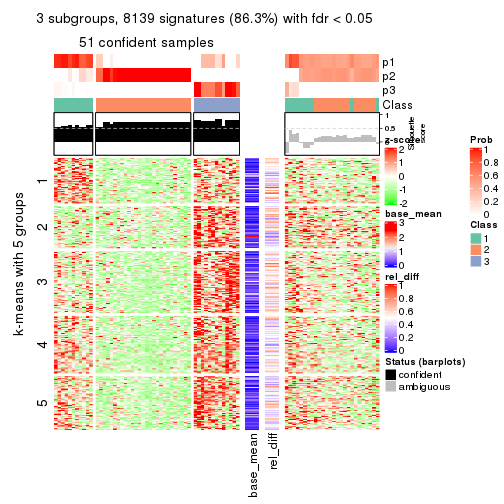</p>

</div>
<div id='tab-ATC-hclust-get-signatures-3'>
<pre><code class="r">get_signatures(res, k = 4)
</code></pre>

<p></p>

</div>
<div id='tab-ATC-hclust-get-signatures-4'>
<pre><code class="r">get_signatures(res, k = 5)
</code></pre>

<p></p>

</div>
<div id='tab-ATC-hclust-get-signatures-5'>
<pre><code class="r">get_signatures(res, k = 6)
</code></pre>

<p></p>

</div>
</div>


Signature heatmaps where rows are not scaled:


<script>
$( function() {
	$( '#tabs-ATC-hclust-get-signatures-no-scale' ).tabs();
} );
</script>
<div id='tabs-ATC-hclust-get-signatures-no-scale'>
<ul>
<li><a href='#tab-ATC-hclust-get-signatures-no-scale-1'>k = 2</a></li>
<li><a href='#tab-ATC-hclust-get-signatures-no-scale-2'>k = 3</a></li>
<li><a href='#tab-ATC-hclust-get-signatures-no-scale-3'>k = 4</a></li>
<li><a href='#tab-ATC-hclust-get-signatures-no-scale-4'>k = 5</a></li>
<li><a href='#tab-ATC-hclust-get-signatures-no-scale-5'>k = 6</a></li>
</ul>
<div id='tab-ATC-hclust-get-signatures-no-scale-1'>
<pre><code class="r">get_signatures(res, k = 2, scale_rows = FALSE)
</code></pre>

<p></p>

</div>
<div id='tab-ATC-hclust-get-signatures-no-scale-2'>
<pre><code class="r">get_signatures(res, k = 3, scale_rows = FALSE)
</code></pre>

<p></p>

</div>
<div id='tab-ATC-hclust-get-signatures-no-scale-3'>
<pre><code class="r">get_signatures(res, k = 4, scale_rows = FALSE)
</code></pre>

<pre><code>#&gt; Error in mat[ceiling(1:nr/h_ratio), ceiling(1:nc/w_ratio), drop = FALSE]: subscript out of bounds
</code></pre>

<p></p>

</div>
<div id='tab-ATC-hclust-get-signatures-no-scale-4'>
<pre><code class="r">get_signatures(res, k = 5, scale_rows = FALSE)
</code></pre>

<pre><code>#&gt; Error in mat[ceiling(1:nr/h_ratio), ceiling(1:nc/w_ratio), drop = FALSE]: subscript out of bounds
</code></pre>

<p></p>

</div>
<div id='tab-ATC-hclust-get-signatures-no-scale-5'>
<pre><code class="r">get_signatures(res, k = 6, scale_rows = FALSE)
</code></pre>

<pre><code>#&gt; Error in mat[ceiling(1:nr/h_ratio), ceiling(1:nc/w_ratio), drop = FALSE]: subscript out of bounds
</code></pre>

<p></p>

</div>
</div>


Compare the overlap of signatures from different k:

```r
compare_signatures(res)
```


`get_signature()` returns a data frame invisibly. TO get the list of signatures, the function
call should be assigned to a variable explicitly. In following code, if `plot` argument is set
to `FALSE`, no heatmap is plotted while only the differential analysis is performed.

```r
# code only for demonstration
tb = get_signature(res, k = ..., plot = FALSE)
```

An example of the output of `tb` is:

```
#>   which_row         fdr    mean_1    mean_2 scaled_mean_1 scaled_mean_2 km
#> 1        38 0.042760348  8.373488  9.131774    -0.5533452     0.5164555  1
#> 2        40 0.018707592  7.106213  8.469186    -0.6173731     0.5762149  1
#> 3        55 0.019134737 10.221463 11.207825    -0.6159697     0.5749050  1
#> 4        59 0.006059896  5.921854  7.869574    -0.6899429     0.6439467  1
#> 5        60 0.018055526  8.928898 10.211722    -0.6204761     0.5791110  1
#> 6        98 0.009384629 15.714769 14.887706     0.6635654    -0.6193277  2
...
```

The columns in `tb` are:

1. `which_row`: row indices corresponding to the input matrix.
2. `fdr`: FDR for the differential test. 
3. `mean_x`: The mean value in group x.
4. `scaled_mean_x`: The mean value in group x after rows are scaled.
5. `km`: Row groups if k-means clustering is applied to rows.


UMAP plot which shows how samples are separated.


<script>
$( function() {
	$( '#tabs-ATC-hclust-dimension-reduction' ).tabs();
} );
</script>
<div id='tabs-ATC-hclust-dimension-reduction'>
<ul>
<li><a href='#tab-ATC-hclust-dimension-reduction-1'>k = 2</a></li>
<li><a href='#tab-ATC-hclust-dimension-reduction-2'>k = 3</a></li>
<li><a href='#tab-ATC-hclust-dimension-reduction-3'>k = 4</a></li>
<li><a href='#tab-ATC-hclust-dimension-reduction-4'>k = 5</a></li>
<li><a href='#tab-ATC-hclust-dimension-reduction-5'>k = 6</a></li>
</ul>
<div id='tab-ATC-hclust-dimension-reduction-1'>
<pre><code class="r">dimension_reduction(res, k = 2, method = &quot;UMAP&quot;)
</code></pre>

<p></p>

</div>
<div id='tab-ATC-hclust-dimension-reduction-2'>
<pre><code class="r">dimension_reduction(res, k = 3, method = &quot;UMAP&quot;)
</code></pre>

<p></p>

</div>
<div id='tab-ATC-hclust-dimension-reduction-3'>
<pre><code class="r">dimension_reduction(res, k = 4, method = &quot;UMAP&quot;)
</code></pre>

<p></p>

</div>
<div id='tab-ATC-hclust-dimension-reduction-4'>
<pre><code class="r">dimension_reduction(res, k = 5, method = &quot;UMAP&quot;)
</code></pre>

<p></p>

</div>
<div id='tab-ATC-hclust-dimension-reduction-5'>
<pre><code class="r">dimension_reduction(res, k = 6, method = &quot;UMAP&quot;)
</code></pre>

<p></p>

</div>
</div>


Following heatmap shows how subgroups are split when increasing `k`:

```r
collect_classes(res)
```


If matrix rows can be associated to genes, consider to use `GO_Enrichment(res,
...)` to perform function enrichment for the signature genes.


 

---------------------------------------------------


### ATC:kmeans*


The object with results only for a single top-value method and a single partition method 
can be extracted as:

```r
res = res_list["ATC", "kmeans"]
# you can also extract it by
# res = res_list["ATC:kmeans"]
```

A summary of `res` and all the functions that can be applied to it:

```r
res
```

```
#> A 'ConsensusPartition' object with k = 2, 3, 4, 5, 6.
#>   On a matrix with 9427 rows and 77 columns.
#>   Top rows (943, 1886, 2828, 3771, 4714) are extracted by 'ATC' method.
#>   Subgroups are detected by 'kmeans' method.
#>   Performed in total 1250 partitions by row resampling.
#>   Best k for subgroups seems to be 4.
#> 
#> Following methods can be applied to this 'ConsensusPartition' object:
#>  [1] "cola_report"             "collect_classes"         "collect_plots"          
#>  [4] "collect_stats"           "colnames"                "compare_signatures"     
#>  [7] "consensus_heatmap"       "dimension_reduction"     "functional_enrichment"  
#> [10] "get_anno_col"            "get_anno"                "get_classes"            
#> [13] "get_consensus"           "get_matrix"              "get_membership"         
#> [16] "get_param"               "get_signatures"          "get_stats"              
#> [19] "is_best_k"               "is_stable_k"             "membership_heatmap"     
#> [22] "ncol"                    "nrow"                    "plot_ecdf"              
#> [25] "rownames"                "select_partition_number" "show"                   
#> [28] "suggest_best_k"          "test_to_known_factors"
```

`collect_plots()` function collects all the plots made from `res` for all `k` (number of partitions)
into one single page to provide an easy and fast comparison between different `k`.

```r
collect_plots(res)
```


The plots are:

- The first row: a plot of the ECDF (Empirical cumulative distribution
  function) curves of the consensus matrix for each `k` and the heatmap of
  predicted classes for each `k`.
- The second row: heatmaps of the consensus matrix for each `k`.
- The third row: heatmaps of the membership matrix for each `k`.
- The fouth row: heatmaps of the signatures for each `k`.

All the plots in panels can be made by individual functions and they are
plotted later in this section.

`select_partition_number()` produces several plots showing different
statistics for choosing "optimized" `k`. There are following statistics:

- ECDF curves of the consensus matrix for each `k`;
- 1-PAC. [The PAC
  score](https://en.wikipedia.org/wiki/Consensus_clustering#Over-interpretation_potential_of_consensus_clustering)
  measures the proportion of the ambiguous subgrouping.
- Mean silhouette score.
- Concordance. The mean probability of fiting the consensus class ids in all
  partitions.
- Area increased. Denote $A_k$ as the area under the ECDF curve for current
  `k`, the area increased is defined as $A_k - A_{k-1}$.
- Rand index. The percent of pairs of samples that are both in a same cluster
  or both are not in a same cluster in the partition of k and k-1.
- Jaccard index. The ratio of pairs of samples are both in a same cluster in
  the partition of k and k-1 and the pairs of samples are both in a same
  cluster in the partition k or k-1.

The detailed explanations of these statistics can be found in [the cola
vignette](http://bioconductor.org/packages/devel/bioc/vignettes/cola/inst/doc/cola.html#toc_13).

Generally speaking, lower PAC score, higher mean silhouette score or higher
concordance corresponds to better partition. Rand index and Jaccard index
measure how similar the current partition is compared to partition with `k-1`.
If they are too similar, we won't accept `k` is better than `k-1`.

```r
select_partition_number(res)
```


The numeric values for all these statistics can be obtained by `get_stats()`.

```r
get_stats(res)
```

```
#>   k 1-PAC mean_silhouette concordance area_increased  Rand Jaccard
#> 2 2 0.781           0.905       0.953         0.4765 0.539   0.539
#> 3 3 0.793           0.625       0.866         0.3814 0.687   0.487
#> 4 4 0.902           0.915       0.951         0.1125 0.791   0.506
#> 5 5 0.812           0.677       0.792         0.0513 0.943   0.790
#> 6 6 0.813           0.670       0.796         0.0373 0.949   0.780
```

`suggest_best_k()` suggests the best $k$ based on these statistics. The rules are as follows:

- All $k$ with Jaccard index larger than 0.95 are removed because the increase of
  the partition number does not provides enough extra information. If all $k$ are removed,
  the best $k$ is assigned by `NA`.
- For $k$ with 1-PAC larger than 0.9, the maximal $k$ is taken as the "best k". Other $k$ is called "optional k".
- If it does not fit the second rule. The $k$ with the highest vote of highest
  1-PAC, mean silhouette and concordance is taken as the "best k".

```r
suggest_best_k(res)
```

```
#> [1] 4
```


Following shows the table of the partitions (You need to click the **show/hide
code output** link to see it). The membership matrix (columns with name `p*`)
is inferred by
[`clue::cl_consensus()`](https://www.rdocumentation.org/link/cl_consensus?package=clue)
function with the `SE` method. Basically the value in the membership matrix
represents the probability to belong to a certain group. The finall class
label for an item is determined with the group with highest probability it
belongs to.

In `get_classes()` function, the entropy is calculated from the membership
matrix and the silhouette score is calculated from the consensus matrix.


<script>
$( function() {
	$( '#tabs-ATC-kmeans-get-classes' ).tabs();
} );
</script>
<div id='tabs-ATC-kmeans-get-classes'>
<ul>
<li><a href='#tab-ATC-kmeans-get-classes-1'>k = 2</a></li>
<li><a href='#tab-ATC-kmeans-get-classes-2'>k = 3</a></li>
<li><a href='#tab-ATC-kmeans-get-classes-3'>k = 4</a></li>
<li><a href='#tab-ATC-kmeans-get-classes-4'>k = 5</a></li>
<li><a href='#tab-ATC-kmeans-get-classes-5'>k = 6</a></li>
</ul>

<div id='tab-ATC-kmeans-get-classes-1'>
<p><a id='tab-ATC-kmeans-get-classes-1-a' style='color:#0366d6' href='#'>show/hide code output</a></p>
<pre><code class="r">cbind(get_classes(res, k = 2), get_membership(res, k = 2))
</code></pre>

<pre><code>#&gt;           class entropy silhouette    p1    p2
#&gt; SRR944011     2   0.000      0.925 0.000 1.000
#&gt; SRR944012     1   0.000      0.998 1.000 0.000
#&gt; SRR944014     2   0.000      0.925 0.000 1.000
#&gt; SRR944013     2   0.000      0.925 0.000 1.000
#&gt; SRR944015     1   0.000      0.998 1.000 0.000
#&gt; SRR944016     2   0.722      0.781 0.200 0.800
#&gt; SRR944017     2   0.000      0.925 0.000 1.000
#&gt; SRR944018     1   0.000      0.998 1.000 0.000
#&gt; SRR944019     1   0.000      0.998 1.000 0.000
#&gt; SRR944020     1   0.000      0.998 1.000 0.000
#&gt; SRR944021     2   0.000      0.925 0.000 1.000
#&gt; SRR944022     1   0.000      0.998 1.000 0.000
#&gt; SRR944023     1   0.000      0.998 1.000 0.000
#&gt; SRR944024     1   0.000      0.998 1.000 0.000
#&gt; SRR944026     2   0.000      0.925 0.000 1.000
#&gt; SRR944025     2   0.000      0.925 0.000 1.000
#&gt; SRR944028     2   0.000      0.925 0.000 1.000
#&gt; SRR944029     2   0.722      0.781 0.200 0.800
#&gt; SRR944030     2   0.000      0.925 0.000 1.000
#&gt; SRR944031     2   0.753      0.763 0.216 0.784
#&gt; SRR944032     2   0.000      0.925 0.000 1.000
#&gt; SRR944033     2   0.000      0.925 0.000 1.000
#&gt; SRR944034     2   0.000      0.925 0.000 1.000
#&gt; SRR944036     2   0.730      0.776 0.204 0.796
#&gt; SRR944035     2   0.000      0.925 0.000 1.000
#&gt; SRR944038     1   0.000      0.998 1.000 0.000
#&gt; SRR944037     1   0.000      0.998 1.000 0.000
#&gt; SRR944039     1   0.000      0.998 1.000 0.000
#&gt; SRR944040     2   0.000      0.925 0.000 1.000
#&gt; SRR944041     1   0.000      0.998 1.000 0.000
#&gt; SRR944042     1   0.000      0.998 1.000 0.000
#&gt; SRR944043     1   0.000      0.998 1.000 0.000
#&gt; SRR944044     2   0.000      0.925 0.000 1.000
#&gt; SRR944046     2   0.963      0.486 0.388 0.612
#&gt; SRR944045     2   0.000      0.925 0.000 1.000
#&gt; SRR944047     2   0.000      0.925 0.000 1.000
#&gt; SRR944048     2   0.680      0.799 0.180 0.820
#&gt; SRR944049     2   0.000      0.925 0.000 1.000
#&gt; SRR944050     2   0.689      0.795 0.184 0.816
#&gt; SRR944051     2   0.000      0.925 0.000 1.000
#&gt; SRR944052     2   0.000      0.925 0.000 1.000
#&gt; SRR944053     1   0.000      0.998 1.000 0.000
#&gt; SRR944054     2   0.000      0.925 0.000 1.000
#&gt; SRR944055     2   0.000      0.925 0.000 1.000
#&gt; SRR944056     2   0.000      0.925 0.000 1.000
#&gt; SRR944057     1   0.311      0.932 0.944 0.056
#&gt; SRR944058     1   0.000      0.998 1.000 0.000
#&gt; SRR944059     2   0.000      0.925 0.000 1.000
#&gt; SRR944060     1   0.000      0.998 1.000 0.000
#&gt; SRR944061     2   0.000      0.925 0.000 1.000
#&gt; SRR944062     1   0.000      0.998 1.000 0.000
#&gt; SRR944063     1   0.000      0.998 1.000 0.000
#&gt; SRR944064     2   0.000      0.925 0.000 1.000
#&gt; SRR944065     1   0.000      0.998 1.000 0.000
#&gt; SRR944066     1   0.000      0.998 1.000 0.000
#&gt; SRR944067     2   0.000      0.925 0.000 1.000
#&gt; SRR944068     1   0.000      0.998 1.000 0.000
#&gt; SRR944069     2   0.000      0.925 0.000 1.000
#&gt; SRR944070     1   0.000      0.998 1.000 0.000
#&gt; SRR944071     2   0.722      0.781 0.200 0.800
#&gt; SRR944072     1   0.000      0.998 1.000 0.000
#&gt; SRR944073     2   0.000      0.925 0.000 1.000
#&gt; SRR944075     2   0.000      0.925 0.000 1.000
#&gt; SRR944074     2   0.000      0.925 0.000 1.000
#&gt; SRR944076     2   0.722      0.781 0.200 0.800
#&gt; SRR944077     2   0.000      0.925 0.000 1.000
#&gt; SRR944078     2   0.000      0.925 0.000 1.000
#&gt; SRR944079     2   0.000      0.925 0.000 1.000
#&gt; SRR944080     2   0.000      0.925 0.000 1.000
#&gt; SRR944081     2   0.983      0.404 0.424 0.576
#&gt; SRR944082     1   0.000      0.998 1.000 0.000
#&gt; SRR944083     1   0.000      0.998 1.000 0.000
#&gt; SRR944084     2   0.983      0.404 0.424 0.576
#&gt; SRR944085     2   0.000      0.925 0.000 1.000
#&gt; SRR944086     2   0.990      0.363 0.440 0.560
#&gt; SRR944088     2   0.000      0.925 0.000 1.000
#&gt; SRR944087     2   0.844      0.690 0.272 0.728
</code></pre>

<script>
$('#tab-ATC-kmeans-get-classes-1-a').parent().next().next().hide();
$('#tab-ATC-kmeans-get-classes-1-a').click(function(){
  $('#tab-ATC-kmeans-get-classes-1-a').parent().next().next().toggle();
  return(false);
});
</script>
</div>

<div id='tab-ATC-kmeans-get-classes-2'>
<p><a id='tab-ATC-kmeans-get-classes-2-a' style='color:#0366d6' href='#'>show/hide code output</a></p>
<pre><code class="r">cbind(get_classes(res, k = 3), get_membership(res, k = 3))
</code></pre>

<pre><code>#&gt;           class entropy silhouette    p1    p2    p3
#&gt; SRR944011     1  0.6267    0.79280 0.548 0.452 0.000
#&gt; SRR944012     1  0.5706   -0.65283 0.680 0.000 0.320
#&gt; SRR944014     2  0.6267    0.83669 0.000 0.548 0.452
#&gt; SRR944013     2  0.5968    0.77639 0.000 0.636 0.364
#&gt; SRR944015     3  0.6267    1.00000 0.452 0.000 0.548
#&gt; SRR944016     1  0.6267    0.79280 0.548 0.452 0.000
#&gt; SRR944017     2  0.6267    0.83669 0.000 0.548 0.452
#&gt; SRR944018     1  0.6225    0.78150 0.568 0.432 0.000
#&gt; SRR944019     1  0.6267    0.79280 0.548 0.452 0.000
#&gt; SRR944020     3  0.6267    1.00000 0.452 0.000 0.548
#&gt; SRR944021     2  0.6267    0.83669 0.000 0.548 0.452
#&gt; SRR944022     3  0.6267    1.00000 0.452 0.000 0.548
#&gt; SRR944023     1  0.6267    0.79280 0.548 0.452 0.000
#&gt; SRR944024     1  0.1643   -0.00831 0.956 0.000 0.044
#&gt; SRR944026     2  0.6267    0.83669 0.000 0.548 0.452
#&gt; SRR944025     2  0.6267    0.83669 0.000 0.548 0.452
#&gt; SRR944028     2  0.6267    0.83669 0.000 0.548 0.452
#&gt; SRR944029     1  0.6267    0.79280 0.548 0.452 0.000
#&gt; SRR944030     2  0.6267    0.83669 0.000 0.548 0.452
#&gt; SRR944031     1  0.6267    0.79280 0.548 0.452 0.000
#&gt; SRR944032     1  0.6307    0.75186 0.512 0.488 0.000
#&gt; SRR944033     2  0.6267    0.83669 0.000 0.548 0.452
#&gt; SRR944034     2  0.6267    0.83669 0.000 0.548 0.452
#&gt; SRR944036     1  0.6267    0.79280 0.548 0.452 0.000
#&gt; SRR944035     2  0.6267    0.83669 0.000 0.548 0.452
#&gt; SRR944038     3  0.6267    1.00000 0.452 0.000 0.548
#&gt; SRR944037     3  0.6267    1.00000 0.452 0.000 0.548
#&gt; SRR944039     1  0.6267    0.79280 0.548 0.452 0.000
#&gt; SRR944040     2  0.6267    0.83669 0.000 0.548 0.452
#&gt; SRR944041     1  0.5706   -0.65283 0.680 0.000 0.320
#&gt; SRR944042     1  0.6267    0.79280 0.548 0.452 0.000
#&gt; SRR944043     3  0.6267    1.00000 0.452 0.000 0.548
#&gt; SRR944044     2  0.6267    0.83669 0.000 0.548 0.452
#&gt; SRR944046     1  0.6267    0.79280 0.548 0.452 0.000
#&gt; SRR944045     2  0.6267    0.83669 0.000 0.548 0.452
#&gt; SRR944047     2  0.6267    0.83669 0.000 0.548 0.452
#&gt; SRR944048     1  0.6267    0.79280 0.548 0.452 0.000
#&gt; SRR944049     2  0.6267    0.83669 0.000 0.548 0.452
#&gt; SRR944050     1  0.6267    0.79280 0.548 0.452 0.000
#&gt; SRR944051     2  0.5327   -0.36848 0.272 0.728 0.000
#&gt; SRR944052     2  0.6267    0.83669 0.000 0.548 0.452
#&gt; SRR944053     3  0.6267    1.00000 0.452 0.000 0.548
#&gt; SRR944054     2  0.0747    0.28011 0.016 0.984 0.000
#&gt; SRR944055     2  0.0424    0.29647 0.008 0.992 0.000
#&gt; SRR944056     2  0.6267    0.83669 0.000 0.548 0.452
#&gt; SRR944057     1  0.6267    0.79280 0.548 0.452 0.000
#&gt; SRR944058     1  0.6299   -0.90709 0.524 0.000 0.476
#&gt; SRR944059     2  0.1289    0.24491 0.032 0.968 0.000
#&gt; SRR944060     1  0.5363   -0.57398 0.724 0.000 0.276
#&gt; SRR944061     2  0.6267    0.83669 0.000 0.548 0.452
#&gt; SRR944062     3  0.6267    1.00000 0.452 0.000 0.548
#&gt; SRR944063     3  0.6267    1.00000 0.452 0.000 0.548
#&gt; SRR944064     2  0.6267    0.83669 0.000 0.548 0.452
#&gt; SRR944065     3  0.6267    1.00000 0.452 0.000 0.548
#&gt; SRR944066     1  0.5216   -0.54401 0.740 0.000 0.260
#&gt; SRR944067     2  0.6267    0.83669 0.000 0.548 0.452
#&gt; SRR944068     3  0.6267    1.00000 0.452 0.000 0.548
#&gt; SRR944069     2  0.6267    0.83669 0.000 0.548 0.452
#&gt; SRR944070     3  0.6267    1.00000 0.452 0.000 0.548
#&gt; SRR944071     1  0.6267    0.79280 0.548 0.452 0.000
#&gt; SRR944072     1  0.5706   -0.65283 0.680 0.000 0.320
#&gt; SRR944073     2  0.6267    0.83669 0.000 0.548 0.452
#&gt; SRR944075     2  0.5785   -0.48840 0.332 0.668 0.000
#&gt; SRR944074     2  0.6267    0.83669 0.000 0.548 0.452
#&gt; SRR944076     1  0.6267    0.79280 0.548 0.452 0.000
#&gt; SRR944077     2  0.6267    0.83669 0.000 0.548 0.452
#&gt; SRR944078     2  0.0661    0.31927 0.004 0.988 0.008
#&gt; SRR944079     2  0.6267    0.83669 0.000 0.548 0.452
#&gt; SRR944080     2  0.6267    0.83669 0.000 0.548 0.452
#&gt; SRR944081     1  0.6267    0.79280 0.548 0.452 0.000
#&gt; SRR944082     3  0.6267    1.00000 0.452 0.000 0.548
#&gt; SRR944083     1  0.6252    0.78862 0.556 0.444 0.000
#&gt; SRR944084     1  0.6267    0.79280 0.548 0.452 0.000
#&gt; SRR944085     2  0.6280   -0.69873 0.460 0.540 0.000
#&gt; SRR944086     1  0.6267    0.79280 0.548 0.452 0.000
#&gt; SRR944088     2  0.5327   -0.36848 0.272 0.728 0.000
#&gt; SRR944087     1  0.6267    0.79280 0.548 0.452 0.000
</code></pre>

<script>
$('#tab-ATC-kmeans-get-classes-2-a').parent().next().next().hide();
$('#tab-ATC-kmeans-get-classes-2-a').click(function(){
  $('#tab-ATC-kmeans-get-classes-2-a').parent().next().next().toggle();
  return(false);
});
</script>
</div>

<div id='tab-ATC-kmeans-get-classes-3'>
<p><a id='tab-ATC-kmeans-get-classes-3-a' style='color:#0366d6' href='#'>show/hide code output</a></p>
<pre><code class="r">cbind(get_classes(res, k = 4), get_membership(res, k = 4))
</code></pre>

<pre><code>#&gt;           class entropy silhouette    p1    p2    p3    p4
#&gt; SRR944011     3  0.0188      0.923 0.004 0.000 0.996 0.000
#&gt; SRR944012     1  0.2334      0.882 0.908 0.000 0.004 0.088
#&gt; SRR944014     2  0.0000      0.996 0.000 1.000 0.000 0.000
#&gt; SRR944013     3  0.4655      0.532 0.004 0.312 0.684 0.000
#&gt; SRR944015     4  0.0000      0.901 0.000 0.000 0.000 1.000
#&gt; SRR944016     3  0.3528      0.840 0.192 0.000 0.808 0.000
#&gt; SRR944017     2  0.2149      0.904 0.000 0.912 0.088 0.000
#&gt; SRR944018     1  0.0188      0.918 0.996 0.000 0.004 0.000
#&gt; SRR944019     1  0.1118      0.897 0.964 0.000 0.036 0.000
#&gt; SRR944020     4  0.0000      0.901 0.000 0.000 0.000 1.000
#&gt; SRR944021     2  0.0000      0.996 0.000 1.000 0.000 0.000
#&gt; SRR944022     4  0.0000      0.901 0.000 0.000 0.000 1.000
#&gt; SRR944023     1  0.1118      0.899 0.964 0.000 0.036 0.000
#&gt; SRR944024     1  0.0376      0.919 0.992 0.000 0.004 0.004
#&gt; SRR944026     2  0.0000      0.996 0.000 1.000 0.000 0.000
#&gt; SRR944025     2  0.0000      0.996 0.000 1.000 0.000 0.000
#&gt; SRR944028     2  0.0000      0.996 0.000 1.000 0.000 0.000
#&gt; SRR944029     3  0.0336      0.921 0.008 0.000 0.992 0.000
#&gt; SRR944030     2  0.0000      0.996 0.000 1.000 0.000 0.000
#&gt; SRR944031     3  0.2216      0.921 0.092 0.000 0.908 0.000
#&gt; SRR944032     3  0.0188      0.922 0.004 0.000 0.996 0.000
#&gt; SRR944033     2  0.0000      0.996 0.000 1.000 0.000 0.000
#&gt; SRR944034     2  0.0000      0.996 0.000 1.000 0.000 0.000
#&gt; SRR944036     3  0.2216      0.921 0.092 0.000 0.908 0.000
#&gt; SRR944035     2  0.0000      0.996 0.000 1.000 0.000 0.000
#&gt; SRR944038     4  0.3074      0.807 0.152 0.000 0.000 0.848
#&gt; SRR944037     4  0.0000      0.901 0.000 0.000 0.000 1.000
#&gt; SRR944039     1  0.0336      0.917 0.992 0.000 0.008 0.000
#&gt; SRR944040     2  0.0000      0.996 0.000 1.000 0.000 0.000
#&gt; SRR944041     1  0.2281      0.878 0.904 0.000 0.000 0.096
#&gt; SRR944042     3  0.2216      0.921 0.092 0.000 0.908 0.000
#&gt; SRR944043     1  0.2530      0.864 0.888 0.000 0.000 0.112
#&gt; SRR944044     2  0.0000      0.996 0.000 1.000 0.000 0.000
#&gt; SRR944046     3  0.2216      0.921 0.092 0.000 0.908 0.000
#&gt; SRR944045     2  0.0000      0.996 0.000 1.000 0.000 0.000
#&gt; SRR944047     2  0.0000      0.996 0.000 1.000 0.000 0.000
#&gt; SRR944048     3  0.3528      0.840 0.192 0.000 0.808 0.000
#&gt; SRR944049     2  0.0000      0.996 0.000 1.000 0.000 0.000
#&gt; SRR944050     3  0.3528      0.840 0.192 0.000 0.808 0.000
#&gt; SRR944051     3  0.0336      0.921 0.008 0.000 0.992 0.000
#&gt; SRR944052     2  0.0000      0.996 0.000 1.000 0.000 0.000
#&gt; SRR944053     4  0.0000      0.901 0.000 0.000 0.000 1.000
#&gt; SRR944054     3  0.0376      0.920 0.004 0.004 0.992 0.000
#&gt; SRR944055     3  0.0336      0.921 0.000 0.008 0.992 0.000
#&gt; SRR944056     2  0.0000      0.996 0.000 1.000 0.000 0.000
#&gt; SRR944057     1  0.3219      0.734 0.836 0.000 0.164 0.000
#&gt; SRR944058     1  0.2345      0.876 0.900 0.000 0.000 0.100
#&gt; SRR944059     3  0.0336      0.921 0.000 0.008 0.992 0.000
#&gt; SRR944060     1  0.0592      0.917 0.984 0.000 0.000 0.016
#&gt; SRR944061     2  0.0000      0.996 0.000 1.000 0.000 0.000
#&gt; SRR944062     4  0.2921      0.818 0.140 0.000 0.000 0.860
#&gt; SRR944063     4  0.0000      0.901 0.000 0.000 0.000 1.000
#&gt; SRR944064     2  0.0000      0.996 0.000 1.000 0.000 0.000
#&gt; SRR944065     4  0.0000      0.901 0.000 0.000 0.000 1.000
#&gt; SRR944066     1  0.0376      0.919 0.992 0.000 0.004 0.004
#&gt; SRR944067     2  0.0000      0.996 0.000 1.000 0.000 0.000
#&gt; SRR944068     4  0.0000      0.901 0.000 0.000 0.000 1.000
#&gt; SRR944069     2  0.0000      0.996 0.000 1.000 0.000 0.000
#&gt; SRR944070     4  0.4624      0.538 0.340 0.000 0.000 0.660
#&gt; SRR944071     3  0.1557      0.925 0.056 0.000 0.944 0.000
#&gt; SRR944072     1  0.2345      0.876 0.900 0.000 0.000 0.100
#&gt; SRR944073     2  0.0000      0.996 0.000 1.000 0.000 0.000
#&gt; SRR944075     3  0.0188      0.923 0.004 0.000 0.996 0.000
#&gt; SRR944074     2  0.0000      0.996 0.000 1.000 0.000 0.000
#&gt; SRR944076     3  0.2216      0.921 0.092 0.000 0.908 0.000
#&gt; SRR944077     2  0.0000      0.996 0.000 1.000 0.000 0.000
#&gt; SRR944078     3  0.0336      0.921 0.000 0.008 0.992 0.000
#&gt; SRR944079     2  0.0000      0.996 0.000 1.000 0.000 0.000
#&gt; SRR944080     2  0.0000      0.996 0.000 1.000 0.000 0.000
#&gt; SRR944081     3  0.2281      0.921 0.096 0.000 0.904 0.000
#&gt; SRR944082     4  0.4776      0.441 0.376 0.000 0.000 0.624
#&gt; SRR944083     1  0.0336      0.917 0.992 0.000 0.008 0.000
#&gt; SRR944084     3  0.2281      0.921 0.096 0.000 0.904 0.000
#&gt; SRR944085     3  0.0188      0.923 0.004 0.000 0.996 0.000
#&gt; SRR944086     3  0.2281      0.921 0.096 0.000 0.904 0.000
#&gt; SRR944088     3  0.0336      0.921 0.008 0.000 0.992 0.000
#&gt; SRR944087     3  0.2216      0.921 0.092 0.000 0.908 0.000
</code></pre>

<script>
$('#tab-ATC-kmeans-get-classes-3-a').parent().next().next().hide();
$('#tab-ATC-kmeans-get-classes-3-a').click(function(){
  $('#tab-ATC-kmeans-get-classes-3-a').parent().next().next().toggle();
  return(false);
});
</script>
</div>

<div id='tab-ATC-kmeans-get-classes-4'>
<p><a id='tab-ATC-kmeans-get-classes-4-a' style='color:#0366d6' href='#'>show/hide code output</a></p>
<pre><code class="r">cbind(get_classes(res, k = 5), get_membership(res, k = 5))
</code></pre>

<pre><code>#&gt;           class entropy silhouette    p1    p2    p3    p4    p5
#&gt; SRR944011     5  0.3586     0.3805 0.000 0.000 0.264 0.000 0.736
#&gt; SRR944012     1  0.2646     0.7677 0.868 0.000 0.124 0.004 0.004
#&gt; SRR944014     2  0.0000     0.9880 0.000 1.000 0.000 0.000 0.000
#&gt; SRR944013     5  0.3521     0.2696 0.000 0.232 0.004 0.000 0.764
#&gt; SRR944015     4  0.0000     0.7925 0.000 0.000 0.000 1.000 0.000
#&gt; SRR944016     3  0.6338     0.4409 0.160 0.000 0.448 0.000 0.392
#&gt; SRR944017     2  0.3480     0.6903 0.000 0.752 0.000 0.000 0.248
#&gt; SRR944018     1  0.1544     0.8000 0.932 0.000 0.068 0.000 0.000
#&gt; SRR944019     1  0.5102     0.6326 0.696 0.000 0.176 0.000 0.128
#&gt; SRR944020     4  0.2536     0.7859 0.004 0.000 0.128 0.868 0.000
#&gt; SRR944021     2  0.0000     0.9880 0.000 1.000 0.000 0.000 0.000
#&gt; SRR944022     4  0.0162     0.7922 0.000 0.000 0.004 0.996 0.000
#&gt; SRR944023     3  0.6202     0.1664 0.372 0.000 0.484 0.000 0.144
#&gt; SRR944024     1  0.2280     0.7914 0.880 0.000 0.120 0.000 0.000
#&gt; SRR944026     2  0.0451     0.9792 0.000 0.988 0.004 0.000 0.008
#&gt; SRR944025     2  0.0000     0.9880 0.000 1.000 0.000 0.000 0.000
#&gt; SRR944028     2  0.0000     0.9880 0.000 1.000 0.000 0.000 0.000
#&gt; SRR944029     5  0.2605     0.4299 0.000 0.000 0.148 0.000 0.852
#&gt; SRR944030     2  0.0000     0.9880 0.000 1.000 0.000 0.000 0.000
#&gt; SRR944031     3  0.4306     0.5022 0.000 0.000 0.508 0.000 0.492
#&gt; SRR944032     5  0.0510     0.5521 0.000 0.000 0.016 0.000 0.984
#&gt; SRR944033     2  0.0000     0.9880 0.000 1.000 0.000 0.000 0.000
#&gt; SRR944034     2  0.0000     0.9880 0.000 1.000 0.000 0.000 0.000
#&gt; SRR944036     3  0.4302     0.5032 0.000 0.000 0.520 0.000 0.480
#&gt; SRR944035     2  0.0000     0.9880 0.000 1.000 0.000 0.000 0.000
#&gt; SRR944038     4  0.6130     0.6016 0.180 0.000 0.264 0.556 0.000
#&gt; SRR944037     4  0.3048     0.7799 0.004 0.000 0.176 0.820 0.000
#&gt; SRR944039     1  0.3326     0.7343 0.824 0.000 0.152 0.000 0.024
#&gt; SRR944040     2  0.0510     0.9743 0.000 0.984 0.000 0.000 0.016
#&gt; SRR944041     1  0.3128     0.7434 0.824 0.000 0.168 0.004 0.004
#&gt; SRR944042     3  0.4305     0.5015 0.000 0.000 0.512 0.000 0.488
#&gt; SRR944043     1  0.4866     0.5530 0.620 0.000 0.344 0.036 0.000
#&gt; SRR944044     2  0.0000     0.9880 0.000 1.000 0.000 0.000 0.000
#&gt; SRR944046     3  0.4306     0.5022 0.000 0.000 0.508 0.000 0.492
#&gt; SRR944045     2  0.0000     0.9880 0.000 1.000 0.000 0.000 0.000
#&gt; SRR944047     2  0.0000     0.9880 0.000 1.000 0.000 0.000 0.000
#&gt; SRR944048     3  0.6330     0.4455 0.160 0.000 0.456 0.000 0.384
#&gt; SRR944049     2  0.0000     0.9880 0.000 1.000 0.000 0.000 0.000
#&gt; SRR944050     3  0.6338     0.4409 0.160 0.000 0.448 0.000 0.392
#&gt; SRR944051     5  0.0703     0.5511 0.000 0.000 0.024 0.000 0.976
#&gt; SRR944052     2  0.0000     0.9880 0.000 1.000 0.000 0.000 0.000
#&gt; SRR944053     4  0.0000     0.7925 0.000 0.000 0.000 1.000 0.000
#&gt; SRR944054     5  0.0510     0.5541 0.000 0.000 0.016 0.000 0.984
#&gt; SRR944055     5  0.2852     0.5440 0.000 0.000 0.172 0.000 0.828
#&gt; SRR944056     2  0.0000     0.9880 0.000 1.000 0.000 0.000 0.000
#&gt; SRR944057     1  0.5369     0.3192 0.552 0.000 0.388 0.000 0.060
#&gt; SRR944058     1  0.1571     0.7886 0.936 0.000 0.060 0.004 0.000
#&gt; SRR944059     5  0.2852     0.5440 0.000 0.000 0.172 0.000 0.828
#&gt; SRR944060     1  0.3969     0.6521 0.692 0.000 0.304 0.004 0.000
#&gt; SRR944061     2  0.0000     0.9880 0.000 1.000 0.000 0.000 0.000
#&gt; SRR944062     4  0.6111     0.6063 0.180 0.000 0.260 0.560 0.000
#&gt; SRR944063     4  0.0510     0.7945 0.000 0.000 0.016 0.984 0.000
#&gt; SRR944064     2  0.0000     0.9880 0.000 1.000 0.000 0.000 0.000
#&gt; SRR944065     4  0.2930     0.7829 0.004 0.000 0.164 0.832 0.000
#&gt; SRR944066     1  0.2127     0.7919 0.892 0.000 0.108 0.000 0.000
#&gt; SRR944067     2  0.0000     0.9880 0.000 1.000 0.000 0.000 0.000
#&gt; SRR944068     4  0.0000     0.7925 0.000 0.000 0.000 1.000 0.000
#&gt; SRR944069     2  0.0000     0.9880 0.000 1.000 0.000 0.000 0.000
#&gt; SRR944070     4  0.6734     0.3285 0.324 0.000 0.268 0.408 0.000
#&gt; SRR944071     5  0.4304    -0.5064 0.000 0.000 0.484 0.000 0.516
#&gt; SRR944072     1  0.0451     0.7989 0.988 0.000 0.008 0.004 0.000
#&gt; SRR944073     2  0.0000     0.9880 0.000 1.000 0.000 0.000 0.000
#&gt; SRR944075     5  0.2891     0.5400 0.000 0.000 0.176 0.000 0.824
#&gt; SRR944074     2  0.0451     0.9792 0.000 0.988 0.004 0.000 0.008
#&gt; SRR944076     3  0.4307     0.4903 0.000 0.000 0.504 0.000 0.496
#&gt; SRR944077     2  0.0000     0.9880 0.000 1.000 0.000 0.000 0.000
#&gt; SRR944078     5  0.2773     0.5455 0.000 0.000 0.164 0.000 0.836
#&gt; SRR944079     2  0.0000     0.9880 0.000 1.000 0.000 0.000 0.000
#&gt; SRR944080     2  0.0000     0.9880 0.000 1.000 0.000 0.000 0.000
#&gt; SRR944081     5  0.4608    -0.0776 0.024 0.000 0.336 0.000 0.640
#&gt; SRR944082     4  0.6678     0.4464 0.264 0.000 0.300 0.436 0.000
#&gt; SRR944083     1  0.2377     0.7904 0.872 0.000 0.128 0.000 0.000
#&gt; SRR944084     5  0.4306    -0.4710 0.000 0.000 0.492 0.000 0.508
#&gt; SRR944085     5  0.2852     0.5440 0.000 0.000 0.172 0.000 0.828
#&gt; SRR944086     5  0.4886    -0.1739 0.032 0.000 0.372 0.000 0.596
#&gt; SRR944088     5  0.0703     0.5511 0.000 0.000 0.024 0.000 0.976
#&gt; SRR944087     3  0.4306     0.5022 0.000 0.000 0.508 0.000 0.492
</code></pre>

<script>
$('#tab-ATC-kmeans-get-classes-4-a').parent().next().next().hide();
$('#tab-ATC-kmeans-get-classes-4-a').click(function(){
  $('#tab-ATC-kmeans-get-classes-4-a').parent().next().next().toggle();
  return(false);
});
</script>
</div>

<div id='tab-ATC-kmeans-get-classes-5'>
<p><a id='tab-ATC-kmeans-get-classes-5-a' style='color:#0366d6' href='#'>show/hide code output</a></p>
<pre><code class="r">cbind(get_classes(res, k = 6), get_membership(res, k = 6))
</code></pre>

<pre><code>#&gt;           class entropy silhouette    p1    p2    p3    p4    p5    p6
#&gt; SRR944011     5  0.3126      0.110 0.000 0.000 0.248 0.000 0.752 0.000
#&gt; SRR944012     1  0.3920      0.578 0.736 0.000 0.048 0.000 0.000 0.216
#&gt; SRR944014     2  0.0458      0.965 0.000 0.984 0.000 0.000 0.000 0.016
#&gt; SRR944013     5  0.5680      0.454 0.000 0.088 0.264 0.000 0.600 0.048
#&gt; SRR944015     4  0.0405      0.887 0.000 0.000 0.004 0.988 0.000 0.008
#&gt; SRR944016     3  0.6607      0.443 0.200 0.000 0.508 0.000 0.224 0.068
#&gt; SRR944017     2  0.4587      0.427 0.000 0.596 0.000 0.000 0.356 0.048
#&gt; SRR944018     1  0.4232      0.647 0.732 0.000 0.100 0.000 0.000 0.168
#&gt; SRR944019     1  0.3190      0.536 0.772 0.000 0.220 0.000 0.000 0.008
#&gt; SRR944020     4  0.3253      0.831 0.032 0.000 0.032 0.844 0.000 0.092
#&gt; SRR944021     2  0.0000      0.964 0.000 1.000 0.000 0.000 0.000 0.000
#&gt; SRR944022     4  0.0000      0.888 0.000 0.000 0.000 1.000 0.000 0.000
#&gt; SRR944023     3  0.5952      0.447 0.184 0.000 0.616 0.000 0.120 0.080
#&gt; SRR944024     1  0.4692      0.490 0.512 0.000 0.044 0.000 0.000 0.444
#&gt; SRR944026     2  0.2461      0.882 0.000 0.888 0.004 0.000 0.064 0.044
#&gt; SRR944025     2  0.0260      0.963 0.000 0.992 0.000 0.000 0.000 0.008
#&gt; SRR944028     2  0.0547      0.964 0.000 0.980 0.000 0.000 0.000 0.020
#&gt; SRR944029     3  0.4527     -0.288 0.004 0.000 0.516 0.000 0.456 0.024
#&gt; SRR944030     2  0.0458      0.965 0.000 0.984 0.000 0.000 0.000 0.016
#&gt; SRR944031     3  0.3847      0.556 0.000 0.000 0.544 0.000 0.456 0.000
#&gt; SRR944032     5  0.4476      0.539 0.008 0.000 0.268 0.000 0.676 0.048
#&gt; SRR944033     2  0.0458      0.965 0.000 0.984 0.000 0.000 0.000 0.016
#&gt; SRR944034     2  0.0458      0.965 0.000 0.984 0.000 0.000 0.000 0.016
#&gt; SRR944036     3  0.4189      0.558 0.004 0.000 0.552 0.000 0.436 0.008
#&gt; SRR944035     2  0.0458      0.965 0.000 0.984 0.000 0.000 0.000 0.016
#&gt; SRR944038     6  0.3744      0.745 0.016 0.000 0.004 0.256 0.000 0.724
#&gt; SRR944037     4  0.4100      0.754 0.032 0.000 0.032 0.760 0.000 0.176
#&gt; SRR944039     1  0.2100      0.608 0.884 0.000 0.112 0.000 0.000 0.004
#&gt; SRR944040     2  0.1563      0.921 0.000 0.932 0.000 0.000 0.056 0.012
#&gt; SRR944041     1  0.4332      0.477 0.664 0.000 0.048 0.000 0.000 0.288
#&gt; SRR944042     3  0.3838      0.562 0.000 0.000 0.552 0.000 0.448 0.000
#&gt; SRR944043     6  0.3503      0.547 0.180 0.000 0.020 0.012 0.000 0.788
#&gt; SRR944044     2  0.0260      0.963 0.000 0.992 0.000 0.000 0.000 0.008
#&gt; SRR944046     3  0.3838      0.562 0.000 0.000 0.552 0.000 0.448 0.000
#&gt; SRR944045     2  0.0146      0.964 0.000 0.996 0.000 0.000 0.000 0.004
#&gt; SRR944047     2  0.0458      0.965 0.000 0.984 0.000 0.000 0.000 0.016
#&gt; SRR944048     3  0.6622      0.444 0.196 0.000 0.504 0.000 0.232 0.068
#&gt; SRR944049     2  0.0260      0.963 0.000 0.992 0.000 0.000 0.000 0.008
#&gt; SRR944050     3  0.6607      0.443 0.200 0.000 0.508 0.000 0.224 0.068
#&gt; SRR944051     5  0.4518      0.542 0.004 0.000 0.264 0.000 0.672 0.060
#&gt; SRR944052     2  0.0146      0.964 0.000 0.996 0.000 0.000 0.000 0.004
#&gt; SRR944053     4  0.0146      0.888 0.000 0.000 0.000 0.996 0.000 0.004
#&gt; SRR944054     5  0.4464      0.543 0.004 0.000 0.264 0.000 0.676 0.056
#&gt; SRR944055     5  0.1327      0.534 0.000 0.000 0.064 0.000 0.936 0.000
#&gt; SRR944056     2  0.0260      0.965 0.000 0.992 0.000 0.000 0.000 0.008
#&gt; SRR944057     1  0.5477      0.213 0.456 0.000 0.420 0.000 0.000 0.124
#&gt; SRR944058     1  0.3665      0.619 0.728 0.000 0.020 0.000 0.000 0.252
#&gt; SRR944059     5  0.1327      0.534 0.000 0.000 0.064 0.000 0.936 0.000
#&gt; SRR944060     6  0.3694      0.456 0.232 0.000 0.028 0.000 0.000 0.740
#&gt; SRR944061     2  0.0458      0.965 0.000 0.984 0.000 0.000 0.000 0.016
#&gt; SRR944062     6  0.3650      0.709 0.012 0.000 0.000 0.280 0.000 0.708
#&gt; SRR944063     4  0.1003      0.886 0.004 0.000 0.004 0.964 0.000 0.028
#&gt; SRR944064     2  0.0363      0.962 0.000 0.988 0.000 0.000 0.000 0.012
#&gt; SRR944065     4  0.4060      0.749 0.032 0.000 0.028 0.760 0.000 0.180
#&gt; SRR944066     1  0.4780      0.521 0.552 0.000 0.056 0.000 0.000 0.392
#&gt; SRR944067     2  0.0260      0.963 0.000 0.992 0.000 0.000 0.000 0.008
#&gt; SRR944068     4  0.0405      0.887 0.000 0.000 0.004 0.988 0.000 0.008
#&gt; SRR944069     2  0.0000      0.964 0.000 1.000 0.000 0.000 0.000 0.000
#&gt; SRR944070     6  0.3974      0.760 0.056 0.000 0.004 0.188 0.000 0.752
#&gt; SRR944071     5  0.3868     -0.563 0.000 0.000 0.496 0.000 0.504 0.000
#&gt; SRR944072     1  0.3368      0.641 0.756 0.000 0.012 0.000 0.000 0.232
#&gt; SRR944073     2  0.0458      0.965 0.000 0.984 0.000 0.000 0.000 0.016
#&gt; SRR944075     5  0.1327      0.534 0.000 0.000 0.064 0.000 0.936 0.000
#&gt; SRR944074     2  0.2461      0.882 0.000 0.888 0.004 0.000 0.064 0.044
#&gt; SRR944076     3  0.3847      0.556 0.000 0.000 0.544 0.000 0.456 0.000
#&gt; SRR944077     2  0.0458      0.965 0.000 0.984 0.000 0.000 0.000 0.016
#&gt; SRR944078     5  0.0000      0.547 0.000 0.000 0.000 0.000 1.000 0.000
#&gt; SRR944079     2  0.0458      0.965 0.000 0.984 0.000 0.000 0.000 0.016
#&gt; SRR944080     2  0.0146      0.964 0.000 0.996 0.000 0.000 0.000 0.004
#&gt; SRR944081     3  0.5564      0.181 0.160 0.000 0.628 0.000 0.184 0.028
#&gt; SRR944082     6  0.3688      0.739 0.020 0.000 0.000 0.256 0.000 0.724
#&gt; SRR944083     1  0.4646      0.552 0.616 0.000 0.060 0.000 0.000 0.324
#&gt; SRR944084     3  0.4051      0.551 0.000 0.000 0.560 0.000 0.432 0.008
#&gt; SRR944085     5  0.1327      0.534 0.000 0.000 0.064 0.000 0.936 0.000
#&gt; SRR944086     3  0.5259      0.215 0.148 0.000 0.668 0.000 0.156 0.028
#&gt; SRR944088     5  0.4518      0.542 0.004 0.000 0.264 0.000 0.672 0.060
#&gt; SRR944087     3  0.3838      0.562 0.000 0.000 0.552 0.000 0.448 0.000
</code></pre>

<script>
$('#tab-ATC-kmeans-get-classes-5-a').parent().next().next().hide();
$('#tab-ATC-kmeans-get-classes-5-a').click(function(){
  $('#tab-ATC-kmeans-get-classes-5-a').parent().next().next().toggle();
  return(false);
});
</script>
</div>
</div>

Heatmaps for the consensus matrix. It visualizes the probability of two
samples to be in a same group.


<script>
$( function() {
	$( '#tabs-ATC-kmeans-consensus-heatmap' ).tabs();
} );
</script>
<div id='tabs-ATC-kmeans-consensus-heatmap'>
<ul>
<li><a href='#tab-ATC-kmeans-consensus-heatmap-1'>k = 2</a></li>
<li><a href='#tab-ATC-kmeans-consensus-heatmap-2'>k = 3</a></li>
<li><a href='#tab-ATC-kmeans-consensus-heatmap-3'>k = 4</a></li>
<li><a href='#tab-ATC-kmeans-consensus-heatmap-4'>k = 5</a></li>
<li><a href='#tab-ATC-kmeans-consensus-heatmap-5'>k = 6</a></li>
</ul>
<div id='tab-ATC-kmeans-consensus-heatmap-1'>
<pre><code class="r">consensus_heatmap(res, k = 2)
</code></pre>

<p></p>

</div>
<div id='tab-ATC-kmeans-consensus-heatmap-2'>
<pre><code class="r">consensus_heatmap(res, k = 3)
</code></pre>

<p></p>

</div>
<div id='tab-ATC-kmeans-consensus-heatmap-3'>
<pre><code class="r">consensus_heatmap(res, k = 4)
</code></pre>

<p></p>

</div>
<div id='tab-ATC-kmeans-consensus-heatmap-4'>
<pre><code class="r">consensus_heatmap(res, k = 5)
</code></pre>

<p></p>

</div>
<div id='tab-ATC-kmeans-consensus-heatmap-5'>
<pre><code class="r">consensus_heatmap(res, k = 6)
</code></pre>

<p></p>

</div>
</div>

Heatmaps for the membership of samples in all partitions to see how consistent they are:


<script>
$( function() {
	$( '#tabs-ATC-kmeans-membership-heatmap' ).tabs();
} );
</script>
<div id='tabs-ATC-kmeans-membership-heatmap'>
<ul>
<li><a href='#tab-ATC-kmeans-membership-heatmap-1'>k = 2</a></li>
<li><a href='#tab-ATC-kmeans-membership-heatmap-2'>k = 3</a></li>
<li><a href='#tab-ATC-kmeans-membership-heatmap-3'>k = 4</a></li>
<li><a href='#tab-ATC-kmeans-membership-heatmap-4'>k = 5</a></li>
<li><a href='#tab-ATC-kmeans-membership-heatmap-5'>k = 6</a></li>
</ul>
<div id='tab-ATC-kmeans-membership-heatmap-1'>
<pre><code class="r">membership_heatmap(res, k = 2)
</code></pre>

<p></p>

</div>
<div id='tab-ATC-kmeans-membership-heatmap-2'>
<pre><code class="r">membership_heatmap(res, k = 3)
</code></pre>

<p></p>

</div>
<div id='tab-ATC-kmeans-membership-heatmap-3'>
<pre><code class="r">membership_heatmap(res, k = 4)
</code></pre>

<p></p>

</div>
<div id='tab-ATC-kmeans-membership-heatmap-4'>
<pre><code class="r">membership_heatmap(res, k = 5)
</code></pre>

<p></p>

</div>
<div id='tab-ATC-kmeans-membership-heatmap-5'>
<pre><code class="r">membership_heatmap(res, k = 6)
</code></pre>

<p></p>

</div>
</div>

As soon as we have had the classes for columns, we can look for signatures
which are significantly different between classes which can be candidate marks
for certain classes. Following are the heatmaps for signatures.


Signature heatmaps where rows are scaled:


<script>
$( function() {
	$( '#tabs-ATC-kmeans-get-signatures' ).tabs();
} );
</script>
<div id='tabs-ATC-kmeans-get-signatures'>
<ul>
<li><a href='#tab-ATC-kmeans-get-signatures-1'>k = 2</a></li>
<li><a href='#tab-ATC-kmeans-get-signatures-2'>k = 3</a></li>
<li><a href='#tab-ATC-kmeans-get-signatures-3'>k = 4</a></li>
<li><a href='#tab-ATC-kmeans-get-signatures-4'>k = 5</a></li>
<li><a href='#tab-ATC-kmeans-get-signatures-5'>k = 6</a></li>
</ul>
<div id='tab-ATC-kmeans-get-signatures-1'>
<pre><code class="r">get_signatures(res, k = 2)
</code></pre>

<p></p>

</div>
<div id='tab-ATC-kmeans-get-signatures-2'>
<pre><code class="r">get_signatures(res, k = 3)
</code></pre>

<p></p>

</div>
<div id='tab-ATC-kmeans-get-signatures-3'>
<pre><code class="r">get_signatures(res, k = 4)
</code></pre>

<p></p>

</div>
<div id='tab-ATC-kmeans-get-signatures-4'>
<pre><code class="r">get_signatures(res, k = 5)
</code></pre>

<p></p>

</div>
<div id='tab-ATC-kmeans-get-signatures-5'>
<pre><code class="r">get_signatures(res, k = 6)
</code></pre>

<p>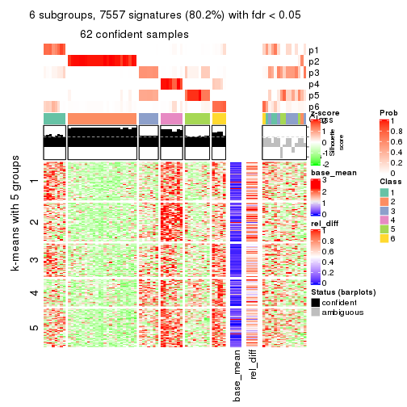</p>

</div>
</div>


Signature heatmaps where rows are not scaled:


<script>
$( function() {
	$( '#tabs-ATC-kmeans-get-signatures-no-scale' ).tabs();
} );
</script>
<div id='tabs-ATC-kmeans-get-signatures-no-scale'>
<ul>
<li><a href='#tab-ATC-kmeans-get-signatures-no-scale-1'>k = 2</a></li>
<li><a href='#tab-ATC-kmeans-get-signatures-no-scale-2'>k = 3</a></li>
<li><a href='#tab-ATC-kmeans-get-signatures-no-scale-3'>k = 4</a></li>
<li><a href='#tab-ATC-kmeans-get-signatures-no-scale-4'>k = 5</a></li>
<li><a href='#tab-ATC-kmeans-get-signatures-no-scale-5'>k = 6</a></li>
</ul>
<div id='tab-ATC-kmeans-get-signatures-no-scale-1'>
<pre><code class="r">get_signatures(res, k = 2, scale_rows = FALSE)
</code></pre>

<p></p>

</div>
<div id='tab-ATC-kmeans-get-signatures-no-scale-2'>
<pre><code class="r">get_signatures(res, k = 3, scale_rows = FALSE)
</code></pre>

<p></p>

</div>
<div id='tab-ATC-kmeans-get-signatures-no-scale-3'>
<pre><code class="r">get_signatures(res, k = 4, scale_rows = FALSE)
</code></pre>

<p></p>

</div>
<div id='tab-ATC-kmeans-get-signatures-no-scale-4'>
<pre><code class="r">get_signatures(res, k = 5, scale_rows = FALSE)
</code></pre>

<p></p>

</div>
<div id='tab-ATC-kmeans-get-signatures-no-scale-5'>
<pre><code class="r">get_signatures(res, k = 6, scale_rows = FALSE)
</code></pre>

<pre><code>#&gt; Error in mat[ceiling(1:nr/h_ratio), ceiling(1:nc/w_ratio), drop = FALSE]: subscript out of bounds
</code></pre>

<p></p>

</div>
</div>


Compare the overlap of signatures from different k:

```r
compare_signatures(res)
```


`get_signature()` returns a data frame invisibly. TO get the list of signatures, the function
call should be assigned to a variable explicitly. In following code, if `plot` argument is set
to `FALSE`, no heatmap is plotted while only the differential analysis is performed.

```r
# code only for demonstration
tb = get_signature(res, k = ..., plot = FALSE)
```

An example of the output of `tb` is:

```
#>   which_row         fdr    mean_1    mean_2 scaled_mean_1 scaled_mean_2 km
#> 1        38 0.042760348  8.373488  9.131774    -0.5533452     0.5164555  1
#> 2        40 0.018707592  7.106213  8.469186    -0.6173731     0.5762149  1
#> 3        55 0.019134737 10.221463 11.207825    -0.6159697     0.5749050  1
#> 4        59 0.006059896  5.921854  7.869574    -0.6899429     0.6439467  1
#> 5        60 0.018055526  8.928898 10.211722    -0.6204761     0.5791110  1
#> 6        98 0.009384629 15.714769 14.887706     0.6635654    -0.6193277  2
...
```

The columns in `tb` are:

1. `which_row`: row indices corresponding to the input matrix.
2. `fdr`: FDR for the differential test. 
3. `mean_x`: The mean value in group x.
4. `scaled_mean_x`: The mean value in group x after rows are scaled.
5. `km`: Row groups if k-means clustering is applied to rows.


UMAP plot which shows how samples are separated.


<script>
$( function() {
	$( '#tabs-ATC-kmeans-dimension-reduction' ).tabs();
} );
</script>
<div id='tabs-ATC-kmeans-dimension-reduction'>
<ul>
<li><a href='#tab-ATC-kmeans-dimension-reduction-1'>k = 2</a></li>
<li><a href='#tab-ATC-kmeans-dimension-reduction-2'>k = 3</a></li>
<li><a href='#tab-ATC-kmeans-dimension-reduction-3'>k = 4</a></li>
<li><a href='#tab-ATC-kmeans-dimension-reduction-4'>k = 5</a></li>
<li><a href='#tab-ATC-kmeans-dimension-reduction-5'>k = 6</a></li>
</ul>
<div id='tab-ATC-kmeans-dimension-reduction-1'>
<pre><code class="r">dimension_reduction(res, k = 2, method = &quot;UMAP&quot;)
</code></pre>

<p></p>

</div>
<div id='tab-ATC-kmeans-dimension-reduction-2'>
<pre><code class="r">dimension_reduction(res, k = 3, method = &quot;UMAP&quot;)
</code></pre>

<p></p>

</div>
<div id='tab-ATC-kmeans-dimension-reduction-3'>
<pre><code class="r">dimension_reduction(res, k = 4, method = &quot;UMAP&quot;)
</code></pre>

<p></p>

</div>
<div id='tab-ATC-kmeans-dimension-reduction-4'>
<pre><code class="r">dimension_reduction(res, k = 5, method = &quot;UMAP&quot;)
</code></pre>

<p></p>

</div>
<div id='tab-ATC-kmeans-dimension-reduction-5'>
<pre><code class="r">dimension_reduction(res, k = 6, method = &quot;UMAP&quot;)
</code></pre>

<p></p>

</div>
</div>


Following heatmap shows how subgroups are split when increasing `k`:

```r
collect_classes(res)
```


If matrix rows can be associated to genes, consider to use `GO_Enrichment(res,
...)` to perform function enrichment for the signature genes.


 

---------------------------------------------------


### ATC:skmeans*


The object with results only for a single top-value method and a single partition method 
can be extracted as:

```r
res = res_list["ATC", "skmeans"]
# you can also extract it by
# res = res_list["ATC:skmeans"]
```

A summary of `res` and all the functions that can be applied to it:

```r
res
```

```
#> A 'ConsensusPartition' object with k = 2, 3, 4, 5, 6.
#>   On a matrix with 9427 rows and 77 columns.
#>   Top rows (943, 1886, 2828, 3771, 4714) are extracted by 'ATC' method.
#>   Subgroups are detected by 'skmeans' method.
#>   Performed in total 1250 partitions by row resampling.
#>   Best k for subgroups seems to be 3.
#> 
#> Following methods can be applied to this 'ConsensusPartition' object:
#>  [1] "cola_report"             "collect_classes"         "collect_plots"          
#>  [4] "collect_stats"           "colnames"                "compare_signatures"     
#>  [7] "consensus_heatmap"       "dimension_reduction"     "functional_enrichment"  
#> [10] "get_anno_col"            "get_anno"                "get_classes"            
#> [13] "get_consensus"           "get_matrix"              "get_membership"         
#> [16] "get_param"               "get_signatures"          "get_stats"              
#> [19] "is_best_k"               "is_stable_k"             "membership_heatmap"     
#> [22] "ncol"                    "nrow"                    "plot_ecdf"              
#> [25] "rownames"                "select_partition_number" "show"                   
#> [28] "suggest_best_k"          "test_to_known_factors"
```

`collect_plots()` function collects all the plots made from `res` for all `k` (number of partitions)
into one single page to provide an easy and fast comparison between different `k`.

```r
collect_plots(res)
```


The plots are:

- The first row: a plot of the ECDF (Empirical cumulative distribution
  function) curves of the consensus matrix for each `k` and the heatmap of
  predicted classes for each `k`.
- The second row: heatmaps of the consensus matrix for each `k`.
- The third row: heatmaps of the membership matrix for each `k`.
- The fouth row: heatmaps of the signatures for each `k`.

All the plots in panels can be made by individual functions and they are
plotted later in this section.

`select_partition_number()` produces several plots showing different
statistics for choosing "optimized" `k`. There are following statistics:

- ECDF curves of the consensus matrix for each `k`;
- 1-PAC. [The PAC
  score](https://en.wikipedia.org/wiki/Consensus_clustering#Over-interpretation_potential_of_consensus_clustering)
  measures the proportion of the ambiguous subgrouping.
- Mean silhouette score.
- Concordance. The mean probability of fiting the consensus class ids in all
  partitions.
- Area increased. Denote $A_k$ as the area under the ECDF curve for current
  `k`, the area increased is defined as $A_k - A_{k-1}$.
- Rand index. The percent of pairs of samples that are both in a same cluster
  or both are not in a same cluster in the partition of k and k-1.
- Jaccard index. The ratio of pairs of samples are both in a same cluster in
  the partition of k and k-1 and the pairs of samples are both in a same
  cluster in the partition k or k-1.

The detailed explanations of these statistics can be found in [the cola
vignette](http://bioconductor.org/packages/devel/bioc/vignettes/cola/inst/doc/cola.html#toc_13).

Generally speaking, lower PAC score, higher mean silhouette score or higher
concordance corresponds to better partition. Rand index and Jaccard index
measure how similar the current partition is compared to partition with `k-1`.
If they are too similar, we won't accept `k` is better than `k-1`.

```r
select_partition_number(res)
```


The numeric values for all these statistics can be obtained by `get_stats()`.

```r
get_stats(res)
```

```
#>   k 1-PAC mean_silhouette concordance area_increased  Rand Jaccard
#> 2 2 1.000           0.969       0.986         0.5065 0.494   0.494
#> 3 3 0.903           0.876       0.949         0.2064 0.889   0.777
#> 4 4 0.853           0.842       0.926         0.0736 0.955   0.887
#> 5 5 0.797           0.740       0.889         0.0479 0.990   0.974
#> 6 6 0.796           0.679       0.850         0.0335 0.976   0.933
```

`suggest_best_k()` suggests the best $k$ based on these statistics. The rules are as follows:

- All $k$ with Jaccard index larger than 0.95 are removed because the increase of
  the partition number does not provides enough extra information. If all $k$ are removed,
  the best $k$ is assigned by `NA`.
- For $k$ with 1-PAC larger than 0.9, the maximal $k$ is taken as the "best k". Other $k$ is called "optional k".
- If it does not fit the second rule. The $k$ with the highest vote of highest
  1-PAC, mean silhouette and concordance is taken as the "best k".

```r
suggest_best_k(res)
```

```
#> [1] 3
#> attr(,"optional")
#> [1] 2
```

There is also optional best $k$ = 2 that is worth to check.

Following shows the table of the partitions (You need to click the **show/hide
code output** link to see it). The membership matrix (columns with name `p*`)
is inferred by
[`clue::cl_consensus()`](https://www.rdocumentation.org/link/cl_consensus?package=clue)
function with the `SE` method. Basically the value in the membership matrix
represents the probability to belong to a certain group. The finall class
label for an item is determined with the group with highest probability it
belongs to.

In `get_classes()` function, the entropy is calculated from the membership
matrix and the silhouette score is calculated from the consensus matrix.


<script>
$( function() {
	$( '#tabs-ATC-skmeans-get-classes' ).tabs();
} );
</script>
<div id='tabs-ATC-skmeans-get-classes'>
<ul>
<li><a href='#tab-ATC-skmeans-get-classes-1'>k = 2</a></li>
<li><a href='#tab-ATC-skmeans-get-classes-2'>k = 3</a></li>
<li><a href='#tab-ATC-skmeans-get-classes-3'>k = 4</a></li>
<li><a href='#tab-ATC-skmeans-get-classes-4'>k = 5</a></li>
<li><a href='#tab-ATC-skmeans-get-classes-5'>k = 6</a></li>
</ul>

<div id='tab-ATC-skmeans-get-classes-1'>
<p><a id='tab-ATC-skmeans-get-classes-1-a' style='color:#0366d6' href='#'>show/hide code output</a></p>
<pre><code class="r">cbind(get_classes(res, k = 2), get_membership(res, k = 2))
</code></pre>

<pre><code>#&gt;           class entropy silhouette    p1    p2
#&gt; SRR944011     2  0.0000      1.000 0.000 1.000
#&gt; SRR944012     1  0.0000      0.973 1.000 0.000
#&gt; SRR944014     2  0.0000      1.000 0.000 1.000
#&gt; SRR944013     2  0.0000      1.000 0.000 1.000
#&gt; SRR944015     1  0.0000      0.973 1.000 0.000
#&gt; SRR944016     1  0.7453      0.742 0.788 0.212
#&gt; SRR944017     2  0.0000      1.000 0.000 1.000
#&gt; SRR944018     1  0.0000      0.973 1.000 0.000
#&gt; SRR944019     1  0.0000      0.973 1.000 0.000
#&gt; SRR944020     1  0.0000      0.973 1.000 0.000
#&gt; SRR944021     2  0.0000      1.000 0.000 1.000
#&gt; SRR944022     1  0.0000      0.973 1.000 0.000
#&gt; SRR944023     1  0.0000      0.973 1.000 0.000
#&gt; SRR944024     1  0.0000      0.973 1.000 0.000
#&gt; SRR944026     2  0.0000      1.000 0.000 1.000
#&gt; SRR944025     2  0.0000      1.000 0.000 1.000
#&gt; SRR944028     2  0.0000      1.000 0.000 1.000
#&gt; SRR944029     1  0.2236      0.943 0.964 0.036
#&gt; SRR944030     2  0.0000      1.000 0.000 1.000
#&gt; SRR944031     1  0.0000      0.973 1.000 0.000
#&gt; SRR944032     2  0.0000      1.000 0.000 1.000
#&gt; SRR944033     2  0.0000      1.000 0.000 1.000
#&gt; SRR944034     2  0.0000      1.000 0.000 1.000
#&gt; SRR944036     1  0.0000      0.973 1.000 0.000
#&gt; SRR944035     2  0.0000      1.000 0.000 1.000
#&gt; SRR944038     1  0.0000      0.973 1.000 0.000
#&gt; SRR944037     1  0.0000      0.973 1.000 0.000
#&gt; SRR944039     1  0.0000      0.973 1.000 0.000
#&gt; SRR944040     2  0.0000      1.000 0.000 1.000
#&gt; SRR944041     1  0.0000      0.973 1.000 0.000
#&gt; SRR944042     1  0.0000      0.973 1.000 0.000
#&gt; SRR944043     1  0.0000      0.973 1.000 0.000
#&gt; SRR944044     2  0.0000      1.000 0.000 1.000
#&gt; SRR944046     1  0.0000      0.973 1.000 0.000
#&gt; SRR944045     2  0.0000      1.000 0.000 1.000
#&gt; SRR944047     2  0.0000      1.000 0.000 1.000
#&gt; SRR944048     1  0.8443      0.644 0.728 0.272
#&gt; SRR944049     2  0.0000      1.000 0.000 1.000
#&gt; SRR944050     1  0.9661      0.391 0.608 0.392
#&gt; SRR944051     2  0.0000      1.000 0.000 1.000
#&gt; SRR944052     2  0.0000      1.000 0.000 1.000
#&gt; SRR944053     1  0.0000      0.973 1.000 0.000
#&gt; SRR944054     2  0.0000      1.000 0.000 1.000
#&gt; SRR944055     2  0.0000      1.000 0.000 1.000
#&gt; SRR944056     2  0.0000      1.000 0.000 1.000
#&gt; SRR944057     1  0.0000      0.973 1.000 0.000
#&gt; SRR944058     1  0.0000      0.973 1.000 0.000
#&gt; SRR944059     2  0.0000      1.000 0.000 1.000
#&gt; SRR944060     1  0.0000      0.973 1.000 0.000
#&gt; SRR944061     2  0.0000      1.000 0.000 1.000
#&gt; SRR944062     1  0.0000      0.973 1.000 0.000
#&gt; SRR944063     1  0.0000      0.973 1.000 0.000
#&gt; SRR944064     2  0.0000      1.000 0.000 1.000
#&gt; SRR944065     1  0.0000      0.973 1.000 0.000
#&gt; SRR944066     1  0.0000      0.973 1.000 0.000
#&gt; SRR944067     2  0.0000      1.000 0.000 1.000
#&gt; SRR944068     1  0.0000      0.973 1.000 0.000
#&gt; SRR944069     2  0.0000      1.000 0.000 1.000
#&gt; SRR944070     1  0.0000      0.973 1.000 0.000
#&gt; SRR944071     1  0.5519      0.851 0.872 0.128
#&gt; SRR944072     1  0.0000      0.973 1.000 0.000
#&gt; SRR944073     2  0.0000      1.000 0.000 1.000
#&gt; SRR944075     2  0.0000      1.000 0.000 1.000
#&gt; SRR944074     2  0.0000      1.000 0.000 1.000
#&gt; SRR944076     1  0.0376      0.970 0.996 0.004
#&gt; SRR944077     2  0.0000      1.000 0.000 1.000
#&gt; SRR944078     2  0.0000      1.000 0.000 1.000
#&gt; SRR944079     2  0.0000      1.000 0.000 1.000
#&gt; SRR944080     2  0.0000      1.000 0.000 1.000
#&gt; SRR944081     1  0.0000      0.973 1.000 0.000
#&gt; SRR944082     1  0.0000      0.973 1.000 0.000
#&gt; SRR944083     1  0.0000      0.973 1.000 0.000
#&gt; SRR944084     1  0.0000      0.973 1.000 0.000
#&gt; SRR944085     2  0.0000      1.000 0.000 1.000
#&gt; SRR944086     1  0.0000      0.973 1.000 0.000
#&gt; SRR944088     2  0.0000      1.000 0.000 1.000
#&gt; SRR944087     1  0.0000      0.973 1.000 0.000
</code></pre>

<script>
$('#tab-ATC-skmeans-get-classes-1-a').parent().next().next().hide();
$('#tab-ATC-skmeans-get-classes-1-a').click(function(){
  $('#tab-ATC-skmeans-get-classes-1-a').parent().next().next().toggle();
  return(false);
});
</script>
</div>

<div id='tab-ATC-skmeans-get-classes-2'>
<p><a id='tab-ATC-skmeans-get-classes-2-a' style='color:#0366d6' href='#'>show/hide code output</a></p>
<pre><code class="r">cbind(get_classes(res, k = 3), get_membership(res, k = 3))
</code></pre>

<pre><code>#&gt;           class entropy silhouette    p1    p2    p3
#&gt; SRR944011     3  0.4654     0.6419 0.000 0.208 0.792
#&gt; SRR944012     1  0.0000     0.9298 1.000 0.000 0.000
#&gt; SRR944014     2  0.0000     0.9894 0.000 1.000 0.000
#&gt; SRR944013     2  0.0000     0.9894 0.000 1.000 0.000
#&gt; SRR944015     1  0.0000     0.9298 1.000 0.000 0.000
#&gt; SRR944016     1  0.7710     0.2488 0.576 0.056 0.368
#&gt; SRR944017     2  0.0000     0.9894 0.000 1.000 0.000
#&gt; SRR944018     1  0.0000     0.9298 1.000 0.000 0.000
#&gt; SRR944019     1  0.0592     0.9224 0.988 0.000 0.012
#&gt; SRR944020     1  0.0000     0.9298 1.000 0.000 0.000
#&gt; SRR944021     2  0.0000     0.9894 0.000 1.000 0.000
#&gt; SRR944022     1  0.0000     0.9298 1.000 0.000 0.000
#&gt; SRR944023     1  0.1163     0.9073 0.972 0.000 0.028
#&gt; SRR944024     1  0.0000     0.9298 1.000 0.000 0.000
#&gt; SRR944026     2  0.0000     0.9894 0.000 1.000 0.000
#&gt; SRR944025     2  0.0000     0.9894 0.000 1.000 0.000
#&gt; SRR944028     2  0.0000     0.9894 0.000 1.000 0.000
#&gt; SRR944029     1  0.7114     0.0832 0.584 0.028 0.388
#&gt; SRR944030     2  0.0000     0.9894 0.000 1.000 0.000
#&gt; SRR944031     3  0.1860     0.7949 0.052 0.000 0.948
#&gt; SRR944032     2  0.0424     0.9821 0.000 0.992 0.008
#&gt; SRR944033     2  0.0000     0.9894 0.000 1.000 0.000
#&gt; SRR944034     2  0.0000     0.9894 0.000 1.000 0.000
#&gt; SRR944036     3  0.0000     0.7774 0.000 0.000 1.000
#&gt; SRR944035     2  0.0000     0.9894 0.000 1.000 0.000
#&gt; SRR944038     1  0.0000     0.9298 1.000 0.000 0.000
#&gt; SRR944037     1  0.0000     0.9298 1.000 0.000 0.000
#&gt; SRR944039     1  0.0592     0.9224 0.988 0.000 0.012
#&gt; SRR944040     2  0.0000     0.9894 0.000 1.000 0.000
#&gt; SRR944041     1  0.0000     0.9298 1.000 0.000 0.000
#&gt; SRR944042     3  0.5706     0.5859 0.320 0.000 0.680
#&gt; SRR944043     1  0.0000     0.9298 1.000 0.000 0.000
#&gt; SRR944044     2  0.0000     0.9894 0.000 1.000 0.000
#&gt; SRR944046     3  0.3619     0.7718 0.136 0.000 0.864
#&gt; SRR944045     2  0.0000     0.9894 0.000 1.000 0.000
#&gt; SRR944047     2  0.0000     0.9894 0.000 1.000 0.000
#&gt; SRR944048     3  0.7382     0.0657 0.456 0.032 0.512
#&gt; SRR944049     2  0.0000     0.9894 0.000 1.000 0.000
#&gt; SRR944050     1  0.8304     0.0315 0.504 0.080 0.416
#&gt; SRR944051     2  0.0000     0.9894 0.000 1.000 0.000
#&gt; SRR944052     2  0.0000     0.9894 0.000 1.000 0.000
#&gt; SRR944053     1  0.0000     0.9298 1.000 0.000 0.000
#&gt; SRR944054     2  0.0000     0.9894 0.000 1.000 0.000
#&gt; SRR944055     2  0.0000     0.9894 0.000 1.000 0.000
#&gt; SRR944056     2  0.0000     0.9894 0.000 1.000 0.000
#&gt; SRR944057     1  0.4887     0.6552 0.772 0.000 0.228
#&gt; SRR944058     1  0.0000     0.9298 1.000 0.000 0.000
#&gt; SRR944059     2  0.0000     0.9894 0.000 1.000 0.000
#&gt; SRR944060     1  0.0000     0.9298 1.000 0.000 0.000
#&gt; SRR944061     2  0.0000     0.9894 0.000 1.000 0.000
#&gt; SRR944062     1  0.0000     0.9298 1.000 0.000 0.000
#&gt; SRR944063     1  0.0000     0.9298 1.000 0.000 0.000
#&gt; SRR944064     2  0.0000     0.9894 0.000 1.000 0.000
#&gt; SRR944065     1  0.0000     0.9298 1.000 0.000 0.000
#&gt; SRR944066     1  0.0237     0.9275 0.996 0.000 0.004
#&gt; SRR944067     2  0.0000     0.9894 0.000 1.000 0.000
#&gt; SRR944068     1  0.0000     0.9298 1.000 0.000 0.000
#&gt; SRR944069     2  0.0000     0.9894 0.000 1.000 0.000
#&gt; SRR944070     1  0.0000     0.9298 1.000 0.000 0.000
#&gt; SRR944071     3  0.1832     0.7936 0.036 0.008 0.956
#&gt; SRR944072     1  0.0000     0.9298 1.000 0.000 0.000
#&gt; SRR944073     2  0.0000     0.9894 0.000 1.000 0.000
#&gt; SRR944075     2  0.5650     0.5346 0.000 0.688 0.312
#&gt; SRR944074     2  0.0000     0.9894 0.000 1.000 0.000
#&gt; SRR944076     3  0.0892     0.7877 0.020 0.000 0.980
#&gt; SRR944077     2  0.0000     0.9894 0.000 1.000 0.000
#&gt; SRR944078     2  0.0000     0.9894 0.000 1.000 0.000
#&gt; SRR944079     2  0.0000     0.9894 0.000 1.000 0.000
#&gt; SRR944080     2  0.0000     0.9894 0.000 1.000 0.000
#&gt; SRR944081     1  0.0424     0.9248 0.992 0.000 0.008
#&gt; SRR944082     1  0.0000     0.9298 1.000 0.000 0.000
#&gt; SRR944083     1  0.1163     0.9097 0.972 0.000 0.028
#&gt; SRR944084     3  0.6260     0.3366 0.448 0.000 0.552
#&gt; SRR944085     2  0.1411     0.9542 0.000 0.964 0.036
#&gt; SRR944086     1  0.2878     0.8256 0.904 0.000 0.096
#&gt; SRR944088     2  0.0000     0.9894 0.000 1.000 0.000
#&gt; SRR944087     3  0.3038     0.7866 0.104 0.000 0.896
</code></pre>

<script>
$('#tab-ATC-skmeans-get-classes-2-a').parent().next().next().hide();
$('#tab-ATC-skmeans-get-classes-2-a').click(function(){
  $('#tab-ATC-skmeans-get-classes-2-a').parent().next().next().toggle();
  return(false);
});
</script>
</div>

<div id='tab-ATC-skmeans-get-classes-3'>
<p><a id='tab-ATC-skmeans-get-classes-3-a' style='color:#0366d6' href='#'>show/hide code output</a></p>
<pre><code class="r">cbind(get_classes(res, k = 4), get_membership(res, k = 4))
</code></pre>

<pre><code>#&gt;           class entropy silhouette    p1    p2    p3    p4
#&gt; SRR944011     3  0.3301     0.7458 0.048 0.076 0.876 0.000
#&gt; SRR944012     4  0.0000     0.8921 0.000 0.000 0.000 1.000
#&gt; SRR944014     2  0.0000     0.9643 0.000 1.000 0.000 0.000
#&gt; SRR944013     2  0.0000     0.9643 0.000 1.000 0.000 0.000
#&gt; SRR944015     4  0.0000     0.8921 0.000 0.000 0.000 1.000
#&gt; SRR944016     1  0.2859     0.8061 0.880 0.000 0.008 0.112
#&gt; SRR944017     2  0.0000     0.9643 0.000 1.000 0.000 0.000
#&gt; SRR944018     4  0.0592     0.8871 0.016 0.000 0.000 0.984
#&gt; SRR944019     4  0.3625     0.7569 0.160 0.000 0.012 0.828
#&gt; SRR944020     4  0.0000     0.8921 0.000 0.000 0.000 1.000
#&gt; SRR944021     2  0.0000     0.9643 0.000 1.000 0.000 0.000
#&gt; SRR944022     4  0.0000     0.8921 0.000 0.000 0.000 1.000
#&gt; SRR944023     4  0.2483     0.8397 0.032 0.000 0.052 0.916
#&gt; SRR944024     4  0.1474     0.8691 0.052 0.000 0.000 0.948
#&gt; SRR944026     2  0.0000     0.9643 0.000 1.000 0.000 0.000
#&gt; SRR944025     2  0.0000     0.9643 0.000 1.000 0.000 0.000
#&gt; SRR944028     2  0.0000     0.9643 0.000 1.000 0.000 0.000
#&gt; SRR944029     4  0.7919    -0.0973 0.156 0.020 0.392 0.432
#&gt; SRR944030     2  0.0000     0.9643 0.000 1.000 0.000 0.000
#&gt; SRR944031     3  0.3959     0.7950 0.092 0.000 0.840 0.068
#&gt; SRR944032     2  0.4814     0.5677 0.316 0.676 0.008 0.000
#&gt; SRR944033     2  0.0000     0.9643 0.000 1.000 0.000 0.000
#&gt; SRR944034     2  0.0000     0.9643 0.000 1.000 0.000 0.000
#&gt; SRR944036     3  0.4857     0.5660 0.324 0.000 0.668 0.008
#&gt; SRR944035     2  0.0000     0.9643 0.000 1.000 0.000 0.000
#&gt; SRR944038     4  0.0188     0.8912 0.004 0.000 0.000 0.996
#&gt; SRR944037     4  0.0000     0.8921 0.000 0.000 0.000 1.000
#&gt; SRR944039     4  0.2469     0.8262 0.108 0.000 0.000 0.892
#&gt; SRR944040     2  0.0000     0.9643 0.000 1.000 0.000 0.000
#&gt; SRR944041     4  0.0000     0.8921 0.000 0.000 0.000 1.000
#&gt; SRR944042     3  0.4252     0.5418 0.004 0.000 0.744 0.252
#&gt; SRR944043     4  0.0000     0.8921 0.000 0.000 0.000 1.000
#&gt; SRR944044     2  0.0000     0.9643 0.000 1.000 0.000 0.000
#&gt; SRR944046     3  0.2363     0.8231 0.024 0.000 0.920 0.056
#&gt; SRR944045     2  0.0000     0.9643 0.000 1.000 0.000 0.000
#&gt; SRR944047     2  0.0000     0.9643 0.000 1.000 0.000 0.000
#&gt; SRR944048     1  0.3605     0.7910 0.864 0.004 0.044 0.088
#&gt; SRR944049     2  0.0000     0.9643 0.000 1.000 0.000 0.000
#&gt; SRR944050     1  0.2813     0.7873 0.896 0.000 0.024 0.080
#&gt; SRR944051     2  0.2813     0.8871 0.080 0.896 0.024 0.000
#&gt; SRR944052     2  0.0000     0.9643 0.000 1.000 0.000 0.000
#&gt; SRR944053     4  0.0000     0.8921 0.000 0.000 0.000 1.000
#&gt; SRR944054     2  0.1938     0.9207 0.052 0.936 0.012 0.000
#&gt; SRR944055     2  0.1059     0.9477 0.012 0.972 0.016 0.000
#&gt; SRR944056     2  0.0000     0.9643 0.000 1.000 0.000 0.000
#&gt; SRR944057     1  0.5110     0.5474 0.636 0.000 0.012 0.352
#&gt; SRR944058     4  0.0921     0.8815 0.028 0.000 0.000 0.972
#&gt; SRR944059     2  0.1109     0.9445 0.004 0.968 0.028 0.000
#&gt; SRR944060     4  0.0524     0.8891 0.008 0.000 0.004 0.988
#&gt; SRR944061     2  0.0000     0.9643 0.000 1.000 0.000 0.000
#&gt; SRR944062     4  0.0336     0.8905 0.008 0.000 0.000 0.992
#&gt; SRR944063     4  0.0000     0.8921 0.000 0.000 0.000 1.000
#&gt; SRR944064     2  0.0000     0.9643 0.000 1.000 0.000 0.000
#&gt; SRR944065     4  0.0000     0.8921 0.000 0.000 0.000 1.000
#&gt; SRR944066     4  0.2345     0.8290 0.100 0.000 0.000 0.900
#&gt; SRR944067     2  0.0000     0.9643 0.000 1.000 0.000 0.000
#&gt; SRR944068     4  0.0000     0.8921 0.000 0.000 0.000 1.000
#&gt; SRR944069     2  0.0000     0.9643 0.000 1.000 0.000 0.000
#&gt; SRR944070     4  0.0188     0.8912 0.004 0.000 0.000 0.996
#&gt; SRR944071     3  0.2101     0.8147 0.060 0.000 0.928 0.012
#&gt; SRR944072     4  0.1118     0.8777 0.036 0.000 0.000 0.964
#&gt; SRR944073     2  0.0000     0.9643 0.000 1.000 0.000 0.000
#&gt; SRR944075     2  0.5174     0.4164 0.012 0.620 0.368 0.000
#&gt; SRR944074     2  0.0188     0.9621 0.004 0.996 0.000 0.000
#&gt; SRR944076     3  0.1722     0.8158 0.048 0.000 0.944 0.008
#&gt; SRR944077     2  0.0000     0.9643 0.000 1.000 0.000 0.000
#&gt; SRR944078     2  0.0927     0.9504 0.016 0.976 0.008 0.000
#&gt; SRR944079     2  0.0000     0.9643 0.000 1.000 0.000 0.000
#&gt; SRR944080     2  0.0000     0.9643 0.000 1.000 0.000 0.000
#&gt; SRR944081     4  0.4922     0.6269 0.228 0.000 0.036 0.736
#&gt; SRR944082     4  0.0188     0.8912 0.004 0.000 0.000 0.996
#&gt; SRR944083     4  0.4304     0.5433 0.284 0.000 0.000 0.716
#&gt; SRR944084     4  0.6120     0.0833 0.048 0.000 0.432 0.520
#&gt; SRR944085     2  0.4307     0.7823 0.048 0.808 0.144 0.000
#&gt; SRR944086     4  0.6084     0.4744 0.244 0.000 0.096 0.660
#&gt; SRR944088     2  0.3149     0.8729 0.088 0.880 0.032 0.000
#&gt; SRR944087     3  0.2174     0.8249 0.020 0.000 0.928 0.052
</code></pre>

<script>
$('#tab-ATC-skmeans-get-classes-3-a').parent().next().next().hide();
$('#tab-ATC-skmeans-get-classes-3-a').click(function(){
  $('#tab-ATC-skmeans-get-classes-3-a').parent().next().next().toggle();
  return(false);
});
</script>
</div>

<div id='tab-ATC-skmeans-get-classes-4'>
<p><a id='tab-ATC-skmeans-get-classes-4-a' style='color:#0366d6' href='#'>show/hide code output</a></p>
<pre><code class="r">cbind(get_classes(res, k = 5), get_membership(res, k = 5))
</code></pre>

<pre><code>#&gt;           class entropy silhouette    p1    p2    p3    p4    p5
#&gt; SRR944011     3  0.5625      0.451 0.028 0.112 0.688 0.000 0.172
#&gt; SRR944012     4  0.0404      0.882 0.000 0.000 0.000 0.988 0.012
#&gt; SRR944014     2  0.0000      0.917 0.000 1.000 0.000 0.000 0.000
#&gt; SRR944013     2  0.1282      0.891 0.004 0.952 0.000 0.000 0.044
#&gt; SRR944015     4  0.0000      0.883 0.000 0.000 0.000 1.000 0.000
#&gt; SRR944016     1  0.1087      0.686 0.968 0.000 0.008 0.008 0.016
#&gt; SRR944017     2  0.0000      0.917 0.000 1.000 0.000 0.000 0.000
#&gt; SRR944018     4  0.0833      0.880 0.004 0.000 0.004 0.976 0.016
#&gt; SRR944019     4  0.4320      0.685 0.096 0.000 0.004 0.780 0.120
#&gt; SRR944020     4  0.0000      0.883 0.000 0.000 0.000 1.000 0.000
#&gt; SRR944021     2  0.0000      0.917 0.000 1.000 0.000 0.000 0.000
#&gt; SRR944022     4  0.0000      0.883 0.000 0.000 0.000 1.000 0.000
#&gt; SRR944023     4  0.4065      0.751 0.056 0.000 0.076 0.824 0.044
#&gt; SRR944024     4  0.2284      0.840 0.056 0.000 0.004 0.912 0.028
#&gt; SRR944026     2  0.0794      0.902 0.000 0.972 0.000 0.000 0.028
#&gt; SRR944025     2  0.0000      0.917 0.000 1.000 0.000 0.000 0.000
#&gt; SRR944028     2  0.0000      0.917 0.000 1.000 0.000 0.000 0.000
#&gt; SRR944029     5  0.6313      0.000 0.048 0.000 0.148 0.168 0.636
#&gt; SRR944030     2  0.0000      0.917 0.000 1.000 0.000 0.000 0.000
#&gt; SRR944031     3  0.4918      0.609 0.084 0.000 0.764 0.044 0.108
#&gt; SRR944032     2  0.6562      0.202 0.264 0.504 0.004 0.000 0.228
#&gt; SRR944033     2  0.0000      0.917 0.000 1.000 0.000 0.000 0.000
#&gt; SRR944034     2  0.0000      0.917 0.000 1.000 0.000 0.000 0.000
#&gt; SRR944036     3  0.5887      0.446 0.252 0.000 0.592 0.000 0.156
#&gt; SRR944035     2  0.0000      0.917 0.000 1.000 0.000 0.000 0.000
#&gt; SRR944038     4  0.0451      0.882 0.000 0.000 0.004 0.988 0.008
#&gt; SRR944037     4  0.0000      0.883 0.000 0.000 0.000 1.000 0.000
#&gt; SRR944039     4  0.2888      0.809 0.060 0.000 0.004 0.880 0.056
#&gt; SRR944040     2  0.0162      0.915 0.000 0.996 0.000 0.000 0.004
#&gt; SRR944041     4  0.0290      0.883 0.000 0.000 0.000 0.992 0.008
#&gt; SRR944042     3  0.5162      0.241 0.004 0.000 0.672 0.248 0.076
#&gt; SRR944043     4  0.0290      0.883 0.000 0.000 0.000 0.992 0.008
#&gt; SRR944044     2  0.0162      0.915 0.000 0.996 0.000 0.000 0.004
#&gt; SRR944046     3  0.2995      0.644 0.008 0.000 0.872 0.032 0.088
#&gt; SRR944045     2  0.0000      0.917 0.000 1.000 0.000 0.000 0.000
#&gt; SRR944047     2  0.0000      0.917 0.000 1.000 0.000 0.000 0.000
#&gt; SRR944048     1  0.2492      0.663 0.900 0.000 0.020 0.008 0.072
#&gt; SRR944049     2  0.0000      0.917 0.000 1.000 0.000 0.000 0.000
#&gt; SRR944050     1  0.0740      0.686 0.980 0.000 0.008 0.004 0.008
#&gt; SRR944051     2  0.5059      0.314 0.036 0.548 0.000 0.000 0.416
#&gt; SRR944052     2  0.0000      0.917 0.000 1.000 0.000 0.000 0.000
#&gt; SRR944053     4  0.0000      0.883 0.000 0.000 0.000 1.000 0.000
#&gt; SRR944054     2  0.3961      0.666 0.016 0.736 0.000 0.000 0.248
#&gt; SRR944055     2  0.3216      0.814 0.004 0.856 0.044 0.000 0.096
#&gt; SRR944056     2  0.0000      0.917 0.000 1.000 0.000 0.000 0.000
#&gt; SRR944057     1  0.4837      0.152 0.628 0.000 0.012 0.344 0.016
#&gt; SRR944058     4  0.0579      0.882 0.008 0.000 0.000 0.984 0.008
#&gt; SRR944059     2  0.2813      0.835 0.004 0.880 0.032 0.000 0.084
#&gt; SRR944060     4  0.0693      0.881 0.000 0.000 0.008 0.980 0.012
#&gt; SRR944061     2  0.0000      0.917 0.000 1.000 0.000 0.000 0.000
#&gt; SRR944062     4  0.0671      0.880 0.000 0.000 0.004 0.980 0.016
#&gt; SRR944063     4  0.0000      0.883 0.000 0.000 0.000 1.000 0.000
#&gt; SRR944064     2  0.0000      0.917 0.000 1.000 0.000 0.000 0.000
#&gt; SRR944065     4  0.0000      0.883 0.000 0.000 0.000 1.000 0.000
#&gt; SRR944066     4  0.2608      0.820 0.088 0.000 0.004 0.888 0.020
#&gt; SRR944067     2  0.0000      0.917 0.000 1.000 0.000 0.000 0.000
#&gt; SRR944068     4  0.0000      0.883 0.000 0.000 0.000 1.000 0.000
#&gt; SRR944069     2  0.0000      0.917 0.000 1.000 0.000 0.000 0.000
#&gt; SRR944070     4  0.0566      0.881 0.000 0.000 0.004 0.984 0.012
#&gt; SRR944071     3  0.4323      0.590 0.044 0.004 0.752 0.000 0.200
#&gt; SRR944072     4  0.1211      0.873 0.024 0.000 0.000 0.960 0.016
#&gt; SRR944073     2  0.0000      0.917 0.000 1.000 0.000 0.000 0.000
#&gt; SRR944075     2  0.6207      0.362 0.004 0.568 0.244 0.000 0.184
#&gt; SRR944074     2  0.0703      0.905 0.000 0.976 0.000 0.000 0.024
#&gt; SRR944076     3  0.3273      0.646 0.036 0.000 0.848 0.004 0.112
#&gt; SRR944077     2  0.0000      0.917 0.000 1.000 0.000 0.000 0.000
#&gt; SRR944078     2  0.2632      0.846 0.004 0.892 0.032 0.000 0.072
#&gt; SRR944079     2  0.0000      0.917 0.000 1.000 0.000 0.000 0.000
#&gt; SRR944080     2  0.0000      0.917 0.000 1.000 0.000 0.000 0.000
#&gt; SRR944081     4  0.6462      0.118 0.124 0.000 0.024 0.548 0.304
#&gt; SRR944082     4  0.0324      0.883 0.000 0.000 0.004 0.992 0.004
#&gt; SRR944083     4  0.4541      0.534 0.288 0.000 0.000 0.680 0.032
#&gt; SRR944084     4  0.6953     -0.267 0.016 0.000 0.292 0.464 0.228
#&gt; SRR944085     2  0.5673      0.573 0.016 0.668 0.128 0.000 0.188
#&gt; SRR944086     4  0.7420     -0.144 0.100 0.000 0.120 0.488 0.292
#&gt; SRR944088     2  0.4871      0.317 0.008 0.548 0.012 0.000 0.432
#&gt; SRR944087     3  0.3595      0.638 0.040 0.000 0.852 0.044 0.064
</code></pre>

<script>
$('#tab-ATC-skmeans-get-classes-4-a').parent().next().next().hide();
$('#tab-ATC-skmeans-get-classes-4-a').click(function(){
  $('#tab-ATC-skmeans-get-classes-4-a').parent().next().next().toggle();
  return(false);
});
</script>
</div>

<div id='tab-ATC-skmeans-get-classes-5'>
<p><a id='tab-ATC-skmeans-get-classes-5-a' style='color:#0366d6' href='#'>show/hide code output</a></p>
<pre><code class="r">cbind(get_classes(res, k = 6), get_membership(res, k = 6))
</code></pre>

<pre><code>#&gt;           class entropy silhouette    p1    p2    p3    p4    p5 p6
#&gt; SRR944011     3  0.6297     0.4775 0.008 0.084 0.480 0.000 0.056 NA
#&gt; SRR944012     4  0.0622     0.8527 0.000 0.000 0.000 0.980 0.008 NA
#&gt; SRR944014     2  0.0146     0.8823 0.000 0.996 0.000 0.000 0.000 NA
#&gt; SRR944013     2  0.2307     0.7935 0.004 0.896 0.000 0.000 0.068 NA
#&gt; SRR944015     4  0.0000     0.8547 0.000 0.000 0.000 1.000 0.000 NA
#&gt; SRR944016     1  0.1623     0.7329 0.940 0.000 0.004 0.004 0.020 NA
#&gt; SRR944017     2  0.0622     0.8734 0.000 0.980 0.000 0.000 0.012 NA
#&gt; SRR944018     4  0.1680     0.8443 0.024 0.000 0.004 0.940 0.020 NA
#&gt; SRR944019     4  0.5843     0.5227 0.088 0.000 0.000 0.636 0.152 NA
#&gt; SRR944020     4  0.0000     0.8547 0.000 0.000 0.000 1.000 0.000 NA
#&gt; SRR944021     2  0.0000     0.8827 0.000 1.000 0.000 0.000 0.000 NA
#&gt; SRR944022     4  0.0000     0.8547 0.000 0.000 0.000 1.000 0.000 NA
#&gt; SRR944023     4  0.5129     0.6493 0.080 0.000 0.128 0.724 0.016 NA
#&gt; SRR944024     4  0.2971     0.7953 0.100 0.000 0.012 0.860 0.012 NA
#&gt; SRR944026     2  0.1584     0.8251 0.000 0.928 0.000 0.000 0.064 NA
#&gt; SRR944025     2  0.0508     0.8781 0.000 0.984 0.000 0.000 0.004 NA
#&gt; SRR944028     2  0.0146     0.8819 0.000 0.996 0.000 0.000 0.000 NA
#&gt; SRR944029     5  0.5688    -0.2718 0.036 0.000 0.088 0.088 0.696 NA
#&gt; SRR944030     2  0.0000     0.8827 0.000 1.000 0.000 0.000 0.000 NA
#&gt; SRR944031     3  0.6886     0.5461 0.056 0.000 0.560 0.064 0.112 NA
#&gt; SRR944032     2  0.7156    -0.4159 0.208 0.456 0.004 0.000 0.224 NA
#&gt; SRR944033     2  0.0000     0.8827 0.000 1.000 0.000 0.000 0.000 NA
#&gt; SRR944034     2  0.0000     0.8827 0.000 1.000 0.000 0.000 0.000 NA
#&gt; SRR944036     3  0.6409     0.4535 0.192 0.000 0.556 0.004 0.060 NA
#&gt; SRR944035     2  0.0146     0.8819 0.000 0.996 0.000 0.000 0.000 NA
#&gt; SRR944038     4  0.0363     0.8539 0.000 0.000 0.012 0.988 0.000 NA
#&gt; SRR944037     4  0.0000     0.8547 0.000 0.000 0.000 1.000 0.000 NA
#&gt; SRR944039     4  0.4269     0.7200 0.092 0.000 0.000 0.780 0.068 NA
#&gt; SRR944040     2  0.0260     0.8808 0.000 0.992 0.000 0.000 0.000 NA
#&gt; SRR944041     4  0.0665     0.8540 0.008 0.000 0.000 0.980 0.008 NA
#&gt; SRR944042     3  0.4854     0.4275 0.000 0.000 0.664 0.260 0.032 NA
#&gt; SRR944043     4  0.0436     0.8550 0.004 0.000 0.004 0.988 0.000 NA
#&gt; SRR944044     2  0.0547     0.8720 0.000 0.980 0.000 0.000 0.020 NA
#&gt; SRR944046     3  0.3469     0.6583 0.012 0.000 0.848 0.044 0.044 NA
#&gt; SRR944045     2  0.0000     0.8827 0.000 1.000 0.000 0.000 0.000 NA
#&gt; SRR944047     2  0.0000     0.8827 0.000 1.000 0.000 0.000 0.000 NA
#&gt; SRR944048     1  0.3198     0.7042 0.852 0.000 0.028 0.008 0.020 NA
#&gt; SRR944049     2  0.0146     0.8823 0.000 0.996 0.000 0.000 0.000 NA
#&gt; SRR944050     1  0.2270     0.7236 0.900 0.000 0.004 0.004 0.020 NA
#&gt; SRR944051     5  0.5963     0.4235 0.036 0.416 0.000 0.000 0.452 NA
#&gt; SRR944052     2  0.0146     0.8823 0.000 0.996 0.000 0.000 0.000 NA
#&gt; SRR944053     4  0.0000     0.8547 0.000 0.000 0.000 1.000 0.000 NA
#&gt; SRR944054     2  0.4782     0.0239 0.004 0.600 0.000 0.000 0.340 NA
#&gt; SRR944055     2  0.3916     0.5789 0.000 0.760 0.032 0.000 0.016 NA
#&gt; SRR944056     2  0.0146     0.8823 0.000 0.996 0.000 0.000 0.000 NA
#&gt; SRR944057     1  0.5956     0.4301 0.608 0.000 0.012 0.236 0.048 NA
#&gt; SRR944058     4  0.1307     0.8460 0.032 0.000 0.000 0.952 0.008 NA
#&gt; SRR944059     2  0.3273     0.6899 0.000 0.824 0.016 0.000 0.024 NA
#&gt; SRR944060     4  0.1526     0.8425 0.008 0.000 0.036 0.944 0.004 NA
#&gt; SRR944061     2  0.0000     0.8827 0.000 1.000 0.000 0.000 0.000 NA
#&gt; SRR944062     4  0.0810     0.8537 0.008 0.000 0.004 0.976 0.004 NA
#&gt; SRR944063     4  0.0146     0.8547 0.000 0.000 0.000 0.996 0.000 NA
#&gt; SRR944064     2  0.0146     0.8819 0.000 0.996 0.000 0.000 0.000 NA
#&gt; SRR944065     4  0.0000     0.8547 0.000 0.000 0.000 1.000 0.000 NA
#&gt; SRR944066     4  0.3246     0.7730 0.120 0.000 0.008 0.836 0.008 NA
#&gt; SRR944067     2  0.0146     0.8819 0.000 0.996 0.000 0.000 0.000 NA
#&gt; SRR944068     4  0.0000     0.8547 0.000 0.000 0.000 1.000 0.000 NA
#&gt; SRR944069     2  0.0146     0.8823 0.000 0.996 0.000 0.000 0.000 NA
#&gt; SRR944070     4  0.0713     0.8502 0.000 0.000 0.028 0.972 0.000 NA
#&gt; SRR944071     3  0.5214     0.5883 0.040 0.000 0.632 0.000 0.056 NA
#&gt; SRR944072     4  0.1707     0.8357 0.056 0.000 0.000 0.928 0.004 NA
#&gt; SRR944073     2  0.0000     0.8827 0.000 1.000 0.000 0.000 0.000 NA
#&gt; SRR944075     2  0.6698    -0.2857 0.004 0.432 0.220 0.000 0.036 NA
#&gt; SRR944074     2  0.1838     0.8170 0.000 0.916 0.000 0.000 0.068 NA
#&gt; SRR944076     3  0.4284     0.6350 0.020 0.000 0.760 0.004 0.060 NA
#&gt; SRR944077     2  0.0146     0.8823 0.000 0.996 0.000 0.000 0.000 NA
#&gt; SRR944078     2  0.3233     0.6969 0.000 0.828 0.016 0.000 0.024 NA
#&gt; SRR944079     2  0.0146     0.8823 0.000 0.996 0.000 0.000 0.000 NA
#&gt; SRR944080     2  0.0000     0.8827 0.000 1.000 0.000 0.000 0.000 NA
#&gt; SRR944081     4  0.7122     0.0941 0.056 0.000 0.024 0.444 0.304 NA
#&gt; SRR944082     4  0.0810     0.8538 0.004 0.000 0.004 0.976 0.008 NA
#&gt; SRR944083     4  0.4864     0.2911 0.404 0.000 0.008 0.552 0.008 NA
#&gt; SRR944084     4  0.7756    -0.3301 0.016 0.000 0.304 0.348 0.184 NA
#&gt; SRR944085     2  0.5902     0.2311 0.020 0.624 0.080 0.000 0.048 NA
#&gt; SRR944086     4  0.8183    -0.2089 0.084 0.000 0.080 0.340 0.272 NA
#&gt; SRR944088     5  0.5103     0.4777 0.012 0.392 0.000 0.000 0.540 NA
#&gt; SRR944087     3  0.3540     0.6511 0.012 0.000 0.832 0.036 0.020 NA
</code></pre>

<script>
$('#tab-ATC-skmeans-get-classes-5-a').parent().next().next().hide();
$('#tab-ATC-skmeans-get-classes-5-a').click(function(){
  $('#tab-ATC-skmeans-get-classes-5-a').parent().next().next().toggle();
  return(false);
});
</script>
</div>
</div>

Heatmaps for the consensus matrix. It visualizes the probability of two
samples to be in a same group.


<script>
$( function() {
	$( '#tabs-ATC-skmeans-consensus-heatmap' ).tabs();
} );
</script>
<div id='tabs-ATC-skmeans-consensus-heatmap'>
<ul>
<li><a href='#tab-ATC-skmeans-consensus-heatmap-1'>k = 2</a></li>
<li><a href='#tab-ATC-skmeans-consensus-heatmap-2'>k = 3</a></li>
<li><a href='#tab-ATC-skmeans-consensus-heatmap-3'>k = 4</a></li>
<li><a href='#tab-ATC-skmeans-consensus-heatmap-4'>k = 5</a></li>
<li><a href='#tab-ATC-skmeans-consensus-heatmap-5'>k = 6</a></li>
</ul>
<div id='tab-ATC-skmeans-consensus-heatmap-1'>
<pre><code class="r">consensus_heatmap(res, k = 2)
</code></pre>

<p></p>

</div>
<div id='tab-ATC-skmeans-consensus-heatmap-2'>
<pre><code class="r">consensus_heatmap(res, k = 3)
</code></pre>

<p></p>

</div>
<div id='tab-ATC-skmeans-consensus-heatmap-3'>
<pre><code class="r">consensus_heatmap(res, k = 4)
</code></pre>

<p></p>

</div>
<div id='tab-ATC-skmeans-consensus-heatmap-4'>
<pre><code class="r">consensus_heatmap(res, k = 5)
</code></pre>

<p></p>

</div>
<div id='tab-ATC-skmeans-consensus-heatmap-5'>
<pre><code class="r">consensus_heatmap(res, k = 6)
</code></pre>

<p></p>

</div>
</div>

Heatmaps for the membership of samples in all partitions to see how consistent they are:


<script>
$( function() {
	$( '#tabs-ATC-skmeans-membership-heatmap' ).tabs();
} );
</script>
<div id='tabs-ATC-skmeans-membership-heatmap'>
<ul>
<li><a href='#tab-ATC-skmeans-membership-heatmap-1'>k = 2</a></li>
<li><a href='#tab-ATC-skmeans-membership-heatmap-2'>k = 3</a></li>
<li><a href='#tab-ATC-skmeans-membership-heatmap-3'>k = 4</a></li>
<li><a href='#tab-ATC-skmeans-membership-heatmap-4'>k = 5</a></li>
<li><a href='#tab-ATC-skmeans-membership-heatmap-5'>k = 6</a></li>
</ul>
<div id='tab-ATC-skmeans-membership-heatmap-1'>
<pre><code class="r">membership_heatmap(res, k = 2)
</code></pre>

<p></p>

</div>
<div id='tab-ATC-skmeans-membership-heatmap-2'>
<pre><code class="r">membership_heatmap(res, k = 3)
</code></pre>

<p></p>

</div>
<div id='tab-ATC-skmeans-membership-heatmap-3'>
<pre><code class="r">membership_heatmap(res, k = 4)
</code></pre>

<p></p>

</div>
<div id='tab-ATC-skmeans-membership-heatmap-4'>
<pre><code class="r">membership_heatmap(res, k = 5)
</code></pre>

<p></p>

</div>
<div id='tab-ATC-skmeans-membership-heatmap-5'>
<pre><code class="r">membership_heatmap(res, k = 6)
</code></pre>

<p></p>

</div>
</div>

As soon as we have had the classes for columns, we can look for signatures
which are significantly different between classes which can be candidate marks
for certain classes. Following are the heatmaps for signatures.


Signature heatmaps where rows are scaled:


<script>
$( function() {
	$( '#tabs-ATC-skmeans-get-signatures' ).tabs();
} );
</script>
<div id='tabs-ATC-skmeans-get-signatures'>
<ul>
<li><a href='#tab-ATC-skmeans-get-signatures-1'>k = 2</a></li>
<li><a href='#tab-ATC-skmeans-get-signatures-2'>k = 3</a></li>
<li><a href='#tab-ATC-skmeans-get-signatures-3'>k = 4</a></li>
<li><a href='#tab-ATC-skmeans-get-signatures-4'>k = 5</a></li>
<li><a href='#tab-ATC-skmeans-get-signatures-5'>k = 6</a></li>
</ul>
<div id='tab-ATC-skmeans-get-signatures-1'>
<pre><code class="r">get_signatures(res, k = 2)
</code></pre>

<p></p>

</div>
<div id='tab-ATC-skmeans-get-signatures-2'>
<pre><code class="r">get_signatures(res, k = 3)
</code></pre>

<p></p>

</div>
<div id='tab-ATC-skmeans-get-signatures-3'>
<pre><code class="r">get_signatures(res, k = 4)
</code></pre>

<p></p>

</div>
<div id='tab-ATC-skmeans-get-signatures-4'>
<pre><code class="r">get_signatures(res, k = 5)
</code></pre>

<p></p>

</div>
<div id='tab-ATC-skmeans-get-signatures-5'>
<pre><code class="r">get_signatures(res, k = 6)
</code></pre>

<p></p>

</div>
</div>


Signature heatmaps where rows are not scaled:


<script>
$( function() {
	$( '#tabs-ATC-skmeans-get-signatures-no-scale' ).tabs();
} );
</script>
<div id='tabs-ATC-skmeans-get-signatures-no-scale'>
<ul>
<li><a href='#tab-ATC-skmeans-get-signatures-no-scale-1'>k = 2</a></li>
<li><a href='#tab-ATC-skmeans-get-signatures-no-scale-2'>k = 3</a></li>
<li><a href='#tab-ATC-skmeans-get-signatures-no-scale-3'>k = 4</a></li>
<li><a href='#tab-ATC-skmeans-get-signatures-no-scale-4'>k = 5</a></li>
<li><a href='#tab-ATC-skmeans-get-signatures-no-scale-5'>k = 6</a></li>
</ul>
<div id='tab-ATC-skmeans-get-signatures-no-scale-1'>
<pre><code class="r">get_signatures(res, k = 2, scale_rows = FALSE)
</code></pre>

<p></p>

</div>
<div id='tab-ATC-skmeans-get-signatures-no-scale-2'>
<pre><code class="r">get_signatures(res, k = 3, scale_rows = FALSE)
</code></pre>

<p></p>

</div>
<div id='tab-ATC-skmeans-get-signatures-no-scale-3'>
<pre><code class="r">get_signatures(res, k = 4, scale_rows = FALSE)
</code></pre>

<p></p>

</div>
<div id='tab-ATC-skmeans-get-signatures-no-scale-4'>
<pre><code class="r">get_signatures(res, k = 5, scale_rows = FALSE)
</code></pre>

<p></p>

</div>
<div id='tab-ATC-skmeans-get-signatures-no-scale-5'>
<pre><code class="r">get_signatures(res, k = 6, scale_rows = FALSE)
</code></pre>

<p></p>

</div>
</div>


Compare the overlap of signatures from different k:

```r
compare_signatures(res)
```


`get_signature()` returns a data frame invisibly. TO get the list of signatures, the function
call should be assigned to a variable explicitly. In following code, if `plot` argument is set
to `FALSE`, no heatmap is plotted while only the differential analysis is performed.

```r
# code only for demonstration
tb = get_signature(res, k = ..., plot = FALSE)
```

An example of the output of `tb` is:

```
#>   which_row         fdr    mean_1    mean_2 scaled_mean_1 scaled_mean_2 km
#> 1        38 0.042760348  8.373488  9.131774    -0.5533452     0.5164555  1
#> 2        40 0.018707592  7.106213  8.469186    -0.6173731     0.5762149  1
#> 3        55 0.019134737 10.221463 11.207825    -0.6159697     0.5749050  1
#> 4        59 0.006059896  5.921854  7.869574    -0.6899429     0.6439467  1
#> 5        60 0.018055526  8.928898 10.211722    -0.6204761     0.5791110  1
#> 6        98 0.009384629 15.714769 14.887706     0.6635654    -0.6193277  2
...
```

The columns in `tb` are:

1. `which_row`: row indices corresponding to the input matrix.
2. `fdr`: FDR for the differential test. 
3. `mean_x`: The mean value in group x.
4. `scaled_mean_x`: The mean value in group x after rows are scaled.
5. `km`: Row groups if k-means clustering is applied to rows.


UMAP plot which shows how samples are separated.


<script>
$( function() {
	$( '#tabs-ATC-skmeans-dimension-reduction' ).tabs();
} );
</script>
<div id='tabs-ATC-skmeans-dimension-reduction'>
<ul>
<li><a href='#tab-ATC-skmeans-dimension-reduction-1'>k = 2</a></li>
<li><a href='#tab-ATC-skmeans-dimension-reduction-2'>k = 3</a></li>
<li><a href='#tab-ATC-skmeans-dimension-reduction-3'>k = 4</a></li>
<li><a href='#tab-ATC-skmeans-dimension-reduction-4'>k = 5</a></li>
<li><a href='#tab-ATC-skmeans-dimension-reduction-5'>k = 6</a></li>
</ul>
<div id='tab-ATC-skmeans-dimension-reduction-1'>
<pre><code class="r">dimension_reduction(res, k = 2, method = &quot;UMAP&quot;)
</code></pre>

<p></p>

</div>
<div id='tab-ATC-skmeans-dimension-reduction-2'>
<pre><code class="r">dimension_reduction(res, k = 3, method = &quot;UMAP&quot;)
</code></pre>

<p></p>

</div>
<div id='tab-ATC-skmeans-dimension-reduction-3'>
<pre><code class="r">dimension_reduction(res, k = 4, method = &quot;UMAP&quot;)
</code></pre>

<p></p>

</div>
<div id='tab-ATC-skmeans-dimension-reduction-4'>
<pre><code class="r">dimension_reduction(res, k = 5, method = &quot;UMAP&quot;)
</code></pre>

<p>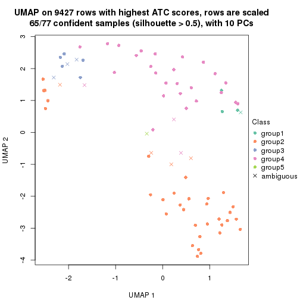</p>

</div>
<div id='tab-ATC-skmeans-dimension-reduction-5'>
<pre><code class="r">dimension_reduction(res, k = 6, method = &quot;UMAP&quot;)
</code></pre>

<p>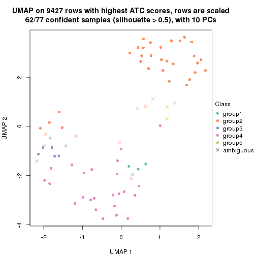</p>

</div>
</div>


Following heatmap shows how subgroups are split when increasing `k`:

```r
collect_classes(res)
```


If matrix rows can be associated to genes, consider to use `GO_Enrichment(res,
...)` to perform function enrichment for the signature genes.


 

---------------------------------------------------


### ATC:pam**


The object with results only for a single top-value method and a single partition method 
can be extracted as:

```r
res = res_list["ATC", "pam"]
# you can also extract it by
# res = res_list["ATC:pam"]
```

A summary of `res` and all the functions that can be applied to it:

```r
res
```

```
#> A 'ConsensusPartition' object with k = 2, 3, 4, 5, 6.
#>   On a matrix with 9427 rows and 77 columns.
#>   Top rows (943, 1886, 2828, 3771, 4714) are extracted by 'ATC' method.
#>   Subgroups are detected by 'pam' method.
#>   Performed in total 1250 partitions by row resampling.
#>   Best k for subgroups seems to be 2.
#> 
#> Following methods can be applied to this 'ConsensusPartition' object:
#>  [1] "cola_report"             "collect_classes"         "collect_plots"          
#>  [4] "collect_stats"           "colnames"                "compare_signatures"     
#>  [7] "consensus_heatmap"       "dimension_reduction"     "functional_enrichment"  
#> [10] "get_anno_col"            "get_anno"                "get_classes"            
#> [13] "get_consensus"           "get_matrix"              "get_membership"         
#> [16] "get_param"               "get_signatures"          "get_stats"              
#> [19] "is_best_k"               "is_stable_k"             "membership_heatmap"     
#> [22] "ncol"                    "nrow"                    "plot_ecdf"              
#> [25] "rownames"                "select_partition_number" "show"                   
#> [28] "suggest_best_k"          "test_to_known_factors"
```

`collect_plots()` function collects all the plots made from `res` for all `k` (number of partitions)
into one single page to provide an easy and fast comparison between different `k`.

```r
collect_plots(res)
```


The plots are:

- The first row: a plot of the ECDF (Empirical cumulative distribution
  function) curves of the consensus matrix for each `k` and the heatmap of
  predicted classes for each `k`.
- The second row: heatmaps of the consensus matrix for each `k`.
- The third row: heatmaps of the membership matrix for each `k`.
- The fouth row: heatmaps of the signatures for each `k`.

All the plots in panels can be made by individual functions and they are
plotted later in this section.

`select_partition_number()` produces several plots showing different
statistics for choosing "optimized" `k`. There are following statistics:

- ECDF curves of the consensus matrix for each `k`;
- 1-PAC. [The PAC
  score](https://en.wikipedia.org/wiki/Consensus_clustering#Over-interpretation_potential_of_consensus_clustering)
  measures the proportion of the ambiguous subgrouping.
- Mean silhouette score.
- Concordance. The mean probability of fiting the consensus class ids in all
  partitions.
- Area increased. Denote $A_k$ as the area under the ECDF curve for current
  `k`, the area increased is defined as $A_k - A_{k-1}$.
- Rand index. The percent of pairs of samples that are both in a same cluster
  or both are not in a same cluster in the partition of k and k-1.
- Jaccard index. The ratio of pairs of samples are both in a same cluster in
  the partition of k and k-1 and the pairs of samples are both in a same
  cluster in the partition k or k-1.

The detailed explanations of these statistics can be found in [the cola
vignette](http://bioconductor.org/packages/devel/bioc/vignettes/cola/inst/doc/cola.html#toc_13).

Generally speaking, lower PAC score, higher mean silhouette score or higher
concordance corresponds to better partition. Rand index and Jaccard index
measure how similar the current partition is compared to partition with `k-1`.
If they are too similar, we won't accept `k` is better than `k-1`.

```r
select_partition_number(res)
```


The numeric values for all these statistics can be obtained by `get_stats()`.

```r
get_stats(res)
```

```
#>   k 1-PAC mean_silhouette concordance area_increased  Rand Jaccard
#> 2 2 1.000           0.985       0.993         0.5061 0.494   0.494
#> 3 3 0.675           0.672       0.869         0.2374 0.882   0.766
#> 4 4 0.799           0.775       0.910         0.1254 0.824   0.591
#> 5 5 0.747           0.721       0.876         0.0208 0.932   0.787
#> 6 6 0.760           0.701       0.867         0.0204 0.974   0.909
```

`suggest_best_k()` suggests the best $k$ based on these statistics. The rules are as follows:

- All $k$ with Jaccard index larger than 0.95 are removed because the increase of
  the partition number does not provides enough extra information. If all $k$ are removed,
  the best $k$ is assigned by `NA`.
- For $k$ with 1-PAC larger than 0.9, the maximal $k$ is taken as the "best k". Other $k$ is called "optional k".
- If it does not fit the second rule. The $k$ with the highest vote of highest
  1-PAC, mean silhouette and concordance is taken as the "best k".

```r
suggest_best_k(res)
```

```
#> [1] 2
```


Following shows the table of the partitions (You need to click the **show/hide
code output** link to see it). The membership matrix (columns with name `p*`)
is inferred by
[`clue::cl_consensus()`](https://www.rdocumentation.org/link/cl_consensus?package=clue)
function with the `SE` method. Basically the value in the membership matrix
represents the probability to belong to a certain group. The finall class
label for an item is determined with the group with highest probability it
belongs to.

In `get_classes()` function, the entropy is calculated from the membership
matrix and the silhouette score is calculated from the consensus matrix.


<script>
$( function() {
	$( '#tabs-ATC-pam-get-classes' ).tabs();
} );
</script>
<div id='tabs-ATC-pam-get-classes'>
<ul>
<li><a href='#tab-ATC-pam-get-classes-1'>k = 2</a></li>
<li><a href='#tab-ATC-pam-get-classes-2'>k = 3</a></li>
<li><a href='#tab-ATC-pam-get-classes-3'>k = 4</a></li>
<li><a href='#tab-ATC-pam-get-classes-4'>k = 5</a></li>
<li><a href='#tab-ATC-pam-get-classes-5'>k = 6</a></li>
</ul>

<div id='tab-ATC-pam-get-classes-1'>
<p><a id='tab-ATC-pam-get-classes-1-a' style='color:#0366d6' href='#'>show/hide code output</a></p>
<pre><code class="r">cbind(get_classes(res, k = 2), get_membership(res, k = 2))
</code></pre>

<pre><code>#&gt;           class entropy silhouette    p1    p2
#&gt; SRR944011     2  0.6148      0.821 0.152 0.848
#&gt; SRR944012     1  0.0000      0.991 1.000 0.000
#&gt; SRR944014     2  0.0000      0.994 0.000 1.000
#&gt; SRR944013     2  0.0000      0.994 0.000 1.000
#&gt; SRR944015     1  0.0000      0.991 1.000 0.000
#&gt; SRR944016     1  0.1184      0.979 0.984 0.016
#&gt; SRR944017     2  0.0000      0.994 0.000 1.000
#&gt; SRR944018     1  0.0000      0.991 1.000 0.000
#&gt; SRR944019     1  0.0000      0.991 1.000 0.000
#&gt; SRR944020     1  0.0000      0.991 1.000 0.000
#&gt; SRR944021     2  0.0000      0.994 0.000 1.000
#&gt; SRR944022     1  0.0000      0.991 1.000 0.000
#&gt; SRR944023     1  0.0000      0.991 1.000 0.000
#&gt; SRR944024     1  0.0000      0.991 1.000 0.000
#&gt; SRR944026     2  0.0000      0.994 0.000 1.000
#&gt; SRR944025     2  0.0000      0.994 0.000 1.000
#&gt; SRR944028     2  0.0000      0.994 0.000 1.000
#&gt; SRR944029     1  0.6048      0.830 0.852 0.148
#&gt; SRR944030     2  0.0000      0.994 0.000 1.000
#&gt; SRR944031     1  0.0000      0.991 1.000 0.000
#&gt; SRR944032     2  0.0000      0.994 0.000 1.000
#&gt; SRR944033     2  0.0000      0.994 0.000 1.000
#&gt; SRR944034     2  0.0000      0.994 0.000 1.000
#&gt; SRR944036     1  0.0000      0.991 1.000 0.000
#&gt; SRR944035     2  0.0000      0.994 0.000 1.000
#&gt; SRR944038     1  0.0000      0.991 1.000 0.000
#&gt; SRR944037     1  0.0000      0.991 1.000 0.000
#&gt; SRR944039     1  0.0000      0.991 1.000 0.000
#&gt; SRR944040     2  0.0000      0.994 0.000 1.000
#&gt; SRR944041     1  0.0000      0.991 1.000 0.000
#&gt; SRR944042     1  0.0000      0.991 1.000 0.000
#&gt; SRR944043     1  0.0000      0.991 1.000 0.000
#&gt; SRR944044     2  0.0000      0.994 0.000 1.000
#&gt; SRR944046     1  0.0000      0.991 1.000 0.000
#&gt; SRR944045     2  0.0000      0.994 0.000 1.000
#&gt; SRR944047     2  0.0000      0.994 0.000 1.000
#&gt; SRR944048     1  0.1184      0.979 0.984 0.016
#&gt; SRR944049     2  0.0000      0.994 0.000 1.000
#&gt; SRR944050     1  0.1414      0.975 0.980 0.020
#&gt; SRR944051     2  0.0000      0.994 0.000 1.000
#&gt; SRR944052     2  0.0000      0.994 0.000 1.000
#&gt; SRR944053     1  0.0000      0.991 1.000 0.000
#&gt; SRR944054     2  0.0000      0.994 0.000 1.000
#&gt; SRR944055     2  0.0000      0.994 0.000 1.000
#&gt; SRR944056     2  0.0000      0.994 0.000 1.000
#&gt; SRR944057     1  0.0000      0.991 1.000 0.000
#&gt; SRR944058     1  0.0000      0.991 1.000 0.000
#&gt; SRR944059     2  0.0000      0.994 0.000 1.000
#&gt; SRR944060     1  0.0000      0.991 1.000 0.000
#&gt; SRR944061     2  0.0000      0.994 0.000 1.000
#&gt; SRR944062     1  0.0000      0.991 1.000 0.000
#&gt; SRR944063     1  0.0000      0.991 1.000 0.000
#&gt; SRR944064     2  0.0000      0.994 0.000 1.000
#&gt; SRR944065     1  0.0000      0.991 1.000 0.000
#&gt; SRR944066     1  0.0000      0.991 1.000 0.000
#&gt; SRR944067     2  0.0000      0.994 0.000 1.000
#&gt; SRR944068     1  0.0000      0.991 1.000 0.000
#&gt; SRR944069     2  0.0000      0.994 0.000 1.000
#&gt; SRR944070     1  0.0000      0.991 1.000 0.000
#&gt; SRR944071     1  0.5519      0.856 0.872 0.128
#&gt; SRR944072     1  0.0000      0.991 1.000 0.000
#&gt; SRR944073     2  0.0000      0.994 0.000 1.000
#&gt; SRR944075     2  0.1184      0.980 0.016 0.984
#&gt; SRR944074     2  0.0000      0.994 0.000 1.000
#&gt; SRR944076     1  0.0000      0.991 1.000 0.000
#&gt; SRR944077     2  0.0000      0.994 0.000 1.000
#&gt; SRR944078     2  0.0000      0.994 0.000 1.000
#&gt; SRR944079     2  0.0000      0.994 0.000 1.000
#&gt; SRR944080     2  0.0000      0.994 0.000 1.000
#&gt; SRR944081     1  0.0000      0.991 1.000 0.000
#&gt; SRR944082     1  0.0000      0.991 1.000 0.000
#&gt; SRR944083     1  0.0000      0.991 1.000 0.000
#&gt; SRR944084     1  0.0000      0.991 1.000 0.000
#&gt; SRR944085     2  0.2948      0.944 0.052 0.948
#&gt; SRR944086     1  0.0376      0.988 0.996 0.004
#&gt; SRR944088     2  0.0376      0.990 0.004 0.996
#&gt; SRR944087     1  0.0000      0.991 1.000 0.000
</code></pre>

<script>
$('#tab-ATC-pam-get-classes-1-a').parent().next().next().hide();
$('#tab-ATC-pam-get-classes-1-a').click(function(){
  $('#tab-ATC-pam-get-classes-1-a').parent().next().next().toggle();
  return(false);
});
</script>
</div>

<div id='tab-ATC-pam-get-classes-2'>
<p><a id='tab-ATC-pam-get-classes-2-a' style='color:#0366d6' href='#'>show/hide code output</a></p>
<pre><code class="r">cbind(get_classes(res, k = 3), get_membership(res, k = 3))
</code></pre>

<pre><code>#&gt;           class entropy silhouette    p1    p2    p3
#&gt; SRR944011     1  0.6192    -0.0967 0.580 0.420 0.000
#&gt; SRR944012     1  0.6235     0.2656 0.564 0.000 0.436
#&gt; SRR944014     2  0.0000     0.8901 0.000 1.000 0.000
#&gt; SRR944013     2  0.5291     0.6741 0.268 0.732 0.000
#&gt; SRR944015     3  0.0000     0.8847 0.000 0.000 1.000
#&gt; SRR944016     1  0.1163     0.7122 0.972 0.028 0.000
#&gt; SRR944017     2  0.0000     0.8901 0.000 1.000 0.000
#&gt; SRR944018     1  0.0000     0.7300 1.000 0.000 0.000
#&gt; SRR944019     1  0.0000     0.7300 1.000 0.000 0.000
#&gt; SRR944020     3  0.5465     0.4853 0.288 0.000 0.712
#&gt; SRR944021     2  0.0000     0.8901 0.000 1.000 0.000
#&gt; SRR944022     3  0.0000     0.8847 0.000 0.000 1.000
#&gt; SRR944023     1  0.0000     0.7300 1.000 0.000 0.000
#&gt; SRR944024     1  0.6252     0.2542 0.556 0.000 0.444
#&gt; SRR944026     2  0.0000     0.8901 0.000 1.000 0.000
#&gt; SRR944025     2  0.0000     0.8901 0.000 1.000 0.000
#&gt; SRR944028     2  0.0000     0.8901 0.000 1.000 0.000
#&gt; SRR944029     1  0.3686     0.5946 0.860 0.140 0.000
#&gt; SRR944030     2  0.0000     0.8901 0.000 1.000 0.000
#&gt; SRR944031     1  0.0000     0.7300 1.000 0.000 0.000
#&gt; SRR944032     2  0.6308     0.3176 0.492 0.508 0.000
#&gt; SRR944033     2  0.0000     0.8901 0.000 1.000 0.000
#&gt; SRR944034     2  0.0000     0.8901 0.000 1.000 0.000
#&gt; SRR944036     1  0.0000     0.7300 1.000 0.000 0.000
#&gt; SRR944035     2  0.0000     0.8901 0.000 1.000 0.000
#&gt; SRR944038     1  0.6309     0.1112 0.504 0.000 0.496
#&gt; SRR944037     3  0.0237     0.8821 0.004 0.000 0.996
#&gt; SRR944039     1  0.0000     0.7300 1.000 0.000 0.000
#&gt; SRR944040     2  0.0000     0.8901 0.000 1.000 0.000
#&gt; SRR944041     1  0.6286     0.2106 0.536 0.000 0.464
#&gt; SRR944042     1  0.0000     0.7300 1.000 0.000 0.000
#&gt; SRR944043     1  0.6291     0.2013 0.532 0.000 0.468
#&gt; SRR944044     2  0.0000     0.8901 0.000 1.000 0.000
#&gt; SRR944046     1  0.0000     0.7300 1.000 0.000 0.000
#&gt; SRR944045     2  0.0000     0.8901 0.000 1.000 0.000
#&gt; SRR944047     2  0.0000     0.8901 0.000 1.000 0.000
#&gt; SRR944048     1  0.1031     0.7151 0.976 0.024 0.000
#&gt; SRR944049     2  0.0000     0.8901 0.000 1.000 0.000
#&gt; SRR944050     1  0.1643     0.6990 0.956 0.044 0.000
#&gt; SRR944051     2  0.6095     0.5031 0.392 0.608 0.000
#&gt; SRR944052     2  0.0000     0.8901 0.000 1.000 0.000
#&gt; SRR944053     3  0.0000     0.8847 0.000 0.000 1.000
#&gt; SRR944054     2  0.2448     0.8439 0.076 0.924 0.000
#&gt; SRR944055     2  0.4605     0.7426 0.204 0.796 0.000
#&gt; SRR944056     2  0.0000     0.8901 0.000 1.000 0.000
#&gt; SRR944057     1  0.0000     0.7300 1.000 0.000 0.000
#&gt; SRR944058     1  0.6291     0.2013 0.532 0.000 0.468
#&gt; SRR944059     2  0.6168     0.4743 0.412 0.588 0.000
#&gt; SRR944060     1  0.6252     0.2542 0.556 0.000 0.444
#&gt; SRR944061     2  0.0000     0.8901 0.000 1.000 0.000
#&gt; SRR944062     3  0.6079     0.2098 0.388 0.000 0.612
#&gt; SRR944063     3  0.0000     0.8847 0.000 0.000 1.000
#&gt; SRR944064     2  0.0000     0.8901 0.000 1.000 0.000
#&gt; SRR944065     3  0.0000     0.8847 0.000 0.000 1.000
#&gt; SRR944066     1  0.6260     0.2461 0.552 0.000 0.448
#&gt; SRR944067     2  0.0000     0.8901 0.000 1.000 0.000
#&gt; SRR944068     3  0.0000     0.8847 0.000 0.000 1.000
#&gt; SRR944069     2  0.0000     0.8901 0.000 1.000 0.000
#&gt; SRR944070     1  0.6291     0.2013 0.532 0.000 0.468
#&gt; SRR944071     1  0.3340     0.6182 0.880 0.120 0.000
#&gt; SRR944072     1  0.6286     0.2112 0.536 0.000 0.464
#&gt; SRR944073     2  0.0000     0.8901 0.000 1.000 0.000
#&gt; SRR944075     2  0.6309     0.3074 0.496 0.504 0.000
#&gt; SRR944074     2  0.0000     0.8901 0.000 1.000 0.000
#&gt; SRR944076     1  0.0000     0.7300 1.000 0.000 0.000
#&gt; SRR944077     2  0.0000     0.8901 0.000 1.000 0.000
#&gt; SRR944078     2  0.3619     0.8014 0.136 0.864 0.000
#&gt; SRR944079     2  0.0000     0.8901 0.000 1.000 0.000
#&gt; SRR944080     2  0.0000     0.8901 0.000 1.000 0.000
#&gt; SRR944081     1  0.0000     0.7300 1.000 0.000 0.000
#&gt; SRR944082     1  0.6309     0.1105 0.504 0.000 0.496
#&gt; SRR944083     1  0.3551     0.6428 0.868 0.000 0.132
#&gt; SRR944084     1  0.0000     0.7300 1.000 0.000 0.000
#&gt; SRR944085     2  0.6308     0.3176 0.492 0.508 0.000
#&gt; SRR944086     1  0.0237     0.7278 0.996 0.004 0.000
#&gt; SRR944088     2  0.6286     0.3745 0.464 0.536 0.000
#&gt; SRR944087     1  0.0000     0.7300 1.000 0.000 0.000
</code></pre>

<script>
$('#tab-ATC-pam-get-classes-2-a').parent().next().next().hide();
$('#tab-ATC-pam-get-classes-2-a').click(function(){
  $('#tab-ATC-pam-get-classes-2-a').parent().next().next().toggle();
  return(false);
});
</script>
</div>

<div id='tab-ATC-pam-get-classes-3'>
<p><a id='tab-ATC-pam-get-classes-3-a' style='color:#0366d6' href='#'>show/hide code output</a></p>
<pre><code class="r">cbind(get_classes(res, k = 4), get_membership(res, k = 4))
</code></pre>

<pre><code>#&gt;           class entropy silhouette    p1    p2    p3    p4
#&gt; SRR944011     3  0.0000     0.8189 0.000 0.000 1.000 0.000
#&gt; SRR944012     1  0.1389     0.7789 0.952 0.000 0.048 0.000
#&gt; SRR944014     2  0.0000     0.9510 0.000 1.000 0.000 0.000
#&gt; SRR944013     2  0.4564     0.4825 0.000 0.672 0.328 0.000
#&gt; SRR944015     4  0.0000     0.9439 0.000 0.000 0.000 1.000
#&gt; SRR944016     3  0.1389     0.7888 0.048 0.000 0.952 0.000
#&gt; SRR944017     2  0.0000     0.9510 0.000 1.000 0.000 0.000
#&gt; SRR944018     1  0.4972     0.4009 0.544 0.000 0.456 0.000
#&gt; SRR944019     3  0.0707     0.8113 0.020 0.000 0.980 0.000
#&gt; SRR944020     4  0.3105     0.8233 0.140 0.000 0.004 0.856
#&gt; SRR944021     2  0.0000     0.9510 0.000 1.000 0.000 0.000
#&gt; SRR944022     4  0.0000     0.9439 0.000 0.000 0.000 1.000
#&gt; SRR944023     1  0.4977     0.3932 0.540 0.000 0.460 0.000
#&gt; SRR944024     1  0.0707     0.7706 0.980 0.000 0.020 0.000
#&gt; SRR944026     2  0.0000     0.9510 0.000 1.000 0.000 0.000
#&gt; SRR944025     2  0.0000     0.9510 0.000 1.000 0.000 0.000
#&gt; SRR944028     2  0.0000     0.9510 0.000 1.000 0.000 0.000
#&gt; SRR944029     3  0.0000     0.8189 0.000 0.000 1.000 0.000
#&gt; SRR944030     2  0.0000     0.9510 0.000 1.000 0.000 0.000
#&gt; SRR944031     3  0.0188     0.8187 0.004 0.000 0.996 0.000
#&gt; SRR944032     3  0.4843     0.3407 0.000 0.396 0.604 0.000
#&gt; SRR944033     2  0.0000     0.9510 0.000 1.000 0.000 0.000
#&gt; SRR944034     2  0.0000     0.9510 0.000 1.000 0.000 0.000
#&gt; SRR944036     3  0.0000     0.8189 0.000 0.000 1.000 0.000
#&gt; SRR944035     2  0.0000     0.9510 0.000 1.000 0.000 0.000
#&gt; SRR944038     1  0.1489     0.7786 0.952 0.000 0.044 0.004
#&gt; SRR944037     4  0.0707     0.9357 0.020 0.000 0.000 0.980
#&gt; SRR944039     1  0.4977     0.3932 0.540 0.000 0.460 0.000
#&gt; SRR944040     2  0.0000     0.9510 0.000 1.000 0.000 0.000
#&gt; SRR944041     1  0.1302     0.7797 0.956 0.000 0.044 0.000
#&gt; SRR944042     3  0.4661     0.1401 0.348 0.000 0.652 0.000
#&gt; SRR944043     1  0.1302     0.7797 0.956 0.000 0.044 0.000
#&gt; SRR944044     2  0.0000     0.9510 0.000 1.000 0.000 0.000
#&gt; SRR944046     3  0.0817     0.8081 0.024 0.000 0.976 0.000
#&gt; SRR944045     2  0.0000     0.9510 0.000 1.000 0.000 0.000
#&gt; SRR944047     2  0.0000     0.9510 0.000 1.000 0.000 0.000
#&gt; SRR944048     3  0.4406     0.4814 0.300 0.000 0.700 0.000
#&gt; SRR944049     2  0.0000     0.9510 0.000 1.000 0.000 0.000
#&gt; SRR944050     3  0.1256     0.8070 0.028 0.008 0.964 0.000
#&gt; SRR944051     2  0.4972     0.0997 0.000 0.544 0.456 0.000
#&gt; SRR944052     2  0.0000     0.9510 0.000 1.000 0.000 0.000
#&gt; SRR944053     4  0.0000     0.9439 0.000 0.000 0.000 1.000
#&gt; SRR944054     2  0.2281     0.8605 0.000 0.904 0.096 0.000
#&gt; SRR944055     2  0.3975     0.6600 0.000 0.760 0.240 0.000
#&gt; SRR944056     2  0.0000     0.9510 0.000 1.000 0.000 0.000
#&gt; SRR944057     1  0.4989     0.3659 0.528 0.000 0.472 0.000
#&gt; SRR944058     1  0.0000     0.7669 1.000 0.000 0.000 0.000
#&gt; SRR944059     3  0.4994     0.0806 0.000 0.480 0.520 0.000
#&gt; SRR944060     1  0.4761     0.5315 0.628 0.000 0.372 0.000
#&gt; SRR944061     2  0.0000     0.9510 0.000 1.000 0.000 0.000
#&gt; SRR944062     1  0.4697     0.1562 0.644 0.000 0.000 0.356
#&gt; SRR944063     4  0.0000     0.9439 0.000 0.000 0.000 1.000
#&gt; SRR944064     2  0.0000     0.9510 0.000 1.000 0.000 0.000
#&gt; SRR944065     4  0.3688     0.7606 0.208 0.000 0.000 0.792
#&gt; SRR944066     1  0.0000     0.7669 1.000 0.000 0.000 0.000
#&gt; SRR944067     2  0.0000     0.9510 0.000 1.000 0.000 0.000
#&gt; SRR944068     4  0.0000     0.9439 0.000 0.000 0.000 1.000
#&gt; SRR944069     2  0.0000     0.9510 0.000 1.000 0.000 0.000
#&gt; SRR944070     1  0.1302     0.7797 0.956 0.000 0.044 0.000
#&gt; SRR944071     3  0.0000     0.8189 0.000 0.000 1.000 0.000
#&gt; SRR944072     1  0.0000     0.7669 1.000 0.000 0.000 0.000
#&gt; SRR944073     2  0.0000     0.9510 0.000 1.000 0.000 0.000
#&gt; SRR944075     3  0.2814     0.7269 0.000 0.132 0.868 0.000
#&gt; SRR944074     2  0.0000     0.9510 0.000 1.000 0.000 0.000
#&gt; SRR944076     3  0.0000     0.8189 0.000 0.000 1.000 0.000
#&gt; SRR944077     2  0.0000     0.9510 0.000 1.000 0.000 0.000
#&gt; SRR944078     2  0.3219     0.7765 0.000 0.836 0.164 0.000
#&gt; SRR944079     2  0.0000     0.9510 0.000 1.000 0.000 0.000
#&gt; SRR944080     2  0.0000     0.9510 0.000 1.000 0.000 0.000
#&gt; SRR944081     3  0.0336     0.8175 0.008 0.000 0.992 0.000
#&gt; SRR944082     1  0.0188     0.7652 0.996 0.000 0.000 0.004
#&gt; SRR944083     1  0.0469     0.7704 0.988 0.000 0.012 0.000
#&gt; SRR944084     3  0.0707     0.8117 0.020 0.000 0.980 0.000
#&gt; SRR944085     3  0.3219     0.6968 0.000 0.164 0.836 0.000
#&gt; SRR944086     3  0.0188     0.8186 0.004 0.000 0.996 0.000
#&gt; SRR944088     3  0.4961     0.1930 0.000 0.448 0.552 0.000
#&gt; SRR944087     3  0.0469     0.8162 0.012 0.000 0.988 0.000
</code></pre>

<script>
$('#tab-ATC-pam-get-classes-3-a').parent().next().next().hide();
$('#tab-ATC-pam-get-classes-3-a').click(function(){
  $('#tab-ATC-pam-get-classes-3-a').parent().next().next().toggle();
  return(false);
});
</script>
</div>

<div id='tab-ATC-pam-get-classes-4'>
<p><a id='tab-ATC-pam-get-classes-4-a' style='color:#0366d6' href='#'>show/hide code output</a></p>
<pre><code class="r">cbind(get_classes(res, k = 5), get_membership(res, k = 5))
</code></pre>

<pre><code>#&gt;           class entropy silhouette    p1    p2    p3    p4    p5
#&gt; SRR944011     3  0.0794     0.7719 0.000 0.000 0.972 0.000 0.028
#&gt; SRR944012     1  0.1725     0.7623 0.936 0.000 0.020 0.000 0.044
#&gt; SRR944014     2  0.0000     0.9475 0.000 1.000 0.000 0.000 0.000
#&gt; SRR944013     2  0.4584     0.4891 0.000 0.660 0.312 0.000 0.028
#&gt; SRR944015     4  0.0000     1.0000 0.000 0.000 0.000 1.000 0.000
#&gt; SRR944016     3  0.1830     0.7658 0.040 0.000 0.932 0.000 0.028
#&gt; SRR944017     2  0.0000     0.9475 0.000 1.000 0.000 0.000 0.000
#&gt; SRR944018     3  0.5080     0.3775 0.368 0.000 0.588 0.000 0.044
#&gt; SRR944019     3  0.0703     0.7779 0.024 0.000 0.976 0.000 0.000
#&gt; SRR944020     5  0.4225     0.0664 0.004 0.000 0.000 0.364 0.632
#&gt; SRR944021     2  0.0000     0.9475 0.000 1.000 0.000 0.000 0.000
#&gt; SRR944022     4  0.0000     1.0000 0.000 0.000 0.000 1.000 0.000
#&gt; SRR944023     3  0.4768     0.4972 0.304 0.000 0.656 0.000 0.040
#&gt; SRR944024     1  0.1106     0.8006 0.964 0.000 0.024 0.000 0.012
#&gt; SRR944026     2  0.0000     0.9475 0.000 1.000 0.000 0.000 0.000
#&gt; SRR944025     2  0.0000     0.9475 0.000 1.000 0.000 0.000 0.000
#&gt; SRR944028     2  0.0000     0.9475 0.000 1.000 0.000 0.000 0.000
#&gt; SRR944029     3  0.0000     0.7794 0.000 0.000 1.000 0.000 0.000
#&gt; SRR944030     2  0.0000     0.9475 0.000 1.000 0.000 0.000 0.000
#&gt; SRR944031     3  0.0162     0.7802 0.000 0.000 0.996 0.000 0.004
#&gt; SRR944032     3  0.4835     0.3368 0.000 0.380 0.592 0.000 0.028
#&gt; SRR944033     2  0.0000     0.9475 0.000 1.000 0.000 0.000 0.000
#&gt; SRR944034     2  0.0000     0.9475 0.000 1.000 0.000 0.000 0.000
#&gt; SRR944036     3  0.0290     0.7800 0.008 0.000 0.992 0.000 0.000
#&gt; SRR944035     2  0.0000     0.9475 0.000 1.000 0.000 0.000 0.000
#&gt; SRR944038     5  0.4630     0.0878 0.396 0.000 0.016 0.000 0.588
#&gt; SRR944037     5  0.3452     0.2494 0.000 0.000 0.000 0.244 0.756
#&gt; SRR944039     3  0.4193     0.5247 0.304 0.000 0.684 0.000 0.012
#&gt; SRR944040     2  0.0000     0.9475 0.000 1.000 0.000 0.000 0.000
#&gt; SRR944041     1  0.4418     0.3669 0.652 0.000 0.016 0.000 0.332
#&gt; SRR944042     3  0.4028     0.6221 0.192 0.000 0.768 0.000 0.040
#&gt; SRR944043     5  0.4659    -0.0262 0.492 0.000 0.012 0.000 0.496
#&gt; SRR944044     2  0.0000     0.9475 0.000 1.000 0.000 0.000 0.000
#&gt; SRR944046     3  0.1915     0.7604 0.032 0.000 0.928 0.000 0.040
#&gt; SRR944045     2  0.0000     0.9475 0.000 1.000 0.000 0.000 0.000
#&gt; SRR944047     2  0.0000     0.9475 0.000 1.000 0.000 0.000 0.000
#&gt; SRR944048     3  0.4252     0.4997 0.280 0.000 0.700 0.000 0.020
#&gt; SRR944049     2  0.0000     0.9475 0.000 1.000 0.000 0.000 0.000
#&gt; SRR944050     3  0.0898     0.7770 0.008 0.000 0.972 0.000 0.020
#&gt; SRR944051     2  0.4937     0.1643 0.000 0.544 0.428 0.000 0.028
#&gt; SRR944052     2  0.0000     0.9475 0.000 1.000 0.000 0.000 0.000
#&gt; SRR944053     4  0.0000     1.0000 0.000 0.000 0.000 1.000 0.000
#&gt; SRR944054     2  0.2740     0.8345 0.000 0.876 0.096 0.000 0.028
#&gt; SRR944055     2  0.4024     0.6677 0.000 0.752 0.220 0.000 0.028
#&gt; SRR944056     2  0.0000     0.9475 0.000 1.000 0.000 0.000 0.000
#&gt; SRR944057     3  0.4777     0.5105 0.292 0.000 0.664 0.000 0.044
#&gt; SRR944058     1  0.0290     0.8123 0.992 0.000 0.000 0.000 0.008
#&gt; SRR944059     3  0.4974     0.0813 0.000 0.464 0.508 0.000 0.028
#&gt; SRR944060     5  0.6705     0.1174 0.292 0.000 0.280 0.000 0.428
#&gt; SRR944061     2  0.0000     0.9475 0.000 1.000 0.000 0.000 0.000
#&gt; SRR944062     1  0.3720     0.6278 0.760 0.000 0.000 0.012 0.228
#&gt; SRR944063     4  0.0000     1.0000 0.000 0.000 0.000 1.000 0.000
#&gt; SRR944064     2  0.0000     0.9475 0.000 1.000 0.000 0.000 0.000
#&gt; SRR944065     5  0.4757     0.0314 0.024 0.000 0.000 0.380 0.596
#&gt; SRR944066     1  0.1965     0.7963 0.904 0.000 0.000 0.000 0.096
#&gt; SRR944067     2  0.0000     0.9475 0.000 1.000 0.000 0.000 0.000
#&gt; SRR944068     4  0.0000     1.0000 0.000 0.000 0.000 1.000 0.000
#&gt; SRR944069     2  0.0000     0.9475 0.000 1.000 0.000 0.000 0.000
#&gt; SRR944070     5  0.4620     0.0915 0.392 0.000 0.016 0.000 0.592
#&gt; SRR944071     3  0.0609     0.7751 0.000 0.000 0.980 0.000 0.020
#&gt; SRR944072     1  0.1544     0.8061 0.932 0.000 0.000 0.000 0.068
#&gt; SRR944073     2  0.0000     0.9475 0.000 1.000 0.000 0.000 0.000
#&gt; SRR944075     3  0.3002     0.6914 0.000 0.116 0.856 0.000 0.028
#&gt; SRR944074     2  0.0000     0.9475 0.000 1.000 0.000 0.000 0.000
#&gt; SRR944076     3  0.0162     0.7798 0.004 0.000 0.996 0.000 0.000
#&gt; SRR944077     2  0.0000     0.9475 0.000 1.000 0.000 0.000 0.000
#&gt; SRR944078     2  0.3412     0.7702 0.000 0.820 0.152 0.000 0.028
#&gt; SRR944079     2  0.0000     0.9475 0.000 1.000 0.000 0.000 0.000
#&gt; SRR944080     2  0.0000     0.9475 0.000 1.000 0.000 0.000 0.000
#&gt; SRR944081     3  0.0290     0.7801 0.008 0.000 0.992 0.000 0.000
#&gt; SRR944082     1  0.2891     0.7271 0.824 0.000 0.000 0.000 0.176
#&gt; SRR944083     1  0.0404     0.8076 0.988 0.000 0.012 0.000 0.000
#&gt; SRR944084     3  0.1579     0.7683 0.024 0.000 0.944 0.000 0.032
#&gt; SRR944085     3  0.3238     0.6685 0.000 0.136 0.836 0.000 0.028
#&gt; SRR944086     3  0.0693     0.7794 0.008 0.000 0.980 0.000 0.012
#&gt; SRR944088     3  0.4948     0.1782 0.000 0.436 0.536 0.000 0.028
#&gt; SRR944087     3  0.1549     0.7686 0.016 0.000 0.944 0.000 0.040
</code></pre>

<script>
$('#tab-ATC-pam-get-classes-4-a').parent().next().next().hide();
$('#tab-ATC-pam-get-classes-4-a').click(function(){
  $('#tab-ATC-pam-get-classes-4-a').parent().next().next().toggle();
  return(false);
});
</script>
</div>

<div id='tab-ATC-pam-get-classes-5'>
<p><a id='tab-ATC-pam-get-classes-5-a' style='color:#0366d6' href='#'>show/hide code output</a></p>
<pre><code class="r">cbind(get_classes(res, k = 6), get_membership(res, k = 6))
</code></pre>

<pre><code>#&gt;           class entropy silhouette    p1    p2    p3    p4    p5    p6
#&gt; SRR944011     3  0.0865    0.71927 0.000 0.000 0.964 0.000 0.036 0.000
#&gt; SRR944012     1  0.4407    0.55138 0.496 0.000 0.000 0.000 0.024 0.480
#&gt; SRR944014     2  0.0000    0.94653 0.000 1.000 0.000 0.000 0.000 0.000
#&gt; SRR944013     2  0.4186    0.47146 0.000 0.656 0.312 0.000 0.032 0.000
#&gt; SRR944015     4  0.0000    1.00000 0.000 0.000 0.000 1.000 0.000 0.000
#&gt; SRR944016     3  0.1713    0.70839 0.000 0.000 0.928 0.000 0.028 0.044
#&gt; SRR944017     2  0.0000    0.94653 0.000 1.000 0.000 0.000 0.000 0.000
#&gt; SRR944018     6  0.4932    0.12849 0.052 0.000 0.452 0.000 0.004 0.492
#&gt; SRR944019     3  0.0993    0.71814 0.000 0.000 0.964 0.000 0.012 0.024
#&gt; SRR944020     5  0.1588    0.78696 0.000 0.000 0.000 0.072 0.924 0.004
#&gt; SRR944021     2  0.0000    0.94653 0.000 1.000 0.000 0.000 0.000 0.000
#&gt; SRR944022     4  0.0000    1.00000 0.000 0.000 0.000 1.000 0.000 0.000
#&gt; SRR944023     3  0.3847   -0.07935 0.000 0.000 0.544 0.000 0.000 0.456
#&gt; SRR944024     1  0.3470    0.76194 0.740 0.000 0.012 0.000 0.000 0.248
#&gt; SRR944026     2  0.0000    0.94653 0.000 1.000 0.000 0.000 0.000 0.000
#&gt; SRR944025     2  0.0000    0.94653 0.000 1.000 0.000 0.000 0.000 0.000
#&gt; SRR944028     2  0.0000    0.94653 0.000 1.000 0.000 0.000 0.000 0.000
#&gt; SRR944029     3  0.0000    0.72672 0.000 0.000 1.000 0.000 0.000 0.000
#&gt; SRR944030     2  0.0000    0.94653 0.000 1.000 0.000 0.000 0.000 0.000
#&gt; SRR944031     3  0.0260    0.72742 0.000 0.000 0.992 0.000 0.000 0.008
#&gt; SRR944032     3  0.4453    0.36042 0.000 0.372 0.592 0.000 0.036 0.000
#&gt; SRR944033     2  0.0000    0.94653 0.000 1.000 0.000 0.000 0.000 0.000
#&gt; SRR944034     2  0.0000    0.94653 0.000 1.000 0.000 0.000 0.000 0.000
#&gt; SRR944036     3  0.0260    0.72629 0.000 0.000 0.992 0.000 0.000 0.008
#&gt; SRR944035     2  0.0000    0.94653 0.000 1.000 0.000 0.000 0.000 0.000
#&gt; SRR944038     6  0.3975    0.18302 0.392 0.000 0.000 0.000 0.008 0.600
#&gt; SRR944037     5  0.1686    0.79029 0.012 0.000 0.000 0.064 0.924 0.000
#&gt; SRR944039     3  0.4076    0.06441 0.000 0.000 0.592 0.000 0.012 0.396
#&gt; SRR944040     2  0.0000    0.94653 0.000 1.000 0.000 0.000 0.000 0.000
#&gt; SRR944041     5  0.5861    0.11287 0.264 0.000 0.000 0.000 0.484 0.252
#&gt; SRR944042     3  0.3634    0.23810 0.000 0.000 0.644 0.000 0.000 0.356
#&gt; SRR944043     6  0.2887    0.17398 0.036 0.000 0.000 0.000 0.120 0.844
#&gt; SRR944044     2  0.0000    0.94653 0.000 1.000 0.000 0.000 0.000 0.000
#&gt; SRR944046     3  0.2562    0.61204 0.000 0.000 0.828 0.000 0.000 0.172
#&gt; SRR944045     2  0.0000    0.94653 0.000 1.000 0.000 0.000 0.000 0.000
#&gt; SRR944047     2  0.0000    0.94653 0.000 1.000 0.000 0.000 0.000 0.000
#&gt; SRR944048     3  0.3986    0.39254 0.316 0.000 0.664 0.000 0.020 0.000
#&gt; SRR944049     2  0.0000    0.94653 0.000 1.000 0.000 0.000 0.000 0.000
#&gt; SRR944050     3  0.0806    0.72531 0.000 0.000 0.972 0.000 0.020 0.008
#&gt; SRR944051     2  0.4550    0.15192 0.000 0.544 0.420 0.000 0.036 0.000
#&gt; SRR944052     2  0.0000    0.94653 0.000 1.000 0.000 0.000 0.000 0.000
#&gt; SRR944053     4  0.0000    1.00000 0.000 0.000 0.000 1.000 0.000 0.000
#&gt; SRR944054     2  0.2560    0.82933 0.000 0.872 0.092 0.000 0.036 0.000
#&gt; SRR944055     2  0.3727    0.65652 0.000 0.748 0.216 0.000 0.036 0.000
#&gt; SRR944056     2  0.0000    0.94653 0.000 1.000 0.000 0.000 0.000 0.000
#&gt; SRR944057     6  0.3868   -0.00661 0.000 0.000 0.496 0.000 0.000 0.504
#&gt; SRR944058     1  0.3454    0.76264 0.768 0.000 0.000 0.000 0.024 0.208
#&gt; SRR944059     3  0.4581    0.14596 0.000 0.448 0.516 0.000 0.036 0.000
#&gt; SRR944060     6  0.1794    0.30148 0.036 0.000 0.040 0.000 0.000 0.924
#&gt; SRR944061     2  0.0000    0.94653 0.000 1.000 0.000 0.000 0.000 0.000
#&gt; SRR944062     1  0.1265    0.57835 0.948 0.000 0.000 0.000 0.008 0.044
#&gt; SRR944063     4  0.0000    1.00000 0.000 0.000 0.000 1.000 0.000 0.000
#&gt; SRR944064     2  0.0000    0.94653 0.000 1.000 0.000 0.000 0.000 0.000
#&gt; SRR944065     5  0.1528    0.79043 0.000 0.000 0.000 0.048 0.936 0.016
#&gt; SRR944066     1  0.3907    0.69961 0.588 0.000 0.000 0.000 0.004 0.408
#&gt; SRR944067     2  0.0000    0.94653 0.000 1.000 0.000 0.000 0.000 0.000
#&gt; SRR944068     4  0.0000    1.00000 0.000 0.000 0.000 1.000 0.000 0.000
#&gt; SRR944069     2  0.0000    0.94653 0.000 1.000 0.000 0.000 0.000 0.000
#&gt; SRR944070     6  0.3534    0.27573 0.276 0.000 0.000 0.000 0.008 0.716
#&gt; SRR944071     3  0.0547    0.72425 0.000 0.000 0.980 0.000 0.020 0.000
#&gt; SRR944072     1  0.3936    0.75518 0.688 0.000 0.000 0.000 0.024 0.288
#&gt; SRR944073     2  0.0000    0.94653 0.000 1.000 0.000 0.000 0.000 0.000
#&gt; SRR944075     3  0.3014    0.62550 0.000 0.132 0.832 0.000 0.036 0.000
#&gt; SRR944074     2  0.0000    0.94653 0.000 1.000 0.000 0.000 0.000 0.000
#&gt; SRR944076     3  0.0146    0.72671 0.000 0.000 0.996 0.000 0.000 0.004
#&gt; SRR944077     2  0.0000    0.94653 0.000 1.000 0.000 0.000 0.000 0.000
#&gt; SRR944078     2  0.3172    0.76212 0.000 0.816 0.148 0.000 0.036 0.000
#&gt; SRR944079     2  0.0000    0.94653 0.000 1.000 0.000 0.000 0.000 0.000
#&gt; SRR944080     2  0.0000    0.94653 0.000 1.000 0.000 0.000 0.000 0.000
#&gt; SRR944081     3  0.0508    0.72447 0.000 0.000 0.984 0.000 0.012 0.004
#&gt; SRR944082     1  0.3445    0.65549 0.732 0.000 0.000 0.000 0.008 0.260
#&gt; SRR944083     1  0.3101    0.76586 0.756 0.000 0.000 0.000 0.000 0.244
#&gt; SRR944084     3  0.1957    0.66619 0.000 0.000 0.888 0.000 0.000 0.112
#&gt; SRR944085     3  0.2887    0.63266 0.000 0.120 0.844 0.000 0.036 0.000
#&gt; SRR944086     3  0.1297    0.71441 0.000 0.000 0.948 0.000 0.012 0.040
#&gt; SRR944088     3  0.4565    0.20075 0.000 0.432 0.532 0.000 0.036 0.000
#&gt; SRR944087     3  0.2378    0.63467 0.000 0.000 0.848 0.000 0.000 0.152
</code></pre>

<script>
$('#tab-ATC-pam-get-classes-5-a').parent().next().next().hide();
$('#tab-ATC-pam-get-classes-5-a').click(function(){
  $('#tab-ATC-pam-get-classes-5-a').parent().next().next().toggle();
  return(false);
});
</script>
</div>
</div>

Heatmaps for the consensus matrix. It visualizes the probability of two
samples to be in a same group.


<script>
$( function() {
	$( '#tabs-ATC-pam-consensus-heatmap' ).tabs();
} );
</script>
<div id='tabs-ATC-pam-consensus-heatmap'>
<ul>
<li><a href='#tab-ATC-pam-consensus-heatmap-1'>k = 2</a></li>
<li><a href='#tab-ATC-pam-consensus-heatmap-2'>k = 3</a></li>
<li><a href='#tab-ATC-pam-consensus-heatmap-3'>k = 4</a></li>
<li><a href='#tab-ATC-pam-consensus-heatmap-4'>k = 5</a></li>
<li><a href='#tab-ATC-pam-consensus-heatmap-5'>k = 6</a></li>
</ul>
<div id='tab-ATC-pam-consensus-heatmap-1'>
<pre><code class="r">consensus_heatmap(res, k = 2)
</code></pre>

<p></p>

</div>
<div id='tab-ATC-pam-consensus-heatmap-2'>
<pre><code class="r">consensus_heatmap(res, k = 3)
</code></pre>

<p></p>

</div>
<div id='tab-ATC-pam-consensus-heatmap-3'>
<pre><code class="r">consensus_heatmap(res, k = 4)
</code></pre>

<p></p>

</div>
<div id='tab-ATC-pam-consensus-heatmap-4'>
<pre><code class="r">consensus_heatmap(res, k = 5)
</code></pre>

<p></p>

</div>
<div id='tab-ATC-pam-consensus-heatmap-5'>
<pre><code class="r">consensus_heatmap(res, k = 6)
</code></pre>

<p></p>

</div>
</div>

Heatmaps for the membership of samples in all partitions to see how consistent they are:


<script>
$( function() {
	$( '#tabs-ATC-pam-membership-heatmap' ).tabs();
} );
</script>
<div id='tabs-ATC-pam-membership-heatmap'>
<ul>
<li><a href='#tab-ATC-pam-membership-heatmap-1'>k = 2</a></li>
<li><a href='#tab-ATC-pam-membership-heatmap-2'>k = 3</a></li>
<li><a href='#tab-ATC-pam-membership-heatmap-3'>k = 4</a></li>
<li><a href='#tab-ATC-pam-membership-heatmap-4'>k = 5</a></li>
<li><a href='#tab-ATC-pam-membership-heatmap-5'>k = 6</a></li>
</ul>
<div id='tab-ATC-pam-membership-heatmap-1'>
<pre><code class="r">membership_heatmap(res, k = 2)
</code></pre>

<p></p>

</div>
<div id='tab-ATC-pam-membership-heatmap-2'>
<pre><code class="r">membership_heatmap(res, k = 3)
</code></pre>

<p></p>

</div>
<div id='tab-ATC-pam-membership-heatmap-3'>
<pre><code class="r">membership_heatmap(res, k = 4)
</code></pre>

<p></p>

</div>
<div id='tab-ATC-pam-membership-heatmap-4'>
<pre><code class="r">membership_heatmap(res, k = 5)
</code></pre>

<p></p>

</div>
<div id='tab-ATC-pam-membership-heatmap-5'>
<pre><code class="r">membership_heatmap(res, k = 6)
</code></pre>

<p></p>

</div>
</div>

As soon as we have had the classes for columns, we can look for signatures
which are significantly different between classes which can be candidate marks
for certain classes. Following are the heatmaps for signatures.


Signature heatmaps where rows are scaled:


<script>
$( function() {
	$( '#tabs-ATC-pam-get-signatures' ).tabs();
} );
</script>
<div id='tabs-ATC-pam-get-signatures'>
<ul>
<li><a href='#tab-ATC-pam-get-signatures-1'>k = 2</a></li>
<li><a href='#tab-ATC-pam-get-signatures-2'>k = 3</a></li>
<li><a href='#tab-ATC-pam-get-signatures-3'>k = 4</a></li>
<li><a href='#tab-ATC-pam-get-signatures-4'>k = 5</a></li>
<li><a href='#tab-ATC-pam-get-signatures-5'>k = 6</a></li>
</ul>
<div id='tab-ATC-pam-get-signatures-1'>
<pre><code class="r">get_signatures(res, k = 2)
</code></pre>

<p></p>

</div>
<div id='tab-ATC-pam-get-signatures-2'>
<pre><code class="r">get_signatures(res, k = 3)
</code></pre>

<p></p>

</div>
<div id='tab-ATC-pam-get-signatures-3'>
<pre><code class="r">get_signatures(res, k = 4)
</code></pre>

<p></p>

</div>
<div id='tab-ATC-pam-get-signatures-4'>
<pre><code class="r">get_signatures(res, k = 5)
</code></pre>

<p></p>

</div>
<div id='tab-ATC-pam-get-signatures-5'>
<pre><code class="r">get_signatures(res, k = 6)
</code></pre>

<p>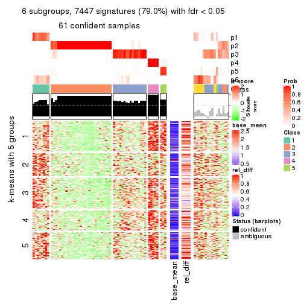</p>

</div>
</div>


Signature heatmaps where rows are not scaled:


<script>
$( function() {
	$( '#tabs-ATC-pam-get-signatures-no-scale' ).tabs();
} );
</script>
<div id='tabs-ATC-pam-get-signatures-no-scale'>
<ul>
<li><a href='#tab-ATC-pam-get-signatures-no-scale-1'>k = 2</a></li>
<li><a href='#tab-ATC-pam-get-signatures-no-scale-2'>k = 3</a></li>
<li><a href='#tab-ATC-pam-get-signatures-no-scale-3'>k = 4</a></li>
<li><a href='#tab-ATC-pam-get-signatures-no-scale-4'>k = 5</a></li>
<li><a href='#tab-ATC-pam-get-signatures-no-scale-5'>k = 6</a></li>
</ul>
<div id='tab-ATC-pam-get-signatures-no-scale-1'>
<pre><code class="r">get_signatures(res, k = 2, scale_rows = FALSE)
</code></pre>

<p></p>

</div>
<div id='tab-ATC-pam-get-signatures-no-scale-2'>
<pre><code class="r">get_signatures(res, k = 3, scale_rows = FALSE)
</code></pre>

<pre><code>#&gt; Error in mat[ceiling(1:nr/h_ratio), ceiling(1:nc/w_ratio), drop = FALSE]: subscript out of bounds
</code></pre>

<p></p>

</div>
<div id='tab-ATC-pam-get-signatures-no-scale-3'>
<pre><code class="r">get_signatures(res, k = 4, scale_rows = FALSE)
</code></pre>

<p></p>

</div>
<div id='tab-ATC-pam-get-signatures-no-scale-4'>
<pre><code class="r">get_signatures(res, k = 5, scale_rows = FALSE)
</code></pre>

<pre><code>#&gt; Error in mat[ceiling(1:nr/h_ratio), ceiling(1:nc/w_ratio), drop = FALSE]: subscript out of bounds
</code></pre>

<p></p>

</div>
<div id='tab-ATC-pam-get-signatures-no-scale-5'>
<pre><code class="r">get_signatures(res, k = 6, scale_rows = FALSE)
</code></pre>

<p></p>

</div>
</div>


Compare the overlap of signatures from different k:

```r
compare_signatures(res)
```


`get_signature()` returns a data frame invisibly. TO get the list of signatures, the function
call should be assigned to a variable explicitly. In following code, if `plot` argument is set
to `FALSE`, no heatmap is plotted while only the differential analysis is performed.

```r
# code only for demonstration
tb = get_signature(res, k = ..., plot = FALSE)
```

An example of the output of `tb` is:

```
#>   which_row         fdr    mean_1    mean_2 scaled_mean_1 scaled_mean_2 km
#> 1        38 0.042760348  8.373488  9.131774    -0.5533452     0.5164555  1
#> 2        40 0.018707592  7.106213  8.469186    -0.6173731     0.5762149  1
#> 3        55 0.019134737 10.221463 11.207825    -0.6159697     0.5749050  1
#> 4        59 0.006059896  5.921854  7.869574    -0.6899429     0.6439467  1
#> 5        60 0.018055526  8.928898 10.211722    -0.6204761     0.5791110  1
#> 6        98 0.009384629 15.714769 14.887706     0.6635654    -0.6193277  2
...
```

The columns in `tb` are:

1. `which_row`: row indices corresponding to the input matrix.
2. `fdr`: FDR for the differential test. 
3. `mean_x`: The mean value in group x.
4. `scaled_mean_x`: The mean value in group x after rows are scaled.
5. `km`: Row groups if k-means clustering is applied to rows.


UMAP plot which shows how samples are separated.


<script>
$( function() {
	$( '#tabs-ATC-pam-dimension-reduction' ).tabs();
} );
</script>
<div id='tabs-ATC-pam-dimension-reduction'>
<ul>
<li><a href='#tab-ATC-pam-dimension-reduction-1'>k = 2</a></li>
<li><a href='#tab-ATC-pam-dimension-reduction-2'>k = 3</a></li>
<li><a href='#tab-ATC-pam-dimension-reduction-3'>k = 4</a></li>
<li><a href='#tab-ATC-pam-dimension-reduction-4'>k = 5</a></li>
<li><a href='#tab-ATC-pam-dimension-reduction-5'>k = 6</a></li>
</ul>
<div id='tab-ATC-pam-dimension-reduction-1'>
<pre><code class="r">dimension_reduction(res, k = 2, method = &quot;UMAP&quot;)
</code></pre>

<p></p>

</div>
<div id='tab-ATC-pam-dimension-reduction-2'>
<pre><code class="r">dimension_reduction(res, k = 3, method = &quot;UMAP&quot;)
</code></pre>

<p></p>

</div>
<div id='tab-ATC-pam-dimension-reduction-3'>
<pre><code class="r">dimension_reduction(res, k = 4, method = &quot;UMAP&quot;)
</code></pre>

<p></p>

</div>
<div id='tab-ATC-pam-dimension-reduction-4'>
<pre><code class="r">dimension_reduction(res, k = 5, method = &quot;UMAP&quot;)
</code></pre>

<p></p>

</div>
<div id='tab-ATC-pam-dimension-reduction-5'>
<pre><code class="r">dimension_reduction(res, k = 6, method = &quot;UMAP&quot;)
</code></pre>

<p></p>

</div>
</div>


Following heatmap shows how subgroups are split when increasing `k`:

```r
collect_classes(res)
```


If matrix rows can be associated to genes, consider to use `GO_Enrichment(res,
...)` to perform function enrichment for the signature genes.


 

---------------------------------------------------


### ATC:mclust


The object with results only for a single top-value method and a single partition method 
can be extracted as:

```r
res = res_list["ATC", "mclust"]
# you can also extract it by
# res = res_list["ATC:mclust"]
```

A summary of `res` and all the functions that can be applied to it:

```r
res
```

```
#> A 'ConsensusPartition' object with k = 2, 3, 4, 5, 6.
#>   On a matrix with 9427 rows and 77 columns.
#>   Top rows (943, 1886, 2828, 3771, 4714) are extracted by 'ATC' method.
#>   Subgroups are detected by 'mclust' method.
#>   Performed in total 1250 partitions by row resampling.
#>   Best k for subgroups seems to be 2.
#> 
#> Following methods can be applied to this 'ConsensusPartition' object:
#>  [1] "cola_report"             "collect_classes"         "collect_plots"          
#>  [4] "collect_stats"           "colnames"                "compare_signatures"     
#>  [7] "consensus_heatmap"       "dimension_reduction"     "functional_enrichment"  
#> [10] "get_anno_col"            "get_anno"                "get_classes"            
#> [13] "get_consensus"           "get_matrix"              "get_membership"         
#> [16] "get_param"               "get_signatures"          "get_stats"              
#> [19] "is_best_k"               "is_stable_k"             "membership_heatmap"     
#> [22] "ncol"                    "nrow"                    "plot_ecdf"              
#> [25] "rownames"                "select_partition_number" "show"                   
#> [28] "suggest_best_k"          "test_to_known_factors"
```

`collect_plots()` function collects all the plots made from `res` for all `k` (number of partitions)
into one single page to provide an easy and fast comparison between different `k`.

```r
collect_plots(res)
```


The plots are:

- The first row: a plot of the ECDF (Empirical cumulative distribution
  function) curves of the consensus matrix for each `k` and the heatmap of
  predicted classes for each `k`.
- The second row: heatmaps of the consensus matrix for each `k`.
- The third row: heatmaps of the membership matrix for each `k`.
- The fouth row: heatmaps of the signatures for each `k`.

All the plots in panels can be made by individual functions and they are
plotted later in this section.

`select_partition_number()` produces several plots showing different
statistics for choosing "optimized" `k`. There are following statistics:

- ECDF curves of the consensus matrix for each `k`;
- 1-PAC. [The PAC
  score](https://en.wikipedia.org/wiki/Consensus_clustering#Over-interpretation_potential_of_consensus_clustering)
  measures the proportion of the ambiguous subgrouping.
- Mean silhouette score.
- Concordance. The mean probability of fiting the consensus class ids in all
  partitions.
- Area increased. Denote $A_k$ as the area under the ECDF curve for current
  `k`, the area increased is defined as $A_k - A_{k-1}$.
- Rand index. The percent of pairs of samples that are both in a same cluster
  or both are not in a same cluster in the partition of k and k-1.
- Jaccard index. The ratio of pairs of samples are both in a same cluster in
  the partition of k and k-1 and the pairs of samples are both in a same
  cluster in the partition k or k-1.

The detailed explanations of these statistics can be found in [the cola
vignette](http://bioconductor.org/packages/devel/bioc/vignettes/cola/inst/doc/cola.html#toc_13).

Generally speaking, lower PAC score, higher mean silhouette score or higher
concordance corresponds to better partition. Rand index and Jaccard index
measure how similar the current partition is compared to partition with `k-1`.
If they are too similar, we won't accept `k` is better than `k-1`.

```r
select_partition_number(res)
```


The numeric values for all these statistics can be obtained by `get_stats()`.

```r
get_stats(res)
```

```
#>   k 1-PAC mean_silhouette concordance area_increased  Rand Jaccard
#> 2 2 0.653           0.933       0.952         0.4659 0.504   0.504
#> 3 3 0.752           0.853       0.931         0.2010 0.907   0.815
#> 4 4 0.639           0.603       0.754         0.2342 0.798   0.546
#> 5 5 0.702           0.646       0.826         0.1256 0.827   0.480
#> 6 6 0.736           0.712       0.830         0.0465 0.873   0.518
```

`suggest_best_k()` suggests the best $k$ based on these statistics. The rules are as follows:

- All $k$ with Jaccard index larger than 0.95 are removed because the increase of
  the partition number does not provides enough extra information. If all $k$ are removed,
  the best $k$ is assigned by `NA`.
- For $k$ with 1-PAC larger than 0.9, the maximal $k$ is taken as the "best k". Other $k$ is called "optional k".
- If it does not fit the second rule. The $k$ with the highest vote of highest
  1-PAC, mean silhouette and concordance is taken as the "best k".

```r
suggest_best_k(res)
```

```
#> [1] 2
```


Following shows the table of the partitions (You need to click the **show/hide
code output** link to see it). The membership matrix (columns with name `p*`)
is inferred by
[`clue::cl_consensus()`](https://www.rdocumentation.org/link/cl_consensus?package=clue)
function with the `SE` method. Basically the value in the membership matrix
represents the probability to belong to a certain group. The finall class
label for an item is determined with the group with highest probability it
belongs to.

In `get_classes()` function, the entropy is calculated from the membership
matrix and the silhouette score is calculated from the consensus matrix.


<script>
$( function() {
	$( '#tabs-ATC-mclust-get-classes' ).tabs();
} );
</script>
<div id='tabs-ATC-mclust-get-classes'>
<ul>
<li><a href='#tab-ATC-mclust-get-classes-1'>k = 2</a></li>
<li><a href='#tab-ATC-mclust-get-classes-2'>k = 3</a></li>
<li><a href='#tab-ATC-mclust-get-classes-3'>k = 4</a></li>
<li><a href='#tab-ATC-mclust-get-classes-4'>k = 5</a></li>
<li><a href='#tab-ATC-mclust-get-classes-5'>k = 6</a></li>
</ul>

<div id='tab-ATC-mclust-get-classes-1'>
<p><a id='tab-ATC-mclust-get-classes-1-a' style='color:#0366d6' href='#'>show/hide code output</a></p>
<pre><code class="r">cbind(get_classes(res, k = 2), get_membership(res, k = 2))
</code></pre>

<pre><code>#&gt;           class entropy silhouette    p1    p2
#&gt; SRR944011     2  0.5737     0.9032 0.136 0.864
#&gt; SRR944012     1  0.0000     0.9975 1.000 0.000
#&gt; SRR944014     2  0.0000     0.8832 0.000 1.000
#&gt; SRR944013     1  0.0000     0.9975 1.000 0.000
#&gt; SRR944015     1  0.0000     0.9975 1.000 0.000
#&gt; SRR944016     1  0.0000     0.9975 1.000 0.000
#&gt; SRR944017     1  0.0000     0.9975 1.000 0.000
#&gt; SRR944018     1  0.0000     0.9975 1.000 0.000
#&gt; SRR944019     1  0.0000     0.9975 1.000 0.000
#&gt; SRR944020     1  0.0000     0.9975 1.000 0.000
#&gt; SRR944021     2  0.0000     0.8832 0.000 1.000
#&gt; SRR944022     1  0.0000     0.9975 1.000 0.000
#&gt; SRR944023     1  0.3274     0.9262 0.940 0.060
#&gt; SRR944024     1  0.0000     0.9975 1.000 0.000
#&gt; SRR944026     1  0.0000     0.9975 1.000 0.000
#&gt; SRR944025     1  0.0000     0.9975 1.000 0.000
#&gt; SRR944028     1  0.0000     0.9975 1.000 0.000
#&gt; SRR944029     1  0.0000     0.9975 1.000 0.000
#&gt; SRR944030     2  0.2043     0.8900 0.032 0.968
#&gt; SRR944031     2  0.5737     0.9032 0.136 0.864
#&gt; SRR944032     1  0.0000     0.9975 1.000 0.000
#&gt; SRR944033     2  0.0000     0.8832 0.000 1.000
#&gt; SRR944034     2  0.5737     0.9032 0.136 0.864
#&gt; SRR944036     1  0.2043     0.9611 0.968 0.032
#&gt; SRR944035     2  0.0672     0.8852 0.008 0.992
#&gt; SRR944038     2  0.5737     0.9032 0.136 0.864
#&gt; SRR944037     1  0.0000     0.9975 1.000 0.000
#&gt; SRR944039     1  0.0000     0.9975 1.000 0.000
#&gt; SRR944040     2  0.5737     0.9032 0.136 0.864
#&gt; SRR944041     1  0.0000     0.9975 1.000 0.000
#&gt; SRR944042     2  0.5737     0.9032 0.136 0.864
#&gt; SRR944043     1  0.0000     0.9975 1.000 0.000
#&gt; SRR944044     1  0.0000     0.9975 1.000 0.000
#&gt; SRR944046     2  0.5737     0.9032 0.136 0.864
#&gt; SRR944045     2  0.5408     0.9024 0.124 0.876
#&gt; SRR944047     2  0.0000     0.8832 0.000 1.000
#&gt; SRR944048     1  0.0000     0.9975 1.000 0.000
#&gt; SRR944049     2  0.9998     0.0247 0.492 0.508
#&gt; SRR944050     1  0.0000     0.9975 1.000 0.000
#&gt; SRR944051     1  0.0000     0.9975 1.000 0.000
#&gt; SRR944052     2  0.0376     0.8844 0.004 0.996
#&gt; SRR944053     1  0.0000     0.9975 1.000 0.000
#&gt; SRR944054     1  0.0000     0.9975 1.000 0.000
#&gt; SRR944055     2  0.5737     0.9032 0.136 0.864
#&gt; SRR944056     2  0.0000     0.8832 0.000 1.000
#&gt; SRR944057     1  0.0000     0.9975 1.000 0.000
#&gt; SRR944058     1  0.0000     0.9975 1.000 0.000
#&gt; SRR944059     2  0.5737     0.9032 0.136 0.864
#&gt; SRR944060     2  0.9087     0.6669 0.324 0.676
#&gt; SRR944061     2  0.0000     0.8832 0.000 1.000
#&gt; SRR944062     1  0.0000     0.9975 1.000 0.000
#&gt; SRR944063     1  0.0000     0.9975 1.000 0.000
#&gt; SRR944064     1  0.0000     0.9975 1.000 0.000
#&gt; SRR944065     1  0.0000     0.9975 1.000 0.000
#&gt; SRR944066     1  0.0000     0.9975 1.000 0.000
#&gt; SRR944067     1  0.0000     0.9975 1.000 0.000
#&gt; SRR944068     1  0.0000     0.9975 1.000 0.000
#&gt; SRR944069     2  0.0000     0.8832 0.000 1.000
#&gt; SRR944070     2  0.5737     0.9032 0.136 0.864
#&gt; SRR944071     2  0.5737     0.9032 0.136 0.864
#&gt; SRR944072     1  0.0000     0.9975 1.000 0.000
#&gt; SRR944073     2  0.5737     0.9032 0.136 0.864
#&gt; SRR944075     2  0.5946     0.8973 0.144 0.856
#&gt; SRR944074     1  0.0000     0.9975 1.000 0.000
#&gt; SRR944076     2  0.5737     0.9032 0.136 0.864
#&gt; SRR944077     2  0.0000     0.8832 0.000 1.000
#&gt; SRR944078     2  0.6623     0.8715 0.172 0.828
#&gt; SRR944079     2  0.0000     0.8832 0.000 1.000
#&gt; SRR944080     2  0.0000     0.8832 0.000 1.000
#&gt; SRR944081     1  0.0000     0.9975 1.000 0.000
#&gt; SRR944082     1  0.0000     0.9975 1.000 0.000
#&gt; SRR944083     1  0.0000     0.9975 1.000 0.000
#&gt; SRR944084     1  0.0000     0.9975 1.000 0.000
#&gt; SRR944085     2  0.9552     0.5653 0.376 0.624
#&gt; SRR944086     1  0.0000     0.9975 1.000 0.000
#&gt; SRR944088     1  0.0000     0.9975 1.000 0.000
#&gt; SRR944087     2  0.5737     0.9032 0.136 0.864
</code></pre>

<script>
$('#tab-ATC-mclust-get-classes-1-a').parent().next().next().hide();
$('#tab-ATC-mclust-get-classes-1-a').click(function(){
  $('#tab-ATC-mclust-get-classes-1-a').parent().next().next().toggle();
  return(false);
});
</script>
</div>

<div id='tab-ATC-mclust-get-classes-2'>
<p><a id='tab-ATC-mclust-get-classes-2-a' style='color:#0366d6' href='#'>show/hide code output</a></p>
<pre><code class="r">cbind(get_classes(res, k = 3), get_membership(res, k = 3))
</code></pre>

<pre><code>#&gt;           class entropy silhouette    p1    p2    p3
#&gt; SRR944011     3  0.0000      0.771 0.000 0.000 1.000
#&gt; SRR944012     1  0.0000      0.985 1.000 0.000 0.000
#&gt; SRR944014     2  0.1411      0.827 0.000 0.964 0.036
#&gt; SRR944013     1  0.0000      0.985 1.000 0.000 0.000
#&gt; SRR944015     1  0.0000      0.985 1.000 0.000 0.000
#&gt; SRR944016     1  0.0000      0.985 1.000 0.000 0.000
#&gt; SRR944017     1  0.4172      0.806 0.840 0.156 0.004
#&gt; SRR944018     1  0.0000      0.985 1.000 0.000 0.000
#&gt; SRR944019     1  0.0000      0.985 1.000 0.000 0.000
#&gt; SRR944020     1  0.0000      0.985 1.000 0.000 0.000
#&gt; SRR944021     2  0.3038      0.813 0.000 0.896 0.104
#&gt; SRR944022     1  0.0000      0.985 1.000 0.000 0.000
#&gt; SRR944023     1  0.2959      0.873 0.900 0.000 0.100
#&gt; SRR944024     1  0.0000      0.985 1.000 0.000 0.000
#&gt; SRR944026     1  0.0000      0.985 1.000 0.000 0.000
#&gt; SRR944025     1  0.2261      0.922 0.932 0.068 0.000
#&gt; SRR944028     1  0.0892      0.968 0.980 0.020 0.000
#&gt; SRR944029     1  0.0000      0.985 1.000 0.000 0.000
#&gt; SRR944030     2  0.4683      0.783 0.024 0.836 0.140
#&gt; SRR944031     3  0.0000      0.771 0.000 0.000 1.000
#&gt; SRR944032     1  0.0000      0.985 1.000 0.000 0.000
#&gt; SRR944033     2  0.1860      0.828 0.000 0.948 0.052
#&gt; SRR944034     2  0.9203      0.291 0.340 0.496 0.164
#&gt; SRR944036     1  0.3551      0.828 0.868 0.000 0.132
#&gt; SRR944035     2  0.2774      0.799 0.008 0.920 0.072
#&gt; SRR944038     3  0.6154      0.451 0.408 0.000 0.592
#&gt; SRR944037     1  0.0000      0.985 1.000 0.000 0.000
#&gt; SRR944039     1  0.0000      0.985 1.000 0.000 0.000
#&gt; SRR944040     3  0.9615      0.239 0.324 0.220 0.456
#&gt; SRR944041     1  0.0000      0.985 1.000 0.000 0.000
#&gt; SRR944042     3  0.1529      0.757 0.040 0.000 0.960
#&gt; SRR944043     1  0.0000      0.985 1.000 0.000 0.000
#&gt; SRR944044     1  0.0000      0.985 1.000 0.000 0.000
#&gt; SRR944046     3  0.0000      0.771 0.000 0.000 1.000
#&gt; SRR944045     2  0.8787      0.463 0.228 0.584 0.188
#&gt; SRR944047     2  0.3686      0.790 0.000 0.860 0.140
#&gt; SRR944048     1  0.0000      0.985 1.000 0.000 0.000
#&gt; SRR944049     2  0.5220      0.601 0.208 0.780 0.012
#&gt; SRR944050     1  0.0000      0.985 1.000 0.000 0.000
#&gt; SRR944051     1  0.0000      0.985 1.000 0.000 0.000
#&gt; SRR944052     2  0.4733      0.747 0.004 0.800 0.196
#&gt; SRR944053     1  0.0000      0.985 1.000 0.000 0.000
#&gt; SRR944054     1  0.0000      0.985 1.000 0.000 0.000
#&gt; SRR944055     3  0.0237      0.769 0.000 0.004 0.996
#&gt; SRR944056     2  0.0237      0.814 0.000 0.996 0.004
#&gt; SRR944057     1  0.0000      0.985 1.000 0.000 0.000
#&gt; SRR944058     1  0.0000      0.985 1.000 0.000 0.000
#&gt; SRR944059     3  0.1031      0.755 0.000 0.024 0.976
#&gt; SRR944060     3  0.6225      0.402 0.432 0.000 0.568
#&gt; SRR944061     2  0.2448      0.825 0.000 0.924 0.076
#&gt; SRR944062     1  0.0000      0.985 1.000 0.000 0.000
#&gt; SRR944063     1  0.0000      0.985 1.000 0.000 0.000
#&gt; SRR944064     1  0.0000      0.985 1.000 0.000 0.000
#&gt; SRR944065     1  0.0000      0.985 1.000 0.000 0.000
#&gt; SRR944066     1  0.0000      0.985 1.000 0.000 0.000
#&gt; SRR944067     1  0.2774      0.910 0.920 0.072 0.008
#&gt; SRR944068     1  0.0000      0.985 1.000 0.000 0.000
#&gt; SRR944069     2  0.0892      0.816 0.000 0.980 0.020
#&gt; SRR944070     3  0.6154      0.451 0.408 0.000 0.592
#&gt; SRR944071     3  0.0000      0.771 0.000 0.000 1.000
#&gt; SRR944072     1  0.0000      0.985 1.000 0.000 0.000
#&gt; SRR944073     2  0.8505      0.478 0.256 0.600 0.144
#&gt; SRR944075     3  0.0000      0.771 0.000 0.000 1.000
#&gt; SRR944074     1  0.0000      0.985 1.000 0.000 0.000
#&gt; SRR944076     3  0.0000      0.771 0.000 0.000 1.000
#&gt; SRR944077     2  0.1753      0.828 0.000 0.952 0.048
#&gt; SRR944078     3  0.4353      0.681 0.156 0.008 0.836
#&gt; SRR944079     2  0.1860      0.829 0.000 0.948 0.052
#&gt; SRR944080     2  0.0592      0.817 0.000 0.988 0.012
#&gt; SRR944081     1  0.0000      0.985 1.000 0.000 0.000
#&gt; SRR944082     1  0.0000      0.985 1.000 0.000 0.000
#&gt; SRR944083     1  0.0000      0.985 1.000 0.000 0.000
#&gt; SRR944084     1  0.0000      0.985 1.000 0.000 0.000
#&gt; SRR944085     3  0.4782      0.665 0.164 0.016 0.820
#&gt; SRR944086     1  0.0000      0.985 1.000 0.000 0.000
#&gt; SRR944088     1  0.0000      0.985 1.000 0.000 0.000
#&gt; SRR944087     3  0.0000      0.771 0.000 0.000 1.000
</code></pre>

<script>
$('#tab-ATC-mclust-get-classes-2-a').parent().next().next().hide();
$('#tab-ATC-mclust-get-classes-2-a').click(function(){
  $('#tab-ATC-mclust-get-classes-2-a').parent().next().next().toggle();
  return(false);
});
</script>
</div>

<div id='tab-ATC-mclust-get-classes-3'>
<p><a id='tab-ATC-mclust-get-classes-3-a' style='color:#0366d6' href='#'>show/hide code output</a></p>
<pre><code class="r">cbind(get_classes(res, k = 4), get_membership(res, k = 4))
</code></pre>

<pre><code>#&gt;           class entropy silhouette    p1    p2    p3    p4
#&gt; SRR944011     3  0.0000     0.9317 0.000 0.000 1.000 0.000
#&gt; SRR944012     1  0.4999     0.5505 0.508 0.000 0.000 0.492
#&gt; SRR944014     2  0.0469     0.9112 0.000 0.988 0.012 0.000
#&gt; SRR944013     4  0.0000     0.6940 0.000 0.000 0.000 1.000
#&gt; SRR944015     1  0.4999     0.5505 0.508 0.000 0.000 0.492
#&gt; SRR944016     1  0.0000     0.4750 1.000 0.000 0.000 0.000
#&gt; SRR944017     4  0.1118     0.6642 0.000 0.036 0.000 0.964
#&gt; SRR944018     1  0.4998     0.5513 0.512 0.000 0.000 0.488
#&gt; SRR944019     1  0.4998     0.5513 0.512 0.000 0.000 0.488
#&gt; SRR944020     1  0.4999     0.5505 0.508 0.000 0.000 0.492
#&gt; SRR944021     2  0.0336     0.9124 0.000 0.992 0.008 0.000
#&gt; SRR944022     1  0.4999     0.5505 0.508 0.000 0.000 0.492
#&gt; SRR944023     1  0.7170     0.4962 0.548 0.000 0.184 0.268
#&gt; SRR944024     1  0.0000     0.4750 1.000 0.000 0.000 0.000
#&gt; SRR944026     4  0.0000     0.6940 0.000 0.000 0.000 1.000
#&gt; SRR944025     4  0.0376     0.6911 0.004 0.004 0.000 0.992
#&gt; SRR944028     4  0.0188     0.6932 0.004 0.000 0.000 0.996
#&gt; SRR944029     4  0.4994    -0.5348 0.480 0.000 0.000 0.520
#&gt; SRR944030     2  0.2473     0.8737 0.000 0.908 0.012 0.080
#&gt; SRR944031     3  0.0000     0.9317 0.000 0.000 1.000 0.000
#&gt; SRR944032     4  0.4564    -0.0717 0.328 0.000 0.000 0.672
#&gt; SRR944033     2  0.0188     0.9119 0.000 0.996 0.004 0.000
#&gt; SRR944034     4  0.5396    -0.3767 0.000 0.464 0.012 0.524
#&gt; SRR944036     1  0.7576     0.4084 0.484 0.000 0.260 0.256
#&gt; SRR944035     2  0.2480     0.8654 0.000 0.904 0.008 0.088
#&gt; SRR944038     1  0.7643     0.4443 0.468 0.000 0.276 0.256
#&gt; SRR944037     1  0.4999     0.5505 0.508 0.000 0.000 0.492
#&gt; SRR944039     1  0.4996     0.5528 0.516 0.000 0.000 0.484
#&gt; SRR944040     3  0.9146     0.0569 0.280 0.300 0.352 0.068
#&gt; SRR944041     1  0.4999     0.5505 0.508 0.000 0.000 0.492
#&gt; SRR944042     3  0.2928     0.8011 0.108 0.000 0.880 0.012
#&gt; SRR944043     1  0.4998     0.5513 0.512 0.000 0.000 0.488
#&gt; SRR944044     4  0.0000     0.6940 0.000 0.000 0.000 1.000
#&gt; SRR944046     3  0.0000     0.9317 0.000 0.000 1.000 0.000
#&gt; SRR944045     2  0.5909     0.7168 0.088 0.756 0.096 0.060
#&gt; SRR944047     2  0.1059     0.9083 0.000 0.972 0.012 0.016
#&gt; SRR944048     1  0.0000     0.4750 1.000 0.000 0.000 0.000
#&gt; SRR944049     2  0.4500     0.5729 0.000 0.684 0.000 0.316
#&gt; SRR944050     1  0.0000     0.4750 1.000 0.000 0.000 0.000
#&gt; SRR944051     4  0.1792     0.6289 0.068 0.000 0.000 0.932
#&gt; SRR944052     2  0.1004     0.9066 0.000 0.972 0.024 0.004
#&gt; SRR944053     1  0.4999     0.5505 0.508 0.000 0.000 0.492
#&gt; SRR944054     4  0.0188     0.6921 0.004 0.000 0.000 0.996
#&gt; SRR944055     3  0.0000     0.9317 0.000 0.000 1.000 0.000
#&gt; SRR944056     2  0.0000     0.9112 0.000 1.000 0.000 0.000
#&gt; SRR944057     1  0.0000     0.4750 1.000 0.000 0.000 0.000
#&gt; SRR944058     1  0.4522     0.5662 0.680 0.000 0.000 0.320
#&gt; SRR944059     3  0.0188     0.9287 0.000 0.004 0.996 0.000
#&gt; SRR944060     1  0.7643     0.4443 0.468 0.000 0.276 0.256
#&gt; SRR944061     2  0.0469     0.9119 0.000 0.988 0.012 0.000
#&gt; SRR944062     1  0.1637     0.4950 0.940 0.000 0.000 0.060
#&gt; SRR944063     1  0.4999     0.5505 0.508 0.000 0.000 0.492
#&gt; SRR944064     1  0.4843     0.5409 0.604 0.000 0.000 0.396
#&gt; SRR944065     1  0.4999     0.5505 0.508 0.000 0.000 0.492
#&gt; SRR944066     1  0.0000     0.4750 1.000 0.000 0.000 0.000
#&gt; SRR944067     4  0.0188     0.6932 0.004 0.000 0.000 0.996
#&gt; SRR944068     1  0.4999     0.5505 0.508 0.000 0.000 0.492
#&gt; SRR944069     2  0.0336     0.9123 0.000 0.992 0.008 0.000
#&gt; SRR944070     1  0.7643     0.4443 0.468 0.000 0.276 0.256
#&gt; SRR944071     3  0.0000     0.9317 0.000 0.000 1.000 0.000
#&gt; SRR944072     1  0.4522     0.5662 0.680 0.000 0.000 0.320
#&gt; SRR944073     2  0.5383     0.4545 0.000 0.536 0.012 0.452
#&gt; SRR944075     3  0.0000     0.9317 0.000 0.000 1.000 0.000
#&gt; SRR944074     4  0.0000     0.6940 0.000 0.000 0.000 1.000
#&gt; SRR944076     3  0.0000     0.9317 0.000 0.000 1.000 0.000
#&gt; SRR944077     2  0.0188     0.9125 0.000 0.996 0.004 0.000
#&gt; SRR944078     3  0.0657     0.9199 0.012 0.000 0.984 0.004
#&gt; SRR944079     2  0.0188     0.9119 0.000 0.996 0.004 0.000
#&gt; SRR944080     2  0.0188     0.9125 0.000 0.996 0.004 0.000
#&gt; SRR944081     4  0.4989    -0.5193 0.472 0.000 0.000 0.528
#&gt; SRR944082     1  0.4331     0.5660 0.712 0.000 0.000 0.288
#&gt; SRR944083     1  0.0000     0.4750 1.000 0.000 0.000 0.000
#&gt; SRR944084     1  0.4999     0.5505 0.508 0.000 0.000 0.492
#&gt; SRR944085     3  0.0000     0.9317 0.000 0.000 1.000 0.000
#&gt; SRR944086     4  0.5000    -0.5683 0.496 0.000 0.000 0.504
#&gt; SRR944088     4  0.2704     0.5403 0.124 0.000 0.000 0.876
#&gt; SRR944087     3  0.0000     0.9317 0.000 0.000 1.000 0.000
</code></pre>

<script>
$('#tab-ATC-mclust-get-classes-3-a').parent().next().next().hide();
$('#tab-ATC-mclust-get-classes-3-a').click(function(){
  $('#tab-ATC-mclust-get-classes-3-a').parent().next().next().toggle();
  return(false);
});
</script>
</div>

<div id='tab-ATC-mclust-get-classes-4'>
<p><a id='tab-ATC-mclust-get-classes-4-a' style='color:#0366d6' href='#'>show/hide code output</a></p>
<pre><code class="r">cbind(get_classes(res, k = 5), get_membership(res, k = 5))
</code></pre>

<pre><code>#&gt;           class entropy silhouette    p1    p2    p3    p4    p5
#&gt; SRR944011     3  0.0000     0.8391 0.000 0.000 1.000 0.000 0.000
#&gt; SRR944012     4  0.0579     0.6539 0.008 0.000 0.000 0.984 0.008
#&gt; SRR944014     2  0.0000     0.8884 0.000 1.000 0.000 0.000 0.000
#&gt; SRR944013     5  0.3216     0.7125 0.044 0.000 0.000 0.108 0.848
#&gt; SRR944015     4  0.1106     0.6517 0.012 0.000 0.000 0.964 0.024
#&gt; SRR944016     1  0.0000     0.9422 1.000 0.000 0.000 0.000 0.000
#&gt; SRR944017     5  0.2152     0.7104 0.044 0.004 0.000 0.032 0.920
#&gt; SRR944018     4  0.6176     0.4382 0.172 0.000 0.000 0.540 0.288
#&gt; SRR944019     4  0.5195     0.5721 0.168 0.000 0.000 0.688 0.144
#&gt; SRR944020     4  0.0000     0.6509 0.000 0.000 0.000 1.000 0.000
#&gt; SRR944021     2  0.0000     0.8884 0.000 1.000 0.000 0.000 0.000
#&gt; SRR944022     4  0.0162     0.6518 0.000 0.000 0.000 0.996 0.004
#&gt; SRR944023     4  0.8372     0.2211 0.288 0.000 0.212 0.340 0.160
#&gt; SRR944024     1  0.0000     0.9422 1.000 0.000 0.000 0.000 0.000
#&gt; SRR944026     5  0.3752     0.5858 0.000 0.000 0.000 0.292 0.708
#&gt; SRR944025     5  0.2074     0.7127 0.044 0.000 0.000 0.036 0.920
#&gt; SRR944028     5  0.2230     0.7143 0.044 0.000 0.000 0.044 0.912
#&gt; SRR944029     4  0.4104     0.5618 0.032 0.000 0.000 0.748 0.220
#&gt; SRR944030     2  0.1121     0.8697 0.000 0.956 0.000 0.000 0.044
#&gt; SRR944031     3  0.0000     0.8391 0.000 0.000 1.000 0.000 0.000
#&gt; SRR944032     5  0.4634     0.6094 0.120 0.000 0.000 0.136 0.744
#&gt; SRR944033     2  0.0000     0.8884 0.000 1.000 0.000 0.000 0.000
#&gt; SRR944034     2  0.3928     0.6241 0.000 0.700 0.000 0.004 0.296
#&gt; SRR944036     4  0.8434     0.1740 0.284 0.000 0.252 0.308 0.156
#&gt; SRR944035     2  0.1732     0.8509 0.000 0.920 0.000 0.000 0.080
#&gt; SRR944038     3  0.7232    -0.1231 0.044 0.000 0.400 0.396 0.160
#&gt; SRR944037     4  0.0000     0.6509 0.000 0.000 0.000 1.000 0.000
#&gt; SRR944039     4  0.6243     0.4609 0.216 0.000 0.000 0.544 0.240
#&gt; SRR944040     2  0.6511     0.2931 0.000 0.500 0.376 0.036 0.088
#&gt; SRR944041     4  0.1082     0.6549 0.028 0.000 0.000 0.964 0.008
#&gt; SRR944042     3  0.1043     0.8121 0.000 0.000 0.960 0.040 0.000
#&gt; SRR944043     4  0.6121     0.4732 0.164 0.000 0.004 0.576 0.256
#&gt; SRR944044     5  0.3496     0.6771 0.012 0.000 0.000 0.200 0.788
#&gt; SRR944046     3  0.0000     0.8391 0.000 0.000 1.000 0.000 0.000
#&gt; SRR944045     2  0.4580     0.7301 0.000 0.776 0.136 0.028 0.060
#&gt; SRR944047     2  0.0162     0.8875 0.000 0.996 0.000 0.000 0.004
#&gt; SRR944048     1  0.0000     0.9422 1.000 0.000 0.000 0.000 0.000
#&gt; SRR944049     2  0.5227     0.2781 0.032 0.556 0.000 0.008 0.404
#&gt; SRR944050     1  0.0000     0.9422 1.000 0.000 0.000 0.000 0.000
#&gt; SRR944051     5  0.4979     0.1999 0.028 0.000 0.000 0.480 0.492
#&gt; SRR944052     2  0.0290     0.8866 0.000 0.992 0.000 0.000 0.008
#&gt; SRR944053     4  0.0290     0.6517 0.000 0.000 0.000 0.992 0.008
#&gt; SRR944054     5  0.3983     0.5156 0.000 0.000 0.000 0.340 0.660
#&gt; SRR944055     3  0.0000     0.8391 0.000 0.000 1.000 0.000 0.000
#&gt; SRR944056     2  0.0000     0.8884 0.000 1.000 0.000 0.000 0.000
#&gt; SRR944057     1  0.0000     0.9422 1.000 0.000 0.000 0.000 0.000
#&gt; SRR944058     4  0.5854     0.3598 0.436 0.000 0.000 0.468 0.096
#&gt; SRR944059     3  0.0510     0.8274 0.000 0.016 0.984 0.000 0.000
#&gt; SRR944060     3  0.7232    -0.1231 0.044 0.000 0.400 0.396 0.160
#&gt; SRR944061     2  0.0000     0.8884 0.000 1.000 0.000 0.000 0.000
#&gt; SRR944062     1  0.4065     0.4426 0.720 0.000 0.000 0.264 0.016
#&gt; SRR944063     4  0.0162     0.6518 0.000 0.000 0.000 0.996 0.004
#&gt; SRR944064     5  0.6963     0.1314 0.328 0.000 0.008 0.260 0.404
#&gt; SRR944065     4  0.0290     0.6517 0.000 0.000 0.000 0.992 0.008
#&gt; SRR944066     1  0.0000     0.9422 1.000 0.000 0.000 0.000 0.000
#&gt; SRR944067     5  0.2074     0.7127 0.044 0.000 0.000 0.036 0.920
#&gt; SRR944068     4  0.0000     0.6509 0.000 0.000 0.000 1.000 0.000
#&gt; SRR944069     2  0.0000     0.8884 0.000 1.000 0.000 0.000 0.000
#&gt; SRR944070     3  0.7232    -0.1231 0.044 0.000 0.400 0.396 0.160
#&gt; SRR944071     3  0.0000     0.8391 0.000 0.000 1.000 0.000 0.000
#&gt; SRR944072     4  0.5854     0.3598 0.436 0.000 0.000 0.468 0.096
#&gt; SRR944073     2  0.3612     0.6683 0.000 0.732 0.000 0.000 0.268
#&gt; SRR944075     3  0.0000     0.8391 0.000 0.000 1.000 0.000 0.000
#&gt; SRR944074     5  0.3636     0.6069 0.000 0.000 0.000 0.272 0.728
#&gt; SRR944076     3  0.0000     0.8391 0.000 0.000 1.000 0.000 0.000
#&gt; SRR944077     2  0.0000     0.8884 0.000 1.000 0.000 0.000 0.000
#&gt; SRR944078     3  0.0162     0.8371 0.000 0.000 0.996 0.000 0.004
#&gt; SRR944079     2  0.0290     0.8850 0.000 0.992 0.008 0.000 0.000
#&gt; SRR944080     2  0.0000     0.8884 0.000 1.000 0.000 0.000 0.000
#&gt; SRR944081     4  0.4615     0.5142 0.048 0.000 0.000 0.700 0.252
#&gt; SRR944082     4  0.6428     0.3602 0.384 0.000 0.000 0.440 0.176
#&gt; SRR944083     1  0.0000     0.9422 1.000 0.000 0.000 0.000 0.000
#&gt; SRR944084     4  0.4681     0.5648 0.084 0.000 0.000 0.728 0.188
#&gt; SRR944085     3  0.0798     0.8259 0.008 0.000 0.976 0.000 0.016
#&gt; SRR944086     4  0.5968     0.4508 0.156 0.000 0.000 0.576 0.268
#&gt; SRR944088     4  0.4268     0.0695 0.000 0.000 0.000 0.556 0.444
#&gt; SRR944087     3  0.0000     0.8391 0.000 0.000 1.000 0.000 0.000
</code></pre>

<script>
$('#tab-ATC-mclust-get-classes-4-a').parent().next().next().hide();
$('#tab-ATC-mclust-get-classes-4-a').click(function(){
  $('#tab-ATC-mclust-get-classes-4-a').parent().next().next().toggle();
  return(false);
});
</script>
</div>

<div id='tab-ATC-mclust-get-classes-5'>
<p><a id='tab-ATC-mclust-get-classes-5-a' style='color:#0366d6' href='#'>show/hide code output</a></p>
<pre><code class="r">cbind(get_classes(res, k = 6), get_membership(res, k = 6))
</code></pre>

<pre><code>#&gt;           class entropy silhouette    p1    p2    p3    p4    p5    p6
#&gt; SRR944011     3  0.0146      0.970 0.000 0.004 0.996 0.000 0.000 0.000
#&gt; SRR944012     4  0.1501      0.814 0.000 0.000 0.000 0.924 0.000 0.076
#&gt; SRR944014     2  0.0000      0.896 0.000 1.000 0.000 0.000 0.000 0.000
#&gt; SRR944013     5  0.1251      0.696 0.012 0.000 0.000 0.024 0.956 0.008
#&gt; SRR944015     4  0.3473      0.739 0.000 0.000 0.000 0.808 0.096 0.096
#&gt; SRR944016     1  0.0000      0.685 1.000 0.000 0.000 0.000 0.000 0.000
#&gt; SRR944017     5  0.2126      0.622 0.020 0.004 0.000 0.000 0.904 0.072
#&gt; SRR944018     5  0.5930      0.563 0.136 0.000 0.000 0.260 0.568 0.036
#&gt; SRR944019     4  0.6674     -0.301 0.112 0.000 0.000 0.428 0.368 0.092
#&gt; SRR944020     4  0.1714      0.835 0.000 0.000 0.000 0.908 0.000 0.092
#&gt; SRR944021     2  0.0000      0.896 0.000 1.000 0.000 0.000 0.000 0.000
#&gt; SRR944022     4  0.0146      0.864 0.000 0.000 0.000 0.996 0.000 0.004
#&gt; SRR944023     1  0.7340     -0.135 0.380 0.000 0.164 0.048 0.044 0.364
#&gt; SRR944024     1  0.0000      0.685 1.000 0.000 0.000 0.000 0.000 0.000
#&gt; SRR944026     5  0.3748      0.716 0.000 0.000 0.004 0.148 0.784 0.064
#&gt; SRR944025     5  0.2201      0.617 0.028 0.000 0.000 0.000 0.896 0.076
#&gt; SRR944028     5  0.0993      0.672 0.024 0.000 0.000 0.000 0.964 0.012
#&gt; SRR944029     5  0.5638      0.463 0.000 0.000 0.004 0.368 0.492 0.136
#&gt; SRR944030     2  0.1007      0.876 0.000 0.956 0.000 0.000 0.044 0.000
#&gt; SRR944031     3  0.0146      0.970 0.000 0.004 0.996 0.000 0.000 0.000
#&gt; SRR944032     5  0.2459      0.700 0.052 0.000 0.000 0.032 0.896 0.020
#&gt; SRR944033     2  0.0000      0.896 0.000 1.000 0.000 0.000 0.000 0.000
#&gt; SRR944034     2  0.3023      0.740 0.004 0.784 0.000 0.000 0.212 0.000
#&gt; SRR944036     1  0.7120     -0.128 0.384 0.000 0.184 0.028 0.040 0.364
#&gt; SRR944035     2  0.1753      0.852 0.000 0.912 0.004 0.000 0.084 0.000
#&gt; SRR944038     6  0.4710      0.987 0.000 0.004 0.136 0.084 0.036 0.740
#&gt; SRR944037     4  0.1714      0.835 0.000 0.000 0.000 0.908 0.000 0.092
#&gt; SRR944039     5  0.6871      0.393 0.176 0.000 0.000 0.304 0.440 0.080
#&gt; SRR944040     2  0.4747      0.385 0.000 0.568 0.376 0.000 0.056 0.000
#&gt; SRR944041     4  0.0622      0.863 0.000 0.000 0.000 0.980 0.012 0.008
#&gt; SRR944042     3  0.2308      0.851 0.000 0.004 0.880 0.008 0.000 0.108
#&gt; SRR944043     5  0.6082      0.497 0.044 0.000 0.000 0.328 0.516 0.112
#&gt; SRR944044     5  0.2250      0.721 0.000 0.000 0.000 0.092 0.888 0.020
#&gt; SRR944046     3  0.1010      0.945 0.000 0.004 0.960 0.000 0.000 0.036
#&gt; SRR944045     2  0.3737      0.700 0.000 0.780 0.168 0.008 0.044 0.000
#&gt; SRR944047     2  0.0000      0.896 0.000 1.000 0.000 0.000 0.000 0.000
#&gt; SRR944048     1  0.0000      0.685 1.000 0.000 0.000 0.000 0.000 0.000
#&gt; SRR944049     2  0.4929      0.430 0.004 0.600 0.000 0.000 0.324 0.072
#&gt; SRR944050     1  0.0000      0.685 1.000 0.000 0.000 0.000 0.000 0.000
#&gt; SRR944051     5  0.4219      0.639 0.000 0.000 0.000 0.304 0.660 0.036
#&gt; SRR944052     2  0.0405      0.893 0.000 0.988 0.004 0.000 0.008 0.000
#&gt; SRR944053     4  0.0865      0.847 0.000 0.000 0.000 0.964 0.000 0.036
#&gt; SRR944054     5  0.3946      0.713 0.000 0.000 0.004 0.152 0.768 0.076
#&gt; SRR944055     3  0.0146      0.970 0.000 0.004 0.996 0.000 0.000 0.000
#&gt; SRR944056     2  0.0000      0.896 0.000 1.000 0.000 0.000 0.000 0.000
#&gt; SRR944057     1  0.0000      0.685 1.000 0.000 0.000 0.000 0.000 0.000
#&gt; SRR944058     1  0.7048      0.204 0.420 0.000 0.000 0.312 0.156 0.112
#&gt; SRR944059     3  0.0405      0.967 0.000 0.008 0.988 0.000 0.000 0.004
#&gt; SRR944060     6  0.4862      0.974 0.004 0.000 0.140 0.088 0.040 0.728
#&gt; SRR944061     2  0.0000      0.896 0.000 1.000 0.000 0.000 0.000 0.000
#&gt; SRR944062     1  0.3424      0.587 0.812 0.000 0.000 0.092 0.000 0.096
#&gt; SRR944063     4  0.0000      0.864 0.000 0.000 0.000 1.000 0.000 0.000
#&gt; SRR944064     1  0.6017      0.395 0.572 0.000 0.000 0.036 0.196 0.196
#&gt; SRR944065     4  0.0146      0.865 0.000 0.000 0.000 0.996 0.004 0.000
#&gt; SRR944066     1  0.0000      0.685 1.000 0.000 0.000 0.000 0.000 0.000
#&gt; SRR944067     5  0.2066      0.624 0.024 0.000 0.000 0.000 0.904 0.072
#&gt; SRR944068     4  0.1327      0.849 0.000 0.000 0.000 0.936 0.000 0.064
#&gt; SRR944069     2  0.0000      0.896 0.000 1.000 0.000 0.000 0.000 0.000
#&gt; SRR944070     6  0.4710      0.987 0.000 0.004 0.136 0.084 0.036 0.740
#&gt; SRR944071     3  0.0291      0.969 0.000 0.004 0.992 0.000 0.000 0.004
#&gt; SRR944072     1  0.7048      0.204 0.420 0.000 0.000 0.312 0.156 0.112
#&gt; SRR944073     2  0.2562      0.783 0.000 0.828 0.000 0.000 0.172 0.000
#&gt; SRR944075     3  0.0146      0.970 0.000 0.004 0.996 0.000 0.000 0.000
#&gt; SRR944074     5  0.3710      0.717 0.000 0.000 0.004 0.144 0.788 0.064
#&gt; SRR944076     3  0.0146      0.970 0.000 0.004 0.996 0.000 0.000 0.000
#&gt; SRR944077     2  0.0000      0.896 0.000 1.000 0.000 0.000 0.000 0.000
#&gt; SRR944078     3  0.0405      0.964 0.000 0.004 0.988 0.000 0.008 0.000
#&gt; SRR944079     2  0.0291      0.894 0.000 0.992 0.004 0.000 0.004 0.000
#&gt; SRR944080     2  0.0000      0.896 0.000 1.000 0.000 0.000 0.000 0.000
#&gt; SRR944081     5  0.4408      0.626 0.000 0.000 0.000 0.320 0.636 0.044
#&gt; SRR944082     1  0.6885      0.275 0.468 0.000 0.000 0.228 0.220 0.084
#&gt; SRR944083     1  0.0146      0.684 0.996 0.000 0.000 0.000 0.000 0.004
#&gt; SRR944084     5  0.5672      0.441 0.024 0.000 0.000 0.384 0.504 0.088
#&gt; SRR944085     3  0.1909      0.884 0.000 0.004 0.920 0.000 0.024 0.052
#&gt; SRR944086     5  0.5148      0.529 0.032 0.000 0.000 0.372 0.560 0.036
#&gt; SRR944088     5  0.4861      0.651 0.000 0.000 0.004 0.264 0.644 0.088
#&gt; SRR944087     3  0.0291      0.969 0.000 0.004 0.992 0.000 0.000 0.004
</code></pre>

<script>
$('#tab-ATC-mclust-get-classes-5-a').parent().next().next().hide();
$('#tab-ATC-mclust-get-classes-5-a').click(function(){
  $('#tab-ATC-mclust-get-classes-5-a').parent().next().next().toggle();
  return(false);
});
</script>
</div>
</div>

Heatmaps for the consensus matrix. It visualizes the probability of two
samples to be in a same group.


<script>
$( function() {
	$( '#tabs-ATC-mclust-consensus-heatmap' ).tabs();
} );
</script>
<div id='tabs-ATC-mclust-consensus-heatmap'>
<ul>
<li><a href='#tab-ATC-mclust-consensus-heatmap-1'>k = 2</a></li>
<li><a href='#tab-ATC-mclust-consensus-heatmap-2'>k = 3</a></li>
<li><a href='#tab-ATC-mclust-consensus-heatmap-3'>k = 4</a></li>
<li><a href='#tab-ATC-mclust-consensus-heatmap-4'>k = 5</a></li>
<li><a href='#tab-ATC-mclust-consensus-heatmap-5'>k = 6</a></li>
</ul>
<div id='tab-ATC-mclust-consensus-heatmap-1'>
<pre><code class="r">consensus_heatmap(res, k = 2)
</code></pre>

<p></p>

</div>
<div id='tab-ATC-mclust-consensus-heatmap-2'>
<pre><code class="r">consensus_heatmap(res, k = 3)
</code></pre>

<p></p>

</div>
<div id='tab-ATC-mclust-consensus-heatmap-3'>
<pre><code class="r">consensus_heatmap(res, k = 4)
</code></pre>

<p></p>

</div>
<div id='tab-ATC-mclust-consensus-heatmap-4'>
<pre><code class="r">consensus_heatmap(res, k = 5)
</code></pre>

<p></p>

</div>
<div id='tab-ATC-mclust-consensus-heatmap-5'>
<pre><code class="r">consensus_heatmap(res, k = 6)
</code></pre>

<p></p>

</div>
</div>

Heatmaps for the membership of samples in all partitions to see how consistent they are:


<script>
$( function() {
	$( '#tabs-ATC-mclust-membership-heatmap' ).tabs();
} );
</script>
<div id='tabs-ATC-mclust-membership-heatmap'>
<ul>
<li><a href='#tab-ATC-mclust-membership-heatmap-1'>k = 2</a></li>
<li><a href='#tab-ATC-mclust-membership-heatmap-2'>k = 3</a></li>
<li><a href='#tab-ATC-mclust-membership-heatmap-3'>k = 4</a></li>
<li><a href='#tab-ATC-mclust-membership-heatmap-4'>k = 5</a></li>
<li><a href='#tab-ATC-mclust-membership-heatmap-5'>k = 6</a></li>
</ul>
<div id='tab-ATC-mclust-membership-heatmap-1'>
<pre><code class="r">membership_heatmap(res, k = 2)
</code></pre>

<p></p>

</div>
<div id='tab-ATC-mclust-membership-heatmap-2'>
<pre><code class="r">membership_heatmap(res, k = 3)
</code></pre>

<p></p>

</div>
<div id='tab-ATC-mclust-membership-heatmap-3'>
<pre><code class="r">membership_heatmap(res, k = 4)
</code></pre>

<p></p>

</div>
<div id='tab-ATC-mclust-membership-heatmap-4'>
<pre><code class="r">membership_heatmap(res, k = 5)
</code></pre>

<p></p>

</div>
<div id='tab-ATC-mclust-membership-heatmap-5'>
<pre><code class="r">membership_heatmap(res, k = 6)
</code></pre>

<p></p>

</div>
</div>

As soon as we have had the classes for columns, we can look for signatures
which are significantly different between classes which can be candidate marks
for certain classes. Following are the heatmaps for signatures.


Signature heatmaps where rows are scaled:


<script>
$( function() {
	$( '#tabs-ATC-mclust-get-signatures' ).tabs();
} );
</script>
<div id='tabs-ATC-mclust-get-signatures'>
<ul>
<li><a href='#tab-ATC-mclust-get-signatures-1'>k = 2</a></li>
<li><a href='#tab-ATC-mclust-get-signatures-2'>k = 3</a></li>
<li><a href='#tab-ATC-mclust-get-signatures-3'>k = 4</a></li>
<li><a href='#tab-ATC-mclust-get-signatures-4'>k = 5</a></li>
<li><a href='#tab-ATC-mclust-get-signatures-5'>k = 6</a></li>
</ul>
<div id='tab-ATC-mclust-get-signatures-1'>
<pre><code class="r">get_signatures(res, k = 2)
</code></pre>

<p></p>

</div>
<div id='tab-ATC-mclust-get-signatures-2'>
<pre><code class="r">get_signatures(res, k = 3)
</code></pre>

<p></p>

</div>
<div id='tab-ATC-mclust-get-signatures-3'>
<pre><code class="r">get_signatures(res, k = 4)
</code></pre>

<p>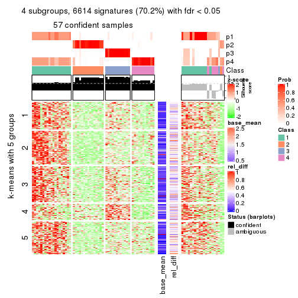</p>

</div>
<div id='tab-ATC-mclust-get-signatures-4'>
<pre><code class="r">get_signatures(res, k = 5)
</code></pre>

<p></p>

</div>
<div id='tab-ATC-mclust-get-signatures-5'>
<pre><code class="r">get_signatures(res, k = 6)
</code></pre>

<p></p>

</div>
</div>


Signature heatmaps where rows are not scaled:


<script>
$( function() {
	$( '#tabs-ATC-mclust-get-signatures-no-scale' ).tabs();
} );
</script>
<div id='tabs-ATC-mclust-get-signatures-no-scale'>
<ul>
<li><a href='#tab-ATC-mclust-get-signatures-no-scale-1'>k = 2</a></li>
<li><a href='#tab-ATC-mclust-get-signatures-no-scale-2'>k = 3</a></li>
<li><a href='#tab-ATC-mclust-get-signatures-no-scale-3'>k = 4</a></li>
<li><a href='#tab-ATC-mclust-get-signatures-no-scale-4'>k = 5</a></li>
<li><a href='#tab-ATC-mclust-get-signatures-no-scale-5'>k = 6</a></li>
</ul>
<div id='tab-ATC-mclust-get-signatures-no-scale-1'>
<pre><code class="r">get_signatures(res, k = 2, scale_rows = FALSE)
</code></pre>

<p></p>

</div>
<div id='tab-ATC-mclust-get-signatures-no-scale-2'>
<pre><code class="r">get_signatures(res, k = 3, scale_rows = FALSE)
</code></pre>

<p>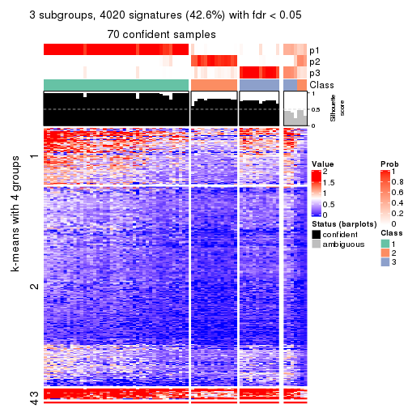</p>

</div>
<div id='tab-ATC-mclust-get-signatures-no-scale-3'>
<pre><code class="r">get_signatures(res, k = 4, scale_rows = FALSE)
</code></pre>

<p></p>

</div>
<div id='tab-ATC-mclust-get-signatures-no-scale-4'>
<pre><code class="r">get_signatures(res, k = 5, scale_rows = FALSE)
</code></pre>

<pre><code>#&gt; Error in mat[ceiling(1:nr/h_ratio), ceiling(1:nc/w_ratio), drop = FALSE]: subscript out of bounds
</code></pre>

<p></p>

</div>
<div id='tab-ATC-mclust-get-signatures-no-scale-5'>
<pre><code class="r">get_signatures(res, k = 6, scale_rows = FALSE)
</code></pre>

<pre><code>#&gt; Error in mat[ceiling(1:nr/h_ratio), ceiling(1:nc/w_ratio), drop = FALSE]: subscript out of bounds
</code></pre>

<p></p>

</div>
</div>


Compare the overlap of signatures from different k:

```r
compare_signatures(res)
```


`get_signature()` returns a data frame invisibly. TO get the list of signatures, the function
call should be assigned to a variable explicitly. In following code, if `plot` argument is set
to `FALSE`, no heatmap is plotted while only the differential analysis is performed.

```r
# code only for demonstration
tb = get_signature(res, k = ..., plot = FALSE)
```

An example of the output of `tb` is:

```
#>   which_row         fdr    mean_1    mean_2 scaled_mean_1 scaled_mean_2 km
#> 1        38 0.042760348  8.373488  9.131774    -0.5533452     0.5164555  1
#> 2        40 0.018707592  7.106213  8.469186    -0.6173731     0.5762149  1
#> 3        55 0.019134737 10.221463 11.207825    -0.6159697     0.5749050  1
#> 4        59 0.006059896  5.921854  7.869574    -0.6899429     0.6439467  1
#> 5        60 0.018055526  8.928898 10.211722    -0.6204761     0.5791110  1
#> 6        98 0.009384629 15.714769 14.887706     0.6635654    -0.6193277  2
...
```

The columns in `tb` are:

1. `which_row`: row indices corresponding to the input matrix.
2. `fdr`: FDR for the differential test. 
3. `mean_x`: The mean value in group x.
4. `scaled_mean_x`: The mean value in group x after rows are scaled.
5. `km`: Row groups if k-means clustering is applied to rows.


UMAP plot which shows how samples are separated.


<script>
$( function() {
	$( '#tabs-ATC-mclust-dimension-reduction' ).tabs();
} );
</script>
<div id='tabs-ATC-mclust-dimension-reduction'>
<ul>
<li><a href='#tab-ATC-mclust-dimension-reduction-1'>k = 2</a></li>
<li><a href='#tab-ATC-mclust-dimension-reduction-2'>k = 3</a></li>
<li><a href='#tab-ATC-mclust-dimension-reduction-3'>k = 4</a></li>
<li><a href='#tab-ATC-mclust-dimension-reduction-4'>k = 5</a></li>
<li><a href='#tab-ATC-mclust-dimension-reduction-5'>k = 6</a></li>
</ul>
<div id='tab-ATC-mclust-dimension-reduction-1'>
<pre><code class="r">dimension_reduction(res, k = 2, method = &quot;UMAP&quot;)
</code></pre>

<p></p>

</div>
<div id='tab-ATC-mclust-dimension-reduction-2'>
<pre><code class="r">dimension_reduction(res, k = 3, method = &quot;UMAP&quot;)
</code></pre>

<p>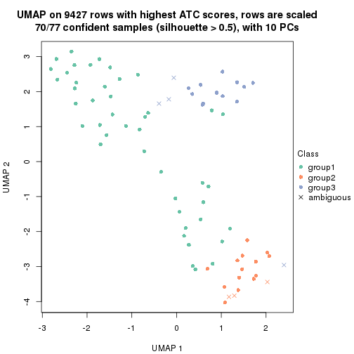</p>

</div>
<div id='tab-ATC-mclust-dimension-reduction-3'>
<pre><code class="r">dimension_reduction(res, k = 4, method = &quot;UMAP&quot;)
</code></pre>

<p></p>

</div>
<div id='tab-ATC-mclust-dimension-reduction-4'>
<pre><code class="r">dimension_reduction(res, k = 5, method = &quot;UMAP&quot;)
</code></pre>

<p></p>

</div>
<div id='tab-ATC-mclust-dimension-reduction-5'>
<pre><code class="r">dimension_reduction(res, k = 6, method = &quot;UMAP&quot;)
</code></pre>

<p></p>

</div>
</div>


Following heatmap shows how subgroups are split when increasing `k`:

```r
collect_classes(res)
```


If matrix rows can be associated to genes, consider to use `GO_Enrichment(res,
...)` to perform function enrichment for the signature genes.


 

---------------------------------------------------


### ATC:NMF


The object with results only for a single top-value method and a single partition method 
can be extracted as:

```r
res = res_list["ATC", "NMF"]
# you can also extract it by
# res = res_list["ATC:NMF"]
```

A summary of `res` and all the functions that can be applied to it:

```r
res
```

```
#> A 'ConsensusPartition' object with k = 2, 3, 4, 5, 6.
#>   On a matrix with 9427 rows and 77 columns.
#>   Top rows (943, 1886, 2828, 3771, 4714) are extracted by 'ATC' method.
#>   Subgroups are detected by 'NMF' method.
#>   Performed in total 1250 partitions by row resampling.
#>   Best k for subgroups seems to be 2.
#> 
#> Following methods can be applied to this 'ConsensusPartition' object:
#>  [1] "cola_report"             "collect_classes"         "collect_plots"          
#>  [4] "collect_stats"           "colnames"                "compare_signatures"     
#>  [7] "consensus_heatmap"       "dimension_reduction"     "functional_enrichment"  
#> [10] "get_anno_col"            "get_anno"                "get_classes"            
#> [13] "get_consensus"           "get_matrix"              "get_membership"         
#> [16] "get_param"               "get_signatures"          "get_stats"              
#> [19] "is_best_k"               "is_stable_k"             "membership_heatmap"     
#> [22] "ncol"                    "nrow"                    "plot_ecdf"              
#> [25] "rownames"                "select_partition_number" "show"                   
#> [28] "suggest_best_k"          "test_to_known_factors"
```

`collect_plots()` function collects all the plots made from `res` for all `k` (number of partitions)
into one single page to provide an easy and fast comparison between different `k`.

```r
collect_plots(res)
```


The plots are:

- The first row: a plot of the ECDF (Empirical cumulative distribution
  function) curves of the consensus matrix for each `k` and the heatmap of
  predicted classes for each `k`.
- The second row: heatmaps of the consensus matrix for each `k`.
- The third row: heatmaps of the membership matrix for each `k`.
- The fouth row: heatmaps of the signatures for each `k`.

All the plots in panels can be made by individual functions and they are
plotted later in this section.

`select_partition_number()` produces several plots showing different
statistics for choosing "optimized" `k`. There are following statistics:

- ECDF curves of the consensus matrix for each `k`;
- 1-PAC. [The PAC
  score](https://en.wikipedia.org/wiki/Consensus_clustering#Over-interpretation_potential_of_consensus_clustering)
  measures the proportion of the ambiguous subgrouping.
- Mean silhouette score.
- Concordance. The mean probability of fiting the consensus class ids in all
  partitions.
- Area increased. Denote $A_k$ as the area under the ECDF curve for current
  `k`, the area increased is defined as $A_k - A_{k-1}$.
- Rand index. The percent of pairs of samples that are both in a same cluster
  or both are not in a same cluster in the partition of k and k-1.
- Jaccard index. The ratio of pairs of samples are both in a same cluster in
  the partition of k and k-1 and the pairs of samples are both in a same
  cluster in the partition k or k-1.

The detailed explanations of these statistics can be found in [the cola
vignette](http://bioconductor.org/packages/devel/bioc/vignettes/cola/inst/doc/cola.html#toc_13).

Generally speaking, lower PAC score, higher mean silhouette score or higher
concordance corresponds to better partition. Rand index and Jaccard index
measure how similar the current partition is compared to partition with `k-1`.
If they are too similar, we won't accept `k` is better than `k-1`.

```r
select_partition_number(res)
```


The numeric values for all these statistics can be obtained by `get_stats()`.

```r
get_stats(res)
```

```
#>   k 1-PAC mean_silhouette concordance area_increased  Rand Jaccard
#> 2 2 0.890           0.928       0.969         0.4851 0.518   0.518
#> 3 3 0.715           0.816       0.912         0.3263 0.778   0.596
#> 4 4 0.599           0.619       0.799         0.1266 0.897   0.730
#> 5 5 0.584           0.543       0.757         0.0530 0.896   0.677
#> 6 6 0.595           0.468       0.688         0.0364 0.947   0.796
```

`suggest_best_k()` suggests the best $k$ based on these statistics. The rules are as follows:

- All $k$ with Jaccard index larger than 0.95 are removed because the increase of
  the partition number does not provides enough extra information. If all $k$ are removed,
  the best $k$ is assigned by `NA`.
- For $k$ with 1-PAC larger than 0.9, the maximal $k$ is taken as the "best k". Other $k$ is called "optional k".
- If it does not fit the second rule. The $k$ with the highest vote of highest
  1-PAC, mean silhouette and concordance is taken as the "best k".

```r
suggest_best_k(res)
```

```
#> [1] 2
```


Following shows the table of the partitions (You need to click the **show/hide
code output** link to see it). The membership matrix (columns with name `p*`)
is inferred by
[`clue::cl_consensus()`](https://www.rdocumentation.org/link/cl_consensus?package=clue)
function with the `SE` method. Basically the value in the membership matrix
represents the probability to belong to a certain group. The finall class
label for an item is determined with the group with highest probability it
belongs to.

In `get_classes()` function, the entropy is calculated from the membership
matrix and the silhouette score is calculated from the consensus matrix.


<script>
$( function() {
	$( '#tabs-ATC-NMF-get-classes' ).tabs();
} );
</script>
<div id='tabs-ATC-NMF-get-classes'>
<ul>
<li><a href='#tab-ATC-NMF-get-classes-1'>k = 2</a></li>
<li><a href='#tab-ATC-NMF-get-classes-2'>k = 3</a></li>
<li><a href='#tab-ATC-NMF-get-classes-3'>k = 4</a></li>
<li><a href='#tab-ATC-NMF-get-classes-4'>k = 5</a></li>
<li><a href='#tab-ATC-NMF-get-classes-5'>k = 6</a></li>
</ul>

<div id='tab-ATC-NMF-get-classes-1'>
<p><a id='tab-ATC-NMF-get-classes-1-a' style='color:#0366d6' href='#'>show/hide code output</a></p>
<pre><code class="r">cbind(get_classes(res, k = 2), get_membership(res, k = 2))
</code></pre>

<pre><code>#&gt;           class entropy silhouette    p1    p2
#&gt; SRR944011     2  0.0000      0.964 0.000 1.000
#&gt; SRR944012     1  0.0000      0.970 1.000 0.000
#&gt; SRR944014     2  0.0000      0.964 0.000 1.000
#&gt; SRR944013     1  0.0000      0.970 1.000 0.000
#&gt; SRR944015     2  0.8661      0.610 0.288 0.712
#&gt; SRR944016     1  0.8955      0.539 0.688 0.312
#&gt; SRR944017     1  0.9044      0.515 0.680 0.320
#&gt; SRR944018     1  0.3274      0.919 0.940 0.060
#&gt; SRR944019     1  0.0000      0.970 1.000 0.000
#&gt; SRR944020     1  0.0000      0.970 1.000 0.000
#&gt; SRR944021     2  0.0000      0.964 0.000 1.000
#&gt; SRR944022     1  0.0000      0.970 1.000 0.000
#&gt; SRR944023     2  0.0000      0.964 0.000 1.000
#&gt; SRR944024     2  0.0000      0.964 0.000 1.000
#&gt; SRR944026     1  0.0000      0.970 1.000 0.000
#&gt; SRR944025     1  0.2423      0.938 0.960 0.040
#&gt; SRR944028     1  0.0000      0.970 1.000 0.000
#&gt; SRR944029     1  0.0000      0.970 1.000 0.000
#&gt; SRR944030     2  0.0000      0.964 0.000 1.000
#&gt; SRR944031     2  0.0000      0.964 0.000 1.000
#&gt; SRR944032     1  0.0000      0.970 1.000 0.000
#&gt; SRR944033     2  0.0000      0.964 0.000 1.000
#&gt; SRR944034     2  0.2948      0.923 0.052 0.948
#&gt; SRR944036     2  0.0000      0.964 0.000 1.000
#&gt; SRR944035     2  0.0376      0.962 0.004 0.996
#&gt; SRR944038     2  0.0000      0.964 0.000 1.000
#&gt; SRR944037     1  0.0000      0.970 1.000 0.000
#&gt; SRR944039     1  0.0000      0.970 1.000 0.000
#&gt; SRR944040     2  0.0000      0.964 0.000 1.000
#&gt; SRR944041     1  0.0000      0.970 1.000 0.000
#&gt; SRR944042     2  0.0000      0.964 0.000 1.000
#&gt; SRR944043     2  0.6623      0.796 0.172 0.828
#&gt; SRR944044     1  0.0000      0.970 1.000 0.000
#&gt; SRR944046     2  0.0000      0.964 0.000 1.000
#&gt; SRR944045     2  0.0000      0.964 0.000 1.000
#&gt; SRR944047     2  0.0000      0.964 0.000 1.000
#&gt; SRR944048     2  0.0672      0.959 0.008 0.992
#&gt; SRR944049     2  0.0376      0.962 0.004 0.996
#&gt; SRR944050     2  0.9661      0.360 0.392 0.608
#&gt; SRR944051     1  0.0000      0.970 1.000 0.000
#&gt; SRR944052     2  0.0000      0.964 0.000 1.000
#&gt; SRR944053     1  0.0000      0.970 1.000 0.000
#&gt; SRR944054     1  0.0000      0.970 1.000 0.000
#&gt; SRR944055     2  0.0000      0.964 0.000 1.000
#&gt; SRR944056     2  0.0000      0.964 0.000 1.000
#&gt; SRR944057     2  0.2948      0.924 0.052 0.948
#&gt; SRR944058     1  0.0000      0.970 1.000 0.000
#&gt; SRR944059     2  0.0000      0.964 0.000 1.000
#&gt; SRR944060     2  0.0000      0.964 0.000 1.000
#&gt; SRR944061     2  0.0000      0.964 0.000 1.000
#&gt; SRR944062     2  0.0000      0.964 0.000 1.000
#&gt; SRR944063     1  0.0000      0.970 1.000 0.000
#&gt; SRR944064     2  0.0000      0.964 0.000 1.000
#&gt; SRR944065     1  0.0000      0.970 1.000 0.000
#&gt; SRR944066     2  0.0000      0.964 0.000 1.000
#&gt; SRR944067     1  0.0000      0.970 1.000 0.000
#&gt; SRR944068     1  0.4298      0.890 0.912 0.088
#&gt; SRR944069     2  0.0000      0.964 0.000 1.000
#&gt; SRR944070     2  0.0000      0.964 0.000 1.000
#&gt; SRR944071     2  0.0000      0.964 0.000 1.000
#&gt; SRR944072     1  0.0000      0.970 1.000 0.000
#&gt; SRR944073     2  0.0000      0.964 0.000 1.000
#&gt; SRR944075     2  0.0000      0.964 0.000 1.000
#&gt; SRR944074     1  0.0000      0.970 1.000 0.000
#&gt; SRR944076     2  0.0000      0.964 0.000 1.000
#&gt; SRR944077     2  0.0000      0.964 0.000 1.000
#&gt; SRR944078     2  0.0000      0.964 0.000 1.000
#&gt; SRR944079     2  0.0000      0.964 0.000 1.000
#&gt; SRR944080     2  0.0000      0.964 0.000 1.000
#&gt; SRR944081     1  0.0000      0.970 1.000 0.000
#&gt; SRR944082     2  0.6438      0.807 0.164 0.836
#&gt; SRR944083     2  0.6148      0.817 0.152 0.848
#&gt; SRR944084     2  0.8713      0.600 0.292 0.708
#&gt; SRR944085     2  0.0000      0.964 0.000 1.000
#&gt; SRR944086     1  0.0000      0.970 1.000 0.000
#&gt; SRR944088     1  0.0000      0.970 1.000 0.000
#&gt; SRR944087     2  0.0000      0.964 0.000 1.000
</code></pre>

<script>
$('#tab-ATC-NMF-get-classes-1-a').parent().next().next().hide();
$('#tab-ATC-NMF-get-classes-1-a').click(function(){
  $('#tab-ATC-NMF-get-classes-1-a').parent().next().next().toggle();
  return(false);
});
</script>
</div>

<div id='tab-ATC-NMF-get-classes-2'>
<p><a id='tab-ATC-NMF-get-classes-2-a' style='color:#0366d6' href='#'>show/hide code output</a></p>
<pre><code class="r">cbind(get_classes(res, k = 3), get_membership(res, k = 3))
</code></pre>

<pre><code>#&gt;           class entropy silhouette    p1    p2    p3
#&gt; SRR944011     3  0.0424    0.92996 0.008 0.000 0.992
#&gt; SRR944012     2  0.1643    0.87453 0.044 0.956 0.000
#&gt; SRR944014     3  0.0237    0.92985 0.004 0.000 0.996
#&gt; SRR944013     2  0.4452    0.74176 0.192 0.808 0.000
#&gt; SRR944015     3  0.5058    0.66804 0.000 0.244 0.756
#&gt; SRR944016     1  0.0237    0.84997 0.996 0.004 0.000
#&gt; SRR944017     2  0.9136    0.15099 0.144 0.456 0.400
#&gt; SRR944018     1  0.5138    0.65489 0.748 0.252 0.000
#&gt; SRR944019     2  0.6079    0.35333 0.388 0.612 0.000
#&gt; SRR944020     2  0.1411    0.86263 0.000 0.964 0.036
#&gt; SRR944021     3  0.0592    0.92993 0.012 0.000 0.988
#&gt; SRR944022     2  0.1031    0.87972 0.024 0.976 0.000
#&gt; SRR944023     3  0.5905    0.50987 0.352 0.000 0.648
#&gt; SRR944024     1  0.1289    0.84477 0.968 0.000 0.032
#&gt; SRR944026     2  0.0592    0.87985 0.012 0.988 0.000
#&gt; SRR944025     1  0.1411    0.84401 0.964 0.036 0.000
#&gt; SRR944028     1  0.6079    0.34521 0.612 0.388 0.000
#&gt; SRR944029     2  0.3192    0.80096 0.000 0.888 0.112
#&gt; SRR944030     3  0.0892    0.92077 0.000 0.020 0.980
#&gt; SRR944031     3  0.0424    0.93013 0.008 0.000 0.992
#&gt; SRR944032     1  0.3340    0.80968 0.880 0.120 0.000
#&gt; SRR944033     3  0.2066    0.90885 0.060 0.000 0.940
#&gt; SRR944034     1  0.6936   -0.00742 0.524 0.016 0.460
#&gt; SRR944036     3  0.4931    0.72996 0.232 0.000 0.768
#&gt; SRR944035     3  0.6260    0.24641 0.448 0.000 0.552
#&gt; SRR944038     3  0.0424    0.92996 0.008 0.000 0.992
#&gt; SRR944037     2  0.2878    0.81650 0.000 0.904 0.096
#&gt; SRR944039     1  0.3879    0.78252 0.848 0.152 0.000
#&gt; SRR944040     3  0.0592    0.93002 0.012 0.000 0.988
#&gt; SRR944041     2  0.0592    0.87985 0.012 0.988 0.000
#&gt; SRR944042     3  0.0237    0.92985 0.004 0.000 0.996
#&gt; SRR944043     3  0.4270    0.83245 0.024 0.116 0.860
#&gt; SRR944044     2  0.0000    0.87793 0.000 1.000 0.000
#&gt; SRR944046     3  0.0000    0.92899 0.000 0.000 1.000
#&gt; SRR944045     3  0.0237    0.92788 0.000 0.004 0.996
#&gt; SRR944047     3  0.1753    0.91564 0.048 0.000 0.952
#&gt; SRR944048     1  0.0592    0.85187 0.988 0.000 0.012
#&gt; SRR944049     3  0.4861    0.77840 0.192 0.008 0.800
#&gt; SRR944050     1  0.0424    0.85240 0.992 0.000 0.008
#&gt; SRR944051     2  0.2165    0.86619 0.064 0.936 0.000
#&gt; SRR944052     3  0.2959    0.88141 0.100 0.000 0.900
#&gt; SRR944053     2  0.2625    0.85306 0.084 0.916 0.000
#&gt; SRR944054     2  0.0424    0.87584 0.000 0.992 0.008
#&gt; SRR944055     3  0.0424    0.92996 0.008 0.000 0.992
#&gt; SRR944056     3  0.1163    0.92512 0.028 0.000 0.972
#&gt; SRR944057     1  0.0424    0.85240 0.992 0.000 0.008
#&gt; SRR944058     1  0.3752    0.78964 0.856 0.144 0.000
#&gt; SRR944059     3  0.0592    0.92993 0.012 0.000 0.988
#&gt; SRR944060     3  0.0747    0.92923 0.016 0.000 0.984
#&gt; SRR944061     3  0.2261    0.90319 0.068 0.000 0.932
#&gt; SRR944062     1  0.3941    0.74203 0.844 0.000 0.156
#&gt; SRR944063     2  0.1525    0.87938 0.032 0.964 0.004
#&gt; SRR944064     1  0.1753    0.83567 0.952 0.000 0.048
#&gt; SRR944065     2  0.1031    0.87993 0.024 0.976 0.000
#&gt; SRR944066     1  0.0892    0.84982 0.980 0.000 0.020
#&gt; SRR944067     1  0.3412    0.80636 0.876 0.124 0.000
#&gt; SRR944068     2  0.4702    0.67867 0.000 0.788 0.212
#&gt; SRR944069     3  0.0592    0.92467 0.000 0.012 0.988
#&gt; SRR944070     3  0.0000    0.92899 0.000 0.000 1.000
#&gt; SRR944071     3  0.0237    0.92788 0.000 0.004 0.996
#&gt; SRR944072     1  0.3038    0.81852 0.896 0.104 0.000
#&gt; SRR944073     3  0.2796    0.88866 0.092 0.000 0.908
#&gt; SRR944075     3  0.0237    0.92788 0.000 0.004 0.996
#&gt; SRR944074     2  0.0424    0.87925 0.008 0.992 0.000
#&gt; SRR944076     3  0.0592    0.92993 0.012 0.000 0.988
#&gt; SRR944077     3  0.0892    0.92821 0.020 0.000 0.980
#&gt; SRR944078     3  0.0747    0.92292 0.000 0.016 0.984
#&gt; SRR944079     3  0.0592    0.93004 0.012 0.000 0.988
#&gt; SRR944080     3  0.1163    0.92548 0.028 0.000 0.972
#&gt; SRR944081     2  0.2261    0.86355 0.068 0.932 0.000
#&gt; SRR944082     1  0.3116    0.79143 0.892 0.000 0.108
#&gt; SRR944083     1  0.0424    0.85240 0.992 0.000 0.008
#&gt; SRR944084     3  0.5058    0.66774 0.000 0.244 0.756
#&gt; SRR944085     3  0.0747    0.92275 0.000 0.016 0.984
#&gt; SRR944086     2  0.3752    0.79827 0.144 0.856 0.000
#&gt; SRR944088     2  0.0237    0.87723 0.000 0.996 0.004
#&gt; SRR944087     3  0.0237    0.92985 0.004 0.000 0.996
</code></pre>

<script>
$('#tab-ATC-NMF-get-classes-2-a').parent().next().next().hide();
$('#tab-ATC-NMF-get-classes-2-a').click(function(){
  $('#tab-ATC-NMF-get-classes-2-a').parent().next().next().toggle();
  return(false);
});
</script>
</div>

<div id='tab-ATC-NMF-get-classes-3'>
<p><a id='tab-ATC-NMF-get-classes-3-a' style='color:#0366d6' href='#'>show/hide code output</a></p>
<pre><code class="r">cbind(get_classes(res, k = 4), get_membership(res, k = 4))
</code></pre>

<pre><code>#&gt;           class entropy silhouette    p1    p2    p3    p4
#&gt; SRR944011     2  0.2647     0.7229 0.000 0.880 0.120 0.000
#&gt; SRR944012     4  0.1305     0.8542 0.004 0.000 0.036 0.960
#&gt; SRR944014     2  0.0779     0.7615 0.004 0.980 0.016 0.000
#&gt; SRR944013     3  0.7587    -0.2966 0.196 0.000 0.412 0.392
#&gt; SRR944015     2  0.6395    -0.1437 0.000 0.472 0.464 0.064
#&gt; SRR944016     1  0.2149     0.7573 0.912 0.000 0.088 0.000
#&gt; SRR944017     3  0.4903     0.4842 0.068 0.036 0.812 0.084
#&gt; SRR944018     3  0.5594     0.1447 0.284 0.004 0.672 0.040
#&gt; SRR944019     4  0.7598     0.3255 0.284 0.000 0.240 0.476
#&gt; SRR944020     4  0.4137     0.7708 0.000 0.012 0.208 0.780
#&gt; SRR944021     2  0.3123     0.6990 0.000 0.844 0.156 0.000
#&gt; SRR944022     4  0.4745     0.7640 0.036 0.000 0.208 0.756
#&gt; SRR944023     1  0.7906    -0.2629 0.352 0.348 0.300 0.000
#&gt; SRR944024     1  0.4756     0.6581 0.784 0.144 0.072 0.000
#&gt; SRR944026     4  0.1356     0.8552 0.008 0.000 0.032 0.960
#&gt; SRR944025     1  0.2983     0.7628 0.896 0.016 0.076 0.012
#&gt; SRR944028     1  0.7059     0.3104 0.528 0.000 0.140 0.332
#&gt; SRR944029     4  0.3198     0.8324 0.000 0.040 0.080 0.880
#&gt; SRR944030     3  0.5033     0.4582 0.004 0.324 0.664 0.008
#&gt; SRR944031     2  0.4991     0.3197 0.004 0.608 0.388 0.000
#&gt; SRR944032     1  0.4072     0.7107 0.828 0.000 0.052 0.120
#&gt; SRR944033     2  0.2413     0.7354 0.064 0.916 0.020 0.000
#&gt; SRR944034     2  0.8212    -0.0203 0.380 0.416 0.176 0.028
#&gt; SRR944036     2  0.6229     0.5294 0.132 0.664 0.204 0.000
#&gt; SRR944035     2  0.8440     0.1776 0.300 0.472 0.180 0.048
#&gt; SRR944038     2  0.1109     0.7575 0.004 0.968 0.028 0.000
#&gt; SRR944037     4  0.3301     0.8314 0.000 0.048 0.076 0.876
#&gt; SRR944039     1  0.6052     0.3964 0.556 0.000 0.396 0.048
#&gt; SRR944040     2  0.1388     0.7572 0.012 0.960 0.028 0.000
#&gt; SRR944041     4  0.1545     0.8521 0.000 0.008 0.040 0.952
#&gt; SRR944042     2  0.0817     0.7599 0.000 0.976 0.024 0.000
#&gt; SRR944043     3  0.5938     0.5471 0.020 0.232 0.696 0.052
#&gt; SRR944044     4  0.3351     0.8186 0.008 0.000 0.148 0.844
#&gt; SRR944046     2  0.3801     0.6359 0.000 0.780 0.220 0.000
#&gt; SRR944045     2  0.5070     0.2563 0.000 0.580 0.416 0.004
#&gt; SRR944047     2  0.1743     0.7568 0.004 0.940 0.056 0.000
#&gt; SRR944048     1  0.2224     0.7545 0.928 0.032 0.040 0.000
#&gt; SRR944049     2  0.6456     0.5016 0.204 0.688 0.064 0.044
#&gt; SRR944050     1  0.2334     0.7580 0.908 0.004 0.088 0.000
#&gt; SRR944051     4  0.2924     0.8343 0.016 0.000 0.100 0.884
#&gt; SRR944052     2  0.4552     0.6569 0.128 0.812 0.048 0.012
#&gt; SRR944053     4  0.4428     0.8024 0.068 0.000 0.124 0.808
#&gt; SRR944054     4  0.1296     0.8539 0.004 0.004 0.028 0.964
#&gt; SRR944055     2  0.1022     0.7609 0.000 0.968 0.032 0.000
#&gt; SRR944056     2  0.4808     0.6661 0.092 0.816 0.056 0.036
#&gt; SRR944057     1  0.2805     0.7559 0.888 0.012 0.100 0.000
#&gt; SRR944058     1  0.4282     0.7036 0.816 0.000 0.060 0.124
#&gt; SRR944059     2  0.2589     0.7261 0.000 0.884 0.116 0.000
#&gt; SRR944060     3  0.5186     0.4346 0.016 0.344 0.640 0.000
#&gt; SRR944061     2  0.2300     0.7441 0.048 0.924 0.028 0.000
#&gt; SRR944062     1  0.5994     0.4528 0.636 0.296 0.068 0.000
#&gt; SRR944063     4  0.2010     0.8527 0.004 0.004 0.060 0.932
#&gt; SRR944064     1  0.2739     0.7460 0.904 0.060 0.036 0.000
#&gt; SRR944065     4  0.2302     0.8486 0.008 0.008 0.060 0.924
#&gt; SRR944066     1  0.3280     0.7470 0.860 0.016 0.124 0.000
#&gt; SRR944067     1  0.5062     0.6890 0.752 0.000 0.184 0.064
#&gt; SRR944068     4  0.3071     0.8168 0.000 0.068 0.044 0.888
#&gt; SRR944069     3  0.5838     0.1444 0.024 0.444 0.528 0.004
#&gt; SRR944070     2  0.0921     0.7592 0.000 0.972 0.028 0.000
#&gt; SRR944071     2  0.4250     0.5574 0.000 0.724 0.276 0.000
#&gt; SRR944072     1  0.3280     0.7394 0.860 0.000 0.124 0.016
#&gt; SRR944073     2  0.4024     0.7132 0.076 0.856 0.040 0.028
#&gt; SRR944075     2  0.1637     0.7544 0.000 0.940 0.060 0.000
#&gt; SRR944074     4  0.1022     0.8557 0.000 0.000 0.032 0.968
#&gt; SRR944076     2  0.3311     0.6996 0.000 0.828 0.172 0.000
#&gt; SRR944077     2  0.1624     0.7546 0.020 0.952 0.028 0.000
#&gt; SRR944078     2  0.1733     0.7540 0.000 0.948 0.028 0.024
#&gt; SRR944079     2  0.1890     0.7590 0.008 0.936 0.056 0.000
#&gt; SRR944080     2  0.2870     0.7405 0.044 0.908 0.036 0.012
#&gt; SRR944081     4  0.5929     0.6384 0.064 0.000 0.296 0.640
#&gt; SRR944082     1  0.3463     0.7273 0.864 0.096 0.040 0.000
#&gt; SRR944083     1  0.1833     0.7551 0.944 0.032 0.024 0.000
#&gt; SRR944084     2  0.6810     0.3239 0.000 0.596 0.248 0.156
#&gt; SRR944085     2  0.4991     0.3238 0.000 0.608 0.388 0.004
#&gt; SRR944086     4  0.5646     0.7008 0.088 0.000 0.204 0.708
#&gt; SRR944088     4  0.1474     0.8519 0.000 0.000 0.052 0.948
#&gt; SRR944087     2  0.1256     0.7619 0.008 0.964 0.028 0.000
</code></pre>

<script>
$('#tab-ATC-NMF-get-classes-3-a').parent().next().next().hide();
$('#tab-ATC-NMF-get-classes-3-a').click(function(){
  $('#tab-ATC-NMF-get-classes-3-a').parent().next().next().toggle();
  return(false);
});
</script>
</div>

<div id='tab-ATC-NMF-get-classes-4'>
<p><a id='tab-ATC-NMF-get-classes-4-a' style='color:#0366d6' href='#'>show/hide code output</a></p>
<pre><code class="r">cbind(get_classes(res, k = 5), get_membership(res, k = 5))
</code></pre>

<pre><code>#&gt;           class entropy silhouette    p1    p2    p3    p4    p5
#&gt; SRR944011     2  0.2280     0.7432 0.000 0.880 0.120 0.000 0.000
#&gt; SRR944012     4  0.2102     0.7471 0.012 0.000 0.004 0.916 0.068
#&gt; SRR944014     2  0.0510     0.7976 0.000 0.984 0.000 0.000 0.016
#&gt; SRR944013     3  0.7775    -0.1632 0.124 0.000 0.468 0.252 0.156
#&gt; SRR944015     3  0.5741     0.4661 0.000 0.320 0.592 0.076 0.012
#&gt; SRR944016     1  0.1809     0.6716 0.928 0.000 0.060 0.000 0.012
#&gt; SRR944017     3  0.3530     0.4089 0.040 0.024 0.868 0.024 0.044
#&gt; SRR944018     3  0.4082     0.3004 0.140 0.000 0.796 0.008 0.056
#&gt; SRR944019     4  0.8299     0.1169 0.180 0.000 0.216 0.392 0.212
#&gt; SRR944020     4  0.3967     0.6548 0.000 0.000 0.264 0.724 0.012
#&gt; SRR944021     2  0.3897     0.6301 0.000 0.768 0.204 0.000 0.028
#&gt; SRR944022     4  0.5976     0.5464 0.016 0.000 0.296 0.592 0.096
#&gt; SRR944023     3  0.7675     0.2375 0.316 0.240 0.388 0.000 0.056
#&gt; SRR944024     1  0.5481     0.5255 0.676 0.132 0.008 0.000 0.184
#&gt; SRR944026     4  0.1828     0.7547 0.004 0.000 0.028 0.936 0.032
#&gt; SRR944025     1  0.4609     0.6030 0.804 0.012 0.056 0.064 0.064
#&gt; SRR944028     5  0.7466    -0.0422 0.340 0.000 0.060 0.172 0.428
#&gt; SRR944029     4  0.2701     0.7375 0.000 0.032 0.036 0.900 0.032
#&gt; SRR944030     3  0.3732     0.5440 0.000 0.176 0.792 0.000 0.032
#&gt; SRR944031     3  0.4747     0.1342 0.000 0.488 0.496 0.000 0.016
#&gt; SRR944032     1  0.5301     0.4591 0.648 0.000 0.004 0.076 0.272
#&gt; SRR944033     2  0.1814     0.7901 0.024 0.940 0.004 0.004 0.028
#&gt; SRR944034     1  0.8424    -0.0514 0.356 0.332 0.156 0.012 0.144
#&gt; SRR944036     2  0.7734     0.1754 0.112 0.480 0.188 0.000 0.220
#&gt; SRR944035     5  0.6868     0.1950 0.080 0.296 0.040 0.024 0.560
#&gt; SRR944038     2  0.0671     0.7983 0.000 0.980 0.004 0.000 0.016
#&gt; SRR944037     4  0.3294     0.7481 0.000 0.008 0.104 0.852 0.036
#&gt; SRR944039     3  0.6493    -0.1879 0.396 0.000 0.476 0.024 0.104
#&gt; SRR944040     2  0.1256     0.7959 0.012 0.964 0.008 0.004 0.012
#&gt; SRR944041     4  0.2275     0.7456 0.004 0.008 0.008 0.912 0.068
#&gt; SRR944042     2  0.1012     0.7979 0.000 0.968 0.020 0.000 0.012
#&gt; SRR944043     3  0.3874     0.4943 0.020 0.092 0.836 0.044 0.008
#&gt; SRR944044     4  0.3888     0.7348 0.008 0.000 0.112 0.816 0.064
#&gt; SRR944046     2  0.4000     0.5902 0.000 0.748 0.228 0.000 0.024
#&gt; SRR944045     3  0.5289     0.1993 0.000 0.452 0.500 0.000 0.048
#&gt; SRR944047     2  0.1502     0.7871 0.000 0.940 0.056 0.000 0.004
#&gt; SRR944048     1  0.3757     0.6543 0.816 0.040 0.008 0.000 0.136
#&gt; SRR944049     2  0.6368     0.4401 0.188 0.652 0.012 0.052 0.096
#&gt; SRR944050     1  0.1443     0.6722 0.948 0.004 0.044 0.000 0.004
#&gt; SRR944051     4  0.4986     0.4849 0.008 0.000 0.024 0.600 0.368
#&gt; SRR944052     2  0.4582     0.6724 0.112 0.792 0.008 0.028 0.060
#&gt; SRR944053     4  0.6006     0.6217 0.036 0.000 0.184 0.656 0.124
#&gt; SRR944054     4  0.2608     0.7206 0.000 0.020 0.004 0.888 0.088
#&gt; SRR944055     2  0.1116     0.7986 0.000 0.964 0.028 0.004 0.004
#&gt; SRR944056     2  0.4727     0.6788 0.060 0.796 0.012 0.056 0.076
#&gt; SRR944057     1  0.2208     0.6595 0.908 0.000 0.072 0.000 0.020
#&gt; SRR944058     1  0.5161     0.5083 0.672 0.000 0.016 0.048 0.264
#&gt; SRR944059     2  0.3731     0.6845 0.000 0.800 0.160 0.000 0.040
#&gt; SRR944060     3  0.3289     0.5467 0.008 0.172 0.816 0.000 0.004
#&gt; SRR944061     2  0.1990     0.7855 0.028 0.928 0.004 0.000 0.040
#&gt; SRR944062     1  0.6652     0.2084 0.512 0.304 0.016 0.000 0.168
#&gt; SRR944063     4  0.3236     0.7315 0.004 0.004 0.016 0.844 0.132
#&gt; SRR944064     1  0.3570     0.6616 0.836 0.048 0.008 0.000 0.108
#&gt; SRR944065     4  0.3398     0.6838 0.000 0.000 0.004 0.780 0.216
#&gt; SRR944066     1  0.2629     0.6475 0.880 0.004 0.104 0.000 0.012
#&gt; SRR944067     1  0.6406     0.1829 0.480 0.000 0.064 0.044 0.412
#&gt; SRR944068     4  0.4726     0.6784 0.000 0.088 0.036 0.776 0.100
#&gt; SRR944069     3  0.5869     0.4357 0.032 0.344 0.584 0.012 0.028
#&gt; SRR944070     2  0.0992     0.7986 0.000 0.968 0.024 0.000 0.008
#&gt; SRR944071     2  0.4508     0.3637 0.000 0.648 0.332 0.000 0.020
#&gt; SRR944072     1  0.3423     0.6421 0.852 0.000 0.092 0.016 0.040
#&gt; SRR944073     2  0.3561     0.7460 0.064 0.860 0.008 0.028 0.040
#&gt; SRR944075     2  0.1809     0.7834 0.000 0.928 0.060 0.000 0.012
#&gt; SRR944074     4  0.1885     0.7495 0.004 0.000 0.020 0.932 0.044
#&gt; SRR944076     2  0.5526     0.4875 0.000 0.648 0.200 0.000 0.152
#&gt; SRR944077     2  0.2550     0.7693 0.044 0.908 0.004 0.012 0.032
#&gt; SRR944078     2  0.1686     0.7979 0.000 0.944 0.020 0.028 0.008
#&gt; SRR944079     2  0.1492     0.7984 0.008 0.948 0.040 0.000 0.004
#&gt; SRR944080     2  0.4447     0.7131 0.064 0.816 0.020 0.036 0.064
#&gt; SRR944081     4  0.7100     0.3373 0.028 0.000 0.344 0.440 0.188
#&gt; SRR944082     1  0.5145     0.6115 0.724 0.092 0.020 0.000 0.164
#&gt; SRR944083     1  0.1996     0.6716 0.928 0.032 0.004 0.000 0.036
#&gt; SRR944084     2  0.7267     0.0152 0.000 0.496 0.304 0.108 0.092
#&gt; SRR944085     3  0.4907     0.1185 0.000 0.488 0.488 0.000 0.024
#&gt; SRR944086     5  0.4505     0.2444 0.016 0.000 0.028 0.220 0.736
#&gt; SRR944088     4  0.1377     0.7539 0.004 0.000 0.020 0.956 0.020
#&gt; SRR944087     2  0.1300     0.7989 0.000 0.956 0.016 0.000 0.028
</code></pre>

<script>
$('#tab-ATC-NMF-get-classes-4-a').parent().next().next().hide();
$('#tab-ATC-NMF-get-classes-4-a').click(function(){
  $('#tab-ATC-NMF-get-classes-4-a').parent().next().next().toggle();
  return(false);
});
</script>
</div>

<div id='tab-ATC-NMF-get-classes-5'>
<p><a id='tab-ATC-NMF-get-classes-5-a' style='color:#0366d6' href='#'>show/hide code output</a></p>
<pre><code class="r">cbind(get_classes(res, k = 6), get_membership(res, k = 6))
</code></pre>

<pre><code>#&gt;           class entropy silhouette    p1    p2    p3    p4    p5    p6
#&gt; SRR944011     2  0.3118     0.6831 0.000 0.820 0.012 0.000 0.012 0.156
#&gt; SRR944012     4  0.3642     0.6981 0.016 0.000 0.060 0.824 0.092 0.008
#&gt; SRR944014     2  0.1867     0.7449 0.004 0.924 0.036 0.000 0.000 0.036
#&gt; SRR944013     6  0.8210    -0.1033 0.112 0.000 0.252 0.180 0.080 0.376
#&gt; SRR944015     6  0.5578     0.4601 0.000 0.248 0.036 0.040 0.036 0.640
#&gt; SRR944016     1  0.1565     0.6356 0.940 0.000 0.028 0.000 0.004 0.028
#&gt; SRR944017     6  0.4219     0.4121 0.088 0.012 0.076 0.004 0.024 0.796
#&gt; SRR944018     6  0.4890     0.3488 0.144 0.004 0.064 0.016 0.032 0.740
#&gt; SRR944019     3  0.8539    -0.3690 0.116 0.000 0.304 0.288 0.128 0.164
#&gt; SRR944020     4  0.4784     0.6368 0.000 0.000 0.064 0.680 0.020 0.236
#&gt; SRR944021     2  0.4564     0.5405 0.000 0.684 0.036 0.000 0.024 0.256
#&gt; SRR944022     4  0.7054     0.4923 0.008 0.000 0.116 0.488 0.148 0.240
#&gt; SRR944023     6  0.7939     0.0397 0.280 0.196 0.144 0.000 0.028 0.352
#&gt; SRR944024     1  0.6376     0.3252 0.472 0.132 0.344 0.000 0.052 0.000
#&gt; SRR944026     4  0.1864     0.7219 0.000 0.000 0.032 0.924 0.040 0.004
#&gt; SRR944025     1  0.3720     0.5538 0.828 0.008 0.100 0.032 0.012 0.020
#&gt; SRR944028     5  0.7556     0.2396 0.296 0.000 0.220 0.068 0.384 0.032
#&gt; SRR944029     4  0.2789     0.7068 0.000 0.036 0.064 0.880 0.008 0.012
#&gt; SRR944030     6  0.3696     0.5157 0.004 0.128 0.036 0.004 0.016 0.812
#&gt; SRR944031     2  0.4500     0.0110 0.000 0.488 0.012 0.000 0.012 0.488
#&gt; SRR944032     1  0.6064     0.2561 0.564 0.000 0.108 0.048 0.276 0.004
#&gt; SRR944033     2  0.1719     0.7272 0.008 0.928 0.056 0.000 0.000 0.008
#&gt; SRR944034     2  0.8820    -0.2717 0.244 0.300 0.148 0.004 0.132 0.172
#&gt; SRR944036     3  0.7835    -0.0600 0.040 0.328 0.360 0.000 0.124 0.148
#&gt; SRR944035     5  0.6946     0.0880 0.048 0.104 0.352 0.008 0.460 0.028
#&gt; SRR944038     2  0.0865     0.7374 0.000 0.964 0.036 0.000 0.000 0.000
#&gt; SRR944037     4  0.3938     0.7119 0.000 0.012 0.092 0.812 0.032 0.052
#&gt; SRR944039     6  0.7757    -0.1882 0.292 0.000 0.256 0.048 0.060 0.344
#&gt; SRR944040     2  0.1578     0.7397 0.012 0.936 0.048 0.000 0.000 0.004
#&gt; SRR944041     4  0.3791     0.7024 0.000 0.016 0.136 0.804 0.028 0.016
#&gt; SRR944042     2  0.1180     0.7438 0.000 0.960 0.016 0.000 0.012 0.012
#&gt; SRR944043     6  0.3221     0.5078 0.048 0.080 0.024 0.000 0.000 0.848
#&gt; SRR944044     4  0.4859     0.6777 0.020 0.000 0.072 0.756 0.080 0.072
#&gt; SRR944046     2  0.4185     0.5911 0.000 0.724 0.024 0.000 0.024 0.228
#&gt; SRR944045     6  0.5496     0.0494 0.000 0.428 0.080 0.000 0.016 0.476
#&gt; SRR944047     2  0.3150     0.7207 0.000 0.840 0.036 0.000 0.012 0.112
#&gt; SRR944048     1  0.5518     0.4647 0.568 0.032 0.336 0.000 0.060 0.004
#&gt; SRR944049     2  0.5407     0.2955 0.052 0.632 0.272 0.032 0.008 0.004
#&gt; SRR944050     1  0.1495     0.6320 0.948 0.004 0.020 0.000 0.008 0.020
#&gt; SRR944051     4  0.5440     0.4660 0.004 0.000 0.100 0.540 0.352 0.004
#&gt; SRR944052     2  0.4239     0.6100 0.080 0.780 0.116 0.004 0.008 0.012
#&gt; SRR944053     4  0.7503     0.4898 0.068 0.000 0.116 0.512 0.128 0.176
#&gt; SRR944054     4  0.3976     0.6907 0.004 0.016 0.132 0.800 0.028 0.020
#&gt; SRR944055     2  0.0725     0.7451 0.000 0.976 0.012 0.000 0.000 0.012
#&gt; SRR944056     2  0.3872     0.6328 0.032 0.812 0.116 0.024 0.004 0.012
#&gt; SRR944057     1  0.2257     0.6005 0.904 0.000 0.040 0.000 0.008 0.048
#&gt; SRR944058     1  0.5813     0.3932 0.596 0.000 0.224 0.024 0.152 0.004
#&gt; SRR944059     2  0.3629     0.6798 0.000 0.804 0.032 0.000 0.024 0.140
#&gt; SRR944060     6  0.3337     0.5226 0.036 0.136 0.004 0.000 0.004 0.820
#&gt; SRR944061     2  0.1818     0.7250 0.004 0.920 0.068 0.000 0.004 0.004
#&gt; SRR944062     3  0.6889    -0.1389 0.280 0.320 0.352 0.000 0.048 0.000
#&gt; SRR944063     4  0.4555     0.6910 0.000 0.008 0.124 0.748 0.104 0.016
#&gt; SRR944064     1  0.5537     0.4671 0.568 0.048 0.340 0.000 0.036 0.008
#&gt; SRR944065     4  0.4508     0.5878 0.000 0.004 0.036 0.648 0.308 0.004
#&gt; SRR944066     1  0.2492     0.5993 0.888 0.000 0.036 0.000 0.008 0.068
#&gt; SRR944067     5  0.6791     0.0397 0.340 0.000 0.272 0.008 0.356 0.024
#&gt; SRR944068     4  0.5057     0.6488 0.000 0.080 0.048 0.740 0.104 0.028
#&gt; SRR944069     6  0.6167     0.3987 0.044 0.280 0.080 0.000 0.024 0.572
#&gt; SRR944070     2  0.1245     0.7468 0.000 0.952 0.016 0.000 0.000 0.032
#&gt; SRR944071     2  0.4629     0.3016 0.000 0.576 0.020 0.000 0.016 0.388
#&gt; SRR944072     1  0.2228     0.6210 0.912 0.000 0.016 0.004 0.024 0.044
#&gt; SRR944073     2  0.3712     0.6784 0.068 0.832 0.064 0.020 0.004 0.012
#&gt; SRR944075     2  0.1226     0.7453 0.000 0.952 0.004 0.000 0.004 0.040
#&gt; SRR944074     4  0.3011     0.7117 0.000 0.000 0.100 0.852 0.036 0.012
#&gt; SRR944076     2  0.6510     0.3330 0.000 0.540 0.144 0.000 0.092 0.224
#&gt; SRR944077     2  0.2543     0.7256 0.024 0.892 0.064 0.000 0.004 0.016
#&gt; SRR944078     2  0.1967     0.7444 0.000 0.928 0.028 0.016 0.008 0.020
#&gt; SRR944079     2  0.3501     0.7252 0.012 0.828 0.036 0.000 0.012 0.112
#&gt; SRR944080     2  0.5584     0.5279 0.136 0.684 0.124 0.004 0.020 0.032
#&gt; SRR944081     4  0.8035     0.1466 0.032 0.000 0.248 0.300 0.128 0.292
#&gt; SRR944082     1  0.6230     0.4014 0.516 0.076 0.344 0.000 0.048 0.016
#&gt; SRR944083     1  0.2865     0.6206 0.852 0.020 0.120 0.000 0.004 0.004
#&gt; SRR944084     2  0.7829    -0.1181 0.000 0.392 0.060 0.108 0.128 0.312
#&gt; SRR944085     6  0.4896     0.1040 0.000 0.424 0.032 0.000 0.016 0.528
#&gt; SRR944086     5  0.2780     0.3052 0.012 0.000 0.012 0.092 0.872 0.012
#&gt; SRR944088     4  0.2664     0.7119 0.000 0.000 0.056 0.884 0.040 0.020
#&gt; SRR944087     2  0.1950     0.7422 0.000 0.924 0.032 0.000 0.028 0.016
</code></pre>

<script>
$('#tab-ATC-NMF-get-classes-5-a').parent().next().next().hide();
$('#tab-ATC-NMF-get-classes-5-a').click(function(){
  $('#tab-ATC-NMF-get-classes-5-a').parent().next().next().toggle();
  return(false);
});
</script>
</div>
</div>

Heatmaps for the consensus matrix. It visualizes the probability of two
samples to be in a same group.


<script>
$( function() {
	$( '#tabs-ATC-NMF-consensus-heatmap' ).tabs();
} );
</script>
<div id='tabs-ATC-NMF-consensus-heatmap'>
<ul>
<li><a href='#tab-ATC-NMF-consensus-heatmap-1'>k = 2</a></li>
<li><a href='#tab-ATC-NMF-consensus-heatmap-2'>k = 3</a></li>
<li><a href='#tab-ATC-NMF-consensus-heatmap-3'>k = 4</a></li>
<li><a href='#tab-ATC-NMF-consensus-heatmap-4'>k = 5</a></li>
<li><a href='#tab-ATC-NMF-consensus-heatmap-5'>k = 6</a></li>
</ul>
<div id='tab-ATC-NMF-consensus-heatmap-1'>
<pre><code class="r">consensus_heatmap(res, k = 2)
</code></pre>

<p></p>

</div>
<div id='tab-ATC-NMF-consensus-heatmap-2'>
<pre><code class="r">consensus_heatmap(res, k = 3)
</code></pre>

<p></p>

</div>
<div id='tab-ATC-NMF-consensus-heatmap-3'>
<pre><code class="r">consensus_heatmap(res, k = 4)
</code></pre>

<p></p>

</div>
<div id='tab-ATC-NMF-consensus-heatmap-4'>
<pre><code class="r">consensus_heatmap(res, k = 5)
</code></pre>

<p></p>

</div>
<div id='tab-ATC-NMF-consensus-heatmap-5'>
<pre><code class="r">consensus_heatmap(res, k = 6)
</code></pre>

<p></p>

</div>
</div>

Heatmaps for the membership of samples in all partitions to see how consistent they are:


<script>
$( function() {
	$( '#tabs-ATC-NMF-membership-heatmap' ).tabs();
} );
</script>
<div id='tabs-ATC-NMF-membership-heatmap'>
<ul>
<li><a href='#tab-ATC-NMF-membership-heatmap-1'>k = 2</a></li>
<li><a href='#tab-ATC-NMF-membership-heatmap-2'>k = 3</a></li>
<li><a href='#tab-ATC-NMF-membership-heatmap-3'>k = 4</a></li>
<li><a href='#tab-ATC-NMF-membership-heatmap-4'>k = 5</a></li>
<li><a href='#tab-ATC-NMF-membership-heatmap-5'>k = 6</a></li>
</ul>
<div id='tab-ATC-NMF-membership-heatmap-1'>
<pre><code class="r">membership_heatmap(res, k = 2)
</code></pre>

<p></p>

</div>
<div id='tab-ATC-NMF-membership-heatmap-2'>
<pre><code class="r">membership_heatmap(res, k = 3)
</code></pre>

<p></p>

</div>
<div id='tab-ATC-NMF-membership-heatmap-3'>
<pre><code class="r">membership_heatmap(res, k = 4)
</code></pre>

<p></p>

</div>
<div id='tab-ATC-NMF-membership-heatmap-4'>
<pre><code class="r">membership_heatmap(res, k = 5)
</code></pre>

<p></p>

</div>
<div id='tab-ATC-NMF-membership-heatmap-5'>
<pre><code class="r">membership_heatmap(res, k = 6)
</code></pre>

<p></p>

</div>
</div>

As soon as we have had the classes for columns, we can look for signatures
which are significantly different between classes which can be candidate marks
for certain classes. Following are the heatmaps for signatures.


Signature heatmaps where rows are scaled:


<script>
$( function() {
	$( '#tabs-ATC-NMF-get-signatures' ).tabs();
} );
</script>
<div id='tabs-ATC-NMF-get-signatures'>
<ul>
<li><a href='#tab-ATC-NMF-get-signatures-1'>k = 2</a></li>
<li><a href='#tab-ATC-NMF-get-signatures-2'>k = 3</a></li>
<li><a href='#tab-ATC-NMF-get-signatures-3'>k = 4</a></li>
<li><a href='#tab-ATC-NMF-get-signatures-4'>k = 5</a></li>
<li><a href='#tab-ATC-NMF-get-signatures-5'>k = 6</a></li>
</ul>
<div id='tab-ATC-NMF-get-signatures-1'>
<pre><code class="r">get_signatures(res, k = 2)
</code></pre>

<p></p>

</div>
<div id='tab-ATC-NMF-get-signatures-2'>
<pre><code class="r">get_signatures(res, k = 3)
</code></pre>

<p></p>

</div>
<div id='tab-ATC-NMF-get-signatures-3'>
<pre><code class="r">get_signatures(res, k = 4)
</code></pre>

<p></p>

</div>
<div id='tab-ATC-NMF-get-signatures-4'>
<pre><code class="r">get_signatures(res, k = 5)
</code></pre>

<p></p>

</div>
<div id='tab-ATC-NMF-get-signatures-5'>
<pre><code class="r">get_signatures(res, k = 6)
</code></pre>

<p></p>

</div>
</div>


Signature heatmaps where rows are not scaled:


<script>
$( function() {
	$( '#tabs-ATC-NMF-get-signatures-no-scale' ).tabs();
} );
</script>
<div id='tabs-ATC-NMF-get-signatures-no-scale'>
<ul>
<li><a href='#tab-ATC-NMF-get-signatures-no-scale-1'>k = 2</a></li>
<li><a href='#tab-ATC-NMF-get-signatures-no-scale-2'>k = 3</a></li>
<li><a href='#tab-ATC-NMF-get-signatures-no-scale-3'>k = 4</a></li>
<li><a href='#tab-ATC-NMF-get-signatures-no-scale-4'>k = 5</a></li>
<li><a href='#tab-ATC-NMF-get-signatures-no-scale-5'>k = 6</a></li>
</ul>
<div id='tab-ATC-NMF-get-signatures-no-scale-1'>
<pre><code class="r">get_signatures(res, k = 2, scale_rows = FALSE)
</code></pre>

<p></p>

</div>
<div id='tab-ATC-NMF-get-signatures-no-scale-2'>
<pre><code class="r">get_signatures(res, k = 3, scale_rows = FALSE)
</code></pre>

<p></p>

</div>
<div id='tab-ATC-NMF-get-signatures-no-scale-3'>
<pre><code class="r">get_signatures(res, k = 4, scale_rows = FALSE)
</code></pre>

<p></p>

</div>
<div id='tab-ATC-NMF-get-signatures-no-scale-4'>
<pre><code class="r">get_signatures(res, k = 5, scale_rows = FALSE)
</code></pre>

<p>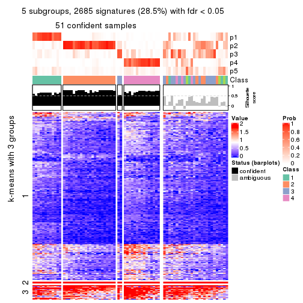</p>

</div>
<div id='tab-ATC-NMF-get-signatures-no-scale-5'>
<pre><code class="r">get_signatures(res, k = 6, scale_rows = FALSE)
</code></pre>

<p></p>

</div>
</div>


Compare the overlap of signatures from different k:

```r
compare_signatures(res)
```


`get_signature()` returns a data frame invisibly. TO get the list of signatures, the function
call should be assigned to a variable explicitly. In following code, if `plot` argument is set
to `FALSE`, no heatmap is plotted while only the differential analysis is performed.

```r
# code only for demonstration
tb = get_signature(res, k = ..., plot = FALSE)
```

An example of the output of `tb` is:

```
#>   which_row         fdr    mean_1    mean_2 scaled_mean_1 scaled_mean_2 km
#> 1        38 0.042760348  8.373488  9.131774    -0.5533452     0.5164555  1
#> 2        40 0.018707592  7.106213  8.469186    -0.6173731     0.5762149  1
#> 3        55 0.019134737 10.221463 11.207825    -0.6159697     0.5749050  1
#> 4        59 0.006059896  5.921854  7.869574    -0.6899429     0.6439467  1
#> 5        60 0.018055526  8.928898 10.211722    -0.6204761     0.5791110  1
#> 6        98 0.009384629 15.714769 14.887706     0.6635654    -0.6193277  2
...
```

The columns in `tb` are:

1. `which_row`: row indices corresponding to the input matrix.
2. `fdr`: FDR for the differential test. 
3. `mean_x`: The mean value in group x.
4. `scaled_mean_x`: The mean value in group x after rows are scaled.
5. `km`: Row groups if k-means clustering is applied to rows.


UMAP plot which shows how samples are separated.


<script>
$( function() {
	$( '#tabs-ATC-NMF-dimension-reduction' ).tabs();
} );
</script>
<div id='tabs-ATC-NMF-dimension-reduction'>
<ul>
<li><a href='#tab-ATC-NMF-dimension-reduction-1'>k = 2</a></li>
<li><a href='#tab-ATC-NMF-dimension-reduction-2'>k = 3</a></li>
<li><a href='#tab-ATC-NMF-dimension-reduction-3'>k = 4</a></li>
<li><a href='#tab-ATC-NMF-dimension-reduction-4'>k = 5</a></li>
<li><a href='#tab-ATC-NMF-dimension-reduction-5'>k = 6</a></li>
</ul>
<div id='tab-ATC-NMF-dimension-reduction-1'>
<pre><code class="r">dimension_reduction(res, k = 2, method = &quot;UMAP&quot;)
</code></pre>

<p></p>

</div>
<div id='tab-ATC-NMF-dimension-reduction-2'>
<pre><code class="r">dimension_reduction(res, k = 3, method = &quot;UMAP&quot;)
</code></pre>

<p></p>

</div>
<div id='tab-ATC-NMF-dimension-reduction-3'>
<pre><code class="r">dimension_reduction(res, k = 4, method = &quot;UMAP&quot;)
</code></pre>

<p></p>

</div>
<div id='tab-ATC-NMF-dimension-reduction-4'>
<pre><code class="r">dimension_reduction(res, k = 5, method = &quot;UMAP&quot;)
</code></pre>

<p></p>

</div>
<div id='tab-ATC-NMF-dimension-reduction-5'>
<pre><code class="r">dimension_reduction(res, k = 6, method = &quot;UMAP&quot;)
</code></pre>

<p>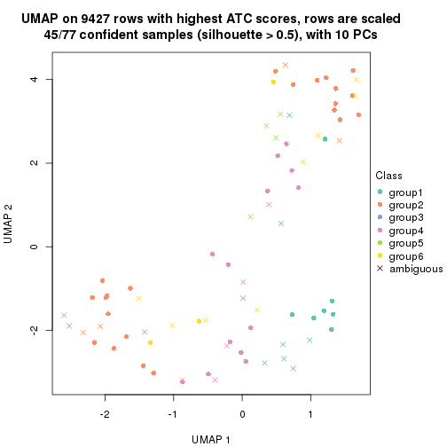</p>

</div>
</div>


Following heatmap shows how subgroups are split when increasing `k`:

```r
collect_classes(res)
```


If matrix rows can be associated to genes, consider to use `GO_Enrichment(res,
...)` to perform function enrichment for the signature genes.


 

## Session info


```r
sessionInfo()
```

```
#> R version 3.6.0 (2019-04-26)
#> Platform: x86_64-pc-linux-gnu (64-bit)
#> Running under: CentOS Linux 7 (Core)
#> 
#> Matrix products: default
#> BLAS:   /usr/lib64/libblas.so.3.4.2
#> LAPACK: /usr/lib64/liblapack.so.3.4.2
#> 
#> locale:
#>  [1] LC_CTYPE=en_GB.UTF-8       LC_NUMERIC=C               LC_TIME=en_GB.UTF-8       
#>  [4] LC_COLLATE=en_GB.UTF-8     LC_MONETARY=en_GB.UTF-8    LC_MESSAGES=en_GB.UTF-8   
#>  [7] LC_PAPER=en_GB.UTF-8       LC_NAME=C                  LC_ADDRESS=C              
#> [10] LC_TELEPHONE=C             LC_MEASUREMENT=en_GB.UTF-8 LC_IDENTIFICATION=C       
#> 
#> attached base packages:
#>  [1] grid      parallel  stats4    stats     graphics  grDevices utils     datasets  methods  
#> [10] base     
#> 
#> other attached packages:
#>  [1] genefilter_1.66.0           ComplexHeatmap_2.1.1        markdown_1.1               
#>  [4] knitr_1.26                  cola_1.3.2                  SummarizedExperiment_1.14.1
#>  [7] DelayedArray_0.10.0         BiocParallel_1.18.1         matrixStats_0.55.0         
#> [10] Biobase_2.44.0              GenomicRanges_1.36.1        GenomeInfoDb_1.20.0        
#> [13] IRanges_2.18.3              S4Vectors_0.22.1            BiocGenerics_0.30.0        
#> [16] GetoptLong_0.1.7           
#> 
#> loaded via a namespace (and not attached):
#>  [1] bitops_1.0-6           bit64_0.9-7            doParallel_1.0.15      RColorBrewer_1.1-2    
#>  [5] httr_1.4.1             backports_1.1.5        tools_3.6.0            R6_2.4.1              
#>  [9] DBI_1.0.0              lazyeval_0.2.2         colorspace_1.4-1       withr_2.1.2           
#> [13] tidyselect_0.2.5       gridExtra_2.3          bit_1.1-14             compiler_3.6.0        
#> [17] xml2_1.2.2             microbenchmark_1.4-7   pkgmaker_0.28          slam_0.1-46           
#> [21] scales_1.1.0           NMF_0.23.6             stringr_1.4.0          digest_0.6.23         
#> [25] XVector_0.24.0         pkgconfig_2.0.3        bibtex_0.4.2           highr_0.8             
#> [29] rlang_0.4.2            GlobalOptions_0.1.1    RSQLite_2.1.2          impute_1.58.0         
#> [33] shape_1.4.4            mclust_5.4.5           dendextend_1.12.0      dplyr_0.8.3           
#> [37] RCurl_1.95-4.12        magrittr_1.5           GenomeInfoDbData_1.2.1 Matrix_1.2-17         
#> [41] Rcpp_1.0.3             munsell_0.5.0          viridis_0.5.1          lifecycle_0.1.0       
#> [45] stringi_1.4.3          zlibbioc_1.30.0        plyr_1.8.4             blob_1.2.0            
#> [49] crayon_1.3.4           lattice_0.20-38        splines_3.6.0          annotate_1.62.0       
#> [53] circlize_0.4.9         zeallot_0.1.0          pillar_1.4.2           rjson_0.2.20          
#> [57] rngtools_1.4           reshape2_1.4.3         codetools_0.2-16       XML_3.98-1.20         
#> [61] glue_1.3.1             evaluate_0.14          vctrs_0.2.0            png_0.1-7             
#> [65] foreach_1.4.7          polyclip_1.10-0        gtable_0.3.0           purrr_0.3.3           
#> [69] clue_0.3-57            assertthat_0.2.1       ggplot2_3.2.1          xfun_0.11             
#> [73] gridBase_0.4-7         eulerr_6.0.0           xtable_1.8-4           skmeans_0.2-11        
#> [77] survival_2.44-1.1      viridisLite_0.3.0      tibble_2.1.3           iterators_1.0.12      
#> [81] memoise_1.1.0          AnnotationDbi_1.46.1   registry_0.5-1         GTF_0.0.1             
#> [85] cluster_2.1.0          brew_1.0-6
```


